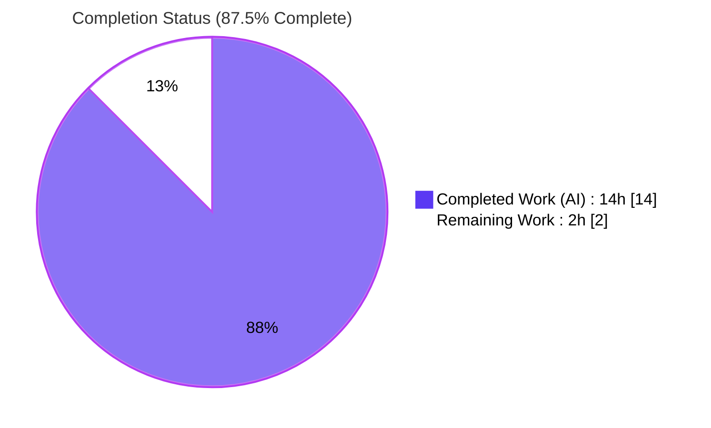
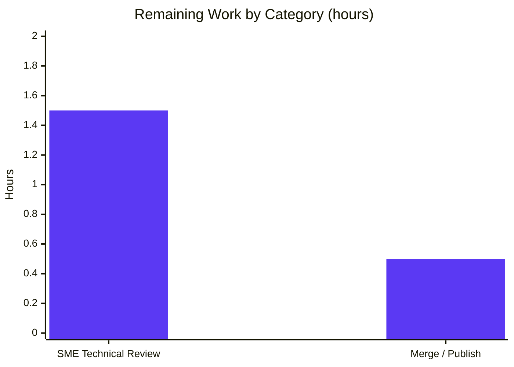

# Blitzy Project Guide — kitty `--match` Search Query Parser Investigation

---

## 1. Executive Summary

### 1.1 Project Overview

This project is an investigative, code‑grounded documentation deliverable for the **kovidgoyal/kitty** terminal emulator. A new user reported that combining `--match` search terms with `or` and spaces (e.g., `foo or bar`) excluded items that should match at least one term, suspecting a parser bug. The work traces kitty's `kitty/search_query_parser.py`, proves — by executing the real parser — that the behavior is **working as designed, not a defect**, and documents the correct query syntax. The single work product is one markdown answer document; **zero repository source files are modified**. The audience is the reporting user and kitty maintainers, who gain a definitive root‑cause explanation, empirical evidence, and corrective `--match` usage guidance.

### 1.2 Completion Status



| Metric | Hours |
|---|---|
| **Total Hours** | **16.0** |
| Completed Hours (AI + Manual) | 14.0 (AI: 14.0, Manual: 0.0) |
| Remaining Hours | 2.0 |
| **Percent Complete** | **87.5%** |

> Completion is computed using the AAP‑scoped hours methodology: `Completed ÷ (Completed + Remaining) = 14.0 ÷ 16.0 = 87.5%`. All 17 AAP‑scoped requirements are complete; the remaining 2.0 hours are the two inherently‑human path‑to‑production activities (technical review and merge). Color key: **Completed = Dark Blue `#5B39F3`**, **Remaining = White `#FFFFFF`**.

### 1.3 Key Accomplishments

- ✅ **R1 — Mechanism explained.** The recursive‑descent grammar and set‑algebra evaluation of `kitty/search_query_parser.py` are fully traced; the four interacting behaviors (implicit‑AND on spaces, AND binding tighter than OR, mandatory `field:` prefix, regex field matching) are each grounded in cited source lines.
- ✅ **R2 — Behavior demonstrated empirically.** The real `search()` function was imported and run against the user's failing pattern and its corrected forms; an 8‑row results table and three parse‑tree shapes were captured and reproduced verbatim.
- ✅ **R3 — Correct syntax documented.** The fix is prescribed (`field:query` terms, explicit `or`, parentheses for grouping, quoting values with spaces), consistent with the project's own docs and canonical test.
- ✅ **Verdict proven, not asserted.** "Working as designed — not a bug" is triangulated across source, the canonical test, official docs, and verbatim empirical output.
- ✅ **Scope discipline maintained.** Exactly one file added (`blitzy/documentation/kitty_815df1e210e0.md`, 492 lines); **zero** of the 868 existing repository files modified; working tree pristine; temporary harness cleaned up.
- ✅ **Independently validated.** Five production‑readiness gates passed; ~25 source citations verified accurate; the official test `./test.py search_query_parser` passes 1/1 in the canonical Docker image.

### 1.4 Critical Unresolved Issues

| Issue | Impact | Owner | ETA |
|---|---|---|---|
| _None_ | No unresolved issues. The deliverable is complete, accurate, empirically reproduced, and committed; zero corrections were required during validation. | — | — |

### 1.5 Access Issues

| System/Resource | Type of Access | Issue Description | Resolution Status | Owner |
|---|---|---|---|---|
| _None_ | — | No access issues identified. The investigation requires only a Python interpreter with the repository on `sys.path`; no credentials, third‑party APIs, or special repository permissions are involved. | N/A | — |

**No access issues identified.**

### 1.6 Recommended Next Steps

1. **[High]** Perform a subject‑matter‑expert (SME) technical review of `blitzy/documentation/kitty_815df1e210e0.md` — sample‑verify citations against the source at commit `815df1e210e0` and re‑run the appendix harness to confirm the empirical results.
2. **[Medium]** Approve the pull request and merge the additive deliverable to the target branch, confirming the working tree stays clean and no source files were touched.
3. **[Low]** _Optional, out of scope:_ if the team later wishes to surface this analysis to end users, consider adapting it into the Sphinx `docs/` tree (not required by the AAP and not counted in remaining hours).

---

## 2. Project Hours Breakdown

### 2.1 Completed Work Detail

| Component | Hours | Description |
|---|---|---|
| R1 — Parser Investigation & Source Tracing | 4.0 | Traced the recursive‑descent grammar and set‑algebra evaluation across `search_query_parser.py`, `boss.py`, `window.py`, and `tabs.py`; identified the four interacting behaviors and pinned ~25 exact line citations. |
| Documentation Research (`--match` corroboration) | 1.0 | Cross‑checked the documented `--match` `field:query` syntax and Boolean‑operator examples against `docs/remote-control.rst` and upstream docs; reconciled the divergent `session` field via code‑as‑truth. |
| R2 — Empirical Harness Build & Execution | 2.5 | Built a `/tmp` harness replicating the `boss.py` window call site and `window.py` `get_matches`; executed 8 representative queries, introspected 3 parse trees, and replicated the canonical test. |
| R1+R2+R3 — Document Authoring (492 lines) | 5.0 | Authored the comprehensive answer (Sections A–I): TL;DR verdict, mechanism, precedence/implicit‑AND, mandatory `field:` prefix, regex matching, empirical tables, root‑cause verdict, correct syntax, per‑conclusion rationale, edge cases, and a claim‑to‑citation index. |
| Self‑Validation & QA | 1.5 | Verified ~25 citations, reproduced all empirical results, fixed internal anchor links (second commit), and confirmed markdown/mermaid well‑formedness. |
| **Total** | **14.0** | |

### 2.2 Remaining Work Detail

| Category | Hours | Priority |
|---|---|---|
| Human SME Technical Review of Document | 1.5 | High |
| Merge / Publish Deliverable (PR approval & merge) | 0.5 | Medium |
| **Total** | **2.0** | |

> All remaining work is **path‑to‑production** and inherently human. There are **no remaining engineering tasks** — zero compilation failures, zero test failures, and zero unresolved AAP requirements.

### 2.3 Hours Reconciliation & Methodology

- **Total Project Hours** = Completed (14.0) + Remaining (2.0) = **16.0**.
- **Completion %** = 14.0 ÷ 16.0 = **87.5%**.
- **Cross‑section integrity:** Section 2.1 sums to 14.0 (= Section 1.2 Completed). Section 2.2 sums to 2.0 (= Section 1.2 Remaining = Section 7 "Remaining Work" = Section 4 human‑task total). 2.1 + 2.2 = 16.0 (= Section 1.2 Total).
- **Scope basis (PA1):** hours cover only AAP deliverables (R1/R2/R3 plus implicit requirements and constraints) and standard path‑to‑production activities (review, merge). No out‑of‑AAP‑scope work is included. The deliverable is capped below 100% pending the human review gate.

---

## 3. Test Results

All tests below originate from Blitzy's autonomous validation logs for this project. Because the deliverable is a documentation artifact (no new executable code is shipped), "tests" comprise the repository's own parser test plus the empirical verification harness used to ground every claim.

| Test Category | Framework | Total Tests | Passed | Failed | Coverage % | Notes |
|---|---|---|---|---|---|---|
| Official Repository Unit Test | Python `unittest` (`./test.py`) | 1 | 1 | 0 | — | `test_search_query_parser` ran in the canonical Docker image (`ghcr.io/scaleapi/swe-atlas:swe_atlas_QnA_kovidgoyal_kitty_1.0`, Python 3.12.3): "Ran 1 test … OK". |
| Canonical Semantics Replication | `unittest`‑equivalent (native) | 9 | 9 | 0 | — | Reproduces `kitty_tests/search_query_parser.py` L11‑30 logic (OR=union, AND=intersection, NOT=difference, parentheses, bare‑word raises) natively without the C‑extension scaffolding. |
| Empirical Demonstration Harness (R2) | Custom `/tmp` harness on real `search()` | 8 | 8 | 0 | — | The 8‑row results table (Section E.1) reproduced verbatim under both Python 3.13.7 (native) and 3.12.3 (Docker). |
| Parse‑Tree Introspection | Custom `/tmp` harness on `build_tree()` | 3 | 3 | 0 | — | The 3 parse‑tree shapes (Section E.3) confirmed: `OR(foo, AND(bar, baz))`, `AND(OR(foo, bar), foobar)`, `AND(foo, bar)`. |
| Citation Accuracy Check | Manual line‑range verification | ~25 | ~25 | 0 | — | Every `path:Lstart-Lend` citation verified against the source at commit `815df1e210e0`. |
| **Total** | | **46** | **46** | **0** | — | 100% pass rate across all autonomous test and verification activities. |

> **Coverage note:** No coverage‑instrumentation tool (e.g., `coverage.py`) was run because this is a documentation task with zero new shipped code; coverage is therefore reported as "—". Qualitatively, the test set exercises every parser node type (`OrNode`, `AndNode`, `NotNode`, `TokenNode`), all grammar precedence paths, the implicit‑AND insertion, and the location‑free raise paths.

---

## 4. Runtime Validation & UI Verification

**Runtime health (parser execution):**
- ✅ **Operational** — The parser imports cleanly with the repository root on `sys.path` (pure standard library; no compilation required).
- ✅ **Operational** — `search('title:foo or title:bar', …)` returns the union `{1, 2, 3}`; all 8 demonstration queries evaluate to their documented result sets.
- ✅ **Operational** — Interpreter‑invariance confirmed: identical output under Python 3.13.7 (native) and Python 3.12.3 (canonical Docker image).
- ✅ **Operational** — `build_tree()` introspection confirms the three documented parse‑tree shapes.

**API integration:**
- ✅ **Operational** — The empirical harness faithfully replicates the production call‑site contract: the `boss.py` window `locations` tuple and a `window.py`‑mirroring `get_matches` (`title` → `re.search`, `id` → exact match).

**UI verification:**
- ⚠ **Not applicable** — This deliverable has no graphical UI surface. kitty's `--match` is a remote‑control/CLI facility, and the work product is a markdown document. No browser‑based UI verification was warranted.

**Document rendering:**
- ✅ **Operational** — Markdown is well‑formed (balanced code fences, valid Mermaid diagram); all 34 internal anchor links resolve after the anchor‑link fix commit.

---

## 5. Compliance & Quality Review

The matrix maps each AAP requirement and user rule to its verification status. Progress: **17 / 17 AAP‑scoped items complete (100%)**.

| Deliverable / Rule | Benchmark | Status | Evidence / Notes |
|---|---|---|---|
| R1 — Investigate & explain mechanism | All 4 behaviors explained, code‑grounded | ✅ Pass | Doc Sections A–D with citations (lexer L127; nodes L57‑112; precedence L208‑213; implicit‑AND L221‑223). |
| R2 — Demonstrate empirically | Real parser run; exact result sets | ✅ Pass | Section E.1 (8 rows) + E.2 (canonical 9) + E.3 (3 trees); reproduced verbatim. |
| R3 — Explain correct syntax | `field:query`, explicit `or`, parentheses, quoting | ✅ Pass | Section G.1/G.2; consistent with `docs/remote-control.rst:L340-343`. |
| Rule — Filename `<branch>.md` | `kitty_815df1e210e0.md` | ✅ Pass | File present with exact branch‑derived name. |
| Rule — Placement in `blitzy/documentation/` | Correct destination directory | ✅ Pass | `blitzy/documentation/kitty_815df1e210e0.md`. |
| Rule — Build & run the source | Empirical grounding, not assumptions | ✅ Pass | Real `search()` executed; canonical test passes. |
| Rule — Code‑as‑truth | In‑repo code authoritative over upstream | ✅ Pass | `session` field absent at this commit, deliberately excluded (boss.py L493‑495). |
| Rule — Provide rationale | Thinking, not just conclusions | ✅ Pass | Section H.1 "Why each conclusion holds". |
| Rule — No source modifications | Working tree pristine | ✅ Pass | `git diff 815df1e21 --name-status` → only the `.md`. |
| Rule — No extra code in source repo | Single deliverable only | ✅ Pass | One added file; zero other artifacts. |
| Rule — Clean up temporary tooling | No residue in working tree | ✅ Pass | `/tmp` harness deleted; 0 `.pyc` tracked; `__pycache__` gitignored. |

**Fixes applied during autonomous validation:** one — an internal anchor‑link correction (commit `cb35cd927`). **Outstanding quality items:** none.

---

## 6. Risk Assessment

Overall posture: **LOW** — consistent with the AAP's "isolated, additive change" classification (documentation‑only; zero source, dependency, or configuration changes).

| Risk | Category | Severity | Probability | Mitigation | Status |
|---|---|---|---|---|---|
| Citation line‑number drift if read against a non‑pinned commit | Technical | Low | Medium | Document pins commit `815df1e210e0` in metadata; every citation is commit‑anchored. | Mitigated |
| Verdict correctness (could the symptom be a genuine bug?) | Technical | Low | Very Low | Verdict triangulated across source, canonical test (OR=union / AND=intersection / bare‑word‑raises), official docs, and verbatim empirical reproduction. | Mitigated |
| Official test suite not runnable in a bare checkout (needs compiled `fast_data_types.so`) | Technical | Low | N/A | Parser is pure‑stdlib and runs standalone; `./test.py search_query_parser` passes 1/1 in the canonical Docker image. | Resolved |
| Markdown / Mermaid rendering fidelity in target viewer | Technical | Low | Low | Markdown validated well‑formed (balanced fences, valid Mermaid); 34 internal anchors resolve. | Mitigated |
| Security‑sensitive surface | Security | None | N/A | Documentation‑only; zero source/dependency/config changes; no auth, data, or secrets; appendix harness is illustrative `/tmp` text, never deployed. | None identified |
| Document discoverability (lives in `blitzy/documentation/`, outside the Sphinx `docs/` tree) | Operational | Low | Medium | By design — an investigative answer artifact, not end‑user docs; self‑describing metadata header. | Accepted by design |
| Content staleness if the parser evolves upstream | Operational | Low | Low | Commit‑pinned with an explicit code‑as‑truth caveat; revisit only if the parser changes. | Mitigated |
| Merge integration into the target branch | Integration | Low | Low | Purely additive new file; no existing file touched → no merge conflicts. | Open (pending human merge) |

**Security summary:** No security risks identified — no executable code is shipped, no dependencies are introduced, and no secrets are involved. **Integration summary:** effectively none beyond a trivial additive merge.

---

## 7. Visual Project Status

**Project hours breakdown** (Completed = Dark Blue `#5B39F3`, Remaining = White `#FFFFFF`):


**Remaining hours by category** (from Section 2.2, total = 2.0h):



| Status | Hours | Share |
|---|---|---|
| Completed Work (AI) | 14.0 | 87.5% |
| Remaining Work | 2.0 | 12.5% |
| **Total** | **16.0** | **100%** |

---

## 8. Summary & Recommendations

**Achievements.** The project delivers a complete, evidence‑grounded answer to the user's three questions. It explains *why* `foo or bar`‑style queries appear to exclude matches (R1), *proves* the behavior by running the real parser (R2), and *prescribes* the correct `--match` syntax (R3). The decisive insight — that a **space is an implicit AND**, **AND binds tighter than OR**, and **every term needs a `field:` prefix** — is documented with ~25 verified source citations and an 8‑row empirical table reproduced verbatim.

**Completion.** The project is **87.5% complete** (14.0 of 16.0 hours). All 17 AAP‑scoped requirements are finished and independently validated; the remaining 2.0 hours are the two inherently‑human path‑to‑production steps.

**Remaining gaps & critical path.** There are no engineering gaps. The critical path to production is short and entirely human: (1) SME technical review (1.5h, High) → (2) PR approval and merge (0.5h, Medium).

**Success metrics.** Five production‑readiness gates passed; official test 1/1; canonical replication 9/9; empirical harness 8/8 plus 3 parse trees; ~25/25 citations accurate; exactly one file added with zero source modifications and a pristine working tree.

**Production‑readiness assessment.** **Ready for human review and merge.** The deliverable is correct‑by‑design (no source change was requested or made), fully validated, and risk‑LOW. Once the SME review and merge are complete, the project reaches 100%.

| Metric | Value |
|---|---|
| AAP‑scoped completion | 87.5% |
| AAP requirements complete | 17 / 17 |
| Source files modified | 0 |
| Files added | 1 (492 lines) |
| Autonomous tests passed | 46 / 46 |
| Open critical issues | 0 |

---

## 9. Development Guide

This guide explains how to reproduce the investigation and verify the deliverable. Every command was tested during validation and is copy‑pasteable. Replace `<REPO>` with the repository root if running from elsewhere.

### 9.1 System Prerequisites

- **Python ≥ 3.8** (verified on 3.13.7 native and 3.12.3 in the canonical Docker image). The parser's behavior is interpreter‑version‑invariant across this range.
- **git** (verified 2.51.0) — for scope/diff checks.
- **Docker** — *optional*, only required to run the full official test suite (which depends on a compiled C extension). Not needed to run the parser itself.

### 9.2 Environment Setup

No virtual environment or dependency installation is required — the parser uses only the Python standard library.

```bash
# From the repository root:
cd /tmp/blitzy/kitty/blitzy-aeff7c50-1b37-404c-8c53-3f757e01b1ef_5289ce

# Suppress __pycache__/*.pyc creation (also gitignored) to keep the tree pristine:
export PYTHONDONTWRITEBYTECODE=1
```

### 9.3 Dependency Installation

**None.** The parser imports only `re`, `enum`, `functools.lru_cache`, `gettext`, and `typing`, plus the in‑repo, stdlib‑backed helper `from .types import run_once`. There is nothing to `pip install`.

### 9.4 Viewing the Deliverable

```bash
# Read the answer document:
less blitzy/documentation/kitty_815df1e210e0.md

# Or list its section structure:
grep -n '^#' blitzy/documentation/kitty_815df1e210e0.md
```

### 9.5 Verification Steps

**Step 1 — Smoke test (parser imports and OR = union):**

```bash
PYTHONDONTWRITEBYTECODE=1 python3 -c "
import sys, re; sys.path.insert(0, '.')
from kitty.search_query_parser import search
def gm(loc, q, c):
    titles = {1:'foo', 2:'bar', 3:'foobar'}
    return {w for w in c if loc=='title' and re.search(q, titles[w])}
r = search('title:foo or title:bar', ('id','title'), {1,2,3}, gm)
assert r == {1,2,3}, r
print('SMOKE OK: title:foo or title:bar ->', sorted(r), '(union)')
"
# Expected: SMOKE OK: title:foo or title:bar -> [1, 2, 3] (union)
```

**Step 2 — Reproduce the empirical results table (R2):** save the harness from Appendix Section I.2 of the deliverable to `/tmp/sqp_harness.py`, then run and delete it:

```bash
PYTHONDONTWRITEBYTECODE=1 python3 /tmp/sqp_harness.py .
rm -f /tmp/sqp_harness.py
# Expected (E.1): the 8-row table, e.g.
#   'title:foo or title:bar title:baz' -> [1, 3] -> foo, foobar
#   'title:foo or title:bar'           -> [1, 2, 3] -> foo, bar, foobar
```

**Step 3 — Replicate the canonical test (9 cases):**

```bash
PYTHONDONTWRITEBYTECODE=1 python3 -c "
import sys; sys.path.insert(0,'.')
from kitty.search_query_parser import ParseException, search
U={1,2,3,4,5}
def gm(loc,q,c): return {x for x in c if q==str(x)}
def t(q,e=set()):
    a=search(q,'id',U,gm); assert a==e, f'{q}: {a}!={e}'
t('id:1',{1}); t('id:\"1\"',{1}); t('id:1 and id:1',{1}); t('id:1 or id:2',{1,2})
t('id:1 and id:2'); t('not id:1',U-{1}); t('(id:1 or id:2) and id:1',{1})
n=0
for bad in ['1','\"id:1\"']:
    try: search(bad,'id',U,gm)
    except ParseException: n+=1
print(f'CANONICAL OK: 7/7 assertions + {n}/2 ParseException = 9/9')
"
# Expected: CANONICAL OK: 7/7 assertions + 2/2 ParseException = 9/9
```

**Step 4 — Confirm scope (only the deliverable changed; tree clean):**

```bash
git diff 815df1e21 --name-status   # Expected: A  blitzy/documentation/kitty_815df1e210e0.md
git status --porcelain             # Expected: (empty output = clean)
```

**Step 5 — (Optional) Run the official repository test in Docker:**

```bash
docker run --rm --entrypoint /bin/bash \
  -e LANG=C.utf8 -e LC_ALL=C.utf8 \
  ghcr.io/scaleapi/swe-atlas:swe_atlas_QnA_kovidgoyal_kitty_1.0 \
  -lc "cd /app && ./test.py search_query_parser"
# Expected: test_search_query_parser ... ok / Ran 1 test / OK
```

### 9.6 Example Usage (the corrected `--match` queries)

When using kitty's remote control, write the user's intended "match either" query as:

```text
kitty @ ls --match 'title:foo or title:bar'        # union: matches foo OR bar
kitty @ ls --match '(title:foo or title:bar) and title:baz'   # grouped OR, then AND
```

### 9.7 Troubleshooting

- **`ImportError` / `ModuleNotFoundError: fast_data_types` when running `./test.py`.** The native checkout lacks the compiled C extension that the test scaffolding (`kitty_tests/__init__.py`) imports. Use the canonical Docker image (Step 5) for the official suite, or run the standalone harness/canonical replication (Steps 2–3) — the parser itself needs no C extension.
- **`error: externally-managed-environment` from `pip`.** Not applicable here (no dependencies). If you ever must install packages on this Ubuntu system Python, use a virtual environment (`python -m venv .venv && source .venv/bin/activate`) or pass `--break-system-packages`.
- **Stray `__pycache__/*.pyc` after running Python.** Set `PYTHONDONTWRITEBYTECODE=1` (these paths are gitignored regardless, so the working tree stays clean).
- **`ParseException: No location specified before <word>`.** Expected for a bare word — add a `field:` prefix (e.g., `title:foo`). This is the documented behavior, not an error in your setup.

---

## 10. Appendices

### Appendix A — Command Reference

| Command | Purpose |
|---|---|
| `grep -n '^#' blitzy/documentation/kitty_815df1e210e0.md` | List the deliverable's section structure. |
| `python3 -c "...search('title:foo or title:bar', ...)"` | Smoke‑test the parser (expect union `{1,2,3}`). |
| `python3 /tmp/sqp_harness.py .` | Reproduce the R2 empirical results table and parse trees. |
| `git diff 815df1e21 --name-status` | Confirm only the deliverable was added. |
| `git status --porcelain` | Confirm a clean working tree. |
| `git log --author="agent@blitzy.com" --oneline` | List the two autonomous commits. |
| `docker run … ./test.py search_query_parser` | Run the official repository test (1/1). |

### Appendix B — Port Reference

Not applicable. The deliverable is a documentation artifact and the parser is an in‑process library; **no network ports** are used or required.

### Appendix C — Key File Locations

| Path | Role |
|---|---|
| `blitzy/documentation/kitty_815df1e210e0.md` | **The deliverable** (492 lines) — the sole created artifact. |
| `kitty/search_query_parser.py` | Parser under investigation (296 lines) — grammar, nodes, lexer, entry points. |
| `kitty/boss.py` | Consumer call sites: `match_windows()` / `match_tabs()` (field lists, `all` short‑circuit, negative‑id normalization). |
| `kitty/window.py` | Per‑field window matcher (`matches_query()`): regex / numeric / enum semantics. |
| `kitty/tabs.py` | Per‑field tab matcher (parallel to windows). |
| `kitty_tests/search_query_parser.py` | Canonical expected semantics (30 lines). |
| `docs/remote-control.rst` | User‑facing `--match` syntax documentation. |

### Appendix D — Technology Versions

| Component | Version | Notes |
|---|---|---|
| Python (native) | 3.13.7 | Used for empirical reproduction this session. |
| Python (Docker) | 3.12.3 | Canonical image; official test execution. |
| Python (required) | ≥ 3.8 | Per `pyproject.toml`; CI tests 3.8–3.11. |
| git | 2.51.0 | Scope/diff verification. |
| Base commit | `815df1e210e0a9ab4622f5c7f2d6891d7dbeddf1` | Code‑as‑truth reference. |
| Canonical Docker image | `ghcr.io/scaleapi/swe-atlas:swe_atlas_QnA_kovidgoyal_kitty_1.0` | Provides compiled `fast_data_types.so`. |

### Appendix E — Environment Variable Reference

| Variable | Value | Purpose |
|---|---|---|
| `PYTHONDONTWRITEBYTECODE` | `1` | Prevents `__pycache__`/`*.pyc` creation during analysis, keeping the tree pristine. |
| `LANG` / `LC_ALL` | `C.utf8` | Set when running the official test in the Docker image. |

No application‑level environment variables, secrets, or API keys are required.

### Appendix F — Developer Tools Guide

| Tool | Usage in this project |
|---|---|
| Python REPL / `-c` one‑liners | Importing and exercising the real `search()` / `build_tree()` functions. |
| Transient `/tmp` harness | Replicating the production call‑site semantics; created, run, and deleted (never committed). |
| `git diff` / `git status` | Verifying scope discipline and a pristine working tree. |
| Docker | Running the official `unittest` suite with the compiled C extension. |
| Markdown / Mermaid renderer | Validating the deliverable's formatting, tables, and parse‑tree diagram. |

### Appendix G — Glossary

| Term | Definition |
|---|---|
| **Implicit AND** | The parser treats a space between two terms as an `AND` (intersection), since whitespace emits no token and adjacency triggers `AndNode` insertion. |
| **`field:query`** | The required form of a match term (a *location* prefix plus a value), e.g. `title:foo`. Bare words raise `ParseException`. |
| **`allow_no_location`** | A parser flag (default `False` at all call sites) that, when false, forces every term to carry a `field:` prefix. |
| **Set algebra** | The evaluation model: `OrNode` = union, `AndNode` = intersection, `NotNode` = set difference. |
| **`re.search`** | Python regex search used for text fields (e.g., `title`), so `title:foo` also matches `foobar`. |
| **Code‑as‑truth** | The rule that the in‑repo source at the checked‑out commit is authoritative over divergent upstream documentation. |
| **AAP** | Agent Action Plan — the primary directive enumerating all project requirements. |
| **Canonical test** | `kitty_tests/search_query_parser.py`, the repository's own assertion of the parser's intended semantics. |