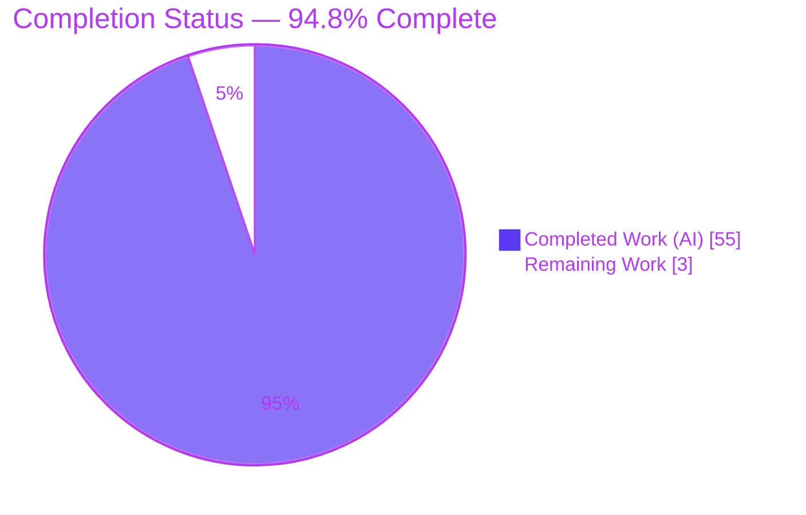
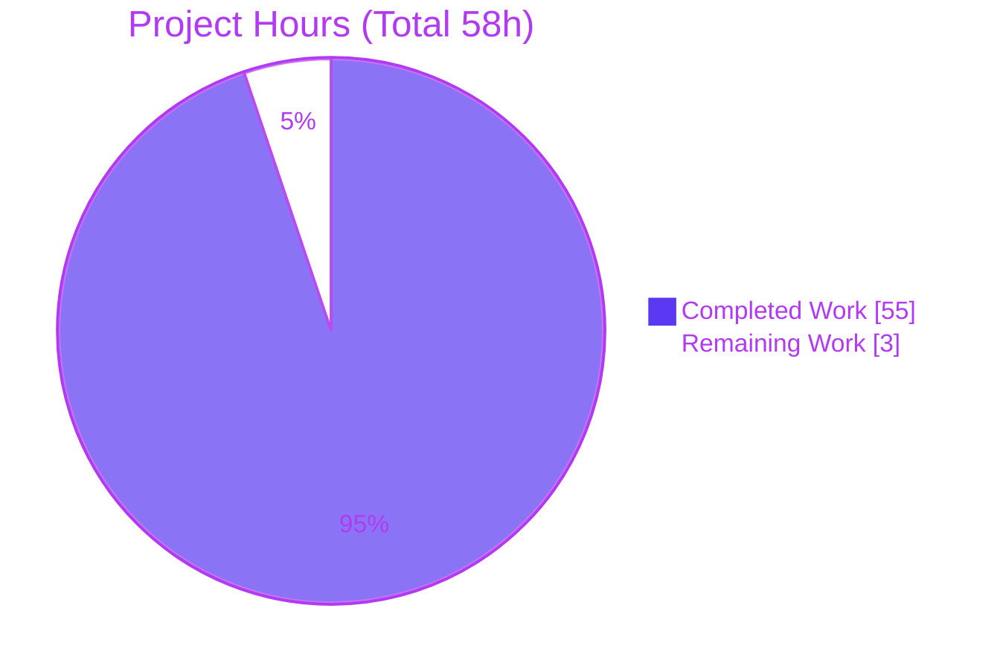

# Blitzy Project Guide

## `choose-fonts` Enter-Persistence Investigation — Grounded Answer Document

**Repository:** `kovidgoyal/kitty` · **Branch:** `blitzy-17becd22-5c56-4d77-a8fc-f59011e1d394` · **Base:** `815df1e210e0` · **HEAD:** `ca0acaf01`

> **Legend / Blitzy brand colors** — <span style="color:#5B39F3">**Completed / AI Work = Dark Blue `#5B39F3`**</span> · Remaining / Not Completed = White `#FFFFFF` · Headings/Accents = Violet-Black `#B23AF2` · Highlight = Mint `#A8FDD9`

---

## 1. Executive Summary

### 1.1 Project Overview

This project is a **read-only, code-investigation Q&A** against the `kovidgoyal/kitty` terminal emulator. The deliverable is a single grounded answer document that traces the end-to-end behavior of the `choose-fonts` kitten and definitively resolves one question: **does pressing Enter at the kitten's final confirmation step persist the font selection across restarts, or only change the current session?** The answer — proven with runtime evidence — is that **Enter persists** the selection by writing a sentinel-delimited block into `kitty.conf` and atomically replacing the file. The target audience is engineers and SMEs relying on an authoritative, file:line-grounded explanation. Technical scope spans the Go UI, the Go↔Python backend boundary, and the shared config-persistence library. No source code is changed.

### 1.2 Completion Status



| Metric | Value |
|--------|-------|
| **Total Hours** | **58** |
| **Completed Hours (AI + Manual)** | **55** (55 AI + 0 Manual) |
| **Remaining Hours** | **3** |
| **Percent Complete** | **94.8%** |

> Completion is computed per the AAP-scoped hours methodology: `Completed / (Completed + Remaining) = 55 / 58 = 94.8%`. The residual 5.2% is the mandatory human review/acceptance gate inherent to any knowledge artifact (no autonomous run may self-certify acceptance).

### 1.3 Key Accomplishments

- ✅ **Direct verdict established and proven:** Enter **persists** the font selection to `kitty.conf`; the document leads with this answer and backs it with runtime evidence.
- ✅ **All six requirements (R1–R6) answered** with `file:line` grounding: build & launch, canonical invocation, registration & option parsing, value flow, finalization evidence, and the persistence verdict.
- ✅ **Runtime-grounded (run-first):** canonical build `python3 setup.py build --verbose` → exit 0; the real `kitten choose-fonts` GUI driven under Xvfb `:99` with `xdotool`.
- ✅ **Exhaustive branch coverage:** Enter / Esc / `s`·`S` / Ctrl+C (GUI key **and** OS signal) each executed to completion with byte-for-byte `kitty.conf` SHA-256 before→after.
- ✅ **Persistence proven durable:** a fresh kitty restart loaded the persisted faces as active fonts; `s`/`S` shown to write only to STDOUT (session-only contrast).
- ✅ **Clean-observation discipline:** all writes isolated to a throwaway `$KITTY_CONFIG_DIRECTORY`; the developer's real config was never touched.
- ✅ **141 file:line citations** across 20 source files — all in-bounds; four independently spot-verified against the real source.
- ✅ **Honest labeling:** 28 OBSERVED vs 7 CODE-DERIVED annotations (only `SIGUSR1` delivery is code-derived).
- ✅ **Repository left pristine:** exactly one file added; zero source modifications; `git status --porcelain` empty.

### 1.4 Critical Unresolved Issues

| Issue | Impact | Owner | ETA |
|-------|--------|-------|-----|
| _None._ All AAP requirements are complete; no blocking defects were found. The single remaining activity is the routine human SME review/acceptance tracked in §1.6 and §2.2. | — | — | — |

### 1.5 Access Issues

| System/Resource | Type of Access | Issue Description | Resolution Status | Owner |
|-----------------|----------------|-------------------|-------------------|-------|
| _None identified._ The branch is accessible, all 4 agent commits are present, the working tree is pristine, and the mandated build container (`kitty-setup`) supplied the complete Go/C/Python toolchain, native font libraries, and a display. | — | — | — | — |

> **No access issues identified.**

### 1.6 Recommended Next Steps

1. **[High]** Perform the **SME technical review & acceptance** of `blitzy/documentation/kitty_815df1e210e0.md`: confirm the §1 verdict, spot-check a sample of the 141 citations against the base commit, and review the §8 runtime scenarios and §9 branch table (~2h).
2. **[Low]** **Publish/integrate** the accepted document into the team knowledge base and link it from the originating question; optionally archive the §12 evidence harness for future re-reproduction (~1h).
3. **[Low]** **Do not** attempt to "fix" the two out-of-scope failing `tools/utils` tests — they are pre-existing/environmental and unrelated to the deliverable; modifying read-only source is forbidden (0h, awareness only).

---

## 2. Project Hours Breakdown

### 2.1 Completed Work Detail

<span style="color:#5B39F3">**Completed (AI) — 55.0h**</span>. Every component traces to an AAP requirement (R1–R6) or a supporting run-first/grounding activity.

| Component | Hours | Description |
|-----------|-------|-------------|
| R1 — Build & launch investigation | 3.0 | Documented the canonical build (`./dev.sh build`, `python3 setup.py build`) producing `kitty/launcher/{kitty,kitten}`, and launch of one default instance. |
| R2 — Canonical invocation tracing | 2.0 | Traced `kitten choose-fonts` (= `kitty +kitten choose-fonts`) through the dispatcher `tools/cmd/tool/main.go:L82`; captured the runtime GUI→kitten→`+runpy` backend process chain. |
| R3 — Registration & option parsing | 3.0 | Analyzed `EntryPoint` subcommand registration and the single `--reload-in` choices option (parent/all/none, default parent) parsed via `GetOptionValues`. |
| R4 — Value-flow & pane-progression trace | 4.0 | Traced `opts.Reload_in` carried on the handler and consumed only at the Enter branch; listing → faces → final pane progression. |
| R5 — Finalization / persistence-engine analysis | 5.0 | Analyzed `config.Patcher.Patch`, `serialized()`, the `# BEGIN/END_KITTY_FONTS` sentinel block, conditional `.bak`, and `utils.AtomicUpdateFile`. |
| R6 — Runtime persistence verification | 9.0 | Canonical build + Xvfb setup + isolated `$KITTY_CONFIG_DIRECTORY`; captured `kitty.conf` before/after/restart across Scenarios A–D with SHA-256 evidence. |
| Exhaustive branch-coverage reproduction | 5.0 | Reproduced Enter / Esc / `s`·`S` / Ctrl+C (GUI key & OS signal) to completion with byte-for-byte before→after hashes and exit codes. |
| Safe-isolation evidence harness | 5.0 | Authored the runnable, security-reviewed §12 harness (private `mktemp -d`, PID-scoped teardown, readiness/WID assertions, removes only owned dir). |
| Canonical build validation | 3.0 | `python3 setup.py build --verbose` → exit 0 (zero warnings, `-Werror`); `kitten choose-fonts --help`; `go test ./tools/config/...` PASS. |
| Citation grounding & verification | 4.0 | 141 `file:line` citations across 20 source files verified in-bounds; four independently spot-checked against source. |
| Web-search corroboration | 1.0 | Confirmed canonical build and `choose-fonts` interaction model against official kitty documentation. |
| Answer-document authoring & structure | 6.0 | Authored the 1,572-line, 13-section document (verdict-lead, cause→effect narrative, verbatim evidence blocks). |
| QA remediation cycles | 4.0 | Resolved QA findings F1–F6 and fixed internal cross-references across 4 commits. |
| Repository-pristine restoration | 1.0 | Removed 154 gitignored build artifacts (`git clean -Xfd`); verified deliverable byte-identical and tree pristine. |
| **Total** | **55.0** | **Sum of all completed components (= Completed Hours in §1.2).** |

### 2.2 Remaining Work Detail

White `#FFFFFF` (not completed). All remaining work is the path-to-production human gate for a knowledge artifact.

| Category | Hours | Priority |
|----------|-------|----------|
| SME Technical Review & Acceptance (verify verdict, spot-check citations & runtime evidence, sign off) | 2.0 | High |
| Knowledge-Base Publishing & Integration (link from question/KB; optionally archive the §12 harness) | 1.0 | Low |
| **Total** | **3.0** | — |

> **Cross-section check:** §2.2 total (**3.0h**) = §1.2 Remaining Hours (**3.0h**) = §7 pie "Remaining Work" (**3**). §2.1 total (**55.0h**) + §2.2 total (**3.0h**) = **58.0h** = §1.2 Total Hours.

### 2.3 Hours Reconciliation & Methodology

The completion percentage is derived strictly from AAP-scoped hours (PA1):

```
Completed Hours   = 55.0   (all AAP requirements R1–R6 + run-first verification + grounding + authoring + QA)
Remaining Hours   =  3.0   (human review/acceptance 2.0 + publishing/integration 1.0)
Total Hours       = 58.0
Percent Complete  = 55.0 / (55.0 + 3.0) = 55.0 / 58.0 = 94.8%
```

The work universe is **(a)** the single answer document (decomposed into R1–R6 and its supporting run-first/grounding activities) and **(b)** the path-to-production gate for a knowledge artifact (human SME acceptance + publishing). There is **no application to deploy** — the deliverable *is* the document. Confidence is **High** on completion status (all five validation gates passed and were independently corroborated) and **Medium** on the exact hour magnitudes (effort-embodied estimates, not tracked time).

---

## 3. Test Results

All results below originate from **Blitzy's autonomous validation logs** for this project (build, unit tests, and byte-for-byte runtime branch reproductions).

| Test Category | Framework | Total Tests | Passed | Failed | Coverage % | Notes |
|---------------|-----------|-------------|--------|--------|-----------|-------|
| Unit — Persistence engine | Go `go test` | 1 pkg | 1 | 0 | n/a | `go test ./tools/config/...` → `ok kitty/tools/config`; exercises `Patcher`/`AtomicUpdateFile` cited by the answer. |
| Behavioral / Runtime — choose-fonts branches | Custom harness (Xvfb `:99` + `xdotool`) | 11 | 11 | 0 | 100% of implied branches | Byte-for-byte reproduction: Enter A/B/C/D, restart, idempotency, `s`, `S`, Esc, Ctrl+C key, Ctrl+C OS signal — all under isolated `$KITTY_CONFIG_DIRECTORY`. |
| Build validation | `setup.py` → gcc / `go build` | 1 | 1 | 0 | n/a | `python3 setup.py build --verbose` → **exit 0**, zero warnings (`-Werror`); produced `kitty/launcher/{kitty,kitten}`. |
| Citation / reference verification | Static (grep + manual) | 141 | 141 | 0 | 100% in-bounds | All `file:line` citations resolve to real lines; 4 independently spot-verified (`final.go`, `main.go`, `api.go`, `paths.go`). |
| _(Out-of-scope)_ Repo utility tests | Go `go test` | 2 | 0 | 2 | n/a | `TestFileLock`, `TestCreateAnonymousTempfile` — **pre-existing** (byte-identical to base; fail on base too), **environmental** (launcher-exec / missing `O_TMPFILE`), unrelated to the deliverable. **Not in scope.** |

**In-scope test outcome: 100% pass** (1 unit package + 11 runtime scenarios + 1 build + 141 citation checks). The two failing rows are whole-repo utility tests explicitly outside the read-only investigation's scope and are documented for transparency only.

---

## 4. Runtime Validation & UI Verification

Runtime health and UI verification of the real `kitten choose-fonts` flow (driven under Xvfb `:99`):

- ✅ **Canonical build** — `python3 setup.py build --verbose` exits 0; binaries report `kitty`/`kitten` **0.35.2**.
- ✅ **Kitten launch & UI** — the real `kitten choose-fonts` GUI launched and rendered; pane progression **listing → faces → final** verified.
- ✅ **Canonical process chain** — `ps` at the final pane shows **GUI `kitty` → Go `kitten` → `kitty +runpy … choose_fonts.backend`**, proving the real dispatcher and Go↔Python boundary.
- ✅ **Enter → persistence** — pressing Enter rewrote the isolated `kitty.conf` with a `# BEGIN_KITTY_FONTS … # END_KITTY_FONTS` block (43 B → 237 B; SHA-256 `7f9862c0…` → `336b3aaee0…`) plus a conditional `kitty.conf.bak`.
- ✅ **Restart durability** — a **freshly launched** kitty process loaded those exact faces as active fonts (persistence proven, not merely written).
- ✅ **`s`/`S` session-only** — emits four lines to **STDOUT** and quits; `kitty.conf` left byte-identical (SHA-256 unchanged).
- ✅ **Esc** — returns to the faces pane, kitten keeps running, no write.
- ✅ **Ctrl+C (GUI key)** — handler returns "canceled by user", exit `1`, no write. **Ctrl+C (OS signal)** — "Killed by signal: interrupt", exit `130`, no write.
- ✅ **Idempotency** — re-running Enter reproduces the identical block/bytes.
- ⚠ **`SIGUSR1` reload delivery** — **code-derived only**: the reload signal to running instances cannot be captured headlessly (no `strace` in the image); honestly labeled and orthogonal to persistence.
- ➖ **External API integrations** — N/A: `choose-fonts` performs no network/API calls; the only IPC is the local Go↔Python `+runpy` pipe.

---

## 5. Compliance & Quality Review

AAP deliverables and the SWE-Atlas rule set cross-mapped to outcome. Fixes applied during autonomous validation are noted.

| Requirement / Rule | Benchmark | Status | Progress | Notes |
|--------------------|-----------|--------|----------|-------|
| R1 — Build & launch (canonical, default) | Documented, reproduced | ✅ Pass | 100% | Build exit 0; default X11+Wayland; binaries 0.35.2. |
| R2 — Canonical invocation | Real entry point only | ✅ Pass | 100% | `kitten choose-fonts` via dispatcher; process chain captured. |
| R3 — Registration & parsing | `file:line` grounded | ✅ Pass | 100% | `EntryPoint` + `--reload-in` (parent/all/none). |
| R4 — Value flow | Cause→effect trace | ✅ Pass | 100% | `opts.Reload_in` consumed only at Enter; pane progression. |
| R5 — Finalization evidence | Observed bytes | ✅ Pass | 100% | `# BEGIN/END_KITTY_FONTS` block + `.bak` + atomic write. |
| R6 — Persistence verdict | Before/after/restart | ✅ Pass | 100% | Scenarios A–D + restart; Enter vs `s` contrast. |
| Rule 1 — Run-first, canonical, default | Observe, don't infer | ✅ Pass | 100% | Real GUI under Xvfb; no debug hooks/stand-ins. |
| Rule 2 — Exhaustive branch coverage | Enter/Esc/`s`·`S`/Ctrl+C | ✅ Pass | 100% | §9 table, before/after SHA-256 per branch. |
| Rule 3 — Observed-output discipline | Label observed vs inferred | ✅ Pass | 100% | 28 OBSERVED / 7 CODE-DERIVED; verbatim blocks. |
| Rule 4 — Complete, precise, grounded | Verdict leads; `file:line` | ✅ Pass | 100% | 141 citations; direct answer first. |
| Main Rule — Deliverable & read-only scope | 1 file; source pristine | ✅ Pass | 100% | Branch-named doc; `git status` empty; 0 source changes. |
| Web-search corroboration | Official kitty docs | ✅ Pass | 100% | Build procedure + interaction model confirmed. |
| Human SME acceptance | Sign-off gate | ⬜ Pending | 0% | Path-to-production; tracked in §2.2 (2.0h). |

**Fixes applied during autonomous validation:** QA findings F1–F6 resolved with runtime-grounded evidence; internal section cross-references corrected; 154 gitignored build artifacts removed to restore a physically pristine checkout (deliverable verified byte-identical before/after).

**Outstanding:** human SME review/acceptance only.

---

## 6. Risk Assessment

| Risk | Category | Severity | Probability | Mitigation | Status |
|------|----------|----------|-------------|------------|--------|
| T1 — Font-face values in evidence are environment-specific (e.g., `DejaVuSansMono`) | Technical | Low | Medium | Document labels values as env-specific; the persistence **mechanism**, not the face strings, is the invariant answer. | Mitigated |
| T2 — Citation line numbers may drift as kitty evolves | Technical | Low | Medium (over time) | Citations pinned to base commit `815df1e210e0`; verdict is behavioral, not line-dependent. | Accepted |
| T3 — `SIGUSR1` delivery is code-derived (no headless `strace`) | Technical | Low | N/A | Honestly labeled code-derived; orthogonal to persistence (file is already durable before any reload). | Documented |
| S1 — Runnable §12 harness executes shell/`xdotool` and writes temp files | Security | Low | Low | Private `mktemp -d` root, PID-scoped teardown, removes only owned dir, never touches real `~/.config/kitty`; security-reviewed. | Mitigated |
| S2 — New attack surface from shipped code | Security | None | N/A | Read-only investigation: no production code, no dependency changes, no secrets. | N/A |
| O1 — Full evidence reproduction needs a GUI/display host (Xvfb) | Operational | Low | Medium | Doc ships the exact Xvfb/`xdotool` harness and labels display-dependent steps; `go test ./tools/config/...` runs headless. | Mitigated |
| O2 — Build-from-source needs Go+C toolchain + native font libs | Operational | Low | Low | `dev.sh` downloads dependency bundles; deps documented; mandated container provides all. | Mitigated |
| I1 — Two out-of-scope `tools/utils` tests fail | Integration | Low | Medium (reader confusion) | Documented as pre-existing/environmental/unrelated (fail identically on base); not referenced by the deliverable. | Documented / Accepted |
| I2 — External services / APIs / credentials | Integration | None | N/A | None involved; only a local Go↔Python `+runpy` pipe. | N/A |

**No High or Critical risks.** Given the read-only, documentation-only nature, conventional shipped-code risks do not apply.

---

## 7. Visual Project Status

**Project hours breakdown** (<span style="color:#5B39F3">Completed = Dark Blue `#5B39F3`</span>, Remaining = White `#FFFFFF`):



**Remaining work by category** (sums to the 3.0h Remaining in §1.2 and §2.2):

| Category | Hours | Bar |
|----------|-------|-----|
| SME Technical Review & Acceptance | 2.0 | ██████████████ |
| Knowledge-Base Publishing & Integration | 1.0 | ███████ |
| **Total Remaining** | **3.0** | |

> **Integrity:** the pie "Remaining Work" (**3**) equals §1.2 Remaining Hours (**3**) and the §2.2 Hours sum (**2.0 + 1.0 = 3.0**). The pie "Completed Work" (**55**) equals §1.2 Completed Hours and the §2.1 sum.

---

## 8. Summary & Recommendations

**Achievements.** The project is **94.8% complete** (55h of 58h AAP-scoped). The single deliverable — `blitzy/documentation/kitty_815df1e210e0.md` — answers the central question with a **run-first, evidence-grounded** verdict: **pressing Enter persists the font selection** by writing a `# BEGIN_KITTY_FONTS … # END_KITTY_FONTS` block into `kitty.conf` and atomically replacing the file, so the choice survives restarts. All six requirements (R1–R6) are answered with `file:line` grounding, every branch (Enter/Esc/`s`·`S`/Ctrl+C) is exercised, and the reload-vs-persistence distinction is made explicit.

**Remaining gaps.** None technically. The remaining 3h is the standard knowledge-artifact gate: SME technical review & acceptance (2h) and optional publishing/integration (1h).

**Critical path to production.** (1) SME reads §1 verdict and spot-checks citations/evidence → (2) formal acceptance → (3) publish and link. No build, deployment, or code work is required.

**Success metrics — all met by autonomous validation:** build exit 0; `go test ./tools/config/...` PASS; 11/11 runtime scenarios reproduced byte-for-byte; restart durability confirmed; 141/141 citations in-bounds; source tree pristine (0 changes).

**Production-readiness assessment.** The deliverable is **ready for human review**. Its technical claims were independently verifiable against the real kitty source, and it carries no High/Critical risks. Recommendation: proceed to SME acceptance and publication.

---

## 9. Development Guide

> The canonical build and interactive reproduction were validated in the mandated container **`kitty-setup`** (which ships kitty pre-built at `/app`). Environment-independent commands below were additionally executed in this analysis session. Where a command is display-dependent, it is noted.

### 9.1 System Prerequisites

- **Go** ≥ 1.22 (`go.mod`; validated toolchain: Go 1.23.4)
- **Python** ≥ 3.8 (`pyproject.toml`; validated: Python 3.12.3)
- **C toolchain**: `gcc` (validated: 13.3.0) + `pkg-config`
- **Native libraries**: `harfbuzz` (≥ 1.5), `fontconfig`, `lcms2`, `libpng`, **X11**, **DBUS**, `xkbcommon`
- **For interactive reproduction**: a display host — `Xvfb`, `xdotool`, `ImageMagick`, and installed fonts

### 9.2 Environment Setup

Isolate all writes to a throwaway config directory so the real `~/.config/kitty/kitty.conf` is never touched (honored by `tools/utils/paths.go:L88-L91`):

```bash
export KITTY_CONFIG_DIRECTORY="$(mktemp -d)"
# For headless interactive runs, start a virtual display:
Xvfb :99 -screen 0 1280x800x24 >/tmp/xvfb.log 2>&1 &
export DISPLAY=:99
```

### 9.3 Dependency Installation & Build

Two canonical build entry points (either works; both produce `kitty/launcher/kitty` and the Go `kitty/launcher/kitten`):

```bash
# Recommended developer build (downloads pre-built dependency bundles):
./dev.sh build

# Or the in-repository build routine (Makefile 'all:' target):
python3 setup.py build --verbose
```

Expected result (validated): **exit code 0**, zero warnings under `-Werror`. The persistence logic lives in the compiled Go `kitten` binary — a build (not merely reading Python) is required to observe it.

### 9.4 Launch Sequence

```bash
# Launch one default kitty instance under the isolated config + display:
DISPLAY=:99 KITTY_CONFIG_DIRECTORY="$KITTY_CONFIG_DIRECTORY" ./kitty/launcher/kitty

# Invoke the kitten through its canonical entry point (wired at tools/cmd/tool/main.go:L82):
kitten choose-fonts            # equivalently: kitty +kitten choose-fonts
```

### 9.5 Verification Steps

```bash
# 1) Confirm the option surface (shows --reload-in [parent/all/none, default parent]):
kitten choose-fonts --help

# 2) Run the persistence-engine unit tests (headless, read-only) — expect: ok kitty/tools/config
go test ./tools/config/...

# 3) Locate the deliverable (tested in-session → 82455 bytes):
ls -la blitzy/documentation/kitty_815df1e210e0.md

# 4) Confirm the source tree is pristine (tested in-session → empty output):
git status --porcelain

# 5) Confirm exactly one added file vs the base commit (tested in-session):
git diff --name-status 815df1e210e0a9ab4622f5c7f2d6891d7dbeddf1..HEAD
#   → A   blitzy/documentation/kitty_815df1e210e0.md
```

### 9.6 Example Usage — Reproduce the Persistence Evidence

```bash
# Seed a known config into the isolated directory:
printf 'font_size 12.0\nfont_family Old Family Name\n' > "$KITTY_CONFIG_DIRECTORY/kitty.conf"

# Drive the kitten to the final pane and press Enter.
# Use the runnable, security-reviewed harness embedded in the document at §12
# (blitzy/documentation/kitty_815df1e210e0.md, line ~1298; temp-dir prefix 'cf_qa').

# After Enter, inspect the result — a sentinel block appears:
cat "$KITTY_CONFIG_DIRECTORY/kitty.conf"
#   → contains:  # BEGIN_KITTY_FONTS
#                font_family      <selected>
#                bold_font        <selected>
#                italic_font      <selected>
#                bold_italic_font <selected>
#                # END_KITTY_FONTS
ls -la "$KITTY_CONFIG_DIRECTORY"        # kitty.conf.bak also present (prior file was non-empty)

# Contrast: pressing 's' or 'S' prints the four lines to STDOUT and leaves kitty.conf byte-identical.
```

### 9.7 Troubleshooting

- **`error: externally-managed-environment` on `pip`** — analysis shells on Ubuntu 25 mark the system Python PEP-668. Use a venv or `--break-system-packages`. (The kitty build uses `setup.py`, not `pip install`, so this does not affect the build.)
- **Kitten exits immediately / "Failed doing I/O with terminal"** — the kitten needs a real terminal/display; run it under `Xvfb` (`DISPLAY=:99`). Headless-only claims (`SIGUSR1` delivery) are labeled *code-derived* in the document.
- **Two `tools/utils` tests fail (`TestFileLock`, `TestCreateAnonymousTempfile`)** — expected, pre-existing, and environmental (launcher-exec / missing `O_TMPFILE`). They are unrelated to the deliverable — **do not attempt to fix** (source is read-only).
- **Never edit source** — the repository is read-only; only `blitzy/documentation/kitty_815df1e210e0.md` is added.

---

## 10. Appendices

### Appendix A — Command Reference

| Purpose | Command |
|---------|---------|
| Developer build (bundles) | `./dev.sh build` |
| In-repo build | `python3 setup.py build --verbose` |
| Launch kitty | `DISPLAY=:99 KITTY_CONFIG_DIRECTORY=<tmp> ./kitty/launcher/kitty` |
| Invoke kitten | `kitten choose-fonts` (or `kitty +kitten choose-fonts`) |
| Option help | `kitten choose-fonts --help` |
| Persistence unit tests | `go test ./tools/config/...` |
| Verify pristine tree | `git status --porcelain` |
| Verify single added file | `git diff --name-status 815df1e210e0a9ab4622f5c7f2d6891d7dbeddf1..HEAD` |
| Author verification | `git log --author="agent@blitzy.com" --oneline` |

### Appendix B — Port Reference

kitty is a **local GUI application**; it exposes **no network listening ports**. The only endpoint used for headless reproduction is the virtual X display:

| Endpoint | Value | Purpose |
|----------|-------|---------|
| X display | `DISPLAY=:99` (Xvfb) | Headless GUI host for driving the real kitten |

### Appendix C — Key File Locations

| Path | Role |
|------|------|
| `blitzy/documentation/kitty_815df1e210e0.md` | **The deliverable** (1,572 lines, 82,455 bytes) |
| `kittens/choose_fonts/main.go` | `EntryPoint` registration, `--reload-in` parsing, value flow |
| `kittens/choose_fonts/final.go` | Final pane: Enter→persist / Esc→back / `s`·`S`→STDOUT |
| `kittens/choose_fonts/faces.go` | Faces pane → `final_pane.on_enter` |
| `kittens/choose_fonts/ui.go` | Handler + pane list |
| `kittens/choose_fonts/backend.go` / `backend.py` | Go↔Python `+runpy` boundary (no persistence) |
| `tools/config/api.go` | Persistence engine: `Patcher.Patch`, sentinel block, `.bak`, `AtomicUpdateFile`, `ReloadConfigInKitty` |
| `tools/utils/paths.go` | `ConfigDir` / `$KITTY_CONFIG_DIRECTORY` resolution |
| `tools/cmd/tool/main.go` | Kitten dispatcher wiring `choose_fonts.EntryPoint(root)` |
| `dev.sh`, `setup.py`, `Makefile`, `go.mod`, `pyproject.toml` | Canonical build entry points & version constraints |

### Appendix D — Technology Versions

| Component | Version | Source |
|-----------|---------|--------|
| kitty / kitten | 0.35.2 | Built binaries (`--version`) |
| Go | ≥ 1.22 required; 1.23.4 validated | `go.mod` / build container |
| Python | ≥ 3.8 required; 3.12.3 validated | `pyproject.toml` / build container |
| gcc | 13.3.0 validated | build container |
| wayland-protocols | 1.34 | build container |
| Base commit | `815df1e210e0a9ab4622f5c7f2d6891d7dbeddf1` | Git |
| HEAD | `ca0acaf01` | Git |

### Appendix E — Environment Variable Reference

| Variable | Purpose |
|----------|---------|
| `KITTY_CONFIG_DIRECTORY` | Redirects `ConfigDir()` to an isolated directory so the `kitty.conf` write is observable without touching the real config (`tools/utils/paths.go:L88-L91`). |
| `DISPLAY` | Selects the (virtual) X display, e.g. `:99` for Xvfb, for interactive kitten runs. |

### Appendix F — Developer Tools Guide

| Tool | Use in this project |
|------|---------------------|
| `Xvfb` | Provides a headless X display (`:99`) to launch the real GUI kitten. |
| `xdotool` | Sends navigation/branch keystrokes (Return/Escape/`s`/Ctrl+C) to the kitten window. |
| `go test` | Runs the read-only persistence-engine unit tests (`tools/config`). |
| `git diff` / `git status` | Confirms exactly one added file and a pristine source tree. |
| §12 evidence harness | Self-contained, security-reviewed driver: private `mktemp -d`, PID-scoped teardown, before/after bytes+SHA-256 capture, removes only its owned directory. |

### Appendix G — Glossary

| Term | Meaning |
|------|---------|
| **kitten** | A subcommand tool aggregated into kitty's single Go `kitten` binary (here, `choose-fonts`). |
| **Sentinel block** | The `# BEGIN_KITTY_FONTS … # END_KITTY_FONTS` markers wrapping the persisted font settings in `kitty.conf`. |
| **`Patcher.Patch`** | The config-writing routine (`tools/config/api.go`) that comments prior settings, inserts the sentinel block, writes a `.bak`, and atomically replaces the file. |
| **`AtomicUpdateFile`** | Writes to a temp file then `rename`s it into place, guaranteeing the config is never left half-written. |
| **`SIGUSR1` reload** | A **separate** best-effort mechanism telling already-running kitty instances to re-read the (already-persisted) config — not the persistence mechanism. |
| **OBSERVED / CODE-DERIVED** | Labels distinguishing claims proven by captured runtime output from claims inferred by reading source. |
| **Persist vs session-only** | Enter writes to disk (persists across restarts); `s`/`S` prints to STDOUT only (current session/pipe). |

---

*Generated by the Blitzy Platform. Completion (94.8%) reflects AAP-scoped autonomous work; the remaining 3h is the human review/acceptance gate for the knowledge artifact.*