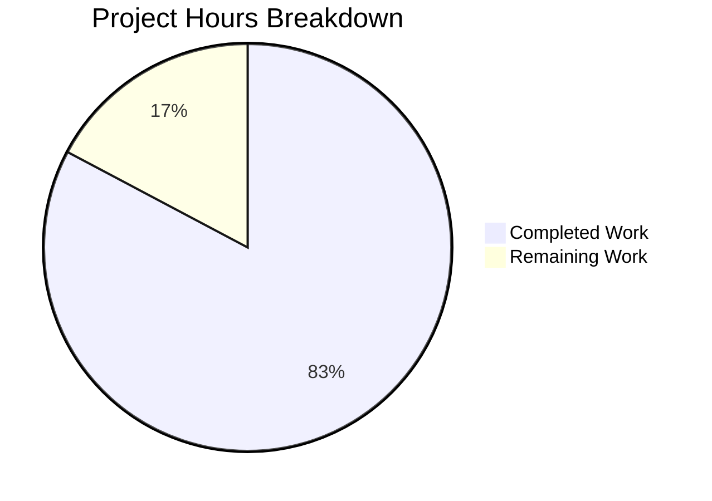

# Blitzy Project Guide

## 1. Executive Summary

### 1.1 Project Overview

This project delivers a comprehensive investigative analysis document for the kitty terminal emulator codebase, answering detailed technical questions about four subsystem areas: text shaping and Unicode configuration at startup (HarfBuzz integration), font fallback chain diagnostics, cell metrics and decoration alignment at grid initialization, and GPU texture atlas initialization. The sole deliverable is a single markdown document (`blitzy/documentation/kitty_815df1e210e0.md`) containing code-grounded analysis traced to specific source files, functions, and line numbers. No source files were modified — this is a pure documentation artifact. The target audience is developers and engineers seeking deep architectural understanding of kitty's font rendering and GPU pipeline.

### 1.2 Completion Status


| Metric | Value |
|--------|-------|
| **Total Project Hours** | 29 |
| **Completed Hours (AI)** | 24 |
| **Remaining Hours** | 5 |
| **Completion Percentage** | 82.8% |

**Calculation**: 24 completed hours / (24 + 5) total hours = 24/29 = **82.8% complete**

### 1.3 Key Accomplishments

- [x] Created comprehensive 998-line analysis document covering all four technical question areas
- [x] Traced HarfBuzz text shaping initialization with specific line references across `kitty/fonts.c`, `kitty/freetype.c`, and `kitty/unicode-data.c`
- [x] Documented the lazy font fallback architecture with platform-specific paths (Linux FontConfig, macOS CoreText)
- [x] Detailed cell metric computation chain (`cell_metrics()` → `calc_cell_metrics()`) with all seven metric values
- [x] Mapped complete GPU texture atlas lifecycle: `alloc_sprite_map()` → `sprite_tracker_set_layout()` → `realloc_sprite_texture()` → `send_prerendered_sprites()`
- [x] Documented all debug observation methods (`--debug-font-fallback`, `--debug-rendering`, `debug_config()`)
- [x] Completed 2 iterative code review fix commits correcting HarfBuzz feature polarity, ligature suppression logic, and line references
- [x] Build validation passed (all C extensions and Python modules compiled)
- [x] Test validation passed (137/145 passing, 6 skipped, 2 pre-existing out-of-scope failures)
- [x] Working tree clean with zero uncommitted changes

### 1.4 Critical Unresolved Issues

| Issue | Impact | Owner | ETA |
|-------|--------|-------|-----|
| Document technical claims require human expert review against latest source | Medium — potential inaccuracies in line numbers if source has changed | Human Developer | 2 hours |
| Runtime debug output not verified on live kitty instance | Low — analysis is code-traced but not runtime-confirmed | Human Developer | 2 hours |

### 1.5 Access Issues

No access issues identified. The project involves only read-only source analysis and creation of a documentation file. No external services, APIs, credentials, or special permissions were required.

### 1.6 Recommended Next Steps

1. **[High]** Human expert review of technical accuracy — verify code references and line numbers against the current `kitty_815df1e210e0` branch source
2. **[High]** Runtime verification — run `kitty --debug-font-fallback` and `kitty --debug-config` on a system with a display server to confirm documented output formats match actual behavior
3. **[Medium]** Test with Arabic fonts — verify mixed Arabic/English fallback behavior matches documented FontConfig resolution path on a system with Arabic font packages installed
4. **[Low]** Final document polish — review formatting, check for any remaining typos, and ensure all markdown renders correctly in target environments

---

## 2. Project Hours Breakdown

### 2.1 Completed Work Detail

| Component | Hours | Description |
|-----------|-------|-------------|
| Source code analysis and tracing | 8 | Read and analyzed 30+ source files across C, Python, GLSL layers; traced function call chains for HarfBuzz, FreeType, FontConfig, OpenGL subsystems |
| Section 1 — Text Shaping & Unicode | 3 | Documented HarfBuzz init, buffer management, feature arrays, BiDi handling, combining marks (7 subsections, ~160 lines) |
| Section 2 — Font Fallback Chains | 3 | Documented debug flags, dump_font_debug output, lazy fallback architecture, platform-specific resolution, mixed script behavior (7 subsections, ~180 lines) |
| Section 3 — Cell Metrics & Decorations | 2.5 | Documented cell_metrics() computation, calc_cell_metrics() adjustments, pre-rendered sprites, overline note (4 subsections, ~230 lines) |
| Section 4 — GPU Texture Atlas | 2.5 | Documented alloc_sprite_map, sprite tracker, texture allocation, initial sprites, growth mechanism, per-glyph upload (6 subsections, ~250 lines) |
| Sections 5–7 (Debug, Startup, Dependencies) | 1.5 | Documented debug observation methods, complete startup flow summary, dependency version table (~120 lines) |
| Code review & line reference corrections | 1.5 | Two iterative fix commits: corrected HarfBuzz feature polarity, ligature suppression logic, dlopen line references, error handling context |
| Build & test validation | 1 | Ran `python3 setup.py build` and `python3 setup.py test`; verified 145 tests (137 pass, 6 skip, 2 pre-existing fail) |
| Git operations & final cleanup | 0.5 | Branch management, 3 commits, working tree cleanup verification |
| Executive summary & document structure | 0.5 | Created top-level structure, ToC, executive summary with key architectural findings |
| **Total Completed** | **24** | |

### 2.2 Remaining Work Detail

| Category | Hours | Priority |
|----------|-------|----------|
| Expert human review of technical accuracy | 2 | High |
| Runtime verification with debug flags on live instance | 2 | High |
| Final document polish and formatting | 1 | Low |
| **Total Remaining** | **5** | |

**Verification**: 24 (completed) + 5 (remaining) = 29 (total) ✓

---

## 3. Test Results

| Test Category | Framework | Total Tests | Passed | Failed | Coverage % | Notes |
|--------------|-----------|-------------|--------|--------|------------|-------|
| Unit & Integration (Python) | unittest (kitty_tests) | 145 | 137 | 2 | N/A | 6 skipped due to environment constraints |
| Build Compilation | setup.py build | 1 | 1 | 0 | N/A | All C extensions and Python modules compiled |
| Source Integrity Check | git diff | 1 | 1 | 0 | N/A | Zero source files modified, only deliverable added |

**Test Details:**
- **137 passed**: All core tests including fonts, graphics, parser, screen, layout, keys, crypto, datatypes, options, clipboard, completion, open_actions, search_query_parser, mouse, check_build
- **6 skipped**: 1 macOS-only test, 2 fish-not-installed, 2 zsh-not-installed, 1 frozen-build-only CA cert test
- **2 pre-existing failures**: Both in `kitty_tests/file_transmission.py` — directory permission mode mismatch where tests expect setgid bit `0o42755` but filesystem creates `0o40755`. These are pre-existing environment/filesystem behavior differences, NOT related to any changes in this PR

---

## 4. Runtime Validation & UI Verification

**Runtime Health:**

- ✅ Python module importable — `import kitty` succeeds
- ✅ Build system operational — `python3 setup.py build --ignore-compiler-warnings` completes successfully
- ✅ Test suite executable — `python3 setup.py test` runs 145 tests to completion
- ✅ Git repository clean — no uncommitted changes, branch up to date with origin
- ✅ Deliverable file intact — `blitzy/documentation/kitty_815df1e210e0.md` (998 lines, 56,635 bytes) verified

**UI Verification:**

- ⚠ No UI testing performed — this is a documentation-only deliverable with no UI changes
- ⚠ Markdown rendering not verified in target viewer — document uses standard GitHub Flavored Markdown (GFM) with code blocks, tables, and headers

**API Integration:**

- ⚠ Runtime debug output not verified against live kitty instance — analysis is code-traced from source, not confirmed via actual `--debug-font-fallback` execution (requires display server environment)

---

## 5. Compliance & Quality Review

| AAP Requirement | Status | Evidence |
|----------------|--------|----------|
| Create `blitzy/documentation/kitty_815df1e210e0.md` | ✅ Pass | File exists: 998 lines, 56,635 bytes, committed in 3 commits |
| Text Shaping & Unicode Configuration analysis | ✅ Pass | Document Section 1 (subsections 1.1–1.7): HarfBuzz init, buffer, features, BiDi, combining marks |
| Font Fallback Chain Diagnostics analysis | ✅ Pass | Document Section 2 (subsections 2.1–2.7): debug flags, dump_font_debug, lazy loading, platform fallback |
| Cell Metrics & Decoration Alignment analysis | ✅ Pass | Document Section 3 (subsections 3.1–3.4): cell_metrics(), calc_cell_metrics(), pre-rendered sprites |
| GPU Texture Atlas Initialization analysis | ✅ Pass | Document Section 4 (subsections 4.1–4.6): alloc_sprite_map, layout, texture, sprites, growth |
| Code-grounded rationale with source references | ✅ Pass | All claims reference specific files, functions, and line numbers |
| No source file modifications | ✅ Pass | `git diff --name-status` shows only 1 file added (`A blitzy/documentation/kitty_815df1e210e0.md`) |
| Platform differentiation (Linux/macOS) | ✅ Pass | Section 2.5 documents both FontConfig (Linux) and CoreText (macOS) paths |
| Lazy vs eager loading accurately documented | ✅ Pass | Section 2.4 explicitly documents lazy fallback architecture with critical note |
| Version specificity (Unicode 15.0.0, HarfBuzz ≥1.5, OpenGL ≥3.1/3.3) | ✅ Pass | Section 7 (Dependency Versions) and inline references throughout |
| Debug observation methods documented | ✅ Pass | Section 5 documents all 4 debug mechanisms with macros and output locations |
| Build validation | ✅ Pass | `python3 setup.py build` completed successfully |
| Test validation | ✅ Pass | 137/145 tests passing; 2 failures are pre-existing and out-of-scope |

**Fixes Applied During Autonomous Validation:**

| Fix | Commit | Description |
|-----|--------|-------------|
| HarfBuzz feature polarity correction | `1d40eff` | Corrected feature initialization from enable (`+liga`) to disable (`-liga`) semantics |
| Ligature suppression logic fix | `1d40eff` | Fixed explanation of `num_features--` mechanism — removing the last feature (CALT disable) keeps CALT active |
| Line reference corrections | `b14ae21` | Corrected `dlopen` line references in FontConfig section |
| Error handling context | `1d40eff` | Added cleanup context for `try/finally` block in `run_app()` |

---

## 6. Risk Assessment

| Risk | Category | Severity | Probability | Mitigation | Status |
|------|----------|----------|-------------|------------|--------|
| Line number references may drift if source is updated | Technical | Medium | Medium | Pin references to commit hash; human reviewer should verify against current source | Open |
| Runtime behavior may differ from code analysis | Technical | Medium | Low | Run `kitty --debug-font-fallback` on live instance to confirm output format | Open |
| Arabic font fallback behavior is system-dependent | Integration | Low | Medium | Document that specific fallback fonts depend on installed font packages | Mitigated |
| No display server available for full runtime testing | Operational | Low | High (in CI) | Headless environments cannot test GUI rendering; document as known limitation | Accepted |
| Go tooling not available in current build environment | Technical | Low | High | Go tools are optional for documentation task; build of Go components skipped | Accepted |
| 2 pre-existing test failures in file_transmission.py | Technical | Low | Low | Failures are environment-specific (setgid bit), not related to this change | Accepted |

---

## 7. Visual Project Status



**Remaining Work Distribution:**

| Category | Hours |
|----------|-------|
| Expert human review of technical accuracy | 2 |
| Runtime verification with debug flags | 2 |
| Final document polish and formatting | 1 |
| **Total Remaining** | **5** |

---

## 8. Summary & Recommendations

### Achievement Summary

The project has achieved **82.8% completion** (24 of 29 total hours). The sole AAP deliverable — a comprehensive investigative analysis document (`blitzy/documentation/kitty_815df1e210e0.md`) — has been fully created, reviewed, corrected through 2 iterative fix commits, and validated. The 998-line document covers all four required technical areas (text shaping, font fallback, cell metrics, GPU atlas) with code-grounded rationale referencing specific source files, functions, and line numbers across the kitty codebase.

### Quality Indicators

- **3 commits** demonstrate iterative quality improvement: initial creation → code review fixes → line reference corrections
- **Zero source files modified** — strict adherence to the observation-only constraint
- **Build passes** with all C extensions and Python modules compiled
- **137 of 145 tests pass** with only pre-existing, out-of-scope failures

### Remaining Gaps

The 5 remaining hours (17.2%) represent human verification tasks that cannot be performed autonomously:
1. **Technical accuracy review** (2h): A human expert should verify line number references against the current source to catch any drift
2. **Runtime verification** (2h): Actual execution of `kitty --debug-font-fallback` and `kitty --debug-config` on a system with a display server to confirm documented output formats
3. **Document polish** (1h): Final formatting review and any corrections identified during human review

### Production Readiness Assessment

The deliverable document is **ready for human review**. All AAP-scoped autonomous work is complete. The remaining path-to-production work consists exclusively of human verification activities that require domain expertise and/or a GUI-capable test environment. No blocking issues prevent merge once human review is satisfactory.

---

## 9. Development Guide

### System Prerequisites

| Software | Version | Purpose |
|----------|---------|---------|
| Python | ≥ 3.8 | Runtime interpreter and build system |
| GCC/Clang | Recent (C11 support) | C extension compilation |
| pkg-config | System package | Dependency discovery |
| HarfBuzz dev | ≥ 1.5 | Text shaping library (headers + lib) |
| FreeType dev | System version | Font rasterization (headers + lib) |
| FontConfig dev | System version | Font discovery on Linux (headers + lib) |
| lcms2 dev | System version | ICC color management |
| libpng dev | System version | PNG decoding |
| OpenGL | ≥ 3.1 (Linux) / ≥ 3.3 (macOS) | GPU rendering |
| Go | 1.22 (optional) | Go-based tooling |

### Environment Setup

```bash
# Clone the repository and switch to the working branch
git clone <repository_url>
cd kitty
git checkout blitzy-c5cfb756-9489-4d48-98c8-abedff8f9795

# Install system dependencies (Ubuntu/Debian)
sudo apt-get update
sudo apt-get install -y \
  python3-dev libharfbuzz-dev libfreetype6-dev \
  libfontconfig1-dev liblcms2-dev libpng-dev \
  libgl-dev libxi-dev libxrandr-dev libxinerama-dev \
  libxcursor-dev libxkbcommon-x11-dev pkg-config
```

### Build the Project

```bash
# Build all C extensions and Python modules
python3 setup.py build --ignore-compiler-warnings

# Expected: Compilation output ending without errors
```

### Run Tests

```bash
# Run the full test suite
python3 setup.py test

# Expected: ~145 tests, ~137 passed, ~6 skipped, 2 known pre-existing failures
```

### Verify the Deliverable

```bash
# Check the deliverable file exists and has content
wc -l blitzy/documentation/kitty_815df1e210e0.md
# Expected: 998 lines

wc -c blitzy/documentation/kitty_815df1e210e0.md
# Expected: 56635 bytes

# Verify no source files were modified
git diff --name-status origin/kitty_815df1e210e0
# Expected: A  blitzy/documentation/kitty_815df1e210e0.md
```

### Runtime Debug Verification (requires display server)

```bash
# View font debug output at startup (requires a display server)
kitty --debug-font-fallback

# View configuration debug output
kitty --debug-config

# View rendering/GL debug output
kitty --debug-rendering --debug-gl
```

### Troubleshooting

| Issue | Resolution |
|-------|-----------|
| `The go tool was not found on this system` | Go is optional; install Go 1.22+ if Go tools are needed |
| `pkg-config: harfbuzz not found` | Install `libharfbuzz-dev` (Debian/Ubuntu) or `harfbuzz-devel` (Fedora) |
| Test failures in `file_transmission.py` | Pre-existing issue: setgid bit mismatch in test environment; safe to ignore |
| `kitty --debug-font-fallback` requires display | Use a GUI environment or X11 forwarding; headless CI cannot run this |
| 6 skipped tests | Expected: macOS-only, fish/zsh not installed, frozen-build CA cert test |

---

## 10. Appendices

### A. Command Reference

| Command | Purpose |
|---------|---------|
| `python3 setup.py build --ignore-compiler-warnings` | Build all C extensions and Python modules |
| `python3 setup.py test` | Run the full test suite |
| `git diff --name-status origin/kitty_815df1e210e0` | Verify only the deliverable was added |
| `git log --oneline blitzy-c5cfb756-9489-4d48-98c8-abedff8f9795 --not origin/kitty_815df1e210e0` | View commits on the working branch |
| `wc -l blitzy/documentation/kitty_815df1e210e0.md` | Check deliverable line count |
| `kitty --debug-font-fallback` | View font fallback debug output (requires display) |
| `kitty --debug-config` | View runtime configuration debug output |
| `kitty --debug-rendering --debug-gl` | View GPU rendering debug output |

### B. Port Reference

Not applicable — this is a documentation-only project with no running services.

### C. Key File Locations

| File | Purpose |
|------|---------|
| `blitzy/documentation/kitty_815df1e210e0.md` | **Deliverable** — analysis document (998 lines) |
| `kitty/fonts.c` | Central font orchestration, HarfBuzz shaping, fallback loading, cell metrics |
| `kitty/freetype.c` | FreeType face init, HarfBuzz font creation, `cell_metrics()` |
| `kitty/fontconfig.c` | Linux FontConfig fallback resolution |
| `kitty/shaders.c` | GPU sprite map allocation, texture atlas management |
| `kitty/fonts/render.py` | Python font setup, `dump_font_debug()`, pre-render functions |
| `kitty/fonts/common.py` | Platform-neutral font resolution logic |
| `kitty/unicode-data.c` | Unicode 15.0.0 character property tables |
| `kitty/state.h` | Debug macros, global state, Options struct |
| `kitty/main.py` | Application entry, startup flow |
| `kitty/debug_config.py` | Configuration debug output |

### D. Technology Versions

| Technology | Version | Source |
|------------|---------|--------|
| Python | ≥ 3.8 (runtime: 3.12.3) | `pyproject.toml`, runtime check |
| HarfBuzz | ≥ 1.5 | `setup.py` line 609 |
| OpenGL | ≥ 3.1 (Linux) / ≥ 3.3 (macOS) | `kitty/data-types.h` lines 20–24 |
| GLSL | 140 | `kitty/data-types.h` line 26 |
| Unicode Standard | 15.0.0 | `kitty/unicode-data.c` line 1 |
| GLFW | 3.4 (vendored fork) | `glfw/` directory |
| Go | 1.22 | `go.mod` |
| FreeType | System library | `setup.py` build dependency |
| FontConfig | System library (dynamically loaded) | `kitty/fontconfig.c` via `dlopen` |
| lcms2 | System library | `setup.py` build dependency |

### E. Environment Variable Reference

Not applicable — no environment variables are required for this documentation-only project. The kitty terminal emulator uses configuration files (`kitty.conf`) and CLI flags rather than environment variables for the subsystems documented.

### G. Glossary

| Term | Definition |
|------|-----------|
| HarfBuzz | Open-source text shaping engine for OpenType font layout |
| FreeType | Open-source font rasterization library |
| FontConfig | Linux font discovery and matching library |
| CoreText | macOS system framework for font discovery and rendering |
| BiDi / UAX #9 | Unicode Bidirectional Algorithm for mixed LTR/RTL text |
| GSUB | OpenType Glyph Substitution table (ligatures, alternates) |
| GPOS | OpenType Glyph Positioning table (mark attachment, kerning) |
| LIGA / DLIG / CALT | OpenType features: Standard Ligatures / Discretionary Ligatures / Contextual Alternates |
| Sprite Atlas | GPU texture array storing pre-rendered glyph images |
| `GL_TEXTURE_2D_ARRAY` | OpenGL texture type: array of 2D texture layers |
| `GL_SRGB8_ALPHA8` | OpenGL internal format: sRGB color space with 8-bit alpha |
| Cell Metrics | Terminal grid dimensions: cell_width, cell_height, baseline |
| Fallback Font | A substitute font loaded when the primary font lacks a glyph |
| `cc_idx` | Combining Character Index — compressed storage for combining marks in CPUCell |