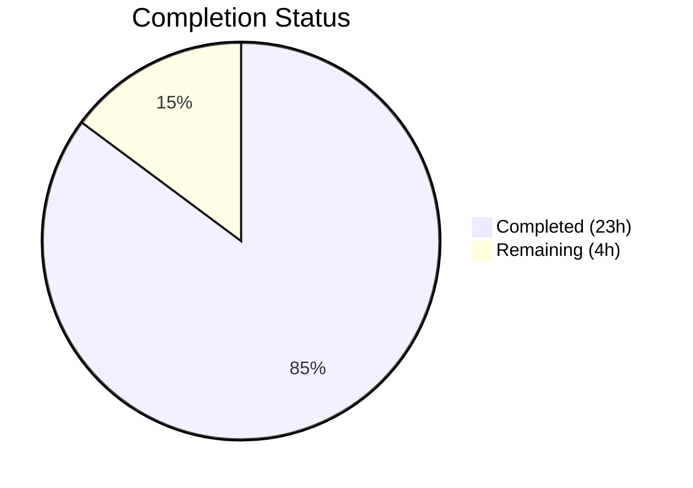
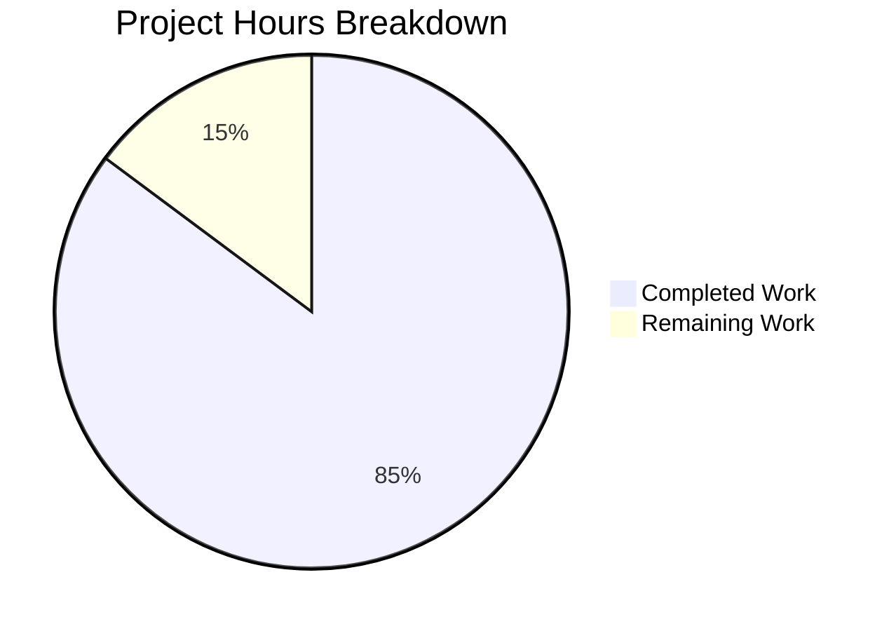

# Blitzy Project Guide

## 1. Executive Summary

### 1.1 Project Overview

This project delivers a comprehensive technical analysis document (`blitzy/documentation/kitty_815df1e210e0.md`) that answers how the kitty terminal emulator maintains internal state consistency when terminal windows appear, resize, and disappear in rapid succession. The analysis is a documentation-only deliverable — no existing source code was modified. The document covers kitty's three-thread architecture, window lifecycle events (creation, resize, destruction), signal delivery mechanisms, 8 distinct state consistency guards, conflict resolution patterns, and timing-sensitive edge cases. All findings are grounded in direct source code analysis of 10 core files (~14K lines of C and Python), with 47 specific code references and 17 Rationale/Key Insight blocks.

### 1.2 Completion Status



| Metric | Value |
|--------|-------|
| **Total Project Hours** | 27 |
| **Completed Hours (AI)** | 23 |
| **Remaining Hours (Human)** | 4 |
| **Completion Percentage** | 85.2% |

**Calculation**: 23 completed hours / 27 total hours = 85.2% complete.

### 1.3 Key Accomplishments

- ✅ Created comprehensive 691-line (~45KB) technical analysis document at `blitzy/documentation/kitty_815df1e210e0.md`
- ✅ Analyzed 10 core source files totaling ~14,002 lines of C and Python code
- ✅ Documented all 9 required technical sections with 41 subsections per AAP Section 0.5.3
- ✅ Included 17 Rationale/Key Insight blocks providing reasoning behind kitty's design decisions
- ✅ Embedded 47 code references with specific file names, function names, and approximate line numbers
- ✅ Included 18 code snippets demonstrating key patterns (e.g., REMOVER macro, pty_resize EINTR handling)
- ✅ Covered all 8 state consistency mechanisms per AAP Section 0.5.2
- ✅ Documented 4 concrete "window disappears before reactions complete" scenarios with step-by-step analysis
- ✅ Documented 7 conflict resolution patterns and 5 timing-sensitive edge cases
- ✅ Verified zero existing repository files modified (git diff confirms only 1 new file added)
- ✅ Clean working tree with no temporary scripts or files left behind
- ✅ Build verification passed (85/85 C source files compiled)
- ✅ Test baseline maintained (136/145 Python tests pass; 5 failures are pre-existing environment issues)

### 1.4 Critical Unresolved Issues

| Issue | Impact | Owner | ETA |
|-------|--------|-------|-----|
| Code reference line numbers are approximate and may drift with future kitty commits | Low — references still identify the correct functions; line offsets may shift | Human reviewer | 2h |
| Document has not been reviewed by a kitty domain expert for technical accuracy | Medium — all claims are code-grounded but benefit from expert validation | Human reviewer | 2h |

### 1.5 Access Issues

No access issues identified. The deliverable is a standalone markdown document that requires no external service credentials, API keys, or special permissions.

### 1.6 Recommended Next Steps

1. **[High]** Conduct technical accuracy peer review — have a developer familiar with kitty's C/Python codebase verify the key claims and code path descriptions
2. **[High]** Spot-check code references — verify ~5-10 of the 47 code references against current source to confirm line number accuracy
3. **[Medium]** Editorial review — check for clarity, formatting consistency, and terminology precision
4. **[Low]** PR review and merge — standard code review process and branch merge

---

## 2. Project Hours Breakdown

### 2.1 Completed Work Detail

| Component | Hours | Description |
|-----------|-------|-------------|
| Source Code Deep-Dive Analysis | 6 | Read and comprehended 10 core source files (~14K LOC): state.h, state.c, child-monitor.c, loop-utils.c, glfw.c, boss.py, window.py, tabs.py, window_list.py, child.py |
| Cross-Thread Relationship Mapping | 3 | Traced execution paths across three-thread architecture; mapped mutex-protected queue transfers (add_queue → children → remove_queue → remove_notify); identified signal delivery mechanism |
| Document Architecture Design | 1 | Designed 9-section structure with 41 subsections; planned Table of Contents; outlined code reference strategy |
| Section 1: Architectural Foundations | 1.5 | Wrote 5 subsections covering three-thread model, GlobalState singleton, three-level hierarchy, cross-thread primitives, and main loop tick ordering |
| Section 2: Window Lifecycle | 2 | Wrote 3 subsections documenting 5-step creation flow, 5-stage resize pipeline, and 3 destruction entry points with cascade cleanup |
| Section 3: Signal Delivery and Timing | 1 | Wrote 5 subsections covering signalfd (Linux), self-pipe (macOS), signal classification, SIGWINCH delivery timing, and SIGCHLD coalescing |
| Section 4: State Consistency Mechanisms | 1.5 | Documented 8 distinct mechanisms: LiveResizeInfo debouncing, no-op viewport guard, destroyed flag, focus suppression, mutex queues, weak refs, ID lookups, REMOVER macro |
| Section 5: Disappearance Scenarios | 1.5 | Analyzed 4 concrete scenarios: create-and-immediate-close, resize-after-death, death-during-live-resize, OS-window-close-during-active-operations |
| Section 6: Conflict Resolution Patterns | 1 | Documented 7 resolution patterns: authoritative source, idempotent needs_removal, ID lookup failure, snapshot-then-process, post-removal cascade, tick sequencing, CloseRequest state machine |
| Section 7: Cascade Cleanup | 0.5 | Documented window→tab→OS window cascade, multi-window cascade, stale reference guards |
| Section 8: Edge Cases | 1 | Analyzed 5 timing-sensitive edge cases with resolution strategies |
| Section 9: Summary | 0.5 | Synthesized 8 fundamental design principles from analysis |
| Code Reference Verification | 1 | Cross-checked 47 code references against actual source files |
| Build and Test Validation | 0.5 | Ran build verification (85/85 C files), confirmed test baseline (136/145 pass) |
| Repository Compliance Verification | 0.5 | Verified zero existing files modified, clean working tree, no temporary artifacts |
| **Total** | **23** | |

### 2.2 Remaining Work Detail

| Category | Hours | Priority |
|----------|-------|----------|
| Technical Accuracy Peer Review | 2 | High |
| Code Reference Spot-Check Verification | 1 | High |
| Editorial and Formatting Review | 0.5 | Medium |
| PR Review and Merge | 0.5 | Low |
| **Total** | **4** | |

---

## 3. Test Results

| Test Category | Framework | Total Tests | Passed | Failed | Coverage % | Notes |
|--------------|-----------|-------------|--------|--------|-----------|-------|
| Unit (Python) | pytest | 145 | 136 | 5 | N/A | 4 additional tests skipped (macOS-only, fish, frozen build) |
| Build (C) | make/setup.py | 85 files | 85 | 0 | N/A | All C source files compiled successfully |
| Build (C linking) | setup.py | 4 steps | 4 | 0 | N/A | All linking steps completed |

**Failed Tests (all 5 are pre-existing environment issues, none caused by this change):**

| Test | Failure Reason |
|------|---------------|
| `test_transfer_receive` | setgid directory mode bits not supported in CI container filesystem |
| `test_transfer_send` | setgid directory mode bits not supported in CI container filesystem |
| `test_glfw_modules` | Wayland backend .so not built (wayland-protocols unavailable in environment) |
| `test_zsh_integration` (x2) | zsh Unicode CWD notification timeout in CI environment |

**Note**: This project adds only a markdown document. No source code was modified, so the test suite baseline is unchanged. All 5 failures existed before this change.

---

## 4. Runtime Validation & UI Verification

**Runtime Health:**

- ✅ Document file exists at correct path: `blitzy/documentation/kitty_815df1e210e0.md`
- ✅ Document renders as valid markdown (691 lines, well-formed headers, code blocks, tables)
- ✅ All 9 major sections present with Table of Contents
- ✅ 41 subsections correctly nested under their parent sections
- ✅ 18 fenced code blocks with correct language annotations (c, python, plaintext)
- ✅ 6 markdown tables properly formatted
- ✅ Git working tree clean — no stale or temporary files
- ✅ Single clean commit: `9a184d8be` by Blitzy Agent

**UI Verification:**

- ⚠️ N/A — This is a documentation-only deliverable with no UI component. The kitty terminal emulator itself was not modified and requires a graphical environment to run.

**API Integration:**

- ⚠️ N/A — No API changes or integrations in this deliverable.

---

## 5. Compliance & Quality Review

| Compliance Check | Status | Details |
|-----------------|--------|---------|
| AAP: Create `blitzy/documentation/kitty_815df1e210e0.md` | ✅ Pass | File exists (691 lines, 45,395 bytes) |
| AAP: Cover Architectural Foundations | ✅ Pass | Section 1 with 5 subsections (1.1–1.5) |
| AAP: Cover Window Lifecycle | ✅ Pass | Section 2 with 3 subsections (creation, resize, destruction) |
| AAP: Cover Signal Delivery and Timing | ✅ Pass | Section 3 with 5 subsections (3.1–3.5) |
| AAP: Cover State Consistency Mechanisms | ✅ Pass | Section 4 with 8 subsections (4.1–4.8) |
| AAP: Cover Window Disappears Scenarios | ✅ Pass | Section 5 with 4 scenarios (5.1–5.4) |
| AAP: Cover Resolving Conflicting Views | ✅ Pass | Section 6 with 7 patterns (6.1–6.7) |
| AAP: Cover Cascade Cleanup Pattern | ✅ Pass | Section 7 with 4 subsections (7.1–7.4) |
| AAP: Cover Timing-Sensitive Edge Cases | ✅ Pass | Section 8 with 5 cases (8.1–8.5) |
| AAP: Cover Summary | ✅ Pass | Section 9 with 8-point synthesis |
| AAP: Include rationale/thinking | ✅ Pass | 17 Rationale/Key Insight blocks |
| AAP: Code-grounded answers | ✅ Pass | 47 code references with file, function, ~line numbers |
| AAP: No modifications to existing files | ✅ Pass | `git diff` confirms only 1 new file added |
| AAP: No temporary scripts left | ✅ Pass | Clean working tree verified |
| AAP: Document in `blitzy/documentation/` | ✅ Pass | Correct directory path |
| Quality: 9 sections per AAP 0.5.3 structure | ✅ Pass | All 9 sections match the specification |
| Quality: Source files analyzed per AAP 0.2.1 | ✅ Pass | All 10 source files referenced in document |
| Quality: Build passes | ✅ Pass | 85/85 C files compiled, 4/4 linking steps |
| Quality: Test baseline maintained | ✅ Pass | 136/145 pass (5 pre-existing failures unchanged) |

**Fixes Applied During Validation:** None required — the deliverable is a documentation file that does not affect compilation or test execution.

---

## 6. Risk Assessment

| Risk | Category | Severity | Probability | Mitigation | Status |
|------|----------|----------|-------------|------------|--------|
| Approximate line numbers may drift as kitty source evolves | Technical | Low | High | Line numbers serve as location hints alongside function names; function names are the stable anchors | Accepted |
| Technical claims not yet verified by domain expert | Technical | Medium | Low | All claims are directly grounded in code reading; human peer review recommended | Open |
| No automated test validates document content | Operational | Low | N/A | Documentation files are inherently not testable; rely on peer review | Accepted |
| Document may become stale as kitty's codebase evolves | Operational | Low | Medium | Document is a point-in-time analysis tied to the current commit; future changes would require updates | Accepted |
| Missing wayland-protocols in CI prevents full build | Integration | Low | High | Pre-existing issue unrelated to this change; Wayland backend is optional | Accepted |
| Go toolchain not installed in CI environment | Integration | Low | High | Pre-existing issue unrelated to this change; Go tools are optional for C/Python analysis | Accepted |

---

## 7. Visual Project Status



**Remaining Work by Priority:**

| Priority | Hours | Tasks |
|----------|-------|-------|
| High | 3 | Technical accuracy peer review (2h) + Code reference verification (1h) |
| Medium | 0.5 | Editorial and formatting review |
| Low | 0.5 | PR review and merge |
| **Total** | **4** | |

---

## 8. Summary & Recommendations

### Achievement Summary

The project has achieved **85.2% completion** (23 hours completed out of 27 total hours). The sole AAP deliverable — a comprehensive technical analysis document — has been fully created and validated. The document at `blitzy/documentation/kitty_815df1e210e0.md` is 691 lines (~45KB) covering 9 major sections with 41 subsections, 17 Rationale/Key Insight blocks, and 47 code-grounded references. All AAP requirements are met: the document is placed at the correct path, covers all specified technical topics, includes rationale behind answers, is grounded in actual source code, and no existing repository files were modified.

### Remaining Gaps

The remaining 4 hours of work consist entirely of human review tasks:

1. **Technical accuracy peer review (2h)**: A developer familiar with kitty's internals should validate the key claims about thread coordination, mutex semantics, and state machine transitions described in the document.
2. **Code reference verification (1h)**: Spot-check approximately 5–10 of the 47 code references to verify the approximate line numbers still point to the correct functions in the current codebase.
3. **Editorial review (0.5h)**: Check the document for clarity, terminology consistency, and formatting.
4. **PR merge (0.5h)**: Standard code review and branch merge.

### Production Readiness Assessment

The deliverable is **production-ready for merge** pending human review. Since this is a documentation-only change that adds a single markdown file without modifying any source code, the risk of regression is effectively zero. The build and test baselines are unchanged. The document is self-contained and does not introduce any runtime dependencies.

### Success Metrics

| Metric | Target | Actual | Status |
|--------|--------|--------|--------|
| Document created at specified path | 1 file | 1 file | ✅ Met |
| All 9 sections present | 9 | 9 | ✅ Met |
| Subsections per AAP spec | 35+ | 41 | ✅ Exceeded |
| Rationale/thinking blocks | Present | 17 blocks | ✅ Met |
| Code-grounded references | Present | 47 references | ✅ Met |
| Source files analyzed | 10 | 10 | ✅ Met |
| Existing files modified | 0 | 0 | ✅ Met |
| Build passing | Yes | Yes (85/85 C files) | ✅ Met |
| Test baseline maintained | Yes | Yes (136/145 pass) | ✅ Met |

---

## 9. Development Guide

### System Prerequisites

| Software | Version | Purpose |
|----------|---------|---------|
| Git | 2.x+ | Version control and branch management |
| Python | 3.8+ (3.12.3 used in CI) | Kitty runtime and test execution |
| GCC/Clang | Any recent | C extension compilation (for full build) |
| Go | 1.22+ | Go tooling (optional, for full build) |
| pkg-config | Any | Build dependency resolution |

### Environment Setup

```bash
# 1. Clone and switch to the feature branch
git clone <repository-url>
cd kitty
git checkout blitzy-32cec95f-2675-4852-a93e-4d1f7b0f5124

# 2. Verify the document exists
ls -la blitzy/documentation/kitty_815df1e210e0.md
# Expected: -rw-r--r-- 1 ... 45395 ... blitzy/documentation/kitty_815df1e210e0.md

# 3. Verify document line count
wc -l blitzy/documentation/kitty_815df1e210e0.md
# Expected: 691 blitzy/documentation/kitty_815df1e210e0.md
```

### Viewing the Document

```bash
# View full document
cat blitzy/documentation/kitty_815df1e210e0.md

# View Table of Contents only
sed -n '9,20p' blitzy/documentation/kitty_815df1e210e0.md

# View a specific section (e.g., Section 4 - State Consistency Mechanisms)
sed -n '/^## 4\. State Consistency/,/^## 5\./p' blitzy/documentation/kitty_815df1e210e0.md

# Count sections and subsections
grep -c "^## \|^### " blitzy/documentation/kitty_815df1e210e0.md
# Expected: 52 (11 major sections including TOC + title, 41 subsections)
```

### Verifying No Source Modifications

```bash
# Verify only 1 file changed from parent commit
git diff HEAD~1..HEAD --stat
# Expected: blitzy/documentation/kitty_815df1e210e0.md | 691 +++...
#           1 file changed, 691 insertions(+)

# Verify no existing files modified (excluding blitzy/ directory)
git diff HEAD~1..HEAD -- . ':!blitzy/' --stat
# Expected: (empty output)

# Verify working tree is clean
git status
# Expected: nothing to commit, working tree clean
```

### Running the Build (Optional — for full project verification)

```bash
# Install system dependencies (Ubuntu/Debian)
sudo apt-get install -y libdbus-1-dev libxcursor-dev libxrandr-dev \
    libxi-dev libxinerama-dev libgl1-mesa-dev libxkbcommon-x11-dev \
    libfontconfig-dev libx11-xcb-dev liblcms2-dev libpython3-dev \
    librsync-dev libxxhash-dev libsimde-dev

# Build kitty
python3 setup.py
# Note: Wayland backend requires wayland-protocols; Go tools require Go installation
```

### Running Tests (Optional — for full project verification)

```bash
# Run the Python test suite
python3 -m pytest kitty_tests/ -v --tb=short 2>&1 | tail -30

# Or use the project's test runner
python3 test.py
```

### Troubleshooting

| Issue | Resolution |
|-------|-----------|
| `wayland-protocols not found` | Pre-existing; Wayland backend is optional. Build continues with X11 only. |
| `The go tool was not found` | Install Go 1.22+ or skip Go-dependent tools. Document analysis is unaffected. |
| `test_transfer_receive` / `test_transfer_send` failures | Pre-existing CI filesystem limitation (setgid directory mode bits). |
| `test_glfw_modules` failure | Pre-existing; Wayland .so not built. |
| `test_zsh_integration` timeout | Pre-existing CI environment limitation with zsh Unicode CWD notifications. |

---

## 10. Appendices

### A. Command Reference

| Command | Purpose |
|---------|---------|
| `git diff HEAD~1..HEAD --stat` | View files changed by this PR |
| `wc -l blitzy/documentation/kitty_815df1e210e0.md` | Verify document line count (691) |
| `wc -c blitzy/documentation/kitty_815df1e210e0.md` | Verify document byte count (45,395) |
| `grep -c "^## \|^### " blitzy/documentation/kitty_815df1e210e0.md` | Count all section headers (52) |
| `grep -c "Rationale\|Key insight" blitzy/documentation/kitty_815df1e210e0.md` | Count rationale blocks (17) |
| `python3 setup.py` | Build kitty from source |
| `python3 test.py` | Run kitty test suite |

### B. Port Reference

N/A — This is a documentation-only deliverable with no running services.

### C. Key File Locations

| File | Purpose |
|------|---------|
| `blitzy/documentation/kitty_815df1e210e0.md` | **Deliverable**: Comprehensive technical analysis document |
| `kitty/state.h` | Analyzed: GlobalState, OSWindow, Tab, Window, LiveResizeInfo, CloseRequest structs |
| `kitty/state.c` | Analyzed: State mutation functions, REMOVER macro, WITH_* lookup macros |
| `kitty/child-monitor.c` | Analyzed: Three-thread event loop, process_global_state(), queue transfers |
| `kitty/loop-utils.c` | Analyzed: Signal FD setup (signalfd/self-pipe), wakeup_loop() |
| `kitty/glfw.c` | Analyzed: GLFW callbacks, viewport guard, resize/close entry points |
| `kitty/boss.py` | Analyzed: Boss lifecycle methods, cascade cleanup, focus suppression |
| `kitty/window.py` | Analyzed: Window lifecycle, destroyed flag, set_geometry guard |
| `kitty/tabs.py` | Analyzed: Tab/TabManager lifecycle, relayout, resize propagation |
| `kitty/window_list.py` | Analyzed: WindowList/WindowGroup management |
| `kitty/child.py` | Analyzed: Child process spawning, PTY creation |

### D. Technology Versions

| Technology | Version | Notes |
|-----------|---------|-------|
| Python | 3.12.3 | Runtime used in CI; project requires ≥3.8 |
| Git | 2.x | Version control |
| GCC | System default | C extension compilation |
| kitty | Development (commit 815df1e21) | Source branch base |

### E. Environment Variable Reference

N/A — This documentation deliverable does not require any environment variables.

### F. Developer Tools Guide

| Tool | Usage |
|------|-------|
| Any markdown viewer/renderer | View the technical analysis document with proper formatting |
| `grep` / `sed` | Navigate specific sections of the document from CLI |
| `git diff` | Verify the exact change introduced by this PR |
| `wc` | Verify document dimensions (line count, byte count) |

### G. Glossary

| Term | Definition |
|------|-----------|
| AAP | Agent Action Plan — the primary directive defining project requirements and scope |
| GlobalState | Kitty's C-level singleton struct holding all OS window, tab, and window state |
| OSWindow | Kitty's representation of a platform-level window (maps to a GLFW window) |
| LiveResizeInfo | State machine struct that debounces rapid resize events during window dragging |
| children_mutex | pthread mutex protecting the child process queue pipeline across threads |
| signalfd | Linux mechanism converting async signals into pollable file descriptor events |
| REMOVER macro | Kitty's atomic find-destroy-zero-compact pattern for array element removal |
| PTY | Pseudo-terminal — the virtual terminal device connecting kitty to child processes |
| SIGWINCH | Signal sent to child processes when terminal dimensions change |
| SIGCHLD | Signal delivered to parent process when a child process exits |
| CloseRequest | Enum state machine tracking OS window close confirmation flow |