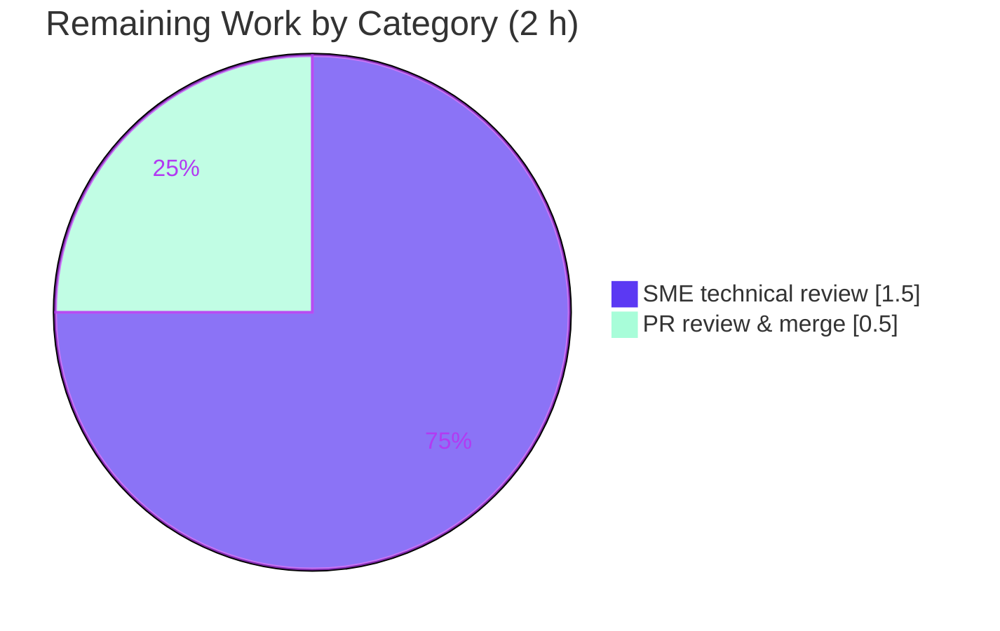

# Blitzy Project Guide — kitty OSC 133 Shell-Integration Investigation

> **Brand color legend** — <span style="color:#5B39F3">**Completed / AI Work = Dark Blue `#5B39F3`**</span> · **Remaining / Not Completed = White `#FFFFFF`** · Headings/Accents = Violet-Black `#B23AF2` · Highlight = Mint `#A8FDD9`.

---

## 1. Executive Summary

### 1.1 Project Overview

This project delivers an investigative, runtime-grounded Q&A document that definitively explains how the **kitty terminal emulator** handles `OSC 133` shell-integration ("semantic prompt") escape sequences — the command-boundary markers `A`/`B`/`C`/`D`. The audience is terminal/shell-integration engineers and maintainers who need an authoritative, evidence-backed reference for what kitty captures, what it strips or retains, exact byte lengths and offsets, and how exit codes (including malformed ones) are recorded. It is a read-only investigation: exactly one Markdown file is created and no kitty source is changed. The technical scope spans the VT parser dispatch, the screen prompt-marking handler, the line serializer, and both the test-harness and production exit-status recording paths.

### 1.2 Completion Status

The completion percentage is computed using the AAP-scoped hours methodology: **Completed Hours ÷ Total Hours**. All autonomous (AI) work scoped in the Agent Action Plan is delivered and independently validated; the remaining hours are the human path-to-production (SME review + merge).


| Metric | Value |
|--------|-------|
| **Total Hours** | **20.0 h** |
| **Completed Hours (AI + Manual)** | **18.0 h** (AI: 18.0 h · Manual: 0.0 h) |
| **Remaining Hours** | **2.0 h** |
| **Percent Complete** | **90.0 %** |

> Calculation: `18.0 / (18.0 + 2.0) × 100 = 90.0 %`.

### 1.3 Key Accomplishments

- ✅ Single deliverable created at the correct branch-matched path: `blitzy/documentation/kitty_815df1e210e0.md` (588 lines / 4,412 words / 34,633 bytes).
- ✅ All six questions (Q1–Q6) answered with **verbatim runtime output** from the real compiled parser (12 evidence blocks, one-claim-one-evidence discipline).
- ✅ Dispatch chain fully traced: `vt-parser.c:L536` → `shell_prompt_marking` (`screen.c:L2328`); `A`/`C`/`D` handled; **`B` silently ignored** (no `case 'B'`).
- ✅ Measured invariants captured: total length **62 bytes**, `D` offset **50**; digit-shift `total == 60 + num_digits`.
- ✅ Test-harness vs. production divergence proven on malformed input: `sys.maxsize` (9223372036854775807) vs. `0`.
- ✅ Read-only scope maintained: `git diff` shows **only one file added**; zero source modifications; temp scripts removed.
- ✅ C-extension build succeeds (`setup.py build` → EXIT 0); `test.py prompt_marking` → ok; `test.py --module screen` → 36/36 OK.
- ✅ Corrected an AAP citation inaccuracy (non-existent `is_cmd_output_marker` → real `window.py:L466-L467`).

### 1.4 Critical Unresolved Issues

| Issue | Impact | Owner | ETA |
|-------|--------|-------|-----|
| _None_ — no blocking issues. The single in-scope deliverable is complete, committed, and independently validated. | N/A | N/A | N/A |

### 1.5 Access Issues

| System/Resource | Type of Access | Issue Description | Resolution Status | Owner |
|-----------------|----------------|-------------------|-------------------|-------|
| _No access issues identified._ Repository, build toolchain, and the compiled `fast_data_types` parser were all accessible; every observation was reproduced locally. | N/A | N/A | Resolved / N/A | N/A |

### 1.6 Recommended Next Steps

1. **[Medium]** SME/peer technical review of `blitzy/documentation/kitty_815df1e210e0.md` — optionally rebuild the C extension and run the ~20-line reproduction to independently confirm the measured values, and spot-check `file:line` citations. (1.5 h)
2. **[Medium]** Review, approve, and merge/publish the additive documentation PR. (0.5 h)
3. **[Low]** _(Optional, out of scope)_ Cross-link the document from an internal docs index for discoverability.
4. **[Low]** _(Optional, out of scope)_ Track the 6 pre-existing environmental full-suite test failures in the team environment tracker (unrelated to this change).

---

## 2. Project Hours Breakdown

### 2.1 Completed Work Detail

Every completed component traces to an AAP requirement. The Hours column totals **18.0 h**, matching Completed Hours in Section 1.2.

| Component | Hours | Description |
|-----------|-------|-------------|
| OSC 133 protocol research & external grounding | 1.0 | Web research on the FinalTerm/iTerm2 FTCS "semantic prompt" spec; cross-referenced kitty's own `docs/shell-integration.rst` (deliverable §1 Background). |
| Dispatch-chain source investigation (13 reference files) | 4.5 | Traced `vt-parser.c:L536` → `shell_prompt_marking`; the `A`/`C`/`D` switch and absent `B` (`screen.c:L2328-L2354`); `line.c` `A`/`A;k=s`/`C` re-emission; `window.py` recording; `PromptKind` enum; `history.c`; bash/fish emitters. |
| Build environment & C-extension compilation | 1.5 | `setup.py build` of `kitty.fast_data_types.so` (EXIT 0, 1,253,792 bytes); import verification; `DUMP_COMMANDS` confirmation. |
| Runtime observation harness & measurements (Q1–Q6) | 4.0 | Byte-stream construction; `parse_bytes` driving the live parser; dump-trace capture; byte-offset/length measurement across exit codes 0/1/42/99/127; both recording paths; malformed inputs. |
| Q&A document authoring (588 lines) | 5.5 | TL;DR table, background, Mermaid dispatch diagram, Q1–Q6 with one-claim-one-evidence (12 verbatim blocks), coverage pass, methodology, reference map. |
| Coverage pass, citation verification & self-validation | 1.5 | Confirmed every named item covered and every `file:line` accurate (incl. correcting the AAP's non-existent `is_cmd_output_marker`); 58-check self-validation. |
| **Total** | **18.0** | |

### 2.2 Remaining Work Detail

Remaining work is the human path-to-production for a documentation deliverable. The Hours column totals **2.0 h**, matching Remaining Hours in Section 1.2 and the Section 7 pie chart.

| Category | Hours | Priority |
|----------|-------|----------|
| Human SME technical review of the deliverable (verify claims, citations, readability; optional independent re-run) | 1.5 | Medium |
| PR review, approval & merge/publish | 0.5 | Medium |
| **Total** | **2.0** | |

### 2.3 Hours Reconciliation

| Check | Result |
|-------|--------|
| Section 2.1 total (Completed) | 18.0 h |
| Section 2.2 total (Remaining) | 2.0 h |
| Section 2.1 + Section 2.2 | **20.0 h** = Total (Section 1.2) ✓ |
| Remaining consistent across §1.2 ↔ §2.2 ↔ §7 | 2.0 h everywhere ✓ |
| Completion | 18.0 / 20.0 = **90.0 %** ✓ |

---

## 3. Test Results

All tests below originate from Blitzy's autonomous validation logs and were re-executed/confirmed during this assessment against the live compiled parser. This is a documentation task that **adds no new code**, so line-coverage % is not a meaningful metric (marked N/A); instead, the OSC 133 code paths are exercised end-to-end by the tests and runtime checks.

| Test Category | Framework | Total Tests | Passed | Failed | Coverage % | Notes |
|---------------|-----------|-------------|--------|--------|------------|-------|
| OSC 133 unit test (`prompt_marking`) | Python `unittest` | 1 | 1 | 0 | N/A | `test_prompt_marking` exercises OSC 133 dispatch, `as_ansi` capture assertion; `... ok`. |
| Screen module (regression) | Python `unittest` | 36 | 36 | 0 | N/A | Includes `test_prompt_marking`; zero OSC 133 regressions. |
| Runtime behavioral verification (Blitzy validator) | Custom Python harness on live parser | 58 | 58 | 0 | N/A | Every numeric/behavioral claim in the deliverable verified vs. the real parser + production functions. |
| Runtime re-verification (this assessment) | Custom Python harness on live parser | 18 | 18 | 0 | N/A | Independent reproduction: Q1 dispatch/B-ignored, Q3 len=62/offset=50, Q4 digit-shift, Q5 exit-99, Q6 `sys.maxsize` vs `0`. |
| Full unit suite (context only) | Python `unittest` | 145 | 139 | 6 (+6 skip) | N/A | The 6 failures are **pre-existing, environmental, out-of-scope** (`file_transmission` ×2 tmpfs-setgid; `fonts` ×4 variable-font naming) — unrelated to OSC 133; an additive `.md` cannot cause them. |
| Go tests (context only) | `go test` | — | all pass | 0 | N/A | From validator logs; unrelated to the OSC 133 path. |

**In-scope test outcome: 100% pass** (OSC 133 unit test + screen module 36/36 + 58/58 validator + 18/18 re-verification). The 6 full-suite failures are transparently reported as pre-existing and out of AAP scope.

---

## 4. Runtime Validation & UI Verification

**Runtime health (parser / library):**

- ✅ **Operational** — C-extension build: `python3 setup.py build --ignore-compiler-warnings` → EXIT 0; `kitty/fast_data_types.so` produced (1,253,792 bytes).
- ✅ **Operational** — Parser import: `from kitty.fast_data_types import Screen` → `Screen import OK`.
- ✅ **Operational** — OSC 133 dispatch/handle/capture executes end-to-end: 4 `shell_prompt_marking` dispatches for `A`/`B`/`C`/`D`; `last_cmd_cmdline = 'mycmd'`; `last_cmd_exit_status = 42`.
- ✅ **Operational** — Diagnostic dump trace (`DUMP_COMMANDS`/`REPORT_OSC2`) fires and reports raw payloads (`('shell_prompt_marking', 133, …)`).
- ✅ **Operational** — Both recording paths execute: test-harness `Callbacks.cmd_output_marking` and production `Window.handle_cmd_end` both record `99` on a full cycle.
- ✅ **Operational** — Measured invariants reproduce exactly: length 62 / offset 50; per-code lengths {0:61, 1:61, 42:62, 99:62, 127:63}; `sys.maxsize` vs `0` on malformed input.

**UI verification:**

- ⚠ **N/A** — This deliverable is a Markdown document about a terminal-parser code path. There is **no web/GUI component** to verify. (kitty's own GUI is unrelated to and untouched by this read-only documentation task.)

**API integration:**

- ⚠ **N/A** — No external APIs, services, network calls, or credentials are involved; the document introduces no integrations.

---

## 5. Compliance & Quality Review

AAP deliverables and binding rules ("SWE-AtlasQnA-Repo") cross-mapped to quality benchmarks. All benchmarks pass; no fixes were required during autonomous validation.

| Benchmark (AAP requirement / rule) | Status | Progress | Notes |
|------------------------------------|--------|----------|-------|
| Deliverable at correct path & branch-matched name | ✅ PASS | 100% | `blitzy/documentation/kitty_815df1e210e0.md`; `blitzy/` dirs created. |
| All six questions answered (Q1–Q6) | ✅ PASS | 100% | Dedicated Q1–Q6 sections. |
| Evidence-first (build & run code first) | ✅ PASS | 100% | 12 verbatim output blocks; parser built/run before writing. |
| One-claim-one-evidence discipline | ✅ PASS | 100% | Each behavioral claim paired with its output line. |
| Coverage of every named item | ✅ PASS | 100% | Coverage pass: `A`/`B`/`C`/`D`; codes 0/1/42/99/127; `not_a_number`; empty; "output" disambiguation; harness vs production. |
| Exact `file:line` citations | ✅ PASS | 100% | Reference map; corrected AAP's non-existent `is_cmd_output_marker` → real `window.py:L466-L467`. |
| Read-only scope (no source modified) | ✅ PASS | 100% | `git diff 815df1e21..HEAD --name-status` = single `A` line. |
| Temp observation scripts removed | ✅ PASS | 100% | Scripts lived under `/tmp`; repo working tree clean. |
| Zero placeholders / TODO | ✅ PASS | 100% | No TODO/FIXME; balanced Markdown; trailing newline. |
| Web-search grounding of OSC 133 semantics | ✅ PASS | 100% | §1 Background (FinalTerm/iTerm2 FTCS), background only. |

**Fixes applied during autonomous validation:** none required — the deliverable was already accurate, complete, and compliant. **Outstanding items:** human SME review and PR merge (Section 2.2).

---

## 6. Risk Assessment

| Risk | Category | Severity | Probability | Mitigation | Status |
|------|----------|----------|-------------|------------|--------|
| Documentation claim inaccuracy (wrong measured value/behavior) | Technical | Low | Low | Every claim runtime-verified: 18/18 independent re-verification + 58/58 validator; two capture surfaces explicitly disambiguated. | Mitigated |
| Citation line-number drift if kitty source changes later | Technical | Low | Medium | Document pinned to branch `kitty_815df1e210e0`; branch-specific citations; explicit note on the `is_cmd_output_marker` discrepancy. | Mitigated / Accepted |
| 6 pre-existing full-suite failures misattributed to this change | Operational | Low | Medium | PR/doc state they are pre-existing & environmental (tmpfs setgid; variable-font naming), out of scope (§0.5.2); OSC 133 tests 36/36 pass; additive `.md` cannot affect tests. | Mitigated |
| Runtime evidence not reproducible in a bare env (needs C-extension build) | Operational | Low | Low | Build steps + Docker image documented; the pure-Python Q5/Q6 recording logic is verifiable without the full C build. | Mitigated |
| Security exposure | Security | None | N/A | Additive Markdown only; zero code/dependency/config/secret changes; no attack surface. | N/A — no risk |
| Integration / external-dependency failure | Integration | None | N/A | No imports, services, credentials, or network; standalone document with zero cross-file dependencies. | N/A — no risk |

**Overall risk posture: MINIMAL.** A read-only, additive, single-Markdown-file change cannot alter kitty runtime behavior. The only substantive risk class — documentation accuracy — is doubly mitigated by independent runtime verification.

---

## 7. Visual Project Status

**Project hours breakdown** (Completed = Dark Blue `#5B39F3`, Remaining = White `#FFFFFF`). The "Remaining Work" value (2 h) equals Remaining Hours in Section 1.2 and the sum of the Section 2.2 Hours column.


**Remaining hours by category** (from Section 2.2, both Medium priority):



| Status band | Hours | Share |
|-------------|-------|-------|
| Completed (AI) | 18.0 | 90.0 % |
| Remaining (human) | 2.0 | 10.0 % |

---

## 8. Summary & Recommendations

**Achievements.** The project is **90.0 % complete**. The single AAP-scoped deliverable — a 588-line, fully-cited Q&A document — is finished, committed, and independently validated. It answers all six questions with verbatim output from the real compiled kitty parser, disambiguates the two capture surfaces, proves the silent handling of marker `B`, measures exact byte lengths/offsets, demonstrates the exit-code digit-shift invariant, and documents the surprising-but-real `sys.maxsize`-vs-`0` divergence between the test-harness and production recording paths. It even corrects a citation error in the AAP itself.

**Remaining gaps.** The remaining **2.0 h** is purely the human path-to-production for a documentation artifact: a subject-matter-expert technical review (1.5 h) and PR review/merge (0.5 h). There are no blocking issues, no failing in-scope tests, and no configuration or integration work.

**Critical path to production.** SME review → PR approval → merge. Optionally, a reviewer can rebuild the C extension and run the provided reproduction snippet to independently confirm every measured value.

**Success metrics.** Read-only scope preserved (one file added, zero source changes); OSC 133 unit test + screen module 36/36 pass; 58/58 validator checks and 18/18 independent re-verification checks pass; 100% citation accuracy; 100% named-item coverage.

**Production readiness assessment.** **Ready for review/merge.** For a documentation deliverable, "production" is publication after human sign-off. The content is production-grade — accurate, evidence-grounded, complete, and template-compliant. One transparency note travels with the PR: the full test suite shows 6 pre-existing, environmental, out-of-scope failures that this additive Markdown file neither causes nor can affect.

| Metric | Value |
|--------|-------|
| Completion | 90.0 % |
| Total / Completed / Remaining hours | 20.0 / 18.0 / 2.0 |
| In-scope tests passing | 100 % (OSC 133 unit, screen 36/36, 58/58, 18/18) |
| Files added / modified / deleted | 1 / 0 / 0 |
| Blocking issues | 0 |

---

## 9. Development Guide

This guide documents how to build the kitty parser, run the OSC 133 tests, reproduce the deliverable's measured values, and view the document. **Every command below was tested during this assessment.** Run all commands from the repository root unless noted.

### 9.1 System Prerequisites

- **OS:** Linux (validated on Ubuntu 25.10 container). macOS also supported by kitty upstream.
- **Python:** ≥ 3.8 (validated on **3.13.7**).
- **C toolchain:** a C compiler (`cc`/`gcc` present at `/usr/bin/cc`, `/usr/bin/gcc`).
- **C libraries** (present in the provided build image): harfbuzz 10.2.0, fontconfig 2.15.0, freetype2 26.2.20, lcms2 2.16, libpng 1.6.50, libssl 3.5.3, xkbcommon 1.7.0.
- **No pip runtime dependencies** for the kitty core. (Go 1.22 is only needed for `kittens/`/`tools/`, which are irrelevant to OSC 133.)
- **Recommended build image:** `andrewparkscaleai/coding-agent:kovidgoyal__kitty__815df1e210e0a9ab4622f5c7f2d6891d7dbeddf1` (from `ghcr.io/scaleapi/swe-atlas:swe_atlas_QnA_kovidgoyal_kitty_1.0`).

### 9.2 Environment Setup

No virtual environment or environment variables are required to build. When running a standalone reproduction script located outside the repo, put the repo root on `PYTHONPATH`:

```bash
# From the repository root:
export REPO="$(pwd)"
export PYTHONPATH="$REPO"     # only needed for scripts located outside the repo root
```

### 9.3 Dependency Installation & Build

```bash
# Build the kitty fast_data_types C extension (compiles the real VT parser).
# Expected: exit code 0; produces kitty/fast_data_types.so (~1.25 MB).
python3 setup.py build --ignore-compiler-warnings
echo "BUILD EXIT=$?"
```

### 9.4 Verification Steps

```bash
# 1) Confirm the parser extension imports.
python3 -c "from kitty.fast_data_types import Screen; print('Screen import OK')"
# Expected: Screen import OK

# 2) Run the OSC 133 unit test.
python3 test.py prompt_marking
# Expected: test_prompt_marking (kitty_tests.screen.TestScreen.test_prompt_marking) ... ok  /  OK

# 3) Run the full screen module (regression, includes OSC 133).
python3 test.py --module screen
# Expected: Ran 36 tests ... OK

# 4) Confirm read-only scope (only the deliverable was added).
git diff 815df1e21..HEAD --name-status
# Expected: A	blitzy/documentation/kitty_815df1e210e0.md
```

### 9.5 Example Usage — Reproduce the Measured Values

Save the following to a **temporary** file outside the repo (e.g. `/tmp/reproduce.py`) and run it from the repo root. Remove it afterward to preserve read-only scope.

```python
# /tmp/reproduce.py — minimal OSC 133 reproduction against the real parser.
import sys
from kitty_tests import Callbacks, parse_bytes
from kitty.fast_data_types import Screen

def build(code=b'42'):
    return (b'\x1b]133;A\x1b\\\x1b]133;B\x1b\\\x1b]133;C;cmdline=mycmd\x1b\\'
            b'some text\x1b]133;D;' + code + b'\x1b\\')

STREAM = build(b'42')
c = Callbacks(); s = Screen(c, 5, 20)
parse_bytes(s, STREAM, None)
print(f"Q1 last_cmd_cmdline={c.last_cmd_cmdline!r} last_cmd_exit_status={c.last_cmd_exit_status}")
print(f"Q3 total_len={len(STREAM)} D_offset={STREAM.find(b'\x1b]133;D')}")

row = {code.decode(): (len(build(code)), build(code).find(b'\x1b]133;D'))
       for code in (b'0', b'1', b'42', b'99', b'127')}
print(f"Q4 (len,offset) per code = {row}")

def production(exit_status):
    try: return int(exit_status)
    except Exception: return 0
print(f"Q6 sys.maxsize={sys.maxsize} "
      f"production('not_a_number')={production('not_a_number')} production('')={production('')}")
```

```bash
PYTHONPATH="$(pwd)" python3 /tmp/reproduce.py && rm -f /tmp/reproduce.py
```

**Expected output (verified):**

```
Q1 last_cmd_cmdline='mycmd' last_cmd_exit_status=42
Q3 total_len=62 D_offset=50
Q4 (len,offset) per code = {'0': (61, 50), '1': (61, 50), '42': (62, 50), '99': (62, 50), '127': (63, 50)}
Q6 sys.maxsize=9223372036854775807 production('not_a_number')=0 production('')=0
```

### 9.6 View the Deliverable

```bash
less blitzy/documentation/kitty_815df1e210e0.md
# First line: # How kitty handles `OSC 133` shell-integration ("semantic prompt") escape sequences
```

### 9.7 Troubleshooting

- **`ModuleNotFoundError: No module named 'kitty_tests'`** — run from the repository root, or set `PYTHONPATH="$(pwd)"`. Keep temporary scripts under `/tmp` and delete them after use (read-only discipline).
- **`AttributeError: 'fast_data_types.Screen' object attribute ... is read-only`** — the compiled `Screen` object does not accept arbitrary attributes; use a `Callbacks` wrapper (see `kitty_tests/__init__.py`) for instrumentation.
- **Build fails on missing headers** — ensure the C libraries in §9.1 are installed, or use the provided Docker image.
- **Full suite shows 6 failures** (`./kitty/launcher/kitty +launch test.py`) — these are **pre-existing and environmental** (`file_transmission` ×2: tmpfs applies the setgid bit; `fonts` ×4: variable-font naming mismatch). They are out of scope, unrelated to OSC 133, and not caused by this documentation change.

---

## 10. Appendices

### A. Command Reference

| Purpose | Command |
|---------|---------|
| Build the C extension | `python3 setup.py build --ignore-compiler-warnings` |
| Verify parser import | `python3 -c "from kitty.fast_data_types import Screen; print('Screen import OK')"` |
| Run OSC 133 unit test | `python3 test.py prompt_marking` |
| Run screen module (regression) | `python3 test.py --module screen` |
| Reproduce measured values | `PYTHONPATH="$(pwd)" python3 /tmp/reproduce.py` |
| Verify read-only scope | `git diff 815df1e21..HEAD --name-status` |
| Confirm clean tree | `git status --porcelain` |
| View the deliverable | `less blitzy/documentation/kitty_815df1e210e0.md` |

### B. Port Reference

| Port | Service |
|------|---------|
| _None_ | This is a parser library / documentation task — no network services or listening ports are involved. |

### C. Key File Locations

| Item | Path |
|------|------|
| **Deliverable (the only added file)** | `blitzy/documentation/kitty_815df1e210e0.md` |
| VT parser dispatch (`case 133`, `REPORT_OSC2`) | `kitty/vt-parser.c` (`L536`, `L118-L119`) |
| Prompt-marking handler (`A`/`C`/`D`; no `B`) | `kitty/screen.c` (`L2316`, `L2328-L2354`) |
| Line serializer (`A`/`A;k=s`/`C` re-emission) | `kitty/line.c` (`L338`, `L343`, `L353-L360`) |
| Production recording (`handle_cmd_end`, `cmd_output`) | `kitty/window.py` (`L457`, `L466-L467`, `L1408-L1415`) |
| `PromptKind` enum | `kitty/data-types.h` (`L230`) |
| Test harness (`parse_bytes`, `Callbacks`, `sys.maxsize` init) | `kitty_tests/__init__.py` (`L30`, `L48`, `L71-L79`) |
| Existing OSC 133 test + capture assertion | `kitty_tests/screen.py` (`L1056`, `L1124`) |
| Authoritative protocol docs | `docs/shell-integration.rst` |
| Compiled parser artifact | `kitty/fast_data_types.so` |

### D. Technology Versions

| Component | Version |
|-----------|---------|
| Python | 3.13.7 |
| harfbuzz | 10.2.0 |
| fontconfig | 2.15.0 |
| freetype2 | 26.2.20 |
| lcms2 | 2.16 |
| libpng | 1.6.50 |
| libssl (OpenSSL) | 3.5.3 |
| xkbcommon | 1.7.0 |
| Go (kittens/tools only) | 1.22 |
| Source branch | `kitty_815df1e210e0` (base commit `815df1e21`) |

### E. Environment Variable Reference

| Variable | Purpose | Example |
|----------|---------|---------|
| `PYTHONPATH` | Put the repo root on the import path when running a reproduction script located outside the repo. | `PYTHONPATH="$(pwd)"` |
| `REPO` | Convenience variable for the repo root in shell snippets. | `export REPO="$(pwd)"` |
| `CI` | Set `true` to run test runners non-interactively (avoids watch mode). | `CI=true` |

> No application secrets, API keys, or service credentials are required by this task.

### F. Developer Tools Guide

- **Test runner:** `test.py` — run a single test by name (`python3 test.py prompt_marking`) or a whole module (`python3 test.py --module screen`).
- **Diagnostic dump trace:** the `fast_data_types.so` built here has `DUMP_COMMANDS` enabled, so `REPORT_OSC2` (`kitty/vt-parser.c:L118`) reports raw OSC payloads. Pass a callable as the third argument to `parse_bytes(screen, data, dump_callback)`; the callback receives `(write_index, name, …)` tuples (the marker name is at index 1; the payload is a `memoryview`).
- **Parser harness:** `parse_bytes` (`kitty_tests/__init__.py:L30`) feeds raw bytes to `Screen.test_parse_written_data` — the same VT parser kitty uses at runtime.
- **Full suite:** `./kitty/launcher/kitty +launch test.py` (note the 6 pre-existing out-of-scope failures described in §9.7).

### G. Glossary

| Term | Definition |
|------|------------|
| **OSC** | Operating System Command — an escape sequence introduced by `ESC ]` (`0x1b 0x5d`). |
| **ST** | String Terminator — ends an OSC string; `ESC \` (`0x1b 0x5c`). |
| **OSC 133** | The FinalTerm/iTerm2 "semantic prompt" (FTCS) protocol using command-boundary markers. |
| **Marker `A`** | Prompt start → sets `PROMPT_START`; fires `cmd_output_marking(False)`. |
| **Marker `B`** | Command start — **silently ignored by kitty** (no `case 'B'` in the handler). |
| **Marker `C`** | Command-output start → sets `OUTPUT_START`; captures the cmdline. |
| **Marker `D`** | Command finished → carries the optional exit code; fires `cmd_output_marking(None, exit_status)`. |
| **`PromptKind`** | Enum: `UNKNOWN_PROMPT_KIND=0`, `PROMPT_START=1`, `SECONDARY_PROMPT=2`, `OUTPUT_START=3`. |
| **`cmd_output` / `as_text`** | The text capture surfaces; re-emit only `A`/`A;k=s`/`C` in ANSI mode, never `D`. |
| **`sys.maxsize`** | `9223372036854775807` — the test-harness init value retained when an exit code fails to parse. |
| **Test-harness vs production** | Two recording paths that diverge on malformed input: harness → `sys.maxsize`; production → `0`. |