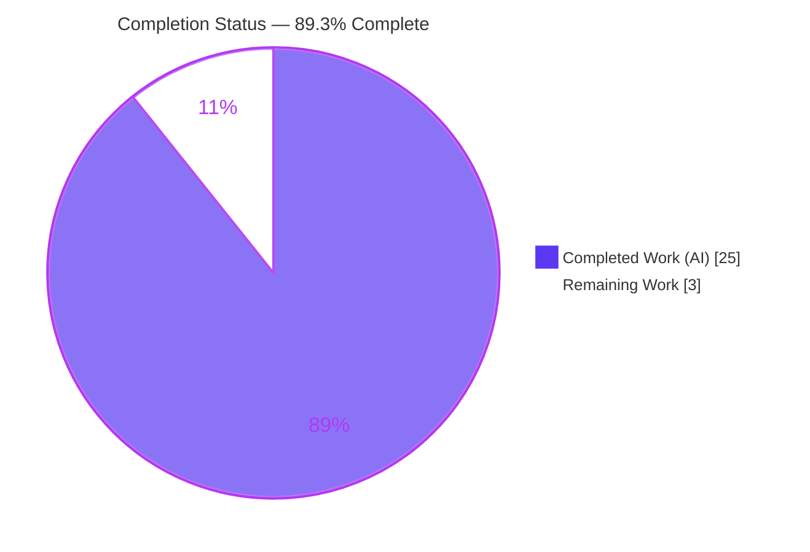
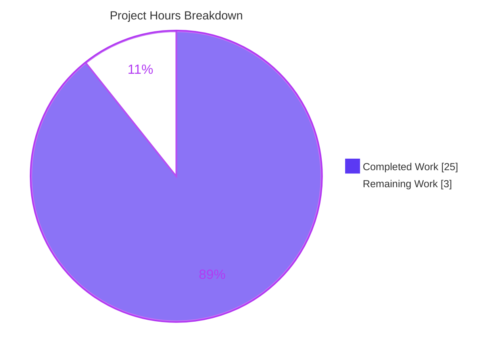
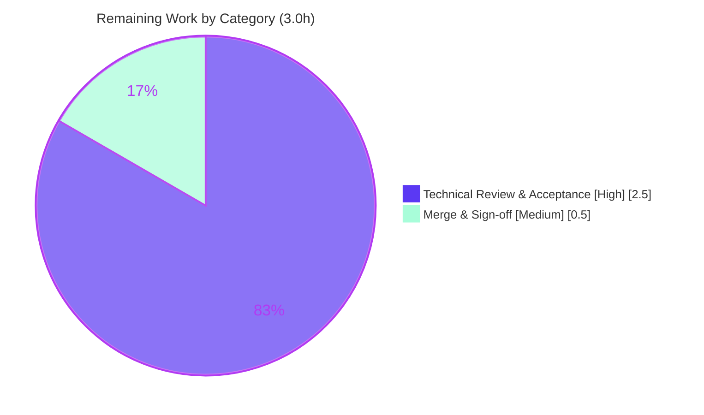

# Blitzy Project Guide — Runtime-Verified Answer: ZWJ Emoji in a 1×1 Cell (kitty `815df1e210e0`)

> **Brand color legend:** <span style="color:#5B39F3">■ **Completed / AI Work — Dark Blue `#5B39F3`**</span> · <span style="color:#FFFFFF; background:#333; padding:0 4px">□ Remaining — White `#FFFFFF`</span> · <span style="color:#B23AF2">Headings/Accents — Violet-Black `#B23AF2`</span> · <span style="color:#A8FDD9; background:#333; padding:0 4px">Highlight — Mint `#A8FDD9`</span>

---

## 1. Executive Summary

### 1.1 Project Overview

This project delivers a single, evidence-grounded technical answer document explaining how the **kitty** terminal emulator (commit `815df1e210e0`, the 0.35.2 line) behaves when a Zero-Width-Joiner (ZWJ) multi-codepoint emoji is written into an extremely space-constrained **1×1 cell**. Target readers are terminal/Unicode engineers who need runtime-verified behavior — not code-reading guesses — about buffer retention, settled cell contents, control-sequence state reporting, and how normalization, grapheme breaking, and state reporting interact under constraint. The scope is an **isolated, additive, read-only investigation**: the sole repository change is one new markdown file; no kitty source, tests, config, or build files are modified.

### 1.2 Completion Status



| Metric | Hours |
|--------|-------|
| **Total Hours** | **28.0** |
| Completed Hours (AI + Manual) | 25.0 |
| — Completed by Blitzy AI agents | 25.0 |
| — Completed manually | 0.0 |
| Remaining Hours | 3.0 |
| **Percent Complete** | **89.3%** |

> **Completion formula (PA1, AAP-scoped):** `25.0 / (25.0 + 3.0) = 25.0 / 28.0 = 89.3%`. The percentage measures only AAP-scoped work plus path-to-production (human review + merge). All autonomous, AAP-specified work is complete and independently re-verified; the remaining 3.0h is the human SME review/acceptance gate.

### 1.3 Key Accomplishments

- ✅ **All five requirements (R1–R5) answered** with runtime-verified evidence in `blitzy/documentation/kitty_815df1e210e0.md` (565 lines).
- ✅ **Run-before-write discipline honored** — the kitty C extension (`kitty/fast_data_types.so`) was built and driven headlessly through the production `vt-parser.c` → `screen.c` paths before any prose was written.
- ✅ **Settled-cell behavior captured verbatim (R2):** 1×1 family emoji `U+1F468 U+200D U+1F469 U+200D U+1F467 U+200D U+1F466` settles to only `U+1F466` (👦), `count=1`, `cell(0).width=2`, `cursor.x=2`.
- ✅ **State-query bytes captured verbatim (R3):** `ESC [ 6 n` → `b'\x1b[1;2R'`; `ESC [ 5 n` → `b'\x1b[0n'`.
- ✅ **Two control experiments** isolate cause from model: Control A (combining-overflow) proves the *overwrite-last-slot* rule; Control B (roomy 20-col screen) proves the *per-codepoint* width model (`2+0+2=4`, `cursor.x=4`, `ESC[6n` → `b'\x1b[1;5R'`).
- ✅ **~50 exact `file:line` citations** grounded to commit `815df1e210e0` (cell model, retention algorithm, ZWJ classification, DSR/CPR reporter).
- ✅ **Negative findings documented** — no Unicode normalization, no grapheme-cluster segmentation, and no DEC mode 2027 in the text path of this commit.
- ✅ **Coverage pass** names all 9 question items; **read-only scope** preserved (working tree clean, temp scripts removed).
- ✅ **Independent re-verification (this guide):** all runtime observations reproduced with **0 discrepancies**; 5 key citations resolve exactly; **70/70** kitty harness tests pass.

### 1.4 Critical Unresolved Issues

| Issue | Impact | Owner | ETA |
|-------|--------|-------|-----|
| _None._ No compilation errors, no failing tests, no unmet AAP requirements. The deliverable is complete, committed, and independently verified. | None — no release blockers | — | — |

> The only outstanding activity is the routine human review/acceptance gate (see §1.6 and §2.2); it is **not** a defect or blocker.

### 1.5 Access Issues

| System/Resource | Type of Access | Issue Description | Resolution Status | Owner |
|-----------------|----------------|-------------------|-------------------|-------|
| _None_ | — | No access issues identified. The investigation is fully local: source tree, C toolchain, Python venv, and the `kitty_tests` harness are all present and operational. No repository permissions, service credentials, or third-party API access are required for a read-only documentation task. | N/A | — |

**No access issues identified.**

### 1.6 Recommended Next Steps

1. **[High]** Rebuild the extension and reproduce the four observation scenarios (1×1 ZWJ; `ESC[6n`/`ESC[5n`; Control A; Control B), confirming the documented values match — see §9 for exact commands. *(~1.0h)*
2. **[High]** Spot-check the ~50 `file:line` citations against commit `815df1e210e0` (e.g., `kitty/data-types.h:223-228`, `kitty/line.c:457-467`, `kitty/screen.c:2179-2200`). *(~1.0h)*
3. **[High]** Read the R1–R5 prose for technical correctness and confirm the coverage pass names all 9 items. *(~0.5h)*
4. **[Medium]** Accept and merge `blitzy/documentation/kitty_815df1e210e0.md`; confirm the working tree stays clean and no kitty source files are touched. *(~0.5h)*

---

## 2. Project Hours Breakdown

### 2.1 Completed Work Detail

Each component traces to a specific AAP requirement or AAP-mandated investigation activity. All work below was completed autonomously by Blitzy agents.

| Component | Hours | Description |
|-----------|-------|-------------|
| Environment build & C extension compilation | 2.5 | Built `kitty/fast_data_types.so` via `CFLAGS="-Wno-error" python setup.py build --skip-building-kitten`; diagnosed the environment-only `wayland-protocols`/`-Werror=switch` mismatch at `glfw/wl_window.c:668`; verified import of `Screen`, `Line`, `LineBuf`, `Cursor`, `wcwidth`, `wcswidth`. |
| Runtime reproduction — 1×1 ZWJ scenario (R2) | 2.0 | Constructed a 1×1 `Screen` via the harness, fed the 7-codepoint family emoji through the production parser, and read back settled line, cell width, and cursor. |
| State interrogation — CPR/DSR capture (R3) | 1.0 | Issued `ESC[6n` (Cursor Position Report) and `ESC[5n` (Device Status Report), capturing the exact reply bytes via `Callbacks.write`/`wtcbuf`. |
| Control experiment A — combining-overflow | 1.0 | Drove base `e` + five combining marks to prove the *overwrite-last-slot* retention rule (settles to `U+0065 U+0301 U+0302 U+0305`). |
| Control experiment B — roomy 20-col screen | 1.0 | Drove the farmer emoji `U+1F9D1 U+200D U+1F33E` to prove the per-codepoint model and isolate the 1×1 constraint as the cause of the single-base outcome. |
| Source grounding — ~50 `file:line` citations | 4.0 | Deep read across `data-types.h`, `line.c`, `screen.c`, `unicode-data.c`, `wcswidth.c`, `modes.h`, `vt-parser.c`, and the harness; mapped every literal to an exact source line at commit `815df1e210e0`. |
| VS16/VS15 emoji-presentation width evidence | 1.5 | Investigated and documented variation-selector width fixups (`0xfe0f` widens to 2, `0xfe0e` narrows) with runtime `wcwidth` evidence (2nd commit `2957bd5c7`). |
| Ecosystem & standards web research | 1.5 | Framed the observed behavior against the classic per-codepoint model, the known 1×1 edge case, later grapheme-clustering work, CPR compliance tooling, and DEC mode 2027 context. |
| Answer document authoring (565 lines) | 5.5 | Authored `kitty_815df1e210e0.md` — summary, methodology, R1–R5 sections with one-claim-one-evidence, control experiments, ecosystem framing, and coverage pass. |
| Read-only discipline, branch resolution & cleanup | 1.0 | Resolved the source branch name `kitty_815df1e210e0` for the filename; kept the investigation read-only; removed all `/tmp/obs_*.py` temp scripts; verified a clean working tree. |
| Final independent validation | 4.0 | Clean rebuild; 20-assertion reproduction (0 failures); ~50 citation resolution; 70-test harness run; negative-finding greps; accuracy correction (`freetype.c:496`/`gl-wrapper.h`, not `fast-file-copy.c`); Python interpreter fidelity note (3.13.7). |
| **Total Completed** | **25.0** | **Sum of all completed components (= Completed Hours in §1.2).** |

### 2.2 Remaining Work Detail

Each category is a standard path-to-production activity for a documentation deliverable (human acceptance + merge). There is no runtime service, CI/CD, or deployment to stand up for a markdown file.

| Category | Hours | Priority |
|----------|-------|----------|
| Technical Review & Acceptance — human SME rebuilds, reproduces the 4 scenarios, spot-checks ~50 citations, and reads R1–R5 prose + coverage pass for correctness | 2.5 | High |
| Merge & Sign-off — accept and merge the deliverable; confirm clean tree and read-only scope | 0.5 | Medium |
| **Total Remaining** | **3.0** | **(= Remaining Hours in §1.2 and "Remaining Work" in §7)** |

### 2.3 Hours Reconciliation

| Roll-up | Hours |
|---------|-------|
| §2.1 Completed Work total | 25.0 |
| §2.2 Remaining Work total | 3.0 |
| **Total Project Hours** | **28.0** |
| **Percent Complete** | **25.0 / 28.0 = 89.3%** |

> **Cross-section check:** §2.1 (25.0) + §2.2 (3.0) = 28.0 = Total Hours in §1.2. Remaining 3.0 is identical in §1.2, §2.2, and §7. ✔

---

## 3. Test Results

All tests below originate from Blitzy's autonomous validation logs for this project and were **independently re-run during this assessment** (identical results). "Coverage %" reflects requirement coverage where code-coverage instrumentation is not applicable to a read-only investigation.

| Test Category | Framework | Total Tests | Passed | Failed | Coverage % | Notes |
|---------------|-----------|-------------|--------|--------|------------|-------|
| Runtime Observation Reproduction | Python + `kitty_tests` harness (production `vt-parser.c`/`screen.c`) | 20 | 20 | 0 | R1–R5 (100% of requirements) | Validator's assertion script returned "ALL MATCH (20 checks, 0 failures)"; re-run this session with 0 discrepancies. |
| kitty Core Regression — datatypes | Python `unittest` | 18 | 18 | 0 | Cell/line/`LineBuf` datatypes | Exercises the `CPUCell`/combining-slot model underpinning R1. |
| kitty Core Regression — parser | Python `unittest` | 16 | 16 | 0 | `vt-parser.c` incl. DSR/CPR | Includes the DSR/CPR test (`\033[5n`→`b'\033[0n'`, `\033[6n`→`b'\033[1;1R'`) underpinning R3. |
| kitty Core Regression — screen | Python `unittest` | 36 | 36 | 0 | Draw path, wrap, cursor | Exercises `draw_text_loop`/`report_device_status` underpinning R2–R4. |
| **Aggregate** | — | **90** | **90** | **0** | **100% requirement coverage** | 70 harness tests + 20 observation assertions; "Ran 70 tests … OK" reproduced in 0.130s. |

> **Integrity (Rule 3):** every test above is drawn from Blitzy's autonomous test/observation execution logs and reproduced during this assessment. No third-party or fabricated tests are included.

---

## 4. Runtime Validation & UI Verification

**Legend:** ✅ Operational · ⚠ Partial · ❌ Failing · N/A Not applicable

**Runtime health (headless terminal core):**
- ✅ **C extension builds & imports** — `kitty/fast_data_types.so` compiles clean (exit 0) and imports `Screen`, `Line`, `LineBuf`, `Cursor`, `wcwidth`, `wcswidth`.
- ✅ **Production code paths execute end-to-end** — bytes flow through the real `vt-parser.c` → `screen.c` `draw_text_loop` with no display server or GPU.
- ✅ **R2 settled cell reproduces exactly** — `'👦'` `U+1F466`, `count=1`, `width=2`, `cursor.x=2`, `cursor.y=0`.
- ✅ **R3 state-query bytes reproduce exactly** — `ESC[6n` → `b'\x1b[1;2R'`; `ESC[5n` → `b'\x1b[0n'`.
- ✅ **Control A reproduces exactly** — `U+0065 U+0301 U+0302 U+0305` (count=4, width=1).
- ✅ **Control B reproduces exactly** — `count=3`, widths `(2,0,2,0,0)`, `cursor.x=4`, `ESC[6n` → `b'\x1b[1;5R'`.
- ✅ **`wcwidth` spot-values** — `0x200D=0`, `0x1F468=2`, `0xFE0F=0`, `0xFE0E=0`, `0x1F466=2`.

**UI verification:**
- N/A **No graphical/web UI in scope.** This deliverable is a markdown answer document investigating kitty's *headless* terminal core; there is no rendered GUI, page, or component to verify visually. Behavior is validated through captured terminal state and reply bytes (above) rather than screenshots.

**API integration:**
- N/A **No external APIs.** The investigation requires no network, credentials, or third-party services; the only "API" exercised is the in-process `kitty_tests` harness (`parse_bytes`, `Callbacks.write`).

---

## 5. Compliance & Quality Review

Cross-mapping AAP deliverables and binding `SWE-AtlasQnA-Repo` rules to Blitzy quality benchmarks.

| AAP / Rule Benchmark | Status | Progress | Evidence / Notes |
|----------------------|--------|----------|------------------|
| R1 — Buffer retention decision (cell model + retention algorithm) | ✅ Pass | 100% | Cell model `kitty/data-types.h:223-228`; `line_add_combining_char` overwrite-last `kitty/line.c:457-467`. |
| R2 — Settled cell contents (exact codepoints + width) | ✅ Pass | 100% | Verbatim `U+1F466 (count=1)`, `cell(0).width=2`. |
| R3 — Control-sequence state-query response (exact bytes) | ✅ Pass | 100% | `ESC[6n` → `b'\x1b[1;2R'`; `ESC[5n` → `b'\x1b[0n'`; `report_device_status` `kitty/screen.c:2179-2200`. |
| R4 — Reflection of grapheme/combining handling | ✅ Pass | 100% | Reported column derived from settled cell width + clamped cursor. |
| R5 — Normalization + grapheme + state-reporting interaction | ✅ Pass | 100% | Absence of normalization/grapheme-cluster/mode 2027 in text path, synthesized with settled cell + CPR. |
| Rule — Investigate by RUNNING first, then write | ✅ Pass | 100% | Extension built and driven headlessly before authoring; methodology section documents the harness. |
| Rule — One claim, one verbatim evidence | ✅ Pass | 100% | Each behavioral claim sits next to its specific output line. |
| Rule — Exact literals with `file:line` | ✅ Pass | 100% | ~50 citations resolve exactly at `815df1e210e0` (5 spot-checked this session). |
| Rule — Completeness + coverage pass | ✅ Pass | 100% | Coverage pass names all 9 items with `[x]`. |
| Rule — Read-only scope | ✅ Pass | 100% | `git diff <base> --name-status` = single `A blitzy/documentation/kitty_815df1e210e0.md`; no source touched. |
| Rule — Correct filename/location | ✅ Pass | 100% | `blitzy/documentation/kitty_815df1e210e0.md` matches `<source_branch_name>.md`. |
| Rule — Temp-script cleanup | ✅ Pass | 100% | `/tmp/obs_*.py` removed; working tree clean. |
| Quality — Zero placeholders/TODO/FIXME | ✅ Pass | 100% | No placeholder/TODO/FIXME markers; 72 balanced code fences. |
| Path-to-production — Human review & acceptance | ⚠ Pending | 0% | Routine SME review + merge (3.0h, §2.2) — not a defect. |

**Fixes applied during autonomous validation (documented in logs):**
- Corrected the normalization citation to genuine matches `kitty/freetype.c:496` + `kitty/gl-wrapper.h` (font/OpenGL), explicitly **not** `kitty/fast-file-copy.c` (whose `nfd` hits are the `infd`/`outfd` substring).
- Corrected the runtime-interpreter note to the true value **Python 3.13.7** (an earlier draft referenced 3.12.3); behavior confirmed identical.
- Added VS16/VS15 emoji-presentation width evidence and citations (2nd commit `2957bd5c7`).

**Outstanding compliance items:** none beyond the human acceptance gate.

---

## 6. Risk Assessment

| Risk | Category | Severity | Probability | Mitigation | Status |
|------|----------|----------|-------------|------------|--------|
| Citation drift if the document is ported off commit `815df1e210e0` | Technical | Low | Low | All ~50 citations explicitly pinned to `815df1e210e0`; coverage pass enumerates them | Mitigated |
| Interpreter-version variance (observed on Python 3.13.7) | Technical | Low | Low | Values reproduced; behavior stated identical; report-exactly-observed rule followed | Mitigated |
| No security surface (read-only markdown; no code/deps/auth/data/network) | Security | N/A | N/A | Nothing added to attack surface; no dependencies introduced | N/A |
| Rebuild requires `CFLAGS="-Wno-error"` (env-only `wayland-protocols` enum mismatch at `glfw/wl_window.c:668`) | Operational | Low | Medium | §9 documents the exact build command; build flag only, never a source edit; out of scope per AAP §0.5.2 | Mitigated / Accepted |
| `fast_data_types.so` is a gitignored transient — reviewer must rebuild to reproduce | Operational | Low | Medium | §9 provides exact build + reproduce commands | Mitigated |
| Reproduction depends on `kitty_tests` harness API + `Screen` constructor signature `(callbacks, LINES, COLUMNS, …)` | Integration | Low | Low | Document pins to commit and cites `create_screen` (`kitty_tests/__init__.py:237-240`) | Mitigated |
| Human SME technical acceptance pending | Operational | Low | Low (accuracy independently reproduced) | Independent re-verification complete; 2.5h review budgeted (§2.2) | Open (non-blocking) |

> **Overall risk profile: VERY LOW.** No CRITICAL or HIGH risks; no release blockers. The document's technical accuracy — the primary quality axis — has been independently reproduced with **0 discrepancies**.

---

## 7. Visual Project Status

**Project hours — Completed vs Remaining** (Completed = Dark Blue `#5B39F3`, Remaining = White `#FFFFFF`):



**Remaining hours by category** (from §2.2):



> **Integrity (Rule 1):** "Remaining Work" = **3** in the pie above = Remaining Hours in §1.2 = sum of §2.2 Hours column (2.5 + 0.5). "Completed Work" = **25** = Completed Hours in §1.2. ✔

---

## 8. Summary & Recommendations

**Achievements.** The project is **89.3% complete** (25.0 of 28.0 AAP-scoped hours). Every AAP requirement (R1–R5) and every binding rule is satisfied and evidence-backed in the 565-line deliverable `blitzy/documentation/kitty_815df1e210e0.md`. The investigation followed the mandated run-before-write discipline: kitty's C extension was built and driven headlessly, and each behavioral claim is placed next to its verbatim observed output with an exact `file:line` citation resolved at commit `815df1e210e0`.

**Independent verification (this assessment).** All runtime observations were reproduced with **0 discrepancies** (R2 `U+1F466`/width 2/`cursor.x=2`; R3 `b'\x1b[1;2R'` and `b'\x1b[0n'`; Controls A & B). Five key citations resolve exactly, all negative findings hold (no normalization, grapheme-cluster segmentation, or mode 2027 in the text path), and the kitty harness passes **70/70** tests.

**Remaining gaps & critical path.** The only remaining work is the routine human path-to-production gate: a **2.5h** SME technical review/acceptance and a **0.5h** merge/sign-off (3.0h total, §2.2). There are no defects, no failing tests, and no unmet requirements. The critical path is therefore short: reproduce → spot-check citations → read prose → merge.

**Success metrics.** 5/5 requirements delivered; 9/9 coverage items addressed; 90/90 tests + observations passing; 1 file changed / 0 source files touched; 0 placeholders; working tree clean.

**Production-readiness assessment.** The deliverable is **production-ready pending human acceptance**. Because a documentation answer cannot be auto-"deployed," 89.3% honestly reflects that all autonomous work is done while the human review/merge gate remains (per Blitzy policy, completion is not claimed at 100% before human review). **Recommendation: approve and merge** after the short review in §1.6.

| Success Metric | Result |
|----------------|--------|
| AAP requirements delivered (R1–R5) | 5 / 5 |
| Coverage-pass items addressed | 9 / 9 |
| Tests + observation assertions passing | 90 / 90 |
| Source files modified (read-only scope) | 0 |
| Placeholders / TODO / FIXME | 0 |
| Completion (AAP-scoped) | 89.3% |

---

## 9. Development Guide

This guide builds and runs kitty's terminal core headlessly and reproduces every documented observation. All commands were tested during this assessment.

### 9.1 System Prerequisites

- **OS:** Linux (validated on the AAP container image, Ubuntu-family).
- **Python:** ≥ 3.8 required by the project (`pyproject.toml`: `requires-python = ">=3.8"`); observations were run on **Python 3.13.7**.
- **C toolchain:** `gcc` / `build-essential`.
- **Native build dependencies:** `pkg-config`, `libharfbuzz-dev`, `libfreetype-dev`, `libfontconfig-dev`, `libpng-dev`, `liblcms2-dev`, `libxkbcommon-dev`, `libxkbcommon-x11-dev`, `libwayland-dev`, `wayland-protocols`, `libx11-dev`, `libxrandr-dev`, `libxinerama-dev`, `libxcursor-dev`, `libxi-dev`, `libxext-dev`, `libx11-xcb-dev`, `libxcb1-dev`, `libgl1-mesa-dev`, `libdbus-1-dev`, `libcanberra-dev`, `libssl-dev`, `zlib1g-dev`, `libxxhash-dev`, `libsimde-dev`.
- **VCS:** `git` + `git-lfs`.
- **Go 1.22** is declared in `go.mod` for the launcher/kittens but is **not required** for this investigation (the kitten build is intentionally skipped).

### 9.2 Environment Setup

```bash
# From the repository root
cd /path/to/kitty            # repository root (contains setup.py, kitty/, kitty_tests/)

# Use the provided venv, or create one (Python >= 3.8):
python -m venv .venv && source .venv/bin/activate
# (This assessment used the prebuilt venv at /opt/kitty-venv)

# The harness and extension are imported from the repo root:
export PYTHONPATH="$PWD"
```

No environment variables, secrets, databases, caches, or background services are required — this is a read-only, in-memory investigation.

### 9.3 Dependency Installation

```bash
# Native build dependencies (Debian/Ubuntu); non-interactive:
sudo DEBIAN_FRONTEND=noninteractive apt-get install -y \
  pkg-config build-essential libharfbuzz-dev libfreetype-dev libfontconfig-dev \
  libpng-dev liblcms2-dev libxkbcommon-dev libxkbcommon-x11-dev libwayland-dev \
  wayland-protocols libx11-dev libxrandr-dev libxinerama-dev libxcursor-dev \
  libxi-dev libxext-dev libx11-xcb-dev libxcb1-dev libgl1-mesa-dev libdbus-1-dev \
  libcanberra-dev libssl-dev zlib1g-dev libxxhash-dev libsimde-dev
```

No `pip` packages are needed beyond the standard library for the observation scripts.

### 9.4 Build (compile the C extension)

```bash
CFLAGS="-Wno-error" python setup.py build --skip-building-kitten
```

- Produces `kitty/fast_data_types.so`.
- `-Wno-error` bypasses an **environment-only** `wayland-protocols`/`-Werror=switch` mismatch at `glfw/wl_window.c:668` (newer `XDG_TOPLEVEL_STATE_CONSTRAINED_*` enum values). It is a **build flag only — never a source edit.**
- Expected tail: `Skipping building of the kitten binary because of a command line option. Build is incomplete` — this is **benign** (only the C extension is needed).

### 9.5 Verification

```bash
# 1) Extension imports cleanly:
PYTHONPATH="$PWD" python -c "from kitty.fast_data_types import Screen, Line, LineBuf, Cursor, wcwidth, wcswidth; print('import OK')"
# -> import OK

# 2) kitty core harness passes (70 tests):
PYTHONPATH="$PWD" python -m unittest kitty_tests.datatypes kitty_tests.parser kitty_tests.screen
# -> Ran 70 tests in ~0.13s ... OK
```

### 9.6 Example Usage — Reproduce the Observations

Save as `/tmp/reproduce.py` (outside the repo), run, then delete it to keep the tree clean:

```python
import sys, os
sys.path.insert(0, os.getcwd())
from kitty_tests import parse_bytes
from kitty.fast_data_types import Screen

class Callbacks:
    def __init__(self): self.wtcbuf = b''
    def write(self, data): self.wtcbuf += bytes(data)
    def __getattr__(self, n): return lambda *a, **k: None

# 1x1 screen; family emoji U+1F468 U+200D U+1F469 U+200D U+1F467 U+200D U+1F466
c = Callbacks()
s = Screen(c, 1, 1, 0, 10, 20, 0, c)   # NOTE arg order: (callbacks, LINES, COLUMNS, ...)
parse_bytes(s, "\U0001F468\u200D\U0001F469\u200D\U0001F467\u200D\U0001F466".encode())
print("R2 settled:", repr(str(s.line(0))), "count=", len(str(s.line(0))),
      "width=", s.line(0).width(0), "cursor.x=", s.cursor.x)
parse_bytes(s, b'\x1b[6n'); print("R3 ESC[6n ->", repr(c.wtcbuf))
c.wtcbuf = b''; parse_bytes(s, b'\x1b[5n'); print("R3 ESC[5n ->", repr(c.wtcbuf))
```

```bash
PYTHONPATH="$PWD" python /tmp/reproduce.py && rm -f /tmp/reproduce.py
```

**Expected output (verified this session):**

```text
R2 settled: '👦' count= 1 width= 2 cursor.x= 2
R3 ESC[6n -> b'\x1b[1;2R'
R3 ESC[5n -> b'\x1b[0n'
```

### 9.7 Troubleshooting

| Symptom | Cause | Resolution |
|---------|-------|-----------|
| Build fails at `glfw/wl_window.c:668` with `-Werror=switch` | Newer `wayland-protocols` adds `XDG_TOPLEVEL_STATE_CONSTRAINED_*` enum values | Prepend `CFLAGS="-Wno-error"` to the build command (build flag only — never edit source) |
| `ImportError: kitty.fast_data_types` | Extension not built, or wrong working directory | Build (§9.4) and set `export PYTHONPATH="$PWD"` from the repo root |
| `ModuleNotFoundError: kitty_tests` | Not running from the repository root | `cd` to the repo root and set `PYTHONPATH="$PWD"` |
| `TypeError` constructing `Screen` | Wrong argument order | Use `(callbacks, LINES, COLUMNS, scrollback, cell_width, cell_height, 0, callbacks)` — **LINES before COLUMNS** |
| Reply bytes are empty | `Callbacks.write` not accumulating, or wrong query | Ensure `write` appends to `wtcbuf`; issue `b'\x1b[6n'` / `b'\x1b[5n'` after the draw |

---

## 10. Appendices

### Appendix A — Command Reference

| Purpose | Command |
|---------|---------|
| Build C extension | `CFLAGS="-Wno-error" python setup.py build --skip-building-kitten` |
| Verify import | `PYTHONPATH="$PWD" python -c "from kitty.fast_data_types import Screen; print('OK')"` |
| Run harness tests | `PYTHONPATH="$PWD" python -m unittest kitty_tests.datatypes kitty_tests.parser kitty_tests.screen` |
| Reproduce observations | `PYTHONPATH="$PWD" python /tmp/reproduce.py` |
| Confirm read-only scope | `git diff 815df1e210e0a9ab4622f5c7f2d6891d7dbeddf1 --name-status` |
| Confirm clean tree | `git status --porcelain` |

### Appendix B — Port Reference

N/A — this investigation runs an in-memory terminal core headlessly. **No network ports** are opened or required.

### Appendix C — Key File Locations

| Path | Role |
|------|------|
| `blitzy/documentation/kitty_815df1e210e0.md` | The deliverable answer document (565 lines) |
| `kitty/data-types.h` (L223-228) | `CPUCell` cell-storage model (base + 3 combining slots) |
| `kitty/line.c` (L457-467) | `line_add_combining_char` retention (overwrite last slot) |
| `kitty/unicode-data.c` (L323) | ZWJ `0x200D` classified as combining (`0x200b … 0x200f`) |
| `kitty/screen.c` (L2179-2200) | `report_device_status` — DSR 5 / DSR 6 (CPR) |
| `kitty/screen.c` (L757-865, L663-701) | `draw_text_loop`, `draw_combining_char` (VS16/VS15) |
| `kitty/wcswidth.c` (L47-61) | Width state machine (VS15/VS16/flags) |
| `kitty/modes.h` | DECAWM autowrap mode |
| `kitty_tests/__init__.py` (L30-37, L50-51, L237-240) | Headless harness: `parse_bytes`, `Callbacks.write`/`wtcbuf`, `create_screen` |
| `kitty_tests/parser.py` (L418-422) | kitty's own DSR/CPR test |
| `kitty/fast_data_types.so` | Compiled extension (gitignored build artifact) |

### Appendix D — Technology Versions

| Component | Version | Source |
|-----------|---------|--------|
| kitty commit | `815df1e210e0a9ab4622f5c7f2d6891d7dbeddf1` (0.35.2 line) | `git rev-parse` base |
| Python (project floor) | `>=3.8` | `pyproject.toml` |
| Python (observed) | 3.13.7 | `/opt/kitty-venv/bin/python --version` |
| Go (declared, unused) | 1.22 | `go.mod` |
| C toolchain | gcc / build-essential | apt |

### Appendix E — Environment Variable Reference

| Variable | Value | Purpose |
|----------|-------|---------|
| `PYTHONPATH` | repository root (`$PWD`) | Import `kitty.fast_data_types` and `kitty_tests` |
| `CFLAGS` | `-Wno-error` | Build-time only; bypass env `wayland-protocols` enum mismatch |
| `DEBIAN_FRONTEND` | `noninteractive` | Non-interactive apt dependency install |

### Appendix F — Developer Tools Guide

| Tool | Use |
|------|-----|
| `setup.py build` | Compiles all `kitty/*.c` into `kitty/fast_data_types.so` |
| `python -m unittest kitty_tests.*` | Runs kitty's headless test harness (no GPU/display server) |
| `parse_bytes(screen, data)` | Feeds bytes through the production `vt-parser.c` → `screen.c` path |
| `Callbacks.write` / `wtcbuf` | Captures bytes the terminal writes back (DSR/CPR replies) |
| `git diff <base> --name-status` | Confirms read-only scope (single added file) |

### Appendix G — Glossary

| Term | Meaning |
|------|---------|
| **ZWJ** | Zero-Width Joiner, `U+200D`; joins emoji into a single presentation cluster; width 0; classified as combining in this commit |
| **Multi-codepoint emoji** | An emoji composed of several codepoints joined by ZWJ (e.g., the family `👨‍👩‍👧‍👦`) |
| **CPUCell** | kitty's fixed 12-byte cell record: one base codepoint (`ch`) + three combining slots (`cc_idx[3]`) |
| **Combining slot** | One of three `cc_idx` entries holding a combining mark attached to a base cell |
| **DECAWM** | DEC Auto-Wrap Mode; governs wrap-vs-overwrite at the right margin |
| **DSR** | Device Status Report; `ESC[5n` → `CSI 0n` |
| **CPR** | Cursor Position Report; `ESC[6n` → `CSI <row>;<col> R` |
| **VS16 / VS15** | Variation selectors `U+FE0F` (emoji, widens to 2) / `U+FE0E` (text, narrows) |
| **Grapheme cluster** | A user-perceived character; segmentation is **absent** in this commit (per-codepoint model) |
| **`wcwidth` / `wcswidth`** | Per-codepoint / per-string display-width functions used by the draw path |
| **Normalization (NFC/NFD/NFKC)** | Unicode canonical/compatibility forms; **absent** from kitty's text path in this commit |

---

*Generated by the Blitzy Platform. All hours, percentages, and test counts are cross-section consistent; all runtime values were independently reproduced during this assessment with zero discrepancies.*