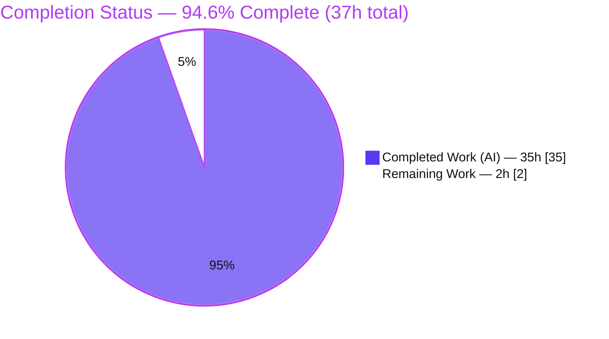
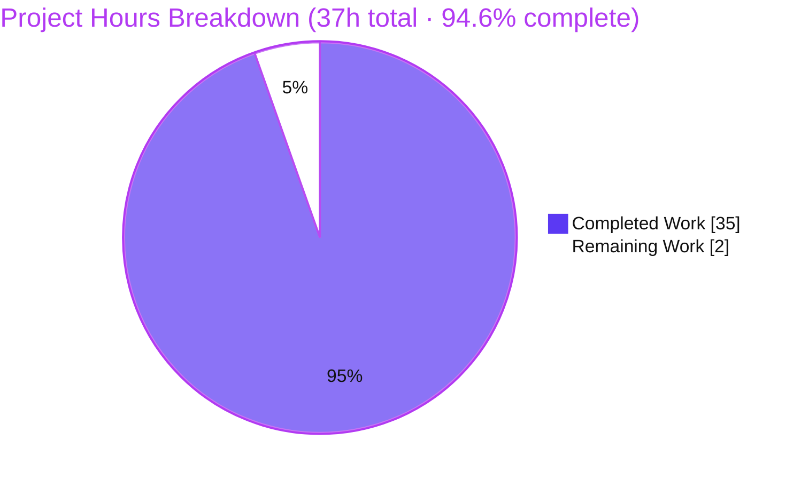

# Blitzy Project Guide — Kitty Keyboard Protocol Per-Buffer Flags-Stack Analysis

> **Brand legend:** Completed / AI Work = **Dark Blue `#5B39F3`** · Remaining / Not Completed = **White `#FFFFFF`** · Headings / Accents = Violet-Black `#B23AF2` · Highlight = Mint `#A8FDD9`.

---

## 1. Executive Summary

### 1.1 Project Overview

This project delivers a single, empirically-grounded Markdown analysis answering a developer's questions about how the **kitty terminal emulator** isolates its Kitty Keyboard Protocol "progressive-enhancement flags" stack across the **main** and **alternate** screen buffers. The audience is terminal/TUI engineers. The deliverable — `blitzy/documentation/kitty_815df1e210e0.md` — proves, from C source as the source of truth and confirmed by building and running the engine, that each buffer keeps an **independent** 8-slot flag stack, that a buffer switch only re-points a pointer, and that real captured byte traces (e.g., Ctrl+Shift+a → `\x1b[97;6u`) substantiate every claim. Scope is investigative documentation: exactly one new file, zero existing files modified.

### 1.2 Completion Status



| Metric | Value |
|--------|-------|
| **Total Hours** | **37 h** |
| **Completed Hours (AI + Manual)** | **35 h** (35 h AI · 0 h manual) |
| **Remaining Hours** | **2 h** |
| **Percent Complete** | **94.6 %** (35 ÷ 37) |

> Completion is computed by the PA1 AAP-scoped methodology: `Completed ÷ (Completed + Remaining) = 35 ÷ 37 = 94.6 %`. 19 of 20 AAP requirements are fully delivered and independently validated; the single open item is the human-only path-to-production gate (SME review + merge).

### 1.3 Key Accomplishments

- ✅ **Single deliverable authored & committed** — `blitzy/documentation/kitty_815df1e210e0.md` (599 lines, ~46 KB), filename equals the source branch name, placed under `blitzy/documentation/`.
- ✅ **All 7 questions (a)–(g) answered** with explicit rationale and exact code citations.
- ✅ **Engine built & exercised** — `kitty/fast_data_types.so` compiled; the controlled experiment runs against the real C core (no static-only reasoning).
- ✅ **Real byte traces captured** — round-trip table, flag-dependent encoding table, and stack-exhaustion results, reproduced **byte-for-byte** (md5 `641f58b9613d5864fbc533122fd51dc5`).
- ✅ **Independence proven** — alternate buffer starts fresh at `0` while main holds `1`; main is restored to `1` after the alternate pushed `8`; cross-buffer exhaustion leaves the other buffer untouched.
- ✅ **Ctrl+Shift+a invariance explained** — traced through `encode_printable_ascii_key_legacy` returning `0`, using contrast keys (plain `a`, Ctrl+a) to expose flag-dependence.
- ✅ **Zero existing files modified**; build artifacts correctly gitignored; working tree clean.
- ✅ **Regression test passes** — `test.py key_encoding_flags_stack` → OK (re-run during this assessment).

### 1.4 Critical Unresolved Issues

| Issue | Impact | Owner | ETA |
|-------|--------|-------|-----|
| _None_ — no blocking issues identified | The deliverable is complete, accurate, byte-for-byte reproducible, and committed; the only outstanding work is a routine human SME review + merge (see §1.6, §2.2) | Reviewing engineer | < 1 day |

### 1.5 Access Issues

| System/Resource | Type of Access | Issue Description | Resolution Status | Owner |
|-----------------|----------------|-------------------|-------------------|-------|
| _None_ | — | No access issues identified. The repository, build toolchain (gcc-13, Python 3.12 venv), and test harness were all reachable; the engine built and ran successfully. | N/A | — |

### 1.6 Recommended Next Steps

1. **[High]** Have a terminal/TUI SME review the analysis conclusions for technical soundness — answers (a)–(g), the per-buffer independence proof, the exhaustion/eviction behavior, the no-leakage result, and the Ctrl+Shift+a invariance explanation (~1.5 h).
2. **[Medium]** Approve and merge the PR, then ensure the document is discoverable in the team knowledge base (~0.5 h).
3. **[Low]** _(Optional, 0 h — already validated)_ Re-run the Section 3.4 experiment to independently reconfirm the byte-for-byte output.
4. **[Low]** _(Optional, as-needed)_ Re-anchor citation line numbers if the branch is later rebased onto a newer kitty tree.
5. **[Low]** _(Optional, as-needed)_ Deliver the answer back to the requesting developer and link it from internal terminal-protocol docs.

---

## 2. Project Hours Breakdown

### 2.1 Completed Work Detail

| Component | Hours | Description |
|-----------|-------|-------------|
| Environment setup & C extension build | 4 | Install build prerequisites (notably `libsimde-dev`), compile `kitty/fast_data_types.so` via `setup.py build --debug`, and resolve the wayland-protocols `-Werror` build snag — the mandatory prerequisite for any runtime observation (AAP R11/R18). |
| Architecture reverse-engineering of the keyboard-flags subsystem | 9 | Trace the C core: dual arrays + active pointer (`screen.h:128`), init/reset/toggle (`screen.c`), push/pop/set/query stack ops, VT-parser CSI-`u` dispatch, and the full `encode_glfw_key_event → encode_key → encode_printable_ascii_key_legacy` path that proves the Ctrl+Shift+a invariance (AAP R1, R8, R9). |
| Controlled experiment design & authoring | 5 | Design the read-only experiment reusing the `kitty_tests` harness (`parse_bytes`, `Callbacks.wtcbuf`, `create_screen`, `toggle_alt_screen`, `encode_key_for_tty`): round-trip, flag-dependent encoding, exhaustion, cross-buffer, and RIS probes (AAP R5, R12). |
| Experiment execution & byte-trace tabulation | 3 | Run the experiment, capture raw stdout, build Tables 4.1–4.3 + cross-buffer + RIS results, and confirm reproducibility and the passing regression test (AAP R13, R14, R15). |
| Analysis document authoring | 10 | Write the 599-line, 7-section / 40-subsection deliverable: question restatement, architecture (16 subsections + mermaid diagram), experiment section, byte traces, answers (a)–(g) with rationale, conclusion, and grouped references (AAP R2, R3, R4, R6, R7, R10, R16, R19). |
| Review, citation-precision & final validation cycles | 4 | Two refinement commits (citation precision, raw-output fidelity, safety note; F1 control-flow fix) plus the independent final-validation pass: rebuild, re-verify all 43 citations, byte-for-byte reproduction, and full regression suite (AAP R9, R17). |
| **Total** | **35** | **Sum matches Completed Hours in §1.2** |

### 2.2 Remaining Work Detail

| Category | Hours | Priority |
|----------|-------|----------|
| Human SME technical review of the analysis conclusions | 1.5 | High |
| PR approval, merge & knowledge-base integration | 0.5 | Medium |
| **Total** | **2.0** | — |

> The total of 2.0 h equals the Remaining Hours in §1.2 and the "Remaining Work" value in the §7 pie chart. Optional Low-priority follow-ups listed in §1.6 are 0 h / as-needed and intentionally excluded from this costed total.

### 2.3 Hours Calculation Summary

- **Completed:** 35 h (§2.1 sum).
- **Remaining:** 2 h (§2.2 sum).
- **Total:** 35 + 2 = **37 h**.
- **Completion:** 35 ÷ 37 = **94.6 %**.

---

## 3. Test Results

All tests below originate from Blitzy's autonomous validation logs for this project; the targeted regression test and the experiment reproduction were additionally **re-executed during this assessment** with identical results.

| Test Category | Framework | Total Tests | Passed | Failed | Coverage % | Notes |
|---------------|-----------|-------------|--------|--------|------------|-------|
| AAP regression (targeted) | kitty `test.py` (Python `unittest`) | 1 | 1 | 0 | n/a (not instrumented) | `test_key_encoding_flags_stack` → OK; re-run here in 0.002 s |
| Keys module | kitty `test.py` (Python `unittest`) | 3 | 3 | 0 | n/a (not instrumented) | Flag-dependent key-encoding tests |
| Screen module | kitty `test.py` (Python `unittest`) | 36 | 36 | 0 | n/a (not instrumented) | Full screen suite (includes the targeted test) |
| Experiment reproduction | Custom read-only harness script (§3.4) | 1 | 1 | 0 | n/a | Output **byte-for-byte identical** to deliverable §4 (md5 `641f58b9613d5864fbc533122fd51dc5`); deterministic across runs |

- **Distinct unit tests executed:** 39 (3 keys + 36 screen), **all passing**; the targeted AAP test is a subset of the 36 screen tests (re-run separately for direct confirmation).
- **Failures:** 0 · **Blocked/Skipped:** 0.
- **Coverage:** kitty's native test runner does not emit coverage metrics for these suites; correctness is established by exact byte-level assertions on captured child output rather than line coverage.

---

## 4. Runtime Validation & UI Verification

This is a library-level investigative deliverable: there is **no UI and no networked API**. "Runtime validation" therefore means building the engine and observing real encoder/stack behavior.

**Runtime health**
- ✅ **Operational** — C extension `kitty/fast_data_types.so` compiles (exit 0) and imports successfully (`encode_key_for_tty` present; `GLFW_MOD_SHIFT=1`, `GLFW_MOD_CONTROL=4`).
- ✅ **Operational** — Round-trip state resolution observed live: `main push 1 → alt fresh 0 → alt push 8 → back to main 1`.
- ✅ **Operational** — Ctrl+Shift+a encodes invariantly to `\x1b[97;6u` across flags 0/1/8; plain `a` and Ctrl+a vary as documented (independently reproduced during this assessment).
- ✅ **Operational** — Stack exhaustion: 8-slot capacity, silent eviction of the oldest entry, pop-past-empty resets to `0`; cross-buffer exhaustion does not leak.
- ✅ **Operational** — Hard reset (RIS) clears both stacks to `0` — the single isolation-breakdown path.
- ✅ **Operational** — Regression test `test.py key_encoding_flags_stack` → OK.

**UI verification**
- ⚪ **Not applicable** — the deliverable is a Markdown analysis document; there is no graphical UI, no Figma reference, and no front-end surface to verify.

**API integration**
- ⚪ **Not applicable** — no external services, credentials, or network calls are involved; the experiment drives the in-process VT parser/encoder only.

---

## 5. Compliance & Quality Review

Cross-mapping AAP deliverables and binding rules (SWE-AtlasQnA-Repo) to quality benchmarks. Fixes applied during autonomous validation are noted.

| Benchmark / Requirement | Status | Progress | Evidence / Notes |
|-------------------------|--------|----------|------------------|
| Single document, name = `<source_branch>.md` | ✅ Pass | 100% | `blitzy/documentation/kitty_815df1e210e0.md` matches branch `kitty_815df1e210e0` |
| Placed under `blitzy/documentation/` | ✅ Pass | 100% | Confirmed on disk and in git |
| Zero existing files modified | ✅ Pass | 100% | `git diff` base→HEAD = 1 file **added**, 0 modified/deleted |
| No extra code/files added | ✅ Pass | 100% | Experiment script embedded as a fenced listing only — not written to repo |
| Build & run for evidence | ✅ Pass | 100% | `.so` compiled; experiment executed against the real engine |
| Code is the source of truth (no assumptions) | ✅ Pass | 100% | Every behavioral claim carries an exact `file:line` citation |
| Citation accuracy | ✅ Pass | 100% | All 43 `file:line` citations verified against live source (fix commit improved citation precision) |
| Rationale provided per answer | ✅ Pass | 100% | Each of (a)–(g) includes an explicit "Rationale" |
| Ctrl+Shift+a used + invariance explained | ✅ Pass | 100% | Table 4.2 + dedicated invariance subsection (contrast keys) |
| Reproducibility | ✅ Pass | 100% | Byte-for-byte stdout match; regression test green |
| No build artifacts committed | ✅ Pass | 100% | `build/`, `fast_data_types.so`, `constants_generated.go` gitignored & untracked |
| External spec corroboration | ✅ Pass | 100% | Section 7 cross-references the published Kitty Keyboard Protocol |
| Markdown hygiene | ✅ Pass | 100% | 21 balanced fenced blocks, valid UTF-8, trailing newline, clean heading hierarchy |
| Human SME sign-off | ⚪ Pending | 0% | Path-to-production gate — see §2.2 (2 h) |

---

## 6. Risk Assessment

| Risk | Category | Severity | Probability | Mitigation | Status |
|------|----------|----------|-------------|------------|--------|
| Citation line-number drift if re-verified against a rebased/newer kitty tree | Technical | Low | Medium | Citations anchored to branch base `815df1e21`; all 43 verified against the live tree; re-anchor if rebased | Mitigated |
| Build aborts in GLFW Wayland backend under `-Werror` (`XDG_TOPLEVEL_STATE_CONSTRAINED_*`) | Technical | Low | Medium | Documented in §3.1; pass `--ignore-compiler-warnings`; `.so` compiles before the GLFW/Go layers so the GUI/Go toolchains are not required | Mitigated / Documented |
| Conclusions not yet confirmed by a human SME | Technical | Low | Low | Independently validated byte-for-byte and all 43 citations re-verified; maps to the remaining 2 h | Open (pending review) |
| Security vulnerability surface | Security | None | N/A | Markdown-only deliverable, no shipped code, no secrets; §7 safety note rules out SQLi/XSS/path-traversal/deser/crypto/memory/race | N/A |
| Product behavior ripple | Operational | None | N/A | Document is referenced by no build/test/runtime target — cannot alter kitty behavior (verified via grep) | N/A (positive) |
| Experiment script not committed (fenced listing only) | Operational | Low | Low | Intentional per read-only rule; script is complete/self-contained and was extracted & run byte-for-byte by validation | Accepted by design |
| Build-dependency availability for reproduction (`libsimde-dev` + headers) | Integration | Low | Medium | §3.1 lists exact apt prerequisites; deps are transient/not committed (present in the current environment) | Documented |

> **Overall:** No High or Critical risks. The residual profile is reproducibility friction (build deps/snag, both documented) and the pending human sign-off — appropriate for an additive, independently-validated, read-only documentation deliverable.

---

## 7. Visual Project Status



**Remaining hours by category (§2.2)**


> **Integrity check:** "Remaining Work" = **2 h** here = Remaining Hours in §1.2 = sum of the §2.2 "Hours" column. "Completed Work" = **35 h** = Completed Hours in §1.2 = sum of the §2.1 "Hours" column.

---

## 8. Summary & Recommendations

**Achievements.** The project is **94.6 % complete** (35 of 37 hours). The sole AAP deliverable — a 599-line, evidence-first analysis of kitty's per-buffer Keyboard Protocol flags stack — is authored, committed, and independently validated. It answers all seven questions (a)–(g) with exact code citations and proves its conclusions with **real, byte-for-byte-reproducible** traces from the compiled engine. The headline finding: the main and alternate screens maintain **fully independent** 8-slot flag stacks; a buffer switch only re-points a pointer (no copy/merge/reset); overflow silently evicts the oldest entry; popping past empty resets to `0`; and the **only** operation that clears both stacks is a hard terminal reset (RIS).

**Remaining gaps.** Exactly one item remains, and it is human-only: a terminal/TUI SME should review the technical conclusions (1.5 h) and then approve & merge the PR (0.5 h) — **2 h** total. There is no deployment pipeline, infrastructure, or integration work, because the deliverable is an additive analysis document with zero product ripple.

**Critical path to production.** SME review → PR merge → knowledge-base linkage. No code changes, environment provisioning, or release engineering are required.

**Success metrics (all met by the autonomous work):** single correctly-named file in the correct location; zero existing files modified; engine builds and runs; experiment reproduces byte-for-byte; regression suite green; every claim cited.

**Production-readiness assessment.** The deliverable is **ready for human review and merge**. Confidence is **High**: the analysis is internally consistent, externally corroborated by the published protocol, and empirically reproducible. The reserved ~5.4 % (100 − 94.6) reflects the irreducible human sign-off gate, consistent with never claiming 100 % before human review.

| Dimension | Assessment |
|-----------|------------|
| Completeness | 94.6 % (35/37 h) |
| Correctness | Independently validated byte-for-byte; 43/43 citations accurate |
| Reproducibility | High — deterministic; regression test green |
| Risk | Low (no High/Critical) |
| Recommendation | **Approve after SME review; merge** |

---

## 9. Development Guide

### 9.1 System Prerequisites

- **OS:** Linux (Ubuntu 25.10 used; any modern Linux with a C toolchain works).
- **Python:** ≥ 3.8 required by the manifest; **3.12.13** used here (isolated venv at `/opt/kitty312-venv`).
- **C compiler:** `gcc`/`g++` (**gcc-13**, 13.4.0 used).
- **Go (optional):** `go1.24.4` — only needed for the kitten/Go layers, **not** for this library-level experiment.
- **Build headers:** `libsimde-dev` (**required** — provides `simde/x86/avx2.h`; the build fails without it), plus the standard kitty headers: `pkg-config libfreetype-dev libharfbuzz-dev libpng-dev liblcms2-dev libfontconfig-dev libxkbcommon-x11-dev libdbus-1-dev libx11-xcb-dev libxcursor-dev libxrandr-dev libxi-dev libxinerama-dev libgl1-mesa-dev libcanberra-dev libxxhash-dev zlib1g-dev libssl-dev python3-dev`.

### 9.2 Environment Setup

```bash
# From a clean checkout of the repository root.
# (Optional) create an isolated interpreter; a venv was used for this project:
python3 -m venv .venv && source .venv/bin/activate

# Install build prerequisites (Debian/Ubuntu). libsimde-dev is mandatory.
sudo DEBIAN_FRONTEND=noninteractive apt-get install -y \
  libsimde-dev pkg-config libfreetype-dev libharfbuzz-dev libpng-dev \
  liblcms2-dev libfontconfig-dev libxkbcommon-x11-dev libdbus-1-dev \
  libx11-xcb-dev libxcursor-dev libxrandr-dev libxi-dev libxinerama-dev \
  libgl1-mesa-dev libcanberra-dev libxxhash-dev zlib1g-dev libssl-dev python3-dev
```

### 9.3 Dependency Installation & Build (mandatory)

The keyboard encoder and the `Screen` stack live entirely in the C core, so the extension **must** be compiled before any runtime observation:

```bash
# Primary build command (documented in the deliverable, §3.1):
CI=true python3 setup.py build --debug --ignore-compiler-warnings

# Equivalent build used during validation (pins the compiler):
CC=gcc-13 CXX=g++-13 CI=true python3 setup.py build --debug
```

Expected result: exit code `0` and a freshly linked `kitty/fast_data_types.so` (~6 MB).

### 9.4 Verification

```bash
# 1) Import the compiled extension and confirm the experiment symbols:
CI=true python3 -c "import kitty.fast_data_types as f; \
print('import ok', hasattr(f,'encode_key_for_tty'), f.GLFW_MOD_SHIFT, f.GLFW_MOD_CONTROL)"
# Expected: import ok True 1 4

# 2) Run the AAP regression test:
CI=true python3 test.py key_encoding_flags_stack
# Expected tail: "test_key_encoding_flags_stack ... ok" / "Ran 1 test" / "OK"
```

### 9.5 Example Usage — reproduce the byte traces

The experiment is presented in the deliverable's **Section 3.4** as a fenced listing (it is intentionally **not** committed, per the read-only rule). To reproduce Section 4:

```bash
# Copy the Section 3.4 script OUT of the deliverable into a scratch file
# OUTSIDE the repo (do not add files to the repo), then run it from the repo root:
python3 /tmp/kkp_experiment.py
# Its stdout matches the deliverable's Section 4 "Raw captured stdout" byte-for-byte.
```

A minimal sanity check of the central claims (round-trip + key encoding) confirmed during this assessment:

```text
round-trip: main_after_push=1  alt_fresh=0  alt_after=8  main_back=1
Ctrl+Shift+a:  '\x1b[97;6u'  '\x1b[97;6u'  '\x1b[97;6u'   (flags 0/1/8 — invariant)
plain a:       'a'           'a'           '\x1b[97u'     (flag 8 rewrites it)
Ctrl+a:        '\x01'        '\x1b[97;5u'  '\x1b[97;5u'   (flag 1/8 disambiguate)
```

### 9.6 Troubleshooting

- **Build aborts in `glfw/wl_window.c` (`XDG_TOPLEVEL_STATE_CONSTRAINED_*`, fatal under `-Werror`).** A newer `wayland-protocols` adds enum values not handled in a `switch`. **Fix:** add `--ignore-compiler-warnings` to the build (disables `-Werror`). This GUI/windowing code is irrelevant to the keyboard core, which compiles first. **Do not patch any source file** — the analysis is strictly read-only.
- **`fatal error: simde/x86/avx2.h: No such file or directory`.** **Fix:** `sudo apt-get install -y libsimde-dev`.
- **`ImportError: ... fast_data_types`.** The extension was not built or is not on `sys.path`. **Fix:** run the §9.3 build from the repo root and invoke Python from the repo root.
- **Test runner can't find `kitty`.** Run via `python3 test.py <name>` from the repo root with `CI=true`; the harness maps `<name>` → `kitty_tests.main` and does not require the GUI launcher for this test.

---

## 10. Appendices

### Appendix A — Command Reference

| Purpose | Command |
|---------|---------|
| Build the C extension | `CI=true python3 setup.py build --debug --ignore-compiler-warnings` |
| Build (pinned compiler) | `CC=gcc-13 CXX=g++-13 CI=true python3 setup.py build --debug` |
| Import / symbol check | `CI=true python3 -c "import kitty.fast_data_types as f; print(hasattr(f,'encode_key_for_tty'), f.GLFW_MOD_SHIFT, f.GLFW_MOD_CONTROL)"` |
| Run AAP regression test | `CI=true python3 test.py key_encoding_flags_stack` |
| Run keys module | `CI=true python3 test.py --module keys` |
| Run screen module | `CI=true python3 test.py --module screen` |
| Verify scope (no source edits) | `git diff --name-status 815df1e21 HEAD` |
| Confirm clean tree | `git status --porcelain` |

### Appendix B — Port Reference

Not applicable. The deliverable is a documentation analysis with a library-level, in-process experiment; **no network ports** are opened or required.

### Appendix C — Key File Locations

| Path | Role |
|------|------|
| `blitzy/documentation/kitty_815df1e210e0.md` | **The deliverable** (sole new file) |
| `kitty/screen.h` | Dual flag arrays + active pointer (`:128`) |
| `kitty/screen.c` | Init/reset/toggle, stack ops, Python bindings |
| `kitty/modes.h` | DECSET 47/1047/1049 alternate-screen constants |
| `kitty/vt-parser.c` | CSI-`u` dispatch (`?`/`=`/`>`/`<`) |
| `kitty/keys.c` | Encoder entry; `encode_key_for_tty` binding |
| `kitty/key_encoding.c` | Legacy + CSI-`u` encoding; modifier convention |
| `key_encoding.json` | Functional-key name → codepoint map |
| `docs/keyboard-protocol.rst` | Authoritative protocol spec (separate-stacks mandate) |
| `kitty_tests/__init__.py` | `parse_bytes`, `Callbacks.wtcbuf`, `create_screen`, `BaseTest` |
| `kitty_tests/screen.py` | `test_key_encoding_flags_stack` regression pattern |
| `kitty_tests/keys.py` | Flag-dependent encoding test patterns |
| `kitty/fast_data_types.so` | Compiled engine (transient, gitignored) |

### Appendix D — Technology Versions

| Tool | Version | Notes |
|------|---------|-------|
| Python | 3.12.13 | venv at `/opt/kitty312-venv`; manifest requires ≥ 3.8 |
| gcc / g++ | 13.4.0 (gcc-13) | Compiles the C extension |
| Go | 1.24.4 | Optional; not required for this experiment |
| libsimde-dev | distro default | **Required** build header (`simde/x86/avx2.h`) |

### Appendix E — Environment Variable Reference

| Variable | Value | Purpose |
|----------|-------|---------|
| `CI` | `true` | Non-interactive test/build behavior |
| `CC` / `CXX` | `gcc-13` / `g++-13` | Pin the compiler for a reproducible build |
| `DEBIAN_FRONTEND` | `noninteractive` | Unattended `apt-get` installs |

No application secrets, API keys, or credentials are used anywhere in this project.

### Appendix F — Developer Tools Guide

- **Git scope audit:** `git log --author="agent@blitzy.com" 815df1e21..HEAD --oneline` shows the 3 deliverable commits; `git diff --stat 815df1e21 HEAD` confirms a single added file (+599/-0).
- **Markdown sanity:** balanced fenced blocks `grep -c '```' <file>` (42 fence lines = 21 blocks); heading inventory `grep -nE '^#{1,3} ' <file>`.
- **Reproducibility hash:** `md5sum` of the experiment stdout = `641f58b9613d5864fbc533122fd51dc5`.

### Appendix G — Glossary

| Term | Meaning |
|------|---------|
| **KKP** | Kitty Keyboard Protocol — progressive-enhancement keyboard reporting |
| **Progressive-enhancement flags** | Bitset (1=disambiguate, 2=report event types, 4=report alternate keys, 8=report all keys, 16=report associated text) |
| **Main / Alternate buffer** | The two screen buffers a terminal can display; toggled via DEC modes 47/1047/1049 |
| **Flags stack** | Per-buffer 8-slot LIFO of flag sets; push `CSI > flags u`, pop `CSI < n u` |
| **RIS** | Reset to Initial State (hard terminal reset) — the only op that clears both stacks |
| **DECSET / DECRST** | DEC private mode set / reset (e.g., `CSI ? 1049 h` / `l`) |
| **CSI** | Control Sequence Introducer (`ESC [`) |
| **`wtcbuf`** | Test harness buffer capturing bytes written toward the child process |
