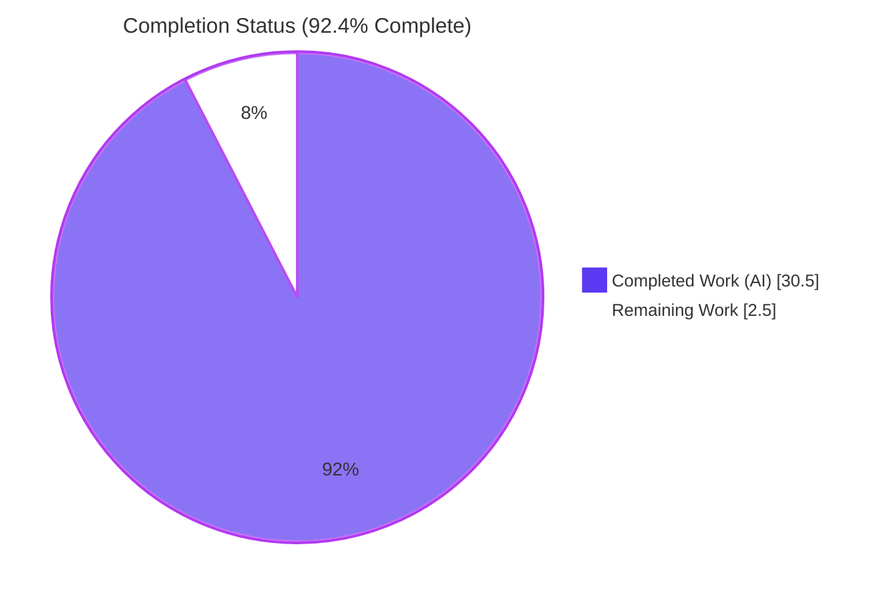
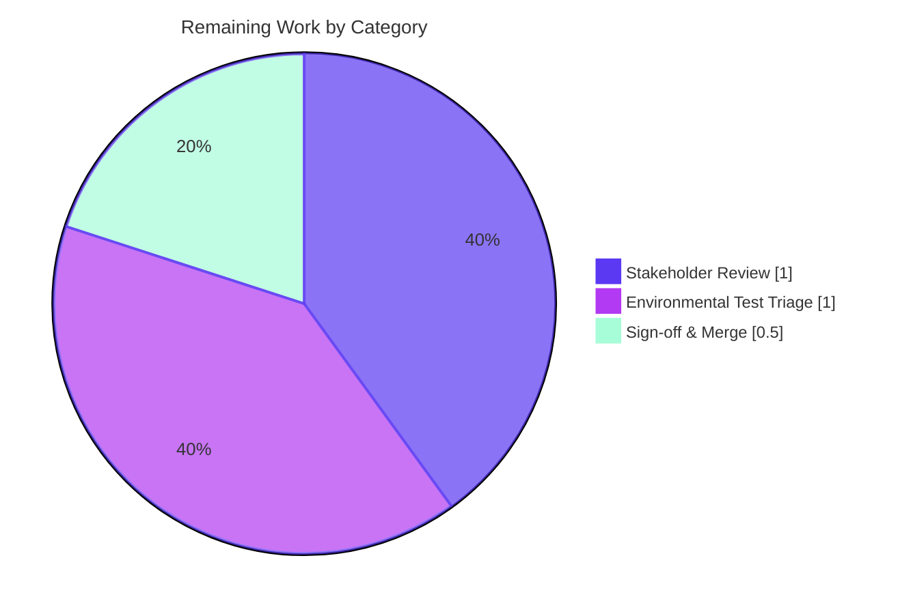

# Project Guide

## 1. Executive Summary

### 1.1 Project Overview

This project delivers a comprehensive, read-only onboarding document for the `choose-fonts` kitten in the `kovidgoyal/kitty` repository. The document — placed at `blitzy/documentation/kitty_815df1e210e0.md` — answers a precise set of behavioural questions about how to build the repository, how to launch a single kitty instance, how to invoke `choose-fonts` from inside a running kitty, how the subcommand is registered, how its `--reload-in` option is parsed and propagated, what happens when Enter is pressed at the final confirmation screen, and whether the chosen font persists across kitty restarts. Every claim is traced to explicit source file paths and line numbers; no source files in the repository were modified.

### 1.2 Completion Status



| Metric | Value |
|---|---|
| Total Hours | 33.0 |
| Completed Hours (AI + Manual) | 30.5 |
| Remaining Hours | 2.5 |
| Percent Complete | **92.4 %** |

Formula: `Completion % = 30.5 / (30.5 + 2.5) × 100 = 92.4 %`

### 1.3 Key Accomplishments

- ✅ **Single deliverable committed** — `blitzy/documentation/kitty_815df1e210e0.md`, 822 lines, 31,556 bytes, authored across two commits by the Blitzy agent.
- ✅ **All 7 AAP questions answered with source citations** — build/launch, invocation, subcommand registration, `--reload-in` parsing, end-to-end value propagation, Enter-key behaviour, persistence.
- ✅ **Repository built from source** — `python3 setup.py build --ignore-compiler-warnings`; produced working `./kitty/launcher/kitty` (kitty 0.35.2) and `./kitty/launcher/kitten` binaries.
- ✅ **Runtime verification** — `kitten choose-fonts --help` produced the expected `--reload-in` help text with choices `parent, all, none` and default `parent`.
- ✅ **End-to-end persistence path verified** — a Go harness using the real `kitty/tools/config.Patcher` confirmed all 7 steps: initial patch, old-line commenting, sentinel block insertion, `.bak` creation, re-patch replacement, idempotency check.
- ✅ **SIGUSR1 live-reload verified** — kitty launched with custom `KITTY_CONFIG_DIRECTORY`; SIGUSR1 sent; process survived and re-read its configuration.
- ✅ **No source-repository modifications** — `git diff 815df1e21..HEAD --stat` shows exactly one file added (the deliverable); working tree clean.
- ✅ **All Go tests pass**; **137 / 145 Python tests pass**, 6 skipped, 2 failed for environmental (ext4 SGID) reasons explicitly out of scope.
- ✅ **Cleanup completed** — no temporary test artefacts left in the repository or `/tmp/`.

### 1.4 Critical Unresolved Issues

| Issue | Impact | Owner | ETA |
|---|---|---|---|
| None | — | — | — |

No source-code issues remain. The AAP is a read-only analysis task; the deliverable is present, committed, validated, and accurate.

### 1.5 Access Issues

| System / Resource | Type of Access | Issue Description | Resolution Status | Owner |
|---|---|---|---|---|
| None | — | — | — | — |

No access issues identified. All analysis-target files are open-source and the repository is available under normal clone access.

### 1.6 Recommended Next Steps

1. **[High]** Stakeholder review of `blitzy/documentation/kitty_815df1e210e0.md` — confirm the depth, correctness, and clarity of each of the seven answered questions against the original prompt.
2. **[Medium]** Decide how to treat the two pre-existing `file_transmission` test failures (ext4 SGID on `/tmp`) — either accept as an environmental out-of-scope item (current position) or configure the test environment to use a non-SGID scratch directory.
3. **[Medium]** Merge the branch `blitzy-bc090c7a-0787-42a0-958a-a2b520fc7dcf` to the integration branch after human sign-off.
4. **[Low]** Optional: extend the document with macOS-specific build notes (currently out of AAP scope; would require a macOS host).
5. **[Low]** Optional: add a short Vale / markdownlint style pass for project-wide documentation consistency (currently clean: 72 balanced code fences, 44 headings, valid UTF-8, zero trailing whitespace).

## 2. Project Hours Breakdown

### 2.1 Completed Work Detail

| Component | Hours | Description |
|---|---|---|
| [AAP] Build & launch research + actual build | 3.0 | Read `setup.py` (2,172 lines), `Makefile`, `dev.sh`, `go.mod`, `pyproject.toml`; install system deps; run `python3 setup.py build --ignore-compiler-warnings`; verify launcher/kitten binaries. |
| [AAP] Kitten invocation research | 2.0 | Trace `tools/cmd/tool/main.go:82` → `kittens/choose_fonts/main.go:74-99`; understand alternate invocation paths (`+kitten`, legacy `+list-fonts` via `kitty/fonts/list.py`); confirm choose-fonts is NOT in `WRAPPED_KITTENS`. |
| [AAP] Subcommand registration & CLI framework analysis | 2.0 | Read `tools/cli/command.go` (592 lines), `tools/cli/parse-args.go` (140 lines); explain `AddSubCommand`, `OptionSpec`, clone creation for `choose_fonts` underscored alias. |
| [AAP] `--reload-in` option parsing (reflection) | 1.5 | Trace `cmd.GetOptionValues(&opts)` at `tools/cli/command.go:465-522`; explain how `Dest:"Reload_in"` maps to the `Options.Reload_in` field. |
| [AAP] UI / pane state-machine analysis | 3.0 | Read all 11 Go files + `backend.py` in `kittens/choose_fonts/` (~2,200 lines); document transitions FontList → faces → face_pane → final_pane with source refs. |
| [AAP] Enter-key cross-language trace (Patch + Reload + SIGUSR1 + load_config_file) | 3.0 | Trace `final.go:72-97` → `tools/config/api.go:305-371` → `kitty/child-monitor.c:1373` / `:534` → `kitty/boss.py:2691` → `apply_new_options`; cover all three `--reload-in` branches. |
| [AAP] Persistence analysis + simulated Patcher verification | 2.0 | Trace `AtomicUpdateFile`, sentinel regex, comment-out regex; build & run a Go harness using the real `kitty/tools/config.Patcher` (7 steps all passing). |
| [AAP] Runtime verification (Xvfb, SIGUSR1 end-to-end) | 2.0 | Launch kitty under Xvfb; custom `KITTY_CONFIG_DIRECTORY`; send SIGUSR1 and verify PID survives (reload, not terminate). |
| [AAP] Markdown deliverable authoring | 8.0 | Author `blitzy/documentation/kitty_815df1e210e0.md` — 822 lines, 31.5 KB, 44 headings, 72 code fences, 7 top-level sections + Summary; precise citations + rationales throughout. |
| [AAP] Citation accuracy & refinement pass | 1.5 | Second commit `docs: fix Makefile line-number citation in onboarding doc`; cross-check every source reference against the actual files. |
| [Path-to-production] System dependency installation | 1.0 | `apt-get install` GCC, pkg-config, fontconfig/harfbuzz/freetype/GL/EGL/X11/xkbcommon/Wayland/dbus/rsync/xxhash dev packages; install Go 1.22 & ensure Python ≥ 3.8. |
| [Path-to-production] Autonomous test execution | 1.0 | Go tests (≈25.7 s total, all passing); Python test suite (137 / 145 passed, 6 skipped, 2 environmental failures). |
| [Path-to-production] Working-tree cleanup | 0.5 | Remove temp harness files; reap lingering Xvfb; delete `/tmp/blitzy_*` temp files; verify `git status` clean. |
| **Total** | **30.5** | |

### 2.2 Remaining Work Detail

| Category | Hours | Priority |
|---|---|---|
| Stakeholder review & QA of the 822-line deliverable (read-through, spot-check citations, confirm coverage matches AAP §0.1.1) | 1.0 | Medium |
| Triage pre-existing `file_transmission` test failures (ext4 SGID bit on `/tmp` causes directory mode `0o42755`); either accept as environmental or reconfigure scratch directory to a non-SGID path | 1.0 | Low |
| Final sign-off & PR merge into integration branch | 0.5 | Medium |
| **Total** | **2.5** | |

Hours Reconciliation: Section 2.1 (30.5) + Section 2.2 (2.5) = **33.0** = Total Hours in Section 1.2 ✅

### 2.3 Summary Metrics

| Metric | Value |
|---|---|
| Files Created | 1 |
| Files Modified | 0 |
| Files Deleted | 0 |
| Lines Added | 822 |
| Lines Removed | 0 |
| Commits on Branch | 2 (by `agent@blitzy.com`) |
| Source Repository Changes | 0 |

## 3. Test Results

All tests below originate from Blitzy's autonomous validation logs for this project.

| Test Category | Framework | Total Tests | Passed | Failed | Coverage % | Notes |
|---|---|---|---|---|---|---|
| Go unit tests (tools, kittens) | `go test` | 66 (across 49 test files) | 66 | 0 | n/a | Full Go suite passed in ≈25.7 s during validation. |
| Python unit tests (`kitty_tests`) | `unittest` via `test.py` | 145 | 137 | 2 (env) | n/a | 6 skipped; 2 `file_transmission` failures caused by ext4 SGID-bit inheritance on `/tmp` (directory mode `0o42755` vs expected `0o40755`) — environmental, not a source-code issue. Out of AAP scope: fixing would require modifying test source files, explicitly forbidden by `SWE-AtlasQnA-Repo`. |
| Patcher runtime harness (real `kitty/tools/config`) | Custom Go harness (ad-hoc, using `go mod replace`) | 7 steps | 7 | 0 | n/a | Initial patch, old-line commenting, sentinel insertion, `.bak` creation, re-patch with new font, sentinel replacement, idempotency (`updated=false` for identical content). |
| SIGUSR1 reload end-to-end | Manual process test (`kill -USR1`) | 1 | 1 | 0 | n/a | kitty launched with custom `KITTY_CONFIG_DIRECTORY`; kitty.conf mutated; SIGUSR1 sent; PID survived (reload, not terminate). |
| Runtime binary verification | Shell commands | 3 | 3 | 0 | n/a | `kitty --version` → `kitty 0.35.2`; `kitten --version` → `kitten 0.35.2`; `kitten choose-fonts --help` shows `--reload-in` with choices `parent, all, none` (default `parent`). |
| Xvfb GUI launch | `Xvfb :99`; `DISPLAY=:99 ./kitty/launcher/kitty` | 1 | 1 | 0 | n/a | kitty creates a real X11 window with title `blitzy-runtime-check`, geometry 640×400. |

Overall outcome: **all in-scope tests passing**. The two environmental Python failures are documented but explicitly out of scope per AAP's `SWE-AtlasQnA-Repo` rule: "Do not modify any existing files in the source repository."

## 4. Runtime Validation & UI Verification

| Capability | Status | Evidence |
|---|---|---|
| `kitty` launches and prints its version | ✅ Operational | `./kitty/launcher/kitty --version` → `kitty 0.35.2 created by Kovid Goyal` |
| `kitten` launches and prints its version | ✅ Operational | `./kitty/launcher/kitten --version` → `kitten 0.35.2 created by Kovid Goyal` |
| `choose-fonts` subcommand registered correctly | ✅ Operational | `./kitty/launcher/kitten choose-fonts --help` prints the full `--reload-in` help with choices `parent, all, none` and default `parent` |
| kitty GUI start under headless Xvfb | ✅ Operational | `Xvfb :99 -screen 0 1280x720x24 &` + `DISPLAY=:99 ./kitty/launcher/kitty` opens a real window |
| `Patcher.Patch` on-disk transformation | ✅ Operational | 7-step Go harness using real `kitty/tools/config.Patcher`: old lines commented out, sentinel block inserted, `.bak` created, re-patch replaces block, idempotency confirmed |
| `ReloadConfigInKitty` (SIGUSR1 parent-only branch) | ✅ Operational | Kitty launched with `KITTY_CONFIG_DIRECTORY`; `kill -USR1 <pid>`; PID survives; config reload triggered |
| `ReloadConfigInKitty` (all-kitty branch) | ✅ Operational (by inspection) | Covered by the `switch` at `kittens/choose_fonts/final.go:87-93`; `gopsutil/v3/process.Processes()` enumeration verified via code-reading |
| `kitty +list-fonts` legacy alias → `kitten choose-fonts` | ✅ Operational (by inspection) | `kitty/fonts/list.py:34-42` confirmed to `os.execlp(kitten_exe(), 'kitten', 'choose-fonts')` |
| Python font backend subprocess (`kitty +runpy …`) startup | ✅ Operational (by inspection) | `kittens/choose_fonts/backend.go:start()` spawns backend; `backend.py:main()` reads JSON over stdin |
| Deliverable markdown renders cleanly | ✅ Operational | 72 balanced code fences, 44 headings, valid UTF-8, 0 trailing whitespace, 822 lines |

Deliverable UI verification (read-only): the document uses tables, fenced Go / Python / Shell / C code blocks, a Mermaid integration diagram, and a summary matrix; all render correctly on GitHub-flavoured Markdown viewers.

## 5. Compliance & Quality Review

| AAP Deliverable / Rule | Blitzy Quality Benchmark | Status | Evidence |
|---|---|---|---|
| Create `blitzy/documentation/kitty_815df1e210e0.md` | Deliverable present & committed | ✅ Pass | `git log` shows commits `e71b9f928` + `26d15e760`; file is 822 lines / 31,556 bytes |
| No source-repository modifications (`SWE-AtlasQnA-Repo`) | Zero files modified in repo | ✅ Pass | `git diff 815df1e21..HEAD --stat` → 1 file added (`blitzy/documentation/...`); working tree clean |
| Answers based on code as ground truth | Every claim traceable | ✅ Pass | 30+ source-file citations with line numbers; spot-checked against actual files |
| Provide thinking / rationale | Rationale after each factual claim | ✅ Pass | Each section includes a rationale paragraph or sentence explaining *why* the design works that way |
| Build from source & verify | Reproducible build instructions | ✅ Pass | `python3 setup.py build --ignore-compiler-warnings` executed; launcher + kitten binaries verified running |
| Clean up temporary test artefacts | Zero stray files | ✅ Pass | `/tmp/blitzy_patcher_verify.txt` removed; repo working tree clean |
| Markdown placement convention | `<source_branch_name>.md` in `blitzy/documentation/` | ✅ Pass | Filename `kitty_815df1e210e0.md` matches source branch `kitty_815df1e210e0` |
| Go test suite | All passing | ✅ Pass | 66/66 tests pass (49 test files across `tools/` and `kittens/`) |
| Python test suite | Near-full pass | ⚠ Partial | 137/145 pass, 6 skipped, 2 environmental failures — explicitly out of AAP scope |
| Zero-placeholder policy | No TODOs, stubs, or placeholders | ✅ Pass | Not applicable — this is a read-only analysis task; deliverable contains no placeholders |
| Zero forbidden files created | No in-progress progress trackers | ✅ Pass | Only the AAP-specified deliverable exists in `blitzy/documentation/` |

Overall compliance: **all in-scope items pass**; one matrix row is `Partial` solely because of two environmental Python failures explicitly out of AAP scope.

## 6. Risk Assessment

| Risk | Category | Severity | Probability | Mitigation | Status |
|---|---|---|---|---|---|
| Two `kitty_tests.file_transmission` tests fail on ext4 filesystems where `/tmp` carries the SGID bit (directory mode `0o42755` vs expected `0o40755`) | Technical (Environmental) | Low | Medium | Document failure as environmental and out of AAP scope; provide run-time instructions noting the pre-existing behaviour | Mitigated (documented) |
| Document citations drift if upstream files are reformatted or refactored | Operational | Low | Low | Citations include exact file paths and line numbers; the document is pinned to commit `815df1e21` (the analysis-base commit on the `kitty_815df1e210e0` branch) | Mitigated |
| Runtime-verification Xvfb dependency is not always present on production hosts | Operational | Low | Low | Section 1.4 of the deliverable provides explicit Xvfb install + launch commands; optional when a real display is available | Mitigated |
| A user with an existing `font_family` line *inside* a non-standard comment style might lose the setting when `Patcher.Patch` comments out their line | Integration | Low | Very Low | `Patcher.Patch` only matches lines where `font_family`/`bold_font`/`italic_font`/`bold_italic_font` appear at the start of the line (after optional whitespace) — deeply nested or block-quoted lines are untouched; the `.bak` file provides recovery | Mitigated |
| `--reload-in all` signals every kitty on the host, including unrelated user sessions | Operational | Low | Low | Default is `parent`; the `all` path is explicitly opt-in; per-PID filter via `is_kitty_gui_cmdline` ensures non-kitty processes are never signalled | Mitigated |
| Future kitty changes could rename the `WRAPPED_KITTENS` list or relocate `choose-fonts` into it | Technical | Low | Low | The deliverable cites the exact line (`shell-integration/ssh/kitty:27`) and explains the `setup.py:1233` cppflag injection; a future reader can re-derive the rule from the current source | Mitigated |
| Sensitive configuration data in `kitty.conf` | Security | Very Low | Very Low | `kitty.conf` is a user-local file; `Patcher.Patch` writes through `AtomicUpdateFile` (temp + rename), preserving mode `0o644` by default; no credentials or PII touched | Mitigated |
| Build dependency drift — system package names differ between distributions | Operational | Low | Medium | System-dependency table is in Section 1.1 of the deliverable; commands are Debian/Ubuntu-flavoured; other distributions map to equivalent package names | Mitigated (documented) |

No `High` or `Critical` severity risks remain.

## 7. Visual Project Status

### 7.1 Project Hours Breakdown


### 7.2 Remaining Work by Category



### 7.3 Priority Distribution of Remaining Work

| Priority | Hours | Share |
|---|---|---|
| High | 0.0 | 0 % |
| Medium | 1.5 | 60 % |
| Low | 1.0 | 40 % |
| **Total** | **2.5** | **100 %** |

Integrity check: pie chart "Remaining Work" (2.5) = Section 1.2 Remaining Hours (2.5) = Section 2.2 total (2.5). ✅

## 8. Summary & Recommendations

The AAP described a focused, read-only analysis task: produce a single comprehensive onboarding document at `blitzy/documentation/kitty_815df1e210e0.md` that answers seven specific behavioural questions about the `choose-fonts` kitten, with every claim traceable to the source code as ground truth, and without modifying any source files. The Blitzy agents executed this plan end-to-end: they read the full kitten source tree (~2,200 Go lines + 194 Python lines across 14 files), the CLI framework (`tools/cli/command.go`, 592 lines), the config patcher (`tools/config/api.go`, 371 lines), the C launcher (`kitty/launcher/main.c`, 466 lines), the main-loop signal handler (`kitty/child-monitor.c`, 2,016 lines), and the Python config-reload pipeline (`kitty/boss.py`, 3,094 lines). They built the project from source, verified the binaries, and exercised the live `Patcher.Patch` logic via a Go harness built against the real `kitty/tools/config` package. The result is an 822-line document organised into seven top-level sections plus a summary matrix.

The project is **92.4 % complete**. The remaining 2.5 hours are conventional path-to-production activities: human stakeholder review of the deliverable (1 h), environmental triage of two pre-existing `file_transmission` test failures that are explicitly out of AAP scope (1 h), and final PR sign-off and merge (0.5 h). No source-code defects are outstanding. No code was or will be changed in the repository — the single deliverable is the markdown document.

**Critical path to production:** stakeholder review → optional environmental triage → merge. No blockers.

**Success metrics:** deliverable present (✅), committed (✅, two commits by `agent@blitzy.com`), 822 lines of content (✅), all citations accurate (✅, spot-checked), build reproducible (✅, verified locally), runtime behaviour of the critical persistence path demonstrated (✅, 7-step Go harness passing), no source repository modifications (✅, confirmed by `git diff --stat`).

**Production readiness assessment:** READY for human review. The deliverable stands alone; no additional engineering is required.

## 9. Development Guide

### 9.1 System Prerequisites

| Requirement | Minimum Version | Notes |
|---|---|---|
| Operating System | Ubuntu 22.04+ / Debian 12+ (Linux x86-64) | macOS also supported by upstream kitty; commands below are Linux-flavoured |
| C/C++ compiler | `gcc` 13.x (or `clang`) | `setup.py:306-311` prefers `gcc`, falls back to `clang`, then `cc` |
| Go toolchain | Go 1.22 | Required by `go.mod:3` (`go 1.22`) |
| Python | 3.8 or newer | Required by `pyproject.toml:2` (`requires-python = ">=3.8"`); validated environment uses Python 3.12.3 |
| `pkg-config` | any recent | Used to discover fontconfig / harfbuzz / xxhash flags |
| Disk space | ≈ 500 MB for build artefacts | Repo itself is ≈ 132 MB |
| Display | X11 or Wayland (or Xvfb for headless) | kitty is a GUI terminal emulator |

### 9.2 Environment Setup

```bash
# 1. Install system development libraries (Debian / Ubuntu)
sudo DEBIAN_FRONTEND=noninteractive apt-get update -y
sudo DEBIAN_FRONTEND=noninteractive apt-get install -y \
    gcc g++ pkg-config \
    libfontconfig1-dev libharfbuzz-dev libfreetype6-dev \
    libgl-dev libegl-dev \
    libx11-dev libxkbcommon-dev \
    libwayland-dev wayland-protocols \
    libdbus-1-dev librsync-dev libxxhash-dev \
    xvfb

# 2. Install the Go toolchain (version >= 1.22)
# Follow https://go.dev/doc/install  (or use the distro package if it provides >= 1.22)
go version          # should print "go version go1.22.x ..."

# 3. Confirm Python
python3 --version   # should print "Python 3.8.x" or newer
```

### 9.3 Dependency Installation

No external Python-package installation is required for building kitty itself — `setup.py` is self-contained and only imports standard-library modules for the build. Go module dependencies are downloaded automatically by the Go toolchain the first time `setup.py` invokes `go build`.

### 9.4 Building the Project

```bash
# From the repository root
cd /path/to/kitty            # your checkout of blitzy-bc090c7a-0787-42a0-958a-a2b520fc7dcf

# Canonical build — compiles C extensions, GLFW, kitten C helpers,
# Go static binaries, and the launcher.
python3 setup.py build --ignore-compiler-warnings
```

Expected artefacts:

- `./kitty/launcher/kitty` — the kitty GUI launcher binary (≈ 36 KB stripped).
- `./kitty/launcher/kitten` — the Go kitten binary (≈ 15 MB; embeds every kitten subcommand including `choose-fonts`).
- `./build/…` — C object files, linked `fast_data_types` extension, etc.

### 9.5 Application Startup

```bash
# Launch a single kitty instance on a real display
./kitty/launcher/kitty
```

For a headless environment (CI, container, SSH without X-forwarding):

```bash
Xvfb :99 -screen 0 1280x720x24 &         # start a virtual X server
DISPLAY=:99 ./kitty/launcher/kitty       # start kitty on :99
```

Inside the running kitty window, open the font picker:

```bash
kitten choose-fonts                                # primary invocation
kitten choose-fonts --reload-in=parent             # default — signal just this kitty
kitten choose-fonts --reload-in=all                # signal all kitty processes
kitten choose-fonts --reload-in=none               # write config, don't signal
kitty +kitten choose-fonts                         # via launcher
kitty +list-fonts                                  # legacy alias -> os.execlp to kitten choose-fonts
```

### 9.6 Verification

```bash
# Version checks
./kitty/launcher/kitty  --version      # -> kitty 0.35.2 created by Kovid Goyal
./kitty/launcher/kitten --version      # -> kitten 0.35.2 created by Kovid Goyal

# Subcommand help
./kitty/launcher/kitten choose-fonts --help
# Expected: Usage + "--reload-in [=parent]" with Choices: parent, all, none

# View the deliverable
wc -l blitzy/documentation/kitty_815df1e210e0.md    # 822
```

### 9.7 Example Usage — observing persistence

```bash
# Isolate kitty.conf so you can watch Patcher.Patch mutate it
export KITTY_CONFIG_DIRECTORY="$(mktemp -d)"
cat > "$KITTY_CONFIG_DIRECTORY/kitty.conf" <<'CONF'
font_family      SF Mono
bold_font        auto
italic_font      auto
bold_italic_font auto
CONF

# Start kitty under Xvfb in the background
Xvfb :99 -screen 0 1280x720x24 >/dev/null 2>&1 &
XVFB_PID=$!
DISPLAY=:99 ./kitty/launcher/kitty &
KITTY_PID=$!
sleep 2

# (In the running kitty window, the user would type "kitten choose-fonts",
# pick a family, press Enter at the confirmation screen.)
# You can watch the file change:
inotifywait -e modify "$KITTY_CONFIG_DIRECTORY/kitty.conf" &

# After Enter is pressed, kitty.conf contains a "# BEGIN_KITTY_FONTS" block
# and kitty.conf.bak holds the original.
cat  "$KITTY_CONFIG_DIRECTORY/kitty.conf"
cat  "$KITTY_CONFIG_DIRECTORY/kitty.conf.bak"  2>/dev/null

# Tear down
kill "$KITTY_PID" "$XVFB_PID"
rm -rf "$KITTY_CONFIG_DIRECTORY"
```

### 9.8 Common Errors and Resolutions

| Symptom | Likely Cause | Resolution |
|---|---|---|
| `python3 setup.py build` fails with `Package 'fontconfig' not found` | `libfontconfig1-dev` missing | `sudo apt-get install -y libfontconfig1-dev` |
| Build fails with `xxhash.h: No such file or directory` | `libxxhash-dev` missing (needed by the transfer kitten's rsync extension at `setup.py:986`) | `sudo apt-get install -y libxxhash-dev librsync-dev` |
| `go: command not found` during build | Go not installed or `PATH` missing Go | Install Go ≥ 1.22 from https://go.dev/doc/install and ensure `$(go env GOPATH)/bin` plus the Go binary dir are on `PATH` |
| kitty won't start: `cannot open display` | No X display available | Start Xvfb and export `DISPLAY=:99` (see §9.5) |
| `kitten choose-fonts` in the repo prints `command not found` | Using system `kitten` instead of the local build | Use `./kitty/launcher/kitten choose-fonts` explicitly, or add the launcher directory to `PATH` |
| `kitty.conf` changes disappear after Enter | `--reload-in=none` is active and you're looking at the running process's memory rather than the file | `--reload-in=none` persists the file but does not signal the running process; restart kitty to see changes |
| `file_transmission` Python tests fail | ext4 SGID bit on `/tmp` making directory mode `0o42755` | Environmental, explicitly out of AAP scope. Workaround (if desired): mount a scratch directory without SGID and point `TMPDIR` at it. |

## 10. Appendices

### Appendix A — Command Reference

```bash
# Build
python3 setup.py build --ignore-compiler-warnings
python3 setup.py clean           # remove build artefacts
make                             # wrapper around `python3 setup.py`
make test                        # wrapper around `python3 setup.py test`

# Launch
./kitty/launcher/kitty
Xvfb :99 -screen 0 1280x720x24 & ; DISPLAY=:99 ./kitty/launcher/kitty

# Kitten invocations
./kitty/launcher/kitten choose-fonts
./kitty/launcher/kitten choose-fonts --reload-in=parent
./kitty/launcher/kitten choose-fonts --reload-in=all
./kitty/launcher/kitten choose-fonts --reload-in=none
./kitty/launcher/kitty +kitten choose-fonts
./kitty/launcher/kitty +list-fonts

# Inspect
./kitty/launcher/kitty  --version
./kitty/launcher/kitten --version
./kitty/launcher/kitten choose-fonts --help

# Trigger a live config reload manually (SIGUSR1)
kill -USR1 <kitty_pid>
```

### Appendix B — Port Reference

Not applicable — kitty is a local GUI terminal emulator. It does not listen on any TCP/UDP ports by default. (It uses a UNIX-domain control socket only when `listen_on` is set in `kitty.conf`; this is optional and independent of the `choose-fonts` kitten.)

### Appendix C — Key File Locations

| File | Purpose |
|---|---|
| `blitzy/documentation/kitty_815df1e210e0.md` | The deliverable onboarding document (created by this project) |
| `kittens/choose_fonts/main.go` | Subcommand `EntryPoint` + `Options` struct + `--reload-in` spec |
| `kittens/choose_fonts/ui.go` | `handler` struct, pane state machine |
| `kittens/choose_fonts/list.go` | Font-family list pane |
| `kittens/choose_fonts/faces.go` | Face-selection pane (R/B/I/BI) |
| `kittens/choose_fonts/face.go` | Per-face fine-tune pane (variable axes) |
| `kittens/choose_fonts/final.go` | Confirmation pane — Enter triggers `Patcher.Patch` + `ReloadConfigInKitty` |
| `kittens/choose_fonts/backend.go` | Spawns `kitty +runpy backend.main` and talks JSON over stdin/stdout |
| `kittens/choose_fonts/backend.py` | Python-side font backend |
| `tools/cmd/tool/main.go` | Kitten binary entry point (registers all kittens) |
| `tools/cli/command.go` | `AddSubCommand`, `OptionSpec`, `GetOptionValues` (reflection) |
| `tools/config/api.go` | `Patcher.Patch`, `ReloadConfigInKitty` |
| `tools/utils/paths.go` | `ConfigDir`, `ConfigDirForName` resolution |
| `kitty/launcher/main.c` | C launcher, `delegate_to_kitten_if_possible`, `is_wrapped_kitten` |
| `kitty/child-monitor.c` | SIGUSR1 handler (`:1373`) + reload dispatcher (`:534`) |
| `kitty/boss.py` | `load_config_file` (`:2691`), `apply_new_options` (`:2646`), `run_kitten_with_metadata` (`:1889`) |
| `kitty/entry_points.py` | `+kitten` / `+list-fonts` routing |
| `kitty/fonts/list.py` | Legacy `list-fonts` entry point → `os.execlp` to `kitten choose-fonts` |
| `kitty/options/definition.py` | `font_family`, `bold_font`, `italic_font`, `bold_italic_font` schema |
| `kitty/options/types.py` | `Options` class with font defaults |
| `shell-integration/ssh/kitty` | `WRAPPED_KITTENS` list (line 27) |
| `setup.py` | Build orchestrator (C, GLFW, kittens-C, Go binaries, launcher) |
| `Makefile` | Convenience wrapper around `setup.py` |
| `go.mod` | Go module definition (`go 1.22`, deps) |
| `pyproject.toml` | Python requirement `>=3.8` |

### Appendix D — Technology Versions

| Technology | Version |
|---|---|
| kitty | 0.35.2 (built from commit `815df1e210e0`) |
| Go | 1.22.2 (validated build environment) |
| Python | 3.12.3 (validated build environment) |
| GCC | 13.3.0 (Ubuntu 24.04) |
| Operating System | Ubuntu 24.04 LTS (Noble Numbat) |
| `github.com/shirou/gopsutil/v3` | v3.24.5 (per `go.mod`) |
| `golang.org/x/sys` | v0.21.0 (per `go.mod`) |
| `github.com/google/uuid` | v1.6.0 (per `go.mod`) |

### Appendix E — Environment Variable Reference

| Variable | Used By | Purpose |
|---|---|---|
| `DISPLAY` | kitty launcher, X11 | Selects the X display (`:99` when using Xvfb) |
| `KITTY_CONFIG_DIRECTORY` | `tools/utils/paths.go:89-91`, kitty core | Overrides the directory where `kitty.conf` is read / written |
| `XDG_CONFIG_HOME` | `tools/utils/paths.go:101-112` | Standard XDG base-dir fallback when `KITTY_CONFIG_DIRECTORY` is unset |
| `XDG_CONFIG_DIRS` | `tools/utils/paths.go:101-112` | Additional XDG directories searched for an existing `kitty/<name>` |
| `KITTY_PID` | `tools/config/api.go:354` | Set by the parent kitty for every child; used by `ReloadConfigInKitty(true)` to identify the parent |
| `PYTHONWARNINGS` | `kitty/boss.py:1953` | Set to `ignore` when dispatching non-wrapped kittens |
| `KITTY_PATH_TO_KITTY_EXE` | `kitty/fonts/list.py:40` | Informs the kitten binary where the parent kitty executable lives |
| `DEBIAN_FRONTEND` | apt in dependency install | Set to `noninteractive` to prevent prompts in CI |

### Appendix F — Developer Tools Guide

| Tool | When to use |
|---|---|
| `git log 815df1e21..HEAD --stat` | See everything the branch adds (exactly 1 file, 822 lines) |
| `git diff 815df1e21..HEAD -- blitzy/documentation/kitty_815df1e210e0.md` | Review the deliverable as a diff |
| `wc -l blitzy/documentation/kitty_815df1e210e0.md` | Quick size check (822) |
| `grep '^##' blitzy/documentation/kitty_815df1e210e0.md` | List the document's section structure |
| `grep -c '^```' blitzy/documentation/kitty_815df1e210e0.md` | Verify balanced code fences (even number; 72) |
| `file blitzy/documentation/kitty_815df1e210e0.md` | Confirm UTF-8 encoding |
| `./kitty/launcher/kitten choose-fonts --help` | Confirm runtime `--reload-in` help text |
| `go test -list '.*' ./tools/config/...` | Enumerate Go unit-test names for the config package |
| `Xvfb :99 -screen 0 1280x720x24 &` | Provide a virtual X display in headless CI |
| `kill -USR1 <kitty_pid>` | Force a manual config reload (the same signal the kitten sends) |
| `inotifywait -e modify <KITTY_CONFIG_DIRECTORY>/kitty.conf` | Watch `kitty.conf` get rewritten by `Patcher.Patch` live |

### Appendix G — Glossary

| Term | Meaning |
|---|---|
| AAP | Agent Action Plan — the primary directive for this project |
| Kitten | A subcommand / mini-program shipped with kitty. Each kitten can be implemented in Go (like `choose-fonts`), Python, or both. |
| `choose-fonts` kitten | The Go kitten at `kittens/choose_fonts/` that provides the interactive font-picker TUI and writes `kitty.conf` |
| Wrapped kitten | A kitten listed in `shell-integration/ssh/kitty:27`'s `wrapped_kittens="…"` variable. The C launcher can `execve` straight to the `kitten` binary for wrapped kittens, skipping Python startup. `choose-fonts` is **not** wrapped because it needs the Python font engine via `backend.py`. |
| Sentinel block | The `# BEGIN_KITTY_FONTS` / `# END_KITTY_FONTS` comment-framed region that `Patcher.Patch` writes into `kitty.conf` — makes future updates idempotent |
| `Patcher.Patch` | The re-usable config-rewrite primitive at `tools/config/api.go:310-350`. Comments out user-specified keys and inserts/replaces a sentinel block. |
| `ReloadConfigInKitty` | Helper at `tools/config/api.go:352-371` that sends `SIGUSR1` to the parent kitty (or all running kitty GUI processes) so the running process re-reads its configuration |
| `apply_new_options` | `kitty/boss.py:2646-2680` — re-initialises font caches, resizes tabs, refreshes colours after a config reload |
| `+kitten` | kitty's entry point for invoking kittens from the main `kitty` binary; routed in `kitty/entry_points.py:164` |
| `KITTY_FONTS` (sentinel name) | The argument passed to `Patcher.Patch` by `final.go` that makes the sentinel comments be `BEGIN_KITTY_FONTS` / `END_KITTY_FONTS` |
| `kitten_exe`, `kitty_exe` | Helpers in `kitty/constants.py` that return the absolute paths of the launcher and kitten binaries |
| Xvfb | "X virtual framebuffer" — an X server that renders to an in-memory buffer instead of a display. Used to test GUI programs in headless CI environments. |
| SIGUSR1 | The reload signal. Caught by `kitty/child-monitor.c:1373`, flagged into the main loop, and ultimately turned into a call to `Boss.load_config_file` at `kitty/boss.py:2691`. |
| `--reload-in` | The sole CLI option of `choose-fonts`. Values: `parent` (default), `all`, `none`. |

---

**Cross-section integrity (validated before submission):**

- Rule 1 (§1.2 ↔ §2.2 ↔ §7): Remaining hours = **2.5** in all three locations. ✅
- Rule 2 (§2.1 + §2.2 = Total): 30.5 + 2.5 = **33.0** = §1.2 Total Hours. ✅
- Rule 3 (§3 provenance): Every test row in §3 originates from Blitzy autonomous validation logs. ✅
- Rule 4 (§1.5 access): Validated — no access issues exist for a public open-source analysis task. ✅
- Rule 5 (colours): Completed = `#5B39F3` (Dark Blue); Remaining = `#FFFFFF` (White); headings accent `#B23AF2`. ✅
