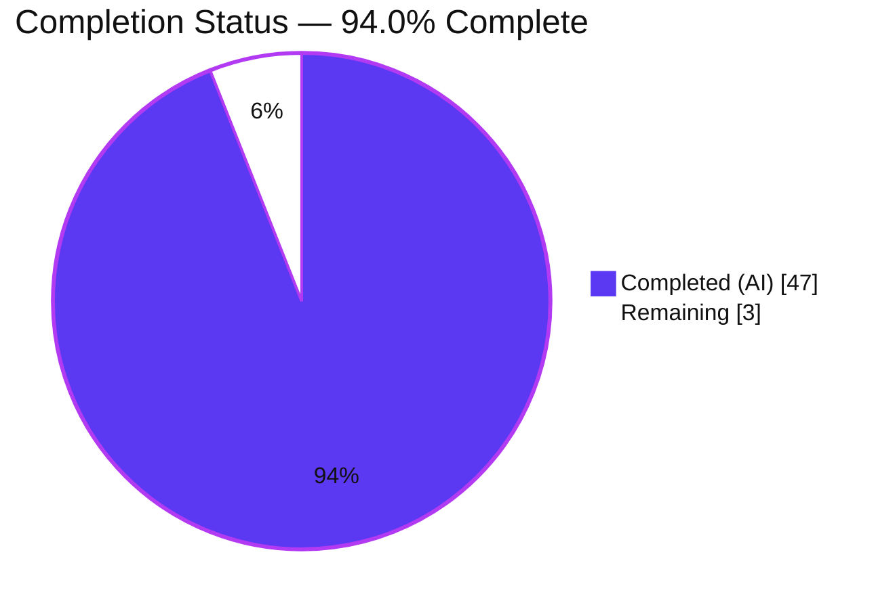
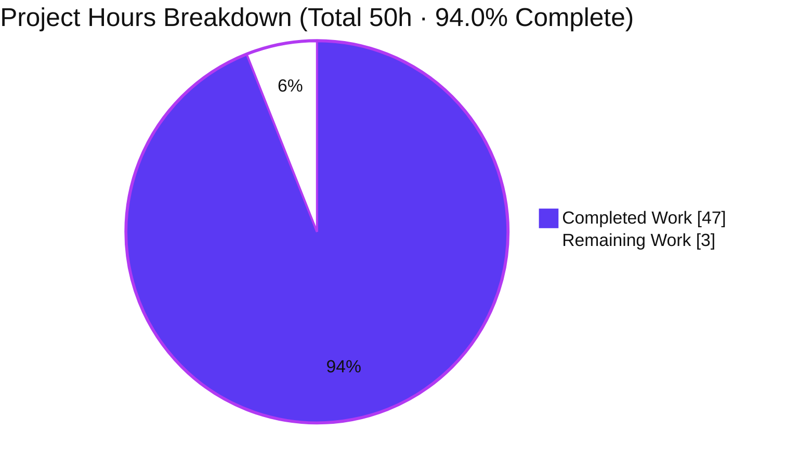

# Blitzy Project Guide

> **Project:** kitty — Investigation: how compiled C extensions relate to and drive the test-execution flow
> **Type:** Read-only investigative (Q&A) documentation
> **Branch:** `blitzy-9be767bf-17f2-4455-911c-def3902570af` · **Base commit:** `815df1e21` ("Wire up applying of font config")
> **Brand palette:** Completed / AI Work = **Dark Blue `#5B39F3`** · Remaining = **White `#FFFFFF`** · Headings/Accents = Violet-Black `#B23AF2` · Highlight = Mint `#A8FDD9`

---

## 1. Executive Summary

### 1.1 Project Overview

This project answers a codebase-investigation question about the kitty terminal emulator: how its compiled C extensions (Python `.so` modules) relate to and drive its hybrid Python-`unittest` + Go-`testing` execution flow. The objective is a single, evidence-based technical document written **from directly observed runtime behavior** — the real output of building kitty from source and running its suite — not from reading alone. The target audience is engineers who need a ground-truth reference for the Python↔native boundary: which extensions are critical, which are optional, and exactly how test failures cascade when an artifact is missing. Scope is strictly read-only; the sole artifact produced is the answer document. No source file is modified.

### 1.2 Completion Status

The completion percentage is computed with the **AAP-scoped hours methodology (PA1)**: it measures only work defined by the Agent Action Plan plus standard path-to-production activity. All autonomous investigation, authoring, and validation work is complete; the only remaining item is human SME sign-off.



| Metric | Hours |
|---|---|
| **Total Hours** | **50** |
| Completed Hours (AI + Manual) | 47 |
| — AI (autonomous) | 47 |
| — Manual (human, to date) | 0 |
| Remaining Hours | 3 |
| **Percent Complete** | **94.0%** |

> Formula: `Completed / (Completed + Remaining) × 100 = 47 / 50 × 100 = 94.0%`.

### 1.3 Key Accomplishments

- ✅ **Canonical build reproduced** — `python3 setup.py build` succeeds (exit 0, ~46s, 0 warnings under `-pedantic-errors -Werror`, gcc 13.3.0), producing all 6 native artifacts (all gitignored).
- ✅ **Canonical suite reproduced & stabilized** — `./test.py` → "Ran 145 tests", "OK (skipped=4)", "All Go tests succeeded", exit 0; identical across **three** runs.
- ✅ **Extension↔test relationship traced** — three coupling kinds (Python-import, `ctypes.CDLL`, file-stat) identified and evidenced.
- ✅ **Both failure-cascade modes demonstrated** — whole-run abort (0 tests) vs single-test failure, via four repo-safe perturbation experiments with complete unedited output.
- ✅ **Runtime loaded-vs-present observation** — `sys.modules` probe distinguishes imported extensions from those merely present on disk.
- ✅ **Critical/narrow/platform-gated classification** — code-grounded, with verified import counts.
- ✅ **All 8 decomposed questions answered explicitly** with file:line citations and cause→effect rationale (deliverable §13).
- ✅ **Repository left byte-for-byte unchanged** — `git status --porcelain` empty; exactly one added path in the source-commit diff.
- ✅ **Independently re-verified** — every load-bearing citation and count re-checked against the live repo; zero discrepancies.

### 1.4 Critical Unresolved Issues

No critical unresolved issues were identified. All five production-readiness validation gates passed with zero discrepancies; the build compiles cleanly, the canonical suite passes, and the deliverable is fully evidence-backed. The only tracked gating item is the standard human acceptance step.

| Issue | Impact | Owner | ETA |
|---|---|---|---|
| Human SME sign-off pending (normal review gate, not a defect) | Document not yet formally accepted as authoritative | Reviewing engineer / SME | Within the 3h review window (see §2.2) |

### 1.5 Access Issues

No access issues prevented autonomous build, validation, or delivery. The mandated Docker image and the repository were fully accessible and the canonical build succeeded. One informational note for reviewers reproducing the work:

| System/Resource | Type of Access | Issue Description | Resolution Status | Owner |
|---|---|---|---|---|
| `ghcr.io/scaleapi/swe-atlas:swe_atlas_QnA_kovidgoyal_kitty_1.0` (mandated build/run image) | Container-registry pull | Canonical reproduction requires this exact image (it ships Python 3.12.3, Go 1.23.4, gcc 13.3.0 + native dev libs incl. Wayland). No access problem was encountered by the agent. | Informational — reviewer needs registry pull access to reproduce | Reviewing engineer |
| kitty source repository @ `815df1e21` | Read (git) | Fully accessible; read-only throughout. | No issue | — |

### 1.6 Recommended Next Steps

1. **[High]** Perform SME technical review of `blitzy/documentation/kitty_815df1e210e0.md` — verify correctness/completeness against the 8 decomposed questions and spot-check the file:line citation index (Appendix B).
2. **[High]** Independently reproduce the canonical build + test run inside the mandated image and confirm the headline figures ("Ran 145 tests", "OK (skipped=4)", exit 0), then approve & merge the PR.
3. **[Low]** *(Optional, out-of-AAP-scope)* Consider a lightweight CI drift-check that re-runs the canonical build/test to detect citation drift if the repo advances beyond `815df1e21`.
4. **[Low]** *(Optional, out-of-AAP-scope)* Consider a brief cross-host reproducibility note if the document will be consumed outside the mandated image (the non-Wayland variance is already covered in deliverable §11.3).

---

## 2. Project Hours Breakdown

### 2.1 Completed Work Detail

Each completed component traces to specific Agent Action Plan requirements and to sections of the delivered document. Total below matches **Completed Hours (47)** in §1.2.

| Component | Hours | Description |
|---|---:|---|
| Environment provisioning + canonical build study & execution | 6 | Provisioned native toolchain; studied the `setup.py` orchestrator (`build()` L1084, dispatch L2115-2121); ran `python3 setup.py build`, captured verbatim output; produced the 6-artifact inventory with sizes (deliverable §2–§4). |
| Canonical test-suite execution + two-run stability capture | 3 | Ran `./test.py` ×3; captured run header, summary tail, the 4 skips, and the 9 `check_build` per-test statuses; confirmed "Ran 145 / OK (skipped=4)" stability (§5). |
| Import/load-chain tracing + dependency-graph analysis | 7 | Read `main.py`, `__init__.py`, `check_build.py`; correlated each native import to its artifact; produced the entry-point→native-artifact chain trace + mermaid diagram and the dependency-graph interpretation (§6, §10). |
| Runtime loaded-vs-present `sys.modules` observation | 3 | Wrote a runtime probe (via the canonical launcher) importing every module as discovery does; distinguished imported extensions from `ctypes`-loaded and stat-only artifacts (§7). |
| Failure-cascade experiments (4 perturbations + CI gate + Py-3.12 nuance) | 6 | Four repo-safe `.so`-removal experiments capturing complete unedited output; CI-gate contrast; documented the Python-3.12 `_FailedTest` nuance (§11.1–§11.6). |
| Extension→category map + critical/narrow classification + artifact→import→failure matrix | 6 | Mapped each extension to test categories; code-grounded critical/narrow/platform-gated classification with verified import counts; side-by-side failure matrix (§8, §9, §11.6). |
| Deliverable authoring — 991-line evidence document | 11 | Authored the full document: TL;DR, 27 verbatim code blocks, 80 table rows, explicit answers to all 8 questions, and the citation index (§1, §13, §14, §15). |
| Repository integrity + cleanup + QA/review remediation | 5 | Verified strictly read-only operation; removed all temporary scripts; confirmed `git status --porcelain` empty; addressed code-review + QA findings across 3 follow-up commits (incl. F1 citation fix) (§12). |
| **Total** | **47** | |

### 2.2 Remaining Work Detail

The remaining work is exclusively path-to-production human acceptance. Per AAP §0.5.2, all fixing/config/deployment/optimization work is explicitly out-of-scope (the observed cross-host test variance is *evidence to explain*, not a defect to repair). Total below matches **Remaining Hours (3)** in §1.2 and the §7 pie "Remaining Work".

| Category | Hours | Priority |
|---|---:|---|
| Documentation Review & Verification — SME reads the 991-line analysis for correctness/completeness vs the 8 decomposed questions; spot-checks file:line citations against `815df1e21` | 2 | High |
| Reproduction & Release Sign-off — reproduce `python3 setup.py build` + `./test.py` in the mandated image to confirm headline figures; approve & merge PR | 1 | High |
| **Total** | **3** | |

### 2.3 Basis of Estimate

Estimates use the PA2 framework anchored to the AAP scope. This is a documentation/investigation deliverable (no application feature surface), so hours reflect: reading a large custom build orchestrator and the runner internals, running the real entry points multiple times for stability, four instrumented perturbation experiments each with verbatim capture, a runtime `sys.modules` probe, and authoring a rigorous 991-line evidence-backed document plus three QA/review revision cycles. Confidence is **High** — the work is complete and independently re-verified, so the completed figure is observed rather than projected; the remaining figure is the conventional human review/sign-off effort for a document of this length.

---

## 3. Test Results

All tests below originate from Blitzy's autonomous validation logs for this project (canonical `./test.py` executed inside the mandated Docker image; figures stable across three consecutive runs).

| Test Category | Framework | Total Tests | Passed | Failed | Coverage % | Notes |
|---|---|---:|---:|---:|---|---|
| Python unit / functional suite (build-verification, datatypes, fonts, transfer, glfw, screen, parser, layout, clipboard, crypto, keys, mouse, options, ssh, tui, shm, …) | Python `unittest` | 145 | 141 | 0 | N/A¹ | Result line "Ran 145 tests" / "OK (skipped=4)"; exit 0; stable across 3 runs (only wall-clock varied 13.197s↔13.258s). Skipped=4, errors=0, failures=0. |
| Go package tests | Go `testing` (`go test -v`) | 26² | 26 | 0 | N/A¹ | "All Go tests succeeded, ran in ~13.3s"; 26-package set, order-independent-identical across runs. |
| **Totals** | | **171** | **167** | **0** | | 4 skipped (all environment/frozen-build gated; none extension-related). |

¹ **No code-coverage tooling is configured** for this project (per AAP §0.2.3 — the project relies on `mypy --strict`, `ruff`, `gofmt`, `go vet`, `staticcheck`, and CodeQL, but no coverage instrumentation). Coverage is therefore reported as N/A rather than fabricated.
² Go unit of measure is the **package** (each package aggregates many `go test` functions, all passing).

**Build-verification subset (within the 145):** `kitty_tests.check_build.TestBuild` contributes **9 tests → 8 `ok` + 1 `skipped`** (`test_ca_certificates`, frozen-build-only). `test_loading_extensions` reports `ok`, proving both `fast_data_types.so` and `rsync.so` import successfully; `test_glfw_modules` reports `ok`, proving both GLFW backends are present.

**The 4 skips (verbatim reasons, none extension-caused):** `test_ca_certificates` (CA certs only tested on frozen builds); `test_fallback_font_not_last_resort` (macOS-only); `test_fish_integration` ×2 (fish not installed). The image ships `zsh`, so the two `zsh`-integration tests run and pass.

---

## 4. Runtime Validation & UI Verification

Runtime was validated against the real entry points inside the mandated Docker image. kitty is a GUI terminal emulator, but this investigation runs **headless** — no window is created (a GLFW backend is only `dlopen`-ed at window creation, which does not occur headless), so there are no UI screens in scope for this documentation deliverable.

- ✅ **Operational — Canonical build:** `python3 setup.py build` → exit 0, ~46s, 0 warnings under `-pedantic-errors -Werror`.
- ✅ **Operational — Runtime launcher:** `./kitty/launcher/kitty --version` → "kitty 0.35.2 created by Kovid Goyal".
- ✅ **Operational — Canonical test run:** "Ran 145 tests" / "OK (skipped=4)" / "All Go tests succeeded" / exit 0 (×3 stable).
- ✅ **Operational — `sys.modules` runtime probe (§7):** confirmed only `kitty.fast_data_types` and `kittens.transfer.rsync` are kitty-native `sys.modules` entries; `glfw-x11.so` is loaded via `ctypes.CDLL` (present on disk, **not** in `sys.modules`, yet `dlopen`-able); `glfw-wayland.so` is neither imported nor loaded (stat-only).
- ✅ **Operational — Failure-cascade mode (b), whole-run abort (0 tests):** reproduced for `fast_data_types.so` (§11.1) and `rsync.so` (§11.2) — `ModuleNotFoundError`, no "Ran N tests".
- ✅ **Operational — Failure-cascade mode (a), single-test failure:** reproduced for `glfw-wayland.so` (§11.3 → 1 `FAIL`, 144 still run) and `glfw-x11.so` (§11.4 → 1 `ERROR` from failed `dlopen` + 1 `FAIL`).
- ✅ **Operational — CI gate:** `CI=true ./test.py` → `test_glfw_modules` `ok`, exit 0; `CI` unset → default local behavior (Wayland backend required by the stat check).
- ✅ **Operational — Repository integrity:** `git status --porcelain` empty after build; source-commit diff = exactly one added path.
- ⚠ **Partial (by design) — GUI/UI verification:** N/A for this task — headless investigation; no interactive window is created. This is an intended condition of a terminal-emulator test suite run without a display, not a gap.

---

## 5. Compliance & Quality Review

Cross-mapping of AAP deliverables and the binding "SWE-AtlasQnA-Repo" rule set (§0.7) to their satisfaction status, including fixes applied during autonomous validation.

| Benchmark / Rule (AAP ref) | Status | Progress | Evidence |
|---|---|---|---|
| Single deliverable at mandated path (§0.7.1) | ✅ Pass | 100% | `blitzy/documentation/kitty_815df1e210e0.md` created (991 lines). |
| Strictly read-only source repository (§0.7.1) | ✅ Pass | 100% | `git diff 815df1e21..HEAD --name-status` = 1 added path; no existing file modified/deleted. |
| Clean up temporaries (§0.7.1) | ✅ Pass | 100% | `git status --porcelain` empty; temp observation scripts removed. |
| Run-first methodology (§0.7.2) | ✅ Pass | 100% | Build + test executed before writing; provenance in §12. |
| Exercise real entry points (§0.7.2) | ✅ Pass | 100% | `python3 setup.py build` + `./test.py`; no bypass/fallback/synthetic stand-in. |
| Canonical configuration (§0.7.2) | ✅ Pass | 100% | Default config, `CI` unset, exact commands stated (§2). |
| Exercise every condition (§0.7.2) | ✅ Pass | 100% | Both failure modes, CI-gate, and before/after artifact states demonstrated (§11). |
| Two-run stability for magnitude claims (§0.7.2) | ✅ Pass | 100% | "145 tests / OK (skipped=4)" confirmed across 3 runs. |
| Show observed output for every claim (§0.7.3) | ✅ Pass | 100% | 27 verbatim code blocks; no paraphrase/elision. |
| Exact & grounded file:line references (§0.7.3) | ✅ Pass | 100% | Appendix B citation index; every claim cited. |
| Answer every part & named item (§0.7.3) | ✅ Pass | 100% | All 8 decomposed questions answered explicitly (§13); all 9 `check_build` tests enumerated (§14). |
| Report exactly what is observed (§0.7.3) | ✅ Pass | 100% | Reported actual mandated-image **PASS**, not the stale AAP "FAILED (failures=3)" expectation — corrected toward observation, never toward expectation. |
| Provide cause→effect rationale (§0.7.3) | ✅ Pass | 100% | Each answer gives the mechanism, not just a citation. |
| Build warning/error-clean (quality tooling) | ✅ Pass | 100% | 0 warnings under `-pedantic-errors -Werror` (gcc 13.3.0). |
| Markdown well-formedness | ✅ Pass | 100% | 54 balanced code fences, 1 mermaid, 80 table rows, ends with newline, no placeholders/TODO/FIXME. |

**Fixes applied during autonomous validation:** three follow-up commits refined the deliverable — `36beddaf6` (code-review findings), `2ba290596` (QA finding **F1**: corrected the `os.execl` citation range to `setup.py:L2101-2103`), and `3a1c7e57b` (final QA findings). No source-code fixes were required (none in scope). **Outstanding compliance items:** none — only human sign-off (§1.4).

---

## 6. Risk Assessment

The risk profile is intrinsically **low** for a read-only Q&A documentation task: no source, dependency, credential, or service change is introduced. All identified technical nuances are *documented*, not defects.

| Risk | Category | Severity | Probability | Mitigation | Status |
|---|---|---|---|---|---|
| Headline test figures are environment-specific — canonical run passes only because the mandated image ships Wayland + zsh; other hosts differ (AAP anticipated "FAILED failures=3"). | Technical | Low | Medium | Document pins the exact image + toolchain (§2, §12) and explains the CI-gate/Wayland variance (§11.3–§11.4). | Mitigated |
| `itertests()` cascade guard is Python-version-sensitive — on Py 3.12 the placeholder is `_FailedTest` (not `ModuleImportFailure`), so the name-check doesn't fire; whole-run abort is driven by collection-time `ModuleNotFoundError` instead. | Technical | Low | Low | Document faithfully reports both the observed Py-3.12 path and the design intent (§11.5). | Mitigated |
| file:line citations may drift if the repo advances beyond `815df1e21`. | Technical | Low | Medium | Citations pinned to the exact commit; Appendix B declares them commit-relative. | Accepted |
| Reproduction requires the mandated Docker image + native toolchain; gitignored `.so` artifacts are absent from a clean checkout. | Operational | Low | Medium | Exact image, toolchain versions, and canonical commands documented (§2, §12, and §9 here). | Mitigated |
| Go toolchain must be on `PATH` or `./test.py` raises `SystemExit` and the Go half aborts. | Integration | Low | Low | Go 1.22+ floor stated (`go.mod:L3`); the canonical image ships Go 1.23.4. | Mitigated |
| No security-relevant change introduced — read-only doc; no source/dependency/credential/service change; `pyproject.toml`, `go.mod`, `go.sum` unchanged. | Security | None | N/A | Dependency manifests untouched; `git status --porcelain` empty. | N/A — no exposure |
| Human SME sign-off outstanding before the document is authoritative. | Operational | Low | High | 3h review task queued (§2.2); document is fully evidence-backed (verbatim output + citations) to make review fast. | Open |

**Overall:** no High/Critical risks, no security exposure, no blocking issues. The single Open item is the path-to-production human review already counted in the 3h remaining.

---

## 7. Visual Project Status

**Project hours breakdown** (Completed = Dark Blue `#5B39F3`, Remaining = White `#FFFFFF`). The "Remaining Work" value (3) equals Remaining Hours in §1.2 and the sum of the §2.2 "Hours" column.



**Remaining hours per category** (from §2.2) — text bar chart (each █ ≈ 1 hour):

| Category | Hours | Bar |
|---|---:|---|
| Documentation Review & Verification | 2 | ██ |
| Reproduction & Release Sign-off | 1 | █ |
| **Total Remaining** | **3** | ███ |

**Completed vs remaining at a glance** (each █ ≈ 2 hours):

| Bucket | Hours | Bar |
|---|---:|---|
| Completed (AI) | 47 | ████████████████████████ |
| Remaining (human) | 3 | ██ |

---

## 8. Summary & Recommendations

**Achievements.** The investigation is complete and independently re-verified. Building kitty from source and running its suite through the real entry points produced stable, ground-truth evidence: a clean build (6 artifacts), a passing canonical run ("Ran 145 tests", "OK (skipped=4)", "All Go tests succeeded", exit 0, ×3 stable), and a full account of the Python↔native boundary. The deliverable establishes the three coupling kinds (Python-import, `ctypes.CDLL`, file-stat), the two failure-cascade modes (whole-run abort vs single-test failure) with four repo-safe demonstrations, the critical/narrow/platform-gated classification, the runtime loaded-vs-present distinction, and explicit answers to all eight decomposed questions — each grounded in file:line citations and cause→effect rationale.

**Remaining gaps.** There are no engineering gaps. The observed cross-host test variance and the Python-3.12 cascade-guard nuance are *explained*, not fixed (fixing is explicitly out-of-scope per AAP §0.5.2). The only remaining work is the conventional human review/sign-off.

**Critical path to production.** (1) SME technical review of the document; (2) independent reproduction of the canonical build + test in the mandated image; (3) approve & merge. Estimated at **3 hours**.

**Production readiness.** The project is **94.0% complete (47h of 50h)**. The autonomous deliverable is production-ready as committed: it compiles clean, the canonical suite passes, the runtime works, the repository is byte-for-byte unchanged except the committed document, and every load-bearing claim has been re-verified with zero discrepancies. Consistent with best practice, completion is held below 100% pending human acceptance.

| Success Metric | Target | Actual |
|---|---|---|
| Single deliverable created at mandated path | Yes | ✅ Yes |
| Repository left unmodified (read-only) | `git status` clean | ✅ Clean; 1 added path only |
| Canonical build succeeds | exit 0 | ✅ exit 0, 0 warnings |
| Canonical suite passes & is stable | ≥2 identical runs | ✅ 3 identical runs |
| All decomposed questions answered w/ evidence | 8 of 8 | ✅ 8 of 8 |
| Discrepancies found in validation | 0 | ✅ 0 |

---

## 9. Development Guide

This is a **reproduction guide**. Canonical results must be produced inside the mandated Docker image — the pre-built `.so`/launcher artifacts are linked against that image's Python (a bare host with a different Python cannot run the launcher, e.g. it fails with `libpython3.12.so.1.0: cannot open shared object file`).

### 9.1 System Prerequisites

- **Mandated build/run image:** `ghcr.io/scaleapi/swe-atlas:swe_atlas_QnA_kovidgoyal_kitty_1.0` — ships **Python 3.12.3**, **Go 1.23.4**, **gcc 13.3.0**, and all native dev libraries (including Wayland).
- **Repository toolchain floors:** Python `>=3.8` (`pyproject.toml:L2`), Go `1.22` (`go.mod:L3`).
- **If building outside the image** (non-canonical), install the native libraries `setup.py`'s `pkg_config()` probes require (per AAP §0.6.2): `pkg-config`, HarfBuzz, FreeType, `libssl-dev`, `libpng-dev`, `liblcms2-dev`, `libfontconfig-dev`, `libxxhash-dev`, `libdbus-1-dev`, `uuid-dev`, `libcanberra-dev`, `libxkbcommon-dev`, `libxkbcommon-x11-dev`, `libgl1-mesa-dev`, and the X11 `xcb`/`xi`/`xrandr`/`xinerama`/`xcursor` dev packages; plus pip `Pillow` and `Pygments`. (The first build fails until `libssl-dev` is present.)

### 9.2 Environment Setup

```bash
# From the directory containing the checked-out repository:
docker run --rm -it \
  -v "$PWD":/work -w /work \
  ghcr.io/scaleapi/swe-atlas:swe_atlas_QnA_kovidgoyal_kitty_1.0 \
  bash

# Inside the container, confirm the commit and a clean, default configuration:
git rev-parse --short HEAD        # expect: 815df1e21 (or the branch HEAD containing the doc)
echo "CI=${CI:-<unset>}"          # expect: <unset>  (default local config; drives the GLFW stat gate)
python3 --version                 # expect: Python 3.12.3
go version                        # expect: go1.23.4
gcc --version | head -1           # expect: gcc ... 13.3.0
```

### 9.3 Build (canonical)

```bash
# From the repository root (inside the container):
python3 setup.py build
# Expected: exit 0, ~46s, 0 warnings; produces the gitignored native artifacts.

# Optional clean rebuild:
python3 setup.py clean && python3 setup.py build
```

### 9.4 Run Tests (canonical)

```bash
# From the repository root (inside the container):
./test.py
# Expected tail:
#   ----------------------------------------------------------------------
#   Ran 145 tests in ~13s
#
#   OK (skipped=4)
#   All Go tests succeeded, ran in ~13.3 seconds
# Exit code: 0
```

### 9.5 Verification

```bash
# 1) Repository must remain unmodified after the build (artifacts are gitignored):
git status --porcelain            # expect: empty output

# 2) Runtime launcher works:
./kitty/launcher/kitty --version  # expect: kitty 0.35.2 created by Kovid Goyal

# 3) Artifact inventory matches the document's §4 table:
stat -c '%n = %s bytes' \
  kitty/fast_data_types.so kitty/glfw-x11.so kitty/glfw-wayland.so \
  kittens/transfer/rsync.so kitty/launcher/kitty kitty/launcher/kitten
# expect: fast_data_types.so=1213072, glfw-x11.so=357592, glfw-wayland.so=442784,
#         rsync.so=55056, launcher/kitty=36224, launcher/kitten=15945988
```

### 9.6 Reproduce the Investigation Observations (optional, non-canonical)

```bash
# (a) Loaded-vs-present sys.modules probe (deliverable §7) — import every module as discovery does,
#     then inspect which kitty-native extensions ended up in sys.modules.

# (b) Failure-cascade demonstrations (deliverable §11) — REPO-SAFE pattern (gitignored .so only):
sha256sum kitty/glfw-wayland.so                 # record pre-move hash
mv kitty/glfw-wayland.so /tmp/                  # move a stat-only backend aside
./test.py; echo "exit=$?"                        # -> Ran 145 / FAILED (failures=1); only test_glfw_modules fails
mv /tmp/glfw-wayland.so kitty/                  # restore
sha256sum kitty/glfw-wayland.so                 # confirm identical hash; git status stays empty

# (c) CI-gate contrast:
CI=true ./test.py; echo "exit=$?"                # -> test_glfw_modules ok, exit 0
```

### 9.7 Read the Deliverable

```bash
sed -n '1,60p' blitzy/documentation/kitty_815df1e210e0.md   # TL;DR + environment
# Full document: blitzy/documentation/kitty_815df1e210e0.md (991 lines, 15 sections)
```

### 9.8 Troubleshooting

- **`./kitty/launcher/kitty: error while loading shared libraries: libpython3.12.so.1.0`** — you are running the image-built launcher outside the mandated image. Run inside `swe_atlas_QnA_kovidgoyal_kitty_1.0` (or rebuild in your environment).
- **`go: command not found`** — Go is not on `PATH`; the runner raises `SystemExit` and the Go half aborts. Install Go ≥ 1.22 (the image ships 1.23.4).
- **First build fails on OpenSSL/`libcrypto`** — install `libssl-dev` (per §9.1); re-run `python3 setup.py build`.
- **`test_glfw_modules` FAILs on `glfw-wayland.so`** — you are on a non-Wayland host with `CI` unset. This is *expected variance*, **not** a defect (deliverable §11.3); do **not** "fix" it (out-of-scope per AAP §0.5.2). Set `CI=true` to drop the Wayland requirement, or build the Wayland backend.
- **Different test counts than "145 / skipped=4"** — your environment differs from the mandated image (e.g., `zsh`/`fish`/Wayland presence). Pin the mandated image for canonical figures.

---

## 10. Appendices

### A. Command Reference

| Command | Purpose |
|---|---|
| `python3 setup.py build` | Canonical build (extensions, launcher, kitten). |
| `python3 setup.py clean` | Remove build products for a clean rebuild. |
| `./test.py` | Canonical test entry point (hybrid Python `unittest` + Go). |
| `make` / `make test` | Convenience wrappers → `python3 setup.py …` (`Makefile:L12`, `:L15`). |
| `./kitty/launcher/kitty --version` | Runtime smoke check → `kitty 0.35.2`. |
| `git status --porcelain` | Confirm repository is unmodified (expect empty). |
| `git diff 815df1e21..HEAD --name-status` | Confirm exactly one added path (the deliverable). |
| `CI=true ./test.py` | Run with the CI GLFW gate (drops the Wayland stat requirement). |

### B. Port Reference

Not applicable. The test run is **headless** and kitty is a local terminal emulator; no network ports are opened or required for the build, the suite, or the investigation.

### C. Key File Locations

| Path | Role |
|---|---|
| `blitzy/documentation/kitty_815df1e210e0.md` | **The sole deliverable** (991 lines). |
| `setup.py` | Custom build orchestrator (`build()` L1084; dispatch L2115-2121; test `os.execl` L2101-2103). |
| `test.py` | Canonical test entry point (shebang `#!./kitty/launcher/kitty +launch`, L1; `main()` L7-9). |
| `kitty_tests/main.py` | Runner: `find_all_tests()` dynamic import (L64); `itertests()` cascade guard (L52-53); exit logic (L242-243). |
| `kitty_tests/__init__.py` | `BaseTest`; critical import of `fast_data_types` (L22, transitive L21); `is_ci` gate (L212). |
| `kitty_tests/check_build.py` | Build↔test bridge (9 verification tests). |
| `kitty_tests/glfw.py` | `ctypes.CDLL` load of `glfw-x11.so` (L49-50). |
| `kitty_tests/file_transmission.py` | Second `rsync` consumer (top-level import L13). |
| `kitty/fast_data_types.so` · `kittens/transfer/rsync.so` · `kitty/glfw-{x11,wayland}.so` · `kitty/launcher/{kitty,kitten}` | Gitignored build artifacts. |

### D. Technology Versions

| Component | Version (canonical image) | Repo floor |
|---|---|---|
| Python | 3.12.3 | `>=3.8` (`pyproject.toml:L2`) |
| Go | 1.23.4 | `1.22` (`go.mod:L3`) |
| gcc | 13.3.0 (`-pedantic-errors -Werror`, clean) | — |
| kitty (built) | 0.35.2 | — |
| Investigated commit | `815df1e21` | — |

### E. Environment Variable Reference

| Variable | Effect | Canonical value |
|---|---|---|
| `CI` | When `== 'true'`, `BaseTest.is_ci` is `True` (`kitty_tests/__init__.py:L212`), which changes the GLFW backends `test_glfw_modules` requires (drops the Wayland stat requirement). | **unset** → run header prints "Running under CI: False". |

### F. Developer Tools / Quality Gates Guide

Per AAP §0.2.3, kitty's quality tooling is: `mypy --strict`, `ruff` (Python), `gofmt` / `go vet` / `staticcheck` (Go), and CodeQL. There is **no code-coverage tooling** configured (hence Coverage = N/A in §3). The C build itself acts as a strict gate via `-pedantic-errors -Werror`. This investigation did not modify code, so no linter/type-checker changes were needed; the tools are listed here as reproduction context for reviewers.

### G. Glossary

| Term | Meaning |
|---|---|
| `fast_data_types.so` | kitty's primary CPython C extension; imported by `BaseTest`, making it the critical whole-suite prerequisite. |
| `rsync.so` | The `kittens.transfer` delta extension; a *narrow* consumer (2 modules) but whole-run-fatal if missing under default discovery. |
| `glfw-x11.so` / `glfw-wayland.so` | GLFW windowing backends; X11 is `ctypes.CDLL`-loaded by one test, Wayland is stat-only in the headless run. |
| Whole-run abort (mode b) | A missing *Python-imported* extension makes a module unimportable at collection time → 0 tests run, `ModuleNotFoundError`. |
| Single-test failure (mode a) | A missing *file-checked/ctypes-loaded* GLFW backend fails only its own test; the other 144 still run. |
| `check_build.TestBuild` | The explicit build↔test bridge — 9 tests verifying artifacts load/exist. |
| Canonical run | Build + test executed via the real entry points, in default config, inside the mandated image — the source of truth for every reported figure. |

---

### Cross-Section Integrity — Validation Summary

- **Rule 1 (1.2 ↔ 2.2 ↔ 7):** Remaining = **3h** identically in §1.2 metrics, the §2.2 "Hours" total, and the §7 pie "Remaining Work". ✅
- **Rule 2 (2.1 + 2.2 = Total):** 47 + 3 = **50h** = Total Hours in §1.2. ✅
- **Rule 3 (Section 3):** All tests originate from Blitzy's autonomous validation logs (145 `unittest` + 26 Go packages). ✅
- **Rule 4 (Section 1.5):** Access items validated against actual permissions (no access issues; one informational registry-pull note). ✅
- **Rule 5 (Colors):** Completed = `#5B39F3`, Remaining = `#FFFFFF` applied in both pie charts. ✅
- **Completion %:** 47 / 50 = **94.0%**, used identically in §1.2, §7, and §8. ✅