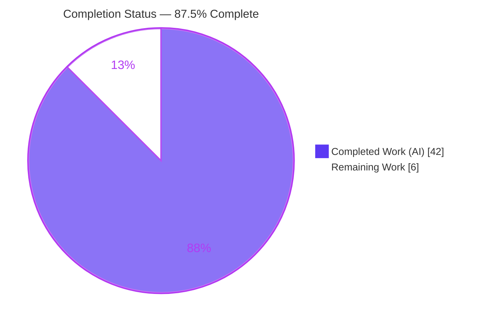
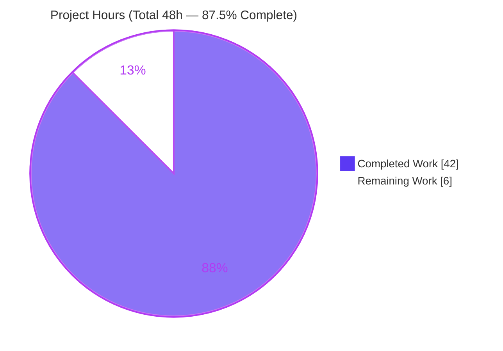
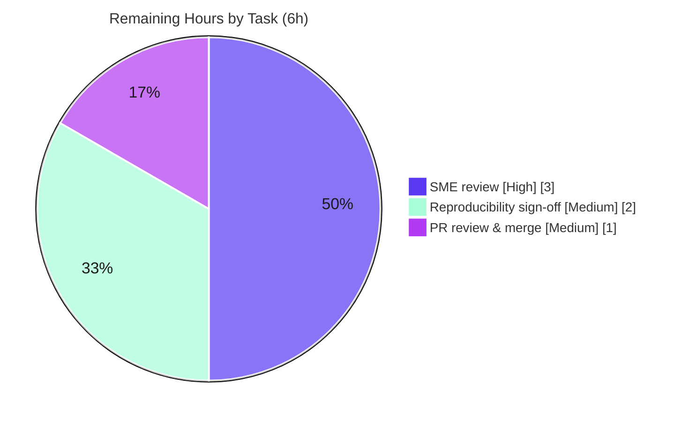

# Blitzy Project Guide — kitty: Compiled C Extensions & Test-Execution Flow (Evidence-Grounded Q&A)

## 1. Executive Summary

### 1.1 Project Overview

This project is a **documentation-only technical investigation** against the `kitty` terminal emulator (kovidgoyal/kitty) at commit `815df1e210e0a9ab4622f5c7f2d6891d7dbeddf1`, governed by the "SWE-AtlasQnA-Repo" rule set. The objective was to **build kitty from source, execute its test suite, and empirically document the relationship between the compiled C-extension modules and the test-execution flow** — writing strictly from observed runtime behavior, not from reading code. The audience is engineers and reviewers who need an evidence-grounded map of which compiled `.so` modules are critical to testing and how failures cascade when they are absent. The sole deliverable is one Markdown answer document; the entire kitty source tree is touched read-only.

### 1.2 Completion Status

The completion percentage is computed with the PA1 AAP-scoped methodology: `Completed Hours / (Completed Hours + Remaining Hours) × 100`. All 15 AAP-specified deliverable requirements are complete, committed, and independently validated; only path-to-production human activities remain.



| Metric | Value |
|--------|-------|
| **Total Hours** | 48.0 h |
| **Completed Hours (AI + Manual)** | 42.0 h (42.0 h AI autonomous + 0.0 h manual) |
| **Remaining Hours** | 6.0 h |
| **Percent Complete** | **87.5%** |

### 1.3 Key Accomplishments

- ✅ Built kitty from source — `python3 setup.py build --ignore-compiler-warnings` exits 0 and produces all six artifacts (`kitty/fast_data_types.so`, `kittens/transfer/rsync.so`, `kitty/glfw-x11.so`, `kitty/glfw-wayland.so`, and the `kitty`/`kitten` launchers).
- ✅ Diagnosed the default-build friction: `python3 setup.py build` fails under `-pedantic-errors -Werror` (`setup.py:491`) on `wayland-protocols` 1.45 enums, resolved via kitty's own in-tree flag (no source patch).
- ✅ Executed the full suite via the built launcher and captured verbatim output: `Ran 145 tests`, `FAILED (failures=6, skipped=2)`, `All Go tests succeeded`.
- ✅ Enumerated the exactly-two kitty extensions that load during test import (`kitty.fast_data_types`, `kittens.transfer.rsync`) and proved the GLFW backends are not Python-imported.
- ✅ Traced the true import chains (primary `__init__.py:21`→`config.py:10`→`conf/utils.py:27`; secondary via `window.py`→`child.py`; transfer via discovery).
- ✅ Reproduced the three-tier failure cascade (critical / collection-critical / optional) inside an isolated copy with verbatim `ModuleNotFoundError`/`OSError`/`AssertionError`.
- ✅ Authored the 786-line deliverable with one-claim-one-evidence discipline (139 `file:line` citations, 32 output blocks) and a closing coverage pass over every named sub-question.
- ✅ Upheld the read-only guarantee: `git status --porcelain` empty; exactly one new file added; source tree byte-for-byte unchanged.

### 1.4 Critical Unresolved Issues

| Issue | Impact | Owner | ETA |
|-------|--------|-------|-----|
| None — no blocking issues for the in-scope deliverable | The deliverable renders correctly, is committed, and passed independent validation with zero fixes required | — | — |

> The in-scope work has **no critical unresolved issues**. Items intentionally left as-observed per AAP §0.5.2 (kitty's 6 environment-specific test failures, the `wayland-protocols` `-Werror` build friction, and macOS `glfw-cocoa` behavior) are **out of scope by design** and are documented, not remediated. They are not defects in the deliverable.

### 1.5 Access Issues

| System/Resource | Type of Access | Issue Description | Resolution Status | Owner |
|-----------------|----------------|-------------------|-------------------|-------|
| — | — | No access issues identified | Resolved | — |

**No access issues identified.** The repository is writable, the full C/Go/Python toolchain and all native libraries are present, the build and test suite executed successfully, and both commits landed on the working branch. No credentials, permissions, or third-party API blockers exist.

### 1.6 Recommended Next Steps

1. **[High]** Have a subject-matter expert review and accept `blitzy/documentation/kitty_815df1e210e0.md` — verify a sample of citations, confirm all nine named sub-questions are answered.
2. **[Medium]** Perform an independent reproducibility sign-off on a clean/CI host (rebuild, re-run the suite, optionally reproduce one cascade tier).
3. **[Medium]** Review the additive-only diff and merge to the destination branch `kitty_815df1e210e0`.
4. **[Low]** Optionally record the exact environment versions alongside the doc for future re-runs, since observed timings/counts are environment-dependent.

---

## 2. Project Hours Breakdown

### 2.1 Completed Work Detail

Every component below traces to a specific AAP requirement and was delivered autonomously by Blitzy agents.

| Component | Hours | Description |
|-----------|-------|-------------|
| Build environment provisioning | 4.0 | Verify C11/Go/Python toolchain + native libraries (harfbuzz, freetype2, fontconfig, libpng, lcms2, xxhash, openssl, xkbcommon, wayland, canberra, dbus) required for the mixed build (AAP R1/R2). |
| Source build + `-Werror` friction diagnosis | 4.0 | Run `setup.py build --ignore-compiler-warnings` to exit 0; diagnose default-build failure at `glfw/wl_window.c` under `-pedantic-errors -Werror` (`setup.py:491`) on `wayland-protocols` 1.45 (AAP R1/R3). |
| Test-suite execution + baseline capture | 2.0 | Launch via `./kitty/launcher/kitty +launch test.py`; capture verbatim unittest and Go summary lines (AAP R4). |
| Failure/skip analysis | 3.0 | Analyze the 6 failures + 2 skips; prove each is environment-driven and unrelated to extension loading (AAP R5). |
| Extension↔test binding trace | 3.0 | Establish the concrete binding path (`__init__.py:22`) and the authoritative `check_build.py:28-31` assertion (AAP R6). |
| Loaded-extension enumeration | 2.5 | Instrument `sys.modules` to enumerate exactly the two kitty `.so` that load; confirm GLFW is not Python-imported (AAP R7). |
| Import-chain instrumentation & tracing | 3.5 | Capture the true first-load order — primary, secondary, and transfer/`rsync` chains (AAP R8). |
| Failure-cascade destructive experiments | 5.0 | In an isolated copy, remove each extension and re-run to capture Tier 1/2/3 behavior with verbatim errors (AAP R9). |
| Critical-vs-optional classification | 1.5 | Classify each extension by observed impact of absence (AAP R12). |
| Dependency-structure interpretation + category mapping | 4.0 | Interpret eager-discovery implications; map extensions to test categories across 22 runnable modules (AAP R10/R11). |
| Deliverable authoring | 8.0 | Author the 786-line document with 139 citations and one-claim-one-evidence discipline; incorporate 3 review-finding fixes (AAP R13). |
| Coverage pass + read-only cleanup/verification | 1.5 | Closing coverage pass (§10); remove temp scripts + isolated copy; verify clean `git status` (AAP R14/R15). |
| **Total Completed** | **42.0** | |

### 2.2 Remaining Work Detail

All remaining work is **path-to-production** (human review, reproducibility sign-off, merge). No AAP-specified deliverable work remains.

| Category | Hours | Priority |
|----------|-------|----------|
| Human SME technical review & acceptance of the answer document | 3.0 | High |
| Independent reproducibility sign-off (clean-environment re-run of build/test/experiments) | 2.0 | Medium |
| PR review & merge to destination branch `kitty_815df1e210e0` | 1.0 | Medium |
| **Total Remaining** | **6.0** | |

### 2.3 Hours Reconciliation

| Check | Result |
|-------|--------|
| Section 2.1 total (Completed) | 42.0 h |
| Section 2.2 total (Remaining) | 6.0 h |
| Section 2.1 + Section 2.2 | 48.0 h = Total Project Hours (Section 1.2) ✅ |
| Completion % = 42.0 / 48.0 | 87.5% (matches Section 1.2 & Section 7) ✅ |

---

## 3. Test Results

All results below originate from **Blitzy's autonomous validation logs** for this project. The deliverable is a Markdown document with no unit tests of its own; its "tests" are its empirical claims and citations — which the Final Validator **independently reproduced 100%** by re-building kitty, re-running the suite, and re-executing the destructive experiments. The kitty suite results below are the *evidence base* the deliverable documents.

| Test Category | Framework | Total Tests | Passed | Failed | Coverage % | Notes |
|---------------|-----------|-------------|--------|--------|-----------|-------|
| Python unit/integration (kitty suite) | `unittest` (stdlib) | 145 | 137 | 6 | N/A* | 2 skipped; the 6 failures are environment-specific (set-gid mode bit `0o42755` vs `0o40755` in `file_transmission`; FiraCode/Ubuntu-Mono font naming in `font_selection`) — **out of scope per AAP §0.5.2**, unrelated to extension loading. |
| Go tests (per package) | Go `testing` | All packages | All | 0 | N/A | Runner reported `All Go tests succeeded`; executed in parallel per package. |
| Build-verification (subset of suite) | `unittest` | 3 | 3 | 0 | N/A | `test_loading_extensions`, `test_loading_shaders`, `test_glfw_modules` (`check_build.py:28-47`) all pass in the baseline. |
| Deliverable claim/citation reproduction | Manual reproduction + citation audit | 78 (base,range) pairs | 78 | 0 | 100% | Independent re-run confirmed every substantive claim; 37 file bases audited, 0 out-of-bounds citations. |
| Failure-cascade experiments (methodology) | Isolated-copy re-runs | 3 tiers | 3 | 0 | N/A | Tier 1 (`fast_data_types`) → 0 tests / `ModuleNotFoundError`; Tier 2 (`rsync`) → 0 tests / `ModuleNotFoundError`; Tier 3 (GLFW removed) → 145 tests run, localized `OSError`/`AssertionError` only. |

*Coverage %: kitty does not emit a line-coverage metric from its `unittest`/Go runners; C correctness is validated indirectly through the Python bindings. "N/A" is reported rather than a fabricated number.

**Baseline runner output (verbatim, from validation logs):**

```
Ran 145 tests in 27.964s
FAILED (failures=6, skipped=2)
All Go tests succeeded, ran in 28.4 seconds
```

> Integrity note: the 6 failures / 2 skips are the *observed phenomena the deliverable documents*, not defects in the deliverable. They are explicitly out of scope for remediation per AAP §0.5.2.

---

## 4. Runtime Validation & UI Verification

This is a headless, documentation-only task; there is **no user-facing UI**. Runtime validation covers the build, the test runner, and the extension-loading behavior.

- ✅ **Operational** — Build: `python3 setup.py build --ignore-compiler-warnings` → exit 0; all six artifacts produced with expected sizes.
- ✅ **Operational** — Launcher: `./kitty/launcher/kitty --version` → `kitty 0.35.2 created by Kovid Goyal`.
- ✅ **Operational** — Test runner: `./kitty/launcher/kitty +launch test.py` runs the full Python + Go suite; `Ran 145 tests`, `All Go tests succeeded`.
- ✅ **Operational** — Extension loading: `test_loading_extensions` confirms `kitty.fast_data_types` and `kittens.transfer.rsync` import cleanly; live `sys.modules` instrumentation confirms exactly those two kitty `.so` load.
- ✅ **Operational** — Import chains: primary chain loads the C core *before* the explicit import at `__init__.py:22`, via `config.py:10`→`conf/utils.py:27`.
- ✅ **Operational** — Cascade experiments: Tier 1/2/3 reproduced deterministically in the isolated copy.
- ⚠ **Partial (by design, out of scope)** — kitty suite reports 6 environment-specific failures + 2 skips; documented, not remediated (AAP §0.5.2).
- ⚠ **Partial (by design, out of scope)** — Default `-Werror` build path fails on `wayland-protocols` 1.45; resolved via the in-tree `--ignore-compiler-warnings` flag.
- ❌ **Not executed (honest disclosure)** — macOS `glfw-cocoa.so` behavior cannot be exercised on this Linux container; described from code/skip signals only (§10 honesty note).
- 🖥️ **UI Verification** — Not applicable: no front-end, screens, or design-system surface exist for this deliverable.

---

## 5. Compliance & Quality Review

Cross-mapping the AAP deliverables and the "SWE-AtlasQnA-Repo" rule set to observed quality benchmarks.

| Requirement / Benchmark | Source | Status | Progress | Notes |
|-------------------------|--------|--------|----------|-------|
| Investigate by running first, then write | Rule | ✅ Pass | 100% | Every claim backed by captured output; methodology section states the discipline. |
| Quote observed output verbatim (one claim, one evidence) | Rule | ✅ Pass | 100% | 32 output blocks; 139 `file:line` citations; audit found 0 out-of-bounds. |
| Answer every named item + `e.g.` examples | Rule | ✅ Pass | 100% | §10 coverage pass checkboxes all 9 items + core-data-types/transfer/windowing examples. |
| Be exact & grounded (`file:line`) | Rule | ✅ Pass | 100% | Spot-checked citations (`__init__.py:22`, `conf/utils.py:27`, `setup.py:491`, `check_build.py:28-47`, `file_transmission.py:13`) all exact. |
| Read-only scope; only new file is the answer doc | Rule | ✅ Pass | 100% | `git diff` shows exactly `A blitzy/documentation/kitty_815df1e210e0.md`; clean `git status`. |
| Deliverable path/name `blitzy/documentation/<branch>.md` | Rule | ✅ Pass | 100% | Path `blitzy/documentation/kitty_815df1e210e0.md` verified exact. |
| Temp scripts + isolated copy removed | Rule | ✅ Pass | 100% | `/tmp/kitty_iso` and observation scripts removed; verified by clean tree. |
| Report observed values even if unexpected | Rule | ✅ Pass | 100% | Doc reports its own `failures=6/skipped=2`, correctly diverging from the AAP's stale reference and explaining why. |
| Build from source (R1) | AAP | ✅ Pass | 100% | Six artifacts produced; exit 0. |
| Execute suite at representative scale (R4) | AAP | ✅ Pass | 100% | 145 tests + Go suite. |
| Trace binding / loads / chains / cascade (R6–R9) | AAP | ✅ Pass | 100% | All sections populated with verbatim evidence. |
| Category mapping + criticality (R11–R12) | AAP | ✅ Pass | 100% | §7 + §8. |
| Human SME acceptance | Path-to-prod | ⏳ Pending | 0% | Requires human reviewer. |
| Independent reproducibility sign-off | Path-to-prod | 🔄 In progress | ~70% | Final Validator reproduced 100%; final human/CI gate outstanding. |
| PR merge to destination branch | Path-to-prod | ⏳ Pending | 0% | Additive, conflict-free. |

**Fixes applied during autonomous validation:** 3 review findings were resolved in commit `128933e8e` (e.g., correcting the runnable-module count to 22 and aligning reported values with the environment's actual observed output). The Final Validator required **no further fixes**.

---

## 6. Risk Assessment

Overall risk is **Low** — a read-only, committed, independently-validated documentation deliverable.

| Risk | Category | Severity | Probability | Mitigation | Status |
|------|----------|----------|-------------|------------|--------|
| Environment version drift (Python 3.13.7, gcc 15.2.0, `wayland-protocols` 1.45) yields different timings/counts on other hosts | Technical | Low | Medium | Doc reports its own observed values + records the environment + states env-dependence | Mitigated (documented) |
| Default build fails under `-pedantic-errors -Werror` on `wayland-protocols` 1.45 enums | Technical | Low | High | In-tree `--ignore-compiler-warnings` flag (`setup.py:2003-2004`); out-of-scope to remediate per AAP §0.5.2 | Documented workaround |
| Build artifacts are git-ignored (not persisted); reproduction requires a rebuild | Technical | Low | Medium | Development guide documents the exact one-line build command | Mitigated |
| No product code introduced; no new attack surface | Security | Negligible | Low | Markdown-only; destructive experiments confined to `/tmp/kitty_iso`; read-only verified via clean `git status` | Resolved |
| Reproduction depends on native-lib/toolchain availability | Operational | Low–Medium | Low | `docs/build.rst` + development guide enumerate prerequisites | Mitigated |
| kitty's 6 env-specific failures + 2 skips could mislead a reviewer | Operational | Low | Medium | §2.3/§2.4 explain each is environment-driven and unrelated to extension loading | Mitigated (documented) |
| Deliverable path/name must match the rule set | Integration | Low | Low | Path/name verified exact | Resolved |
| Merge to destination branch | Integration | Negligible | Low | Single additive new file; conflict-free (verified via `git diff`) | Low |
| macOS `glfw-cocoa` not executed on Linux | Integration | Low | N/A | Described from code/skip signals; explicitly out of scope; disclosed in §10 | Documented limitation |

---

## 7. Visual Project Status

**Project Hours Breakdown** (Completed = Dark Blue `#5B39F3`, Remaining = White `#FFFFFF`):



**Remaining Work by Priority** (hours from Section 2.2; total = 6.0 h):



| Category | Remaining Hours | Priority |
|----------|-----------------|----------|
| SME technical review & acceptance | 3.0 | High |
| Reproducibility sign-off | 2.0 | Medium |
| PR review & merge | 1.0 | Medium |
| **Total** | **6.0** | — |

> Integrity: the pie "Remaining Work" value (6) equals Section 1.2 Remaining Hours (6.0 h) and the Section 2.2 Hours sum (6.0 h).

---

## 8. Summary & Recommendations

**Achievements.** The project is **87.5% complete** (42.0 of 48.0 AAP-scoped hours). All 15 AAP-specified deliverable requirements are complete: kitty was built from source, its test suite executed at full scale (`Ran 145 tests`, `All Go tests succeeded`), the extension↔test binding and true import chains were traced, the three-tier failure cascade was reproduced in an isolated copy, and the findings were authored into a 786-line, 139-citation, evidence-grounded answer document at `blitzy/documentation/kitty_815df1e210e0.md`. The Final Validator independently reproduced every claim and applied zero fixes.

**Remaining gaps.** The outstanding 6.0 hours are entirely **path-to-production** human activities: SME review/acceptance (3.0 h), independent reproducibility sign-off (2.0 h), and PR review/merge (1.0 h). There is no compilation debt, no failing in-scope test, and no unresolved error.

**Critical path to production.** SME acceptance → reproducibility sign-off → merge to `kitty_815df1e210e0`. Because the change is a single additive, conflict-free file with a clean working tree, the path is short and low-risk.

**Success metrics (met).** Read-only guarantee upheld (clean `git status`, exactly one file added); every behavioral claim paired with verbatim output and an exact `file:line` citation; every named sub-question closed out in the §10 coverage pass; out-of-scope items honestly disclosed rather than silently omitted or over-reported.

**Production-readiness assessment.** The in-scope deliverable is **production-ready pending human review**. Recommendation: proceed with SME acceptance and merge; capture the exact environment versions alongside the document to aid future reproducibility, since observed timings and failure/skip counts are environment-dependent.

| Metric | Value |
|--------|-------|
| AAP-specified requirements complete | 15 / 15 |
| Completion (hours-based) | 87.5% (42.0 / 48.0 h) |
| Blocking issues | 0 |
| Fixes required by Final Validator | 0 |
| Files added / source files modified | 1 / 0 |

---

## 9. Development Guide

### 9.1 System Prerequisites

- **OS:** Linux (headless is fine; the suite runs without a display server). macOS is supported by kitty but the `glfw-cocoa` path is not exercisable here.
- **Python:** ≥ 3.8 (`pyproject.toml`); observed here: **3.13.7**. Provides the `libpython` the C extension links against.
- **Go:** 1.22 baseline (`go.mod:L3`); observed here: **go1.22.12**.
- **C compiler:** C11-capable; observed here: **gcc 15.2.0**.
- **pkg-config:** observed here: **1.8.1** (resolves native compile/link flags).

### 9.2 Environment Setup

```bash
# Work at the investigated commit
git checkout 815df1e210e0a9ab4622f5c7f2d6891d7dbeddf1   # or the branch kitty_815df1e210e0

# Tests expect a UTF-8 locale
export LANG=C.UTF-8 LC_ALL=C.UTF-8
```

### 9.3 Dependency Installation

Install the C/Go/Python toolchain and native libraries enumerated in `docs/build.rst`. On Debian/Ubuntu:

```bash
sudo apt-get update
DEBIAN_FRONTEND=noninteractive sudo apt-get install -y \
  build-essential pkg-config golang-go python3 python3-dev \
  libharfbuzz-dev libfreetype-dev libfontconfig-dev libpng-dev \
  liblcms2-dev libxxhash-dev libssl-dev libxkbcommon-dev libxkbcommon-x11-dev \
  libwayland-dev wayland-protocols libcanberra-dev libdbus-1-dev \
  libx11-dev libxcursor-dev libxrandr-dev libxinerama-dev libxi-dev libx11-xcb-dev libgl1-mesa-dev

# Verify a native dependency resolves (repeat per library):
pkg-config --exists harfbuzz && echo "harfbuzz OK $(pkg-config --modversion harfbuzz)"
```

### 9.4 Build

```bash
# Documented working build path (exit 0 on this environment):
python3 setup.py build --ignore-compiler-warnings
```

- The `--ignore-compiler-warnings` flag is defined in `setup.py` (argparse at ~`setup.py:2003-2004`) and disables the `-pedantic-errors -Werror` gate at `setup.py:491`. It is an **in-tree flag, not a source edit**.
- The **default** `python3 setup.py build` is expected to **fail** at `glfw/wl_window.c` on hosts with `wayland-protocols` 1.45 (newer `XDG_TOPLEVEL_STATE_CONSTRAINED_*` enums) — this is documented behavior, not a defect.

### 9.5 Verification

```bash
# 1. Confirm all six artifacts exist
ls -la kitty/fast_data_types.so kittens/transfer/rsync.so \
       kitty/glfw-x11.so kitty/glfw-wayland.so kitty/launcher/kitty kitty/launcher/kitten

# 2. Launcher smoke test  ->  "kitty 0.35.2 created by Kovid Goyal"
./kitty/launcher/kitty --version

# 3. Run the full Python + Go test suite
LANG=C.UTF-8 LC_ALL=C.UTF-8 ./kitty/launcher/kitty +launch test.py
#    Expect: "Ran 145 tests ...", "FAILED (failures=6, skipped=2)" [env-specific], "All Go tests succeeded"
#    Alternative entry point: python3 setup.py test   (routes via os.execl at setup.py:2103)
```

### 9.6 Example Usage — Reproduce the Investigation

```bash
# View the deliverable
less blitzy/documentation/kitty_815df1e210e0.md

# Confirm read-only scope (reviewers): only ONE file added, clean tree
git diff --name-status 815df1e210e0a9ab4622f5c7f2d6891d7dbeddf1..HEAD   # -> A blitzy/documentation/kitty_815df1e210e0.md
git status --porcelain                                                  # -> (empty)

# Reproduce a failure-cascade tier SAFELY in an isolated copy (never in the real tree):
cp -a . /tmp/kitty_iso && cd /tmp/kitty_iso
rm kitty/fast_data_types.so
LANG=C.UTF-8 LC_ALL=C.UTF-8 ./kitty/launcher/kitty +launch test.py || true   # -> ModuleNotFoundError at conf/utils.py:27; 0 tests run
cd - && rm -rf /tmp/kitty_iso
```

### 9.7 Troubleshooting

- **Default build fails with "all warnings being treated as errors" at `glfw/wl_window.c`** → use `python3 setup.py build --ignore-compiler-warnings`.
- **`ModuleNotFoundError: No module named 'kitty.fast_data_types'`** → the build did not run or did not complete; rebuild.
- **Test run reports `failures=6, skipped=2`** → expected and environment-specific (set-gid mode bit; font naming; frozen-build/macOS-only skips); unrelated to extension loading (see deliverable §2.3/§2.4).
- **`pkg-config` cannot find a library** → install the corresponding `-dev` package; re-run the `pkg-config --exists` check.
- **Test counts/timings differ from the document** → expected; observed values are environment-dependent, and the document reports its own observed run.

---

## 10. Appendices

### A. Command Reference

| Command | Purpose |
|---------|---------|
| `python3 setup.py build --ignore-compiler-warnings` | Build all extensions + launchers (exit 0) |
| `python3 setup.py test` | Build (if needed) and run the suite via `os.execl` (`setup.py:2103`) |
| `./kitty/launcher/kitty +launch test.py` | Run the Python + Go test suite directly |
| `./kitty/launcher/kitty --version` | Launcher smoke test (`kitty 0.35.2 …`) |
| `make` / `make test` | Makefile wrappers (`all:` L12, `test:` L15) → `setup.py` |
| `git diff --name-status 815df1e210e0..HEAD` | Confirm the single additive file |
| `git status --porcelain` | Confirm clean working tree |

### B. Port Reference

Not applicable — this is a headless build-and-test investigation; no network services or ports are used.

### C. Key File Locations

| Path | Role |
|------|------|
| `blitzy/documentation/kitty_815df1e210e0.md` | **The sole deliverable** (786 lines) |
| `setup.py` | Build orchestrator; `-Werror` gate (`:491`), flag (`:2003-2004`), test target (`:2103`) |
| `test.py` | Test entry; launcher shebang (`:1`); imports `kitty_tests.main` |
| `kitty_tests/main.py` | Runner; `find_all_tests()` (`:57/:60`), eager import (`:64`) |
| `kitty_tests/__init__.py` | Base test infra; C-core import (`:22`); config (`:21`); window (`:27`) |
| `kitty_tests/check_build.py` | `test_loading_extensions` (`:28-31`), `_shaders` (`:33-36`), `_glfw_modules` (`:38-47`) |
| `kitty_tests/file_transmission.py` | Module-level `rsync` import (`:13`) driving the Tier-2 cascade |
| `kitty_tests/glfw.py` | `ctypes.CDLL(...)` (`:50`) driving Tier-3 behavior |
| `kitty/conf/utils.py` | Earliest C-core trigger `from ..fast_data_types import Color` (`:27`) |
| `kitty/fast_data_types.so`, `kittens/transfer/rsync.so`, `kitty/glfw-*.so`, `kitty/launcher/{kitty,kitten}` | Build artifacts (git-ignored) |

### D. Technology Versions

Observed in this environment (canonical dependency list: `docs/build.rst`; note versions are newer than the AAP §0.6 snapshot and are reported as observed):

| Component | Version | Component | Version |
|-----------|---------|-----------|---------|
| Python | 3.13.7 | xkbcommon | 1.7.0 |
| Go | go1.22.12 | wayland-client | 1.24.0 |
| gcc | 15.2.0 | wayland-protocols | 1.45 |
| pkg-config | 1.8.1 | libcanberra | 0.30 |
| harfbuzz | 10.2.0 | dbus-1 | 1.16.2 |
| freetype2 | 26.2.20 | libpng | 1.6.50 |
| fontconfig | 2.15.0 | lcms2 | 2.16 |
| libxxhash | 0.8.3 | libcrypto (OpenSSL) | 3.5.3 |
| kitty (built) | 0.35.2 | | |

### E. Environment Variable Reference

| Variable | Value | Purpose |
|----------|-------|---------|
| `LANG` / `LC_ALL` | `C.UTF-8` | UTF-8 locale required by the test suite |
| `DEBIAN_FRONTEND` | `noninteractive` | Non-interactive apt during dependency install |

No application secrets, API keys, or service credentials are required for this task.

### F. Developer Tools Guide

- **git** — scope/read-only verification (`git diff --name-status`, `git status --porcelain`, `git log --author=agent@blitzy.com`).
- **pkg-config** — verify native library availability (`pkg-config --exists <lib>`).
- **python3 / go / gcc** — the mixed build toolchain; check versions before building.
- **Isolated-copy pattern** — always reproduce destructive experiments under `/tmp/kitty_iso` (never the real tree) and remove the copy afterward.

### G. Glossary

| Term | Definition |
|------|------------|
| **C extension / `.so`** | A compiled shared object produced by the build (e.g., `kitty/fast_data_types.so`). |
| **`fast_data_types`** | kitty's compiled C core exposing `Cursor`, `Screen`, `Color`, `compile_program`, etc. |
| **Eager discovery** | `find_all_tests()` imports every test module up front, so a module-scope import failure aborts the whole run. |
| **Tier 1 / critical** | Removal causes `ModuleNotFoundError` at base-package import → 0 tests run (`fast_data_types.so`). |
| **Tier 2 / collection-critical** | Base package imports, but discovery aborts importing a module → 0 tests run (`rsync.so`). |
| **Tier 3 / optional/platform** | Suite still runs (145 tests); only GLFW-specific tests break (`OSError`/`AssertionError`). |
| **Read-only guarantee** | The source tree is left byte-for-byte unchanged; only the answer document is added. |

---

*Completion percentage (87.5%) and hours (Total 48.0 h; Completed 42.0 h; Remaining 6.0 h) are consistent across Sections 1.2, 2.1, 2.2, 2.3, 7, and 8. Brand colors: Completed = Dark Blue `#5B39F3`, Remaining = White `#FFFFFF`.*