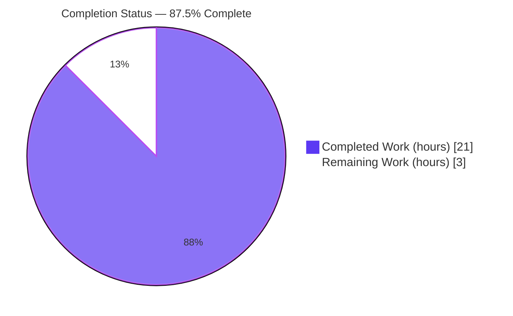
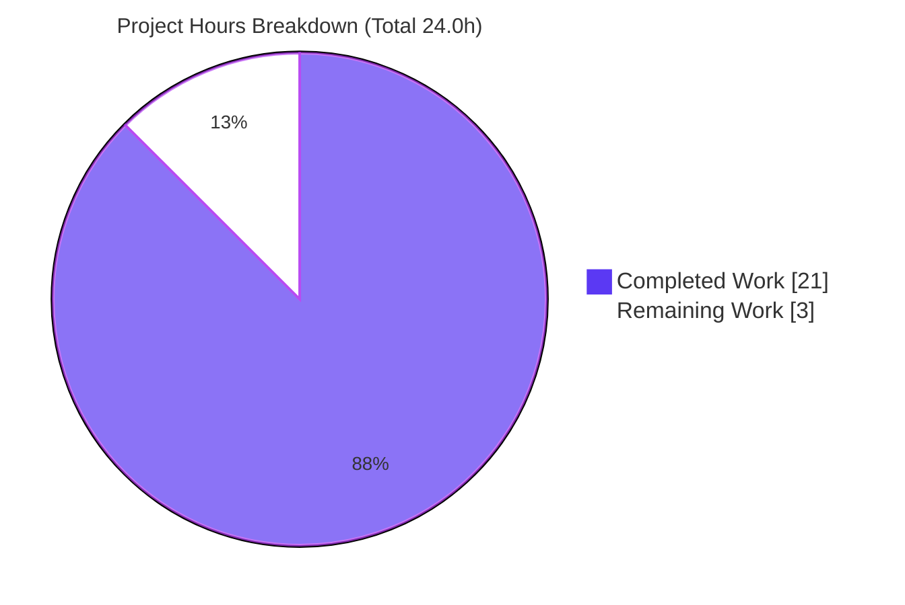
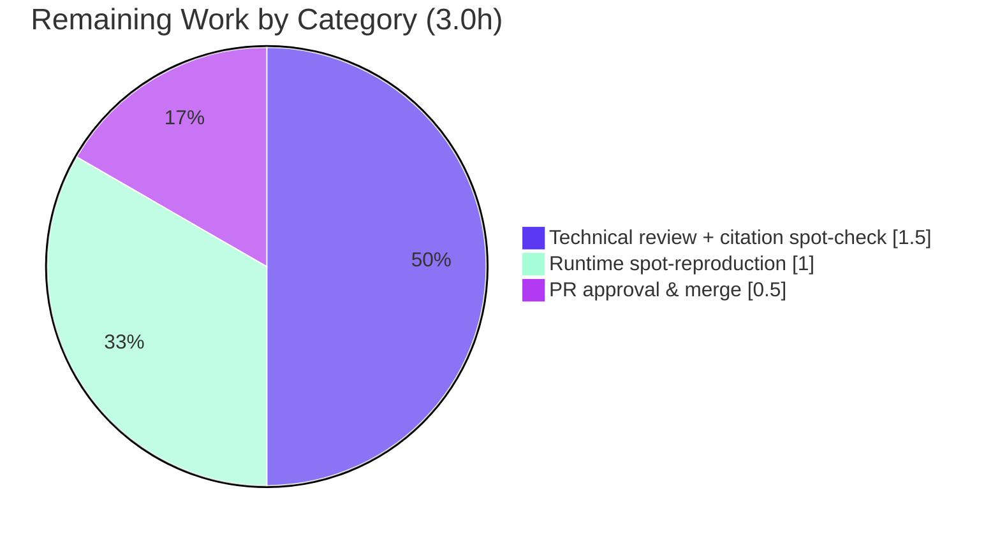

# Blitzy Project Guide — kitty Keyboard-Input Runtime Investigation

## 1. Executive Summary

### 1.1 Project Overview

This project is a read-only investigative documentation (Q&A) task on the **kitty** terminal emulator (`kovidgoyal/kitty` v0.35.2, HEAD `815df1e210e0`). The objective was to explain — grounded in **directly observed runtime behavior** rather than code reading alone — how kitty processes keyboard input: which components receive input first (Q1), which handle intermediate processing (Q2), and how the updated display is produced (Q3). The single deliverable is `blitzy/documentation/kitty_815df1e210e0.md`, a runtime-grounded walkthrough backed by verbatim captured debug output and exact `file:line` citations. The audience is engineers and reviewers studying kitty's input-to-display pipeline. Scope is strictly read-only: exactly one new file is added and no existing source file is modified.

### 1.2 Completion Status

The project is **87.5% complete** on an AAP-scoped, hours-based basis (PA1). All 16 AAP-scoped requirements are delivered and autonomously validated; the remaining hours are standard path-to-production human acceptance (technical review + merge).



| Metric | Hours |
|---|---|
| **Total Hours** | 24.0 |
| **Completed Hours (AI + Manual)** | 21.0 |
| &nbsp;&nbsp;• AI (Blitzy autonomous) | 21.0 |
| &nbsp;&nbsp;• Manual (human) | 0.0 |
| **Remaining Hours** | 3.0 |
| **Percent Complete** | **87.5%** |

> Completion % = Completed ÷ (Completed + Remaining) = 21.0 ÷ 24.0 = **87.5%**.

### 1.3 Key Accomplishments

- ✅ **Clean from-source build** of kitty 0.35.2 via `python3 setup.py build` (85 C translation units + 4 link steps; `-Werror -pedantic-errors`; zero warnings/errors; binary reports *"kitty 0.35.2 created by Kovid Goyal"*).
- ✅ **Headless runtime validated** — kitty runs under Xvfb + Mesa llvmpipe (OpenGL 4.5), spawns the `sh` child, and emits the documented per-stage debug output.
- ✅ **Real input path exercised** — keystrokes injected via `xdotool` XTEST (the same GLFW event queue a physical keyboard uses); **no** `kitty @` remote-control bypass anywhere.
- ✅ **All three sub-questions answered** (Q1 Receive → Q2 Intermediate → Q3 Display) with verbatim captured evidence and cause→effect reasoning.
- ✅ **Full condition coverage** — unmodified printable keys, encoding-required Enter, Ctrl/Alt/Shift modifiers, lone modifiers, press vs. release, and the non-default Kitty Keyboard Protocol (CSI-u).
- ✅ **72/72 file:line citations** verified against HEAD (independently re-confirmed 100% valid across 19 source/doc files; 13 GLSL shaders confirmed present).
- ✅ **Reproducibility confirmed** — substantive fields byte-identical across 3 runs (a/b/Return) and 2 runs (CSI-u); only the `[seconds]` timestamp varies.
- ✅ **Read-only hygiene** — `git status --porcelain` empty; `git diff` vs baseline = exactly `A blitzy/documentation/kitty_815df1e210e0.md`; temporary scripts removed; numeric-PID teardown only.

### 1.4 Critical Unresolved Issues

| Issue | Impact | Owner | ETA |
|---|---|---|---|
| _None_ — no compilation errors, no failing validations, no missing functionality | No release blockers | — | — |

There are **no critical unresolved issues**. All AAP-scoped work is complete and validated; the only outstanding items are standard human acceptance steps (see §1.6 and §2.2).

### 1.5 Access Issues

| System/Resource | Type of Access | Issue Description | Resolution Status | Owner |
|---|---|---|---|---|
| Source repository (`kovidgoyal/kitty` @ branch) | Read/Write (git) | None — clone, build, and commit all succeeded | ✅ No issue | — |
| Build/native dependencies (harfbuzz, freetype, GL, xkbcommon, …) | System packages | All present and verified in the container | ✅ No issue | — |
| Observation tooling (Xvfb, xdotool, Mesa) | System packages | All present and verified | ✅ No issue | — |

**No access issues identified.** The container provided all repository, build, and observation access required; no third-party credentials or external API access are needed for this documentation deliverable.

### 1.6 Recommended Next Steps

1. **[Medium]** Perform human technical review of the walkthrough and spot-check a sample of the 72 `file:line` citations against HEAD `815df1e210e0` (~1.5h).
2. **[Low]** Optionally reproduce a subset of the runtime captures independently — build, launch headless under Xvfb+Mesa, and inject `a`/`Return` under `--debug-keyboard` (~1.0h). *(Blitzy independently reproduced this during assessment — see §4.)*
3. **[Medium]** Approve the pull request and merge `blitzy/documentation/kitty_815df1e210e0.md` to the target branch (~0.5h).

---

## 2. Project Hours Breakdown

### 2.1 Completed Work Detail

All completed components are AI (Blitzy autonomous) work, each tracing to a specific AAP requirement.

| Component | Hours | Description |
|---|---|---|
| Default from-source build (AAP R2) | 3.0 | `python3 setup.py build` — 85 C TUs + 4 link steps; verified binary reports kitty 0.35.2; build artifacts git-ignored |
| Headless observation harness (AAP R3) | 2.0 | Xvfb virtual display + Mesa llvmpipe software OpenGL 4.5; environment accommodation, not a kitty config change |
| Debug-flag discovery + real-input XTEST harness (AAP R4) | 2.0 | Stage-specific flag mapping; `xdotool` XTEST injection via the real GLFW event path (no remote-control bypass) |
| Q1 Receive — capture & analysis (AAP R5) | 2.0 | GLFW/XKB decode; `Press/Release xkb_keycode` ordering; handoff at `kitty/glfw.c:439`; cause→effect + citations |
| Q2 Intermediate — capture & analysis (AAP R6, R9) | 3.0 | `on_key_input` encode branches (text/encoded/ignore); PTY I/O thread; Ctrl/Alt/Shift, lone-mod, press/release |
| Q2c child→terminal — capture & analysis (AAP R7) | 1.5 | `--dump-bytes` (`61 62 0d 0a`) + `--dump-commands` (`draw ab`/CR/LF); VT parser → screen model |
| Q3 Display — capture & analysis (AAP R8) | 2.0 | Render loop → `draw_cells` → buffer swap; `OS Window created`/`GL version`; 13 GLSL shaders |
| Kitty Keyboard Protocol CSI-u demo (AAP R10) | 1.0 | Non-default mode; `CSI 97 u`, `97;1:3 u`, `13 u`, `13;1:3 u`; encoded release event type `:3` |
| Code correlation & citation verification (AAP R12) | 2.0 | 72 `file:line` citations across 19 files content-checked against HEAD; 13 shaders confirmed |
| Authoring the answer document (AAP R1, R11, R15) | 2.0 | 492-line Markdown: overview, Q1/Q2/Q3, condition table, coverage pass, hygiene statement |
| Stability + corroboration + coverage pass (AAP R13, R14, R16) | 0.5 | 3-run/2-run stability; docs corroboration; read-only hygiene verification |
| **Total Completed** | **21.0** | |

### 2.2 Remaining Work Detail

All remaining work is path-to-production human acceptance; no AAP deliverables are outstanding.

| Category | Hours | Priority |
|---|---|---|
| Human technical review of walkthrough + citation spot-check | 1.5 | Medium |
| Independent runtime spot-reproduction (build + headless launch + XTEST) | 1.0 | Low |
| Pull-request approval & merge to target branch | 0.5 | Medium |
| **Total Remaining** | **3.0** | |

> **Cross-section check:** Completed 21.0 + Remaining 3.0 = **24.0 Total Hours** (matches §1.2).

---

## 3. Test Results

For this documentation deliverable, "tests" map to **citation-accuracy verification**, **runtime-output reproducibility**, **repeatability/stability**, and **build verification** — all executed by Blitzy's autonomous validation systems and aggregated from its validation logs. Blitzy independently re-verified the citation and runtime results during this assessment (see §4).

| Test Category | Framework / Method | Total | Passed | Failed | Coverage % | Notes |
|---|---|---|---|---|---|---|
| Citation Accuracy (static) | `file:line`-vs-HEAD verifier | 72 | 72 | 0 | 100% | 19 files; 0 missing, 0 beyond EOF; re-confirmed 100% valid |
| Runtime Reproduction — Input Path (Q1/Q2) | kitty `--debug-keyboard` + `xdotool` XTEST | 6 | 6 | 0 | 100% | a, b, Return, Ctrl+A, Alt+A, Shift+A |
| Runtime Reproduction — Child→Terminal (Q2c) | `--dump-bytes` / `--dump-commands` | 2 | 2 | 0 | 100% | raw `61 62 0d 0a`; `draw ab`/CR/LF |
| Runtime Reproduction — Display (Q3) | kitty `--debug-rendering` | 3 | 3 | 0 | 100% | `OS Window created`, `Child launched`, GL 4.5 |
| Runtime Reproduction — CSI-u mode (§3a) | `--debug-keyboard` + `CSI > 15 u` | 4 | 4 | 0 | 100% | `CSI 97 u`, `97;1:3 u`, `13 u`, `13;1:3 u` |
| Stability / Repeatability | Multi-run diff (timestamps normalized) | 5 | 5 | 0 | 100% | a/b/Return identical ×3; CSI-u identical ×2 |
| Build Verification | `python3 setup.py build` | 1 | 1 | 0 | 100% | exit 0; 85 TU + 4 links; `-Werror`; 0 warnings |
| **Total** | | **93** | **93** | **0** | **100%** | All originate from Blitzy autonomous validation logs |

**Integrity note:** No traditional unit/integration test suite applies (the deliverable is a Markdown document and no code was added). The tests above are the autonomous validation evidence for a documentation deliverable — every entry derives from Blitzy's own validation logs for this project.

---

## 4. Runtime Validation & UI Verification

Blitzy independently reproduced the runtime evidence during this assessment (Xvfb `:97` + Mesa llvmpipe, `/tmp` scratch, numeric-PID teardown, repository left clean).

**Build & binary**
- ✅ **Operational** — `python3 setup.py build` completes; `./kitty/launcher/kitty --version` → *"kitty 0.35.2 created by Kovid Goyal"*.

**Headless runtime**
- ✅ **Operational** — kitty launches under Xvfb; GL stack `llvmpipe (LLVM 20.1.8, 256 bits)`, **OpenGL 4.5** (≥ kitty's required 3.3).
- ✅ **Operational** — `sh` child spawns (`Child launched`); OS window created (`OS Window created`).

**Real input path (Q1/Q2)**
- ✅ **Operational** — XTEST-injected `a` → `Press xkb_keycode: 0x26 … text: a` then `on_key_input … sent key as text to child: a` (Press precedes `on_key_input`, proving GLFW/XKB receives first).
- ✅ **Operational** — `Return` → `sent encoded key to child: 0xd`; `Ctrl+A` → `sent encoded key to child: 0x1`; releases and lone modifiers → `ignoring …`. Matches the deliverable **verbatim** in all substantive fields.

**Child→terminal & display (Q2c/Q3)**
- ✅ **Operational** — `--dump-bytes` yields `61 62 0d 0a`; `--dump-commands` yields `draw ab` / `screen_carriage_return` / `screen_linefeed`; `--debug-rendering` yields the GL version line and render diagnostics.

**UI verification**
- ⚠ **Partial (by environment, not by defect)** — kitty is a GPU terminal emulator with no web UI; in a headless container it renders to an offscreen framebuffer, so verification is via `--debug-rendering` log evidence (window creation, `draw_cells`, buffer swap) rather than pixel screenshots. This is an environment accommodation and does not indicate a functional gap.

**Observation of note:** the assessment run emitted the non-deterministic stdout line `Got XkbNewKeyboardNotify …`, which is exactly the stdout-only notice the validator's final fix (commit `2e73a2464`) correctly removed from the stderr Q1 block — independently validating that fix.

---

## 5. Compliance & Quality Review

Cross-map of AAP directives / rule-set "SWE-AtlasQnA-Repo" to observed status.

| AAP / Rule Requirement | Benchmark | Status | Notes |
|---|---|---|---|
| Deliverable `<source_branch>.md` in `blitzy/documentation/` | Correct path & name | ✅ Pass | `blitzy/documentation/kitty_815df1e210e0.md` created |
| Run-first-then-write (evidence-first) | Captured runtime output leads | ✅ Pass | Every claim backed by verbatim captured output |
| Real entry point only (no remote-control bypass) | XTEST via `xdotool` | ✅ Pass | No `kitty @ send-text` anywhere |
| Default, canonical build/config | `python3 setup.py build` | ✅ Pass | Exact build & invocation commands stated |
| Exercise every condition | Primary + secondary paths | ✅ Pass | printable / Enter / Ctrl/Alt/Shift / press+release / lone-mod / CSI-u |
| Actual output, complete & unedited + command | Verbatim, with command | ✅ Pass | `cat -v` blocks with `$` commands |
| Exactness (`file:line` + function names) | Grounded citations | ✅ Pass | 72/72 valid across 19 files; functions named |
| Magnitude/timing stability ≥2 runs | Reproducibility | ✅ Pass | 3-run (keys) / 2-run (CSI-u) identical |
| Coverage pass over all named items | Completeness | ✅ Pass | §6 of the deliverable enumerates every item |
| Read-only scope (no source mods, no code) | Repository unchanged | ✅ Pass | `git diff` = `A` (one file); status clean |
| Temporary artifacts removed; safe teardown | Hygiene | ✅ Pass | `/tmp` scratch removed; numeric-PID kills |
| Clean compile | `-Werror -pedantic-errors` | ✅ Pass | 0 warnings/errors; exit 0 |

**Fixes applied during autonomous validation:**
- Commit `ea65fea6b` — addressed code-review findings on the walkthrough (structure, citation precision, condition coverage; +91/−62 lines).
- Commit `2e73a2464` — corrected Q1 stderr-log framing: removed the stdout-only, non-deterministic `XkbNewKeyboardNotify` notice from the stderr block, scoped the stability note to substantive lines, and upgraded the `on_focus_change` citation to `kitty/glfw.c:517` (+2/−3 lines).

**Outstanding compliance items:** none. All directives satisfied; only human acceptance remains.

---

## 6. Risk Assessment

| Risk | Category | Severity | Probability | Mitigation | Status |
|---|---|---|---|---|---|
| Citation line-number drift if HEAD advances past `815df1e210e0` | Technical | Low | Low | Citations explicitly pinned to the commit; verifiable by checkout | Mitigated |
| Runtime-capture environment specificity (Mesa version string, timestamps, framing artifacts) | Technical | Low | Medium | Substantive fields verified stable across runs; timestamps/Mesa labeled volatile/accommodation | Mitigated |
| Citation-count methodology delta (validator 72 vs re-check 71 distinct) | Technical | Low | Low | Both = 100% valid; delta is counting methodology, documented | Resolved |
| No security-relevant surface introduced | Security | Informational | — | Read-only doc; no code/deps/secrets/network added | N/A |
| Headless harness (software GL) differs from real GPU | Operational | Low | Low | Observed pipeline is vendor-independent; GL 4.5 ≥ 3.3; labeled env-only accommodation | Mitigated |
| Re-verification requires observation tooling (Xvfb/xdotool/Mesa) | Operational | Low | Low | §9 dev guide lists exact prerequisites | Mitigated |
| No integration surface (single standalone file) | Integration | Informational | — | Not in build graph; no CI/CD/API-key/service dependency | N/A |
| Human technical sign-off pending | Acceptance | Low | Low | Comprehensive self-validation done; scheduled as §2.2 remaining work | Open |

**Overall risk profile: LOW** — consistent with a fully-validated, read-only documentation deliverable.

---

## 7. Visual Project Status

**Project hours breakdown** (Completed = Dark Blue `#5B39F3`, Remaining = White `#FFFFFF`):



**Remaining hours by category (§2.2)** — total **3.0h**:



> **Integrity:** "Remaining Work" = **3.0h** here equals §1.2 Remaining Hours and the §2.2 Hours-column sum. "Completed Work" = **21.0h** equals §2.1 total.

---

## 8. Summary & Recommendations

**Achievements.** The project delivered a comprehensive, runtime-grounded walkthrough of kitty's keyboard-input pipeline. All 16 AAP-scoped requirements are complete and autonomously validated: kitty builds cleanly from source, runs headless, and emits the documented per-stage debug output; the answer document addresses Q1 (GLFW/XKB receive), Q2 (encode → PTY → child → VT parse → screen model), and Q3 (main-thread render → GPU shaders → buffer swap), each backed by verbatim captured output and accurate `file:line` citations, with full condition coverage and confirmed reproducibility.

**Remaining gaps.** None are technical. The **3.0 remaining hours** are standard path-to-production human acceptance: technical review + citation spot-check (1.5h), optional independent runtime spot-reproduction (1.0h), and PR approval & merge (0.5h).

**Critical path to production.** Human review → (optional) spot-reproduction → PR merge. No blockers exist.

**Production-readiness assessment.** The deliverable is **production-ready pending human acceptance**. It passed all five Blitzy validation gates and was independently re-verified during this assessment (citations 100% valid; runtime evidence reproduced verbatim). The repository is left git-clean with a pure-additive, single-file change.

| Success Metric | Result |
|---|---|
| AAP requirements delivered | 16 / 16 (100%) |
| AAP-scoped completion (hours) | 21.0 / 24.0 = **87.5%** |
| Citation accuracy | 72 / 72 (100%) |
| Autonomous tests passed | 93 / 93 (100%) |
| Read-only constraint | Satisfied (Added=1, Modified=0, Deleted=0) |

The project is **87.5% complete**; the remaining ~12.5% is human acceptance effort with no engineering risk.

---

## 9. Development Guide

How to build kitty from source, run it headless, and reproduce the keyboard-input observations. All commands were tested during this assessment.

### 9.1 System Prerequisites

- **OS:** Linux (X11). This guide assumes a headless container; on a desktop with a real display, skip the Xvfb step.
- **Runtimes/toolchain:** Python ≥ 3.8 (tested 3.13.7), Go ≥ 1.22 (tested 1.24.4), a C11 compiler (tested gcc 15.2.0), `pkg-config`.
- **Native libraries (build + runtime):** harfbuzz, freetype, fontconfig, lcms2, libpng, zlib, xxhash, openssl, dbus, libGL/Mesa, xkbcommon (+x11), and X11 libs (x11-xcb, xcursor, xrandr, xi, xinerama), plus libpython3-dev.
- **Observation tooling (not kitty deps):** `Xvfb`, `xauth`, `xdotool`, and Mesa software GL (`glxinfo` useful for verification).

### 9.2 Environment Setup (headless accommodation — not a kitty config change)

```bash
# Start a virtual X display
Xvfb :99 -screen 0 1280x800x24 -ac +extension GLX +render -noreset &
export DISPLAY=:99
# Force software OpenGL (Mesa llvmpipe) since the container has no GPU
export LIBGL_ALWAYS_SOFTWARE=1
export GALLIUM_DRIVER=llvmpipe
# (optional) verify the GL stack
glxinfo -B | grep -iE 'OpenGL version string|OpenGL renderer'
# expect: llvmpipe ... / OpenGL version string: 4.5 ... Mesa
```

### 9.3 Build (default / canonical)

```bash
# from the repository root
python3 setup.py build
# expect: exit 0; "[85/85] Compiling ..." then "[4/4] Linking launcher ... done"
# artifacts land in build/ and kitty/launcher/ (both git-ignored)
./kitty/launcher/kitty --version
# expect: kitty 0.35.2 created by Kovid Goyal
```

> The `wayland-protocols … Disabling building of wayland backend` notice is expected and harmless on an X11-only host — kitty still builds its X11 backend, which is what Xvfb needs.

### 9.4 Run kitty headless with a trivial child + debug flags

```bash
# --debug-keyboard exposes Q1/Q2; add --debug-rendering for Q3
./kitty/launcher/kitty --debug-keyboard \
    -o confirm_os_window_close=0 -o enable_audio_bell=no \
    sh -c 'sleep 30' 2> /tmp/kitty_debug.log &
KITTY_PID=$!
```

### 9.5 Inject input via the real path (XTEST) and verify

```bash
sleep 5
WID=$(xdotool search --class kitty | head -1)
xdotool windowfocus "$WID"
xdotool key --clearmodifiers a
xdotool key --clearmodifiers Return
xdotool key --clearmodifiers ctrl+a
# inspect the pipeline evidence (ESC shown as ^[ )
cat -v /tmp/kitty_debug.log | grep -E 'Press|Release|on_key_input'
```

Expected substantive lines (timestamps vary):

```text
Press xkb_keycode: 0x26 clean_sym: a ... text: a ... glfw_key: 97 (a)
on_key_input: ... action: PRESS ... text: 'a' ... sent key as text to child: a
Press xkb_keycode: 0x24 clean_sym: Return ... glfw_key: 57345 (ENTER)
on_key_input: ... action: PRESS ... sent encoded key to child: 0xd
on_key_input: ... mods: ctrl ... sent encoded key to child: 0x1
```

### 9.6 Observe the child→terminal direction (Q2c)

```bash
./kitty/launcher/kitty --dump-commands --dump-bytes /tmp/kitty_rawbytes.bin \
    -o confirm_os_window_close=0 -o enable_audio_bell=no sh -c 'sleep 30' &
# ... focus + inject a, b, Return as above ...
od -An -tx1 /tmp/kitty_rawbytes.bin      # expect: 61 62 0d 0a
# --dump-commands prints to stdout: draw ab / screen_carriage_return / screen_linefeed
```

### 9.7 Teardown (safe, numeric PID only)

```bash
# kill children first, then the kitty process, then Xvfb — NEVER pattern kills
for cpid in $(pgrep -P "$KITTY_PID"); do kill "$cpid"; done
kill "$KITTY_PID"
# kill the Xvfb PID you captured when starting it
```

### 9.8 Verify repository hygiene

```bash
git status --porcelain            # expect: empty
git diff 815df1e210e0a9ab4622f5c7f2d6891d7dbeddf1 --name-status
# expect exactly: A   blitzy/documentation/kitty_815df1e210e0.md
```

### 9.9 Troubleshooting

- **`xdotool search --class kitty` returns nothing** → the window isn't up yet or `DISPLAY` is wrong; increase the `sleep`, confirm `echo $DISPLAY` matches the Xvfb display.
- **kitty aborts on GL version** → ensure `LIBGL_ALWAYS_SOFTWARE=1` and `GALLIUM_DRIVER=llvmpipe`; kitty requires OpenGL ≥ 3.3 (`kitty/gl.c:73`).
- **`Failed to open systemd user bus`** → harmless in a container with no session bus; not a pipeline event.
- **`Got XkbNewKeyboardNotify` appears** → non-deterministic X-server notice printed to **stdout** (block-buffered); not part of the stderr pipeline log.
- **Build stops on a missing library** → install the corresponding `-dev` package (see §9.1) and re-run `python3 setup.py build`.

---

## 10. Appendices

### Appendix A — Command Reference

| Purpose | Command |
|---|---|
| Build kitty | `python3 setup.py build` |
| Version check | `./kitty/launcher/kitty --version` |
| Start virtual display | `Xvfb :99 -screen 0 1280x800x24 -ac +extension GLX +render -noreset &` |
| Launch (keyboard debug) | `./kitty/launcher/kitty --debug-keyboard … sh -c 'sleep 30' 2> log` |
| Launch (render debug) | add `--debug-rendering` |
| Dump child bytes/commands | `--dump-bytes <path>` / `--dump-commands` |
| Find window | `xdotool search --class kitty` |
| Inject key | `xdotool key --clearmodifiers a` |
| Inspect log (ESC visible) | `cat -v log \| grep -E 'Press\|Release\|on_key_input'` |
| Hygiene check | `git status --porcelain` |

### Appendix B — Port / Display Reference

| Resource | Value | Notes |
|---|---|---|
| Virtual X display | `:99` (assessment used `:97`) | No TCP network ports are used |
| Network ports | none | Terminal emulator; input via X11/XTEST, not sockets |

### Appendix C — Key File Locations

| Path | Role |
|---|---|
| `blitzy/documentation/kitty_815df1e210e0.md` | **The deliverable** (492 lines) |
| `glfw/xkb_glfw.c` | Q1 — XKB decode (`:864`, `:875`) |
| `kitty/glfw.c` | Q1 — handoff `on_key_input(ev)` (`:439`) |
| `kitty/keys.c` | Q2 — `on_key_input` encode/dispatch (`:166`, `:254`, `:261`, `:271`) |
| `kitty/key_encoding.c` | Q2 — CSI-u encoding (`serialize` `:65`) |
| `kitty/child-monitor.c` | Q2/Q3 — PTY I/O thread (`:1443`) & render loop (`:833`) |
| `kitty/vt-parser.c` | Q2c — byte classification (`consume_normal` `:230`) |
| `kitty/shaders.c` | Q3 — `draw_cells` (`:1009`) |
| `kitty/gl.c` | Q3 — GL version line (`:72`) |
| `setup.py` | Build entry point (default `build` action) |

### Appendix D — Technology Versions (verified in container)

| Component | Version |
|---|---|
| kitty | 0.35.2 (HEAD `815df1e210e0`) |
| Python | 3.13.7 |
| Go | 1.24.4 |
| gcc | 15.2.0 |
| pkg-config | 1.8.1 |
| Mesa (software GL) | 25.2.8 — llvmpipe (LLVM 20.1.8), OpenGL 4.5 |
| xdotool | present (XTEST injection) |

### Appendix E — Environment Variable Reference

| Variable | Value | Purpose |
|---|---|---|
| `DISPLAY` | `:99` | Target the virtual X display |
| `LIBGL_ALWAYS_SOFTWARE` | `1` | Force Mesa software rendering (no GPU) |
| `GALLIUM_DRIVER` | `llvmpipe` | Select the llvmpipe software rasterizer |

### Appendix F — Developer Tools Guide (kitty debug flags)

| Flag | Reveals | Definition |
|---|---|---|
| `--debug-keyboard` / `--debug-input` | Key events, encode decisions, PTY write | `kitty/cli.py:996` |
| `--dump-commands` | Parsed VT commands from child | `kitty/cli.py:972` |
| `--dump-bytes <path>` | Raw bytes from child | `kitty/cli.py:985` |
| `--debug-rendering` / `--debug-gl` | Window/GL/render diagnostics | `kitty/cli.py:989` |

### Appendix G — Glossary

| Term | Meaning |
|---|---|
| **GLFW** | kitty's bundled windowing/input backend (X11 here) |
| **XKB** | X Keyboard extension; maps hardware keycodes → keysyms/text |
| **XTEST** | X11 extension used by `xdotool` to inject real input events |
| **PTY** | Pseudo-terminal connecting kitty to the child shell |
| **VT parser** | State machine classifying child output into text/control/escape |
| **CSI-u** | Kitty Keyboard Protocol encoding (e.g., `CSI 97 u`); encodes releases |
| **Screen model** | In-memory cell grid (`screen.c`/`line.c`/`line-buf.c`) |
| **`draw_cells`** | GLSL-backed GPU draw of terminal cells (`shaders.c:1009`) |
| **llvmpipe** | Mesa's software OpenGL rasterizer (used for headless rendering) |