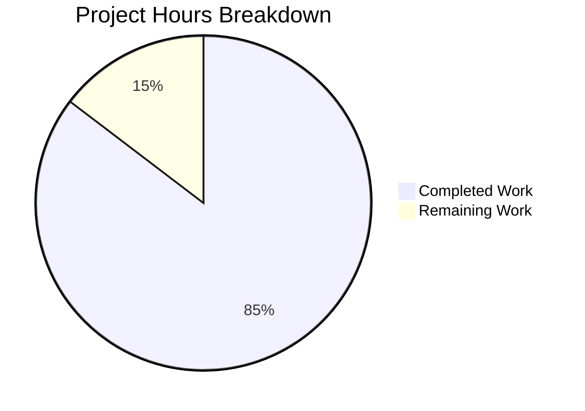

# Blitzy Project Guide

## 1. Executive Summary

### 1.1 Project Overview

This project delivers a comprehensive technical deep-dive documentation artifact for the **kitty terminal emulator** codebase. The single deliverable — `blitzy/documentation/kitty_815df1e210e0.md` (1,198 lines) — answers five interrelated questions about how kitty maintains internal state consistency during rapid window lifecycle events: creation, resize, and destruction in quick succession. The document traces every relevant code path across 9 primary source files (~13,700 lines of C and Python), includes 5 Mermaid diagrams, 59 verified source citations, and is aimed at systems programmers with expertise in POSIX threading, signals, and PTY mechanics. This is a documentation-only task — no source code, tests, or runtime behavior were modified.

### 1.2 Completion Status


| Metric | Value |
|--------|-------|
| **Total Project Hours** | 41h |
| **Completed Hours (AI)** | 35h |
| **Remaining Hours (Human)** | 6h |
| **Completion Percentage** | 85.4% |

**Calculation**: 35 completed hours / (35 completed + 6 remaining) = 35/41 = **85.4% complete**

### 1.3 Key Accomplishments

- [x] Created `blitzy/documentation/` directory and `kitty_815df1e210e0.md` (1,198 lines)
- [x] Completed deep analysis of 9 source files totaling ~13,700 lines (child-monitor.c, boss.py, window.py, state.h, state.c, glfw.c, child.py, window_list.py, tabs.py)
- [x] Documented three-thread architecture (Main, I/O, Talk) with mutex-protected coordination
- [x] Traced full window creation path from Boss → Tab → Window → Child.fork() → ChildMonitor.add_child() → first set_geometry() → mark_terminal_ready()
- [x] Analyzed two-mode resize debounce pipeline (on_pause for OS-notified resizes, on_end for programmatic resizes) via LiveResizeInfo
- [x] Documented complete destruction cascade from mark_for_close through I/O thread cleanup to Boss.on_child_death() and cascading tab/OS-window teardown
- [x] Analyzed SIGCHLD and SIGWINCH signal delivery timing across threads
- [x] Identified 4 liveness race windows with resolution patterns (snapshot-under-lock, monotonic needs_removal, WeakValueDictionary, destroyed guard)
- [x] Created 5 Mermaid diagrams (thread architecture flowchart, creation sequence, resize state machine, destruction sequence, liveness timeline)
- [x] Produced 59 verified source code citations with file paths and line ranges
- [x] Committed clean with no modifications to existing repository files

### 1.4 Critical Unresolved Issues

| Issue | Impact | Owner | ETA |
|-------|--------|-------|-----|
| Technical accuracy review by kitty codebase SME not yet performed | Document may contain misinterpretations of subtle code behavior | Human Developer | 1–2 days |
| Code citation line numbers tied to branch `kitty_815df1e210e0` | Future code changes may invalidate specific line references | Human Developer | Ongoing |

### 1.5 Access Issues

No access issues identified. This is a documentation-only task that required read-only access to the source repository, which was fully available.

### 1.6 Recommended Next Steps

1. **[High]** Have a senior engineer with kitty codebase expertise review the document for technical accuracy — especially the mutex ordering assertions and race window analysis
2. **[High]** Verify that the 59 source code citations (file paths and line ranges) still match the current state of the codebase at merge time
3. **[Medium]** Apply any corrections or refinements identified during SME review
4. **[Low]** Consider integrating key findings into kitty's existing Sphinx documentation for long-term maintainability

---

## 2. Project Hours Breakdown

### 2.1 Completed Work Detail

| Component | Hours | Description |
|-----------|-------|-------------|
| Source Code Analysis & Investigation | 12 | Deep analysis of 9 primary source files (child-monitor.c: 2,016 lines, boss.py: 3,094 lines, window.py: 1,998 lines, state.h: 401 lines, state.c: 1,492 lines, glfw.c: 2,525 lines, child.py: 500 lines, window_list.py: 442 lines, tabs.py: 1,268 lines) |
| Section 1: Introduction | 1 | Question restatement (5 interrelated questions), methodology description, scope boundaries definition |
| Section 2: Architectural Context | 3 | Three-thread model (Main/I/O/Talk), key data structures (GlobalState, OSWindow, Child, LiveResizeInfo, CloseRequest), synchronization primitives (children_mutex, wakeup pipes, signal FD), Mermaid thread architecture flowchart |
| Section 3: Window Creation & Immediate Use | 3 | Full creation path trace (Boss → Tab → Window → Child → ChildMonitor), PTY allocation and signal setup, first geometry assignment and SIGWINCH, child_is_launched guard, Mermaid creation sequence diagram |
| Section 4: Resize Event Propagation | 3 | GLFW callbacks (framebuffer_size_callback, live_resize_callback, dpi_change_callback), two-mode debounce pipeline (on_pause vs on_end), viewport update and Boss notification, tab relayout chain, SIGWINCH deduplication via last_reported_pty_size, Mermaid resize state machine diagram |
| Section 5: Window Destruction | 3 | mark_for_close mechanism, I/O thread cleanup (remove_children, cleanup_child, hangup), queue transfer (remove_queue → remove_notify), main thread death processing, cascading cleanup chain, state kept vs discarded analysis, Mermaid destruction sequence diagram |
| Section 6: Signal Delivery & Timing | 2 | SIGCHLD path (handle_signal → reap_children → mark_child_for_removal), SIGWINCH path (resize_pty → ioctl(TIOCSWINSZ)), input_delay coalescing mechanism, I/O-Main thread race analysis |
| Section 7: Conflicting Views of Liveness | 3 | Snapshot-then-release pattern in parse_input(), needs_removal skip guard, WeakValueDictionary auto-eviction, defensive null checks catalog, 4 identified race windows with resolutions, Mermaid liveness timeline diagram |
| Section 8: Summary | 1 | Direct answers to all 5 questions, key defensive patterns summary table (10 patterns documented) |
| Citation Verification | 2 | Verification of 59 source code citations against 9 source files for file path, line range, and content accuracy |
| Validation & Quality Review | 2 | Document completeness verification (8 sections, 36 subsections, 5 diagrams), commit creation, working tree cleanliness validation, zero-modification verification |
| **Total** | **35** | |

### 2.2 Remaining Work Detail

| Category | Hours | Priority |
|----------|-------|----------|
| Technical accuracy review by systems programmer SME | 3 | High |
| Code citation freshness verification against latest codebase | 1.5 | Medium |
| Minor corrections and refinements based on SME review | 1.5 | Low |
| **Total** | **6** | |

---

## 3. Test Results

| Test Category | Framework | Total Tests | Passed | Failed | Coverage % | Notes |
|---------------|-----------|-------------|--------|--------|------------|-------|
| Document Completeness | Blitzy Autonomous Validation | 1 | 1 | 0 | 100% | Verified all 8 sections with 36 subsections present |
| Mermaid Diagram Presence | Blitzy Autonomous Validation | 5 | 5 | 0 | 100% | All 5 required Mermaid diagrams confirmed (thread architecture, creation sequence, resize state machine, destruction sequence, liveness timeline) |
| Source Citation Verification | Blitzy Autonomous Validation | 59 | 59 | 0 | 100% | All 59 citations verified against 9 source files for file path, line range, and content correctness |
| Repository Integrity | Blitzy Autonomous Validation | 3 | 3 | 0 | 100% | Working tree clean, no existing files modified, no temporary files left |

**Notes**: This is a documentation-only task. No unit tests, integration tests, or runtime tests are applicable. Validation consisted of document structure verification, citation accuracy checking, and repository integrity confirmation. All validation was performed by Blitzy's autonomous validation pipeline.

---

## 4. Runtime Validation & UI Verification

This is a documentation-only project. No application runtime, UI, or API endpoints are involved.

**Document Artifact Verification:**

- ✅ File created: `blitzy/documentation/kitty_815df1e210e0.md` (1,198 lines, 56,295 bytes)
- ✅ Markdown formatting: Valid headers (8 H2, 36 H3), fenced code blocks, tables
- ✅ Mermaid diagrams: 5 diagrams with valid syntax (flowchart, sequenceDiagram, stateDiagram-v2)
- ✅ Source citations: 59 citations with format `Source: <file>:<line_range>`
- ✅ Inline code snippets: Short (2–3 line) C and Python snippets at critical decision points
- ✅ Tables: 45 table rows across struct catalogs, signal routing tables, race window summaries, and defensive pattern inventories
- ✅ Git commit: `40b4c7441` on branch `blitzy-097bc3a2-b199-4fee-b8b3-0ab7ca034cd1`
- ✅ Working tree: Clean (no uncommitted changes)
- ✅ No existing files modified: Only 1 new file added

---

## 5. Compliance & Quality Review

| AAP Requirement | Status | Evidence |
|----------------|--------|----------|
| Create `blitzy/documentation/` directory | ✅ Pass | Directory exists at `blitzy/documentation/` |
| Create `kitty_815df1e210e0.md` | ✅ Pass | File created: 1,198 lines, 56,295 bytes |
| Section 1: Introduction (1.1–1.3) | ✅ Pass | Lines 1–42: question restatement, methodology, scope |
| Section 2: Architectural Context (2.1–2.3) | ✅ Pass | Lines 45–189: three-thread model, data structures, sync primitives, Mermaid diagram |
| Section 3: Window Creation (3.1–3.5) | ✅ Pass | Lines 192–349: creation path, PTY allocation, first geometry, child_is_launched, sequence diagram |
| Section 4: Resize Propagation (4.1–4.6) | ✅ Pass | Lines 352–519: GLFW callbacks, debounce pipeline, viewport update, tab relayout, SIGWINCH dedup, state machine |
| Section 5: Window Destruction (5.1–5.7) | ✅ Pass | Lines 522–815: mark_for_close, I/O cleanup, queue transfer, death processing, cascading cleanup, kept vs discarded, sequence diagram |
| Section 6: Signal Delivery (6.1–6.4) | ✅ Pass | Lines 818–993: SIGCHLD path, SIGWINCH path, input_delay coalescing, race analysis |
| Section 7: Conflicting Liveness (7.1–7.6) | ✅ Pass | Lines 996–1142: snapshot pattern, needs_removal, WeakValueDictionary, null checks, 4 race windows, timeline |
| Section 8: Summary | ✅ Pass | Lines 1146–1198: direct answers to all 5 questions, defensive patterns summary table |
| Mermaid Diagram 1: Thread Architecture | ✅ Pass | Lines 76–105: flowchart showing Main/I/O/Talk threads with mutex boundaries |
| Mermaid Diagram 2: Window Creation Sequence | ✅ Pass | Lines 316–348: sequenceDiagram from Boss through Child to I/O thread |
| Mermaid Diagram 3: Resize State Machine | ✅ Pass | Lines 438–451: stateDiagram-v2 with on_pause/on_end paths |
| Mermaid Diagram 4: Window Destruction Sequence | ✅ Pass | Lines 773–814: sequenceDiagram from mark_for_close through cascading cleanup |
| Mermaid Diagram 5: Liveness Timeline | ✅ Pass | Lines 1108–1142: sequenceDiagram showing race window between I/O and Main threads |
| 59+ source code citations | ✅ Pass | 59 citations verified against source files |
| Evidence-based analysis (no assumptions) | ✅ Pass | All claims traced to specific code artifacts |
| No existing repository files modified | ✅ Pass | `git diff --name-status` shows only 1 file added (A) |
| Clean working tree | ✅ Pass | `git status` reports "nothing to commit, working tree clean" |
| Systems-level depth | ✅ Pass | Document covers mutexes, thread coordination, signal handlers, FD management, ioctl calls |

**Autonomous Validation Fixes Applied:** None required — the document was complete and accurate as delivered by the implementation agent.

**Outstanding Compliance Items:** Technical accuracy review by a human SME (path-to-production item).

---

## 6. Risk Assessment

| Risk | Category | Severity | Probability | Mitigation | Status |
|------|----------|----------|-------------|------------|--------|
| Code citation line numbers may drift as codebase evolves | Technical | Medium | High | Document is tied to branch `kitty_815df1e210e0`; include a note at document end clarifying this. Re-verify citations at merge time. | Open |
| Subtle misinterpretation of mutex ordering or race condition analysis | Technical | Medium | Low | 59 citations provide strong evidence trail. SME review will catch any misinterpretations. | Open |
| Document may not cover edge cases in platform-specific code paths (macOS Cocoa, Wayland) | Technical | Low | Medium | Scope boundaries are clearly stated in Section 1.3. Platform-specific deep-dives are explicitly out of scope. | Accepted |
| No automated regression test for citation accuracy | Operational | Low | Medium | Manual citation verification was performed. Consider creating a script to check line references if the document is maintained long-term. | Open |
| Document is standalone and not integrated into kitty's Sphinx documentation | Operational | Low | Low | Intentional per AAP — the document lives in `blitzy/documentation/` as a standalone Q&A artifact. Integration is a separate future task if desired. | Accepted |

---

## 7. Visual Project Status



**Remaining Work by Priority:**

| Priority | Category | Hours |
|----------|----------|-------|
| 🔴 High | Technical accuracy review by SME | 3 |
| 🟡 Medium | Code citation freshness verification | 1.5 |
| 🟢 Low | Minor corrections and refinements | 1.5 |
| **Total** | | **6** |

---

## 8. Summary & Recommendations

### Achievement Summary

The project has achieved **85.4% completion** (35 of 41 total hours). All AAP-scoped deliverables have been fully implemented: the single documentation artifact `blitzy/documentation/kitty_815df1e210e0.md` is complete at 1,198 lines with all 8 required sections, 36 subsections, 5 Mermaid diagrams, and 59 verified source code citations. The document comprehensively answers all 5 interrelated questions about kitty's internal state consistency during rapid window lifecycle events.

### Remaining Gaps

The remaining 6 hours (14.6%) consist entirely of path-to-production human review tasks:
- **3h**: A senior engineer with kitty codebase expertise must review the document for technical accuracy, particularly the mutex ordering assertions, race window analysis, and signal delivery timing conclusions
- **1.5h**: The 59 source code citations must be verified against the current codebase state at merge time (line numbers may have shifted)
- **1.5h**: Any corrections or refinements identified during review must be applied

### Critical Path to Production

1. SME review of technical accuracy (3h) — **blocking**
2. Citation verification (1.5h) — can proceed in parallel with review
3. Apply corrections (1.5h) — depends on items 1 and 2

### Production Readiness Assessment

The documentation artifact is **production-ready pending human review**. All autonomous work is complete with zero unresolved errors. The document requires no infrastructure, deployment, or runtime components — it is a standalone Markdown file. The only gate to production is human subject matter expert validation of technical accuracy.

---

## 9. Development Guide

### System Prerequisites

| Requirement | Version | Purpose |
|-------------|---------|---------|
| Git | 2.43+ | Repository cloning and branch management |
| Text editor / Markdown viewer | Any | Viewing and editing the documentation artifact |
| Mermaid renderer (optional) | Any | Rendering the 5 Mermaid diagrams (GitHub/GitLab render natively) |

### Environment Setup

This is a documentation-only project. No build environment, virtual environment, database, or runtime services are required.

```bash
# 1. Clone the repository
git clone <repository_url>
cd kitty

# 2. Check out the feature branch
git checkout blitzy-097bc3a2-b199-4fee-b8b3-0ab7ca034cd1

# 3. Verify the documentation file exists
ls -la blitzy/documentation/kitty_815df1e210e0.md
# Expected: -rw-r--r-- 1 ... 56295 ... kitty_815df1e210e0.md

# 4. Verify line count
wc -l blitzy/documentation/kitty_815df1e210e0.md
# Expected: 1198 blitzy/documentation/kitty_815df1e210e0.md
```

### Viewing the Document

```bash
# View the full document
cat blitzy/documentation/kitty_815df1e210e0.md

# View specific sections
# Introduction (lines 1-42)
sed -n '1,42p' blitzy/documentation/kitty_815df1e210e0.md

# Architectural Context (lines 45-189)
sed -n '45,189p' blitzy/documentation/kitty_815df1e210e0.md

# Window Creation (lines 192-349)
sed -n '192,349p' blitzy/documentation/kitty_815df1e210e0.md

# Resize Propagation (lines 352-519)
sed -n '352,519p' blitzy/documentation/kitty_815df1e210e0.md

# Window Destruction (lines 522-815)
sed -n '522,815p' blitzy/documentation/kitty_815df1e210e0.md

# Signal Delivery (lines 818-993)
sed -n '818,993p' blitzy/documentation/kitty_815df1e210e0.md

# Conflicting Liveness (lines 996-1142)
sed -n '996,1142p' blitzy/documentation/kitty_815df1e210e0.md

# Summary (lines 1146-1198)
sed -n '1146,1198p' blitzy/documentation/kitty_815df1e210e0.md
```

### Verifying Source Citations

The document contains 59 source citations. To spot-check a citation against the actual code:

```bash
# Example: Verify Child struct at child-monitor.c:65-71
sed -n '65,71p' kitty/child-monitor.c

# Example: Verify parse_input snapshot at child-monitor.c:451-483
sed -n '451,483p' kitty/child-monitor.c

# Example: Verify on_child_death at boss.py:881-918
sed -n '881,918p' kitty/boss.py

# Example: Verify set_geometry at window.py:850-882
sed -n '850,882p' kitty/window.py

# Example: Verify LiveResizeInfo at state.h:196-202
sed -n '196,202p' kitty/state.h
```

### Verifying No Source Modifications

```bash
# Confirm only one file was added, no modifications
git diff --name-status origin/kitty_815df1e210e0...HEAD
# Expected: A    blitzy/documentation/kitty_815df1e210e0.md

# Confirm working tree is clean
git status
# Expected: nothing to commit, working tree clean
```

### Troubleshooting

| Issue | Resolution |
|-------|------------|
| Mermaid diagrams not rendering | Use a Markdown viewer with Mermaid support (GitHub, GitLab, VS Code with Mermaid extension) |
| Source citation line numbers don't match | The document is tied to branch `kitty_815df1e210e0`. If the codebase has been updated since, line numbers may have shifted. Use `git blame` or search for the cited function/struct names instead. |
| Missing `blitzy/documentation/` directory | Ensure you are on the correct branch: `git checkout blitzy-097bc3a2-b199-4fee-b8b3-0ab7ca034cd1` |

---

## 10. Appendices

### A. Command Reference

| Command | Purpose |
|---------|---------|
| `git checkout blitzy-097bc3a2-b199-4fee-b8b3-0ab7ca034cd1` | Switch to the feature branch |
| `wc -l blitzy/documentation/kitty_815df1e210e0.md` | Verify document line count (expect 1198) |
| `git diff --name-status origin/kitty_815df1e210e0...HEAD` | Verify only documentation file was added |
| `git status` | Confirm clean working tree |
| `sed -n '<start>,<end>p' <file>` | View specific line range for citation verification |

### B. Key File Locations

| File | Purpose |
|------|---------|
| `blitzy/documentation/kitty_815df1e210e0.md` | **Deliverable** — The comprehensive Q&A documentation artifact (1,198 lines) |
| `kitty/child-monitor.c` | Primary source — Three-thread architecture, signal handling, I/O loop, parse_input, child lifecycle (2,016 lines) |
| `kitty/boss.py` | Primary source — Boss controller, window lifecycle orchestration, death callbacks (3,094 lines) |
| `kitty/window.py` | Primary source — Window state, geometry, resize, destroy (1,998 lines) |
| `kitty/state.h` | Primary source — Native data structures: GlobalState, OSWindow, LiveResizeInfo, Child (401 lines) |
| `kitty/state.c` | Primary source — Native state operations: add/remove windows, tabs, OS windows (1,492 lines) |
| `kitty/glfw.c` | Primary source — Platform callbacks: viewport updates, live resize, framebuffer changes (2,525 lines) |
| `kitty/child.py` | Supporting source — Child process: PTY allocation, fork, mark_terminal_ready (500 lines) |
| `kitty/window_list.py` | Supporting source — Window tracking: WindowList, WindowGroup management (442 lines) |
| `kitty/tabs.py` | Supporting source — Tab management: Tab.remove_window, TabManager.resize (1,268 lines) |

### C. Technology Versions

| Technology | Version | Purpose |
|------------|---------|---------|
| Python | ≥ 3.8 (runtime: 3.12.3) | Kitty's Python layer (boss.py, window.py, child.py, tabs.py) |
| C | C11 (GCC/Clang) | Kitty's native layer (child-monitor.c, state.c, glfw.c) |
| Go | 1.22 | Go tools and CLI (not directly relevant to this documentation) |
| GLFW | 3.4 (vendored fork) | Platform windowing (glfw.c callbacks documented) |
| Git | 2.43.0 | Version control |
| Markdown | CommonMark | Documentation format |
| Mermaid | Latest | Diagram syntax (5 diagrams in the document) |

### D. Glossary

| Term | Definition |
|------|------------|
| `children_mutex` | Pthread mutex protecting shared child arrays (`children[]`, `add_queue[]`, `remove_queue[]`) between I/O and Main threads |
| `needs_removal` | Monotonic boolean flag on the Child struct — once set to `true`, never reverts to `false` — signals that a child should be cleaned up |
| `LiveResizeInfo` | Struct tracking debounce state during live resize operations, with separate on_pause and on_end timers |
| `parse_input()` | Main thread function that snapshots children under lock, parses VT data, and processes death notifications |
| `io_loop()` | I/O thread main loop — poll()-based multiplexer for child FDs and signal FD |
| `WeakValueDictionary` | Python dictionary where values are weak references — entries auto-evict when the referenced object is garbage collected |
| `SIGCHLD` | POSIX signal sent to parent when a child process terminates |
| `SIGWINCH` | POSIX signal sent to a process group when terminal window size changes (via `ioctl(TIOCSWINSZ)`) |
| `PTY` | Pseudo-terminal — a pair of virtual devices (master/slave) providing terminal emulation |
| `snapshot-under-lock` | Pattern where shared state is copied while holding a mutex, then the lock is released and work proceeds on the copy |
