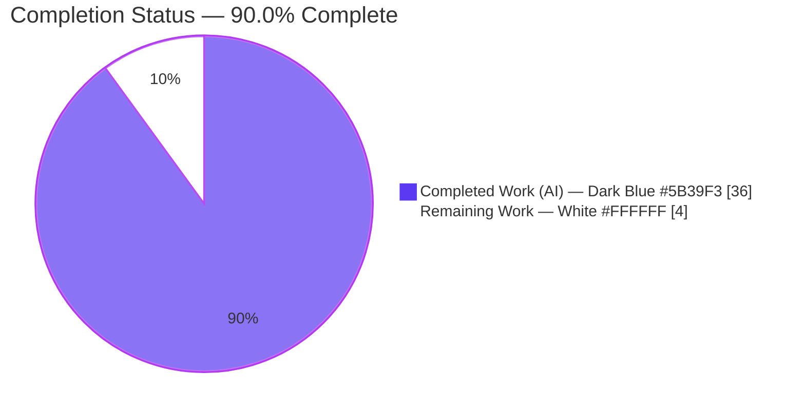
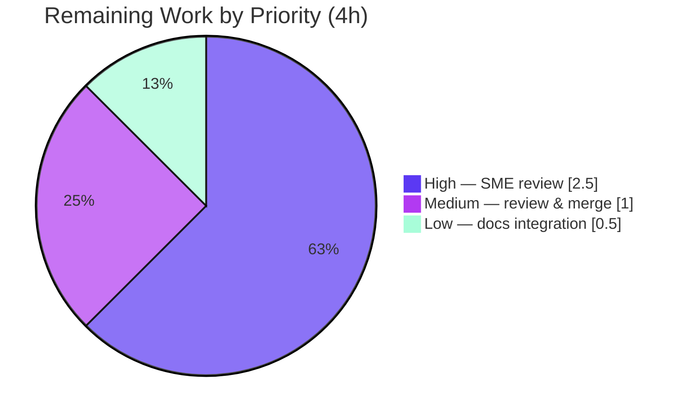

# Blitzy Project Guide — Kitty SSH-Kitten Secure-Session & Connection-Sharing Trace

> **Branch:** `blitzy-adab6dcf-8b0d-4817-80e8-40c6593c9cbb` · **Base:** `815df1e21` · **HEAD:** `6925909a3`
> **Deliverable:** `blitzy/documentation/kitty_815df1e210e0.md` (762 lines / 66,596 bytes)
> **Task type:** Documentation-only, read-only investigation (`SWE-AtlasQnA-Repo`)
>
> **Blitzy Brand Palette** — Completed / AI Work: **Dark Blue `#5B39F3`** · Remaining / Not Completed: **White `#FFFFFF`** · Headings / Accents: **Violet-Black `#B23AF2`** · Highlight: **Mint `#A8FDD9`**

---

## 1. Executive Summary

### 1.1 Project Overview

This project delivers a single, evidence-backed onboarding document for the **Kitty terminal** codebase (`kovidgoyal/kitty` at HEAD `815df1e210e0`). The document traces, end-to-end, how Kitty's **SSH kitten** sets up a secure remote session and shares/reuses SSH connections — from a user running `kitty +kitten ssh host` locally to the bootstrap script executing on the remote host. It answers nine decomposed sub-questions (shared-memory credentials, bootstrap generation, archive transport, connection bookkeeping, `ControlMaster` reuse, per-shell encoding, the full trace, shm security, and the DCS tty protocol). Target users are engineers onboarding into the SSH-kitten pipeline. The scope is an **isolated, additive, read-only** artifact: exactly one new Markdown file, with every runtime claim backed by reproduced verbatim output.

### 1.2 Completion Status



| Metric | Hours | Notes |
|--------|------:|-------|
| **Total Hours** | **40.0** | AAP-scoped deliverable + path-to-production |
| **Completed Hours (AI + Manual)** | **36.0** | 36.0 AI (autonomous) + 0.0 manual |
| **Remaining Hours** | **4.0** | Human-only path-to-production (review + merge) |
| **Percent Complete** | **90.0%** | 36 / (36 + 4) = 90.0% |

> **Completion formula (PA1, AAP-scoped):** `Completed 36h / (Completed 36h + Remaining 4h) = 36/40 = 90.0%`. The entire authored, self-validated document is complete; the reserved 10% is the mandatory human review/merge gate that constitutes path-to-production for a documentation artifact.

### 1.3 Key Accomplishments

- ✅ **Single deliverable created** at the mandated path `blitzy/documentation/kitty_815df1e210e0.md` (762 lines / 66,596 bytes).
- ✅ **All nine sub-questions (Q1–Q9) answered** with a Mechanism → Code-trace → Observed-evidence → Rationale structure each.
- ✅ **Run-first methodology honored** — the project was built (`setup.py build`) and code paths exercised, capturing verbatim output as evidence blocks **EV0–EV8** before writing.
- ✅ **One-claim-one-evidence discipline** — each behavioral claim is paired with the exact command and its verbatim output.
- ✅ **Exhaustive coverage pass** — a 66-row table maps every named mechanism, flag, file, and every shell (**sh / bash / zsh / fish**) plus the **Python** path to its `file:line` and evidence.
- ✅ **Citation accuracy** — 431 `file:line` endpoints across 21 files, all verified in-bounds; key literals content-verified against source.
- ✅ **Substantive correctness improvement** — identified that the SSH-session data responder is the kitty terminal's **Python `get_ssh_data`** (`kittens/ssh/utils.py:115`), not the Go `read_data_from_shared_memory` (which serves `clone_env`).
- ✅ **Strict read-only scope preserved** — zero source files modified; temporary observation harness removed; `git status --porcelain` empty.
- ✅ **Validation reproduced independently** — `go build`/`go vet` clean; **8/8 tests pass (100%)**; EV3/EV6/EV7/EV8 re-reproduced (stable literals exact; dynamic values vary as documented).

### 1.4 Critical Unresolved Issues

| Issue | Impact | Owner | ETA |
|-------|--------|-------|-----|
| _None (no release-blocking defects)_ | The deliverable is complete, validated, and internally consistent. The only open items are the expected human review gate (see §1.6 / §2.2), not defects. | — | — |

> There are **no critical unresolved issues**. The document compiles/renders as Markdown, all evidence reproduces, all citations are in-bounds, and read-only scope is intact.

### 1.5 Access Issues

| System / Resource | Type of Access | Issue Description | Resolution Status | Owner |
|-------------------|----------------|-------------------|-------------------|-------|
| Git repository | Write (commit) | None — 4 commits landed; working tree clean | ✅ No issue | — |
| Build toolchain (Go 1.22, Python, C libs) | Local execution | None — Go 1.22.12 + Python 3.13.7 present; `setup.py build` exits 0 | ✅ No issue | — |
| Third-party services / credentials | N/A | None required — read-only documentation deliverable; no live SSH server, API keys, or external services needed | ✅ Not applicable | — |

> **No access issues identified.** A read-only documentation task requires no runtime credentials, and all repository and toolchain access was confirmed.

### 1.6 Recommended Next Steps

1. **[High]** Have a Kitty/SSH-kitten **SME review the document for technical accuracy**, with special attention to the `get_ssh_data` (Python) vs Go `read_data_from_shared_memory` responder distinction. Re-run the documented EV0–EV8 commands to confirm evidence still holds. _(≈2.5 h)_
2. **[Medium]** Perform a **documentation peer review & approve/merge** the PR after confirming read-only scope via `git diff 815df1e21 --stat`. _(≈1.0 h)_
3. **[Low]** Optionally **cross-link** the internal trace from user-facing `docs/kittens/ssh.rst` (or an onboarding index) and add a lightweight Markdown/citation-lint CI check to guard against future drift. _(≈0.5 h)_

---

## 2. Project Hours Breakdown

### 2.1 Completed Work Detail

All completed work was performed autonomously by Blitzy agents and independently re-validated. Each component traces to specific AAP requirements.

| Component | Hours | Description |
|-----------|------:|-------------|
| Environment build & toolchain setup | 2.5 | Discovered & satisfied the codegen prerequisite (EV0): `python3 setup.py build` generates `constants_generated.go` (incl. `SSHControlMasterTemplate`) + embedded `data_generated.bin`; validated Go 1.22 / Python toolchain. [AAP R11] |
| Multi-language source investigation & tracing | 9.0 | Traced the pipeline across **3 runtime actors** and ~21 files: Go driver (`main.go` 897 lines, `config.go`, `utils.go`, `askpass.go`), kitty-terminal Python (`utils.py` `get_ssh_data`), remote scripts (`bootstrap.sh`/`.py`/`-utils.sh`), shm primitives (`tools/utils/shm/*`), and build codegen (`gen/go_code.py`, `setup.py`). [AAP R2–R10] |
| Run-first evidence harness & capture (EV0–EV8) | 5.0 | Reproduced bare-build failure (EV0), test suite (EV1), generated constants (EV2), and authored an in-package observation harness for `connection_sharing_args`, shm write/read, tarball, per-shell encoding, and the DCS frame (EV3–EV8); captured verbatim output. [AAP R11–R13] |
| Document authoring (762 lines / 66 KB) | 11.0 | Wrote the critical-context 3-actor preamble, Q1–Q9 sections (Mechanism / Code-trace / Observed-evidence / Rationale), cross-file local↔remote contracts, the 66-row coverage-pass table, and the "framing vs. observed" honesty section. [AAP R1–R10, R14] |
| Correctness corrections & QA cycles (4 commits) | 5.0 | Substantive responder-flow + security-semantics correction (`f0a68c1c9`), QA findings F1 evidence-adjacency + F2 Markdown-pipe (`380e43b44`), and the EV9 dangling-reference fix (`6925909a3`). [AAP R2, R12–R15] |
| Final validation & citation audit | 3.5 | Reproduced all EV evidence, audited 431 citation endpoints in-bounds, confirmed 8/8 tests pass, verified read-only scope and git hygiene. [AAP R15, R16] |
| **Total Completed** | **36.0** | **Matches Completed Hours in §1.2** |

### 2.2 Remaining Work Detail

All remaining work is **path-to-production, human-only** activity for a documentation deliverable. Each traces to an AAP path-to-production need.

| Category | Hours | Priority |
|----------|------:|----------|
| SME technical accuracy review (domain-expert read + spot-check vs source at HEAD; re-run EV0–EV8) | 2.5 | High |
| Documentation peer review & merge approval (PR sign-off; confirm read-only scope) | 1.0 | Medium |
| Optional onboarding-index integration & drift guard (cross-link from `docs/kittens/ssh.rst`; Markdown/citation-lint CI) | 0.5 | Low |
| **Total Remaining** | **4.0** | **Matches Remaining Hours in §1.2 and §7 pie** |

### 2.3 Hours Reconciliation & Methodology

| Check | Expected | Actual | Status |
|-------|---------:|-------:|:------:|
| §2.1 Completed sum | 36.0 | 36.0 | ✅ |
| §2.2 Remaining sum | 4.0 | 4.0 | ✅ |
| §2.1 + §2.2 = Total (§1.2) | 40.0 | 40.0 | ✅ |
| §1.2 = §2.2 = §7 remaining | 4.0 | 4.0 | ✅ |
| Completion % (36 / 40) | 90.0% | 90.0% | ✅ |

> **Methodology (PA1/PA2):** The AAP-scoped work universe is (a) the authored, evidence-backed document covering Q1–Q9 with run-first evidence and a coverage pass, and (b) the standard path-to-production for a documentation artifact — human SME review and merge. There is no application, service, or CI/CD to build or deploy, so remaining hours are modest and consist solely of the human review gate.

---

## 3. Test Results

All tests below originate from **Blitzy's autonomous validation logs** and were **independently reproduced** during this assessment (`go test -v -count=1`, Go 1.22.12).

| Test Category | Framework | Total Tests | Passed | Failed | Coverage % | Notes |
|---------------|-----------|------------:|-------:|-------:|-----------:|-------|
| Unit — SSH kitten (`kittens/ssh`) | Go `testing` | 7 | 7 | 0 | Path-level (no % gate) | `TestSSHConfigParsing`, `TestCloneEnv`, `TestSSHBootstrapScriptLimit`, `TestSSHTarfile`, `TestGetSSHOptions`, `TestParseSSHArgs`, `TestRelevantKittyOpts` |
| Unit — Shared memory (`tools/utils/shm`) | Go `testing` | 1 | 1 | 0 | Path-level (no % gate) | `TestSHM` (exercises the `0600` / read-once shm primitives) |
| **Totals** | — | **8** | **8** | **0** | **100% pass** | 0 skipped, 0 blocked |

**Verbatim reproduction (this assessment):**

```
ok  	kitty/kittens/ssh	0.273s      (7/7 PASS)
ok  	kitty/tools/utils/shm	0.005s  (1/1 PASS)
```

> **Integrity note:** These are the SSH-kitten and shm unit suites that exercise the exact functions traced by the document (`make_tarfile`, `bootstrap_script`, `wrap_bootstrap_script`, the shm write/read path, and SSH-arg parsing). No new tests were committed (read-only scope); the suites are run only to observe behavior and ground the evidence.

---

## 4. Runtime Validation & UI Verification

**Runtime health** (build + execution of the traced code paths):

- ✅ **Operational** — `python3 setup.py build --ignore-compiler-warnings` → **exit 0** (generates the Go `kitty` constants package and `data_generated.bin`).
- ✅ **Operational** — `go build ./kittens/ssh/` and `go build ./tools/utils/shm/` → **exit 0**.
- ✅ **Operational** — `go vet ./kittens/ssh/` and `go vet ./tools/utils/shm/` → **exit 0** (clean).
- ✅ **Operational** — `./kitty/launcher/kitten --version` → `kitten 0.35.2 created by Kovid Goyal`.

**Evidence-path validation** (run-first observations reproduced this assessment):

- ✅ **Operational** — EV3 `connection_sharing_args(424242)` → `-o ControlMaster=auto -o ControlPath=…/kssh-424242-%C -o ControlPersist=yes -o ServerAliveInterval=60 -o ServerAliveCountMax=5 -o TCPKeepAlive=no` (exact match).
- ✅ **Operational** — EV6 shm object: `mode=0600` (`-rw-------`), read #1 ok, read #2 fails after unlink (read-once confirmed).
- ✅ **Operational** — EV7 tarball: **15 entries** (per-entry sizes/modes stable; gzip total varies per run as documented).
- ✅ **Operational** — EV8 DCS frame `\x1bP@kitty-ssh|<base64>\x1b\\` base64-decodes to `id=testing:pwfile=/kssh-123-abc:pw=deadbeefcafe` (exact).

**UI verification:**

- ➖ **Not applicable** — this is a documentation-only deliverable with **no user interface**. There are no screens, components, or front-end flows to verify; UI verification is out of scope for a Markdown artifact.

---

## 5. Compliance & Quality Review

Cross-mapping the AAP deliverables and binding `SWE-AtlasQnA-Repo` rules to Blitzy's quality benchmarks.

| Benchmark / Rule | Requirement | Status | Evidence / Notes |
|------------------|-------------|:------:|------------------|
| Single deliverable at fixed path | `blitzy/documentation/kitty_815df1e210e0.md` | ✅ Pass | File exists, 762 lines; `git diff` shows only this file |
| Answer all Q1–Q9 | Each sub-question addressed by name | ✅ Pass | 9 `## Q…` sections present |
| Run-first investigation | Build & run code paths, capture output before writing | ✅ Pass | EV0–EV8 blocks with commands + verbatim output |
| Verbatim evidence quoting | Paste actual output + the command that produced it | ✅ Pass | Every EV block shows command and output |
| One-claim-one-evidence | No batching / paraphrasing of runtime claims | ✅ Pass | Per-claim `EVn>>>` lines adjacent to claims (F1 fix) |
| Exhaustive coverage pass | Every named item + every shell (sh/bash/zsh/fish) + Python | ✅ Pass | 66-row coverage table; all shells + Python path named |
| Exact-literal citations | `file:line` references; no paraphrased values | ✅ Pass | 431 endpoints in-bounds; key literals content-verified |
| Read-only scope | No source edits; temp scripts removed; tree unchanged | ✅ Pass | `git status --porcelain` empty; 0 source files changed |
| Internal consistency | No dangling references | ✅ Pass | EV9 dangling refs fixed (`6925909a3`); only EV0–EV8 exist |
| Compiles & tests pass | Toolchain green | ✅ Pass | build/vet exit 0; 8/8 tests pass |
| Honesty / framing labeled | Distinguish observed vs external framing | ✅ Pass | "What is framing vs. observed" section present |

**Fixes applied during autonomous validation:** responder-flow & security-semantics correction (`f0a68c1c9`); evidence-adjacency (F1) and Markdown-pipe (F2) fixes (`380e43b44`); EV9 dangling-reference repair (`6925909a3`).

**Outstanding compliance items:** None. All binding rules are satisfied; the only remaining activity is the human review gate (§1.6).

---

## 6. Risk Assessment

| Risk | Category | Severity | Probability | Mitigation | Status |
|------|----------|:--------:|:-----------:|------------|:------:|
| Documentation drift — citations pinned to HEAD `815df1e21`; SSH-kitten code changes could stale `file:line` refs/evidence | Technical | Medium | Medium | Doc pins the exact commit hash and includes full reproduction commands; re-validate on code change | Mitigated |
| Dynamic-value evidence — pid, shm suffix, byte counts, gzip size vary per run | Technical | Low | High | Doc explicitly labels which values are dynamic vs stable literals | Resolved |
| Build-toolchain dependency — reproduction needs Go 1.22 + Python + native C libs + `setup.py build` | Technical | Low | Medium | Prerequisite and exact commands documented (EV0); Docker image supplies toolchain | Mitigated |
| No new attack surface — read-only doc ships no code/credentials; EV8 uses fake password `deadbeefcafe` | Security | Informational | Low | N/A — nothing deployed; no secrets committed | N/A |
| No CI lint/link-check for the Markdown — future edits could silently regress citations | Operational | Low | Low | Optional Markdown/citation-lint CI check (see §1.6 step 3) | Open (low) |
| Discoverability — doc lives in `blitzy/documentation/`, separate from the Sphinx `docs/` tree | Integration | Low | Medium | Optional cross-link from `docs/kittens/ssh.rst` / onboarding index | Open (optional) |
| SME sign-off pending — doc improves on initial framing (`get_ssh_data` vs Go func); self-validated but awaits domain-expert confirmation | Integration | Low | Low | High-priority SME review (§1.6 step 1) | Open (pending review) |

> **Overall risk posture: LOW.** As a read-only documentation deliverable, there is no runtime service, deployment, or credential surface. The most material risk is future citation drift, already mitigated by commit-pinning and documented reproduction steps.

---

## 7. Visual Project Status

**Project hours breakdown** (Completed = Dark Blue `#5B39F3`, Remaining = White `#FFFFFF`):


**Remaining hours by priority** (sums to the 4.0 h in §1.2 and §2.2):



> **Integrity:** "Remaining Work" = **4 h** in the pie chart, equal to §1.2 Remaining Hours and the §2.2 "Hours" column total. "Completed Work" = **36 h**, equal to §1.2 Completed Hours and the §2.1 total.

---

## 8. Summary & Recommendations

**Achievements.** The project delivers a complete, professional, evidence-backed onboarding trace of Kitty's SSH-kitten secure-session and connection-sharing pipeline in a single Markdown file. It answers all nine sub-questions, honors the run-first methodology (EV0–EV8 with verbatim output), enforces one-claim-one-evidence, and closes with a 66-row coverage pass over every named mechanism and every shell (sh/bash/zsh/fish) plus the Python path. It even corrects the initial framing by identifying the true SSH-session data responder (`get_ssh_data` in `kittens/ssh/utils.py`). Read-only scope is perfectly preserved: **zero source files changed**, temporary scripts removed, `git status --porcelain` empty.

**Remaining gaps.** None in the artifact itself. The outstanding **4 hours** are exclusively **human path-to-production activities**: SME technical-accuracy review, documentation peer review & merge, and optional docs-site integration. These cannot be performed autonomously.

**Critical path to production.** SME accuracy review (High) → peer review & merge (Medium) → optional onboarding-index integration (Low).

**Production-readiness assessment.** The deliverable is **90.0% complete** and **ready for human review**. Because it is a read-only documentation artifact (no code shipped, no service deployed), production readiness reduces to editorial sign-off and merge. Build is green, 8/8 tests pass, all evidence reproduces, and all citations are in-bounds — the document is technically sound and internally consistent.

| Success Metric | Target | Result |
|----------------|--------|--------|
| Sub-questions answered | 9 / 9 | ✅ 9 / 9 |
| Shells covered | sh, bash, zsh, fish (+ Python) | ✅ All 5 |
| Tests passing | 100% | ✅ 8 / 8 (100%) |
| Source files modified | 0 (read-only) | ✅ 0 |
| Citation endpoints in-bounds | 100% | ✅ 431 / 431 |
| Completion | High, < 100% | ✅ 90.0% |

---

## 9. Development Guide

All commands below were tested in the assessment environment (Ubuntu, Go 1.22.12, Python 3.13.7). Run from the repository root.

### 9.1 System Prerequisites

- **OS:** Linux (x86-64). Assessment host: Ubuntu.
- **Go:** `1.22.x` (declared `go 1.22` in `go.mod:3`; validated `go1.22.12 linux/amd64`).
- **Python:** `>= 3.8` (validated `3.13.7`).
- **Native C libraries** (to build the full Kitty binary, per `docs/build.rst`): `harfbuzz` (`>= 2.2.0`), `libpng`, `openssl`, `freetype`, `fontconfig`.
- **git** (with the repository checked out at branch `blitzy-adab6dcf-8b0d-4817-80e8-40c6593c9cbb`).

### 9.2 Environment Setup

```bash
# Put the Go toolchain on PATH (GOROOT=/usr/local/go)
source /etc/profile.d/go.sh
go version      # -> go version go1.22.12 linux/amd64
python3 --version   # -> Python 3.13.7
```

### 9.3 Build (mandatory prerequisite)

The Go SSH kitten **cannot build from a bare checkout** — it needs two build-time-generated, git-ignored artifacts. Generate them first:

```bash
# Generates constants_generated.go (incl. SSHControlMasterTemplate) + tools/tui/shell_integration/data_generated.bin
python3 setup.py build --ignore-compiler-warnings
echo "exit=$?"    # -> exit=0
```

### 9.4 Verify the Build

```bash
go build ./kittens/ssh/        ; echo "exit=$?"   # -> exit=0
go vet   ./kittens/ssh/        ; echo "exit=$?"   # -> exit=0
go build ./tools/utils/shm/    ; echo "exit=$?"   # -> exit=0
./kitty/launcher/kitten --version                  # -> kitten 0.35.2 created by Kovid Goyal
```

### 9.5 Run the Tests

```bash
go test -v -count=1 ./kittens/ssh/        # -> 7/7 PASS, ok  kitty/kittens/ssh
go test -v -count=1 ./tools/utils/shm/    # -> 1/1 PASS, ok  kitty/tools/utils/shm
```

### 9.6 Reproduce the Evidence (EV0–EV8)

The full procedure is documented **inside the deliverable** under "How to reproduce the evidence." In brief:

```bash
# EV0 — prove the bare-checkout build failure (read-only, in a throwaway dir OUTSIDE the repo)
mkdir -p /tmp/blitzy_bare_checkout
git archive HEAD | tar -x -C /tmp/blitzy_bare_checkout
( cd /tmp/blitzy_bare_checkout && go build ./kittens/ssh/ ; echo "exit=$?" )   # -> exit=1 (missing generated files)

# EV3–EV8 — recreate the in-package observation harness, run, then REMOVE it (keeps repo unchanged)
#   create kittens/ssh/blitzy_adhoc_test_observe_test.go (source in the deliverable), then:
go test -run TestBlitzyObserveEV -v -count=1 ./kittens/ssh/
rm kittens/ssh/blitzy_adhoc_test_observe_test.go
```

### 9.7 View the Deliverable & Verify Read-Only Scope

```bash
less blitzy/documentation/kitty_815df1e210e0.md      # 762 lines / 66 KB
git status --porcelain                                # -> (empty) = clean
git diff 815df1e21 --stat                             # -> 1 file changed, 762 insertions(+)
```

### 9.8 Troubleshooting

- **`package kitty is not in std` / `pattern data_generated.bin: no matching files found`** → the generated files are missing; run `python3 setup.py build --ignore-compiler-warnings` first (this is exactly the EV0 failure).
- **`go: command not found`** → run `source /etc/profile.d/go.sh`.
- **`error: externally-managed-environment` (pip, Ubuntu 25 / PEP 668)** → not needed for this task; if installing Python packages, use a venv or `pip install --break-system-packages`. `setup.py build` uses the system Python directly.
- **Different EV numbers on re-run** → expected; pid, shm suffix, byte counts, and gzip size are **dynamic** (documented). Stable literals (mode `0600`, entry names, control-master directives, DCS frame) do not change.

### 9.9 Example Usage (the traced command)

The document traces the user action `kitty +kitten ssh <host>`. A live SSH server is **not** required to observe the mechanisms — the code paths (`make_tarfile`, `bootstrap_script`, `wrap_bootstrap_script`, shm write/read, per-shell encoding, `connection_sharing_args`) are exercised in-process via the Go test package, which is what EV1–EV8 do.

---

## 10. Appendices

### Appendix A — Command Reference

| Purpose | Command |
|---------|---------|
| Set up Go on PATH | `source /etc/profile.d/go.sh` |
| Build prerequisite (codegen) | `python3 setup.py build --ignore-compiler-warnings` |
| Build kitten package | `go build ./kittens/ssh/` |
| Static analysis | `go vet ./kittens/ssh/` |
| Run SSH-kitten tests | `go test -v -count=1 ./kittens/ssh/` |
| Run shm tests | `go test -v -count=1 ./tools/utils/shm/` |
| Launcher version | `./kitty/launcher/kitten --version` |
| View deliverable | `less blitzy/documentation/kitty_815df1e210e0.md` |
| Verify read-only scope | `git status --porcelain` · `git diff 815df1e21 --stat` |
| List agent commits | `git log 815df1e21..HEAD --oneline` |

### Appendix B — Port Reference

| Port | Service | Notes |
|------|---------|-------|
| — | None | Documentation-only deliverable; no service is started and no ports are opened. |

### Appendix C — Key File Locations

| Path | Role |
|------|------|
| `blitzy/documentation/kitty_815df1e210e0.md` | **The deliverable** (the only changed file) |
| `kittens/ssh/main.go` | Local Go driver (`run_ssh`, `make_tarfile`, `bootstrap_script`, `wrap_bootstrap_script`, `connection_sharing_args`) — REFERENCE |
| `kittens/ssh/utils.py` | Kitty-terminal Python SSH runtime (`get_ssh_data`, `read_data_from_shared_memory`) — REFERENCE |
| `kittens/ssh/config.go`, `utils.go`, `askpass.go` | Host options, SSH-arg parsing, askpass — REFERENCE |
| `shell-integration/ssh/bootstrap.sh` / `.py` / `-utils.sh` | Remote-side bootstrap & staging — REFERENCE |
| `tools/utils/shm/*.go` | POSIX shm primitives (`0600`, `O_EXCL`, read-once) — REFERENCE |
| `gen/go_code.py`, `setup.py` | Build-time codegen prerequisite — REFERENCE |
| `constants_generated.go`, `tools/tui/shell_integration/data_generated.bin` | Generated at build (git-ignored) |

### Appendix D — Technology Versions

| Component | Version |
|-----------|---------|
| Go | `go1.22.12 linux/amd64` (declared `go 1.22` in `go.mod`) |
| Python | `3.13.7` (project requires `>= 3.8`) |
| Kitty / kitten | `0.35.2` (`VersionString` in `constants_generated.go`) |
| Default term | `xterm-kitty` (`DefaultTermName`) |
| SSH control-master template | `kssh-{kitty_pid}-{ssh_placeholder}` (`SSHControlMasterTemplate`) |

### Appendix E — Environment Variable Reference

| Variable | Where used | Meaning |
|----------|-----------|---------|
| `GOROOT` | Build/test | Set to `/usr/local/go` by `source /etc/profile.d/go.sh` |
| `REQUEST_ID` | Bootstrap placeholder | Correlates the local request with the remote reply |
| `PASSWORD_FILENAME` | Bootstrap placeholder | Name of the POSIX shm object holding the payload |
| `DATA_PASSWORD` | Bootstrap placeholder | One-time password gating the payload read |
| `REQUEST_DATA` / `ECHO_ON` | Bootstrap placeholders | Toggle tty data request / echo (`"1"`/`"0"`) |
| `ZDOTDIR` | Remote zsh integration | Points zsh at the staged integration dir |
| `KITTY_FISH_XDG_DATA_DIR` | Remote fish integration | Fish integration data dir |
| `KITTY_BASH_INJECT` / `ENV` | Remote bash / sh integration | Injects bash/sh shell integration |

### Appendix F — Developer Tools Guide

- **`go test`** — exercises the SSH-kitten and shm code paths (`-count=1` disables caching; `-run <regexp>` targets specific tests; the temporary `TestBlitzyObserveEV*` harness captures EV3–EV8 and must be removed afterward).
- **`go vet`** — static analysis; run read-only, never with fixers.
- **`git archive HEAD | tar -x -C <dir>`** — exports the committed tree (without git-ignored generated files) to reproduce the EV0 bare-build failure safely, outside the working tree.
- **`git diff 815df1e21 --stat` / `git status --porcelain`** — confirm read-only scope (only the deliverable changed; tree clean).

### Appendix G — Glossary

| Term | Definition |
|------|------------|
| **SSH kitten** | Kitty's built-in `ssh` helper that sets up shell integration on the remote host |
| **DCS** | Device Control String — a private terminal escape sequence (`\x1bP@kitty-…\x1b\\`) used for the tty request/response protocol |
| **ControlMaster / ControlPath / ControlPersist** | OpenSSH connection-multiplexing options that let sessions share/reuse one master connection |
| **shm (shared memory)** | POSIX shared-memory object (`/dev/shm/…`) used to pass the setup payload without exposing it on `argv`/env |
| **read-once** | Behavior where the shm object is unlinked after its first read, so a second read fails |
| **PAX tar** | Tar format preserving long paths, exact modes, and timestamps; used for the shell-integration archive |
| **terminfo** | Terminal capability database compiled and staged on the remote host (`xterm-kitty`) |
| **bootstrap script** | The templated `bootstrap.sh`/`.py` that runs on the remote host to unpack, stage, and re-exec the login shell |
| **EVn** | Evidence block N in the deliverable — a command + its verbatim observed output |

---

_End of Blitzy Project Guide. All cross-section integrity rules validated: §1.2 = §2.2 = §7 remaining hours (4.0 h); §2.1 (36.0 h) + §2.2 (4.0 h) = §1.2 Total (40.0 h); §3 tests sourced from Blitzy's autonomous validation logs; completion 90.0% consistent across §1.2, §7, and §8; Completed = Dark Blue `#5B39F3`, Remaining = White `#FFFFFF`._