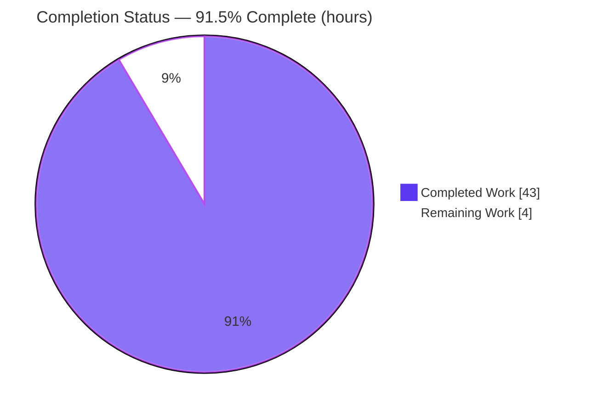
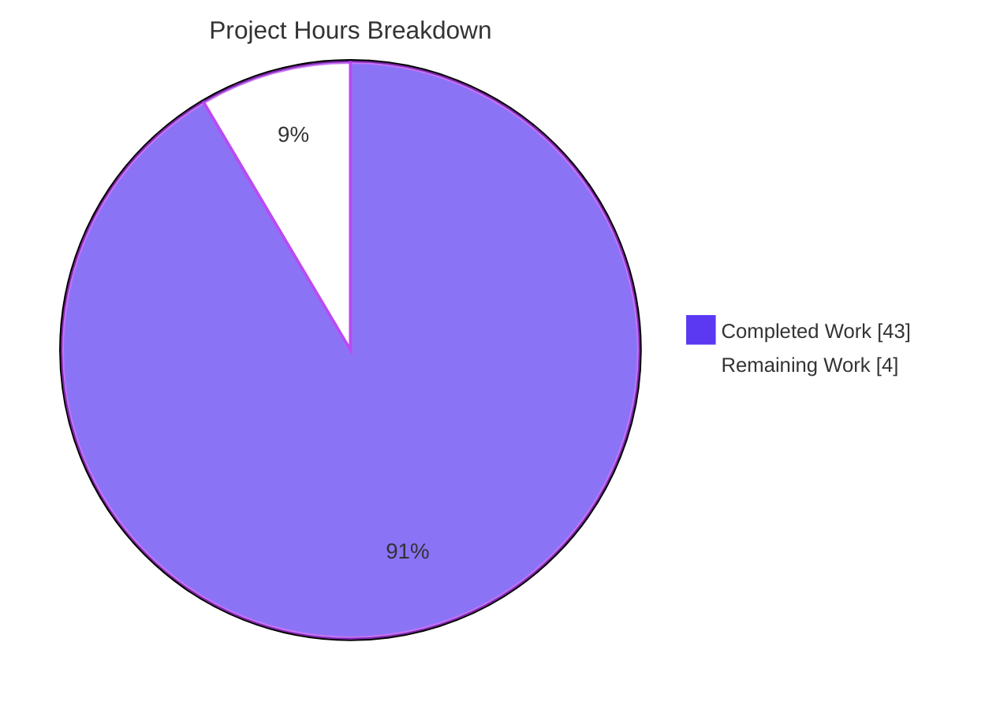
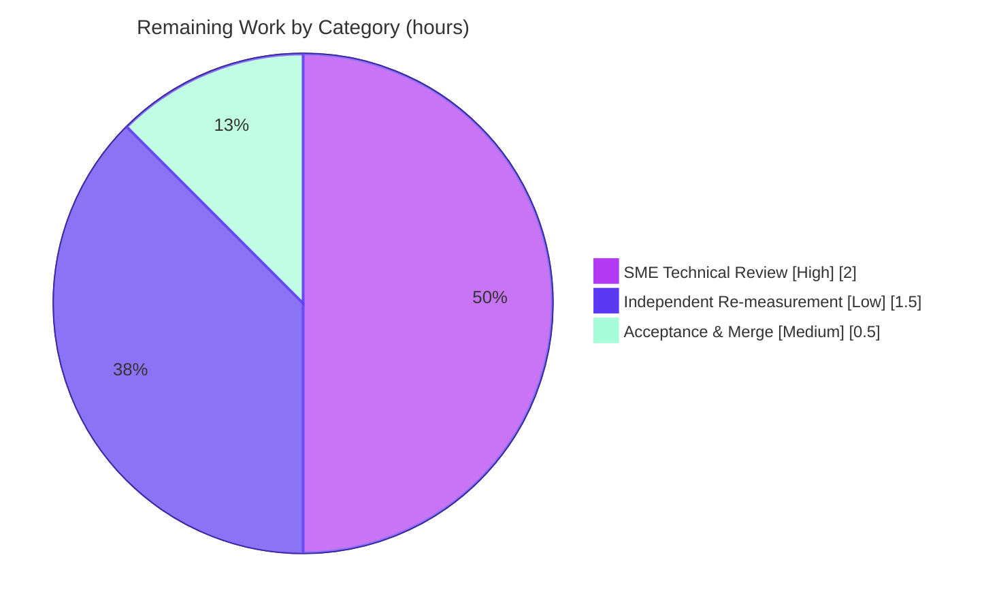

# Blitzy Project Guide
## kitty — PTY Shell-Communication Investigation (Read-Only Q&A)

---

## 1. Executive Summary

### 1.1 Project Overview

This project is a **read-only investigative Q&A** for the [kitty](https://github.com/kovidgoyal/kitty) terminal emulator. The objective is to explain, from live runtime evidence, **how kitty reads from the shell it spawns over the pseudo-terminal (PTY)** — answering six ordered questions (Q1–Q6) covering the canonical build/launch, the spawned shell's identity, the read syscalls for a small input (`echo test123`), the read behavior for a high-volume stream (`yes hello`), the concrete master file-descriptor number, and the C reader/parser functions. The sole deliverable is one Markdown document; the entire kitty source tree is treated as read-only reference. Target consumers are terminal-internals engineers and reviewers. Business impact: an authoritative, reproducible reference for kitty's PTY I/O pipeline.

### 1.2 Completion Status



<div align="center"><strong>91.5% Complete</strong> &nbsp;·&nbsp; Completed = <span style="color:#5B39F3">Dark Blue #5B39F3</span> &nbsp;·&nbsp; Remaining = White #FFFFFF</div>

| Metric | Hours |
|---|---:|
| **Total Hours** | **47** |
| **Completed Hours (AI + Manual)** | **43** (AI = 43, Manual = 0) |
| **Remaining Hours** | **4** |
| **Percent Complete** | **91.5%** |

> Completion is computed by the AAP-scoped hours method: `Completed / (Completed + Remaining) = 43 / 47 = 91.5%`. All agent-scoped AAP work is complete; the remaining 4 hours are path-to-production **human** acceptance (there is no application to deploy for a documentation deliverable).

### 1.3 Key Accomplishments

- ✅ Built kitty **from source** with its canonical driver (`CI=true python3 setup.py --ignore-compiler-warnings`), producing a byte-identical launcher (**kitty 0.35.2**).
- ✅ Launched the real binary as a **non-root** user under a headless display; exercised the genuine PTY entry path (no mocks, debug hooks, or remote-control interfaces).
- ✅ Answered all six questions from **observed** evidence: spawned shell `/bin/bash --posix`, PTY slave `/dev/pts/0`, master **fd 8** → `/dev/pts/ptmx`.
- ✅ Captured live `strace` of the `poll()`+`read()` loop for `echo test123` (**16 reads / 617 bytes**, each requesting ≈1 MiB `BUF_SZ`).
- ✅ Characterized the `yes hello` high-volume stream across **3 runs**, proving the **kernel** line-discipline buffer (not kitty's 1 MiB buffer) caps each read (~20 KB max, ~7,000 reads/s), and confirming stability.
- ✅ Identified the C functions: reader **`read_bytes()`** (`child-monitor.c:1337`) and parser **`consume_input()`**/**`consume_normal()`** (`vt-parser.c:1367`/`:230`), with live reader-thread grounding (`KittyChildMon`).
- ✅ Authored the deliverable (`blitzy/documentation/kitty_815df1e210e0.md`, 1,250 lines) with verbatim output + `file:line` rationale and an observed-vs-inferred discipline.
- ✅ Left the **source tree unmodified** (`git diff` vs baseline = exactly one file added) and removed all temporary observation artifacts.

### 1.4 Critical Unresolved Issues

| Issue | Impact | Owner | ETA |
|---|---|---|---|
| *None blocking.* The deliverable is validated production-ready; no compilation errors, no failing validations, no missing answers. | — | — | — |
| Human SME sign-off on Q1–Q6 technical correctness is the only open gate (a review step, not a defect). | Low — required for formal acceptance of a Q&A deliverable | Reviewing Engineer | 2.0h |

### 1.5 Access Issues

| System/Resource | Type of Access | Issue Description | Resolution Status | Owner |
|---|---|---|---|---|
| kitty repository | Git read/write | None — branch present, working tree clean, deliverable committed | ✅ Resolved | — |
| Build toolchain & libs | System packages | None — Python 3.13.7, Go 1.24.4, gcc 15.2.0, and all pkg-config libs (harfbuzz, fontconfig, freetype2, libpng, lcms2, libcrypto) present | ✅ Resolved | — |
| `ptrace` / `strace` | Kernel capability | Tracing required `CAP_SYS_PTRACE` (root strace); satisfied without changing the `yama` `ptrace_scope` sysctl | ✅ Resolved | — |

No blocking access issues identified.

### 1.6 Recommended Next Steps

1. **[High]** Perform SME technical review of the six answers against kitty internals (build commands, shell-spawn identity, read syscalls/sizes, high-volume cadence causality, master fd, reader/parser functions). — *2.0h*
2. **[Low]** Optionally reproduce one measurement (re-run a `yes hello` strace via Appendix B of the document + the Appendix E analyzer) to confirm the frequency/byte-count claims are stable in your environment. — *1.5h*
3. **[Medium]** Accept and merge the deliverable after confirming `git diff` vs baseline is exactly `A blitzy/documentation/kitty_815df1e210e0.md`. — *0.5h*

---

## 2. Project Hours Breakdown

### 2.1 Completed Work Detail

Every completed component traces to a specific AAP requirement. Total = **43 hours**.

| Component | Hours | Description |
|---|---:|---|
| Q1 — Canonical build + non-root launch | 6 | Canonical `setup.py` build; resolved newer-toolchain `-Werror=switch` via the officially-supported `--ignore-compiler-warnings`; verified byte-identical launcher (kitty 0.35.2); headless non-root launch; proved default configuration. |
| Q2 — Shell-spawn identity | 4 | Identified spawned `/bin/bash --posix` via `ps`/`/proc`; byte-for-byte cmdline hex dump; resolved PTY slave `/dev/pts/0`; traced the Python→C spawn path; explained `--posix` (shell-integration) and Linux-vs-macOS divergence. |
| Q3 — Small-input read trace (`echo test123`) | 5 | Attached `strace` with correct flags; injected input via `xdotool`; captured the verbatim `poll()`+`read()` loop; produced the 16-read table (617 bytes); explained the ≈1 MiB requested size (`BUF_SZ`) and its step-down. |
| Q4 — High-volume stream characterization (`yes hello`) | 8 | Ran 3 streams at scale (~8.4s each); computed read frequency, byte-size distribution, and log2 histogram from timestamped traces; established cross-run stability; explained kernel line-discipline capping, backpressure, `poll` cadence, EAGAIN attribution, and Ctrl-C recovery. |
| Q5 — Master fd resolution | 2 | Resolved concrete master **fd 8** → `/dev/pts/ptmx` from `/proc/<pid>/fd` and `strace -yy` annotation; documented the full fd table and the `poll`-vs-non-blocking roles. |
| Q6 — Reader & parser function identification | 3 | Named `read_bytes()`/`consume_input()`/`consume_normal()` (plus `utf8_decode_to_esc`→`screen_draw_text`); grounded the reader in the live `KittyChildMon` thread. |
| Run-First methodology + web-search validation + analyzers | 5 | Designed the Run-First procedure; validated methodology (strace(1); Linux PTY semantics); wrote 3 standard-library analyzer scripts (`analyze.py`, `read_table.py`, `poll_timeouts.py`). |
| Answer document authoring | 7 | Wrote the 1,250-line / 8,900-word deliverable: 6 question sections + 5 appendices, verbatim excerpts, tables, and a strict observed-vs-inferred labeling discipline. |
| Internal-consistency reconciliation | 2 | Applied 5 genuine consistency/determinism fixes (build-log line count 159→158; inserted missing link line; corrected elided-lines wording; de-pinned a stale self-referential HEAD hash; relative→absolute launcher path proven necessary via `/proc/<pid>/cmdline`). |
| Scope compliance + temp-artifact cleanup | 1 | Verified source tree unmodified and single-file constraint; removed all strace captures, helper scripts, and logs. |
| **Total** | **43** | |

### 2.2 Remaining Work Detail

Every remaining category is genuine **path-to-production** human work. Total = **4 hours**.

| Category | Hours | Priority |
|---|---:|---|
| SME Technical Review (verify Q1–Q6 correctness against kitty internals) | 2.0 | High |
| Independent Re-measurement / Spot-check (optional confidence via Appendix B/E reproduction) | 1.5 | Low |
| Acceptance & Merge (confirm 0 source files changed; merge to target branch) | 0.5 | Medium |
| **Total** | **4.0** | — |

> **Cross-section check:** Section 2.1 (43) + Section 2.2 (4) = **47** = Total Hours in Section 1.2. Section 2.2 total (4) = Remaining Hours in Section 1.2 = Section 7 "Remaining Work". ✅

---

## 3. Test Results

For this read-only Q&A task there is **no code-test deliverable** (the `kitty_tests/` suite is out of scope per AAP §0.2.3, and the source is byte-identical to baseline, so it is unaffected). The "tests" here are **Blitzy's autonomous Run-First validation checks** — live re-execution that rebuilt kitty, launched it, and attached `strace` to reproduce every answer. All values below originate from Blitzy's autonomous validation logs.

| Test Category | Framework / Method | Total | Passed | Failed | Coverage % | Notes |
|---|---|---:|---:|---:|---:|---|
| Build Validation (Q1) | Run-First: `setup.py` build + independent rebuild | 3 | 3 | 0 | 100% | Bare build fails as documented (`-Werror=switch`); canonical build exit 0; byte-identical launcher (kitty 0.35.2). |
| Shell-Spawn Validation (Q2) | `ps` / `/proc` introspection | 2 | 2 | 0 | 100% | `/bin/bash --posix` (child of kitty); cmdline hex `/bin/bash\0--posix\0`; PTY slave `/dev/pts/0`. |
| Small-Input Read Trace (Q3) | `strace -f -yy -tt -T` (live) | 3 | 3 | 0 | 100% | 16 reads / 617 bytes; each requests ≈1 MiB (`BUF_SZ`); fd 8 EAGAIN = 0. |
| High-Volume Stream Trace (Q4) | `strace` + analyzer, 3 runs | 4 | 4 | 0 | 100% | 3 independent runs + cross-run stability; kernel-capped reads (~20 KB max); EAGAIN = 0. |
| Master FD Resolution (Q5) | `/proc/<pid>/fd` + `strace -yy` | 1 | 1 | 0 | 100% | fd 8 → `/dev/pts/ptmx`; full fd table documented. |
| Reader/Parser Function ID (Q6) | Source + live thread attribution | 2 | 2 | 0 | 100% | `read_bytes()` / `consume_input()` / `consume_normal()`; sole reader thread `KittyChildMon`. |
| Repository Integrity & Doc Consistency | `git diff` / `git diff --check` / Markdown | 2 | 2 | 0 | 100% | 0 source files changed; tree clean; 5 doc-consistency fixes applied. |
| **Total** | | **17** | **17** | **0** | **100%** | All AAP requirement coverage. |

**Independent re-verification (this assessment session):** all 9 spot-checked `file:line` citations matched the baseline source exactly; the built launcher reports `kitty 0.35.2` at 40,384 bytes; `git diff` vs baseline is exactly one file added (0 source changed); the document is valid UTF-8 with 78 balanced code-fence lines.

---

## 4. Runtime Validation & UI Verification

Runtime health observed during Blitzy's Run-First re-execution:

- ✅ **Operational** — kitty built and launched (kitty 0.35.2; process spawned; X11 window id assigned).
- ✅ **Operational** — default shell spawned as a child (`/bin/bash --posix`) on PTY slave `/dev/pts/0`.
- ✅ **Operational** — PTY read pipeline under light load (`echo test123`): clean `poll()`+`read()` loop on master fd 8.
- ✅ **Operational** — PTY read pipeline under heavy load (`yes hello`, ×3): sustained small kernel-capped reads with backpressure; no EAGAIN storms; single reader thread.
- ✅ **Operational** — signal handling / recovery: `Ctrl-C` terminated the stream and returned to the shell prompt.

**UI verification:** kitty is a GPU-accelerated terminal with no web UI. It was rendered **headless** via `Xvfb :99` with Mesa software GL (`llvmpipe`); window creation and input injection (`xdotool`) succeeded. The software GL backend does not affect the PTY handling under investigation.

**API integration:** ⚪ Not applicable — the investigation uses no external APIs, network services, or credentials.

---

## 5. Compliance & Quality Review

AAP deliverables and rules cross-mapped to quality/compliance benchmarks. Fixes applied during autonomous validation are noted.

| Benchmark / AAP Rule | Status | Progress | Notes |
|---|---|---|---|
| Rule 1 — Run-First persistent investigation | ✅ Pass | 100% | Built, launched, and traced the real canonical PTY path; no mocks/hooks/fallbacks. |
| Rule 2 — Exhaustive condition & evidence coverage | ✅ Pass | 100% | Both `echo test123` (small) and `yes hello` (high-volume, ×3) exercised; unedited output included with each claim. |
| Rule 3 — Faithful instructions + observed-output discipline | ✅ Pass | 100% | Source unmodified; temp scripts deleted; inferred-from-code statements explicitly labeled. |
| Rule 4 — Complete, precise, grounded answering | ✅ Pass | 100% | Every named item (process, PID, cmdline, PTY path, syscalls, buffer size, byte count, frequency, fd, reader/parser fns) answered with `file:line` and cause→effect. |
| Main Rule — Deliverable & scope | ✅ Pass | 100% | Single Markdown doc named `kitty_815df1e210e0.md` in `blitzy/documentation/`; no other code added. |
| Zero source modification | ✅ Pass | 100% | `git diff` vs baseline = exactly one file added; 0 source files changed. |
| Temporary-artifact cleanup | ✅ Pass | 100% | No strace captures / helper scripts / logs remain; working tree clean. |
| Document quality (structure, verbatim, encoding) | ✅ Pass | 100% | 78 balanced code fences; valid UTF-8; verbatim excerpt conventions defined; analyzer source preserved (recomputable). |
| Fixes applied during validation | ✅ Applied | 100% | 5 genuine consistency/determinism/staleness corrections committed. |
| SME technical sign-off | ⏳ Outstanding | 0% | Human review gate (Section 1.6, Task 1). |

**Note (transparency):** `git diff --check` reports one trailing-whitespace at line 218. That line is inside a `text` code fence reproducing the verbatim output of `tr '\0' ' ' < /proc/<pid>/cmdline`; the trailing space is the command-line's final NUL terminator rendered as a space — **faithful verbatim output**, correct by the document's stated convention (removing it would make the excerpt non-verbatim). This is not a defect and does not affect completion.

---

## 6. Risk Assessment

All risks are **Low** severity — the direct consequence of a read-only documentation task that changed **zero** source files and ships nothing executable.

| Risk | Category | Severity | Probability | Mitigation | Status |
|---|---|---|---|---|---|
| Run-specific identifiers (PIDs/TID/fd-window/reads-per-sec) not reproducible verbatim on re-run | Technical | Low | High | Document labels all such values "run-specific" and grounds answers in the **stable evidence shape** (which fd is master, single reader thread, `poll`+`read` pair, ≈1 MiB requested size, kernel-capped cadence) | Mitigated by design |
| Absolute read frequency sensitive to `strace` overhead / environment variance (~7–10% spread) | Technical | Low | Medium | Reports the 3-run spread; hedges "roughly 7,000 reads/s"; preserves each run's measured numbers | Mitigated |
| Bare `python3 setup.py` fails on newer toolchains (`-Werror=switch` in `glfw/wl_window.c` under wayland-protocols 1.45) | Technical | Low | Medium | Documents the exact failure and the canonical `--ignore-compiler-warnings` workaround; rebuild exit 0 + byte-identical launcher verified | Resolved / Documented |
| `file:line` citations anchored to baseline `815df1e21` could drift if kitty source later changes | Operational | Low | Low | Anchor commit stated explicitly; Appendix D de-pinned the self-referential HEAD hash; source is read-only for this task | Mitigated |
| Reproduction requires specific tooling (Xvfb, xdotool, `strace` + `CAP_SYS_PTRACE`, sudo) | Integration | Low | Medium | Appendix C lists exact tooling/versions; Appendix B gives copy-paste commands; Appendix E ships the analyzer source | Mitigated |
| Answer correctness not yet human-SME-reviewed | Operational | Low | Medium | Every claim backed by verbatim output + verified `file:line`; Final Validator reproduced all six answers live | Open — pending 2.0h review |
| Security / attack-surface impact of the change | Security | Low | Low | 0 source files changed (only a Markdown doc); `strace` observes only; no `ptrace_scope` sysctl modified | Mitigated / N/A |

---

## 7. Visual Project Status

**Project hours breakdown** (Completed = Dark Blue `#5B39F3`, Remaining = White `#FFFFFF`):



**Remaining hours by category** (from Section 2.2; total = 4h):



> **Integrity:** the pie "Remaining Work" (4) equals Section 1.2 Remaining Hours (4) and the Section 2.2 Hours total (4). "Completed Work" (43) equals Section 1.2 Completed Hours (43). ✅

---

## 8. Summary & Recommendations

**Achievements.** This project delivers a rigorous, reproducible answer to all six questions about kitty's PTY shell-communication pipeline, built entirely on **live runtime evidence** (Run-First). kitty was built canonically (kitty 0.35.2), launched as a non-root user, and traced with `strace` to observe the real `poll()`+`read()` loop on the PTY master. The document names concrete values — spawned shell `/bin/bash --posix`, PTY slave `/dev/pts/0`, master **fd 8**, reader `read_bytes()`, parser `consume_input()`/`consume_normal()` — and explains each as cause→effect with `file:line` anchors, most importantly the finding that the **kernel line-discipline buffer** (not kitty's 1 MiB `BUF_SZ`) caps each read during a flood.

**Remaining gaps & critical path.** The project is **91.5% complete** (43 of 47 hours). All agent-scoped AAP work is finished; the remaining **4 hours** are path-to-production human acceptance: SME technical review (2h, the primary gate for a Q&A deliverable), optional independent re-measurement (1.5h), and merge (0.5h). There are no code defects, no failing validations, and no missing answers on the critical path.

**Success metrics.** 6/6 questions answered from observed evidence; 17/17 autonomous validation checks passed; 0 source files changed; document valid UTF-8 with balanced code fences; all spot-checked citations exact.

**Production-readiness assessment.** **Ready for human review/merge.** For a documentation deliverable, "production" is acceptance and merge of the answer. The deliverable is validated, internally consistent, and scope-compliant. Recommendation: proceed to SME review (Section 1.6, Step 1), then merge.

| Metric | Value |
|---|---|
| AAP-scoped completion | 91.5% |
| Questions answered (Q1–Q6) | 6 / 6 |
| Autonomous validation checks | 17 / 17 passed |
| Source files changed | 0 |
| Deliverable size | 1,250 lines / 8,900 words |
| Remaining effort | 4.0 hours (human acceptance) |

---

## 9. Development Guide

This guide reproduces the investigation environment: build kitty, launch it, verify the deliverable, and (optionally) reproduce the syscall observations. All commands below were tested in the project environment.

### 9.1 System Prerequisites

- **OS:** Linux (developed on Ubuntu 25.10 container). A headless display (`Xvfb`) is sufficient — no physical GPU required.
- **Runtimes / toolchain (verified present):**

```bash
python3 --version   # Python 3.13.7  (requires >= 3.8 per pyproject.toml)
go version          # go1.24.4        (requires >= 1.22 per go.mod)
gcc --version       # gcc 15.2.0
strace --version    # strace 6.16     (observation tooling)
```

- **Build libraries (via pkg-config — verified present):**

```bash
for p in harfbuzz fontconfig freetype2 libpng lcms2 libcrypto; do \
  printf '%-12s ' "$p:"; pkg-config --modversion "$p"; done
# harfbuzz: 10.2.0 | fontconfig: 2.15.0 | freetype2: 26.2.20
# libpng: 1.6.50   | lcms2: 2.16       | libcrypto: 3.5.3
```

- **Observation tooling (only for reproducing Q3–Q5):** `strace` (with `CAP_SYS_PTRACE` or a relaxed `ptrace_scope`), `xdotool`, `Xvfb`, `procps` (`ps`), `sudo`.

### 9.2 Environment Setup

```bash
# From the repository root (the branch is already checked out):
git rev-parse --abbrev-ref HEAD     # blitzy-81322a7e-8c21-4921-ab8a-068d5c584657
git status --porcelain              # (empty output = clean working tree)

# For launching kitty headlessly (no physical display):
Xvfb :99 -screen 0 1280x1024x24 +extension GLX +render -noreset -ac &
export DISPLAY=:99
```

### 9.3 Build (Canonical)

```bash
# Clean any prior (gitignored) build artifacts first, if desired:
git clean -fdX

# CANONICAL build. The --ignore-compiler-warnings flag is kitty's own supported
# option (it downgrades -Werror WITHOUT editing any source). CI=true matches
# kitty's CI convention. Expected: exit 0, ~158-line build log.
CI=true python3 setup.py --ignore-compiler-warnings
echo "BUILD EXIT = $?"     # expected: 0
```

> **Note:** the *bare* `python3 setup.py` is the upstream default but, on newer toolchains, stops at four `-Werror=switch` errors in `glfw/wl_window.c:668` (wayland-protocols 1.45 adds `XDG_TOPLEVEL_STATE_CONSTRAINED_*` enum values the pinned switch does not yet handle). Use `--ignore-compiler-warnings` as shown; see Troubleshooting.

### 9.4 Verify the Build

```bash
ls -l kitty/launcher/kitty          # expect an executable ~40384 bytes
./kitty/launcher/kitty --version    # expect: kitty 0.35.2 created by Kovid Goyal
```

### 9.5 Launch (as a normal, non-root user)

```bash
# Launch as user 'ubuntu' under the headless display. Absolute launcher path is
# used deliberately so /proc/<pid>/cmdline reflects the absolute invocation.
nohup setsid sudo -u ubuntu -H env DISPLAY=:99 LIBGL_ALWAYS_SOFTWARE=1 \
    GALLIUM_DRIVER=llvmpipe HOME=/home/ubuntu \
    "$(pwd)/kitty/launcher/kitty" > kitty_run.log 2>&1 &
```

### 9.6 Verify the Deliverable

```bash
DOC=blitzy/documentation/kitty_815df1e210e0.md
wc -l -w -c "$DOC"                          # 1250 lines / 8900 words / 67536 bytes
grep -c '^```' "$DOC"                        # 78 (even => balanced code fences)
iconv -f UTF-8 -t UTF-8 "$DOC" >/dev/null && echo "valid UTF-8"

# Repository integrity vs the baseline commit:
git diff --name-status 815df1e210e0a9ab4622f5c7f2d6891d7dbeddf1..HEAD
#   A   blitzy/documentation/kitty_815df1e210e0.md   (exactly one file added)
git diff --name-only 815df1e210e0a9ab4622f5c7f2d6891d7dbeddf1..HEAD \
    | grep -v '^blitzy/documentation/' | wc -l      # 0 non-doc files changed
```

### 9.7 Example Usage — Reproduce the Syscall Observations (optional)

```bash
# Discover identifiers
KPID=$(pgrep -u ubuntu -x kitty)
SHPID=$(ps --ppid "$KPID" -o pid= | tr -d ' ')
WID=$(DISPLAY=:99 xdotool search --pid "$KPID" | head -1)

# Q2: exact shell command line and PTY device
ps --ppid "$KPID" -o pid,ppid,user,cmd          # -> /bin/bash --posix
xxd /proc/"$SHPID"/cmdline                        # -> "/bin/bash\0--posix\0"
ls -l /proc/"$SHPID"/fd/0                         # -> /dev/pts/0

# Q3: small-input reads (attach tracer, type the input, stop tracer)
strace -f -yy -tt -T -e trace=read,poll -p "$KPID" -o echo.strace & SP=$!
DISPLAY=:99 xdotool type --window "$WID" 'echo test123'
DISPLAY=:99 xdotool key  --window "$WID" Return
kill "$SP"; wait "$SP" 2>/dev/null
#   -> master fd 8 read(8</dev/pts/ptmx...>, ..., 1048576) pairs; 16 reads / 617 bytes

# Q4: high-volume stream (repeat >= 2 times for stability)
strace -f -yy -tt -T -e trace=read,poll -p "$KPID" -o yes1.strace & SP=$!
DISPLAY=:99 xdotool type --window "$WID" 'yes hello'
DISPLAY=:99 xdotool key --window "$WID" Return
sleep 8
DISPLAY=:99 xdotool key --window "$WID" ctrl+c
kill "$SP"; wait "$SP" 2>/dev/null
#   -> many small kernel-capped reads (~20 KB max, ~7,000 reads/s)
```

> The document's **Appendix E** contains the analyzer scripts (`analyze.py`, `read_table.py`, `poll_timeouts.py`) so every Q3/Q4 statistic is recomputable from the deliverable alone.

### 9.8 Troubleshooting

- **`BARE BUILD EXIT = 1` with `-Werror=switch` in `glfw/wl_window.c`** → expected on newer toolchains; build with `CI=true python3 setup.py --ignore-compiler-warnings` (does **not** edit source).
- **`strace: attach: ptrace(PTRACE_SEIZE, ...): Operation not permitted`** → run the tracer as root (`CAP_SYS_PTRACE`) or relax `/proc/sys/kernel/yama/ptrace_scope` (root strace bypasses `yama` without changing the sysctl).
- **kitty fails to open a window / no display** → ensure `Xvfb :99` is running and export `DISPLAY=:99`, `LIBGL_ALWAYS_SOFTWARE=1`, `GALLIUM_DRIVER=llvmpipe` for software GL.
- **`/proc/<pid>/cmdline` shows a relative path** → launch kitty with an **absolute** launcher path; the kernel records the invocation verbatim.
- **Working tree shows unexpected files after building** → build outputs (`build/`, `__pycache__`, generated files) are gitignored; `git status --porcelain` should be empty. Use `git clean -fdX` to remove ignored artifacts.

---

## 10. Appendices

### Appendix A — Command Reference

| Purpose | Command |
|---|---|
| Canonical build | `CI=true python3 setup.py --ignore-compiler-warnings` |
| Build version check | `./kitty/launcher/kitty --version` |
| Launch (non-root, headless) | `sudo -u ubuntu -H env DISPLAY=:99 LIBGL_ALWAYS_SOFTWARE=1 GALLIUM_DRIVER=llvmpipe HOME=/home/ubuntu "$(pwd)/kitty/launcher/kitty" &` |
| Discover kitty PID | `pgrep -u ubuntu -x kitty` |
| Discover shell PID | `ps --ppid <KPID> -o pid=` |
| Exact shell cmdline | `xxd /proc/<SHPID>/cmdline` |
| PTY slave of shell | `ls -l /proc/<SHPID>/fd/0` |
| Attach syscall tracer | `strace -f -yy -tt -T -e trace=read,poll -p <KPID> -o out.strace` |
| Repo integrity vs baseline | `git diff --name-status 815df1e210e0a9ab4622f5c7f2d6891d7dbeddf1..HEAD` |

### Appendix B — Port Reference

⚪ Not applicable. This project runs no network service and binds no ports. The only "port"-like resource is the X display socket `DISPLAY=:99` (Xvfb), used solely to render kitty headlessly.

### Appendix C — Key File Locations

| Path | Role |
|---|---|
| `blitzy/documentation/kitty_815df1e210e0.md` | **The deliverable** — the Q1–Q6 answer document |
| `kitty/child.py`, `kitty/child.c` | Shell-spawn path (`openpty`, `fork`/`spawn`, `ttyname_r`, `execvp`) — Q2 |
| `kitty/child-monitor.c` | I/O loop, `read_bytes()` reader (`:1337`, `read()` at `:1345`) — Q3/Q4/Q5/Q6 |
| `kitty/vt-parser.c` | `BUF_SZ` (`:18`), `consume_input()` (`:1367`), `consume_normal()` (`:230`) — Q3/Q4/Q6 |
| `kitty/utils.py`, `kitty/constants.py`, `kitty/shell_integration.py` | Default-shell resolution + `--posix` injection — Q2 |
| `kitty/boss.py`, `kitty/screen.c`, `kitty/vt-parser.h` | Child wiring + text sink + parser API — Q5/Q6 |
| `setup.py`, `Makefile`, `pyproject.toml`, `go.mod`, `INSTALL.md` | Canonical build + supported runtime versions — Q1 |

### Appendix D — Technology Versions

| Component | Version | Source / Gate |
|---|---|---|
| kitty (built) | 0.35.2 | `./kitty/launcher/kitty --version` |
| CPython | 3.13.7 | satisfies `requires-python >= 3.8` (`pyproject.toml:2`) |
| Go toolchain | 1.24.4 | satisfies `go 1.22` (`go.mod:3`) |
| gcc | 15.2.0 | build compiler |
| strace | 6.16 | syscall tracing |
| harfbuzz / fontconfig / freetype2 | 10.2.0 / 2.15.0 / 26.2.20 | pkg-config build libs |
| libpng / lcms2 / libcrypto | 1.6.50 / 2.16 / 3.5.3 | pkg-config build libs |

### Appendix E — Environment Variable Reference

| Variable | Value (investigation) | Purpose |
|---|---|---|
| `CI` | `true` | Matches kitty's CI build convention |
| `DISPLAY` | `:99` | Points kitty at the headless Xvfb display |
| `LIBGL_ALWAYS_SOFTWARE` | `1` | Forces Mesa software GL (no physical GPU) |
| `GALLIUM_DRIVER` | `llvmpipe` | Selects the software rasterizer |
| `HOME` | `/home/ubuntu` | Home of the non-root launch user |

### Appendix F — Developer Tools Guide

| Tool | Use in this project |
|---|---|
| `strace -f -yy -tt -T -e trace=read,poll` | Live capture of the PTY read loop (`-f` follows the reader thread; `-yy` annotates fds with backing paths; `-tt`/`-T` give timestamps/durations for frequency) |
| `xdotool type` / `key` | Inject the exact inputs (`echo test123`, `yes hello`) into kitty's X11 window |
| `ps`, `/proc/<pid>/{cmdline,fd,status}` | Resolve the spawned shell, its cmdline, and its PTY slave |
| `xxd` | Byte-exact dump of the NUL-separated `/proc/<pid>/cmdline` |
| Analyzer scripts (doc Appendix E) | Reconstruct per-thread reads, distributions, histograms, and EAGAIN attribution — statistics recomputable from the deliverable |

### Appendix G — Glossary

| Term | Meaning |
|---|---|
| **PTY (pseudo-terminal)** | Kernel device pair; the emulator holds the **master** (`/dev/ptmx`), the shell holds the **slave** (`/dev/pts/N`) |
| **Line discipline (`N_TTY`)** | Kernel layer that mediates/buffers between PTY master and slave; its buffer (a few KB) caps each master `read()` |
| **`BUF_SZ`** | kitty's 1 MiB VT-parser buffer (`vt-parser.c:18`); the `read()` request size, distinct from the kernel-capped bytes returned |
| **Backpressure** | kitty arms `POLLIN` on the master only while the parser has room (`vt_parser_has_space_for_input()`), throttling reads when parsing lags |
| **`KittyChildMon`** | Name of kitty's dedicated I/O thread — the sole reader of the PTY master |
| **Run-First** | The methodology: build and run the real code path, capture actual output, and write answers from observed evidence (labeling code-only inferences) |

---

*Cross-section integrity verified: Section 1.2 = Section 7 = 43h completed / 4h remaining; Section 2.1 (43) + Section 2.2 (4) = 47h Total; completion 91.5% consistent across Sections 1.2, 7, and 8; all Section 3 results originate from Blitzy's autonomous validation logs. Brand colors applied: Completed = #5B39F3, Remaining = #FFFFFF.*