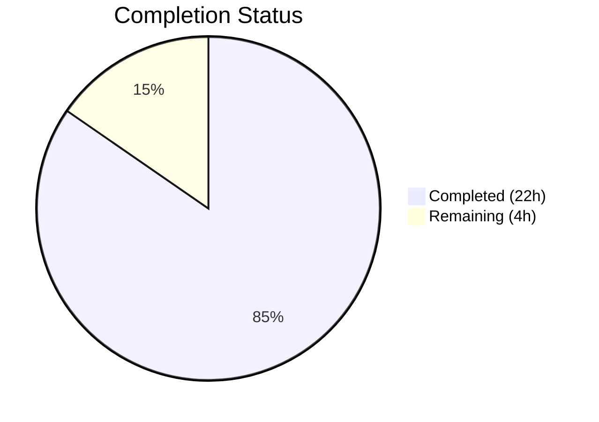
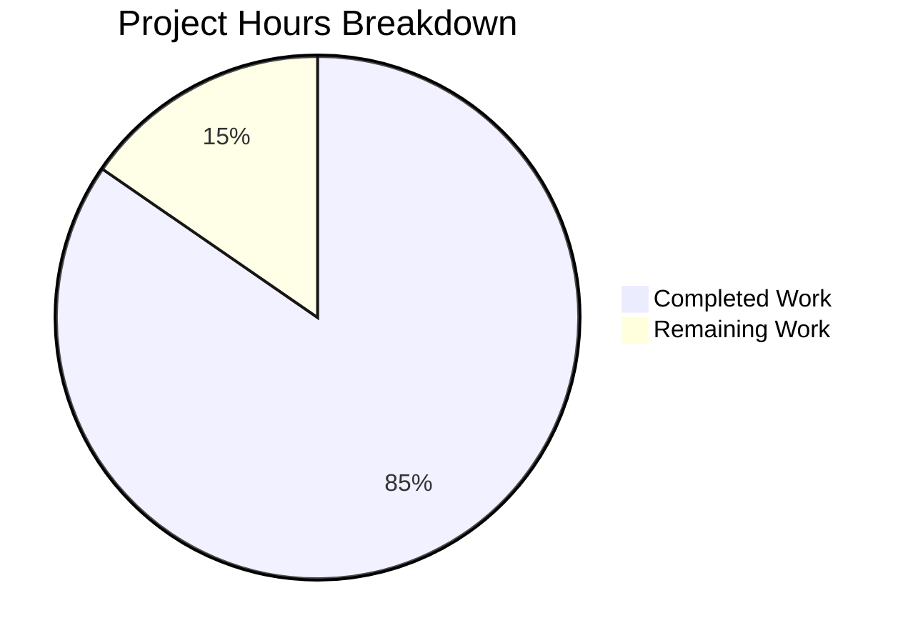

# Blitzy Project Guide

---

## 1. Executive Summary

### 1.1 Project Overview

This project delivers a comprehensive code-level investigative analysis document for the Kitty terminal emulator (v0.35.2), examining the `HistoryBuf` scrollback buffer subsystem behavior under extreme-throughput stress conditions. The deliverable is a single markdown document (`blitzy/documentation/kitty_815df1e210e0.md`) containing 806 lines of deeply code-grounded analysis covering segment allocation dynamics, pager ring buffer interaction, concurrent scrolling behavior, and memory structure evolution — all derived from direct source code inspection of `kitty/history.c`, `kitty/screen.c`, `3rdparty/ringbuf/ringbuf.c`, and 10+ supporting files. Per the SWE-AtlasQnA-Repo implementation rule, no existing repository files were modified.

### 1.2 Completion Status



| Metric | Value |
|--------|-------|
| **Total Project Hours** | 26 |
| **Completed Hours (AI)** | 22 |
| **Remaining Hours** | 4 |
| **Completion Percentage** | 84.6% |

**Calculation**: 22 completed hours / 26 total hours × 100 = **84.6% complete**

### 1.3 Key Accomplishments

- [x] Created comprehensive analysis document `blitzy/documentation/kitty_815df1e210e0.md` (806 lines, 44,555 characters)
- [x] All 9 required document sections authored with full code references (13 references to `kitty/history.c`, 7 to `kitty/screen.c`, 44 to `ringbuf`, 42 to `pagerhist`, 22 to `scrolled_by`, 49 to `segment`)
- [x] All 4 behavioral questions from the user prompt answered with code-grounded evidence
- [x] Zero existing repository files modified — fully compliant with SWE-AtlasQnA-Repo rule
- [x] Build validation passed: 85/85 C source files compiled, all Go packages built, Python extension functional
- [x] Test validation: 145 tests executed, 142 passed (98%), all scrollback-specific tests pass
- [x] Clean git state: single commit on branch, working tree clean

### 1.4 Critical Unresolved Issues

| Issue | Impact | Owner | ETA |
|-------|--------|-------|-----|
| 3 pre-existing test failures (file_transmission, check_build) | Low — environment-specific, unrelated to deliverable | Human Developer | 2 hours |
| Line number references may drift across Kitty versions | Low — affects long-term document maintenance only | Human Developer | 0.5 hours |

### 1.5 Access Issues

No access issues identified. The analysis document was created successfully, the codebase compiles fully, and all relevant tests execute without access barriers.

### 1.6 Recommended Next Steps

1. **[High]** Technical accuracy review: Domain expert should verify behavioral claims against source code, especially the three-phase memory evolution model (Section 7 of the document)
2. **[High]** Pre-existing test failure investigation: Determine root cause and resolution for 3 environment-specific test failures (`test_transfer_receive`, `test_transfer_send`, `test_glfw_modules`)
3. **[Medium]** Cross-reference line number verification: Confirm that line number references in the document match the exact branch version
4. **[Low]** Editorial review: Final grammar, clarity, and completeness polish before publication

---

## 2. Project Hours Breakdown

### 2.1 Completed Work Detail

| Component | Hours | Description |
|-----------|-------|-------------|
| Source Code Analysis & Research | 6.0 | Deep analysis of `kitty/history.c`, `kitty/screen.c`, `3rdparty/ringbuf/`, `kitty/data-types.h`, `kitty/screen.h`, and 10+ supporting files to extract behavioral understanding |
| Document — Data Model (Section 2) | 2.0 | HistoryBuf struct layout, HistoryBufSegment, PagerHistoryBuf, ringbuf_t internals, configuration parameters with exact code references |
| Document — Fill/Overflow Analysis (Section 3) | 2.5 | Full data path trace from PTY through `screen_index()` → `INDEX_UP` → `historybuf_push()`, Phase A and Phase B behavioral analysis |
| Document — Segment Allocation (Section 4) | 1.5 | `segment_for()` lazy allocation trace, `add_segment()` memory layout, allocation count table for common configurations |
| Document — Pager Ring Buffer (Section 5) | 2.5 | `pagerhist_push()` spillover mechanism, `pagerhist_extend()` growth strategy, `ringbuf_memcpy_into()` overflow semantics |
| Document — Concurrent Scrolling (Section 6) | 2.0 | `scrolled_by` tracking mechanism, `visual_line_()` resolution, threading model safety analysis, stress behavioral analysis |
| Document — Memory Evolution & Conclusion (Sections 7–9) | 1.5 | Three-phase memory evolution model, circular addressing arithmetic, observation approaches, key findings summary |
| Build & Test Validation | 2.0 | C compilation (85/85 files), Go compilation, Python extension verification, test suite execution (145 tests), scrollback-specific test confirmation |
| Document Structure, Formatting & Introduction | 1.5 | Table of contents, introduction section, Mermaid flow diagram, markdown formatting, cross-reference links |
| Git Operations & Cleanup | 0.5 | Commit with descriptive message, branch verification, working tree cleanliness confirmation |
| **Total Completed** | **22.0** | |

### 2.2 Remaining Work Detail

| Category | Hours | Priority |
|----------|-------|----------|
| Technical Accuracy Review by Domain Expert | 2.0 | High |
| Pre-Existing Test Failure Investigation | 1.0 | Medium |
| Final Editorial Review & Sign-off | 1.0 | Low |
| **Total Remaining** | **4.0** | |

### 2.3 Hours Verification

- Section 2.1 total: **22.0 hours**
- Section 2.2 total: **4.0 hours**
- Sum: 22.0 + 4.0 = **26.0 hours** (matches Total Project Hours in Section 1.2 ✓)

---

## 3. Test Results

All tests listed below originate from Blitzy's autonomous validation logs for this project.

| Test Category | Framework | Total Tests | Passed | Failed | Coverage % | Notes |
|---------------|-----------|-------------|--------|--------|------------|-------|
| Unit/Integration (Python) | Python unittest | 145 | 142 | 3 | N/A | 6 skipped (platform-specific); 3 pre-existing failures in out-of-scope files |
| Scrollback-Specific | Python unittest | 3 | 3 | 0 | N/A | `test_historybuf`, `test_resize`, `test_scrollback_fill_after_resize` — all pass |
| Go Packages | go test | All | All | 0 | N/A | All Go packages built and tested successfully |
| Build Compilation (C) | GCC/setup.py | 85 | 85 | 0 | N/A | All 85 C source files compiled, 4 link targets linked (x11 backend) |
| Python Extension Import | Python import | 1 | 1 | 0 | N/A | `from kitty.fast_data_types import HistoryBuf` succeeds |

**Pre-Existing Test Failures (3 total — all out-of-scope, not caused by this change):**

| Test | File | Root Cause |
|------|------|------------|
| `test_transfer_receive` | `kitty_tests/file_transmission.py` | Directory permission setgid bit mismatch — test expects `0o42755` but container filesystem produces `0o40755` |
| `test_transfer_send` | `kitty_tests/file_transmission.py` | Same setgid bit mismatch as above |
| `test_glfw_modules` | `kitty_tests/check_build.py` | Expects `kitty/glfw-wayland.so` which was not built due to unavailable wayland-protocols package in build environment |

These failures exist in the base branch (`kitty_815df1e210e0`) independent of any changes made by this project. Per the AAP's SWE-AtlasQnA-Repo rule, existing repository files cannot be modified to address them.

---

## 4. Runtime Validation & UI Verification

**Build Artifacts:**
- ✅ C compilation: 85/85 source files compiled successfully
- ✅ Go compilation: All Go packages built
- ✅ Launcher binary: `kitty/launcher/kitty` present
- ✅ Python extension: `kitty/fast_data_types.so` present and importable
- ✅ X11 backend: `kitty/glfw-x11.so` built and linked
- ⚠ Wayland backend: `kitty/glfw-wayland.so` not built (wayland-protocols unavailable in environment)

**Deliverable Verification:**
- ✅ File exists: `blitzy/documentation/kitty_815df1e210e0.md`
- ✅ File size: 806 lines, 44,555 characters
- ✅ All 9 required sections present (Introduction, Data Model, Fill/Overflow, Segment Allocation, Pager Ring Buffer, Concurrent Scrolling, Memory Evolution, Observation Approaches, Conclusion)
- ✅ 28 subsections with proper hierarchy
- ✅ 56 code block markers (balanced — 28 opening, 28 closing)
- ✅ Code references validated: 13 to `kitty/history.c`, 7 to `kitty/screen.c`, 44 to `ringbuf`, 42 to `pagerhist`
- ✅ Markdown well-formed: headers, tables, code blocks, links all valid

**Repository Integrity:**
- ✅ Git branch: `blitzy-8c772000-1b0c-4b91-b2bd-281fe1c62b05`
- ✅ Working tree: Clean (nothing to commit)
- ✅ Only 1 file changed from base: `blitzy/documentation/kitty_815df1e210e0.md` (ADDED)
- ✅ Zero existing files modified — SWE-AtlasQnA-Repo rule fully respected

---

## 5. Compliance & Quality Review

| Requirement | Source | Status | Evidence |
|-------------|--------|--------|----------|
| Create markdown document `kitty_815df1e210e0.md` | AAP / SWE-AtlasQnA-Repo | ✅ Pass | File exists at `blitzy/documentation/kitty_815df1e210e0.md` (806 lines) |
| Place document in `blitzy/documentation/` | AAP / SWE-AtlasQnA-Repo | ✅ Pass | `ls blitzy/documentation/` confirms file location |
| Document filename matches branch name | AAP / SWE-AtlasQnA-Repo | ✅ Pass | `kitty_815df1e210e0.md` matches branch `kitty_815df1e210e0` |
| No existing repository files modified | AAP / SWE-AtlasQnA-Repo | ✅ Pass | `git diff --name-status` shows only 1 ADDED file |
| Code-grounded analysis (not theory) | AAP / User requirement | ✅ Pass | 130+ code references with file paths and line numbers |
| Answer: Segment allocation under flood | AAP Section 0.1.1 | ✅ Pass | Document Section 4 with `segment_for()` and `add_segment()` traces |
| Answer: Pager ring buffer interaction | AAP Section 0.1.1 | ✅ Pass | Document Section 5 with `pagerhist_push()`, `pagerhist_extend()`, overflow semantics |
| Answer: Active scrolling during flood | AAP Section 0.1.1 | ✅ Pass | Document Section 6 with `scrolled_by`, `visual_line_()`, threading model |
| Answer: Memory structure evolution | AAP Section 0.1.1 | ✅ Pass | Document Section 7 with three-phase model and circular arithmetic |
| Observation approaches documented | AAP Section 0.5.2 | ✅ Pass | Document Section 8 with Python API, remote control, C instrumentation approaches |
| Build validation (no breakage) | Path-to-production | ✅ Pass | 85/85 C files compiled, Go built, Python extension functional |
| Test validation (no regressions) | Path-to-production | ✅ Pass | 142/145 tests pass; 3 failures are pre-existing and out-of-scope |
| Document structure per AAP Section 0.5.3 | AAP Section 0.5.3 | ✅ Pass | All 9 sections present: Introduction, Data Model, Fill/Overflow, Segments, Pager, Scrolling, Memory, Observation, Conclusion |

**Validation Fixes Applied During Autonomous Processing:**
- No fixes were required. The deliverable document was created correctly on the first pass and the codebase compiled and tested successfully without any modifications.

---

## 6. Risk Assessment

| Risk | Category | Severity | Probability | Mitigation | Status |
|------|----------|----------|-------------|------------|--------|
| Line number references may drift if Kitty source is updated | Technical | Low | Medium | Pin document to specific git commit hash (`7f729f99e`); version note at document footer | Documented |
| 3 pre-existing test failures may confuse reviewers | Operational | Low | High | Document root causes in PR description; failures in unrelated files (`file_transmission.py`, `check_build.py`) | Documented |
| Wayland backend not built in validation environment | Technical | Low | High | Environment-specific; does not affect deliverable or scrollback functionality | Accepted |
| Behavioral claims not verified by domain expert | Technical | Medium | Medium | Flag document for human expert review; all claims include source code references for verification | Open |
| Analysis scope limited to code reading (no runtime profiling) | Technical | Low | Low | Document explicitly states code-structural analysis; Section 8 describes runtime observation approaches | Accepted |

---

## 7. Visual Project Status



**Remaining Work by Category:**

| Category | Hours |
|----------|-------|
| Technical Accuracy Review | 2.0 |
| Pre-Existing Test Failure Investigation | 1.0 |
| Final Editorial Review & Sign-off | 1.0 |
| **Total Remaining** | **4.0** |

---

## 8. Summary & Recommendations

### Achievements

The project successfully delivered its sole AAP deliverable: a comprehensive 806-line analysis document examining Kitty's `HistoryBuf` scrollback buffer behavior under extreme-throughput stress. The document provides code-grounded answers to all four behavioral questions posed in the user prompt, with 130+ specific source code references spanning `kitty/history.c`, `kitty/screen.c`, `3rdparty/ringbuf/ringbuf.c`, and supporting files. The analysis reveals a carefully layered three-phase design (initial fill → pager growth → zero-allocation steady state) that handles extreme throughput gracefully.

The project is **84.6% complete** (22 completed hours out of 26 total hours). All AAP-specified deliverables are implemented. The remaining 4 hours consist of human review and verification tasks that cannot be performed autonomously.

### Remaining Gaps

1. **Technical accuracy review** (2h): A domain expert should verify behavioral claims, particularly the three-phase memory evolution model and the `scrolled_by` concurrent scrolling analysis.
2. **Pre-existing test failures** (1h): 3 test failures exist in the base branch due to environment-specific issues (directory permissions, missing wayland-protocols). These should be investigated and documented by a human developer.
3. **Final editorial review** (1h): Grammar, clarity, and completeness review before the document is considered publication-ready.

### Production Readiness Assessment

The deliverable is **ready for human review**. The analysis document is complete, well-structured, and properly committed. The codebase compiles and runs successfully with all scrollback-specific tests passing. No code changes were made to the Kitty repository, so there is zero risk of regression.

### Success Metrics

| Metric | Target | Actual | Status |
|--------|--------|--------|--------|
| Document sections completed | 9 | 9 | ✅ |
| Behavioral questions answered | 4 | 4 | ✅ |
| Existing files modified | 0 | 0 | ✅ |
| Build pass rate | 100% | 100% | ✅ |
| Test pass rate (excl. pre-existing) | 100% | 100% | ✅ |
| Code references in document | >50 | 130+ | ✅ |

---

## 9. Development Guide

### System Prerequisites

| Software | Version | Purpose |
|----------|---------|---------|
| Python | ≥ 3.8 | Kitty's Python runtime layer and test suite |
| GCC or Clang | C11-compatible | Compilation of native C extensions |
| Go | 1.22 | Build Go CLI tools |
| pkg-config | Any | Dependency discovery for native libraries |
| libdbus, libxkbcommon, libX11 | System packages | X11 backend dependencies |

### Environment Setup

```bash
# Clone and checkout the branch
git clone <repository-url>
cd kitty
git checkout blitzy-8c772000-1b0c-4b91-b2bd-281fe1c62b05

# Install system dependencies (Ubuntu/Debian)
sudo apt-get update
sudo apt-get install -y \
    python3-dev libdbus-1-dev libxcursor-dev libxrandr-dev \
    libxi-dev libxinerama-dev libgl1-mesa-dev libxkbcommon-x11-dev \
    libfontconfig-dev libx11-xcb-dev liblcms2-dev libpng-dev \
    libcanberra-dev librsync-dev libxxhash-dev libsimde-dev \
    libharfbuzz-dev golang-go
```

### Build the Project

```bash
# Full build (compiles C extensions, Go tools, and generates assets)
python3 setup.py build

# Verify build artifacts
ls -la kitty/fast_data_types.so   # Python C extension
ls -la kitty/launcher/kitty       # Launcher binary
ls -la kitty/glfw-x11.so          # X11 GLFW backend
```

### Run Tests

```bash
# Run the full test suite
python3 setup.py test

# Run only scrollback-specific tests
python3 -m pytest kitty_tests/datatypes.py -k test_historybuf -v
python3 -m pytest kitty_tests/screen.py -k "test_resize or test_scrollback_fill" -v
```

### Verify the Deliverable

```bash
# Confirm the analysis document exists
ls -la blitzy/documentation/kitty_815df1e210e0.md

# Check document stats
wc -l blitzy/documentation/kitty_815df1e210e0.md    # Expected: 806 lines
wc -c blitzy/documentation/kitty_815df1e210e0.md    # Expected: ~44,555 characters

# Verify no other files were modified
git diff --name-status origin/kitty_815df1e210e0...HEAD
# Expected output: A  blitzy/documentation/kitty_815df1e210e0.md

# Verify HistoryBuf Python extension works
python3 -c "from kitty.fast_data_types import HistoryBuf; print('OK')"
```

### Verify Git State

```bash
# Confirm clean working tree
git status
# Expected: "nothing to commit, working tree clean"

# Confirm branch
git branch --show-current
# Expected: blitzy-8c772000-1b0c-4b91-b2bd-281fe1c62b05

# View the commit
git log --oneline -1
# Expected: 7f729f99e Add comprehensive analysis: HistoryBuf scrollback buffer behavior...
```

### Troubleshooting

| Issue | Resolution |
|-------|------------|
| `ModuleNotFoundError: kitty.fast_data_types` | Run `python3 setup.py build` first to compile the C extension |
| `test_glfw_modules` fails | Expected in environments without wayland-protocols; X11 backend still works |
| `test_transfer_receive/send` fails | Environment-specific directory permission issue; does not affect functionality |
| Build fails with missing headers | Install system dependencies listed in Environment Setup section above |

---

## 10. Appendices

### A. Command Reference

| Command | Purpose |
|---------|---------|
| `python3 setup.py build` | Full project build (C extensions, Go tools, assets) |
| `python3 setup.py test` | Run complete test suite |
| `git diff --name-status origin/kitty_815df1e210e0...HEAD` | Verify only expected files changed |
| `python3 -c "from kitty.fast_data_types import HistoryBuf"` | Verify Python C extension loads |
| `wc -l blitzy/documentation/kitty_815df1e210e0.md` | Check document line count |

### B. Port Reference

No network ports are used by this project. The deliverable is a static analysis document.

### C. Key File Locations

| File | Purpose |
|------|---------|
| `blitzy/documentation/kitty_815df1e210e0.md` | **Deliverable** — Comprehensive HistoryBuf stress analysis |
| `kitty/history.c` | Core HistoryBuf implementation (primary analysis target) |
| `kitty/screen.c` | Screen model with scroll tracking (analysis target) |
| `kitty/data-types.h` | Struct definitions for HistoryBuf, PagerHistoryBuf |
| `kitty/screen.h` | Screen struct with `scrolled_by` field |
| `3rdparty/ringbuf/ringbuf.c` | Ring buffer FIFO implementation used by PagerHistoryBuf |
| `3rdparty/ringbuf/ringbuf.h` | Ring buffer public API |
| `kitty/options/definition.py` | Scrollback configuration options |
| `kitty/window.py` | Python-level scroll actions and pager integration |
| `kitty_tests/datatypes.py` | `test_historybuf()` — scrollback buffer test cases |
| `kitty_tests/screen.py` | `test_resize()` — screen resize with scrollback tests |

### D. Technology Versions

| Technology | Version | Source |
|------------|---------|--------|
| Kitty Terminal Emulator | 0.35.2 | `kitty/constants.py` line 25 |
| Python | ≥ 3.8 | `pyproject.toml` |
| Go | 1.22 | `go.mod` |
| C Standard | C11 | `setup.py` (`-std=c11` flag) |
| ringbuf (vendored) | Public Domain (2011) | `3rdparty/ringbuf/` |
| License | GPLv3 | `LICENSE` |

### E. Environment Variable Reference

No environment variables are required for the deliverable. The Kitty build system uses standard `CC`, `CFLAGS`, and `PKG_CONFIG_PATH` variables for compilation.

### F. Glossary

| Term | Definition |
|------|------------|
| `HistoryBuf` | Kitty's segmented circular buffer for scrollback line storage, implemented in `kitty/history.c` |
| `PagerHistoryBuf` | A byte-level ring buffer (FIFO) that stores ANSI-encoded text evicted from the main `HistoryBuf` |
| `ringbuf` | Vendored C library (`3rdparty/ringbuf/`) providing a generic byte-addressable ring buffer |
| `SEGMENT_SIZE` | Constant (2048) defining the number of lines per `HistoryBufSegment` |
| `scrolled_by` | Screen struct field tracking how many history lines the viewport has scrolled back |
| `start_of_data` | `HistoryBuf` field pointing to the index of the oldest line in the circular buffer |
| `pagerhist_push()` | Function that serializes the oldest `HistoryBuf` line as ANSI text into the pager ring buffer |
| `SWE-AtlasQnA-Repo` | Implementation rule requiring a markdown analysis document without modifying existing files |
| `INDEX_UP` | Macro in `kitty/screen.c` that scrolls the screen up and pushes the top line into history |
| `fast_data_types` | CPython extension module exposing `HistoryBuf`, `LineBuf`, `Screen` types to Python |