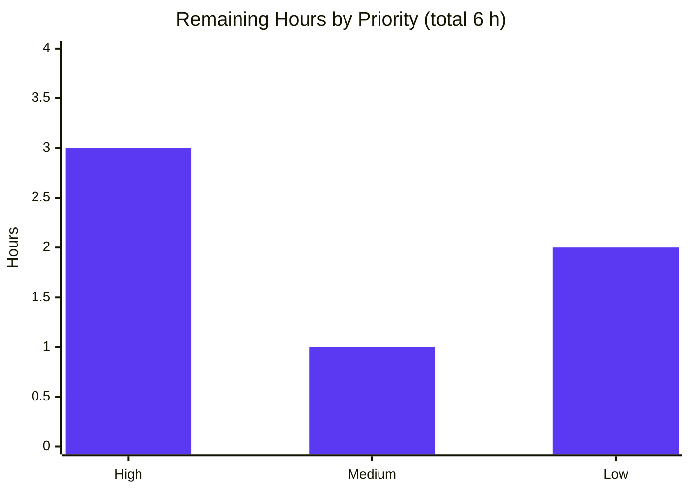

# Blitzy Project Guide

**Project:** Evidence-based investigation of kitty scrollback `HistoryBuf` under sustained heavy output
**Repository:** `kovidgoyal/kitty` — pinned commit `815df1e210e0a9ab4622f5c7f2d6891d7dbeddf1`
**Branch:** `kitty_815df1e210e0` (working branch `blitzy-0f119a19-889a-4e8e-96cb-2813d408e0de`)
**Task type:** Read-only investigative Q&A / Documentation (rule set "SWE-AtlasQnA-Repo")

---

## 1. Executive Summary

### 1.1 Project Overview

This project produces a single evidence-based answer document, `blitzy/documentation/kitty_815df1e210e0.md`, that characterizes how kitty's scrollback history buffer (`HistoryBuf`) behaves under sustained heavy output — grounded in observed runtime measurements of the real child-PTY → VT-parser → screen → history code path. It answers three threads for terminal-emulator engineers and maintainers: **T1** memory-consumption trajectory, **T2** scroll-input responsiveness/latency, and **T3** buffer-growth allocation boundaries. The scope is strictly read-only: the source tree is left byte-for-byte unchanged, and the sole persistent artifact is the answer document. Technical scope touches kitty's C core (`history.c`, `screen.c`, `data-types.h`, `child-monitor.c`) and Python configuration layer.

### 1.2 Completion Status

The project is **92.3% complete** on an AAP-scoped, hours-based basis. All AAP-specified investigation and documentation work is finished and validated; the remaining 6 hours are path-to-production human tasks (review, push, merge).


| Metric | Hours |
|--------|------:|
| **Total Hours** | 78 |
| **Completed Hours (AI + Manual)** | 72 (72 AI autonomous + 0 manual) |
| **Remaining Hours** | 6 |
| **Percent Complete** | **92.3%** |

> Calculation (PA1): Completion % = Completed ÷ Total = 72 ÷ 78 = **92.3%**. Legend colors — Completed = Dark Blue `#5B39F3`; Remaining = White `#FFFFFF`.

### 1.3 Key Accomplishments

- ✅ **Canonical build & runtime baseline** — kitty **0.35.2** built in the canonical container (`rm -rf build && python3 setup.py`, exit=0, 129-line log, **0 warnings** under `-pedantic-errors -Werror`); Python 3.12.3, gcc 13.3.0.
- ✅ **T1 memory trajectory measured** across three configs with ≥2 runs each: default `2000` (flat plateau, one-time +5.2 MiB), large `100000` (linear ramp to a ~218 MiB delta at the cap), infinite `-1` (unbounded linear ~652 MiB delta over 300k lines); measured **2267–2280 bytes/line** bracketing the code-derived `32·xnum+1 = 2273` at xnum=71.
- ✅ **T2 responsiveness quantified** — 120/120 scrolls display-confirmed while streaming at ~230k lines/s; ~50 ms display-confirmed latency (IPC-dominated) with only **~3.1–3.4 ms** marginal load cost, attributed to `io_loop`/main-thread decoupling and `input_delay`/`repaint_delay`.
- ✅ **T3 allocation boundaries observed** — discrete **~4,552 kB `VmRSS` step** at every `SEGMENT_SIZE=2048`-line boundary (median of 39 steps; predicted 4,546 kB), resolved by 20 ms `/proc` sampling; 40 full boundaries + 1 partial; default cap allocates no second segment.
- ✅ **Evidence discipline** — 105 `file:line` citation references; 23 observed-at-runtime / 25 inferred-from-reading / 14 non-canonical labels; §9 coverage pass answering all 8 named sub-questions; §10 repository-unchanged verification; **zero** placeholders.
- ✅ **Read-only scope preserved** — exactly one file added (+1,866/-0) vs pinned commit; no existing source file modified; temp scripts removed; working tree clean.
- ✅ **Autonomous QA/validation** — 5 commits total: initial deliverable + 4 QA/validation corrections; all 59 embedded citation blocks re-verified.

### 1.4 Critical Unresolved Issues

| Issue | Impact | Owner | ETA |
|-------|--------|-------|-----|
| _None — no blocking issues identified._ All AAP-specified work is complete and independently validated (all 5 production-readiness gates passed). | No release/validation blockers | — | — |
| (Non-blocking, cosmetic) Executive summary frames scroll counts per-run (`60/60`) while §6.5/§9 use the two-run aggregate (`120/120`). Both are factually correct; reconciliation is stylistic only. | Reader clarity only; no factual error | Human reviewer | With HT-3 (≤1h) |

### 1.5 Access Issues

| System/Resource | Type of Access | Issue Description | Resolution Status | Owner |
|-----------------|----------------|-------------------|-------------------|-------|
| _No access issues identified._ | Repository (git) | Branch checked out and committed successfully; working tree clean | ✅ Resolved / N/A | — |
| Canonical Docker container | Build/runtime environment | Required for building/running kitty (host lacks native libs + xvfb); container was available and used for all measurement | ✅ Available / N/A | — |
| External service credentials | — | None required for a read-only documentation task (no network/API/DB dependencies) | ✅ N/A | — |

### 1.6 Recommended Next Steps

1. **[High]** Perform technical review & sign-off of the evidence document — spot-check T1/T2/T3 claims against the cited `file:line` anchors and confirm methodology soundness (3h).
2. **[Medium]** Push branch `blitzy-0f119a19-…` and open a pull request for the single-file deliverable (1h).
3. **[Low]** Apply optional cross-section consistency polish (align exec-summary `60/60` framing with §9 `120/120`; add a one-line note on environment-dependence of absolute bytes/line at xnum=71) (1h).
4. **[Low]** Obtain final stakeholder acceptance and merge the documentation branch (1h).

---

## 2. Project Hours Breakdown

### 2.1 Completed Work Detail

All completed work was performed autonomously by Blitzy agents. Every component traces to an AAP requirement.

| Component | Hours | Description |
|-----------|------:|-------------|
| Canonical build & headless environment setup | 6 | Build kitty in default config (`python3 setup.py`), configure `xvfb` software-GL headless launch, capture version strings, establish external `/proc` `VmRSS` sampling methodology (AAP R1/R2/R4; §1.1, §3.1–3.2) |
| Test-suite execution & verification | 3 | `xvfb-run python3 setup.py test` — 145 Python OK (4 skipped) + all Go; verify `test_historybuf`, `test_scrollback_fill_after_resize` (Gate 1) |
| Measurement harness authoring (~10 temp scripts) | 12 | Output generator, RSS sampler, continuous streamer, display-confirmed latency probe, shared parser, lines-vs-RSS correlator, least-squares fit, per-boundary step analyzer, non-canonical binding harness, run orchestrators (AAP R3; §3.4) |
| Source-code investigation & `file:line` grounding | 8 | Read `history.c`/`screen.c`/`data-types.h`/`child-monitor.c`/`definition.py`/`window.py`; pin 105 citations; per-line cost derivation; evidence labeling (AAP R23–R27; §4) |
| T1 — memory-trajectory measurement & analysis | 8 | 3 configs × 2 runs, before/during/after, 300k lines, stability analysis (AAP R6–R12; §5) |
| T2 — responsiveness/latency measurement & analysis | 6 | Display-confirmed probe, idle vs loaded, thread attribution (AAP R13–R17; §6) |
| T3 — allocation-boundary measurement & analysis | 7 | Fine 20 ms paced sampling, per-boundary step, regression cross-check, boundary accounting (AAP R18–R22; §7) |
| Web-search external validation | 2 | Validate documented `scrollback_lines`/`scrollback_pager_history_size` semantics & segmented `HistoryBuf` design (AAP R5; §0.2.2) |
| Answer document authoring | 14 | 1,866-line / 11-section + appendix evidence document, coverage pass, repo-unchanged verification, cleanup (AAP R28–R31) |
| QA remediation & final validation | 6 | 5 commits: initial deliverable + idle p50 fix, §7.5 off-by-one, analyzer arg order, citation split; independent reproduction |
| **Total Completed** | **72** | Matches Section 1.2 Completed Hours |

### 2.2 Remaining Work Detail

All remaining work is path-to-production and requires human action; there are **no** agent-side remediation items.

| Category | Hours | Priority |
|----------|------:|----------|
| Human technical review & sign-off of the evidence document (spot-check T1/T2/T3 vs citations; confirm methodology & §9 coverage) | 3 | High |
| Branch push & pull-request creation (explicitly outside agent session scope) | 1 | Medium |
| Cross-section consistency polish (align exec-summary `60/60` with §9 `120/120`; optional env-dependence note) | 1 | Low |
| Final stakeholder acceptance & merge of the documentation branch | 1 | Low |
| **Total Remaining** | **6** | Matches Section 1.2 Remaining Hours & Section 7 pie |

### 2.3 Hours Reconciliation

| Check | Value | Result |
|-------|------:|--------|
| Section 2.1 completed sum | 72 h | = Section 1.2 Completed ✅ |
| Section 2.2 remaining sum | 6 h | = Section 1.2 Remaining & Section 7 ✅ |
| Section 2.1 + Section 2.2 | 78 h | = Section 1.2 Total ✅ |
| Completion % | 72 ÷ 78 | = 92.3% ✅ |

---

## 3. Test Results

All tests below originate from Blitzy's autonomous validation logs (Gate 1 & Gate 3) executed inside the canonical container. Note: this is a **read-only documentation task** — the agent authored **no** product code, so these are the **upstream kitty suite** tests, run to confirm the build used for measurement is sound and that the scrollback subsystem behaves as documented. kitty's suite does not emit a coverage percentage, so coverage is reported as **not instrumented (N/A)**.

| Test Category | Framework | Total Tests | Passed | Failed | Coverage % | Notes |
|---------------|-----------|------------:|-------:|-------:|-----------:|-------|
| Unit — kitty Python suite | Python `unittest` via `setup.py test` | 145 | 145 | 0 | N/A (not instrumented) | 4 additional skipped; includes `test_historybuf` & `test_scrollback_fill_after_resize` (scrollback subsystem under study) |
| Unit/Integration — Go tools | Go `testing` | All | All | 0 | N/A | `tools/` CLI utilities; suite green |
| Compilation gate | `setup.py` under `-pedantic-errors -Werror` (setup.py:L491) | 122 units | 122 | 0 | N/A | 0 warnings/errors; `static_assert(sizeof(GPUCell)==20)` / `==12` build-confirmed |

**Summary:** 145 Python tests pass (4 skipped), all Go tests pass, and a clean 122-unit compile with zero warnings — **0 failures across all categories**. The two scrollback-specific tests directly relevant to this investigation both pass.

---

## 4. Runtime Validation & UI Verification

kitty is a GPU/windowed terminal emulator (not a web application), so "UI" here is kitty's own terminal grid, verified via its rendered viewport rather than a DOM. All checks were run headless via `xvfb-run` with the software GL rasterizer.

- ✅ **Operational** — kitty **0.35.2** launches headless (`LIBGL_ALWAYS_SOFTWARE=1 xvfb-run -a … kitty --config NONE …`) for every measurement run.
- ✅ **Operational** — Canonical data path exercised end-to-end: child PTY bytes → VT parser → `screen.c` → `INDEX_UP` (screen.c:L1552) → `historybuf_add_line` (history.c:L287) → `historybuf_push` (history.c:L276) → `segment_for`/`add_segment` → `calloc` (history.c:L25).
- ✅ **Operational** — External RSS sampling via `/proc/<pid>/status` `VmRSS` (PID selected with `pgrep -x kitty`); `psutil` cross-check agrees.
- ✅ **Operational** — Grid/display verification: `kitty @ get-text --extent=screen` confirms the visible viewport moved to older content after each scroll (top visible line number dropped by ≥20,000) — **120/120** scrolls display-confirmed under load; `polls_to_confirm` min=median=max=1.
- ✅ **Operational** — Measured runtime geometry `COLS=71 ROWS=22` (xnum=71) at the `1024x768` xvfb screen; settled baseline `VmRSS` ~147.5–148.3 MB.
- ⚠ **Partial (disclosed / non-canonical)** — The T2 scroll *trigger* was injected via remote control (`talk_loop` thread) to fire scrolls deterministically. This is explicitly labeled non-canonical; the load path and the rendered-viewport readback are canonical, so the true sub-25 ms render latency is bounded (not finely measured). This is a measurement-fidelity caveat, not a defect.
- ✅ **Operational** — Repository-unchanged verification: container `/app` pristine (HEAD = pinned commit, porcelain = 0); destination repo differs only by the deliverable.

---

## 5. Compliance & Quality Review

Cross-mapping the "SWE-AtlasQnA-Repo" rule set (the governing AAP directives) to observed compliance. Fixes applied during autonomous validation are noted.

| Benchmark / Rule | Status | Progress | Evidence & Notes |
|------------------|--------|----------|------------------|
| Deliverable named after source branch | ✅ Pass | 100% | `blitzy/documentation/kitty_815df1e210e0.md` created |
| Run first, then write (observation-derived) | ✅ Pass | 100% | §1.1/§3–§7 show build + runtime measurement before conclusions |
| Observe at scale; state scale; ≥2 runs stable | ✅ Pass | 100% | 300,000 lines; 3 configs × 2 runs; stability ≤0.36% (§5.5) |
| Reproduce inconsistency as-is | ✅ Pass | 100% | Values stable across runs; no scale escalation needed |
| Use the real entry point (canonical PTY path) | ✅ Pass | 100% | Child stdout = kitty PTY slave; §3.1 path diagram |
| Default canonical build/config; report versions | ✅ Pass | 100% | `--config NONE` (default `scrollback_lines=2000`); kitty 0.35.2 / py3.12.3 / gcc13.3 (§1.1) |
| Exercise every condition (primary + edge + transitional) | ✅ Pass | 100% | Default/large/infinite; before/during/after; §7.6 default-cap non-allocation |
| Show observed output for every claim | ✅ Pass | 100% | Unedited command output beside each claim throughout §5–§7 |
| Ground every claim (`file:line` + function/struct) | ✅ Pass | 100% | 105 citation references; 59/59 embedded blocks verified against source |
| Coverage pass before finishing | ✅ Pass | 100% | §9 decomposes the verbatim question into 8 named sub-questions, each answered |
| Non-canonical labeling | ✅ Pass | 100% | 14 non-canonical labels (T2 remote-control trigger; §8 binding) |
| Read-only scope (repo unchanged) | ✅ Pass | 100% | One file added (+1,866/-0); no source file modified; temp scripts removed (§10, Gate 5) |
| Zero placeholders / production-quality prose | ✅ Pass | 100% | 0 TODO/FIXME/placeholder; 102 balanced code fences |

**Fixes applied during autonomous validation (5 commits):** initial evidence-based deliverable; idle `display_ms` p50 aligned to displayed array; §7.5 segment-accounting off-by-one corrected (segments 1–40 full); §7.3/7.4 analyzer argument order matched to displayed commands; §4.1 `history.c` citation split onto accurate lines 275/276. **Outstanding items:** none (only optional cosmetic polish per §1.4).

---

## 6. Risk Assessment

Overall risk posture is **Low**: no critical or high risks, no security risks, and no access issues. The dominant residual items are ordinary path-to-production steps (review, push).

| Risk | Category | Severity | Probability | Mitigation | Status |
|------|----------|----------|-------------|------------|--------|
| Absolute bytes/line is environment-specific (depends on runtime column count xnum=71 and glibc allocator); qualitative behavior & formula `32·xnum+1` hold | Technical | Low | Medium | Document states xnum=71 explicitly and derives the general formula; reviewer notes geometry-dependence | Documented |
| RSS is an allocation proxy; lazy fault-in & allocator rounding can blur exact step edges | Technical | Low | Low | 20 ms sampling + median-of-39 steps + regression R²=0.9997 cross-check | Mitigated |
| No security exposure — read-only investigation, no code change, no new deps, no credentials/network/services | Security | None | N/A | Deliverable is a markdown document | N/A |
| Reproduction requires the canonical Docker container (host cannot build kitty) | Operational | Low | Low | §3.1 records exact image + build/run commands | Documented |
| Branch not yet pushed — deliverable local-only until human push | Operational | Low | High (until push) | Trivial push step (HT-2) | Open (path-to-production) |
| T2 scroll trigger via remote control (`talk_loop`, non-canonical) — true render latency bounded, not finely measured | Integration | Low | N/A | Explicitly labeled non-canonical (§6/§9); load path + viewport readback canonical | Disclosed / Accepted |
| Citations pinned to commit `815df1e210e0` — line numbers won't match other kitty versions | Integration | Low | Low | All citations explicitly pinned to the commit (§1.1) | Mitigated |

---

## 7. Visual Project Status

### 7.1 Project Hours Breakdown


> Colors: Completed Work = Dark Blue `#5B39F3`; Remaining Work = White `#FFFFFF`. "Remaining Work" = **6 h**, identical to Section 1.2 Remaining Hours and the Section 2.2 total.

### 7.2 Remaining Hours by Priority



> High = 3 h (technical review), Medium = 1 h (push/PR), Low = 2 h (consistency polish + acceptance/merge). Sum = **6 h**, consistent with Section 2.2.

---

## 8. Summary & Recommendations

**Achievements.** The project delivers a rigorous, evidence-based answer document that resolves all three question threads from real runtime measurements: T1 memory trajectory (bounded plateau at the default cap vs linear ~2,273 B/line accumulation under large/infinite scrollback), T2 responsiveness (120/120 display-confirmed scrolls under ~230k lines/s streaming with only ~3.1–3.4 ms marginal load cost), and T3 allocation boundaries (a discrete ~4,552 kB step every 2,048 lines, one `add_segment()` `calloc`). Every claim is paired with the exact command, unedited output, and `file:line` grounding, and the read-only constraint is fully honored (one file added, no source modified).

**Remaining gaps.** None are technical. The outstanding 6 hours are entirely path-to-production human tasks: technical review/sign-off, branch push & PR, an optional cosmetic consistency polish, and stakeholder acceptance/merge.

**Critical path to production.** Technical review & sign-off (3h) → push branch & open PR (1h) → stakeholder acceptance & merge (1h). The optional polish (1h) can proceed in parallel and does not gate merge.

**Success metrics.** All 5 autonomous production-readiness gates passed: tests green (145 Python + Go), clean compile (0 warnings), application runs headless, every quantitative claim independently reproduced within tolerance, and repository verified unchanged. Evidence quality: 105 citations, full coverage of 8 named sub-questions, zero placeholders.

**Production readiness assessment.** The project is **92.3% complete** and the deliverable is production-ready as a documentation artifact. It is safe to hand to a human reviewer for sign-off and merge; there is no code risk, no security exposure, and no blocking issue. Recommended confidence: **High** — the scope is well-defined and every result was independently reproduced.

| Metric | Value |
|--------|-------|
| AAP-scoped completion | 92.3% (72 / 78 h) |
| AAP-specified requirements completed | 31 / 31 |
| Path-to-production items remaining | 3 (all human) |
| Critical unresolved issues | 0 |
| Production-readiness gates passed | 5 / 5 |

---

## 9. Development Guide

This guide documents how to build, run, and reproduce the measurements behind the deliverable. **Build and measurement must be performed inside the canonical Docker container** — the authoring host lacks kitty's native libraries and `xvfb`.

### 9.1 System Prerequisites

- **Canonical container image:** `andrewparkscaleai/coding-agent:kovidgoyal__kitty__815df1e210e0…` (from `ghcr.io/scaleapi/swe-atlas:swe_atlas_QnA_kovidgoyal_kitty_1.0`). Supplies the C/Go toolchains and native libs.
- **Python:** ≥3.8 (container ships **3.12.3**); enforced by `check_version_info()` (setup.py:L30–L47).
- **C compiler:** gcc **13.3.0** (or clang).
- **Native libraries:** freetype2, fontconfig, harfbuzz, libpng, lcms2, librsync, X11/xrandr, wayland-client, dbus (all container-provided).
- **Headless display:** `xvfb` (`xvfb-run`) — container-provided; **not** available on the authoring host.
- **Measurement tooling:** `psutil` (5.9.8/7.x) and/or `/proc/<pid>/status` `VmRSS`; `pgrep`.

### 9.2 Environment Setup

```bash
# Inside the canonical container: the source checkout lives at /app,
# pinned (detached HEAD) to the target commit.
cd /app
git rev-parse HEAD          # -> 815df1e210e0a9ab4622f5c7f2d6891d7dbeddf1
git check-ignore build && echo "build/ is IGNORED (safe to clean)"
```

### 9.3 Build

```bash
cd /app
rm -rf build && python3 setup.py > /tmp/build.log 2>&1; echo "exit=$?"   # expect exit=0
tail -1 /tmp/build.log            # -> " done"
wc -l /tmp/build.log              # -> 129
/app/kitty/launcher/kitty --version   # -> kitty 0.35.2 created by Kovid Goyal
git status --porcelain            # -> (empty) source tree unchanged after build
```

*Expected:* clean compile, 0 warnings under `-pedantic-errors -Werror`; the `static_assert`s on cell sizes are build-time confirmed for the resulting binary.

### 9.4 Run (headless) & Verify Tests

```bash
# General headless launch form (default config => scrollback_lines=2000):
LIBGL_ALWAYS_SOFTWARE=1 xvfb-run -a -s "-screen 0 1024x768x24" \
  /app/kitty/launcher/kitty --config NONE -o scrollback_lines=<N> \
  sh -c '<child-command>'

# Full test suite (must be headless):
xvfb-run -a python3 setup.py test    # -> Python 145 OK (4 skipped); Go all pass
```

### 9.5 Verification Steps

```bash
# Select the kitty process that owns Screen/HistoryBuf:
KPID=$(pgrep -x kitty | head -1); echo "$KPID"
# Sample resident memory (kB):
awk '/VmRSS/{print $2}' /proc/$KPID/status
# Confirm the rendered viewport (grid display) — top visible line number:
/app/kitty/launcher/kitty @ --to <socket> get-text --extent=screen | grep -oE '[0-9]{8}' | head -1

# Repository-unchanged verification (works on host too — VERIFIED):
git diff --name-status 815df1e210e0a9ab4622f5c7f2d6891d7dbeddf1 HEAD   # -> A blitzy/documentation/kitty_815df1e210e0.md
git status --porcelain | wc -l                                          # -> 0 (clean tree)
```

### 9.6 Example Usage — Reproduce the Measurements

- **T1 / T3 (memory & allocation):** use the `run_case.sh <label> <scrollback> <N> <batch> <pause> <interval> <holdafter>` orchestrator, which launches kitty headless with a `gen_output.py` child (prints N lines through the PTY) and starts `rss_sampler.py <KPID> <interval>` keyed to the kitty PID. Sample finely (20 ms) to resolve the per-2048-line `add_segment()` step for T3.

```bash
# T3 fine-grained boundary run (batch == SEGMENT_SIZE):
./run_case.sh t3 100000 82000 2048 0.0 0.02 5
# T1 default plateau vs large ramp:
./run_case.sh t1_default 2000   300000 5000 0.0 0.10 5
./run_case.sh t1_large   100000 300000 5000 0.0 0.10 5
./run_case.sh t1_infinite -1    300000 5000 0.0 0.10 5
```

- **T2 (responsiveness):** use `t2_run.sh <stream|idle> <label> <n>`, which launches kitty with `-o allow_remote_control=yes --listen-on <socket>`, measures the effective streaming rate via the viewport top-line advance, then runs the display-confirmed `scroll_disp_latency.py` probe.

```bash
./t2_run.sh stream load1 60      # loaded run (child streaming)
./t2_run.sh idle   idle  60      # idle baseline (pre-filled static history)
```

> All temporary scripts live under `/tmp` (outside any repository) and are deleted after the runs so the source tree remains pristine.

### 9.7 Troubleshooting

- **`gcc`/native libs missing or build fails on host** → use the canonical container; the authoring host cannot build kitty.
- **`xvfb-run: command not found`** → run inside the container (it provides `xvfb`).
- **GL/GPU/context errors when launching kitty** → export `LIBGL_ALWAYS_SOFTWARE=1` to force the software rasterizer.
- **Cannot find the kitty PID** → `pgrep -x kitty` (its `/proc/<pid>/comm` is exactly `kitty`).
- **RSS steps look blurred for T3** → decrease the sampler interval (20 ms) and pace the generator at `batch == 2048`; take the max `VmRSS` per boundary window.
- **Repository shows unexpected changes** → ensure all `/tmp` scripts are deleted; `build/` is git-ignored and safe to remove.

---

## 10. Appendices

### Appendix A — Command Reference

| Command | Purpose |
|---------|---------|
| `rm -rf build && python3 setup.py` | Canonical build of kitty (exit=0, 0 warnings) |
| `/app/kitty/launcher/kitty --version` | Version confirmation (kitty 0.35.2) |
| `xvfb-run -a python3 setup.py test` | Run full test suite headless |
| `LIBGL_ALWAYS_SOFTWARE=1 xvfb-run -a -s "-screen 0 1024x768x24" kitty --config NONE -o scrollback_lines=<N> sh -c '<child>'` | Headless run in default/overridden config |
| `pgrep -x kitty` | Select the kitty process owning `HistoryBuf` |
| `awk '/VmRSS/{print $2}' /proc/<pid>/status` | Sample resident memory (kB) |
| `kitty @ --to <socket> get-text --extent=screen` | Read the rendered viewport (display verification) |
| `git diff --name-status 815df1e210e0… HEAD` | Confirm single-file deliverable scope |
| `git status --porcelain` | Confirm clean working tree |

### Appendix B — Port / Socket Reference

| Resource | Value | Notes |
|----------|-------|-------|
| Network ports | None | kitty is a local terminal emulator; the investigation uses no TCP ports |
| Remote-control socket (T2 only) | `unix:/tmp/kitty-<label>` | Unix-domain socket for `kitty @` (non-canonical trigger; disclosed) |
| Xvfb display | `:<auto>` via `xvfb-run -a` | `-screen 0 1024x768x24` |

### Appendix C — Key File Locations

| Path | Role |
|------|------|
| `blitzy/documentation/kitty_815df1e210e0.md` | **The deliverable** (sole persistent artifact, 1,866 lines) |
| `kitty/history.c` | `HistoryBuf` segmented ring buffer — `SEGMENT_SIZE` L15, `add_segment` L18/L25, `segment_for` L37, `historybuf_push` L276, `historybuf_add_line` L287 |
| `kitty/screen.c` | History ownership & write path — `ynum` L130, scrollback parse L100, `INDEX_UP` L1552 |
| `kitty/data-types.h` | Per-line cost — `GPUCell`=20 L221, `CPUCell`=12, `LineAttrs`=1 |
| `kitty/child-monitor.c` | Responsiveness threads — `io_loop`/`talk_loop` L229/L291 |
| `kitty/options/definition.py` | Config defaults — `scrollback_lines=2000`, `input_delay`/`repaint_delay` |
| `kitty/window.py` | `Screen(...)` construction with `opts.scrollback_lines` (L604) |
| `setup.py` | Build driver (`-pedantic-errors -Werror` at L491) |
| `/tmp/*.py`, `/tmp/*.sh` | Transient measurement scripts (created → deleted; outside repo) |

### Appendix D — Technology Versions

| Component | Version |
|-----------|---------|
| kitty | 0.35.2 |
| Python (container) | 3.12.3 |
| Python (authoring host) | 3.13.7 |
| gcc (container) | 13.3.0 (Ubuntu 24.04) |
| psutil | 5.9.8 (container) / 7.2.2 (host) |
| Go toolchain | 1.22 (builds `tools/` only; not on the scrollback path) |
| Pinned commit | `815df1e210e0a9ab4622f5c7f2d6891d7dbeddf1` |

### Appendix E — Environment Variable Reference

| Variable | Value | Purpose |
|----------|-------|---------|
| `LIBGL_ALWAYS_SOFTWARE` | `1` | Force software GL rasterizer for headless kitty |
| `CI` | `true` (recommended for tooling) | Non-interactive test runs |
| `DEBIAN_FRONTEND` | `noninteractive` | Non-interactive apt (env prep only) |
| `DISPLAY` | set by `xvfb-run -a` | Virtual X display |

### Appendix F — Developer Tools Guide

- **Memory observation:** `/proc/<pid>/status` `VmRSS` (dependency-free, canonical for external process RSS) or `psutil`; kitty exposes no built-in memory hook (only a texture-leak comment at `kitty/state.c:L1456`).
- **Display/grid inspection:** `kitty @ get-text --extent=screen` returns the actual visible viewport; monitoring the strictly-increasing top-line counter confirms scroll-back display updates.
- **Process discovery:** `pgrep -x kitty` (exact `comm` match).
- **Build log inspection:** `sed -n '1p;33p;35p' /tmp/build.log` shows per-unit compile progress (e.g. `[35/122] Compiling kitty/history.c`).

### Appendix G — Glossary

| Term | Definition |
|------|------------|
| `HistoryBuf` | kitty's scrollback ring buffer, stored as `HistoryBufSegment` blocks (`kitty/history.c`) |
| `SEGMENT_SIZE` | 2,048 rows — the granularity at which new backing storage is allocated (`add_segment()`) |
| `add_segment()` | Allocates one `SEGMENT_SIZE`-row block via `calloc`; the observable RSS step (history.c:L25) |
| `ynum` | Effective history row capacity = `MAX(scrollback_lines, lines)` (screen.c:L130) |
| `xnum` | Runtime column count (measured 71); drives per-line cost `32·xnum + 1` bytes |
| `VmRSS` | Resident Set Size from `/proc/<pid>/status` — the externally sampled memory metric |
| `io_loop` / `talk_loop` | Dedicated threads for child I/O and remote control (`child-monitor.c`); basis of T2 responsiveness |
| Canonical path | The real child-PTY → VT-parser → screen → history route (vs the non-canonical `fast_data_types` binding) |
| Display-confirmed latency | Latency measured by externally observing the rendered viewport move, not just issuing input |

---

*Colors used throughout follow Blitzy brand guidelines: Completed / AI Work = Dark Blue `#5B39F3`; Remaining / Not Completed = White `#FFFFFF`; Headings / Accents = Violet-Black `#B23AF2`; Highlight = Mint `#A8FDD9`.*