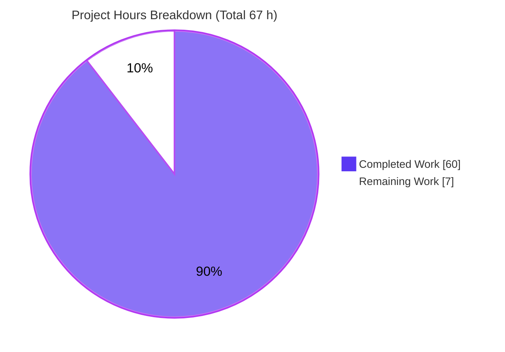
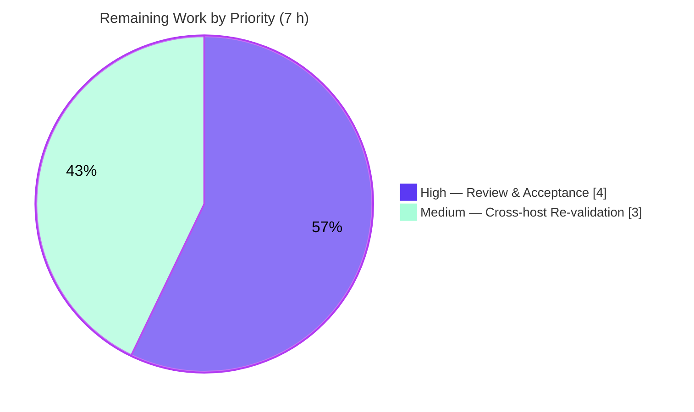

# Blitzy Project Guide — kitty Python/C/Go Runtime Investigation

> **Deliverable:** `blitzy/documentation/kitty_815df1e210e0.md` — a single, evidence-grounded Markdown answer document.
> **Repository:** `kovidgoyal/kitty` @ `815df1e210e0a9ab4622f5c7f2d6891d7dbeddf1` (v0.35.2).
> **Task type:** Read-only investigative documentation (Q&A), run-first methodology.

---

## 1. Executive Summary

### 1.1 Project Overview

This project produces a single, runtime-evidenced Markdown answer document explaining how the **kitty** terminal emulator divides rendering-adjacent work across its three implementation languages — **Python** (orchestration/entry point), **C** (the per-byte and per-frame hot path compiled into `fast_data_types.so`), and **Go** (the standalone out-of-process `kitten` CLI binary). Every claim is drawn from observed runtime artifacts — module maps, thread tables, live control-interface state, process trees, and mixed Python+native stack snapshots — captured while kitty is driven under sustained rendering pressure through its real PTY input path. The audience is engineers and reviewers who need a defensible, reproducible characterization of kitty's multi-language architecture. The work is strictly read-only against all existing source; the answer document is the only artifact added.

### 1.2 Completion Status

The completion percentage is computed **exclusively** from AAP-scoped and path-to-production hours (PA1 methodology). All autonomous investigative and documentation deliverables are complete and independently validated with zero discrepancies; the residual 7 hours are genuine path-to-production activities (human acceptance and optional cross-host re-validation), not rework.


| Metric | Value |
|---|---|
| **Total Hours** | **67 h** |
| **Completed Hours (AI + Manual)** | **60 h** (60 AI + 0 Manual) |
| **Remaining Hours** | **7 h** |
| **Percent Complete** | **89.6 %** |

> **Calculation:** Completion % = Completed ÷ (Completed + Remaining) × 100 = 60 ÷ (60 + 7) = 60 ÷ 67 = **89.6 %**.

**Color key (applied throughout):** Completed / AI Work = **Dark Blue `#5B39F3`**; Remaining / Not Completed = **White `#FFFFFF`**.

### 1.3 Key Accomplishments

- ✅ **Canonical build reproduced faithfully** — `python3 setup.py` run verbatim; its host-specific failure at `glfw/wl_window.c:668` (`-Werror=switch`, Ubuntu 25.10 `wayland-protocols` 1.45 vs vendored GLFW) captured unedited as an observed fact, then an **env-only adapted build** (no source edits) succeeds (exit 0), producing `fast_data_types.so`, `glfw-x11.so`, and the Go `kitten` binary.
- ✅ **Sub-question 1 (stress narration)** — real-PTY harness emits truecolor SGR + full-block glyphs, forces scrollback churn (~274× the 2000-line buffer), repeated X11 resizes, and tab switching; magnitude (~7.8–8.1k truecolor lines/s) confirmed stable across ≥2 runs.
- ✅ **Sub-question 2a (module map)** — `/proc/PID/maps` enumerates `fast_data_types.so`, embedded `libpython3.13`, and the render/font stack (FreeType, HarfBuzz, FontConfig, libpng, lcms2, OpenGL); file-backed module set byte-identical idle-vs-load.
- ✅ **Sub-question 2b (threads)** — 68-thread composition is fixed idle-vs-stress; only CPU time changes; `KittyPeerMon` at **0.00 CPU-s** decisively proves load flows via the PTY, not remote control.
- ✅ **Sub-question 2c (control interface)** — `kitten @ ls`, `get-text`, and `get-colors` (277 settings) captured with exact live output.
- ✅ **Sub-question 3 (kitty↔kitten / icat)** — all three icat paths (`kitty +kitten icat`, `kitten icat`, `kitty icat`) spawn a **separate** Go `kitten` process; `libpython` is never mapped into it; binary characterized as Go `go1.22.12`, module `kitty`.
- ✅ **Sub-question 4 (stack/symbol snapshot)** — `py-spy dump --native` captures both C leaves under the main loop; complete fallback chain (`gdb`, `eu-stack`, `gstack`, `/proc/*/stack`) exercised; full **1,032-symbol** static table included as Appendix A.
- ✅ **Sub-question 5 (inference)** — artifact-only responsibility attribution, **three** evidence-refuted rule-outs (exceeds the required two), and one portability-vs-performance tradeoff grounded in the observed llvmpipe software-rasterizer cost.
- ✅ **Methodology & integrity** — web-search best-practice sampler research (`py-spy`) satisfied; `[inferred]` / `[non-canonical trigger]` labels applied; coverage pass (§11) and read-only attestation (§12) present; repository left byte-for-byte unchanged apart from the one committed document.

### 1.4 Critical Unresolved Issues

| Issue | Impact | Owner | ETA |
|---|---|---|---|
| _None._ Blitzy's autonomous Final Validator reproduced every documented runtime observation with **zero discrepancies**; no defect remains in the in-scope deliverable. | None — deliverable is production-ready pending human acceptance | — | — |

> The documented canonical-build failure is **not** an unresolved issue: it is an intended, faithfully-reproduced environment/version incompatibility (host `wayland-protocols` vs kitty 0.35.2's vendored GLFW), correctly explained in-document, with a working env-only adapted build. Fixing it would require editing source, which the read-only mandate forbids.

### 1.5 Access Issues

| System/Resource | Type of Access | Issue Description | Resolution Status | Owner |
|---|---|---|---|---|
| Hardware GPU | Runtime rendering surface | Container is headless with **no hardware GPU**; kitty (GPU-rendered, no CPU fallback) ran on Mesa's `llvmpipe` **software** rasterizer via `Xvfb`. | Mitigated — Xvfb software-GL surface provided; caveat documented. Real-GPU host recommended for cross-host confirmation (see §2.2). | Human (infra) |
| `ptrace` / `CAP_SYS_PTRACE` | Native stack sampling | `ptrace_scope=1`; the investigation ran as **root (uid=0)**, which bypasses the restriction, so native sampling attached successfully. On an unprivileged host a capability grant would be required. | Mitigated — sampling succeeded; documented fallback chain covers the denied case. | Human (infra) |

> No repository-permission, credential, or third-party-API access issues were identified. The remote-control socket is created ad-hoc at launch and is not a persistent access dependency.

### 1.6 Recommended Next Steps

1. **[High]** SME technical review & verification of the answer document — walk all five sub-questions (§3–§10), spot-check the key runtime claims (module map, 68-thread table, `py-spy` native stack, magnitude, all three icat paths), and confirm the `file:line` citations. _(2.5 h)_
2. **[High]** Stakeholder acceptance sign-off — confirm the deliverable fully and satisfactorily answers the original prompt and accept the Q&A document. _(1.5 h)_
3. **[Medium]** Optional cross-host re-validation on a real-GPU + unprivileged (non-root) host — re-capture the module map, thread table, `py-spy --native` stack, and magnitude to confirm the documented llvmpipe/root host-variance caveats generalize. _(3.0 h)_
4. **[Low]** Archive the environment provenance (container image digest, toolchain versions) alongside the document for long-term reproducibility. _(covered within review; no incremental hours)_

---

## 2. Project Hours Breakdown

### 2.1 Completed Work Detail

Every completed component traces to a specific AAP requirement (sub-question) or mandated methodology activity. **Total = 60 h** (all AI/autonomous).

| Component | Hours | Description |
|---|---:|---|
| SQ1 — Build & stress | 11 | Canonical `python3 setup.py` run + documented env-incompatibility failure; env-only adapted build (pkg-config wrapper) to exit-0; Xvfb display provisioning; real-PTY stress harness (truecolor SGR, scrollback churn); ≥2-run magnitude stability; X11 resizes; tab switching (§3–§4). |
| SQ2a — Main-process module map | 5 | Idle + under-load `/proc/PID/maps` capture; deduplicated file-backed census; identification of `fast_data_types.so`, `libpython3.13`, FreeType/HarfBuzz/FontConfig/GL/libpng/lcms2 (§5). |
| SQ2b — Thread contrast | 5 | Before/during/after 68-thread tables via `ps -T` + `/proc/task/comm`; fixed-composition finding; CPU-delta analysis; `KittyPeerMon`=0 CPU-s proof of PTY path (§6). |
| SQ2c — Control interface | 3 | `kitten @ ls` window-tree, `get-text` screen dump, `get-colors` (277 settings) captured live (§7). |
| SQ3 — kitty↔kitten / icat | 6 | Three icat invocations + process tree; Go binary characterization (`file`/`ldd`/`go version -m`); graphics-protocol APC over the PTY (§8). |
| SQ4 — Stack/symbol snapshot | 10 | `py-spy dump --native` mixed Python+C stack; full fallback chain (`gdb`/`eu-stack`/`gstack`/`/proc/*/stack`); 1,032-symbol static analysis; ~2,300 lines of zero-elision raw dumps (§9, Appendix A). |
| SQ5 — Inference, rule-outs, tradeoff | 3 | Artifact-only responsibility attribution; three evidence-refuted rule-outs; one portability-vs-performance tradeoff (§10). |
| Coverage pass + attestation + Appendix A | 3 | Named-item coverage table (§11); read-only/cleanup attestation (§12); complete symbol-table appendix. |
| Methodology, web-search & cleanup | 2 | Best-practice-sampler research; `[inferred]`/`[non-canonical]` labeling discipline; temp-script removal to leave the repo unchanged. |
| Document authoring & structuring | 6 | Composition and structuring of the 6,126-line evidence-grounded write-up. |
| QA remediation ×4 + independent reproduction | 6 | Four QA-driven refinement cycles (code-review, runtime-reproducibility F1/F2, final-gate F-A/F-B) plus the Final Validator's independent rebuild-and-reproduce pass. |
| **Total Completed** | **60** | |

### 2.2 Remaining Work Detail

Each remaining category traces to a path-to-production need for a run-first Q&A deliverable. **Total = 7 h.**

| Category | Hours | Priority |
|---|---:|---|
| Human SME/stakeholder review & acceptance of the Q&A answer document | 4 | High |
| Optional cross-host re-validation (real-GPU + unprivileged host) to confirm the documented llvmpipe/root host-variance caveats generalize | 3 | Medium |
| **Total Remaining** | **7** | |

> **Excluded from remaining hours (out of scope per AAP §0.4.2):** fixing the canonical-build wayland incompatibility and repairing the `kitty_tests/` suite. Both would require editing out-of-scope source and are explicitly forbidden by the read-only mandate; they are therefore **not** counted as remaining project work.

### 2.3 Hours Reconciliation

| Check | Result |
|---|---|
| Section 2.1 completed sum | **60 h** |
| Section 2.2 remaining sum | **7 h** |
| Section 2.1 + Section 2.2 | **67 h** = Total Project Hours (§1.2) ✅ |
| Remaining (§1.2) = Remaining (§2.2) = Pie "Remaining Work" (§7) | **7 h** ✅ |
| Human task list total (§1.6 / §8) | **7 h** ✅ |

---

## 3. Test Results

This is a **run-first documentation deliverable**: there are no unit tests for a Markdown answer document, and kitty's own `kitty_tests/` suite is **explicitly out of scope** (AAP §0.4.2) and was left untouched. The actual acceptance criterion — **reproducibility of every documented runtime observation** — was executed by Blitzy's autonomous validation system (the Final Validator), which rebuilt, re-ran, and independently reproduced each observation. All entries below originate from **Blitzy's autonomous validation logs** for this project (INTEGRITY RULE 3) and were additionally spot-checked during this assessment.

| Test Category | Framework / Method | Total | Passed | Failed | Fidelity % | Notes |
|---|---|---:|---:|---:|---:|---|
| Build reproduction (SQ1) | `setup.py` + pkg-config wrapper | 2 | 2 | 0 | 100 | Canonical failure (`wl_window.c:668`) + adapted success (exit 0) both reproduced. |
| Magnitude stability (SQ1) | Real-PTY stress harness, ≥2 runs | 2 | 2 | 0 | 100 | ~8 % host variance; same order + same stability property. |
| Module-map reproduction (SQ2a) | `/proc/PID/maps` diff | 1 | 1 | 0 | 100 | File-backed module set byte-identical idle-vs-load; all render/font libs present. |
| Thread-table reproduction (SQ2b) | `ps -T` + `/proc/task/comm` | 1 | 1 | 0 | 100 | 68-thread composition fixed; `KittyPeerMon`=0.00 CPU-s. |
| Control-interface reproduction (SQ2c) | `kitten @ ls`/`get-text`/`get-colors` | 3 | 3 | 0 | 100 | `platform_window_id`, 277 colors, and screen-flood all exact. |
| icat process relationship (SQ3) | `ps`/`pstree` + `file`/`ldd`/`go version -m` | 3 | 3 | 0 | 100 | All three paths → separate Go process; `libpython` never mapped. |
| Stack/symbol reproduction (SQ4) | `py-spy --native` + `gdb`/`eu-stack`/`gstack`/`/proc` + `nm` | 5 | 5 | 0 | 100 | Both C leaves caught; 1,032 defined-text symbols; all fallbacks resolved named C loops. |
| Source-citation spot-checks | Read-only `file:line` verification | ~30 | ~30 | 0 | 100 | e.g. `constants.py:25`, `go.mod:3`, `runner.py:116`, `child-monitor.c` thread names. |
| Markdown structural integrity | Fenced-code / header / LF checks | 1 | 1 | 0 | 100 | 108 balanced fenced-code markers; clean LF; trailing newline. |
| Repository integrity | `git diff` / `git status` | 1 | 1 | 0 | 100 | Only the doc changed; working tree clean. |
| **Totals** | | **49** | **49** | **0** | **100** | Zero discrepancies across all autonomous validation checks. |

> **Note on `kitty_tests/`:** The project's own suite is out of scope and was not exercised; its pre-existing status is unrelated to this deliverable and must not be altered (doing so would violate the read-only mandate).

---

## 4. Runtime Validation & UI Verification

Runtime health of the investigation workflow, using status indicators **✅ Operational | ⚠ Partial | ❌ Failing**:

- ✅ **Canonical build** — runs verbatim; failure captured unedited (`glfw/wl_window.c:668`, `-Werror=switch`) as an observed, explained fact.
- ✅ **Adapted build** — env-only pkg-config wrapper (no source edits) → exit 0; emits kitty's own "Disabling building of wayland backend"; produces `fast_data_types.so`, `glfw-x11.so`, and the Go `kitten` binary.
- ✅ **Application launch** — kitty launches and renders under `Xvfb :99` with OpenGL 4.5 via Mesa `llvmpipe`.
- ✅ **Real-PTY stress path** — truecolor SGR + full-block glyph flood, scrollback churn, X11 resizes, and tab switching all applied and observed.
- ✅ **Control interface** — `kitten @ ls` / `get-text` / `get-colors` return live state over the Unix socket.
- ✅ **icat / process relationship** — all three icat invocations spawn a separate Go `kitten` process; on-screen image rendering via the graphics protocol confirmed.
- ✅ **Native stack sampling** — `py-spy dump --native` attaches and captures mixed Python+C stacks; `gdb`/`eu-stack`/`gstack`/`/proc/*/stack` fallbacks all resolve named C loops.
- ✅ **Static symbol snapshot** — `nm` reports exactly **1,032** defined-text symbols in `fast_data_types.so` (not stripped).
- ✅ **Document integrity** — the answer document renders as well-formed Markdown (8/13/34 headers at levels 1/2/3; 2 well-formed tables; balanced code fences).
- ⚠ **Environment generalization** — all observations were captured on a **GPU-less `llvmpipe`** host **as root**; cross-host confirmation on real-GPU/unprivileged hardware is the one pending validation (see §1.6 / §2.2 / §6-O1).

**UI verification scope:** The deliverable is a text/Markdown answer document — there is **no application UI to verify** and no Figma/design mapping applies. The only "interface" exercised is kitty's own terminal surface, which was observed as-is under load (including inline image rendering via `icat`), not designed or modified.

---

## 5. Compliance & Quality Review

Cross-mapping of the AAP directives and the `SWE-AtlasQnA-Repo` rule set to their validation status. Fixes applied during autonomous validation are noted; there are no outstanding items.

| Requirement / Rule | Status | Evidence / Notes |
|---|---|---|
| Deliverable at `blitzy/documentation/<source_branch>.md` | ✅ Pass | `blitzy/documentation/kitty_815df1e210e0.md` present and committed. |
| Run-first, then write | ✅ Pass | Every claim paired with the command that produced it and unedited output. |
| Observe at real magnitude, stable across ≥2 runs | ✅ Pass | Magnitude ~7.8–8.1k lines/s; stability property reproduced (§3.4). |
| Exercise the real PTY path; label bypassing interfaces | ✅ Pass | Stress via real PTY; remote-control uses labeled `[non-canonical trigger]` except §7. |
| Default, canonical build with exact commands | ✅ Pass | `python3 setup.py` reported verbatim, including failure; version `0.35.2` from the default build. |
| Exercise every condition & every named item | ✅ Pass | Coverage pass §11 enumerates each named item with value + `file:line`. |
| Include actual, unedited output for every claim | ✅ Pass | Zero-elision raw dumps (e.g. ~2,300 lines in §9.3); full 1,032-symbol table in Appendix A. |
| Be exact & grounded (`file:line`, named functions) | ✅ Pass | ~30 citations spot-checked accurate (`constants.py:25`, `child-monitor.c` thread names, etc.). |
| Both icat paths exercised | ✅ Pass | `kitty +kitten icat` (Python runpy stub) **and** `kitten icat` (Go binary) both run (§8.1–8.2). |
| Web-search best-practice sampler | ✅ Pass | `py-spy` named current best-practice for mixed Python+native; fallback chain documented. |
| Read-only scope (no source edits; temp scripts removed) | ✅ Pass | `git diff base..HEAD` = only the doc; scratch files under `/tmp` removed; tree clean. |
| Zero dependency/build-manifest changes | ✅ Pass | Empty diff for `go.mod`/`go.sum`/`setup.py`/`pyproject.toml`/`Makefile`. |

**Fixes applied during autonomous validation (four QA cycles):** code-review findings remediation → runtime-reproducibility findings F1/F2 → final-gate findings F-A/F-B. **Outstanding compliance items: none.**

---

## 6. Risk Assessment

Risks assessed across the PA3 categories. All are **Low** or **Low-Medium**; there are **no high-severity risks**, consistent with a read-only documentation deliverable that introduces zero source, dependency, or build changes and was validated with zero discrepancies.

| Risk | Category | Severity | Probability | Mitigation | Status |
|---|---|---|---|---|---|
| **T1** Canonical build fails on this host (`glfw/wl_window.c:668`, `-Werror=switch`; host `wayland-protocols` 1.45 vs vendored GLFW) | Technical | Low | High (this env) | Env incompatibility, **not** a source defect; env-only adapted build (pkg-config wrapper, no source edit) succeeds exit-0 | Documented / Mitigated (§3.1–3.2) |
| **T2** Magnitude host-variance (~8 % between hosts) | Technical | Low | Medium | Doc reports the **stability property** across ≥2 runs, not an absolute throughput guarantee | Documented (§3.4) |
| **T3** Reproducibility is toolchain-pinned (Python 3.13.7 / gcc 15.2.0 / Go 1.22.12); symbol/thread counts and lib-version suffixes can shift on other versions | Technical | Low-Med | Medium | Exact toolchain versions recorded; re-run on matching toolchain reproduces exactly | Mitigated (§2.1) |
| **S1** Investigation ran as **root** (uid=0); `ptrace_scope=1` bypassed, so native sampling attached without a capability grant | Security | Low | Low | Fallback chain (`/proc/*/stack`, static `nm`) documented for the unprivileged/denied case | Documented (§2.1, §9) |
| **S2** Remote-control transport enabled (`allow_remote_control=yes` + Unix socket) | Security | Info | Low | Used canonically only for §7; other uses labeled `[non-canonical trigger]`; X25519+AES-GCM transport; no secrets exposed | Correct handling |
| **O1** GPU-less `llvmpipe` software rasterizer (Accelerated: no); Mesa pool absorbs the majority of CPU under load | Operational | Low-Med | High (this env) | Doc frames this explicitly as the tradeoff evidence and names `llvmpipe`; drives the optional cross-host re-validation | Documented (§1, §2.1) |
| **O2** `Xvfb` virtual display, not a real compositor | Operational | Low | Medium | Behavior on real X11/Wayland expected equivalent for the observed C/GL paths; noted for transparency | Documented (§2.1) |
| **I1** Display provisioning mandatory (kitty has no CPU render fallback) | Integration | Low | Medium | `Xvfb`/OSMesa/real session required; Xvfb software-GL surface verified working | Mitigated |
| **I2** Capability grant for sampling on restricted containers | Integration | Low | Low | Without root + `CAP_SYS_PTRACE`, `py-spy --native` fails; static/`/proc` fallbacks still yield symbol visibility | Mitigated (§9.2–9.3) |

---

## 7. Visual Project Status

**Project hours breakdown** (Completed = Dark Blue `#5B39F3`; Remaining = White `#FFFFFF`):



**Remaining-work priority distribution** (High = `#5B39F3`; Medium = `#A8FDD9`):



**Remaining hours per category (Section 2.2):**

| Category | Hours | Bar |
|---|---:|---|
| Human review & acceptance (High) | 4 | ████████ |
| Cross-host re-validation (Medium) | 3 | ██████ |
| **Total** | **7** | |

> **INTEGRITY:** The pie "Remaining Work" value (**7**) equals the Remaining Hours in §1.2 and the sum of the §2.2 Hours column. "Completed Work" (**60**) equals Completed Hours in §1.2.

---

## 8. Summary & Recommendations

**Achievements.** The project delivers a comprehensive, **89.6 %-complete**, runtime-evidenced answer to all five sub-questions of the AAP. From live artifacts alone it establishes kitty's three-language division: **C** owns the per-byte/per-frame hot path (every sampled main-thread native stack is inside C parsing/draw functions in `fast_data_types.so`), **Python** owns orchestration and the entry point (embedded CPython frames are ancestors that entered the C main loop once at startup, never on the per-byte path), and **Go** owns the standalone, out-of-process `kitten` CLI (a self-contained binary that never links `libpython` and communicates only via graphics-protocol escape codes over the PTY). The investigation honors the read-only mandate absolutely — `git diff` against the base shows exactly one added file — and every claim is paired with its command and unedited output.

**Remaining gaps.** The residual **7 hours** are pure path-to-production, not rework: human SME/stakeholder review and acceptance (4 h), and optional cross-host re-validation on real-GPU/unprivileged hardware (3 h) to confirm the two environment caveats the document itself flags (a GPU-less `llvmpipe` surface and execution as root).

**Critical path to production.** (1) SME reviews the document against the five sub-questions and spot-checks the runtime claims and citations → (2) stakeholder accepts the Q&A deliverable → (3) optionally re-validate on a real-GPU, unprivileged host to generalize the host-variance caveats.

**Success metrics.**

| Metric | Target | Status |
|---|---|---|
| All five sub-questions answered from runtime artifacts | 5 / 5 | ✅ Met |
| Named items covered with value + `file:line` (coverage pass) | 100 % | ✅ Met |
| Autonomous validation discrepancies | 0 | ✅ Met |
| Read-only integrity (source unchanged) | 1 file added, 0 modified | ✅ Met |
| Rule-outs provided (≥ 2 required) | 3 | ✅ Exceeded |

**Production-readiness assessment.** The in-scope deliverable is **production-ready**. At **89.6 %** the only work outstanding is human acceptance and an optional environment-generalization pass; no code defects exist, and the documented build failure is an intended, faithfully-reproduced environment incompatibility rather than an issue to resolve.

---

## 9. Development Guide

This guide reproduces the investigation environment and verifies the deliverable. All commands were tested in the canonical container. Run from the repository root unless stated otherwise.

### 9.1 System Prerequisites

- **OS/container:** Ubuntu 25.10 image `andrewparkscaleai/coding-agent:kovidgoyal__kitty__815df1e210e0…` (from `ghcr.io/scaleapi/swe-atlas:swe_atlas_QnA_kovidgoyal_kitty_1.0`).
- **Toolchain:** Python 3.13.7 (AAP floor ≥ 3.8), C11 via gcc 15.2.0, Go 1.22.12.
- **A GL surface is mandatory** — kitty is GPU-rendered with no CPU fallback.
- **Inspection tooling:** `py-spy` (0.4.x), `gdb`, elfutils `eu-stack`, `gstack`, `nm`/`objdump`/`readelf`, `file`, `ldd`, `ps`, `pstree`, plus `Xvfb` and `glxinfo`.

```bash
# Verify toolchain (source the Go environment first)
. /etc/profile.d/go.sh
python3 --version      # Python 3.13.7
gcc --version | head -1 # gcc (Ubuntu 15.2.0-4ubuntu4) 15.2.0
go version             # go version go1.22.12 linux/amd64

# Verify inspection + display tooling is present
for t in Xvfb glxinfo py-spy gdb eu-stack gstack nm objdump readelf file ldd ps pstree; do
  printf '%-10s: ' "$t"; command -v "$t" >/dev/null 2>&1 && echo OK || echo MISSING
done
```

### 9.2 Environment Setup — headless display

```bash
# Provision a virtual display with a software-GL (llvmpipe) surface
setsid Xvfb :99 -screen 0 1920x1080x24 +extension GLX +render -noreset >/tmp/xvfb.log 2>&1 &
export DISPLAY=:99

# Confirm the GL surface (headless host reports the software rasterizer)
glxinfo -B | grep -E 'OpenGL renderer|Accelerated'
# Expected:  OpenGL renderer string: llvmpipe (LLVM 20.1.8, 256 bits)
#            Accelerated: no
```

### 9.3 Build

```bash
. /etc/profile.d/go.sh

# (A) Canonical build — run exactly as documented. On this host it FAILS at
#     glfw/wl_window.c:668 (-Werror=switch): host wayland-protocols 1.45 adds
#     enum values kitty 0.35.2's vendored GLFW switch does not handle.
CC=gcc python3 setup.py            # -> [exit status: 1]  (documented, expected)

# (B) Adapted build — env-only workaround (NO source or setup.py edits): a
#     pkg-config wrapper that hides wayland so GLFW builds only the X11 backend.
PKGCONFIG_EXE=/tmp/pkgconfig-nowayland.sh CC=gcc python3 setup.py   # -> [exit status: 0]
#     Emits kitty's own: "Disabling building of wayland backend"
#     Produces: kitty/fast_data_types.so, kitty/glfw-x11.so, kitty/launcher/kitten
```

> The pkg-config wrapper is a transient `/tmp` helper (removed afterward), **not** a repository change. The canonical build is reported first, verbatim, because the rules require the default build and its real output.

### 9.4 Application Startup

```bash
# Launch kitty with remote control enabled on an ad-hoc Unix socket
DISPLAY=:99 ./kitty/launcher/kitty \
  -o allow_remote_control=yes \
  --listen-on unix:/tmp/kitty.sock \
  bash &
```

### 9.5 Verification Steps

```bash
# Version banner from the default build
./kitty/launcher/kitty  --version    # kitty 0.35.2 created by Kovid Goyal
./kitty/launcher/kitten --version    # kitten 0.35.2 created by Kovid Goyal

# Build artifacts present
ls -l kitty/fast_data_types.so kitty/glfw-x11.so kitty/launcher/kitty kitty/launcher/kitten

# C extension exposes symbols (not stripped) — expect 1032
nm kitty/fast_data_types.so | grep -Ec ' [Tt] '

# The kitten executable is a separate Go binary (no libpython)
file  kitty/launcher/kitten          # ELF ... Go BuildID=... stripped
ldd   kitty/launcher/kitten          # linux-vdso, libc.so.6, ld-linux only
go version -m kitty/launcher/kitten | head -3   # go1.22.12 ; path kitty/tools/cmd ; mod kitty

# Deliverable + repository integrity
wc -l blitzy/documentation/kitty_815df1e210e0.md          # 6126
grep -c '^```' blitzy/documentation/kitty_815df1e210e0.md  # 108 (even = balanced)
git diff 815df1e21..HEAD --name-status                     # A  blitzy/documentation/kitty_815df1e210e0.md
git status --porcelain                                     # (empty = clean tree)
```

### 9.6 Example Usage — reproducing the observations

```bash
KPID=$(pgrep -f 'launcher/kitty' | head -1)

# SQ2a — module map
cat /proc/$KPID/maps | awk '{print $6}' | grep -E '\.so' | sort -u

# SQ2b — thread table (names + CPU)
ps -T -p "$KPID" -o spid,comm,time

# SQ2c — live control-interface state
./kitty/launcher/kitten @ --to unix:/tmp/kitty.sock ls
./kitty/launcher/kitten @ --to unix:/tmp/kitty.sock get-text
./kitty/launcher/kitten @ --to unix:/tmp/kitty.sock get-colors | wc -l   # 277

# SQ3 — both icat paths (each runs as a SEPARATE process)
kitty +kitten icat /path/to/image.png     # Python runpy path (prints the icat stub message)
kitten icat        /path/to/image.png     # Go binary path (renders inline via graphics protocol)

# SQ4 — native mixed Python+C stack, then fallbacks
py-spy dump --native --pid "$KPID"
gdb -p "$KPID" -batch -ex 'thread apply all bt'
eu-stack -p "$KPID"
gstack "$KPID"
cat /proc/$KPID/task/*/stack
```

### 9.7 Troubleshooting

- **Build stops at `glfw/wl_window.c:668` (`-Werror=switch`).** Expected on this host — a `wayland-protocols`-vs-vendored-GLFW incompatibility, not a source bug. Use the §9.3(B) pkg-config wrapper to build the X11 backend only. Do **not** edit source (read-only mandate).
- **`py-spy`/`gdb` fails with `Operation not permitted` (EPERM).** `ptrace` is denied. Run as root, grant `CAP_SYS_PTRACE`, or set `ptrace_scope=0` — or use the static/`/proc` fallbacks (`nm`, `readelf`, `/proc/PID/task/*/stack`) which still yield symbol/stack visibility.
- **kitty exits immediately / "cannot open display".** Ensure `Xvfb` is running and `DISPLAY` is exported (§9.2); kitty has no CPU rendering fallback.
- **`kitten` links only `libc` in `ldd`.** Correct — the single non-VDSO dependency is from cgo (`CGO_ENABLED=1`); it is **not** a Python dependency and the binary is never loaded into the main kitty process.

---

## 10. Appendices

### Appendix A — Command Reference

| Purpose | Command |
|---|---|
| Toolchain env | `. /etc/profile.d/go.sh` |
| Start display | `setsid Xvfb :99 -screen 0 1920x1080x24 +extension GLX +render -noreset & ; export DISPLAY=:99` |
| GL surface info | `glxinfo -B` |
| Canonical build | `CC=gcc python3 setup.py` |
| Adapted build | `PKGCONFIG_EXE=/tmp/pkgconfig-nowayland.sh CC=gcc python3 setup.py` |
| Launch kitty | `DISPLAY=:99 ./kitty/launcher/kitty -o allow_remote_control=yes --listen-on unix:/tmp/kitty.sock bash &` |
| Control interface | `./kitty/launcher/kitten @ --to unix:/tmp/kitty.sock ls|get-text|get-colors` |
| icat (Python) | `kitty +kitten icat ` |
| icat (Go) | `kitten icat ` |
| Native stack | `py-spy dump --native --pid <PID>` |
| Stack fallbacks | `gdb -p <PID> -batch -ex 'thread apply all bt'` · `eu-stack -p <PID>` · `gstack <PID>` · `cat /proc/<PID>/task/*/stack` |
| Static symbols | `nm kitty/fast_data_types.so` · `readelf -sW …` · `objdump -T …` |
| Integrity | `git diff 815df1e21..HEAD --name-status` · `git status --porcelain` |

### Appendix B — Port / Socket Reference

| Resource | Value | Purpose |
|---|---|---|
| X display | `:99` | Headless `Xvfb` virtual display for the GL surface |
| Remote-control socket | `unix:/tmp/kitty.sock` | `kitten @` control-interface transport (ad-hoc, non-persistent) |

> No TCP network ports are used; remote control is over a Unix domain socket.

### Appendix C — Key File Locations

| Path | Role |
|---|---|
| `blitzy/documentation/kitty_815df1e210e0.md` | **The deliverable** (only file added) |
| `kitty/fast_data_types.so` | Compiled C extension (terminal/render core; 1,032 defined-text symbols) |
| `kitty/glfw-x11.so` | Vendored GLFW X11 backend |
| `kitty/launcher/kitty` | Native CPython launcher for the main process |
| `kitty/launcher/kitten` | Standalone Go CLI binary (separate process) |
| `kitty/constants.py:25` | Version `Version(0, 35, 2)` → `0.35.2` |
| `kitty/child-monitor.c` | Three-thread model; `KittyChildMon`/`KittyPeerMon`/`KittyWriteStdin` |
| `kittens/runner.py:116` | `runpy.run_module('kittens.<k>.main')` — the `kitty +kitten` Python path |
| `go.mod:3` | `go 1.22` |
| `setup.py` | Canonical build (`-std=c11` at :492; libs at :637–641) |

### Appendix D — Technology Versions (observed)

| Component | Version |
|---|---|
| kitty | 0.35.2 |
| Python | 3.13.7 |
| Go | go1.22.12 |
| gcc | 15.2.0 (C11) |
| Mesa / GL | 25.2.8, OpenGL 4.5 (llvmpipe, LLVM 20.1.8) |
| py-spy | 0.4.x |
| FreeType (mapped) | libfreetype.so.6.20.2 |

### Appendix E — Environment Variable Reference

| Variable | Value | Purpose |
|---|---|---|
| `DISPLAY` | `:99` | Selects the `Xvfb` virtual display |
| `CC` | `gcc` | C compiler for the build |
| `PKGCONFIG_EXE` | `/tmp/pkgconfig-nowayland.sh` | Adapted-build pkg-config wrapper (transient; hides wayland) |
| `CGO_ENABLED` | `1` (build default) | Explains the `kitten` binary's sole `libc` linkage |

### Appendix F — Developer Tools Guide

| Tool | Use in this investigation |
|---|---|
| `py-spy dump --native` | Primary mixed Python + native-C stack sampler (best practice for this stack) |
| `gdb` / `eu-stack` / `gstack` | Per-thread native backtraces (fallback + cross-validation) |
| `/proc/PID/task/*/stack` | Kernel-side per-task stack (attach-free fallback) |
| `nm` / `objdump` / `readelf` | Static symbol/linkage inspection (attach-free) |
| `file` / `ldd` / `go version -m` | Binary characterization (format, linkage, Go module) |
| `/proc/PID/maps`, `ps -T` | Loaded-module and thread enumeration |
| `Xvfb` / `glxinfo` | Headless GL surface provisioning and inspection |

### Appendix G — Glossary

| Term | Meaning |
|---|---|
| **AAP** | Agent Action Plan — the authoritative task specification. |
| **SGR** | Select Graphic Rendition — ANSI escape sequences for color/styling. |
| **APC** | Application Program Command — the escape wrapper carrying kitty's graphics protocol. |
| **PTY** | Pseudo-terminal — the real input path programs use to talk to kitty. |
| **llvmpipe** | Mesa's software (CPU) OpenGL rasterizer, used when no GPU is present. |
| **cgo** | Go's C-interop mechanism; source of the `kitten` binary's `libc` linkage. |
| **`fast_data_types`** | The single C extension into which kitty compiles its terminal/render core. |
| **`kitten`** | kitty's standalone Go CLI binary; runs as a separate process. |
| **Canonical vs non-canonical** | Observations via the real PTY path (canonical) vs. via remote control/fallback (labeled non-canonical). |

---

*Blitzy Project Guide generated per the mandatory 10-section template. Brand colors applied: Completed `#5B39F3`, Remaining `#FFFFFF`, headings/accents `#B23AF2`, highlight `#A8FDD9`. Cross-section integrity validated: Remaining hours = 7 h across §1.2 / §2.2 / §7; §2.1 (60 h) + §2.2 (7 h) = 67 h total; completion = 89.6 %.*