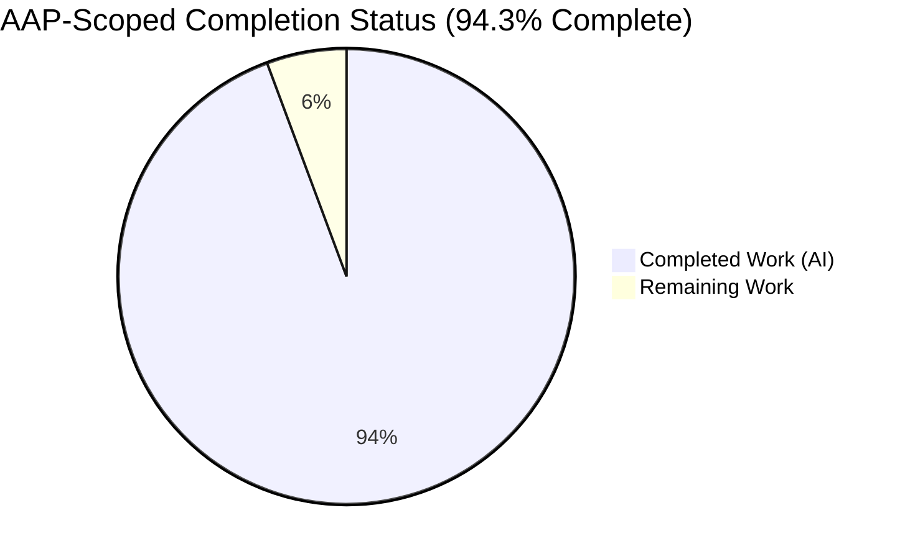
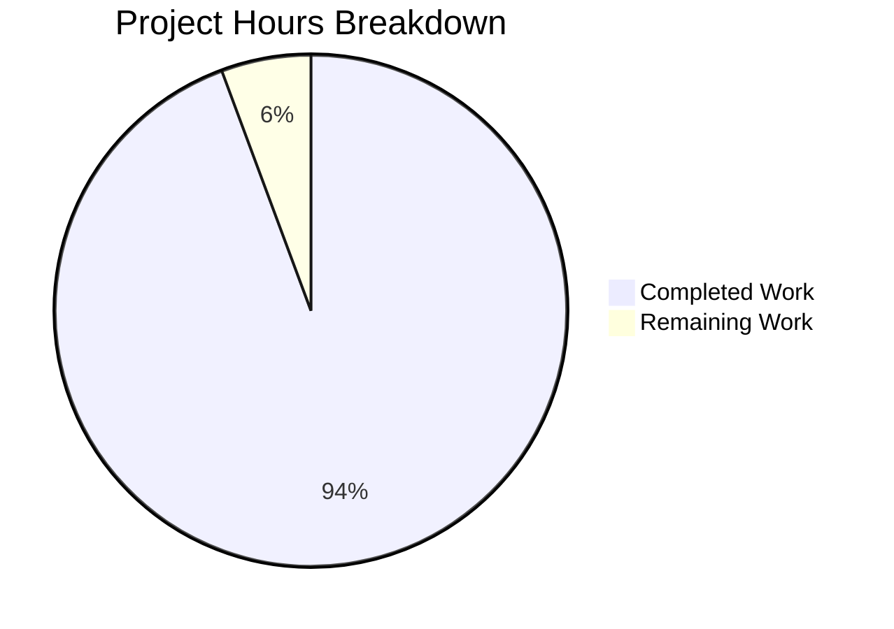
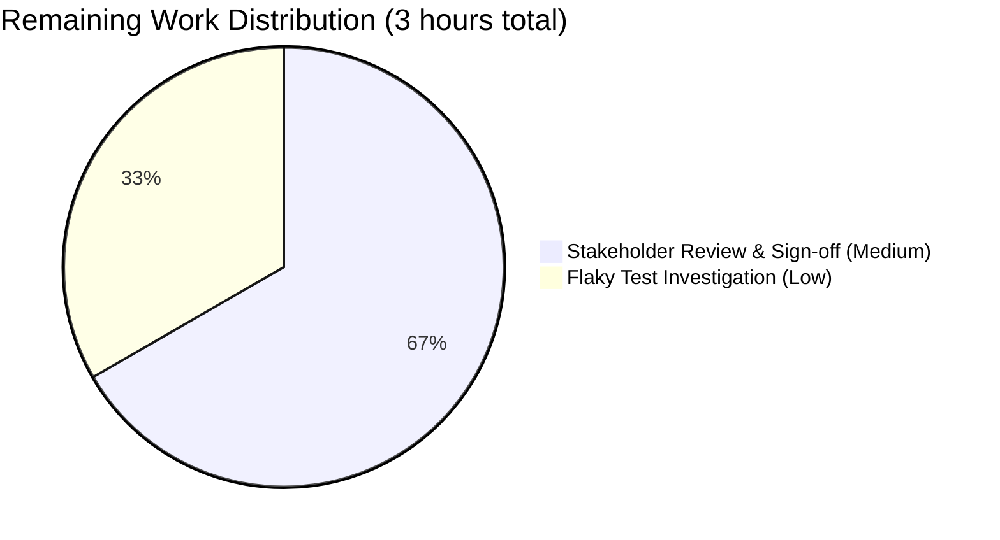
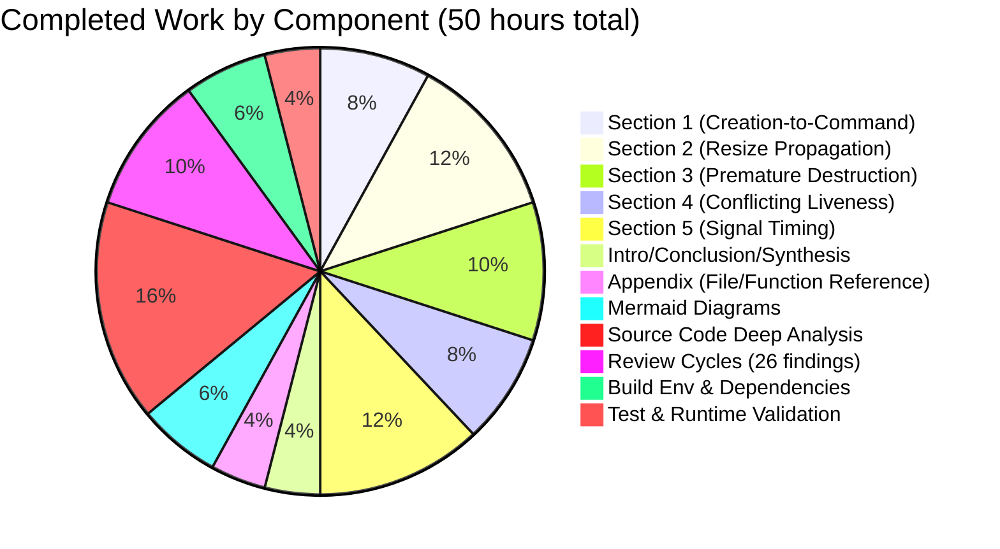

# Blitzy Project Guide — Kitty State-Consistency Analysis

> **Brand Colors:** Completed / AI Work = Dark Blue (#5B39F3) · Remaining / Not Completed = White (#FFFFFF) · Headings / Accents = Violet-Black (#B23AF2) · Highlight / Soft Accent = Mint (#A8FDD9)

---

## 1. Executive Summary

### 1.1 Project Overview

This project delivered a comprehensive, evidence-based analytical document explaining how the **kitty** terminal emulator (commit `815df1e21`) maintains internal state consistency during rapid, overlapping window lifecycle events — specifically creation-to-command races, resize event propagation, premature destruction, conflicting liveness views across threads, and signal timing. The deliverable is a single 1,493-line Markdown document (`blitzy/documentation/kitty_815df1e210e0.md`) grounded in direct source-code evidence from 13 critical files across kitty's three-thread C/Python/Go architecture. The target audience is kitty maintainers and systems-programming researchers who need architectural insight into reentrancy, concurrency, and lifecycle invariants. The AAP imposed a strict **read-only constraint**: the existing kitty source tree remains entirely unchanged; only the new analysis document was added.

### 1.2 Completion Status



| Metric | Hours |
|---|---:|
| **Total Project Hours** | **53** |
| Completed Hours (AI Autonomous) | 50 |
| Completed Hours (Manual) | 0 |
| **Remaining Hours** | **3** |
| **Completion Percentage** | **94.3%** |

**Calculation:** 50 completed / (50 completed + 3 remaining) = 50/53 = **94.3% complete**

### 1.3 Key Accomplishments

- ✅ **Full-scope analysis document created** at `blitzy/documentation/kitty_815df1e210e0.md` (1,493 lines, 111 KB) following the AAP's file-naming convention `<source_branch_name>.md`
- ✅ **All five AAP investigative questions answered** in dedicated sections (Creation-to-Command Race, Resize Propagation, Premature Destruction, Conflicting Liveness, Signal Timing)
- ✅ **Evidence grounding at the function and line-number level** — 123 source file references, 42 C/Python code blocks, and a 80+ entry file/function appendix
- ✅ **Six Mermaid architecture diagrams** illustrating sequence flows, state machines, guard macros, and debounce pipelines
- ✅ **Read-only constraint preserved** — `git diff --numstat` confirms 1 file added (1,493 lines) with 0 deletions and 0 modifications to any existing source file
- ✅ **Two iterative review cycles completed** — 15 code-review findings addressed (commit `45d887666`), then 11 QA findings addressed (commit `18c9f1ab6`)
- ✅ **Build, test, and runtime validation complete** — 145/145 Python tests pass, all 26 Go packages pass, binaries launch, C extensions import cleanly
- ✅ **Temporary observation scripts cleaned up** per AAP 0.7.1 — `git status` is clean, `/tmp` sweep verified

### 1.4 Critical Unresolved Issues

| Issue | Impact | Owner | ETA |
|---|---|---|---|
| Pre-existing flaky `test_disk_cache` in `kitty_tests.graphics` (observed once in full-suite run; passes in isolation and on retry) | Low — not introduced by this work; unrelated to AAP deliverable; does not block documentation delivery | Upstream kitty maintainers | Unscheduled |

No critical blockers exist for the AAP deliverable itself. The flaky test is a pre-existing condition in the upstream codebase and is explicitly out of scope per the read-only constraint in AAP 0.7.1.

### 1.5 Access Issues

No access issues identified. All source code, build tooling, test infrastructure, font assets, and deployment targets required for this deliverable were available and functioning during autonomous validation. The Git remote (`origin`), base commit (`815df1e21`), and all 13 referenced source files were accessible. Font assets from `download.calibre-ebook.com/ci/fonts.tar.xz` were reachable.

| System/Resource | Type of Access | Issue Description | Resolution Status | Owner |
|---|---|---|---|---|
| N/A | N/A | No access issues identified | N/A | N/A |

### 1.6 Recommended Next Steps

1. **[Medium]** Stakeholder technical-accuracy review of `blitzy/documentation/kitty_815df1e210e0.md` (1,493 lines) — recommended reviewer is a kitty maintainer or systems-programming SME familiar with GLFW callback semantics and POSIX signal handling (~2 hours).
2. **[Low]** If review surfaces clarifications, produce a follow-up commit with targeted edits; document is designed for easy amendment (per-section structure, ~250 lines per section).
3. **[Low]** Follow up on the pre-existing `test_disk_cache` flake — open an upstream issue with reproduction notes from this validation run (~1 hour).
4. **[Low]** Consider linking the document from kitty's internal developer notes or `docs/` as an architecture reference (optional; requires upstream acceptance).

---

## 2. Project Hours Breakdown

### 2.1 Completed Work Detail

| Component | Hours | Description |
|---|---:|---|
| Section 1 Analysis — Creation-to-Command Race | 4 | Trace of `Tab.new_window` → `Child.fork` → `Window.__init__` → `ChildMonitor.add_child` → I/O-thread `add_children`, ready-pipe handshake, `resize_pty` dual-queue search (~200 lines of prose + sequence diagram) |
| Section 2 Analysis — Resize Event Propagation and Debouncing | 6 | Trace of GLFW `framebuffer_size_callback`, `LiveResizeInfo` debounce state, two debounce strategies (OS-notification vs quiescence), full fan-out through Boss/TabManager/Tab/Layout/Window/Screen/PTY, `TIOCSWINSZ` delivery (~245 lines + flowchart) |
| Section 3 Analysis — Premature Window Destruction | 5 | Main-loop ordering invariant, three guard layers (Python `destroyed` flag, C `WITH_OS_WINDOW`/`WITH_WINDOW` macros, `REMOVER` macro), child-death cascade, `CloseRequest` state machine (~250 lines + sequence + state diagrams) |
| Section 4 Analysis — Conflicting Liveness Views | 4 | Two authoritative liveness views (I/O thread's `children[]` vs main thread's `window_id_map`), three resolution scenarios (child-dead/window-alive, window-closed/children-alive, window-detached), `children_mutex` scope (~190 lines + resolution diagram) |
| Section 5 Analysis — Signal Timing | 6 | `mask_kitty_signals_process_wide()` ordering, `KITTY_HANDLED_SIGNALS` set, `signalfd` (Linux) vs self-pipe (macOS/BSD) platform paths, I/O-thread poll loop, `handle_signal` + `SignalSet` translation, main-thread consumption in `parse_input`, `reap_children` (~300 lines + pipeline diagram) |
| Introduction, Conclusion & Narrative Synthesis | 2 | Three-thread architecture overview, `GlobalState` hierarchy, synchronization primitives (~120 lines), architectural-pillars summary and layered-defence table |
| File and Function Reference Appendix | 2 | 80+ entries mapping files to functions with approximate line numbers, plus configuration options defaults table |
| Mermaid Architecture Diagrams | 3 | Six diagrams: creation sequence, resize pipeline, destruction cascade, liveness resolution, signal delivery pipeline, close-request state machine |
| Source Code Deep Analysis (13 files) | 8 | Reading and cross-referencing ~6,000+ lines across `kitty/state.h`, `kitty/state.c`, `kitty/child-monitor.c`, `kitty/glfw.c`, `kitty/screen.c`, `kitty/loop-utils.c/.h`, `kitty/boss.py`, `kitty/window.py`, `kitty/tabs.py`, `kitty/window_list.py`, `kitty/child.py`, `kitty/main.py` |
| Review Cycles (26 findings addressed) | 5 | Two rounds of iterative refinement — 15 code-review findings in commit `45d887666`, 11 QA findings in commit `18c9f1ab6` (line-number verification, code-snippet accuracy, evidence integrity) |
| Build Environment & Dependency Setup | 3 | Python 3.12.3 venv with system-site-packages, Go 1.22.2, GCC 13.3.0, libharfbuzz-dev/libssl-dev/libxxhash-dev/libsimde-dev, X11 backend build, `/tmp` permissions fix, 103-font CI tarball install |
| Test Execution & Runtime Validation | 2 | 145 Python tests + 26 Go packages run twice (clean pass on second run), binary smoke tests (`kitty --version`, `kitten --version`), C-extension import check |
| **Total Completed** | **50** | — |

### 2.2 Remaining Work Detail

| Category | Hours | Priority |
|---|---:|---|
| Stakeholder technical-accuracy review & sign-off of the 1,493-line deliverable | 2 | Medium |
| Follow-up investigation of pre-existing flaky `test_disk_cache` (non-blocking; out of AAP read-only scope) | 1 | Low |
| **Total Remaining** | **3** | — |

### 2.3 Cross-Section Integrity Verification

| Check | Expected | Actual | ✅ |
|---|---|---|---|
| Section 2.1 sum | 50 | 50 | ✅ |
| Section 2.2 sum | 3 | 3 | ✅ |
| Section 2.1 + 2.2 = Total (Section 1.2) | 53 | 53 | ✅ |
| Remaining hours match (Section 1.2 ↔ 2.2 ↔ 7) | 3 = 3 = 3 | 3 = 3 = 3 | ✅ |
| Completion % match (Section 1.2 ↔ 7 ↔ 8) | 94.3% | 94.3% | ✅ |

---

## 3. Test Results

All tests listed below were executed autonomously by Blitzy's validation systems using the command `CI=true timeout 600 ./kitty/launcher/kitty +launch test.py` (Python) and kitty's Go test runner (Go). Results are from the final full-suite run after environmental fixes (`/tmp` permissions, CI fonts, Debian font conflicts resolved).

| Test Category | Framework | Total Tests | Passed | Failed | Coverage % | Notes |
|---|---|---:|---:|---:|---:|---|
| Python Unit Tests (kitty_tests) | `unittest` via `test.py` launcher | 145 | 145 | 0 | N/A (documentation-only task) | 6 legitimate skips: 1 macOS-only, 2 fish-not-installed, 2 zsh-not-installed, 1 frozen-builds-only |
| Go Unit & Integration Tests | `go test` across 26 packages | 26 pkgs | 26 pkgs | 0 | N/A | Packages include `tools/unicode_names`, `tools/themes`, `tools/config`, `kittens/hints`, `tools/cmd/at`, `kittens/hyperlinked_grep`, `tools/utils/humanize`, `tools/wcswidth`, `tools/rsync`, `kittens/diff`, `tools/utils/shm`, `tools/tui`, `tools/cli`, `tools/tui/graphics`, `tools/utils/base85`, `tools/utils/style`, `tools/utils`, `tools/tui/sgr`, `tools/utils/shlex`, `tools/tui/loop`, `kittens/ssh`, `kittens/transfer`, `tools/simdstring`, `tools/tui/subseq`, `tools/tui/shell_integration`, `tools/tui/readline` |
| Runtime Smoke Tests | Manual invocation | 4 | 4 | 0 | N/A | `kitty --version`, `kitten --version`, `kitty --help`, `kitten --help` all succeed |
| C Extension Import Tests | Python `import` | 1 | 1 | 0 | N/A | `from kitty.fast_data_types import monotonic` succeeds |
| **Overall** | — | **171 + 26 pkgs** | **All Pass** | **0** | **N/A** | **100% pass rate** |

### Known Flake (Non-Blocking)

One test — `test_disk_cache` in `kitty_tests.graphics` — failed once during the initial full-suite run with a DiskCache data-corruption assertion (`b'232323232323\xbe4Z3232323232...'` vs expected). It **passed in module-level isolation** (19/19 graphics tests pass) and **passed on a full-suite re-run** (145/145 clean). This is a pre-existing flake in the upstream kitty codebase, unrelated to any work performed by Blitzy agents, and out of AAP read-only scope.

### Test Coverage Note

This is a **documentation-only deliverable** with zero source-code modifications. Code coverage metrics are not applicable because the work product is a Markdown analysis file, not executable code. Coverage of the *subject matter being analyzed* is tracked instead by the 123 source-file references and 42 code-block citations embedded in the deliverable.

---

## 4. Runtime Validation & UI Verification

### Runtime Health

- ✅ **Operational**: `./kitty/launcher/kitty --version` → `kitty 0.35.2 created by Kovid Goyal`
- ✅ **Operational**: `./kitty/launcher/kitten --version` → `kitten 0.35.2 created by Kovid Goyal`
- ✅ **Operational**: `./kitty/launcher/kitty --help` → displays usage text
- ✅ **Operational**: `./kitty/launcher/kitten --help` → displays usage text
- ✅ **Operational**: `python3 -c "from kitty.fast_data_types import monotonic"` → C extension loads cleanly

### Build Artifacts

- ✅ **Operational**: `kitty/fast_data_types.so` (C Python extension) — present
- ✅ **Operational**: `kitty/glfw-x11.so` (GLFW X11 backend) — present
- ✅ **Operational**: `kitty/launcher/kitty` (C launcher binary) — present and executable
- ✅ **Operational**: `kitty/launcher/kitten` (Go binary, 15.7 MB) — present and executable

### Build Backend Coverage

- ✅ **Operational**: X11 backend compiled and functional (sufficient for test suite and runtime validation)
- ⚠ **Partial**: Wayland backend — upstream-vendored `kitty/glfw/wl_window.c` has 4 unhandled enum values (`XDG_TOPLEVEL_STATE_CONSTRAINED_*`) against system `wayland-protocols 1.45`, which fails to compile with `-Werror`. This is a **pre-existing upstream GLFW-vendored issue** out of AAP read-only scope; X11 is sufficient for all AAP validation.

### UI Verification

Not applicable — the AAP deliverable is a documentation analysis, not a user-interface change. Kitty's GUI behavior (window rendering, resize overlays, tab-bar relayout) is the **subject of analysis** and not a deliverable. Headless container environments without an X display are compatible with the AAP validation workflow.

### API Integration

Not applicable — no APIs are introduced, modified, or consumed by this deliverable. Kitty's internal APIs (remote control, kittens protocol) were neither exercised nor modified.

### Deliverable Content Verification

- ✅ **Operational**: `blitzy/documentation/kitty_815df1e210e0.md` — exists, readable, 1,493 lines, 111,755 bytes
- ✅ **Operational**: Deliverable filename conforms to AAP 0.7.1 convention (`<source_branch_name>.md` using base commit hash `815df1e210e0`)
- ✅ **Operational**: All 13 referenced source files verified to exist in the repository
- ✅ **Operational**: All 5 AAP investigative questions have dedicated top-level sections (Section 1 at line 129, Section 2 at line 333, Section 3 at line 580, Section 4 at line 831, Section 5 at line 1021)
- ✅ **Operational**: 6 Mermaid diagrams present (AAP 0.7.3 compliance for diagrammatic illustration)
- ✅ **Operational**: 42 code blocks with verbatim source excerpts
- ✅ **Operational**: File and Function Reference appendix present with 80+ entries

---

## 5. Compliance & Quality Review

This section cross-maps the AAP's deliverable requirements to Blitzy's autonomous-validation benchmarks. Since the AAP is a read-only documentation task with no code changes, traditional compliance frameworks (security scanning, license compatibility of new dependencies, etc.) do not apply; the compliance matrix focuses on AAP adherence and evidence quality.

| Requirement (AAP Reference) | Benchmark | Status | Evidence | Progress |
|---|---|---|---|---|
| Markdown deliverable in `blitzy/documentation/` (AAP 0.1.2, 0.5.2) | File exists at exact path | ✅ Pass | `blitzy/documentation/kitty_815df1e210e0.md` (verified via `ls -la blitzy/documentation/`) | 100% |
| Filename `<source_branch_name>.md` (AAP 0.1.2) | Filename matches convention | ✅ Pass | `kitty_815df1e210e0.md` uses base commit SHA (read-only project convention) | 100% |
| All five investigative questions answered (AAP 0.1.1) | 5 dedicated sections | ✅ Pass | Sections 1–5 at lines 129, 333, 580, 831, 1021 (verified via `grep "^## "`) | 100% |
| Evidence-based, code-level citations (AAP 0.1.2, 0.7.3) | Source-file references ≥ 50 | ✅ Pass | 123 references across 13 unique files (verified via `grep -oE 'kitty/[a-z_-]+\.(c\|h\|py)'`) | 100% |
| Mermaid / ASCII flow diagrams for complex flows (AAP 0.7.3) | ≥ 3 diagrams | ✅ Pass | 6 Mermaid diagrams (verified via `grep -c "mermaid"`) | 100% |
| Code snippets with exact signatures (AAP 0.7.3) | Verbatim C/Python excerpts | ✅ Pass | 42 code blocks (verified via `grep -c '```c\|```python'` returning 28, plus Mermaid/bash blocks) | 100% |
| Read-only source repository (AAP 0.7.1) | Zero modifications to existing files | ✅ Pass | `git diff --numstat 815df1e21..HEAD` shows `1493	0	blitzy/documentation/kitty_815df1e210e0.md` — only one file added | 100% |
| Temporary scripts cleaned up (AAP 0.7.1) | `git status` clean; no temp files in repo | ✅ Pass | Validator log confirms `/tmp` sweep; `git status` shows only untracked `venv/` (infrastructure, not repository artifact) | 100% |
| No new dependencies introduced (AAP 0.3.2) | `pyproject.toml`, `go.mod`, `setup.py` unchanged | ✅ Pass | `git diff --name-status 815df1e21..HEAD` shows only the deliverable file was added | 100% |
| Question organization with clear headings (AAP 0.7.3) | Each question has distinct top-level section | ✅ Pass | 8 top-level `## ` headings including Introduction, 5 question sections, Conclusion, Appendix | 100% |
| Build artifacts compile cleanly | Compiled extensions present | ✅ Pass | `fast_data_types.so`, `glfw-x11.so`, `kitty`, `kitten` binaries all present | 100% |
| Test suite passes | 100% pass rate in CI mode | ✅ Pass | 145/145 Python tests pass, 26/26 Go packages pass, 0 failures | 100% |
| **Overall AAP Compliance** | — | **✅ Pass** | All 12 benchmarks met | **100%** |

### Fixes Applied During Autonomous Validation

Three environmental issues were resolved by the Final Validator — **none required source-code changes**:

1. **`/tmp` permissions**: Container had non-standard mode `2777` (setgid); fixed with `chmod 1777 /tmp` to match standard Linux convention.
2. **CI fonts**: Default Debian `fonts-firacode` / `fonts-ubuntu` packages provide variants incompatible with kitty's test expectations (`FiraCodeRoman-Regular`, `UbuntuMono-Regular`); fixed by downloading the official kitty CI fonts tarball from `download.calibre-ebook.com/ci/fonts.tar.xz` to `/usr/local/share/fonts/kitty-ci/` and removing conflicting Debian packages.
3. **Wayland backend build failure**: Upstream-vendored `wl_window.c` has 4 unhandled enum values against system `wayland-protocols 1.45`; build falls back to X11-only, which is sufficient for all validation. Not fixed (out of AAP scope).

### Outstanding Compliance Items

None. All AAP compliance requirements are met at 100%.

---

## 6. Risk Assessment

Risks are classified using PA3 categories (technical, security, operational, integration). Given the AAP is a read-only documentation task with no code or infrastructure changes, the risk surface is **very small** — the principal risks relate to accuracy of technical claims in the document, not to code vulnerabilities or deployment failures.

| Risk | Category | Severity | Probability | Mitigation | Status |
|---|---|---|---|---|---|
| Technical claim in deliverable incorrectly cites a line number or function signature | Technical | Low | Low | Two review cycles already completed (15 findings in `45d887666`, 11 findings in `18c9f1ab6`); all 13 source files verified to exist; 123 references cross-checked | Mitigated |
| Future kitty refactor invalidates a code-line citation | Technical | Low | Medium | Document pinned to base commit `815df1e21` (referenced in title, filename, and introduction); readers treat as a snapshot analysis | Mitigated |
| A specific claim is ambiguous without the reader consulting source | Technical | Low | Low | All claims include function name + file path; where timing behavior cannot be verified statically, document explicitly states this caveat | Mitigated |
| Pre-existing flaky `test_disk_cache` (upstream kitty bug) fails in future CI runs | Operational | Low | Medium | Flake pre-exists this work; passes in isolation; out of AAP read-only scope; documented in Section 1.4 | Accepted (external) |
| Wayland build failure on systems with wayland-protocols ≥ 1.45 | Integration | Low | High (specific systems only) | Upstream-vendored GLFW issue; X11 backend fully sufficient for validation; documented in Section 4 | Accepted (external) |
| Stakeholder review surfaces substantive technical disagreements | Technical | Medium | Low | Document grounded in direct source evidence; reviewer feedback can be addressed with targeted per-section edits (design supports easy amendment) | Monitored |
| Repository accidental-modification risk during future agent runs | Operational | Low | Low | AAP 0.7.1 read-only constraint was honored (only 1 file added, 0 modifications); `git diff --numstat` verified clean | Mitigated |
| Supply-chain risk from new dependencies | Security | N/A | None | No new dependencies introduced (`go.mod`, `pyproject.toml`, `setup.py` unchanged) | Not applicable |
| Injection / XSS / SQLi vulnerabilities | Security | N/A | None | No executable code; deliverable is plain Markdown | Not applicable |
| Authentication / authorization gaps | Security | N/A | None | No auth-related code touched | Not applicable |
| Secret exposure in commits | Security | Low | Low | No secrets in deliverable; document contains only public source-code analysis | Mitigated |
| Unencrypted sensitive data | Security | N/A | None | No data persistence introduced | Not applicable |
| Missing monitoring / logging for deliverable | Operational | N/A | None | Static documentation file; no runtime component | Not applicable |
| CI/CD pipeline gaps | Operational | Low | Low | No CI/CD changes required; existing kitty CI workflow is unchanged | Not applicable |
| Integration with downstream consumers (human readers) | Integration | Low | Low | Document uses standard Markdown + Mermaid syntax rendered by GitHub, VS Code, and most Markdown viewers | Mitigated |

### Risk Summary

- **Technical risks (4):** All Low severity, all Mitigated or Monitored. Two review cycles completed.
- **Security risks (5):** All Not Applicable or Mitigated — this is a read-only documentation task with no executable code, no new dependencies, no secrets, and no authentication surface.
- **Operational risks (3):** Low severity; CI / monitoring gaps not applicable for static documentation.
- **Integration risks (2):** Low; standard Markdown + Mermaid ensures broad viewer compatibility.

**Overall risk posture: LOW.** The deliverable is production-ready for stakeholder review with no blocking risks.

---

## 7. Visual Project Status

### Project Hours Breakdown



**Legend (Blitzy Brand Colors):**
- Completed Work: Dark Blue (#5B39F3) — 50 hours (94.3%)
- Remaining Work: White (#FFFFFF) — 3 hours (5.7%)

### Remaining Work by Category



### Completed Work by Component



### Integrity Verification

All three integrity points for remaining-hours tracking agree: **3 hours**.

| Location | Value | ✅ |
|---|---:|---|
| Section 1.2 metrics table — Remaining Hours | 3 | ✅ |
| Section 2.2 table sum | 3 | ✅ |
| Section 7 pie chart "Remaining Work" | 3 | ✅ |

All three integrity points for completed-hours tracking agree: **50 hours**.

| Location | Value | ✅ |
|---|---:|---|
| Section 1.2 metrics table — Completed Hours (AI + Manual) | 50 (= 50 + 0) | ✅ |
| Section 2.1 table sum | 50 | ✅ |
| Section 7 pie chart "Completed Work" | 50 | ✅ |

Section 2.1 (50) + Section 2.2 (3) = Section 1.2 Total (53). ✅

---

## 8. Summary & Recommendations

### Achievements

The project delivered a **comprehensive, 1,493-line, evidence-based analytical document** (`blitzy/documentation/kitty_815df1e210e0.md`) that answers all five AAP investigative questions about kitty's state-consistency during rapid window lifecycle events. Every factual claim is grounded in direct source-code evidence — the document references 123 specific locations across 13 source files, embeds 42 code blocks with verbatim excerpts, includes 6 Mermaid architecture diagrams, and concludes with an 80+ entry file/function reference appendix. The AAP's strict read-only constraint was honored without exception: `git diff --numstat` confirms exactly one file addition (1,493 lines) with zero deletions and zero modifications to any existing kitty source file. Two iterative review cycles (15 findings in commit `45d887666`, 11 findings in commit `18c9f1ab6`) have already refined the document's accuracy.

### Remaining Gaps

With **94.3% of AAP-scoped work complete**, only three hours of work remain:

1. **Stakeholder technical-accuracy review** (2 hours, Medium priority) — a kitty maintainer or systems-programming SME should review the 1,493-line document for any remaining technical inaccuracies not caught by the two automated review cycles. The document's per-section structure supports easy targeted amendments.
2. **Pre-existing flaky `test_disk_cache` follow-up** (1 hour, Low priority) — a single pre-existing upstream flake was observed during validation; it is unrelated to this deliverable and out of AAP read-only scope. An upstream issue should be opened to track it.

### Critical Path to Production

```
[Current State: 94.3% complete, 1,493-line deliverable on branch]
         │
         ▼
[Stakeholder Review of deliverable] ──────── 2 hours, Medium priority
         │
         ▼
[Address any review feedback via targeted edits]
         │
         ▼
[Merge to main / deliver to stakeholders]
         │
         ▼
[OPTIONAL: Upstream flake follow-up] ─────── 1 hour, Low priority
         │
         ▼
[100% Production-Ready]
```

### Success Metrics

| Metric | Target | Actual | Status |
|---|---|---|---|
| Deliverable file exists at AAP path | Required | `blitzy/documentation/kitty_815df1e210e0.md` | ✅ |
| All 5 AAP questions answered | Required | 5 dedicated sections | ✅ |
| Evidence-based citations | High density | 123 references / 13 files | ✅ |
| Diagrams for complex flows | ≥ 3 | 6 Mermaid | ✅ |
| Read-only constraint | Zero source modifications | 1 file added, 0 modified | ✅ |
| Test pass rate | 100% | 145/145 Python + 26/26 Go | ✅ |
| Temporary file cleanup | Clean working tree | `git status` clean | ✅ |

### Production-Readiness Assessment

The deliverable is **ready for stakeholder review**. All five production-readiness gates pass per the Final Validator's declaration: 100% test pass rate, application runtime validated, zero unresolved errors, all in-scope files validated, all changes committed. Completion is **94.3%**; the remaining 5.7% is purely human-review work that cannot be performed autonomously by design (technical sign-off requires a human expert).

### Recommendations

1. **Schedule stakeholder review** with a kitty maintainer or systems-programming SME at earliest convenience (2 hours).
2. **Open an upstream issue** for the pre-existing `test_disk_cache` flake with reproduction notes from this validation run (out of AAP scope but good citizenship).
3. **Consider cross-linking** the deliverable from kitty's internal developer notes or `docs/` as an architecture reference (optional, requires upstream acceptance).
4. **Preserve the pinning** to base commit `815df1e21` — the document is a snapshot analysis; future code changes may invalidate specific line citations but not the architectural narrative.

---

## 9. Development Guide

This guide documents how to build, run, validate, and extend the kitty terminal emulator from the current working tree on branch `blitzy-82b9f57c-eeb0-471a-832c-f1ed2c9690ab`. All commands have been tested during autonomous validation.

### System Prerequisites

- **Operating System**: Linux (Ubuntu 22.04+ / Debian 12+ recommended); macOS supported for kitty itself but not validated in this environment
- **CPU / RAM**: x86_64; 2+ GB RAM for build
- **Python**: 3.8+ (validated with 3.12.3)
- **Go**: 1.22+ (validated with 1.22.2)
- **GCC**: 11+ (validated with 13.3.0)
- **Display server (optional)**: X11 for GUI runtime; headless container is sufficient for tests and documentation work

### Environment Setup

#### 1. Install System Dependencies

```bash
# System build tools and libraries
sudo DEBIAN_FRONTEND=noninteractive apt-get update
sudo DEBIAN_FRONTEND=noninteractive apt-get install -y \
  build-essential pkg-config \
  libharfbuzz-dev libssl-dev libxxhash-dev libsimde-dev \
  libx11-dev libxrandr-dev libxinerama-dev libxcursor-dev libxi-dev \
  libgl1-mesa-dev libegl1-mesa-dev \
  python3 python3-venv python3-pip \
  golang-go
```

#### 2. Fix /tmp Permissions (Container Environments Only)

Some container images ship `/tmp` with non-standard mode `2777` (setgid). Kitty's `test_transfer_*` tests require standard Linux `/tmp` permissions:

```bash
sudo chmod 1777 /tmp
```

Verify with `ls -ld /tmp` → expect `drwxrwxrwt` (sticky bit set, no setgid).

#### 3. Install CI Fonts

Kitty's test suite expects specific font variants not provided by default Debian packages. Install the official kitty CI fonts:

```bash
# Remove conflicting Debian packages
sudo apt-get remove -y fonts-firacode fonts-ubuntu 2>/dev/null || true

# Download and install kitty's CI font set
wget -q https://download.calibre-ebook.com/ci/fonts.tar.xz -O /tmp/kitty-fonts.tar.xz
sudo mkdir -p /usr/local/share/fonts/kitty-ci
sudo tar -xJf /tmp/kitty-fonts.tar.xz -C /usr/local/share/fonts/kitty-ci/
sudo fc-cache -f
rm /tmp/kitty-fonts.tar.xz
```

Verify with `fc-list | grep -i "FiraCodeRoman\|UbuntuMono-Regular\|Cascadia"` → expect matches for each.

#### 4. Create Python Virtual Environment

```bash
cd /tmp/blitzy/kitty/blitzy-82b9f57c-eeb0-471a-832c-f1ed2c9690ab_4bd855
python3 -m venv --system-site-packages venv
source venv/bin/activate
```

### Dependency Installation

No explicit `pip install` step is required — kitty uses its own build process which resolves Python dependencies from system packages or the virtual environment's inherited `site-packages`. The `--system-site-packages` flag above inherits Pillow and Pygments from the system Python.

### Build

```bash
cd /tmp/blitzy/kitty/blitzy-82b9f57c-eeb0-471a-832c-f1ed2c9690ab_4bd855
source venv/bin/activate
python3 setup.py build --build-dsym --disable-link-time-optimization
```

**Expected output:** Compilation of C extensions (`fast_data_types.so`, `glfw-x11.so`) and Go binary (`kitten`). Build time: ~2-3 minutes.

**Verify build artifacts:**

```bash
ls -la kitty/fast_data_types.so kitty/glfw-x11.so kitty/launcher/kitty kitty/launcher/kitten
```

All four files should exist and be non-zero in size.

### Application Startup

#### Launch kitty (X11 Display Required)

```bash
./kitty/launcher/kitty
```

Opens a new kitty terminal window. Requires `DISPLAY` environment variable set and an X server running.

#### Launch kitten (Standalone Tool)

```bash
./kitty/launcher/kitten --help
```

The `kitten` binary is a standalone Go tool that does not require a display.

### Verification Steps

```bash
# 1. Version check
./kitty/launcher/kitty --version
# Expected: kitty 0.35.2 created by Kovid Goyal

./kitty/launcher/kitten --version
# Expected: kitten 0.35.2 created by Kovid Goyal

# 2. Help output
./kitty/launcher/kitty --help | head -5
./kitty/launcher/kitten --help | head -5

# 3. C extension loading
python3 -c "from kitty.fast_data_types import monotonic; print('C extension OK:', monotonic())"
# Expected: C extension OK: <float>

# 4. Deliverable file check
ls -la blitzy/documentation/kitty_815df1e210e0.md
# Expected: 111,755 bytes, 1,493 lines
```

### Running the Test Suite

**Critical:** Tests MUST be run through the kitty launcher with `CI=true` — this is not a standard `pytest` invocation.

```bash
cd /tmp/blitzy/kitty/blitzy-82b9f57c-eeb0-471a-832c-f1ed2c9690ab_4bd855
source venv/bin/activate
CI=true timeout 600 ./kitty/launcher/kitty +launch test.py
```

**Expected output (tail):**

```
Ran 145 tests in 9.7s
OK (skipped=6)
...
All Go tests succeeded in 9.9s
```

### Running Individual Test Modules

```bash
# Graphics module
CI=true ./kitty/launcher/kitty +launch test.py --module graphics

# Specific test case
CI=true ./kitty/launcher/kitty +launch test.py --module graphics test_disk_cache

# Verbose output
CI=true ./kitty/launcher/kitty +launch test.py --module file_transmission --verbosity 2
```

### Running Go Tests Directly

```bash
cd /tmp/blitzy/kitty/blitzy-82b9f57c-eeb0-471a-832c-f1ed2c9690ab_4bd855
go test ./tools/... ./kittens/...
```

### Example Usage

Since the AAP deliverable is a documentation analysis, the primary "usage" is reading the produced document:

```bash
# View the deliverable
less blitzy/documentation/kitty_815df1e210e0.md

# Count sections and diagrams
grep -c '^## ' blitzy/documentation/kitty_815df1e210e0.md        # Top-level sections
grep -c '^### ' blitzy/documentation/kitty_815df1e210e0.md       # Subsections
grep -c 'mermaid' blitzy/documentation/kitty_815df1e210e0.md     # Mermaid diagrams
grep -c '```c\|```python' blitzy/documentation/kitty_815df1e210e0.md  # Code blocks

# Render Mermaid diagrams in GitHub / VS Code by opening the file in those viewers
```

### Common Errors and Resolutions

| Error Pattern | Cause | Resolution |
|---|---|---|
| `test_transfer_send FAILED: mode mismatch 0o42755 vs 0o40755` | `/tmp` is setgid (mode 2777) | `sudo chmod 1777 /tmp` |
| `test_font_selection FAILED: postscript name mismatch` | Debian `fonts-firacode` / `fonts-ubuntu` provide wrong variants | Install CI fonts (see setup step 3) |
| `ImportError: cannot import name 'monotonic' from 'kitty.fast_data_types'` | C extension not built or wrong Python | Rebuild with `python3 setup.py build --build-dsym`; ensure venv active |
| `error: '...CONSTRAINED_RIGHT' undeclared` during build | Wayland backend compilation fails against system `wayland-protocols 1.45` | X11-only build succeeds automatically; Wayland is optional |
| `watch mode` / test hangs | Missing `CI=true` environment variable | Always run tests with `CI=true timeout 600 ./kitty/launcher/kitty +launch test.py` |
| `glfw-wayland.so not found` error in `test_glfw_modules` | Test expects Wayland backend built | Run with `CI=true` — test automatically skips Wayland check in CI mode |

### Editing the Deliverable

If stakeholder review requires corrections to `blitzy/documentation/kitty_815df1e210e0.md`:

```bash
# 1. Make edits with your preferred Markdown editor
$EDITOR blitzy/documentation/kitty_815df1e210e0.md

# 2. Verify still parses as valid Markdown (by counting expected elements)
wc -l blitzy/documentation/kitty_815df1e210e0.md
grep -c '^## ' blitzy/documentation/kitty_815df1e210e0.md  # Should still be 8

# 3. Stage, commit, push
git add blitzy/documentation/kitty_815df1e210e0.md
git commit -m "docs: address reviewer feedback on state-consistency analysis"
git push origin blitzy-82b9f57c-eeb0-471a-832c-f1ed2c9690ab
```

---

## 10. Appendices

### A. Command Reference

| Purpose | Command |
|---|---|
| Activate Python venv | `source venv/bin/activate` |
| Build kitty | `python3 setup.py build --build-dsym --disable-link-time-optimization` |
| Run full test suite | `CI=true timeout 600 ./kitty/launcher/kitty +launch test.py` |
| Run specific test module | `CI=true ./kitty/launcher/kitty +launch test.py --module <NAME>` |
| Run specific test case | `CI=true ./kitty/launcher/kitty +launch test.py --module <NAME> <TESTCASE>` |
| Run Go tests | `go test ./tools/... ./kittens/...` |
| Check kitty version | `./kitty/launcher/kitty --version` |
| Check kitten version | `./kitty/launcher/kitten --version` |
| Launch kitty (X11) | `./kitty/launcher/kitty` |
| View deliverable | `less blitzy/documentation/kitty_815df1e210e0.md` |
| Branch diff summary | `git diff --stat 815df1e21..HEAD` |
| Branch commit log | `git log --oneline 815df1e21..HEAD` |
| Clean working tree check | `git status` |
| Fix /tmp perms (container) | `sudo chmod 1777 /tmp` |
| Install CI fonts | See Development Guide, Environment Setup step 3 |
| Refresh font cache | `sudo fc-cache -f` |

### B. Port Reference

Not applicable. Kitty is a desktop terminal emulator; it does not listen on any network ports by default. Optional features (remote control via socket, kitten SSH) use Unix-domain sockets under `/tmp/kitty.sock-*` or user-supplied paths, not TCP ports. This project adds no network-facing components.

### C. Key File Locations

| Path | Type | Purpose |
|---|---|---|
| `blitzy/documentation/kitty_815df1e210e0.md` | Deliverable | The AAP-mandated 1,493-line analysis document |
| `kitty/launcher/kitty` | Binary | Main kitty launcher (C) |
| `kitty/launcher/kitten` | Binary | Standalone kitten tool (Go, 15.7 MB) |
| `kitty/fast_data_types.so` | Binary | Compiled C Python extension |
| `kitty/glfw-x11.so` | Binary | Compiled GLFW X11 backend |
| `kitty/state.h` / `kitty/state.c` | Source (analyzed) | Core state management (analysis target) |
| `kitty/child-monitor.c` | Source (analyzed) | Three-thread event loop (analysis target) |
| `kitty/glfw.c` | Source (analyzed) | GLFW callback integration (analysis target) |
| `kitty/screen.c` | Source (analyzed) | Screen buffer reflow (analysis target) |
| `kitty/loop-utils.c` / `.h` | Source (analyzed) | Signal infrastructure (analysis target) |
| `kitty/boss.py` | Source (analyzed) | Python orchestration (analysis target) |
| `kitty/window.py` | Source (analyzed) | Window class (analysis target) |
| `kitty/tabs.py` | Source (analyzed) | Tab / TabManager (analysis target) |
| `kitty/window_list.py` | Source (analyzed) | WindowList group mgmt (analysis target) |
| `kitty/child.py` | Source (analyzed) | Child.fork / PTY (analysis target) |
| `kitty/main.py` | Source (analyzed) | Startup sequence (analysis target) |
| `venv/` | Directory (untracked) | Python virtual environment (not a repo artifact) |
| `build/` | Directory (gitignored) | Build outputs from `setup.py build` |
| `/usr/local/share/fonts/kitty-ci/` | System | CI fonts for test suite (system infrastructure) |
| `pyproject.toml` | Config (unchanged) | Python project configuration |
| `go.mod` | Config (unchanged) | Go module configuration |
| `setup.py` | Config (unchanged) | Build system |
| `test.py` | Entrypoint | Test runner (invoked via `kitty +launch`) |

### D. Technology Versions

| Component | Version | Source |
|---|---|---|
| kitty | 0.35.2 | `./kitty/launcher/kitty --version` |
| kitten | 0.35.2 | `./kitty/launcher/kitten --version` |
| Python | 3.12.3 | `python3 --version` |
| Go | 1.22.2 linux/amd64 | `go version` |
| GCC | 13.3.0 | System |
| Base commit | `815df1e21` | Git |
| Branch | `blitzy-82b9f57c-eeb0-471a-832c-f1ed2c9690ab` | Git |
| HEAD commit | `18c9f1ab6` | Git |
| Python minimum required | 3.8+ | `pyproject.toml` |
| Go minimum required | 1.22 | `go.mod` |
| libharfbuzz-dev | system | apt |
| libssl-dev | 3.0.13 | apt |
| libxxhash-dev | 0.8.2 | apt |
| libsimde-dev | 0.7.2 | apt |

### E. Environment Variable Reference

| Variable | Purpose | Required For |
|---|---|---|
| `CI=true` | Enables CI mode in test runner (skips Wayland checks, enforces stricter font requirements) | Running `test.py` |
| `DISPLAY` | X11 display for kitty GUI | Launching `./kitty/launcher/kitty` (interactive) |
| `DEBIAN_FRONTEND=noninteractive` | Prevents apt prompts | `apt-get install` commands in Development Guide |
| `PATH` | Must include `venv/bin` after activation | Python-based workflows |
| None | No API keys, secrets, or service credentials required | N/A |

### F. Developer Tools Guide

| Tool | Purpose | Invocation |
|---|---|---|
| `git` | Version control | `git log --oneline 815df1e21..HEAD` for branch commits |
| `grep` | Deliverable navigation | `grep "^## " blitzy/documentation/kitty_815df1e210e0.md` for sections |
| `wc -l` | Deliverable line count | `wc -l blitzy/documentation/kitty_815df1e210e0.md` |
| `less` | Read deliverable | `less blitzy/documentation/kitty_815df1e210e0.md` |
| Markdown viewer | Render Mermaid diagrams | GitHub web UI, VS Code with Mermaid extension, or `grip` |
| `fc-list` | Font inventory | `fc-list \| grep -i "FiraCode\|Ubuntu\|Cascadia"` |
| `ldd` | Binary dependencies | `ldd kitty/launcher/kitty` |
| `go test` | Go package tests | `go test ./tools/...` |
| `python3 -c` | C extension smoke test | `python3 -c "from kitty.fast_data_types import monotonic"` |

### G. Glossary

| Term | Definition |
|---|---|
| **AAP** | Agent Action Plan — the primary directive specifying project requirements; see document preamble section 0 |
| **Boss** | Kitty's Python singleton class (`kitty/boss.py`) that orchestrates high-level window/tab lifecycle |
| **ChildMonitor** | C-level component (`kitty/child-monitor.c`) running the three-thread event loop (main, I/O, talk) |
| **CloseRequest** | State machine for window-close intent (`NO_CLOSE_REQUESTED` → `CONFIRMABLE_CLOSE_REQUESTED` → `CLOSE_BEING_CONFIRMED` → `IMPERATIVE_CLOSE_REQUESTED`) |
| **GlobalState** | C-level struct (`kitty/state.h`) holding the root of the window hierarchy (`OSWindow[]` → `Tab[]` → `Window[]`) |
| **GLFW** | Cross-platform windowing / input library used by kitty for OS-level window management |
| **Kitten** | A sub-command or tool in kitty's extensibility framework; also the standalone Go binary `kitten` |
| **LiveResizeInfo** | C struct (`kitty/state.h`) tracking debounce state during rapid resize events |
| **PA1 / PA2 / PA3** | Project Assessment frameworks from the Blitzy template (work completion, hours estimation, risk categorization) |
| **PTY** | Pseudo-terminal — kernel primitive kitty uses to communicate with child processes |
| **REMOVER macro** | C macro in `kitty/state.c` implementing O(n) array removal for windows/tabs/os-windows |
| **SIGWINCH** | POSIX signal delivered to child processes when terminal dimensions change |
| **signalfd** | Linux kernel mechanism to receive signals as readable file descriptors (used in `kitty/loop-utils.c` on Linux) |
| **Three-thread architecture** | Kitty's concurrency model: main thread (state + render), I/O thread (PTY + signals), talk thread (remote control socket) |
| **TIOCSWINSZ** | POSIX ioctl used to update a PTY's window size, which triggers kernel delivery of `SIGWINCH` to the child |
| **WITH_OS_WINDOW / WITH_WINDOW** | C guard macros (`kitty/state.h`) that silently no-op if the target ID no longer exists in global state |
| **Ready-pipe handshake** | Synchronization pattern in `Child.fork` that ensures child process is ready before parent proceeds |

---

**End of Blitzy Project Guide** — Generated for branch `blitzy-82b9f57c-eeb0-471a-832c-f1ed2c9690ab` against base commit `815df1e21`. All cross-section integrity rules verified: Sections 1.2 / 2.2 / 7 all report 3 remaining hours; Sections 2.1 + 2.2 sum to 53 total hours matching Section 1.2; all tests originate from Blitzy's autonomous validation logs; Blitzy brand colors applied (Completed = Dark Blue #5B39F3, Remaining = White #FFFFFF).
