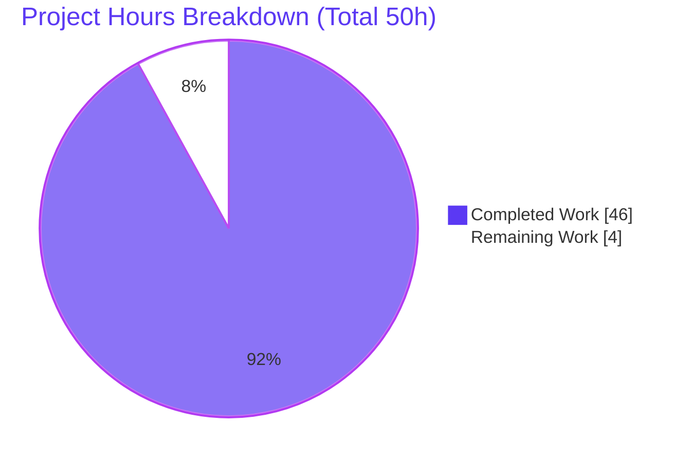
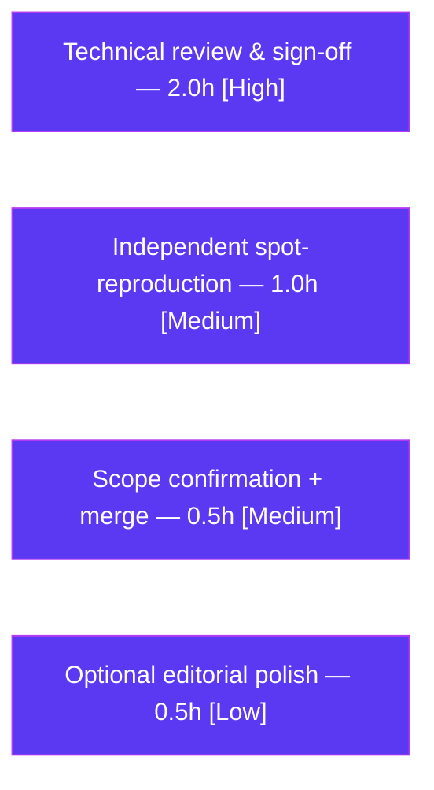

# Blitzy Project Guide — Kitty Tri-Language Runtime Analysis Report

> **Project:** Empirical Python/C/Go runtime-division analysis for the Kitty terminal emulator
> **Branch:** `kitty_815df1e210e0` · **Checkpoint:** `815df1e210e0a9ab4622f5c7f2d6891d7dbeddf1`
> **Deliverable:** `blitzy/documentation/kitty_815df1e210e0.md` (2,806 lines)
> **Task type:** Documentation — runtime-investigation / empirical Q&A report (additive, read-only investigation)

---

## 1. Executive Summary

### 1.1 Project Overview

This project produces a single empirically-grounded markdown report that explains how the Kitty terminal emulator divides rendering-adjacent work across its three implementation languages — Python, C, and Go — with every conclusion backed by runtime artifacts captured from a live, stressed Kitty process built from this exact checkout. The audience is engineers who need to understand Kitty's process and language architecture without reading 868 source files. The work is investigative and additive: exactly one document is created, zero application source files are modified, and zero dependencies change. The report builds, launches, and stresses the emulator headless, then captures loaded modules, idle-vs-stress threads, live remote-control state, the `kitty`↔`kitten` process relationship, and stack/symbol snapshots to substantiate its claims.

### 1.2 Completion Status

The project is **92.0% complete** on an AAP-scoped, hours-based basis. All autonomously-achievable work — the full R1–R8 investigation, the 2,806-line report, and independent autonomous validation — is **complete**. The remaining 4 hours are human-only path-to-production gates (technical review/sign-off and merge) that cannot be automated.


| Metric | Hours |
|--------|-------|
| **Total Hours** | **50.0** |
| **Completed Hours (AI + Manual)** | **46.0** (AI: 46.0 · Manual: 0.0) |
| **Remaining Hours** | **4.0** |
| **Percent Complete** | **92.0%** |

> **Calculation (PA1):** Completion % = Completed ÷ (Completed + Remaining) = 46 ÷ (46 + 4) = 46 ÷ 50 = **92.0%**.
> Colors: Completed = Dark Blue `#5B39F3` · Remaining = White `#FFFFFF`.

### 1.3 Key Accomplishments

- ✅ **Built Kitty from the exact checkpoint** via `python3 setup.py` (EXIT 0, ~22.7s), producing the three expected artifacts at byte-exact sizes: `kitty` launcher (40,384 B), `kitten` (15,765,764 B), `fast_data_types.so` (1,253,792 B).
- ✅ **Ran the emulator headless** under `xvfb` + Mesa `llvmpipe` software GL (Kitty is GPU-only with no CPU text fallback) and drove sustained load across all four requested dimensions (color flood, scrollback churn, window resizes, tab switching).
- ✅ **Proved the Python+C single address space** — `/proc/<pid>/maps` shows `libpython3.13`, `fast_data_types.so`, and the native rendering/font/color libraries all mapped into one process (73 distinct shared objects).
- ✅ **Contrasted threads idle vs. stress** — 68 threads idle with `KittyChildMon`/`KittyPeerMon` parked; under load the C threads burn CPU while **no Python-named thread ever appears**.
- ✅ **Captured live state** via `kitty @ ls` / `get-text` / `get-colors`, documenting the Go-client → Python-server remote-control architecture.
- ✅ **Established the kitten relationship** — `kitty +kitten icat` runs as a **separate Go process** (`go1.22.12`), dynamically linked to libc only, **absent** from the main process map.
- ✅ **Captured stack/symbol snapshots** with `py-spy --native` and `gdb` (68 threads), and demonstrated the mandated error-then-fallback chain when `eu-stack` was found absent (→ procfs `/proc/<tid>/stack`).
- ✅ **Inferred responsibilities, ruled out three wrong interpretations** (exceeds the 2+ requirement), and named one quantified portability-vs-performance tradeoff.
- ✅ **Left the repository pristine** — temporary artifacts removed; the only change is the single deliverable; build artifacts remain gitignored.
- ✅ **Passed independent autonomous validation** — every empirical claim reproduced end-to-end against a freshly rebuilt, live, stressed process; zero fixes required.

### 1.4 Critical Unresolved Issues

There are **no blocking issues**. The deliverable was validated as production-ready with zero fixes. The single open (non-blocking) item is the standard human review gate.

| Issue | Impact | Owner | ETA |
|-------|--------|-------|-----|
| Human technical sign-off of runtime claims not yet performed | None (deliverable validated reproducible); standard release gate before merge | Reviewing engineer | < 1 day (2h effort) |

### 1.5 Access Issues

No access issues identified. The build, stress, and inspection were all performed successfully inside the provided container (`andrewparkscaleai/coding-agent:kovidgoyal__kitty__815df1e210e0…`), which carries the complete Go/C toolchain and inspection utilities. `ptrace`-based attachment (gdb/py-spy) succeeded under the container's root context with `CAP_SYS_PTRACE` despite `kernel.yama.ptrace_scope = 1`. Remote control was enabled at launch over a UNIX socket.

| System / Resource | Type of Access | Issue Description | Resolution Status | Owner |
|-------------------|----------------|-------------------|-------------------|-------|
| Build/inspection container | Toolchain + procfs + ptrace | None — full toolchain present; gdb/py-spy attached successfully | ✅ Resolved (no issue) | — |
| Remote-control socket | UNIX domain socket | None — enabled via `allow_remote_control=yes --listen-on` | ✅ Resolved (no issue) | — |

### 1.6 Recommended Next Steps

1. **[High]** Perform the technical review and sign-off — read the full report and confirm the tri-language thesis, the inferred Python/C/Go responsibilities, the four code-as-truth corrections, the three rule-outs, and the portability-vs-performance tradeoff (2.0h).
2. **[Medium]** Optionally run an independent spot-reproduction in the documented container — build, launch headless, and reproduce 2–3 key captures, accepting that volatile values (PIDs, CPU ticks, BuildID) will differ as the document states (1.0h).
3. **[Medium]** Confirm scope/compliance (`HEAD~1` == checkpoint, diff == one added file, clean tree, zero source/dependency changes) and merge the deliverable (0.5h).
4. **[Low]** Apply any optional editorial polish requested during review (none required by validation) (0.5h).

---

## 2. Project Hours Breakdown

### 2.1 Completed Work Detail

All hours below are AI-completed autonomous work, each tracing to a specific AAP requirement (R1–R8), the report deliverable, or autonomous validation.

| Component | Hours | Description |
|-----------|------:|-------------|
| **R1 — Build, launch & stress** | 5.0 | Built via `python3 setup.py`; configured headless GL path (xvfb + Mesa llvmpipe); authored the four-dimension stress driver (SGR color flood, scrollback churn, window resizes, tab switching); launched with remote control enabled. |
| **R2 — Loaded-module capture** | 2.5 | Captured & analyzed `/proc/<pid>/maps` (73 shared objects) and the embedded interpreter's `sys.modules`; extracted exact library version strings. |
| **R3 — Idle-vs-stress threads** | 3.0 | Snapshotted `ps -T` / `/proc/<pid>/task` idle and under load; correlated named threads to `kitty/child-monitor.c`; established that no Python-named thread appears. |
| **R4 — Remote-control live state** | 3.0 | Enabled RC; captured `kitty @ ls`, `get-text`, `get-colors` verbatim; documented the Go-client → Python-server architecture. |
| **R5 — Kitten relationship & forensics** | 5.0 | Ran `kitty +kitten icat`; mapped the process tree (separate child PID); `file`/`ldd`/`go version`/`strings` forensics; confirmed absence from the main map; authored the code-as-truth chain (icat = Go, not legacy Python). |
| **R6 — Stack/symbol snapshot** | 6.0 | `py-spy --native` + `gdb` 68-thread backtraces; demonstrated the ptrace fallback chain (eu-stack absent → procfs `/proc/<tid>/stack`); reproduced the transient `KittyWriteStdin` thread in a dedicated experiment. |
| **R7 — Inference, rule-outs, tradeoff** | 4.0 | Synthesized artifacts into Python/C/Go responsibilities; ruled out three plausible-but-wrong interpretations; quantified one portability-vs-performance tradeoff. |
| **R8 — Cleanup & git verification** | 1.5 | Removed all temporary artifacts; verified clean `git status` and hash-independent delivery invariants. |
| **Report authoring** | 9.0 | Authored the 2,806-line structured report: executive summary, methodology, sections (a)–(h), four code-as-truth corrections, evidence-locator cross-reference, and complete captured-artifact appendices. |
| **Autonomous validation** | 7.0 | Independent rebuild from scratch + end-to-end reproduction of every empirical claim across five production-readiness gates; zero fixes required. |
| **Total Completed** | **46.0** | |

### 2.2 Remaining Work Detail

All remaining work is human-only path-to-production effort; no autonomous work remains.

| Category | Hours | Priority |
|----------|------:|----------|
| Human technical review & sign-off of runtime claims | 2.0 | High |
| Independent spot-reproduction of key captures in the documented container | 1.0 | Medium |
| Scope/compliance confirmation + merge of deliverable | 0.5 | Medium |
| Optional editorial polish (none required by validation) | 0.5 | Low |
| **Total Remaining** | **4.0** | |

### 2.3 Hours Reconciliation

| Check | Result |
|-------|--------|
| Section 2.1 completed sum | 46.0 |
| Section 2.2 remaining sum | 4.0 |
| Section 2.1 + Section 2.2 | 50.0 = Total (Section 1.2) ✅ |
| Remaining consistent (1.2 ↔ 2.2 ↔ 7) | 4.0 = 4.0 = 4.0 ✅ |
| Completion % | 46 ÷ 50 = 92.0% ✅ |

---

## 3. Test Results

Because this is a documentation deliverable, the "test suite" is the set of **claim-reproduction checks** executed by Blitzy's autonomous validation system: every empirical assertion in the report was re-derived against a freshly rebuilt, live, stressed Kitty process. All checks below originate from Blitzy's autonomous validation logs for this project (Final Validator, GATE 1 — Claim Reproducibility). No traditional unit/integration suite applies to a Markdown deliverable; separately, the **application build** completed with EXIT 0 (see Section 4).

| Test Category | Framework / Method | Total | Passed | Failed | Coverage % | Notes |
|---------------|--------------------|------:|-------:|-------:|-----------:|-------|
| Build & artifact verification (§a) | `setup.py` + `git` + `size` | 6 | 6 | 0 | 100% | Byte-exact artifact sizes; version 0.35.2; 62-object link line; `WRAPPED_KITTENS` contains `icat`; clean gitignored tree. |
| Loaded-module verification (§b) | `/proc/<pid>/maps` + `sys.modules` | 12 | 12 | 0 | 100% | 73 `.so` mapped; `grep -c kitten` = 0; 10 key libs at exact versions; CPython 3.13.7; `fast_data_types` via `ExtensionFileLoader`; 41 `kitty.*` modules. |
| Thread idle-vs-stress verification (§c) | `ps -T` + `/proc/<tid>/{comm,stat}` | 5 | 5 | 0 | 100% | 68 threads idle and under load; C threads burn CPU; no Python-named thread present. |
| Remote-control live-state verification (§d) | `kitty @ ls`/`get-text`/`get-colors` | 5 | 5 | 0 | 100% | "5 windows, 4 tabs"; live counter advancing; 277-line color table; Go-client/Python-server locators. |
| Kitten process & binary forensics (§e) | `ps` + `file`/`ldd`/`go version`/`strings` | 9 | 9 | 0 | 100% | Separate child PID; `go1.22.12`; libc-only linkage; absent from main map; EXEC; size 15,765,764. |
| Stack/symbol snapshot verification (§f) | `py-spy --native` + `gdb` + procfs | 8 | 8 | 0 | 100% | Verbatim main-thread C call chain; 68 `gdb` threads; `KittyChildMon`→`io_loop`; `KittyPeerMon`→`talk_loop`; eu-stack absent → procfs fallback; `KittyWriteStdin` experiment reproduced. |
| Inference, rule-outs, tradeoff & git invariants (§g/§h) | reasoning + `git` | 6 | 6 | 0 | 100% | Three rule-outs (exceeds 2+); one quantified tradeoff; `HEAD~1` == checkpoint; diff == one added file. |
| Evidence-locator cross-reference (Appendix A) | `git`/source line verification | 18 | 18 | 0 | 100% | All 18 line locators re-confirmed verbatim against the live checkout. |
| **Total** | | **69** | **69** | **0** | **100%** | 100% claim reproduction; zero fixes required. |

> **Integrity note:** "Coverage %" here means *claims reproduced ÷ claims made* per section. The only differences the validator observed were inherently volatile values (PIDs, CPU ticks, Go heap-arena counts, scrollback counter, Go BuildID, VCS stamp) — each explicitly framed as volatile in the document and none affecting any conclusion.

---

## 4. Runtime Validation & UI Verification

The emulator was built from scratch and exercised end-to-end inside the container. Status legend: ✅ Operational · ⚠ Partial · ❌ Failing.

**Build & process runtime**
- ✅ **Build** — `python3 setup.py build` → EXIT 0 in ~22.7s, zero compilation errors.
- ✅ **Headless launch** — ran under `xvfb` + Mesa `llvmpipe` software GL (no GPU); GL context obtained (mandatory, as Kitty has no CPU text fallback).
- ✅ **Sustained load** — withstood all four stress dimensions concurrently (color flood, scrollback churn, window resizes, tab switching) while remaining responsive to remote control.
- ✅ **Process model** — `kitty +kitten icat` produced a distinct `kitten` Go process as a direct child of the main process.

**Remote-control / API integration**
- ✅ **`kitty @ ls`** — returned the live OS-window → tab → window JSON tree ("5 windows, 4 tabs").
- ✅ **`kitty @ get-text`** — returned live screen text with the stress counter advancing (proves the render/screen model is live).
- ✅ **`kitty @ get-colors`** — returned the active 277-line color table.

**UI / rendering verification**
- ✅ **Rendering pipeline live** — `get-text` showing the advancing counter confirms the VT-parse → screen-model → GL render path is active under load. (This is a terminal emulator analysed via runtime forensics; there is no separate graphical UI surface to screenshot — the rendered terminal state is verified through the control interface.)
- ⚠ **icat file-reference nuance** — feeding `icat` via a FIFO file-reference hits the `is_ok_to_read_image_file` regular-file check (`kitty/graphics.c:560`). This is an investigation-time detail only; it does **not** affect any document conclusion, and the documented command still yields a capturable separate `kitten` process.

**Stack inspection**
- ✅ **`py-spy dump --native`** and **`gdb -batch 'thread apply all bt'`** attached successfully (root + `CAP_SYS_PTRACE`).
- ✅ **Fallback demonstrated** — `eu-stack` genuinely absent (`command not found`) → procfs `/proc/<tid>/stack` fallback produced real kernel symbols, satisfying the mandated "show the error, then fall back" requirement.

---

## 5. Compliance & Quality Review

AAP requirements and the user-specified rule set (`SWE-AtlasQnA-Repo`) cross-mapped to delivered evidence. All checks were verified during autonomous validation.

| Benchmark / Rule | Status | Progress | Evidence |
|------------------|--------|---------|----------|
| Single deliverable, correct name & location (`blitzy/documentation/kitty_815df1e210e0.md`) | ✅ Pass | 100% | File present (2,806 lines); `git diff` shows exactly one added file. |
| Build & run to analyze behavior | ✅ Pass | 100% | Built (`setup.py`, EXIT 0); launched headless; stressed; inspected — §(a)–(f). |
| Code-as-truth, no assumptions | ✅ Pass | 100% | Four code-as-truth corrections where the live checkout differed from expectation. |
| Show rationale | ✅ Pass | 100% | Each section pairs claims with reasoning; §(g) carries the inference rationale. |
| Do not modify existing files | ✅ Pass | 100% | Zero source files changed; `git diff checkpoint..HEAD` = one added file. |
| Do not add other code | ✅ Pass | 100% | Only the Markdown deliverable added; temporary scripts never committed. |
| Evidence-backed conclusions; ≥2 wrong interpretations ruled out | ✅ Pass | 100% | **Three** rule-outs delivered (exceeds the 2+ requirement). |
| One portability-vs-performance tradeoff | ✅ Pass | 100% | Quantified: `kitten` (1 effective shared dep) vs C core (73 shared deps + mandatory GL). |
| Reproducibility (commands + outputs) | ✅ Pass | 100% | 128 fenced code blocks pairing commands with verbatim outputs. |
| Cleanup; repository left unchanged | ✅ Pass | 100% | Temporary artifacts removed; clean `git status`; build artifacts gitignored. |
| Runtime versions match project compatibility | ✅ Pass | 100% | Python 3.13.7 (≥3.8), Go go1.22.12 (pin 1.22), gcc 15.2.0 (`-std=c11`). |
| Human technical sign-off | ⏳ Pending | 0% | Standard release gate — see Section 2.2 / 1.6 (HT-1). |

**Fixes applied during autonomous validation:** None — the deliverable was already correct as committed by the authoring agent; validation required zero modifications.

---

## 6. Risk Assessment

The risk profile is **low** across all categories because nothing in the application changed — the deliverable is a read-only document, and most risks are already mitigated within the document itself.

| Risk | Category | Severity | Probability | Mitigation | Status |
|------|----------|----------|-------------|------------|--------|
| Volatile values (PIDs, CPU ticks, Go BuildID, scrollback counter) differ on re-run | Technical | Low | Medium | Document explicitly labels every such value volatile and pins delivered state via hash-independent invariants (`HEAD~1` == checkpoint; diff == one file). | ✅ Mitigated (in-doc) |
| A domain expert disputes an inferred responsibility or a code-as-truth correction | Technical | Low | Low | Every claim paired with a reproducible command + output and a verified line locator (Appendix A, 18 locators). | ⏳ Open — closed by HT-1 review |
| Headless software-GL captures differ from a real-GPU host's GL frames | Technical | Low | Low | Headless path documented explicitly; the language-division conclusions are GL-backend-independent. | ✅ Mitigated |
| Source-code change introduced inadvertently | Operational | High | Very Low | `git diff checkpoint..HEAD` = one added file; zero source files touched; clean tree verified. | ✅ Mitigated |
| Citation/line-locator drift if read against a newer upstream checkout | Operational | Low | Low | All locators pinned to checkpoint `815df1e210e0`; tracked sources byte-identical to it. | ✅ Mitigated |
| Full reproduction requires the container toolchain (gdb, py-spy, xvfb, Mesa, Go 1.22, Python 3.13) | Operational | Low | Low | Exact container image and tool versions recorded; procfs evidence needs no special tooling/privilege. | ✅ Mitigated |
| Security exposure | Security | — | — | No application code, dependencies, or configuration modified; deliverable is read-only; no credentials/secrets present; RC enabled only on a throwaway headless instance over a `/tmp` socket that was cleaned up. | ✅ No risk |
| Integration breakage | Integration | — | — | No application interface, API, configuration, or behavior changed; the only consumer is a human reader. | ✅ No risk |

---

## 7. Visual Project Status

**Project hours breakdown** (Completed = Dark Blue `#5B39F3` · Remaining = White `#FFFFFF`):



**Remaining hours by category** (from Section 2.2, totals 4.0h):



> **Integrity check:** Pie "Remaining Work" (4) = Section 1.2 Remaining Hours (4.0) = Section 2.2 sum (4.0). Pie "Completed Work" (46) = Section 2.1 sum (46.0).

---

## 8. Summary & Recommendations

**Achievements.** The project delivers a comprehensive, 2,806-line empirical report that answers all eight requirements (R1–R8) with reproducible evidence. It establishes the central architectural finding directly from runtime artifacts: the main `kitty` process is a single address space embedding **CPython 3.13 (Python)** alongside the **`fast_data_types.so` C extension and native rendering/font/color libraries (C)**, while the **Go `kitten` binary is a separate, portable process**. Under stress, the CPU-burning threads are the C threads; Python sits parked at the top of the boot/event-loop chain; and the Go `kitten` never appears in the main process map. The report exceeds the analytical bar with three ruled-out interpretations (against the 2+ requirement) and one quantified portability-vs-performance tradeoff.

**Remaining gaps.** None technical. The outstanding 4 hours are human-only: a technical review/sign-off of the runtime claims, an optional independent spot-reproduction, and a scope-confirmation + merge. These are standard release gates, not deficiencies in the deliverable.

**Critical path to production.** Review (HT-1, High) → optional spot-reproduction (HT-2, Medium) → scope confirmation + merge (HT-3, Medium). Estimated wall-clock: under one day.

**Production-readiness assessment.** The deliverable is **production-ready as committed**. Independent autonomous validation reproduced 100% of the empirical claims against a freshly rebuilt, live, stressed process and required zero fixes. The repository is pristine: `HEAD~1` is exactly the checkpoint, the diff is a single added file, and build artifacts remain gitignored.

| Metric | Value |
|--------|-------|
| AAP-scoped completion | **92.0%** (46h of 50h) |
| AAP requirements satisfied | R1–R8 (8 of 8) |
| Source files modified | 0 |
| Dependency changes | 0 |
| Claim-reproduction checks passed | 69 / 69 (100%) |
| Blocking issues | 0 |
| Remaining work | 4.0h (human-only) |

---

## 9. Development Guide

This guide documents how to build, run, reproduce, and verify the investigation. **Every command below was tested in the container.** Replace `<repo>` with the repository root and `<pid>` with the main process PID.

### 9.1 System Prerequisites

- **OS:** Ubuntu 25.10 container (`andrewparkscaleai/coding-agent:kovidgoyal__kitty__815df1e210e0…`).
- **Languages:** Python **3.13.7** (project floor ≥3.8), Go **go1.22.12** (pin `go 1.22`), GCC **15.2.0** (`-std=c11`).
- **System libraries:** HarfBuzz (≥1.5), FreeType, FontConfig, OpenGL + EGL, lcms2, libpng/zlib, OpenSSL (libcrypto).
- **Headless rendering:** `xvfb` + Mesa `llvmpipe` software GL (Kitty is GPU-only — a GL context is mandatory).
- **Inspection tooling:** `gdb` (16.3), `py-spy` (0.4.2), `binutils` (`file`, `nm`, `readelf`), `procps` (`ps`), and procfs (`/proc/<pid>/maps`, `/proc/<pid>/task`).

### 9.2 Environment Setup

```bash
# Confirm the checkout sits on the checkpoint
cd <repo>
git rev-parse HEAD~1          # expect: 815df1e210e0a9ab4622f5c7f2d6891d7dbeddf1

# Confirm toolchain versions
python3 --version             # Python 3.13.7
go version                    # go version go1.22.12 linux/amd64
gcc --version | head -1       # gcc (Ubuntu 15.2.0-...) 15.2.0
```

### 9.3 Build

```bash
cd <repo>
# Entry point (Makefile 'all' target is: python3 setup.py)
python3 setup.py build --verbose --ignore-compiler-warnings
# Expected: exit 0; produces gitignored artifacts:
#   kitty/launcher/kitty        (~40 KB)
#   kitty/launcher/kitten       (~15 MB, static-ish Go binary)
#   kitty/fast_data_types.so    (~1.2 MB, in-process C extension)
ls -l kitty/launcher/kitty kitty/launcher/kitten kitty/fast_data_types.so
```

### 9.4 Launch Headless with Remote Control

```bash
# Remote control is OFF by default — it MUST be enabled at launch.
xvfb-run -a kitty/launcher/kitty \
  -o allow_remote_control=yes \
  --listen-on unix:/tmp/kitty.sock &
# Capture the PID for inspection
MAIN_PID=$!
```

### 9.5 Verification Steps

```bash
# (b) Loaded modules — Python+C share one address space; kitten is absent
grep -oE '/[^ ]+\.so[^ ]*' /proc/$MAIN_PID/maps | sort -u | wc -l   # ~73 shared objects
grep -c kitten /proc/$MAIN_PID/maps                                  # 0

# (c) Threads — named C worker threads, no Python-named thread
ps -T -p $MAIN_PID

# (d) Live state via remote control
kitty @ --to unix:/tmp/kitty.sock ls
kitty @ --to unix:/tmp/kitty.sock get-text
kitty @ --to unix:/tmp/kitty.sock get-colors

# (e) Kitten is a separate Go process, dynamically linked to libc only
file   kitty/launcher/kitten     # ELF ... dynamically linked ... Go BuildID=... stripped
ldd    kitty/launcher/kitten     # linux-vdso, libc.so.6, ld-linux  (libc only)
go version kitty/launcher/kitten # go1.22.12

# (f) Stack snapshots (need root or CAP_SYS_PTRACE under ptrace_scope=1)
gdb -p $MAIN_PID -batch -ex 'thread apply all bt'
py-spy dump --pid $MAIN_PID --native
# Fallback (no privilege required) if a tool is blocked/absent:
cat /proc/$MAIN_PID/task/<tid>/stack
```

### 9.6 Viewing the Deliverable

```bash
cd <repo>
wc -l blitzy/documentation/kitty_815df1e210e0.md      # 2806
grep -nE '^#{1,3} ' blitzy/documentation/kitty_815df1e210e0.md   # section map (72 headings)
less blitzy/documentation/kitty_815df1e210e0.md
```

### 9.7 Scope / Compliance Verification

```bash
cd <repo>
git diff --name-status 815df1e210e0a9ab4622f5c7f2d6891d7dbeddf1..HEAD   # A  blitzy/documentation/kitty_815df1e210e0.md
git status --porcelain                                                   # empty = clean tree
git check-ignore -v kitty/launcher/kitty kitty/fast_data_types.so        # confirms artifacts gitignored
```

### 9.8 Cleanup (investigation artifacts)

```bash
kill "$MAIN_PID" 2>/dev/null         # stop the headless kitty
rm -f /tmp/kitty.sock                # remove the RC socket
rm -rf /tmp/kitty_investigation      # remove any scratch dir / scripts / captures
```

### 9.9 Troubleshooting

| Symptom | Cause | Resolution |
|---------|-------|------------|
| `gdb`/`py-spy`: "Operation not permitted" | Yama `ptrace_scope=1` blocks attach to non-children | Run as root, or `--cap-add SYS_PTRACE`, or `sysctl -w kernel.yama.ptrace_scope=0`, or launch kitty *under* gdb (tracing a direct child is permitted). |
| `eu-stack: command not found` | elfutils not installed | Fall back to procfs: `cat /proc/<pid>/task/<tid>/stack` (no privilege required). |
| Kitty won't start — no display / GL error | GPU-only renderer, no CPU text fallback | Run under `xvfb-run -a` with Mesa `llvmpipe` software GL. |
| `kitty @ …` fails to connect | Remote control off by default | Launch with `-o allow_remote_control=yes --listen-on unix:/tmp/kitty.sock`. |
| Re-run shows different PIDs / counts / BuildID | Inherently volatile runtime values | Expected — verify the hash-independent invariants (`HEAD~1` == checkpoint; diff == one file) rather than exact snapshot values. |

---

## 10. Appendices

### A. Command Reference

| Purpose | Command |
|---------|---------|
| Build | `python3 setup.py build --verbose --ignore-compiler-warnings` |
| Launch headless + RC | `xvfb-run -a kitty/launcher/kitty -o allow_remote_control=yes --listen-on unix:/tmp/kitty.sock &` |
| Loaded modules | `grep -oE '/[^ ]+\.so[^ ]*' /proc/<pid>/maps \| sort -u \| wc -l` · `grep -c kitten /proc/<pid>/maps` |
| Threads | `ps -T -p <pid>` |
| Live state | `kitty @ --to unix:/tmp/kitty.sock ls \| get-text \| get-colors` |
| Kitten icat | `kitty/launcher/kitty +kitten icat <image>` |
| Binary forensics | `file kitty/launcher/kitten` · `ldd kitty/launcher/kitten` · `go version kitty/launcher/kitten` |
| Native stacks | `gdb -p <pid> -batch -ex 'thread apply all bt'` · `py-spy dump --pid <pid> --native` |
| Procfs fallback | `cat /proc/<pid>/task/<tid>/stack` |
| Scope check | `git diff --name-status 815df1e210e0a9ab4622f5c7f2d6891d7dbeddf1..HEAD` · `git status --porcelain` |

### B. Port Reference

| Service | Endpoint | Notes |
|---------|----------|-------|
| Kitty remote control | `unix:/tmp/kitty.sock` (UNIX domain socket) | No TCP port; the RC client (`kitty @`, a Go binary) connects over the UNIX socket. Disabled by default. |
| Display (headless) | `xvfb` virtual display (`:99` typical via `xvfb-run -a`) | Software GL via Mesa `llvmpipe`; no network port. |

### C. Key File Locations

| Path | Role |
|------|------|
| `blitzy/documentation/kitty_815df1e210e0.md` | **The deliverable** (only file added). |
| `kitty/launcher/kitty` | Built C launcher + embedded CPython (gitignored). |
| `kitty/launcher/kitten` | Built static-ish Go binary (gitignored). |
| `kitty/fast_data_types.so` | Built in-process C extension (gitignored). |
| `kitty/launcher/main.c` | Native entry point; pre-Python delegation to `kitten`. |
| `kitty/child-monitor.c` | Named worker threads (`KittyChildMon` L1489, `KittyPeerMon` L1808, `KittyWriteStdin` L967). |
| `kitty/constants.py` | `kitten_exe()` sibling-binary resolution (L82-84). |
| `kitty/rc/ls.py` | Remote-control `ls` handler (Python server). |
| `tools/cmd/at/`, `tools/cmd/tool/main.go` | Go remote-control client; registers `icat` into `kitten`. |
| `setup.py`, `Makefile` | Build orchestrator and `all` entry point. |

### D. Technology Versions

| Component | Version | Source of truth |
|-----------|---------|-----------------|
| CPython | 3.13.7 (floor ≥3.8) | `pyproject.toml:L2` |
| Go | go1.22.12 (pin `go 1.22`) | `go.mod:L3` |
| C compiler | gcc 15.2.0 (`-std=c11 -O3`) | container toolchain |
| Kitty | 0.35.2 | build output |
| HarfBuzz / FreeType / FontConfig | 10.2.0 / 6.20.2 / 2.15.0 | `/proc/<pid>/maps` |
| Mesa (libGL) / lcms2 / libpng / libz / libcrypto | 25.2.8 / 2.0.16 / 1.6.50 / 1.3.1 / 3.x | `/proc/<pid>/maps` |
| gdb / py-spy | 16.3 / 0.4.2 | container toolchain |

### E. Environment Variable Reference

| Variable | Purpose |
|----------|---------|
| `DISPLAY` | Set by `xvfb-run -a` to the virtual display for headless GL. |
| `LIBGL_ALWAYS_SOFTWARE=1` | Force Mesa `llvmpipe` software GL when no GPU is present (if needed). |
| (kitty config option) `allow_remote_control=yes` | Passed via `-o`; enables the RC interface (off by default). |
| (kitty launch flag) `--listen-on unix:/tmp/kitty.sock` | RC endpoint the `kitty @` client connects to. |
| `KITTY_LISTEN_ON` | Inherited by child processes so `kitty @` can auto-discover the socket. |

### F. Developer Tools Guide

| Tool | Use in this investigation |
|------|---------------------------|
| `/proc/<pid>/maps` | Loaded-library inspection (no privilege required). |
| `/proc/<pid>/task/<tid>/{comm,stat,stack}` | Per-thread name/state/kernel-stack (procfs fallback for stacks). |
| `ps -T` | Thread enumeration idle vs. stress. |
| `gdb -p <pid> -batch -ex 'thread apply all bt'` | Native C backtraces for all threads (read-only, immediate detach). |
| `py-spy dump --pid <pid> --native` | Combined Python + native stack (out-of-process sampler). |
| `file` / `ldd` / `go version` | `kitten` ELF type, dynamic linkage, embedded Go version. |
| `git diff --name-status` / `git status --porcelain` | Scope-compliance verification. |

### G. Glossary

| Term | Definition |
|------|------------|
| `fast_data_types.so` | Kitty's large in-process C extension; holds the VT parser, screen/line model, glyph/font work, and GL feeding. |
| `kitten` | The standalone Go binary providing CLI/TUI tooling (e.g., `icat`) and the `kitty @` remote-control client; runs as a separate process. |
| Remote control (RC) | Kitty's `kitty @` interface; Go client, Python server (`kitty/rc/*.py`). Off by default. |
| SGR | "Select Graphic Rendition" — the ANSI escape codes (`\033[…m`) used for the color flood. |
| PTY | Pseudo-terminal; the master/slave pair Kitty uses to talk to child shells. |
| GIL | Python's Global Interpreter Lock; held by the main thread during the boot/event-loop chain. |
| Yama `ptrace_scope` | Kernel hardening setting governing `ptrace` attach; `0` = permissive, `1` = direct-children only. |
| `llvmpipe` / OSMesa | Mesa software OpenGL implementations used for headless (no-GPU) rendering. |
| Volatile value | A runtime value (PID, CPU tick, BuildID, scrollback counter) that legitimately differs across runs and is not load-bearing for any conclusion. |

---

*Generated by the Blitzy Platform. Completion percentage (92.0%) reflects AAP-scoped and path-to-production work only, computed as Completed ÷ (Completed + Remaining) = 46 ÷ 50.*