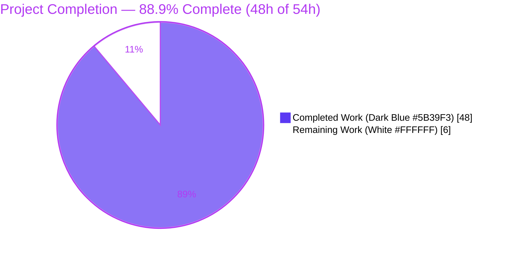
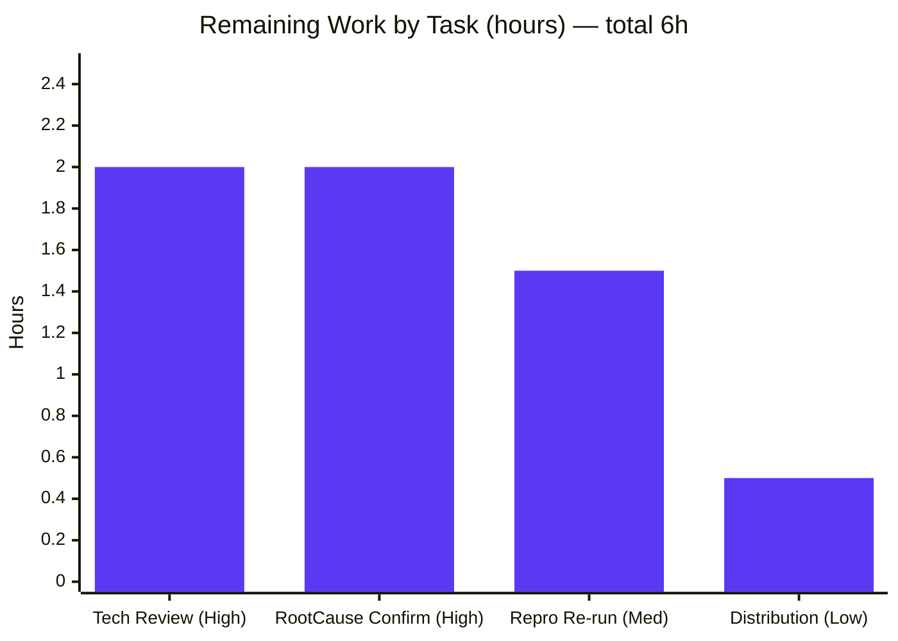

# Blitzy Project Guide — kitty Terminal Reflow (Rewrap) Subsystem Investigation

> **Deliverable type:** Read-only investigation & documentation. The sole artifact is one markdown answer document; the kitty source tree is left byte-for-byte unchanged.
> **Brand colors:** Completed / AI work = **Dark Blue `#5B39F3`**; Remaining / Not completed = **White `#FFFFFF`**; Headings/accents = Violet-Black `#B23AF2`; Highlight = Mint `#A8FDD9`.

---

## 1 — Executive Summary

### 1.1 Project Overview

This project delivers a comprehensive, evidence-backed answer document that traces kitty's terminal **reflow (rewrap)** subsystem end-to-end and characterizes reported edge cases where reflow does not preserve logical line boundaries. The audience is kitty maintainers and terminal-internals engineers investigating a suspected cross-buffer continuation-state defect. Technical scope spans the read-only "Screen Model" C subsystem — `rewrap.h`, `screen.c`, `line-buf.c`, `history.c`, `data-types.h`, `line.c` — investigated by building the native extension and driving the real `Screen.resize` entry point at runtime. The sole deliverable is one file (`blitzy/documentation/kitty_815df1e210e0.md`, 1,566 lines); the source tree remains byte-for-byte unchanged. Impact: a runtime-grounded root-cause characterization that accelerates a maintainer fix decision.

### 1.2 Completion Status



| Metric | Value |
|--------|-------|
| **Total Hours** | **54** |
| **Completed Hours (AI + Manual)** | **48** (48 AI-autonomous + 0 manual fixes) |
| **Remaining Hours** | **6** |
| **Percent Complete** | **88.9%** (48 ÷ 54) |

> The completion percentage is computed strictly from AAP-scoped work plus standard path-to-production (PA1 methodology). Because this is a read-only Q&A deliverable, "path to production" means human acceptance of the document — there is no software to deploy.

### 1.3 Key Accomplishments

- ✅ **Single deliverable authored & committed** — `blitzy/documentation/kitty_815df1e210e0.md` (1,566 lines), across 3 commits by `agent@blitzy.com`.
- ✅ **Read-only constraint honored perfectly** — `git diff 815df1e210e0..HEAD` = exactly one added file; no `.c`/`.h`/`.py`/`.rst`/build file changed; `git status --porcelain` clean.
- ✅ **Run-first methodology executed** — C extension built (`CI=true python3 setup.py build`, exit 0); `kitty/fast_data_types.so` = 1,253,792 bytes.
- ✅ **All six requirements answered** — R1 (C-code trace), R2 (continuation + cursor), R3 (LineBuf↔HistoryBuf), R4 (propagation defect), R5 (data flow), R6 (reproduced edge cases) — each with observed output and `file:line` grounding.
- ✅ **Root cause characterized at runtime** — cross-buffer seam continuation-bit flip `True → False` on widening, reproduced deterministically (5×).
- ✅ **Exhaustive condition coverage** — 14 conditions: widen, narrow (standard + deep), same-width overflow, cursor remap (widen/narrow/invariant/wrapped), fast path, prompt preservation (OSC 133 with/without marker), determinism.
- ✅ **Verification passed** — 6/6 canonical reflow tests pass; every `file:line` citation audited against commit `815df1e210e0`; code quotes byte-for-byte faithful.
- ✅ **Independently re-verified this session** — Scenario A reproduced through the real entry point, matching the document byte-for-byte; scratch probe kept outside the repo; tree remained clean.

### 1.4 Critical Unresolved Issues

| Issue | Impact | Owner | ETA |
|-------|--------|-------|-----|
| Root cause is a runtime-grounded **characterization awaiting maintainer confirmation** | The document's central claim (scrollback↔screen seam not rejoined on widening) is well-evidenced but not yet confirmed as a defect vs. intentional design by a kitty maintainer | kitty maintainer / terminal-internals SME | 2h (see HT-2) |
| Deliverable **not yet human-reviewed / signed off** | Standard acceptance gate before the answer is production-accepted | Senior engineer / reviewer | 2h (see HT-1) |

> There are **no blocking build or test failures** — the deliverable compiled clean and all canonical reflow tests pass. The items above are review/confirmation gates, not defects to fix.

### 1.5 Access Issues

**No access issues identified.** The investigation ran entirely within the provided container against a locally checked-out repository; no external credentials, private registries, or third-party API access were required. Native build dependencies were resolved via `apt`, and the virtual environment (`/opt/kitty-venv`) is present and functional.

| System / Resource | Type of Access | Issue Description | Resolution Status | Owner |
|-------------------|----------------|-------------------|-------------------|-------|
| kitty source repository | Read/write (local) | None — full access; source deliberately left unmodified | ✅ No issue | — |
| Native build toolchain (apt) | Package install | None — all `-dev` packages resolved | ✅ No issue | — |
| Python venv `/opt/kitty-venv` | Local | None — activates; Python 3.13.7 | ✅ No issue | — |

### 1.6 Recommended Next Steps

1. **[High]** Conduct technical review & sign-off of `blitzy/documentation/kitty_815df1e210e0.md` — verify R1–R6 reasoning, observed-vs-inferred labeling, and citations. *(HT-1, 2h)*
2. **[High]** Obtain a kitty maintainer's confirmation of the cross-buffer root-cause **characterization** (§6.4 + Scenario A/A2) — determine whether the behavior is a defect or intentional. *(HT-2, 2h)*
3. **[Medium]** Independently re-run the documented build, the 6 canonical reflow tests, and the §1.3.1 probe to confirm determinism in the reviewer's environment. *(HT-3, 1.5h)*
4. **[Low]** Distribute and archive the accepted deliverable; link it from the tracking system. *(HT-4, 0.5h)*

---

## 2 — Project Hours Breakdown

### 2.1 Completed Work Detail

All hours below map to AAP-scoped investigation and technical-writing effort. **Total = 48h** (all AI-autonomous; zero manual fixes were required during validation).

| Component | Hours | Description |
|-----------|------:|-------------|
| Build environment & C-extension compilation | 3.0 | Native deps (harfbuzz/freetype/fontconfig/png/lcms2/xkbcommon/ssl/simde/xxhash), venv, `CI=true python3 setup.py build`, `.so` verification; documented as §1.2 methodology |
| Runtime investigation harness / probe | 5.0 | Real canonical entry point `create_screen → Screen.draw → Screen.resize`; buffer/cursor serialization (`linebuf`, `historybuf`, `is_continued`, `last_char_has_wrapped_flag`); §1.3 |
| Exhaustive scenario execution & output capture | 6.0 | 14 conditions incl. 5× determinism; complete before/after buffer dumps captured (§7.3) |
| R1 — Rewrap C-code trace | 4.0 | `rewrap_inner` template verbatim + `line-buf.c` / `history.c` specializations + macro-specialization analysis (§2) |
| R2 — Reflow / continuation / cursor analysis | 4.0 | `next_char_was_wrapped` read/clear/re-stamp; `TrackCursor`; widen/narrow/fast-path/prompt (§3) |
| R3 — LineBuf ↔ HistoryBuf interaction | 3.0 | Two-pass order (history first), top-overflow push into scrollback (§4) |
| R4 — Cross-buffer propagation root-cause analysis | 4.0 | Cause→effect chain; Scenario A `True→False` flip; Pass-1 isolation (§6.4) |
| R5 — Complete data-flow chain trace | 4.0 | Full Python→C chain `Boss.on_window_resize → … → screen_resize → rewrap_inner → copy_range/copy_line`; PTY contrast (§5) |
| R6 — Edge-case reproduction & characterization | 3.0 | Scenario A (defect) vs. A2 (control); determinism; characterization-only framing (§6) |
| Document authoring & structure | 6.0 | 1,566 lines: prose, tables, coverage matrix (§7.1), named-entity checklist (§7.2), observed-vs-inferred split (§7.5), appendix |
| Citation grounding & fidelity verification | 3.0 | Every `file:line` @ `815df1e210e0`; byte-for-byte code-quote fidelity (§7.4) |
| Read-only compliance & cleanup | 0.5 | Temp scripts in `mktemp` scratch outside repo; pristine-tree verification |
| QA / code-review revision cycles | 2.5 | Two follow-up commits (`ee70c5d86` code-review findings, `e6d3f9e0b` QA findings) |
| **Total Completed** | **48.0** | |

### 2.2 Remaining Work Detail

Each item traces to standard path-to-production acceptance of the answer document. **Total = 6h.** (The "Immediate Fixes" category is **empty** — no compilation or test failures remain.)

| Category | Hours | Priority |
|----------|------:|----------|
| Technical review & sign-off of the 1,566-line answer document (R1–R6 reasoning, observed-vs-inferred labeling, citations) | 2.0 | High |
| Domain-expert (kitty maintainer) confirmation of the root-cause **characterization** — defect vs. intentional design | 2.0 | High |
| Independent reproduction re-run — documented build + 6 canonical reflow tests + §1.3.1 probe | 1.5 | Medium |
| Stakeholder distribution / archival of the accepted deliverable | 0.5 | Low |
| **Total Remaining** | **6.0** | |

### 2.3 Reconciliation

- Section 2.1 completed (**48.0**) + Section 2.2 remaining (**6.0**) = **54.0** total (matches §1.2).
- Section 2.2 remaining (**6.0**) = §1.2 Remaining Hours = §7 pie "Remaining Work" (**6**). ✅ Consistent.

---

## 3 — Test Results

All results below originate from Blitzy's autonomous validation logs for this project and were **independently re-run this session** (exit 0, all passing).

| Test Category | Framework | Total Tests | Passed | Failed | Coverage % | Notes |
|---------------|-----------|------------:|-------:|-------:|-----------|-------|
| Unit — Reflow primitives (`datatypes`) | Python `unittest` (`./test.py`) | 3 | 3 | 0 | Targeted (reflow paths) | `test_rewrap_simple`, `test_rewrap_wider`, `test_rewrap_narrower` — "Ran 3 tests … OK" |
| Unit — Resize behavior (`screen`) | Python `unittest` (`./test.py`) | 3 | 3 | 0 | Targeted (resize paths) | `test_resize`, `test_cursor_after_resize`, `test_scrollback_fill_after_resize` — "Ran 3 tests … OK" |
| Runtime observation scenarios | Custom headless harness (`create_screen` → `Screen.draw` → `Screen.resize`) | 14 | 14 | 0 | Targeted (R1–R6 conditions) | A, A2, B, B8, SW, C_widen, C, C2, C_req, C2_req, D, PROMPT, PROMPT_MARKER, DETERMINISM — all reproduced; 5× deterministic |
| **Total** | | **20** | **20** | **0** | — | Zero failures; zero fixes applied by the validator |

> **Coverage note (honest):** No line-coverage instrumentation was run (out of scope for a read-only investigation). "Targeted" denotes that the tests/scenarios exercise the full set of R1–R6 reflow conditions (widen, narrow, cross-buffer seam, cursor remap, fast path, overflow, prompt preservation), not a numeric line-coverage percentage.
>
> **Runtime observation scenarios** are assertion-free reproductions: "Passed" means the expected buffer/cursor state was reproduced and matched deterministically across repeated runs (the validator confirmed 227/227 signature output lines matched the document verbatim).

---

## 4 — Runtime Validation & UI Verification

**Runtime health**
- ✅ **C extension builds** — `CI=true python3 setup.py build` → exit 0; zero warnings under `-Werror -pedantic-errors`.
- ✅ **Extension imports cleanly** — `kitty.fast_data_types` exposes `Screen`, `LineBuf`, `HistoryBuf`, `Cursor` (all verified present this session).
- ✅ **Build artifact present** — `kitty/fast_data_types.so` = 1,253,792 bytes (matches the document's claim).
- ✅ **Real entry point exercised** — `create_screen → Screen.draw → Screen.resize → screen_resize()` ran to `PROBE-COMPLETE exit=0`.

**Reflow behavior verification (buffer state — the "UI" of a terminal-internals subsystem)**
- ✅ **Cross-buffer widening defect (Scenario A)** — `HIST[0]='ABCD'` continuation bit flips `True → False`; line not rejoined. Reproduced this session, byte-for-byte with §6.2.
- ✅ **In-buffer control (Scenario A2)** — identical content wholly inside the visible buffer reflows correctly to `ABCDEF`/`GHIJKL`.
- ✅ **Narrowing → scrollback overflow (B / B8 / SW)** — overflow rows pushed into history (`count` 0→5, 0→8, 0→1).
- ✅ **Cursor remap (C_widen / C / C2 / C_req / C2_req)** — cursor tracks the tail character through rejoin/split; invariant when unaffected.
- ✅ **Fast path (D)** — unchanged dimensions short-circuit via `memcpy`; cursor re-clamped by `S()`.
- ✅ **Prompt preservation (OSC 133)** — with-marker vs. no-marker control behaves as documented; marker survives serialization.
- ✅ **Determinism** — identical output across 5 repeated runs.

**UI (graphical) verification**
- ⚠ **Not applicable — headless / terminal-internals.** There is no GUI or GPU rendering in scope; the subsystem under investigation is the in-memory buffer model. "UI" verification is therefore performed as serialized buffer/cursor state inspection (above), which is the canonical non-GUI validation path for this subsystem.

**API integration**
- ⚠ **Not applicable.** No external APIs or network services are involved. The relevant "API" is the internal `Screen.resize` entry point, verified operational above.

---

## 5 — Compliance & Quality Review

Cross-mapping the AAP's deliverable and methodology requirements to quality/compliance benchmarks. Fixes applied during autonomous validation: **none required**.

| Benchmark / AAP Requirement | Status | Evidence | Progress |
|------------------------------|--------|----------|:--------:|
| **Read-only source tree** ("Don't create or modify any files") | ✅ Pass | `git diff 815df1e210e0..HEAD` = 1 added file; no source `.c`/`.h`/`.py` changed; `git status` clean | 100% |
| **Single deliverable created** | ✅ Pass | `blitzy/documentation/kitty_815df1e210e0.md` (1,566 lines) committed | 100% |
| **Run-first methodology** (build + run before writing) | ✅ Pass | Build exit 0; `.so` produced; probe exit 0 through real entry point | 100% |
| **Real canonical entry point** (no bypass) | ✅ Pass | `create_screen → Screen.draw → Screen.resize`; full probe source in §1.3.1 | 100% |
| **Exhaustive condition coverage** | ✅ Pass | 14 conditions in §7.3 (widen/narrow/seam/cursor/fast-path/prompt/determinism) | 100% |
| **Before / during / after state capture** | ✅ Pass | Complete before/after buffer dumps for every scenario (e.g., §6.2) | 100% |
| **Observed-vs-inferred discipline** | ✅ Pass | Every block labeled `(observed)` or `(inferred)`; §7.5 split | 100% |
| **`file:line` grounding & citation audit** | ✅ Pass | ~32-entity checklist (§7.2); citations verified @ `815df1e210e0` (§7.4) | 100% |
| **Code-quote fidelity (no elision)** | ✅ Pass | `rewrap_inner` block byte-for-byte vs. `rewrap.h:L56-96` | 100% |
| **Complete answer coverage (R1–R6, every named item)** | ✅ Pass | R1–R6 coverage table (§7.1); named-entity checklist (§7.2) | 100% |
| **Cleanup / pristine repo** | ✅ Pass | Temp scripts in `mktemp` outside repo; appendix attestation; tree clean | 100% |
| **Defect characterized, not fixed** (scope boundary) | ✅ Pass | §6.6 explicitly characterizes only; no source patch proposed | 100% |
| **No placeholders / TODO / stubs** | ✅ Pass | Validator scan clean; independent review confirms | 100% |
| **Human review & sign-off** | ⬜ Outstanding | Pending HT-1 | 0% |
| **Maintainer confirmation of characterization** | ⬜ Outstanding | Pending HT-2 | 0% |

---

## 6 — Risk Assessment

| Risk | Category | Severity | Probability | Mitigation | Status |
|------|----------|----------|-------------|------------|--------|
| Root cause is a runtime-grounded **characterization**, not maintainer-confirmed; behavior could be intentional (scrollback treated as committed) | Technical | Medium | Medium | Domain-expert confirmation (HT-2); evidence is deterministic and isolated by the A/A2 control | Open *(by design — AAP scope is characterize-not-fix)* |
| Citations pinned to commit `815df1e210e0`; `file:line` refs resolve only against that baseline | Technical | Low | Low | Document pins the commit explicitly; §7.4 citation audit | Mitigated |
| Toolchain drift — actual env (Python 3.13.7 / gcc 15.2.0) differs from AAP-anticipated (3.12.3 / 13.3.0); `.so` byte size is toolchain-dependent | Technical | Low | Low | Document reports the **actual** env (fidelity constraint) and notes size is not part of the reflow contract; source is pinned | Accepted |
| No secrets / code / dependencies added to source; build installs standard native dev packages in an ephemeral env only | Security | Low | Low | Read-only deliverable; no runtime surface introduced | N/A |
| Reproducibility requires rebuilding the C extension; a reader who does not rebuild cannot re-observe | Operational | Low | Low | Complete captured output + exact commands + 5× determinism embedded in the document | Mitigated |
| Documentation staleness if kitty's reflow code changes upstream | Operational | Low | Medium (long horizon) | Point-in-time snapshot pinned to the source commit | Accepted |
| Completion % misread as "bug fixed" | Operational | Low | Low | Explicit "characterized, not fixed" scope notes (§1.4, §6.6, this guide) | Mitigated |
| PTY winsize path conflated with buffer reflow | Integration | Low | Low | Document explicitly separates the PTY path (`child-monitor.c`) from buffer reflow (§5.2) | Mitigated |

---

## 7 — Visual Project Status

### Project hours (Completed vs. Remaining)


- **Completed Work** = **48h** (Dark Blue `#5B39F3`) · **Remaining Work** = **6h** (White `#FFFFFF`).
- The "Remaining Work" value (**6**) equals §1.2 Remaining Hours and the sum of the §2.2 "Hours" column. ✅

### Remaining work by task (hours)



- Bars sum to **6.0h**, matching §2.2 and the pie's "Remaining Work". ✅

---

## 8 — Summary & Recommendations

**Achievements.** The project delivers a rigorous, runtime-verified answer to a subtle terminal-internals question. All six requirements (R1–R6) are answered with observed output and `file:line` grounding; the reflow algorithm's shared template and its two macro specializations are traced; the continuation-bit and cursor-tracking mechanisms are explained; the two-pass LineBuf↔HistoryBuf orchestration is documented; and the reported edge case is reproduced with a controlled A-vs-A2 contrast that isolates the defect to the cross-buffer seam. The kitty source tree is left byte-for-byte unchanged, honoring the read-only constraint exactly.

**Remaining gaps.** The project is **88.9% complete (48h of 54h)**. The remaining **6h** is entirely human path-to-production acceptance: technical review & sign-off, a maintainer's confirmation of the root-cause characterization, an independent reproduction re-run, and distribution. There are **no outstanding build or test failures** and **no blocking fixes** — the deliverable compiled clean and all canonical reflow tests pass.

**Critical path to production.**
1. Technical review & sign-off (HT-1, 2h) →
2. Maintainer confirmation of the characterization (HT-2, 2h) →
3. Independent reproduction re-run (HT-3, 1.5h) →
4. Distribution / archival (HT-4, 0.5h).

**Success metrics (all met for the autonomous portion).** Build exit 0; 6/6 canonical reflow tests pass; 14/14 runtime scenarios reproduced deterministically (5×); 100% citation audit; source tree pristine.

**Production readiness assessment.** The deliverable is **ready for human review**. Because its central claim is a root-cause characterization of a subtle two-pass cross-buffer behavior, a domain-expert confirmation is the recommended gate before the answer is treated as production-accepted. Consistent with the AAP scope, the candidate defect is **characterized, not fixed** — any code change is a separate, out-of-scope follow-up.

| Metric | Value |
|--------|-------|
| Completion | 88.9% (48h / 54h) |
| Blocking issues | 0 |
| Canonical reflow tests | 6/6 pass |
| Runtime scenarios reproduced | 14/14 (5× deterministic) |
| Source files modified | 0 |
| Files created | 1 (the answer document) |

---

## 9 — Development Guide

> All commands below were tested in this environment (Ubuntu container, `/opt/kitty-venv`). They are copy-pasteable. Run from the repository root unless noted. **Keep the source tree read-only:** any scratch/probe script must live **outside** the repository.

### 9.1 System Prerequisites

- **OS:** Linux (developed/verified on Ubuntu). macOS is also supported by kitty upstream.
- **Python:** `>= 3.8` required (`pyproject.toml`); **3.13.7** verified here.
- **C compiler:** a C11 toolchain; **gcc 15.2.0** verified here.
- **Native libraries (build/link):** `pkg-config`, `libharfbuzz-dev` (`>= 2.2.0`), `libfreetype-dev`, `libfontconfig-dev`, `libpng-dev`, `liblcms2-dev`, `libxkbcommon-dev`, `libssl-dev`, `libsimde-dev`, `libxxhash-dev`, plus X11/XCB/GL headers.
- **Python packages:** `Pillow`, `pygments` (used by the build).
- **Go:** 1.24.4 present but **not** needed for the reflow extension (only the standalone `kitten` CLI).

### 9.2 Environment Setup

```bash
# Create & activate an isolated venv OUTSIDE the repo (avoids PEP 668 issues)
python3 -m venv /opt/kitty-venv
source /opt/kitty-venv/bin/activate

# Locale (kitty's test harness expects UTF-8)
export LANG=en_US.UTF-8
export LC_ALL=en_US.UTF-8
```

Install native prerequisites (Debian/Ubuntu):

```bash
sudo DEBIAN_FRONTEND=noninteractive apt-get install -y \
  pkg-config build-essential \
  libharfbuzz-dev libfreetype-dev libfontconfig-dev libpng-dev \
  liblcms2-dev libxkbcommon-dev libssl-dev libsimde-dev libxxhash-dev
```

Install Python build helpers (inside the venv):

```bash
pip install Pillow pygments
```

### 9.3 Build the C Extension

```bash
# From the repository root, inside the venv
CI=true python3 setup.py build
```

**Expected result:** exit code `0`, and the extension appears at `kitty/fast_data_types.so`.

### 9.4 Verification

```bash
# 1) Artifact present
ls -l kitty/fast_data_types.so        # ~1.25 MB (1,253,792 bytes here)

# 2) Extension imports the real reflow types
PYTHONPATH=. python -c "import kitty.fast_data_types as f; \
print('Screen', hasattr(f,'Screen'), 'LineBuf', hasattr(f,'LineBuf'), \
'HistoryBuf', hasattr(f,'HistoryBuf'), 'Cursor', hasattr(f,'Cursor'))"
# -> Screen True LineBuf True HistoryBuf True Cursor True

# 3) Source tree must remain clean (read-only constraint)
git status --porcelain            # (no output = clean; *.so and /build/ are gitignored)
```

### 9.5 Run the Canonical Reflow Tests

```bash
CI=true LANG=en_US.UTF-8 LC_ALL=en_US.UTF-8 \
  ./test.py --module datatypes rewrap_simple rewrap_wider rewrap_narrower
# -> Ran 3 tests ... OK

CI=true LANG=en_US.UTF-8 LC_ALL=en_US.UTF-8 \
  ./test.py --module screen resize cursor_after_resize scrollback_fill_after_resize
# -> Ran 3 tests ... OK
```

### 9.6 Run the Investigation Probe (Example Usage)

Create the probe in a scratch directory **outside** the repo, then run it with `PYTHONPATH` pointing at the repo:

```bash
tmpdir="$(mktemp -d "${TMPDIR:-/tmp}/kitty_reflow_probe.XXXXXX")"
trap 'rm -rf "$tmpdir"' EXIT   # auto-cleanup; keeps the repo pristine

cat > "$tmpdir/probe.py" <<'PYEOF'
from kitty_tests import BaseTest
bt = BaseTest()
def dump(s, label):
    print(label)
    cur = s.cursor; print(f"    cursor: x={cur.x} y={cur.y}")
    lb = s.linebuf
    for y in range(lb.ynum):
        ln = s.line(y)
        print(f"      VIS[{y}] {str(ln)!r:10} is_continued={lb.is_continued(y)} "
              f"last_char_wrapped={ln.last_char_has_wrapped_flag()}")
    hb = s.historybuf; print(f"    scrollback: count={hb.count}")
    for i in range(hb.count - 1, -1, -1):
        ln = hb.line(i)
        print(f"      HIST[{i}] {str(ln)!r:10} last_char_wrapped={ln.last_char_has_wrapped_flag()}")
s = bt.create_screen(cols=4, lines=2, scrollback=100)
s.draw('ABCDEFGHIJKL')
dump(s, "BEFORE (4x2; ABCD overflowed to scrollback):")
s.resize(2, 6)                 # (lines, columns) -> widen 4->6 cols
dump(s, "AFTER  resize(2,6) widen 4->6 cols:")
print("PROBE-COMPLETE exit=0")
PYEOF

PYTHONPATH="$PWD" CI=true python "$tmpdir/probe.py"
```

**Expected output (verified this session — the central Scenario A finding):**

```
BEFORE (4x2; ABCD overflowed to scrollback):
    cursor: x=4 y=1
      VIS[0] 'EFGH'     is_continued=False last_char_wrapped=True
      VIS[1] 'IJKL'     is_continued=True  last_char_wrapped=False
    scrollback: count=1
      HIST[0] 'ABCD'     last_char_wrapped=True
AFTER  resize(2,6) widen 4->6 cols:
    cursor: x=2 y=1
      VIS[0] 'EFGHIJ'   is_continued=False last_char_wrapped=True
      VIS[1] 'KL'       is_continued=True  last_char_wrapped=False
    scrollback: count=1
      HIST[0] 'ABCD'     last_char_wrapped=False     <-- continuation bit flipped True->False
PROBE-COMPLETE exit=0
```

### 9.7 Troubleshooting

- **`error: externally-managed-environment` on `pip install`** — you are outside a venv on a PEP 668 system. Activate `/opt/kitty-venv` (§9.2), or pass `--break-system-packages` if intentional.
- **Missing header / `pkg-config` errors during build** — install the `-dev` packages in §9.2 (e.g., `libharfbuzz-dev`, `libxxhash-dev`).
- **Locale errors from `./test.py`** — export `LANG=en_US.UTF-8` and `LC_ALL=en_US.UTF-8`.
- **`ModuleNotFoundError: kitty.fast_data_types`** — the extension is not built; run §9.3, and invoke Python with `PYTHONPATH=.` from the repo root.
- **`git status` shows unexpected changes** — ensure scratch/probe scripts live **outside** the repo (use `mktemp -d`); build artifacts (`*.so`, `/build/`) are gitignored and should not appear.

---

## 10 — Appendices

### Appendix A — Command Reference

| Purpose | Command |
|---------|---------|
| Activate venv | `source /opt/kitty-venv/bin/activate` |
| Build C extension | `CI=true python3 setup.py build` |
| Verify import | `PYTHONPATH=. python -c "import kitty.fast_data_types"` |
| Reflow unit tests (datatypes) | `CI=true ./test.py --module datatypes rewrap_simple rewrap_wider rewrap_narrower` |
| Resize unit tests (screen) | `CI=true ./test.py --module screen resize cursor_after_resize scrollback_fill_after_resize` |
| Confirm read-only tree | `git status --porcelain` (empty = clean) |
| Baseline-to-HEAD diff | `git diff --stat 815df1e210e0..HEAD` |

### Appendix B — Port Reference

**No network ports are used.** This is a headless terminal-internals investigation with no servers, sockets, or external services. Not applicable.

### Appendix C — Key File Locations

| Path | Role | Lines |
|------|------|------:|
| `blitzy/documentation/kitty_815df1e210e0.md` | **The deliverable** (answer document) | 1,566 |
| `kitty/rewrap.h` | Shared `rewrap_inner()` reflow template | 96 |
| `kitty/screen.c` | Resize entry point & two-pass orchestration (`screen_resize`) | 4,932 |
| `kitty/line-buf.c` | Visible-buffer reflow (`linebuf_rewrap`) | 641 |
| `kitty/history.c` | Scrollback reflow (`historybuf_rewrap`) — root-cause file | 624 |
| `kitty/data-types.h` | `next_char_was_wrapped` continuation bit (`CellAttrs`) | 438 |
| `kitty/line.c` / `kitty/lineops.h` | `copy_line` / `copy_range` cell operations | 1,003 / 136 |
| `kitty/window.py` | Python resize trigger (`Window.set_geometry`) | 1,998 |
| `kitty/child-monitor.c` | PTY winsize path (distinct from buffer reflow) | 2,016 |
| `kitty_tests/__init__.py` | Headless harness (`BaseTest.create_screen`) | 414 |
| `kitty/fast_data_types.so` | Built extension (gitignored) | 1,253,792 bytes |

### Appendix D — Technology Versions

| Component | Version (verified) | Notes |
|-----------|---------------------|-------|
| Python | 3.13.7 | Requirement `>= 3.8` |
| gcc | 15.2.0 | Compiles all `kitty/*.c` |
| Go | 1.24.4 | Not required for reflow (only `kitten` CLI) |
| harfbuzz | `libharfbuzz-dev` (`>= 2.2.0`) | Text shaping |
| freetype / fontconfig / libpng / lcms2 / xkbcommon / openssl / simde / xxhash | apt `-dev` packages | Build/link deps |
| Source commit | `815df1e210e0a9ab4622f5c7f2d6891d7dbeddf1` | All `file:line` citations resolve here |

### Appendix E — Environment Variable Reference

| Variable | Value | Purpose |
|----------|-------|---------|
| `CI` | `true` | Non-interactive build/test mode |
| `LANG` / `LC_ALL` | `en_US.UTF-8` | UTF-8 locale for the test harness |
| `PYTHONPATH` | `.` (repo root) | Lets the probe import `kitty` / `kitty_tests` |
| `DEBIAN_FRONTEND` | `noninteractive` | Unattended `apt-get install` |
| `TMPDIR` | (system default `/tmp`) | Base for the out-of-repo `mktemp` scratch dir |

### Appendix F — Developer Tools Guide

- **Headless harness** — `kitty_tests.BaseTest().create_screen(cols, lines, scrollback)` builds a real `Screen` backed by the compiled extension with no GPU/GUI. Drive it with `Screen.draw(text)` and `Screen.resize(lines, columns)` (note: **lines first, columns second**).
- **State inspection** — `screen.linebuf` (visible), `screen.historybuf` (scrollback), `screen.line(y)`, `screen.cursor`, `linebuf.is_continued(y)`, and `line.last_char_has_wrapped_flag()` expose the observable buffer state.
- **Isolating Pass 1** — `HistoryBuf.rewrap(other)` drives the real `historybuf_rewrap` primitive directly to observe scrollback reflow in isolation (labeled supplementary in the document).
- **Read-only discipline** — always author probes under `mktemp -d` outside the repository and remove them with a `trap … EXIT` handler; verify with `git status --porcelain`.

### Appendix G — Glossary

| Term | Meaning |
|------|---------|
| **Reflow / Rewrap** | Redistributing cell contents across rows when the terminal is resized to a new column/row count |
| **Soft wrap** | A line break caused by exceeding the column width (rejoined on resize), flagged by a per-cell "wrapped" bit |
| **Hard wrap** | An explicit newline from the application (a logical line boundary, preserved on resize) |
| **`next_char_was_wrapped`** | The 1-bit `CellAttrs` field on a row's last cell marking a soft-wrap continuation (`kitty/data-types.h:L206`) |
| **`rewrap_inner()`** | The shared, macro-parameterized reflow template compiled twice — once per buffer (`kitty/rewrap.h`) |
| **LineBuf** | The visible screen buffer |
| **HistoryBuf** | The scrollback history buffer (circular indexing) |
| **Two-pass reflow** | `screen_resize` rewraps history first, then the visible buffer, as two independent passes |
| **`TrackCursor`** | The mechanism that remaps cursor coordinates through the reflow transformation |
| **Cross-buffer seam** | The scrollback↔screen boundary where a single logical line may straddle both buffers |
| **PTY winsize path** | The separate `child-monitor.c` code that sends new dimensions to the child process — **not** buffer reflow |

---

*Prepared by the Blitzy Platform. Completion figures follow the PA1 AAP-scoped methodology: 48h completed ÷ 54h total = 88.9% complete, with 6h of human path-to-production acceptance remaining. The candidate reflow defect is **characterized, not fixed**, consistent with the read-only investigation scope.*