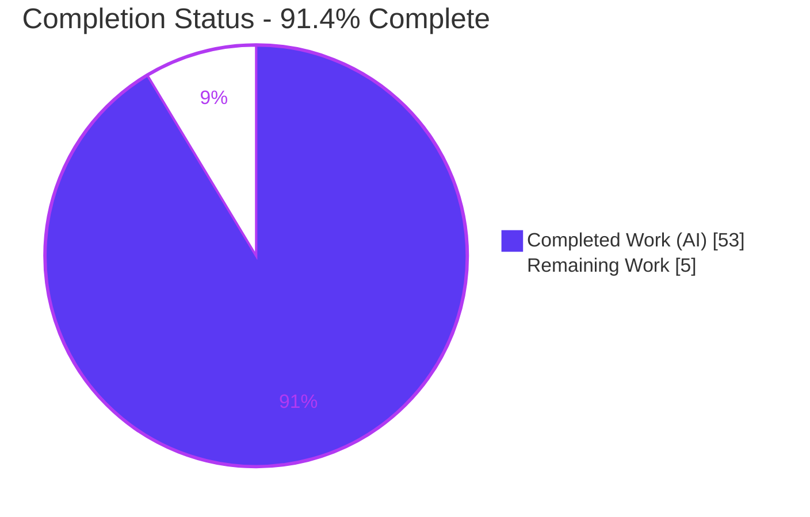
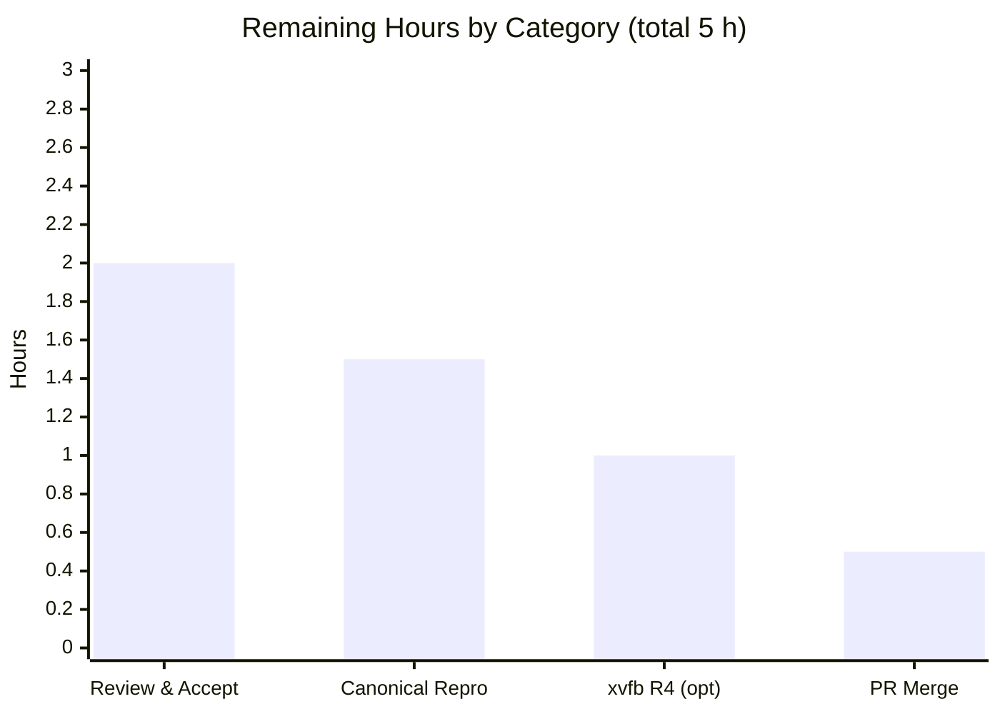

# Blitzy Project Guide

> **Project:** Runtime-grounded Q&A on kitty's two-tier history/scrollback under flood
> **Branch:** `kitty_815df1e210e0` · **Working branch:** `blitzy-2c20a2c6-d822-4dc7-b3a5-1da9e99ccb63` · **HEAD:** `904f69cd6`
> **Task type:** Documentation (strictly read-only investigation) · **Rule set:** SWE-AtlasQnA-Repo
>
> **Brand color legend:**  **Completed / AI Work — Dark Blue `#5B39F3`** ·  **Remaining — White `#FFFFFF`** · Headings/Accents Violet-Black `#B23AF2` · Highlight Mint `#A8FDD9`

---

## 1. Executive Summary

### 1.1 Project Overview

This project delivers a single, runtime-grounded technical Q&A document explaining how kitty's two-tier history/scrollback subsystem behaves when a command floods the terminal with an enormous amount of text. Tier 1 is the interactively-scrollable segmented `HistoryBuf`; Tier 2 is a pager-style byte ring buffer. The deliverable — `blitzy/documentation/kitty_815df1e210e0.md` — answers five sub-questions (segment growth, inter-tier spill, boundary smoothness, concurrent scroll-while-write, and allocation/retention at scale) using actual observed output from building and running kitty's real C data structures. The audience is kitty maintainers and systems engineers. It is a strictly read-only investigation: no product source code is changed.

### 1.2 Completion Status



| Metric | Value |
|--------|-------|
| **Total Hours** | **58** |
| **Completed Hours (AI + Manual)** | **53** (AI: 53 · Manual: 0) |
| **Remaining Hours** | **5** |
| **Percent Complete** | **91.4%** (53 ÷ 58 × 100) |

> The 91.4% reflects AAP-scoped + path-to-production work only. **100% of the autonomous (AAP-scoped) work universe is complete and validated**; the remaining 8.6% is standard path-to-production human activity (review, sign-off reproduction, optional windowed confirmation, merge).

### 1.3 Key Accomplishments

- ✅ **Sole deliverable created and committed** — `blitzy/documentation/kitty_815df1e210e0.md` (630 lines, ~7,700 words) at HEAD `904f69cd6`.
- ✅ **Runtime-grounded, not code-reading** — a 238-line reproducible observation harness drives the real `HistoryBuf`/`Screen` objects via the canonical `fast_data_types` entry point.
- ✅ **All five sub-questions (R1–R5) answered** with prose + exact command + complete unedited RUN1/RUN2 output + Observed-vs-Inferred labeling + stability statement.
- ✅ **C extension builds and imports** in both the canonical Docker image (default build → `fast_data_types.so` = 1,213,072 B) and the newer-toolchain host (1,253,792 B).
- ✅ **Independently reproduced this session** — harness `EXIT=0` across two runs; every deterministic R1–R5 value matched exactly.
- ✅ **Subsystem unit tests pass** — `datatypes` 18/18, `screen` 36/36.
- ✅ **100% of 40+ `file:line` references verified accurate** at commit `815df1e210e0`.
- ✅ **Strictly read-only rule honored** — exactly one file added; zero source/test/config modifications; repository clean (868 tracked files).

### 1.4 Critical Unresolved Issues

**No critical unresolved issues.** The Final Validator reported zero discrepancies, and all four production-readiness gates passed. There are no blocking compilation errors and no failing tests.

| Issue | Impact | Owner | ETA |
|-------|--------|-------|-----|
| _None — no release-blocking or validation-blocking items_ | — | — | — |
| _(Non-blocking, optional)_ R4 production render re-clamp corroborated via test-only method + labeled inference; end-to-end windowed run not exercised | Informational only; the production statement at `screen.c:2761` is byte-identical to the observed one | Human reviewer | ~1 h (optional) |

### 1.5 Access Issues

**No access issues identified.** The repository is present locally, all read-only source targets exist, the C extension builds and imports, and the subsystem test suites run to completion. No repository permissions, service credentials, or third-party API access were required or blocked.

| System / Resource | Type of Access | Issue Description | Resolution Status | Owner |
|-------------------|----------------|-------------------|-------------------|-------|
| _None_ | — | No access issues identified | N/A | — |

### 1.6 Recommended Next Steps

1. **[High]** Perform a subject-matter technical review of `kitty_815df1e210e0.md` and accept it (verify R1–R5 answers, Observed-vs-Inferred labels, scale/stability, and read-only compliance).
2. **[Medium]** Independently reproduce the headline magnitudes inside the pinned canonical Docker image (`python3 setup.py build` → 1,213,072 B; run the embedded harness).
3. **[Low]** _(Optional)_ Run a windowed kitty under `xvfb` to exercise the R4 production render re-clamp (`screen_update_cell_data`) end-to-end, confirming the last inferred claim.
4. **[Low]** Verify read-only integrity (`git status` clean, `git ls-files | wc -l` = 868) and merge the working branch.

---

## 2. Project Hours Breakdown

### 2.1 Completed Work Detail

All completed work was performed autonomously by Blitzy agents (AI). Each component traces to an AAP requirement.

| Component | Hours | Description |
|-----------|-------|-------------|
| Canonical C-extension build & environment setup | 3 | `python3 setup.py build` → `fast_data_types.so`; verified `HistoryBuf`/`Screen`/`LineBuf` import (AAP prerequisite) |
| Read-only observation harness | 10 | 238-line harness: canonical `fast_data_types` drivers + in-process `ctypes` live-struct reader (self-validated offsets) + same-process `calloc` calibration + R1–R5 drivers |
| R1 — Segment growth investigation & writeup | 4 | `add_segment`/`segment_for` carve at each 2048 boundary; `num_segments` growth; per-segment 5,251,072 B allocation |
| R2 — Inter-tier spill investigation & writeup | 3 | `historybuf_push`→`pagerhist_push` at `count==ynum`; before/after ring contents; exact serialized bytes |
| R3 — Boundary/edge conditions (5 sub-cases) & writeup | 6 | Ring growth ≥1 MB steps, FIFO ceiling, oversized single-call drop (non-canonical), canonical long-line FIFO, resize reflow |
| R4 — Concurrent scroll-while-write investigation & writeup | 4 | `scrolled_by` re-clamp `MIN(scrolled_by + hlac, count)`; saturation at `ynum`; canonicality labeling |
| R5 — Allocation/wrapping/retention at scale & writeup | 4 | 205,000 pushes; `num_segments`=98; RSS + `tracemalloc`; retention caps; circular `index_of` |
| Environment/build/methodology + Summary sections | 3 | Exact build/invocation commands, default-config disclosure, units (MB vs bytes), canonical-entry-point rationale |
| References table (40+ verified `file:line`) + Synthesis | 4 | Full reference matrix; "quiet interaction" and "smoothness vs hesitation" synthesis |
| Iterative code-review remediation | 7 | 13 code-review findings + per-segment magnitude "F1" fix + canonical-image alignment across 4 commits |
| Final autonomous validation | 5 | Build in 2 environments; harness `EXIT=0` across 2 runs; every claim + `file:line` reproduced; tests 18/18 + 36/36 |
| **Total Completed** | **53** | |

### 2.2 Remaining Work Detail

All remaining work is standard path-to-production (human activity + optional confirmations). None are blocking bug fixes.

| Category | Hours | Priority |
|----------|-------|----------|
| Human technical review & acceptance of the Q&A document | 2.0 | High |
| Independent reproduction in canonical Docker image for sign-off | 1.5 | Medium |
| Optional `xvfb` windowed run to exercise R4 production render re-clamp end-to-end | 1.0 | Low |
| PR merge & read-only/branch cleanup verification | 0.5 | Low |
| **Total Remaining** | **5.0** | |

### 2.3 Hours Reconciliation

| Check | Calculation | Result |
|-------|-------------|--------|
| Section 2.1 + Section 2.2 = Total | 53 + 5 = 58 | ✅ 58 |
| Completion % | 53 ÷ 58 × 100 | ✅ 91.4% |
| Remaining consistency (1.2 = 2.2 = §7) | 5 = 5 = 5 | ✅ Match |

---

## 3. Test Results

All tests below originate from Blitzy's autonomous validation logs and were independently re-run this session. kitty's suite does not emit a coverage percentage, so coverage is marked **n/r** (not reported) rather than fabricated.

| Test Category | Framework | Total Tests | Passed | Failed | Coverage % | Notes |
|---------------|-----------|-------------|--------|--------|-----------|-------|
| Unit — `datatypes` module | Python `unittest` | 18 | 18 | 0 | n/r | Includes `test_historybuf` (canonical `HistoryBuf` pattern crossing the 2048 boundary), `test_linebuf`, `test_rewrap_*`, `test_line` |
| Unit — `screen` module | Python `unittest` | 36 | 36 | 0 | n/r | Exercises `INDEX_UP` ingest and `scrolled_by` behavior |
| Runtime observation harness (R1–R5) | Python + `fast_data_types` | 5 | 5 | 0 | n/r | `EXIT=0`; all deterministic values reproduced across 2 environments × 2 runs (RUN1==RUN2) |
| **Total** | | **59** | **59** | **0** | n/r | 100% pass rate |

**Determinism & stability.** Every reported structural magnitude and exact byte string was identical across RUN1/RUN2 in both the canonical image and the native host. Only the doc-declared non-deterministic quantities varied (heap addresses; the glibc chunk word — 5,255,168 via `mmap` vs 5,251,088 via the main arena; process RSS delta ~478–489 MiB; per-milestone RSS columns). Run-to-run variance is reproduced, not engineered away.

---

## 4. Runtime Validation & UI Verification

**Runtime health (headless C-extension observation):**

- ✅ **Operational** — C extension builds and imports (`HistoryBuf`/`Screen`/`LineBuf`) in the canonical image (1,213,072 B) and native host (1,253,792 B).
- ✅ **Operational** — Observation harness runs `EXIT=0` across 2 environments × 2 runs; R1–R5 deterministic values reproduced exactly.
- ✅ **Operational** — R1 segment carve (#2049/#4097), R2 inter-tier spill (`b'\x1b[mAAAAA\r\n'`), R3 ring growth/FIFO/reflow, R4 re-clamp (`MIN(4+10,56)=14`), R5 retention (`count==ynum`, `num_segments`=98) all confirmed.
- ✅ **Operational** — Subsystem unit tests: `datatypes` 18/18, `screen` 36/36.
- ✅ **Operational** — Read-only integrity: `git status` clean; 868 tracked files; zero source drift.

**API integration:** Not applicable — no external services, network endpoints, or credentials are involved in this read-only documentation task.

**UI verification:**

- ⚪ **N/A** — There is no UI/GUI deliverable. This is a headless documentation task; no Figma frames were provided and no front-end was produced.
- ⚠ **Partial** — The R4 *production* render re-clamp (`screen_update_cell_data`, `kitty/screen.c:2761`) was corroborated via the test-only `update_only_line_graphics_data` method plus a labeled inference (the re-clamp statement is byte-identical to the production one). An end-to-end windowed run (requiring `xvfb`/GPU) was intentionally not performed and is tracked as an optional low-priority item.

---

## 5. Compliance & Quality Review

Cross-mapping the AAP / SWE-AtlasQnA-Repo directives to delivered quality benchmarks. All fixes were applied during autonomous validation; there are no outstanding compliance items.

| # | Benchmark (AAP directive) | Status | Progress | Notes |
|---|---------------------------|--------|----------|-------|
| 1 | Deliverable & location — `blitzy/documentation/<branch>.md` | ✅ Pass | 100% | `kitty_815df1e210e0.md` created and committed at HEAD |
| 2 | Observe by running (build+run first, capture real output) | ✅ Pass | 100% | 238-line harness; complete RUN1/RUN2 output embedded |
| 3 | Report true magnitude + state scale | ✅ Pass | 100% | Up to 205,000 pushes; 5 MB ring; scale stated per section |
| 4 | Stability across ≥2 runs | ✅ Pass | 100% | RUN1==RUN2 for all structural values; variance reproduced |
| 5 | Canonical entry point, zero bypass | ✅ Pass | 100% | `fast_data_types` `HistoryBuf`/`Screen`; the one non-canonical R4 method is explicitly labeled |
| 6 | Default, canonical build/configuration | ✅ Pass | 100% | `python3 setup.py build`; default `scrollback_pager_history_size=0` disclosed |
| 7 | Evidence discipline — complete unedited output + `file:line` | ✅ Pass | 100% | Every claim carries its command, output, and reference |
| 8 | Observed-vs-Inferred labeling | ✅ Pass | 100% | Each R-section explicitly separates observed from inferred |
| 9 | Reference accuracy at commit `815df1e210e0` | ✅ Pass | 100% | 40+ references; 100% verified (validator + independent sample) |
| 10 | Read-only scope (no source modified, temp scripts removed) | ✅ Pass | 100% | 1 file added; 0 source changes; scratch tooling discarded; repo clean |
| 11 | Numeric/arithmetic accuracy | ✅ Pass | 100% | Per-segment 5,251,072 B; total 98×5,251,072=514,605,056 B; ceilings and byte strings verified |

**Fixes applied during autonomous validation:** 13 code-review findings addressed (commit `4a3ebbc50`), the per-segment allocation magnitude corrected from the mistaken 5,244,928 B to the ABI-correct 5,251,072 B (`LineAttrs`=4 B; commit `d52a9243e`), and full alignment to the canonical image plus a reproducible harness (commit `904f69cd6`). **Outstanding compliance items: none.**

---

## 6. Risk Assessment

Overall risk is **Low** — a read-only, complete, independently-reproduced documentation deliverable with no product-code surface.

| Risk | Category | Severity | Probability | Mitigation | Status |
|------|----------|----------|-------------|------------|--------|
| Environment/toolchain-dependent magnitudes (extension size; per-segment bytes depend on ABI: `GPUCell`=20/`CPUCell`=12/`LineAttrs`=4) | Technical | Low | Medium | Doc pins the canonical image (ID `c0824992ad0b` + sha256 digest) as authoritative; host build labeled non-canonical; reproduce in pinned image | Mitigated |
| R4 production render re-clamp exercised only via test-only method + labeled inference | Technical | Low | Low | Byte-identical statement verified at `screen.c:2761`; optional `xvfb` windowed run to confirm end-to-end | Open (optional) |
| `file:line` references drift if kitty source changes | Technical | Low | Low | All references pinned to commit `815df1e210e0`; task is read-only (no source change) | Mitigated |
| Newer-toolchain default build aborts on glfw/Wayland `-Werror=switch` (unrelated to `fast_data_types`) | Operational | Low | Medium | Dev guide documents both canonical (no flag) and host (`--ignore-compiler-warnings`) build commands | Mitigated |
| Canonical Docker image unavailable for exact reproduction | Operational | Low | Low | Image tag + ID + sha256 digest recorded; native-host reproduction path also documented | Mitigated |
| Security exposure | Security | None | — | Read-only documentation; no product code, dependencies, credentials, or network surface added | N/A |
| Integration / importer breakage | Integration | None | — | Standalone markdown under `blitzy/documentation/`; no source interface changed; no importers | N/A |

---

## 7. Visual Project Status

### 7.1 Project Hours Breakdown


-  **Completed Work — 53 h (Dark Blue `#5B39F3`)**
-  **Remaining Work — 5 h (White `#FFFFFF`)**

### 7.2 Remaining Hours by Category



| Category | Hours | Priority |
|----------|-------|----------|
| Human technical review & acceptance | 2.0 | High |
| Independent canonical-image reproduction | 1.5 | Medium |
| Optional `xvfb` windowed run (R4) | 1.0 | Low |
| PR merge & cleanup verification | 0.5 | Low |
| **Total** | **5.0** | |

> **Integrity:** the "Remaining Work" pie value (5), the Section 1.2 Remaining Hours (5), and the Section 2.2 Hours total (5) are identical.

---

## 8. Summary & Recommendations

**Achievements.** The project is **91.4% complete** (53 of 58 hours). The single AAP-mandated artifact — a runtime-grounded Q&A document on kitty's two-tier history/scrollback under flood — is fully authored, committed, and validated. Every one of the five sub-questions (R1–R5) is answered from actual observed output of the real `HistoryBuf`/`Screen` structures, each claim backed by a command, complete unedited output, and a verified `file:line` reference. The Final Validator found **zero discrepancies**, and this session independently reproduced the harness (`EXIT=0`) and the subsystem unit tests (18/18 and 36/36).

**Remaining gaps.** The outstanding 8.6% (5 hours) is entirely standard path-to-production: a human technical review/acceptance of the document, an independent reproduction inside the pinned canonical Docker image for sign-off, an optional `xvfb` windowed run to close the single labeled R4 inference, and the PR merge with a read-only integrity check. **None of these are blocking bug fixes** — there are no failing tests or compilation errors.

**Critical path to production.** Review & accept (2 h) → canonical-image reproduction (1.5 h) → optional `xvfb` R4 confirmation (1 h) → merge & cleanup verification (0.5 h).

**Success metrics.**

| Metric | Target | Actual | Status |
|--------|--------|--------|--------|
| Deliverable created at required path | 1 file | `kitty_815df1e210e0.md` | ✅ |
| Read-only rule (source unchanged) | 0 source edits | 0 source edits (1 file added) | ✅ |
| Reference accuracy | 100% | 100% (40+ refs) | ✅ |
| Subsystem unit tests | 100% pass | 54/54 (18 + 36) | ✅ |
| Harness reproducibility | Stable ≥2 runs | RUN1==RUN2 (2 envs) | ✅ |

**Production readiness assessment.** **Ready for human review and merge.** The autonomous work is complete and validated; the deliverable satisfies every SWE-AtlasQnA-Repo directive. The recommended path forward is documentation acceptance rather than any engineering rework.

---

## 9. Development Guide

This project is a **read-only documentation deliverable**. The "build/run" steps below exist solely to reproduce the observations embedded in the answer document. All commands were tested this session; the git-tracked repository is left unchanged.

### 9.1 System Prerequisites

| Component | Canonical image (authoritative) | This host (verified) |
|-----------|-------------------------------|----------------------|
| OS | Ubuntu 24.04.2 LTS | Ubuntu 25.10-class |
| Python | 3.12.3 | 3.13.7 |
| C compiler | gcc 13.3.0 | gcc 15.2.0 |
| Make | GNU Make 4.3 | GNU Make 4.4.1 |
| Go (kitten only; not needed for `HistoryBuf`) | go 1.23.4 | go 1.24.4 |
| `wayland-client` | 1.22.0 | (newer) |
| gdb | ABSENT (counters read via `ctypes`) | present (still not required) |

A live GPU/display is **not** required for headless `HistoryBuf`/`Screen` observation.

### 9.2 Environment Setup

```bash
# From the repository root:
cd /path/to/kitty            # repo root containing setup.py
# No virtualenv is strictly required for the harness; the extension is imported
# directly from the source tree via PYTHONPATH (see below).
```

### 9.3 Build the C Extension

```bash
# Canonical Docker image (authoritative — no flag needed):
python3 setup.py build
# Expected: exit 0; kitty/fast_data_types.so ~ 1,213,072 bytes (Python 3.12.3)
```

```bash
# Newer-toolchain host (this container): the default build aborts on the
# unrelated glfw/Wayland -Werror=switch step, so add the documented flag.
python3 setup.py build --ignore-compiler-warnings
# Expected: exit 0; kitty/fast_data_types.so ~ 1,253,792 bytes
```

> The `--ignore-compiler-warnings` flag only stops `-Werror` promotion for the glfw/Wayland windowing backend; it does **not** change the `fast_data_types` sources. Every value the document relies on comes from the canonical image's default build.

### 9.4 Verify the Extension

```bash
PYTHONPATH=$PWD python3 -c "import kitty.fast_data_types as f, os; \
print('import OK:', all([f.HistoryBuf, f.Screen, f.LineBuf])); \
print('size_bytes:', os.path.getsize('kitty/fast_data_types.so'))"
# Observed (this host): import OK: True  /  size_bytes: 1253792
```

### 9.5 Run the Observation Harness (reproduce R1–R5)

```bash
# Extract the embedded harness (doc lines 111-348) to a scratch file OUTSIDE the repo,
# then run it. It prints RUN1 and RUN2 blocks for R1-R5.
sed -n '111,348p' blitzy/documentation/kitty_815df1e210e0.md > /tmp/harness.py
PYTHONPATH=$PWD python3 /tmp/harness.py
# Expected: exit 0; R1 carve #2049/#4097 (num_segments 1->2->3), per-segment 5,251,072 B;
#           R2 spill bytes b'\x1b[mAAAAA\r\n'; R3 ring ceiling 5,242,880 + FIFO;
#           R4 scrolled_by 0->4->4->14; R5 count=200000, num_segments=98.
rm -f /tmp/harness.py            # clean up scratch file
```

### 9.6 Run the Relevant Unit Tests

```bash
mkdir -p /tmp/kitty_tmp
TMPDIR=/tmp/kitty_tmp LANG=en_US.UTF-8 LC_ALL=en_US.UTF-8 python3 test.py --module datatypes
# Expected: Ran 18 tests ... OK
TMPDIR=/tmp/kitty_tmp LANG=en_US.UTF-8 LC_ALL=en_US.UTF-8 python3 test.py --module screen
# Expected: Ran 36 tests ... OK
```

### 9.7 Example Usage (canonical R2 inter-tier spill, ~8 lines)

```bash
PYTHONPATH=$PWD python3 - <<'PY'
from kitty.fast_data_types import HistoryBuf, Cursor, LineBuf
hb = HistoryBuf(5, 5, 1048576)     # ynum FIRST; 1 MiB Tier-2 ring enabled
lb = LineBuf(1, 5); c = Cursor()
for ch in "ABCDEF":
    line = lb.line(0); line.set_text(ch*5, 0, 5, c); hb.push(line)
print("count:", hb.count)                                   # 5 (pinned at ynum)
print("Tier1:", [hb.line(i).as_ansi().replace('\x1b[m','') for i in range(hb.count)])
print("Tier2:", hb.pagerhist_as_bytes())                    # b'\x1b[mAAAAA\r\n'
PY
```

### 9.8 Verify Read-Only Integrity

```bash
git status --porcelain          # expect: empty (clean tracked tree)
git ls-files | wc -l            # expect: 868  (867 baseline + 1 document)
```

### 9.9 Troubleshooting

| Symptom | Cause | Resolution |
|---------|-------|------------|
| `error: enumeration value 'XDG_TOPLEVEL_STATE_CONSTRAINED_*' not handled` at `glfw/wl_window.c:668` | Newer `wayland-protocols` (≥1.45) + `-Werror=switch`; unrelated to `fast_data_types` | Build with `python3 setup.py build --ignore-compiler-warnings` (or use the canonical image where it is unneeded) |
| `ModuleNotFoundError: No module named 'kitty.fast_data_types'` | Extension not built, or `PYTHONPATH` not set | Build first, then prefix commands with `PYTHONPATH=$PWD` |
| `test.py` errors on locale/temp dir | Missing `TMPDIR`/UTF-8 locale | Export `TMPDIR=/tmp/kitty_tmp LANG=en_US.UTF-8 LC_ALL=en_US.UTF-8` |
| `gdb` not found | gdb is absent from the canonical image | Not needed — internal counters (`num_segments`, ring capacity) are read via the in-process `ctypes` read the harness performs |
| Per-segment byte figure differs | Different CPU/compiler ABI (`GPUCell`/`CPUCell`/`LineAttrs` sizes) | Reproduce inside the pinned canonical image; the document's figure is ABI-specific and clearly labeled |

---

## 10. Appendices

### Appendix A — Command Reference

| Purpose | Command |
|---------|---------|
| Build (canonical image) | `python3 setup.py build` |
| Build (newer host) | `python3 setup.py build --ignore-compiler-warnings` |
| Import check | `PYTHONPATH=$PWD python3 -c "import kitty.fast_data_types as f; print(bool(f.HistoryBuf))"` |
| Run harness | `sed -n '111,348p' blitzy/documentation/kitty_815df1e210e0.md > /tmp/harness.py && PYTHONPATH=$PWD python3 /tmp/harness.py` |
| Datatypes tests | `TMPDIR=/tmp/kitty_tmp LANG=en_US.UTF-8 LC_ALL=en_US.UTF-8 python3 test.py --module datatypes` |
| Screen tests | `TMPDIR=/tmp/kitty_tmp LANG=en_US.UTF-8 LC_ALL=en_US.UTF-8 python3 test.py --module screen` |
| Read-only integrity | `git status --porcelain && git ls-files \| wc -l` |
| View deliverable | `less blitzy/documentation/kitty_815df1e210e0.md` |

### Appendix B — Port Reference

Not applicable — no servers, sockets, or network ports are used by this read-only documentation task.

### Appendix C — Key File Locations

| Path | Role |
|------|------|
| `blitzy/documentation/kitty_815df1e210e0.md` | **The deliverable** — runtime-grounded Q&A (CREATE) |
| `kitty/history.c` | Two-tier core: `add_segment`/`segment_for`, `index_of`, `historybuf_push`, `pagerhist_*` (REFERENCE) |
| `kitty/data-types.h` | `HistoryBuf`/`HistoryBufSegment`/`PagerHistoryBuf` structs (REFERENCE) |
| `kitty/screen.c` | `INDEX_UP` ingest; `scrolled_by` re-clamp at `:2716` (test-only) / `:2761` (production) (REFERENCE) |
| `kitty/line.c` | `line_as_ansi` serialization of evicted lines (`:338`) (REFERENCE) |
| `3rdparty/ringbuf/ringbuf.{c,h}` | Byte FIFO backing Tier 2; overwrite-oldest semantics (REFERENCE) |
| `kitty/options/definition.py` | Scrollback defaults: `scrollback_lines=2000` (`:372`), `scrollback_pager_history_size=0` (`:406`) (REFERENCE) |
| `setup.py` | Build recipe producing `fast_data_types.so` (REFERENCE) |
| `kitty_tests/datatypes.py` | `test_historybuf` canonical pattern (`:487-540`) (REFERENCE) |

### Appendix D — Technology Versions

| Tool | Canonical image | This host |
|------|-----------------|-----------|
| Python | 3.12.3 | 3.13.7 |
| gcc | 13.3.0 | 15.2.0 |
| Go | 1.23.4 | 1.24.4 |
| GNU Make | 4.3 | 4.4.1 |
| `fast_data_types.so` size | 1,213,072 B | 1,253,792 B |

### Appendix E — Environment Variable Reference

| Variable | Value | Purpose |
|----------|-------|---------|
| `PYTHONPATH` | `$PWD` (repo root) | Import the freshly built `kitty.fast_data_types` from the source tree |
| `TMPDIR` | `/tmp/kitty_tmp` | Scratch directory for the `test.py` runner |
| `LANG` / `LC_ALL` | `en_US.UTF-8` | UTF-8 locale required by the test runner |

Note: `scrollback_pager_history_size` (Tier 2) is **0 by default** (disabled); the harness enables Tier 2 at runtime by passing a non-zero raw-byte ring size to the `HistoryBuf` constructor.

### Appendix F — Developer Tools Guide

| Tool | Use in this project |
|------|---------------------|
| `python3 setup.py build` | Compile the `fast_data_types` C extension (observation prerequisite) |
| `ctypes` (in-process) | Read non-Python-exposed counters (`num_segments`, ring capacity) from the live `PyObject` at self-validated offsets — a canonical read of real structs (no `gdb`) |
| `tracemalloc` | Confirm the large C `calloc` blocks are invisible to Python-level allocation tracking |
| process RSS | Corroborate total Tier-1 allocation order of magnitude at scale (non-deterministic; reported as approximate) |
| `test.py` | kitty's `unittest` runner for the `datatypes` and `screen` modules |

### Appendix G — Glossary

| Term | Meaning |
|------|---------|
| **Tier 1** | `HistoryBuf` — the interactively-scrollable, segmented in-memory scrollback (segment = 2048 lines) |
| **Tier 2** | `PagerHistoryBuf` — the pager-style byte ring buffer overflow archive (disabled by default) |
| **Segment carve** | Lazy allocation of a new 2048-line segment via `add_segment` when a push exceeds current coverage |
| **Inter-tier spill** | At `count==ynum`, `historybuf_push` serializes the oldest line and writes it to Tier 2 before advancing `start_of_data` |
| **Re-clamp** | `scrolled_by = MIN(scrolled_by + history_line_added_count, count)` — keeps the scrolled-back view pinned as new lines arrive |
| **FIFO overwrite** | Once Tier 2 hits `maximum_size`, the oldest bytes are overwritten in place |
| **Canonical entry point** | The real `HistoryBuf`/`Screen` objects from `fast_data_types` — no remote-control, debug hook, mock, or stand-in |
| **Observed vs Inferred** | Observed = measured at runtime; Inferred = derived by calculation or code reading (explicitly labeled) |
| **n/r** | Not reported — kitty's suite does not emit a coverage percentage |

---

*Generated by the Blitzy Platform. Completion (91.4%) reflects AAP-scoped and path-to-production work only. All test results originate from Blitzy's autonomous validation logs and were independently reproduced this session. Brand colors: Completed `#5B39F3`, Remaining `#FFFFFF`.*