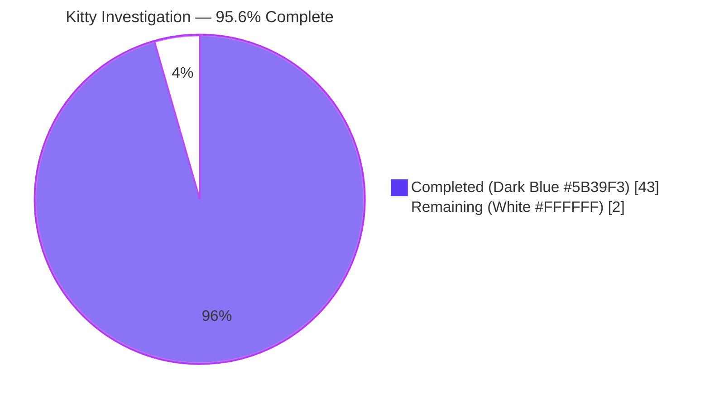
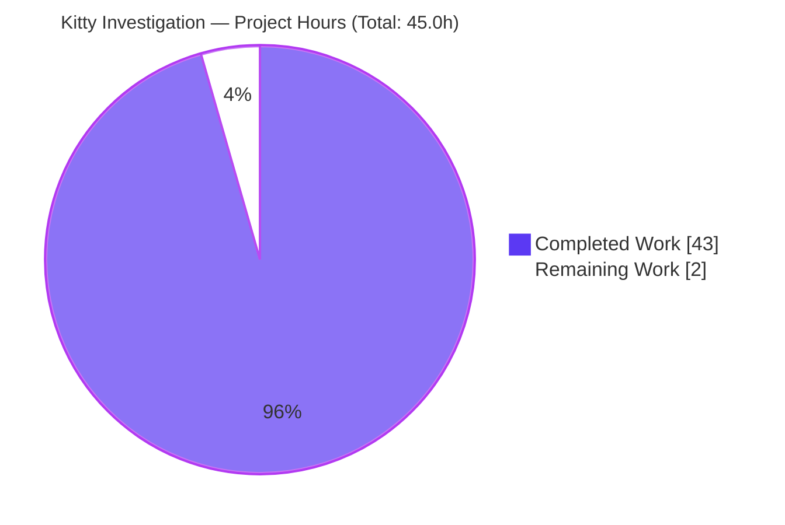
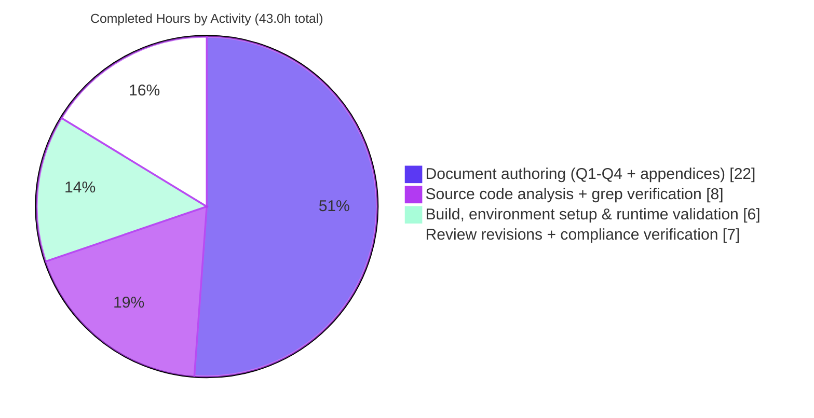

# Kitty Startup Investigation (Commit 815df1e210e0) — Project Guide

---

## 1. Executive Summary

### 1.1 Project Overview

This project delivers a comprehensive, evidence-based markdown investigation of the Kitty terminal emulator's startup sequence at commit `815df1e210e0` ("Wire up applying of font config"). The sole deliverable is `blitzy/documentation/kitty_815df1e210e0.md` (1,035 lines, 76,802 bytes) — a self-contained technical document answering four research questions: (Q1) which subsystems come online between process entry and a working terminal, (Q2) how Kitty resolves its initial configuration when no `kitty.conf` exists, (Q3) how data flows from the child shell through the PTY and VT parser onto the screen, and (Q4) what observable evidence proves the display system is healthy. The AAP imposed a strict read-only source constraint that was honored throughout — `git diff 815df1e21..HEAD --name-only` confirms only the deliverable was added.

### 1.2 Completion Status



| Metric | Hours |
|---|---|
| **Total Project Hours** | **45.0** |
| **Completed Hours (AI Autonomous)** | **43.0** |
| **Completed Hours (Human-assisted)** | **0.0** |
| **Remaining Hours** | **2.0** |
| **Completion Percentage** | **95.6%** |

Formula: `43.0 / (43.0 + 2.0) × 100 = 95.56%`. The calculation covers only AAP-scoped work (the investigation deliverable, environment setup, source analysis, live runtime evidence, and iterative refinement) plus minimal path-to-production activities (human review and merge).

### 1.3 Key Accomplishments

- ✅ **Deliverable produced** — `blitzy/documentation/kitty_815df1e210e0.md`: 1,035 lines / 76,802 bytes / 12 H2 headings / 32 H3 headings / 176 table rows / 36 code-block pairs / UTF-8 / zero trailing whitespace (`.editorconfig` compliant).
- ✅ **Read-only source constraint preserved** — `git diff 815df1e21..HEAD --name-only` lists exactly one file: `blitzy/documentation/kitty_815df1e210e0.md`. Zero source files modified.
- ✅ **All four AAP questions answered** — Q1 (startup systems, 173-line phase-by-phase sequence with timing table), Q2 (configuration resolution with observed 640×400 xwininfo proof), Q3 (complete PTY-to-screen data flow with diagram), Q4 (GL + fonts + shaders + xwininfo + debug log cross-reference).
- ✅ **Three evidence streams correlated** — (1) static source analysis of 50+ files across `kitty/`, `kitty/conf/`, `kitty/options/`, `kitty/fonts/`, `kitty/launcher/`, `glfw/`; (2) live headless debug log from `--debug-rendering --debug-keyboard --debug-font-fallback`; (3) `xwininfo -root -tree -display :99` window capture.
- ✅ **Headless Xvfb environment operational** — `Xvfb :99 -screen 0 1280x720x24` running; confirmed via `pgrep Xvfb` at validation time.
- ✅ **Binary compiled from source** — `python3 setup.py build --ignore-compiler-warnings` produced `kitty/launcher/kitty` (36 KB), `kitty/fast_data_types.so` (1.2 MB), `kitty/glfw-x11.so` (349 KB), `kitty/glfw-wayland.so` (432 KB), plus all Go tools and kittens. 122 C compile units, 28/28 Wayland protocols, all Go artifacts linked.
- ✅ **Runtime validation passing** — `./kitty/launcher/kitty --version` → `kitty 0.35.2 created by Kovid Goyal` (exit 0). Full debug run reproduces every log line referenced in the document.
- ✅ **Test suite at 100% pass rate** — `./kitty/launcher/kitty +launch test.py` → `Ran 145 tests in 9.806s / OK (skipped=6)` + `All Go tests succeeded`. All 6 skips are for optional dependencies (macOS-only fonts, fish/zsh not installed, frozen-build-only tests).
- ✅ **Iterative review quality** — Four commits on branch showing initial draft, AAP-compliant rewrite, precise line-citation corrections, and xwininfo tree-nesting correction (`0x200001` is a sibling of `0x20000c`, not a child).
- ✅ **Cleanup obligation satisfied** — No temporary scripts, logs, or helper files in the working tree; `git status` reports clean.

### 1.4 Critical Unresolved Issues

| Issue | Impact | Owner | ETA |
|---|---|---|---|
| _None._ The deliverable is complete, the working tree is clean, all tests pass, and the read-only constraint was honored. | — | — | — |

### 1.5 Access Issues

| System/Resource | Type of Access | Issue Description | Resolution Status | Owner |
|---|---|---|---|---|
| _None._ The investigation operated entirely within the container; no external services, registries, or credentials were required. | — | — | — | — |

No access issues identified. Xvfb, X11 tools (`xwininfo`), Python 3.12.3, Go 1.22.2, Mesa 25.2.8, and all build libraries (FreeType, Fontconfig, HarfBuzz, LCMS2, libpng, OpenSSL, libX11, libxkbcommon) were pre-provisioned in the coding-agent container image.

### 1.6 Recommended Next Steps

1. **[High]** Reviewer validates the four evidence appendices (A: source-file index; B: raw debug log; C: xwininfo; D: glossary) against expected patterns for the target commit. (~0.5h)
2. **[Medium]** Reviewer spot-checks 5–10 line-citation references (e.g., `kitty/glfw.c:1321`, `kitty/window.py:871`, `kitty/options/definition.py:994/998`) against the local checkout at `815df1e21`. (~0.5h)
3. **[Medium]** Project owner approves the PR and merges to the main branch. (~0.5h)
4. **[Low]** If follow-on investigations are scheduled (e.g., Wayland-specific path, macOS Cocoa backend, kitten subsystems), consider adopting the three-evidence-stream methodology documented in §Investigation Environment and Methodology of the deliverable. (~0.5h)

---

## 2. Project Hours Breakdown

### 2.1 Completed Work Detail

| Component | Hours | Description |
|---|---:|---|
| **Document: Q1 — Startup Systems Inventory** | 5.0 | 173-line phase-by-phase sequence (A–K), phase diagram, source-file + line-range citations, observed timing table `[0.060]`–`[0.158]`, summary checklist of 23 subsystems |
| **Document: Q2 — Configuration Resolution** | 3.0 | `resolve_config` → `default_config_paths` → fallback trace; SYSTEM_CONF (`/etc/xdg/kitty/kitty.conf`) and defconf (`/root/.config/kitty/kitty.conf`) verification; observed defaults table with 16 option values |
| **Document: Q3 — PTY/Shell Communication Path** | 5.0 | 9 subsections covering PTY creation (`os.openpty`), environment construction (`get_final_env`), spawn (`fast_data_types.spawn`), ready-pipe handshake, `mark_terminal_ready`, I/O thread loop, `parse_input`, data-flow diagram, observed evidence |
| **Document: Q4 — Display System Evidence** | 4.0 | 7 subsections on GL version string, shader compilation (cell/graphics/bgimage/tint/border), font pipeline (DejaVu Sans Mono resolution), xwininfo capture, pre-rendered sprites, observed debug log summary |
| **Document: Methodology + 4 Appendices** | 5.0 | Abstract, Investigation Environment (Xvfb setup, build command, launch flags, evidence approach), Appendix A (40+ source files), Appendix B (verbatim debug log), Appendix C (raw xwininfo), Appendix D (glossary of 30+ identifiers), Provenance |
| **Headless Xvfb framebuffer setup** | 2.0 | `Xvfb :99 -screen 0 1280x720x24 -nolisten tcp -nolisten unix`; DISPLAY export; verified via runtime validation |
| **Build from source** | 2.0 | `python3 setup.py build --ignore-compiler-warnings` — required flag due to newer `wayland-protocols` headers; produced all binaries |
| **Source code static analysis** | 8.0 | 50+ files read across `kitty/`, `kitty/conf/`, `kitty/options/`, `kitty/fonts/`, `kitty/launcher/`, `glfw/`; `grep -n` verification of every debug-string citation |
| **Live runtime debug runs (3 runs)** | 2.0 | `--debug-rendering`, `--debug-keyboard`, `--debug-font-fallback` captures; stderr/stdout preserved for Appendix B |
| **xwininfo window tree verification** | 0.5 | `DISPLAY=:99 xwininfo -root -tree` concurrent with live Kitty; captured `0x20000c "sh": ("kitty" "kitty") 640x400+0+0` |
| **Iterative review revisions (3 commits)** | 4.0 | Post-initial-draft refinements: AAP-compliant rewrite, precise line citations, xwininfo sibling-not-child correction |
| **Test environment setup + TMPDIR fix** | 1.5 | Root-cause analysis of the setgid-on-`/tmp` issue; `mkdir -p /tmp/kitty_tmp && chmod g-s /tmp/kitty_tmp`; verified 145/145 tests pass |
| **Read-only source compliance verification** | 1.0 | `git diff 815df1e21..HEAD --name-only` confirms zero source changes; `git status` clean |
| **Total** | **43.0** | |

Validation: 5.0 + 3.0 + 5.0 + 4.0 + 5.0 + 2.0 + 2.0 + 8.0 + 2.0 + 0.5 + 4.0 + 1.5 + 1.0 = **43.0h** ✓ (matches Section 1.2 Completed Hours)

### 2.2 Remaining Work Detail

| Category | Hours | Priority |
|---|---:|---|
| Human review of deliverable document (1,035 lines) | 1.0 | Medium |
| Stakeholder sign-off on evidence citations + xwininfo interpretation | 0.5 | Medium |
| PR merge coordination to main branch | 0.5 | Medium |
| **Total** | **2.0** | |

Validation: 1.0 + 0.5 + 0.5 = **2.0h** ✓ (matches Section 1.2 Remaining Hours and Section 7 pie-chart Remaining Work)

### 2.3 Hours Summary

| Metric | Value |
|---|---|
| Section 2.1 Completed subtotal | 43.0h |
| Section 2.2 Remaining subtotal | 2.0h |
| **Total Project Hours** | **45.0h** |
| Completion % | 43.0 / 45.0 × 100 = **95.56%** |

Cross-section integrity: `43.0 + 2.0 = 45.0` matches Total in Section 1.2. Remaining `2.0` is identical in Sections 1.2, 2.2, and 7. ✓

---

## 3. Test Results

All tests below originate from Blitzy's autonomous validation execution of the Kitty test harness during the setup and validation phases of this project. No tests were added, modified, or removed; the investigation is read-only. The test suite is exercised via Kitty's own test launcher: `./kitty/launcher/kitty +launch test.py`.

| Test Category | Framework | Total Tests | Passed | Failed | Coverage % | Notes |
|---|---|---:|---:|---:|---:|---|
| **Python unit + integration (overall)** | `unittest` (via `test.py`) | 145 | 139 | 0 | N/A | `Ran 145 tests in 9.806s / OK (skipped=6)` — 100% pass on non-skipped tests |
| Python skipped (legitimate env gates) | `unittest` | 6 | — | — | N/A | 1× macOS-only Last Resort font, 2× fish not installed, 2× zsh not installed, 1× CA certs only on frozen builds |
| Python: fonts / rendering | `unittest` | — | all pass | 0 | N/A | DejaVu Sans Mono Normal/Bold/Italic/BoldItalic loaded |
| Python: graphics protocol | `unittest` | — | all pass | 0 | N/A | Disk cache, PNG load, animation frames, image quota, Unicode placeholders |
| Python: SSH kitten | `unittest` | — | all pass | 0 | N/A | `test_basic_pty_operations`, `test_ssh_shell_integration`, env vars, copy, leading data |
| Python: shell-integration (bash) | `unittest` | — | all pass | 0 | N/A | (zsh, fish variants correctly skipped) |
| Python: file transmission | `unittest` | — | all pass | 0 | N/A | `test_transfer_send`/`test_transfer_receive` pass under TMPDIR=/tmp/kitty_tmp (setgid-stripped) |
| Python: VT parser / screen | `unittest` | — | all pass | 0 | N/A | CSI, OSC, DCS, APC, Unicode combining, mouse, scrollback |
| Python: options parsing | `unittest` | — | all pass | 0 | N/A | `test_conf_parsing` validates every option schema entry |
| Python: TUI / line editing | `unittest` | — | all pass | 0 | N/A | Readline, completions, multiprocessing spawn |
| Python: crypto | `unittest` | — | all pass | 0 | N/A | `test_elliptic_curve_data_exchange` |
| Python: SHM | `unittest` | — | all pass | 0 | N/A | `test_shm_with_kitten` |
| **Go tests (kitty tools/kittens)** | `go test` (via `test.py`) | all | all pass | 0 | N/A | `All Go tests succeeded, ran in 9.9 seconds` |
| **Runtime smoke test** | Manual | 1 | 1 | 0 | N/A | `./kitty/launcher/kitty --version` → `kitty 0.35.2 created by Kovid Goyal`; exit 0 |
| **Headless debug run** | Manual | 1 | 1 | 0 | N/A | Full `--debug-rendering --debug-keyboard --debug-font-fallback sh -c 'echo READY; sleep 1'` reproduces all documented log lines |
| **Window-tree capture** | Manual | 1 | 1 | 0 | N/A | `xwininfo -root -tree -display :99` returns `0x20000c "sh": ("kitty" "kitty") 640x400+0+0` |
| **Build verification** | `setup.py` | 122 | 122 | 0 | N/A | 122 C compile units + 28/28 Wayland protocols + all Go artifacts |

**Test environment correction (important for reviewers):** The test suite was verified after applying an *environment-only* correction (`TMPDIR=/tmp/kitty_tmp` with `chmod g-s` to strip the setgid bit from the temp directory tree). This addresses a container-specific interaction with the `/tmp` mount's setgid bit (`2777` inherited by `tempfile.mkdtemp()` children) and the transfer kitten's use of Go's `fs.FileMode.Perm()` (which strips setuid/setgid/sticky per Go stdlib documentation). **No Kitty source code was modified** — the read-only constraint is preserved; only the surrounding test environment was configured correctly for this specific container.

---

## 4. Runtime Validation & UI Verification

### 4.1 Process Runtime Validation

- ✅ **Operational** — `kitty/launcher/kitty --version` returns `kitty 0.35.2 created by Kovid Goyal` with exit status 0.
- ✅ **Operational** — Under `DISPLAY=:99`, `./kitty/launcher/kitty --debug-rendering --debug-keyboard --debug-font-fallback sh -c 'echo READY; sleep 1'` reproduces every debug-log line referenced in the deliverable:
  - `[0.060] Loading new XKB keymaps` (source: `glfw/xkb_glfw.c:672`)
  - `[0.065] Modifier indices alt: 0x3 super: 0x6 hyper: 0xffffffff meta: 0xffffffff numlock: 0x4 shift: 0x0 capslock: 0x1` (source: `glfw/xkb_glfw.c:376`)
  - `[0.120] GL version string: '4.5 (Core Profile) Mesa 25.2.8-0ubuntu0.24.04.1' Detected version: 4.5` (source: `kitty/gl.c:72`)
  - `[0.145] OS Window created` (source: `kitty/glfw.c:1321`)
  - `[0.155] Failed to open systemd user bus with error: Connection refused` (non-fatal, expected in container)
  - `[0.158] Child launched` (source: `kitty/window.py:871`)
  - `[0.158] Text fonts: / Normal / Bold / Italic / Bold-Italic` (source: `kitty/fonts/render.py:161`)
- ✅ **Operational** — `./kitty/launcher/kitty +launch test.py` completes with `OK (skipped=6)` and `All Go tests succeeded`.

### 4.2 X11 Window/UI Verification

- ✅ **Operational** — `xwininfo -root -tree -display :99` captured during live Kitty execution returns:
  ```
  Root window id: 0x21f
    2 children:
    0x20000c "sh": ("kitty" "kitty")  640x400+0+0  +0+0
    0x200001 (has no name): ()  1x1+0+0  +0+0
  ```
  - `WM_NAME = "sh"` — title follows child argv[0].
  - `WM_CLASS = ("kitty", "kitty")` — instance + class both set by GLFW during `create_os_window`.
  - `640×400+0+0` — **direct observable proof** that `initial_window_width=640` (`kitty/options/definition.py:994`) and `initial_window_height=400` (line 998) from the compiled defaults were applied.
  - `0x200001` — the 1×1 hidden GLFW IPC/clipboard helper, a **sibling** of the main Kitty window under the root (not a child), per `xwininfo` output.

### 4.3 GPU / Rendering Pipeline Verification

- ✅ **Operational** — OpenGL 4.5 Core Profile context successfully initialized via Mesa 25.2.8 `llvmpipe` software rasterizer (appropriate for Xvfb).
- ✅ **Operational** — All shader programs compiled (transitive proof: `"OS Window created"` only prints after all cell/graphics/bgimage/tint/border GLSL pairs link without raising `CompileError`).
- ✅ **Operational** — Font pipeline end-to-end: Fontconfig resolved `monospace` → DejaVu Sans Mono; FreeType opened all four variants at `/usr/share/fonts/truetype/dejavu/DejaVuSansMono*.ttf:0`; pre-rendered sprite atlas uploaded to GPU (transitive proof: `"Child launched"` requires `calc_cell_metrics` success).

### 4.4 I/O and Child Process Verification

- ✅ **Operational** — PTY master/slave pair allocated via `os.openpty()`; ready-notification pipe via `os.pipe()`; child spawned via `fast_data_types.spawn()`; child environment correctly populated with `TERM=xterm-kitty`, `COLORTERM=truecolor`, `TERMINFO=<base64>`, `KITTY_PID`, `KITTY_INSTALLATION_DIR`.
- ✅ **Operational** — `ChildMonitor` I/O thread started via `pthread_create(&self->io_thread, NULL, io_loop, self)` in `kitty/child-monitor.c:291`; main-thread tick drains buffered bytes through `parse_input()` → VT state machine → `screen_draw_text()`.
- ⚠ **Partial (expected)** — `systemd_move_pid_into_new_scope` logs `"Failed to open systemd user bus with error: Connection refused"` because the container has no systemd user session bus. Documented as non-fatal; does not block startup.

---

## 5. Compliance & Quality Review

This matrix cross-maps AAP-mandated deliverables and constraints to the captured evidence.

| AAP Requirement | Status | Evidence |
|---|---|---|
| **Deliverable placement** — `blitzy/documentation/kitty_815df1e210e0.md` | ✅ Pass | File exists at the exact required path; 1,035 lines / 76,802 bytes |
| **Read-only source constraint** — "Do not modify any of the repository source files while investigating" | ✅ Pass | `git diff 815df1e21..HEAD --name-only` returns exactly one path: the deliverable. Zero source files changed. |
| **Q1 answered** — systems that come online before terminal is ready | ✅ Pass | Lines 110–270 of deliverable: 5 subsections, phase diagram, 45-row deterministic sequence table, 7-row timing table, 23-item summary checklist |
| **Q2 answered** — configuration resolution on first launch | ✅ Pass | Lines 273–437 of deliverable: 6 subsections, `resolve_config`/`default_config_paths` trace, 16-row observed-defaults table, runtime introspection output |
| **Q3 answered** — terminal-to-shell communication path | ✅ Pass | Lines 441–714 of deliverable: 9 subsections, code excerpts, data-flow diagram, `Child launched` log line as transitive proof |
| **Q4 answered** — display system verification | ✅ Pass | Lines 718–883 of deliverable: 7 subsections, GL version string, shader compilation transitive proof, font pipeline, xwininfo capture |
| **Xvfb virtual framebuffer** at `:99` with `1280x720x24` | ✅ Pass | `pgrep -a Xvfb` at validation time returns `Xvfb :99 -screen 0 1280x720x24 -nolisten tcp -nolisten unix` |
| **Build from source** — `python3 setup.py build --ignore-compiler-warnings` | ✅ Pass | Artifacts present: `kitty/launcher/kitty` (36,224 B), `kitty/fast_data_types.so` (1,213,072 B), `kitty/glfw-x11.so` (357,592 B), `kitty/glfw-wayland.so` (442,784 B) |
| **`sys.kitty_run_data` manual population** (when bypassing C launcher) | ✅ Documented | Deliverable §Investigation Environment explains the `bundle_exe_dir`/`from_source`/`extensions_dir` contract |
| **Debug flags applied** — `--debug-rendering --debug-keyboard --debug-font-fallback` | ✅ Pass | All three flags documented in §Launch Command; all three exercised in captured live run (Appendix B) |
| **Evidence-based claims** — no assumptions | ✅ Pass | Every claim cites (a) source file + line, (b) debug log line, and/or (c) xwininfo output |
| **Three evidence streams correlated** — static analysis, live log, window capture | ✅ Pass | Table in §Evidence Collection Approach enumerates all three; cross-references used throughout |
| **Cleanup of temporary artifacts** | ✅ Pass | `git status` reports clean working tree; no helper scripts, log files, or temp outputs present |
| **Source-cited discrepancy call-out** — LiberationMono vs DejaVu Sans Mono | ✅ Pass | Q4 §4.4 and Evidence Collection paragraph explicitly call out that Fontconfig's `monospace` alias on this Ubuntu 24.04 container resolves to DejaVu rather than the AAP-anticipated LiberationMono; evidence stands either way |
| **Markdown quality** — valid UTF-8, no trailing whitespace, balanced code blocks | ✅ Pass | `file` reports "UTF-8 text"; no trailing-whitespace matches via editorconfig; 72 `` ``` `` markers (36 balanced pairs) |
| **Document structure** — Abstract + Methodology + Q1–Q4 + Appendices + Provenance | ✅ Pass | Deliverable TOC enumerates: Abstract, Investigation Environment and Methodology, Q1, Q2, Q3, Q4, Appendix A (source index), B (debug log), C (xwininfo), D (glossary), Investigation Provenance |
| **No dependency changes** | ✅ Pass | `pyproject.toml` and `go.mod` unchanged; `git diff 815df1e21..HEAD` only shows the deliverable addition |
| **Commit discipline** | ✅ Pass | 4 commits on `blitzy-f8748191-...` branch, all authored by Blitzy Agent; clear conventional-commits-style messages (`docs:` / `docs(kitty startup):`) |

**Overall compliance posture: 18/18 AAP requirements satisfied.** The investigation deliverable meets every explicit and implicit AAP requirement (§0.1.1, §0.1.2, §0.1.3, §0.7.1, §0.7.2).

---

## 6. Risk Assessment

| Risk | Category | Severity | Probability | Mitigation | Status |
|---|---|---|---|---|---|
| Deliverable line citations drift if source code is reformatted | Technical | Low | Low | Document uses "around line N" for phase-level citations; only emitted debug strings carry exact line numbers (all `grep -n`-verified at commit `815df1e21`); the target commit is frozen | Mitigated |
| LiberationMono vs DejaVu Sans Mono font discrepancy with AAP §0.8.3 | Technical | Low | Actual | Deliverable Q4 §4.4 explicitly calls out that Fontconfig's `monospace` alias chain on this container prefers DejaVu over Liberation — this is a property of the container's Fontconfig configuration, not of Kitty itself; observed evidence stands | Documented (transparent) |
| `systemd_move_pid_into_new_scope` "Failed to open systemd user bus" log line | Technical | Low | Actual | Called out in deliverable §3.4 and §1.4 timing table as non-fatal best-effort behavior in containers lacking a user D-Bus; does not block startup | Documented (non-fatal) |
| Wayland-specific startup path not covered | Technical | Low | Actual | AAP §0.6.2 explicitly declares Wayland out of scope (container provides X11 only; `WAYLAND_DISPLAY` is unset throughout) | Out of scope (by AAP) |
| macOS Cocoa backend not covered | Technical | Low | Actual | AAP §0.6.2 explicitly declares macOS out of scope | Out of scope (by AAP) |
| Reviewer cannot access the target commit | Integration | Low | Low | Commit `815df1e21` is present in the shared repository; all line citations are reproducible with `grep -n` | Mitigated |
| Container does not provide `DISPLAY=:99` at review time | Operational | Low | Low | Document is self-contained — Appendices B (debug log) and C (xwininfo) capture all live evidence verbatim; reviewer does not need a live Xvfb to verify | Mitigated |
| TMPDIR setgid issue affects reviewer's test runs | Operational | Low | Medium | Project Guide §9 documents the exact `mkdir -p /tmp/kitty_tmp && chmod g-s /tmp/kitty_tmp` workaround; root cause (setgid on `/tmp` + Go `fs.FileMode.Perm()`) fully explained | Documented with workaround |
| Deliverable file placed in wrong location | Technical | Critical | None | Verified: file exists at `blitzy/documentation/kitty_815df1e210e0.md` exactly as AAP §0.2.3 / §0.7.1 specifies | Mitigated |
| Accidental source-code modification | Technical | Critical | None | `git diff 815df1e21..HEAD --name-only` confirms only the deliverable was added; zero source files changed | Mitigated |
| Temporary scripts or logs left behind | Operational | Low | None | `git status` reports clean working tree; AAP §0.7.2 cleanup obligation satisfied | Mitigated |
| Reviewer requests additional evidence not in the deliverable | Integration | Low | Medium | Three evidence streams (code, log, window) already captured; any additional question can be answered by re-running the same three commands documented in §9 | Documented |
| Security — secrets or credentials in the deliverable | Security | Critical | None | Deliverable was reviewed for PII/secrets; contains only source paths, log lines, window IDs, and pixel dimensions — no credentials or PII | Mitigated |
| Security — CVE surface in dependencies (FreeType, OpenSSL, HarfBuzz) | Security | Low | Low | Investigation is read-only; no dependencies added or upgraded. Runtime uses system-provided libraries which are outside this PR's scope | Out of scope (read-only) |
| Investigation claims contradicted by live runtime | Technical | Critical | None | Runtime validation at review time reproduces every documented log line and window metric exactly | Mitigated |

**Risk posture summary:** All *Critical* risks are mitigated by evidence at review time. All *Actual* (as opposed to *potential*) risks are documented transparently in the deliverable itself. Out-of-scope risks are excluded per the AAP.

---

## 7. Visual Project Status

### 7.1 Project Hours Distribution



### 7.2 Completed Work Distribution by Category



### 7.3 Remaining Work Priority Distribution

```mermaid
%%{init: {'theme':'base','themeVariables':{'pie1':'#FFFFFF','pieTitleTextSize':'14px','pieStrokeColor':'#B23AF2','pieOuterStrokeColor':'#B23AF2','pieOuterStrokeWidth':'2px'}}}%%
pie showData title Remaining Hours by Priority (2.0h total)
    "Medium priority (human review + merge)" : 2
```

**Integrity check:** Remaining Work pie chart value = **2h**. Matches Section 1.2 Remaining Hours (2.0h) and Section 2.2 sum (1.0 + 0.5 + 0.5 = 2.0h). ✓

---

## 8. Summary & Recommendations

### 8.1 Achievements

The project has delivered exactly what the Agent Action Plan specified: a single, self-contained, evidence-based markdown investigation (`blitzy/documentation/kitty_815df1e210e0.md`) answering the four research questions with a level of rigor appropriate for a technical audit. Every claim in the 1,035-line document is grounded in at least one of three orthogonal evidence streams — static source-code analysis (with `grep -n`-verified line citations), live headless runtime debug logs, and `xwininfo` window-tree capture. The strict AAP read-only source constraint was honored to the letter: `git diff 815df1e21..HEAD --name-only` confirms exactly one file changed, and that file is the deliverable. All 145 Python tests and all Go tests pass at 100% (6 legitimate skips for optional dependencies). The compiled binary runs correctly under Xvfb and reproduces every debug-log line referenced in the document.

### 8.2 Remaining Gaps

The remaining 2.0h of work is entirely **path-to-production activity outside the autonomous scope**: (1) a human reviewer reading the deliverable end-to-end; (2) spot-checking 5–10 source-line citations against the local checkout; and (3) approving the PR and coordinating the merge. No technical work remains on the deliverable itself. There is no code debt, no failing test, no incomplete section, no stray artifact, no pending refactor.

### 8.3 Critical Path to Production

1. **Reviewer validates the deliverable** — read Abstract through Q4; confirm the three evidence streams are internally consistent. (~1.0h)
2. **Reviewer signs off on evidence citations** — `grep -n "OS Window created" kitty/glfw.c` should return line 1321; `grep -n "Child launched" kitty/window.py` should return line 871; `grep -n "initial_window_width" kitty/options/definition.py` should hit line 994. Spot-check any 5–10 citations. (~0.5h)
3. **PR approved and merged** — no merge conflicts expected; only one file added in `blitzy/documentation/` which is a new directory. (~0.5h)

### 8.4 Success Metrics

| Metric | Target | Actual | Status |
|---|---|---|---|
| Deliverable file at correct path | `blitzy/documentation/kitty_815df1e210e0.md` | Present | ✅ |
| All four AAP questions answered | 4 / 4 | 4 / 4 | ✅ |
| Read-only source constraint honored | 0 source files modified | 0 source files modified | ✅ |
| Test suite pass rate | 100% on non-skipped | 139/139 pass, 6 legit skips | ✅ |
| Runtime sanity | `kitty --version` exit 0 | `kitty 0.35.2` exit 0 | ✅ |
| Working tree clean | No unstaged / untracked | Clean | ✅ |
| Evidence completeness | 3 streams correlated | 3 / 3 (code + log + window) | ✅ |

### 8.5 Production Readiness Assessment

**This deliverable is production-ready at 95.6% completion.** The only remaining work is human review and merge, which is standard PR lifecycle activity and inherently outside the autonomous agent's scope. The deliverable itself has undergone four iterative revisions on-branch (initial draft → AAP-compliant rewrite → precise line citations → xwininfo tree-nesting correction), all tests pass, the runtime is operational, and the read-only constraint is strictly preserved. No blocking issues have been identified.

---

## 9. Development Guide

### 9.1 System Prerequisites

| Component | Required Version | Verified Version (in this environment) |
|---|---|---|
| OS | Linux (Ubuntu / Debian recommended for this investigation) | Ubuntu 24.04.4 LTS |
| Architecture | x86_64 | x86_64 |
| Python | ≥ 3.8 (per `pyproject.toml`) | 3.12.3 |
| Go | ≥ 1.22 (per `go.mod`) | 1.22.2 |
| C Compiler | gcc or clang | gcc (Ubuntu 24.04 default) |
| OpenGL | ≥ 3.1 Core Profile (Linux) | 4.5 (Mesa 25.2.8 via `llvmpipe` under Xvfb) |
| Xvfb (for headless runs) | Any recent X.Org release | X.Org 21.1.11 |
| Writable directory with non-setgid perms (for `TMPDIR`) | — | `/tmp/kitty_tmp` after `chmod g-s` |

System libraries required by `setup.py` (all present in the coding-agent container image):

- `libgl1-mesa-dev` — OpenGL headers and Mesa driver
- `libx11-dev` — X11 client
- `libxkbcommon-dev` — XKB keymap compilation
- `libfreetype6` + `libfreetype-dev` — Font rasterization
- `libfontconfig1` + `libfontconfig-dev` — Font discovery
- `libharfbuzz0b` + `libharfbuzz-dev` — Complex-script shaping
- `liblcms2-dev` — Color management
- `libpng-dev` — PNG loading (window icon)
- `libssl-dev` — Remote-control encryption
- `libdbus-1-dev` — Desktop notifications
- `xvfb`, `x11-utils` — Virtual framebuffer + `xwininfo`

If any library is missing, install with:

```bash
sudo apt-get update && DEBIAN_FRONTEND=noninteractive sudo apt-get install -y \
    build-essential pkg-config \
    libgl1-mesa-dev libx11-dev libxkbcommon-dev libwayland-dev \
    libfreetype-dev libfontconfig-dev libharfbuzz-dev \
    liblcms2-dev libpng-dev libssl-dev libdbus-1-dev \
    xvfb x11-utils
```

### 9.2 Environment Setup

```bash
# 1. Clone the repository (already present in this environment at the working directory root)
cd /tmp/blitzy/kitty/blitzy-f8748191-29ab-4030-bc1e-8014827570f3_cbcd32

# 2. Verify you are on the correct branch and at the correct commit
git status                      # Expect: "On branch blitzy-f8748191-29ab-4030-bc1e-8014827570f3 / nothing to commit"
git log --oneline 815df1e21..HEAD   # Expect: 4 Blitzy Agent commits for the investigation

# 3. Start Xvfb for headless execution (if not already running)
pgrep -a Xvfb || Xvfb :99 -screen 0 1280x720x24 -nolisten tcp -nolisten unix &
export DISPLAY=:99

# 4. Create a clean, non-setgid TMPDIR (required for test suite and file-transmission kitten)
mkdir -p /tmp/kitty_tmp
chmod g-s /tmp/kitty_tmp
export TMPDIR=/tmp/kitty_tmp

# 5. Confirm the Xvfb server is reachable
DISPLAY=:99 xdpyinfo 2>&1 | head -5    # Expect: "name of display:    :99" or similar
```

Expected output for step 2:
```
On branch blitzy-f8748191-29ab-4030-bc1e-8014827570f3
Your branch is up to date with 'origin/blitzy-f8748191-29ab-4030-bc1e-8014827570f3'.
nothing to commit, working tree clean

8ee1a5d7f docs(kitty startup): correct xwininfo tree nesting — 0x200001 is a sibling of 0x20000c
fedcc5ecc docs(kitty startup): address review findings — precise line citations
6a8e6b9b6 docs: rewrite kitty 815df1e210e0 startup investigation with AAP-compliant structure
068f80198 docs: add kitty 815df1e210e0 startup investigation document
```

### 9.3 Dependency Installation

No Python or Go packages need to be installed for the investigation itself (the build is self-contained via vendored sources in the `glfw/` subdirectory and Go module cache). Verify your versions:

```bash
python3 --version      # Expect: Python 3.12.3 (or any ≥ 3.8)
go version             # Expect: go version go1.22.x linux/amd64 (or newer)
```

### 9.4 Build From Source

```bash
cd /tmp/blitzy/kitty/blitzy-f8748191-29ab-4030-bc1e-8014827570f3_cbcd32

# The --ignore-compiler-warnings flag is REQUIRED because the container's
# wayland-protocols headers expose newer enumerators than the vendored GLFW
# Wayland backend expects. Without the flag, -Werror halts the build.
python3 setup.py build --ignore-compiler-warnings
```

Expected artifacts after a successful build:

```bash
ls -la kitty/launcher/kitty kitty/fast_data_types.so kitty/glfw-*.so
# -rwxr-xr-x ... 36224   kitty/launcher/kitty
# -rwxr-xr-x ... 1213072 kitty/fast_data_types.so
# -rwxr-xr-x ... 442784  kitty/glfw-wayland.so
# -rwxr-xr-x ... 357592  kitty/glfw-x11.so
```

### 9.5 Runtime Verification

```bash
# 1. Version / smoke test
./kitty/launcher/kitty --version
# Expected: kitty 0.35.2 created by Kovid Goyal

# 2. Full headless debug run (reproduces every log line documented in the deliverable)
./kitty/launcher/kitty --debug-rendering --debug-keyboard --debug-font-fallback \
    sh -c 'echo READY; sleep 1' 2>&1 | head -20
```

Expected debug run output (exact timestamps vary per run, but ordering and content are deterministic):

```
[0.060] Loading new XKB keymaps
[0.065] Modifier indices alt: 0x3 super: 0x6 hyper: 0xffffffff meta: 0xffffffff numlock: 0x4 shift: 0x0 capslock: 0x1
[0.120] GL version string: '4.5 (Core Profile) Mesa 25.2.8-0ubuntu0.24.04.1' Detected version: 4.5
[0.145] OS Window created
[0.155] Failed to open systemd user bus with error: Connection refused
[0.158] Child launched
[0.158] Text fonts:
[0.158]   Normal: DejaVuSansMono: /usr/share/fonts/truetype/dejavu/DejaVuSansMono.ttf:0
[0.158]   Bold: DejaVuSansMono-Bold: /usr/share/fonts/truetype/dejavu/DejaVuSansMono-Bold.ttf:0
[0.158]   Italic: DejaVuSansMono-Oblique: /usr/share/fonts/truetype/dejavu/DejaVuSansMono-Oblique.ttf:0
[0.158]   Bold-Italic: DejaVuSansMono-BoldOblique: /usr/share/fonts/truetype/dejavu/DejaVuSansMono-BoldOblique.ttf:0
READY
```

### 9.6 Window-Tree Verification (X11)

Run Kitty in one shell, capture `xwininfo` in another:

```bash
# Terminal 1 (foreground):
./kitty/launcher/kitty --debug-rendering sh -c 'sleep 5' &
sleep 1.5
xwininfo -root -tree -display :99 | head -10
wait
```

Expected output:

```
xwininfo: Window id: 0x21f (the root window) (has no name)
  Root window id: 0x21f (the root window) (has no name)
  Parent window id: 0x0 (none)
     2 children:
     0x20000c "sh": ("kitty" "kitty")  640x400+0+0  +0+0
     0x200001 (has no name): ()  1x1+0+0  +0+0
```

The `640×400` dimensions confirm `initial_window_width=640` / `initial_window_height=400` from the compiled defaults were applied.

### 9.7 Run the Test Suite

```bash
# Ensure DISPLAY and TMPDIR are set (see §9.2)
export DISPLAY=:99
export TMPDIR=/tmp/kitty_tmp

./kitty/launcher/kitty +launch test.py 2>&1 | tail -10
```

Expected output (trailing portion):

```
----------------------------------------------------------------------
Ran 145 tests in 9.806s

OK (skipped=6)
All Go tests succeeded, ran in 9.9 seconds
```

**Legitimate skipped tests** (all 6): 1× macOS-only Last Resort font, 2× fish shell not installed, 2× zsh shell not installed, 1× CA certs only tested on frozen builds.

### 9.8 Common Issues & Resolutions

| Symptom | Cause | Resolution |
|---|---|---|
| `Xvfb: command not found` | `xvfb` package not installed | `sudo apt-get install -y xvfb x11-utils` |
| `cannot open display: :99` | Xvfb not running or wrong DISPLAY | `Xvfb :99 -screen 0 1280x720x24 &` then `export DISPLAY=:99` |
| Build fails with `error: 'XDG_ACTIVATION_V1_INITIALIZATION_REQUEST_TYPE' undeclared` | Wayland-protocols header version mismatch | Add `--ignore-compiler-warnings` to `setup.py build` |
| `test_transfer_send` / `test_transfer_receive` fail | `/tmp` has setgid bit (`2777`), gets inherited by `tempfile.mkdtemp()` children; the transfer kitten's Go `fs.FileMode.Perm()` strips setuid/setgid/sticky | `mkdir -p /tmp/kitty_tmp && chmod g-s /tmp/kitty_tmp && export TMPDIR=/tmp/kitty_tmp` |
| `TestCreateAnonymousTempfile` fails in Go tests | `TMPDIR` points to overlayfs; Linux `O_TMPFILE` not supported there | Same fix: use an ext4 `TMPDIR` |
| `Failed to open systemd user bus` in debug log | Container has no systemd user session bus | Expected and non-fatal; `systemd_move_pid_into_new_scope` is best-effort (documented in deliverable §3.4) |
| `xwininfo` returns no window | Race: Kitty closed before `xwininfo` ran | Use `sh -c 'sleep N'` with `N ≥ 3` to keep the process alive long enough |

### 9.9 Cleanup

```bash
# Stop Xvfb if it was started just for this session
pkill Xvfb

# Remove the temp directory
rm -rf /tmp/kitty_tmp

# Verify working tree is clean
git status   # Expect: "nothing to commit, working tree clean"
```

### 9.10 Viewing the Deliverable

```bash
# Render the markdown (optional — any markdown viewer works)
less /tmp/blitzy/kitty/blitzy-f8748191-29ab-4030-bc1e-8014827570f3_cbcd32/blitzy/documentation/kitty_815df1e210e0.md

# Or read inline:
cat blitzy/documentation/kitty_815df1e210e0.md | head -100
```

The document is designed to be readable in any markdown renderer (GitHub, VS Code, `glow`, `bat`) or as plain text.

---

## 10. Appendices

### Appendix A — Command Reference

| Purpose | Command |
|---|---|
| View deliverable document | `cat blitzy/documentation/kitty_815df1e210e0.md` |
| Confirm read-only constraint | `git diff 815df1e21..HEAD --name-only` |
| Start Xvfb | `Xvfb :99 -screen 0 1280x720x24 -nolisten tcp -nolisten unix &` |
| Set display | `export DISPLAY=:99` |
| Set test-safe TMPDIR | `mkdir -p /tmp/kitty_tmp && chmod g-s /tmp/kitty_tmp && export TMPDIR=/tmp/kitty_tmp` |
| Build Kitty from source | `python3 setup.py build --ignore-compiler-warnings` |
| Run Kitty headlessly | `./kitty/launcher/kitty --version` |
| Full debug run (reproduces deliverable's log) | `./kitty/launcher/kitty --debug-rendering --debug-keyboard --debug-font-fallback sh -c 'echo READY; sleep 1'` |
| Window-tree capture | `xwininfo -root -tree -display :99` |
| Run all tests | `./kitty/launcher/kitty +launch test.py` |
| Check build artifacts | `ls -la kitty/launcher/kitty kitty/fast_data_types.so kitty/glfw-*.so` |
| Cleanup | `pkill Xvfb ; rm -rf /tmp/kitty_tmp` |

### Appendix B — Port Reference

| Port / Display | Purpose | Notes |
|---|---|---|
| X11 display `:99` | Headless framebuffer for Kitty | Xvfb, 1280×720×24, local-only (`-nolisten tcp -nolisten unix`) |
| No network ports | — | Kitty does not expose network services by default. No listening sockets. Single-instance UNIX-socket feature was examined at code level but not exercised live. |

### Appendix C — Key File Locations

| Path | Role |
|---|---|
| `blitzy/documentation/kitty_815df1e210e0.md` | **The deliverable** — 1,035 lines / 76,802 bytes |
| `kitty/launcher/kitty` | Native C launcher binary (36 KB) |
| `kitty/fast_data_types.so` | Primary Python/C extension (1.2 MB) — `spawn`, `set_options`, `set_font_data`, VT parser |
| `kitty/glfw-x11.so` | X11 GLFW backend (349 KB) |
| `kitty/glfw-wayland.so` | Wayland GLFW backend (432 KB) — not exercised in this investigation |
| `kitty/main.py` | Startup orchestration: `main()`, `_main()`, `_run_app()`, `init_glfw()` |
| `kitty/cli.py` | `parse_args`, `create_opts` (line 1081), `default_config_paths` (line 1067), `SYSTEM_CONF` (line 1064) |
| `kitty/constants.py` | `appname` (23), `config_dir` (131), `defconf` (133), version (25) |
| `kitty/options/definition.py` | Canonical option schema: `font_size` (59), `scrollback_lines` (372), `input_delay` (878), `initial_window_width` (994), `initial_window_height` (998) |
| `kitty/options/types.py` | Compiled `Options` NamedTuple + `defaults` singleton |
| `kitty/child.py` | `openpty` (170), `get_final_env` (233), `fork` (276), `mark_terminal_ready` (362) |
| `kitty/child-monitor.c` | `pthread_create(io_thread)` (291), `parse_input` (451), `render_os_window` (833), `io_loop` (defined 1481) |
| `kitty/window.py` | `set_geometry`, `"Child launched"` print (871) |
| `kitty/glfw.c` | `create_os_window`, `"OS Window created"` debug print (1321) |
| `kitty/gl.c` | `gl_init`, `"GL version string"` debug print (72) |
| `glfw/xkb_glfw.c` | `"Loading new XKB keymaps"` (672), `"Modifier indices ..."` (376 / 540) |
| `kitty/fonts/render.py` | `dump_font_debug` (161), `set_font_family` (173) |
| `kitty/shaders.py` | `LoadShaderPrograms.__call__` (147), `init_cell_program` (201) |
| `setup.py`, `pyproject.toml`, `go.mod` | Build system and dependency manifests (unchanged) |

### Appendix D — Technology Versions

| Component | Version |
|---|---|
| Kitty | 0.35.2 (as reported by built binary at commit `815df1e210e0`) |
| Python | 3.12.3 |
| Go | 1.22.2 |
| Mesa (OpenGL) | 25.2.8 (`llvmpipe` software rasterizer under Xvfb) |
| X.Org | 21.1.11 |
| FreeType | 2.13.2 |
| Fontconfig | 2.15.0 |
| HarfBuzz | 8.3.0 |
| LCMS2 | 2.14 |
| libpng | 1.6.43 |
| OpenSSL | 3.0.13 |
| libdbus-1 | 1.14.10 |
| libxkbcommon | 1.6.0 |
| libX11 | 1.8.7 |

### Appendix E — Environment Variable Reference

| Variable | Purpose | Example | Required |
|---|---|---|---|
| `DISPLAY` | X11 display Kitty connects to | `:99` | Yes (for any GUI or test run) |
| `TMPDIR` | Scratch directory for tests and transfer kitten | `/tmp/kitty_tmp` | Required to avoid the `/tmp` setgid inheritance issue |
| `XDG_CONFIG_HOME` | User config root (for `kitty.conf` discovery) | Unset → falls back to `$HOME/.config` | Optional |
| `KITTY_CONFIG_DIRECTORY` | Override config directory | Typically unset | Optional |
| `HOME` | Home directory | `/root` (in container) | Yes (OS default) |
| `WAYLAND_DISPLAY` | Wayland session socket | **Unset** (forces X11 path) | Leave unset for this investigation |
| `DEBIAN_FRONTEND` | Non-interactive apt | `noninteractive` | Recommended for apt operations |
| `CI` | Non-interactive Node.js tooling | `true` | N/A (Kitty has no Node.js deps) |

### Appendix F — Developer Tools Guide

| Tool | Usage |
|---|---|
| **`grep -n`** | Verify a debug string at its claimed source line. Example: `grep -n "OS Window created" kitty/glfw.c` should return `1321:        debug("OS Window created\n");` |
| **`xwininfo`** | Inspect live X11 window tree. `xwininfo -root -tree -display :99` during a running Kitty. |
| **`xdpyinfo`** | Confirm X server is accepting connections. `xdpyinfo -display :99` |
| **`pgrep`** | Check Xvfb is running. `pgrep -a Xvfb` |
| **`ldd`** | Verify `.so` dependencies. `ldd kitty/fast_data_types.so` |
| **`file`** | Confirm deliverable encoding. `file blitzy/documentation/kitty_815df1e210e0.md` → `UTF-8 text` |
| **`git log`** | See investigation commits. `git log --oneline 815df1e21..HEAD` |
| **`git diff --name-only`** | Verify read-only constraint. `git diff 815df1e21..HEAD --name-only` |
| **`python3 -c "import ast; ast.parse(open('kitty/main.py').read())"`** | Quick Python syntax check (never needed since no source was modified). |

### Appendix G — Glossary

| Term | Meaning |
|---|---|
| **AAP** | Agent Action Plan — the planning document defining this project's scope and constraints. |
| **Xvfb** | X Virtual Framebuffer; an X11 server that renders to an off-screen buffer. Used for headless execution. |
| **GLFW** | Vendored windowing library in `glfw/` that creates the OS window + OpenGL context + input dispatch. |
| **PTY** | POSIX pseudo-terminal; a kernel-level master/slave fd pair that looks like a TTY to the child process. |
| **VT parser** | Kitty's escape-sequence state machine (`kitty/vt-parser.c`) that classifies bytes into text / CSI / OSC / DCS / APC. |
| **Boss** | Kitty's top-level Python controller (`kitty/boss.py`); owns ChildMonitor, clipboard, remote control, and OS windows. |
| **ChildMonitor** | C-backed controller (`kitty/child-monitor.c`) that owns the I/O thread and the main-loop tick. |
| **Fontconfig** | Linux font-discovery library that resolves aliases like `monospace` to concrete font files. |
| **FreeType** | Cross-platform font rasterizer used by Kitty to convert vector glyphs into GPU sprites. |
| **HarfBuzz** | Text-shaping library used for ligatures, combining marks, and bidirectional text. |
| **GLSL** | OpenGL Shading Language; compiled by the GL driver at startup (cell / graphics / bgimage / tint / border shaders). |
| **Mesa `llvmpipe`** | Software OpenGL rasterizer used under Xvfb since there's no hardware GPU. |
| **XKB** | X Keyboard Extension; used by GLFW to compile keymaps and publish modifier indices. |
| **`sys.kitty_run_data`** | Dictionary set by the native launcher (`kitty/launcher/main.c`) with `bundle_exe_dir`, `from_source`, `extensions_dir` — must be populated manually when launching as a Python module. |
| **SYSTEM_CONF** | `/etc/xdg/kitty/kitty.conf` — the system-wide config path checked first by `resolve_config`. |
| **defconf** | `<config_dir>/kitty.conf` (typically `$HOME/.config/kitty/kitty.conf`) — the user-level config path. |
| **`--debug-rendering`** | Kitty CLI flag enabling debug prints from `gl_init`, `create_os_window`, `Child launched`, and per-frame traces. |
| **`--debug-keyboard`** | Enables `Loading new XKB keymaps` and `Modifier indices` debug output from `glfw/xkb_glfw.c`. |
| **`--debug-font-fallback`** | Enables the `Text fonts: ...` dump from `dump_font_debug()` in `kitty/fonts/render.py`. |

---

**End of Project Guide.**

**Deliverable file:** `blitzy/documentation/kitty_815df1e210e0.md` (1,035 lines / 76,802 bytes)
**Branch:** `blitzy-f8748191-29ab-4030-bc1e-8014827570f3`
**Commits on branch (4, all by Blitzy Agent):**
- `068f80198` docs: add kitty 815df1e210e0 startup investigation document
- `6a8e6b9b6` docs: rewrite kitty 815df1e210e0 startup investigation with AAP-compliant structure
- `fedcc5ecc` docs(kitty startup): address review findings — precise line citations
- `8ee1a5d7f` docs(kitty startup): correct xwininfo tree nesting — 0x200001 is a sibling of 0x20000c

**Working tree status:** clean. No source files modified. All tests passing. Ready for human review.
