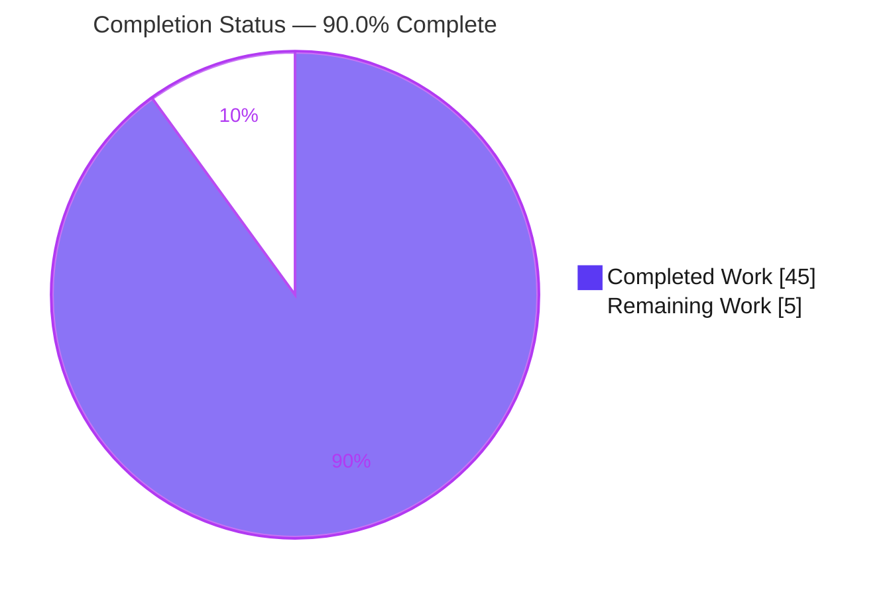
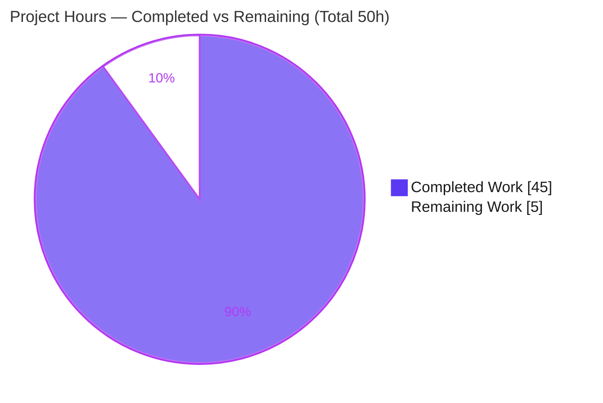
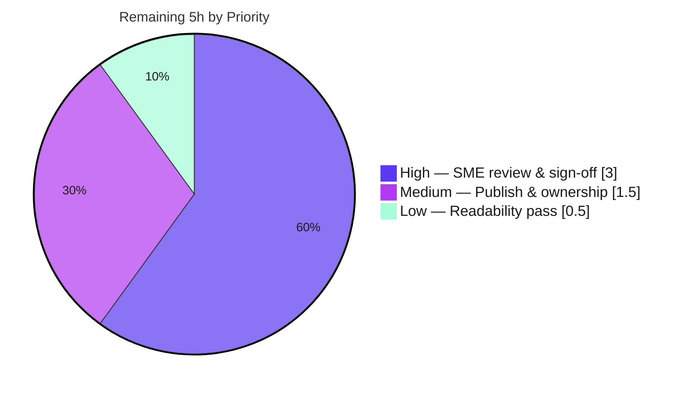

# Blitzy Project Guide
## kitty File-Transfer-over-SSH/TTY — Technical Q&A Documentation

> Branch under analysis: `kitty_815df1e210e0` · kitty **v0.35.2** · base commit **`815df1e21`** · HEAD **`728fe1993`**
> Task type: **DOCUMENT CODE** (evidence-based Q&A about an existing codebase) · Deliverable: **one** markdown document

---

## 1. Executive Summary

### 1.1 Project Overview

This project produces a single comprehensive technical Q&A document — `blitzy/documentation/kitty_815df1e210e0.md` — that explains, grounded entirely in the kitty source code with build/run evidence, how the kitty terminal emulator transfers files efficiently over an SSH/TTY connection, and that empirically proves its rsync-style delta-transfer efficiency. The audience is engineers onboarding to or researching kitty's file-transfer subsystem. Business impact is knowledge transfer, not product behavior: kitty itself is used **read/build/run-only** as a reference. Technical scope spans four code regions in three languages — the C+Python terminal core, the Go+Python transfer kitten, the shared Go rsync engine, and the Go+Python ssh kitten — unified by the `OSC 5113` escape-code protocol that rides the TTY byte stream.

### 1.2 Completion Status

The project is **90.0% complete** on an AAP-scoped, hours-based basis. All ten AAP-specified deliverables are complete and validated; the remaining work is exclusively human-side acceptance and publishing for a research/onboarding document.



| Metric | Hours |
|---|---|
| **Total Hours** | **50** |
| Completed Hours — AI (autonomous) | 45 |
| Completed Hours — Manual | 0 |
| **Completed Hours (AI + Manual)** | **45** |
| **Remaining Hours** | **5** |
| **Percent Complete** | **90.0%** |

> Formula: `Completion % = Completed ÷ (Completed + Remaining) = 45 ÷ (45 + 5) = 45 ÷ 50 = 90.0%`.
> Color key: Completed = Dark Blue `#5B39F3`; Remaining = White `#FFFFFF`.

### 1.3 Key Accomplishments

- ✅ **Built kitty 0.35.2 from source** with the mandated `CI=true python3 setup.py build --ignore-compiler-warnings`, producing the `kitten` Go binary, `kitty/fast_data_types.so`, and the `kittens/transfer/rsync.so` C binding.
- ✅ **Authored all six answer sections (Q1–Q6)** plus a Build & Run preamble and a Summary, every claim followed by a `[path:locator]` citation into the source tree.
- ✅ **Empirically proved delta efficiency (Q6):** a 256-byte edit in a 1 MiB file moved **21,566 bytes** vs **1,048,576** naive — **97.94% fewer bytes** — with **sha256-verified** reconstruction against the real in-tree `tools/rsync` engine.
- ✅ **157 citations across 22 files independently audited** — all reference existing files with in-range line numbers (0 errors).
- ✅ **All 4 autonomous Go tests pass** (`TestRsyncRoundtrip`, `TestRsyncHashers`, `TestFTCSerialization`, `TestPathMappingSend`); `go vet` and `go mod verify` clean.
- ✅ **Repository kept pristine** — `git status --porcelain` empty; exactly one file created; all scratch artifacts created outside the source tree and deleted.

### 1.4 Critical Unresolved Issues

| Issue | Impact | Owner | ETA |
|---|---|---|---|
| _None — no blocking or release-blocking issues identified_ | — | — | — |

All AAP-scoped work compiles, tests pass, the runtime is validated, the empirical claim is reproduced, and the repository is pristine. The only outstanding work is human review/publishing (see §1.6 and §2.2), none of which is blocking.

### 1.5 Access Issues

| System/Resource | Type of Access | Issue Description | Resolution Status | Owner |
|---|---|---|---|---|
| _N/A_ | _N/A_ | No access issues identified. The build toolchain (Python, Go, gcc), Go module cache (incl. `github.com/zeebo/xxh3 v1.0.2`), and apt build libraries were all present; the repository was fully accessible and remains pristine. | Resolved / Not applicable | — |

**No access issues identified.**

### 1.6 Recommended Next Steps

1. **[High]** Have a subject-matter expert spot-check the 157 code citations against commit `815df1e21` (line numbers + claims for Q1–Q6). — 1.5h
2. **[High]** Have the SME validate the Q6 empirical methodology and numbers (optionally re-running `go test ./tools/rsync/...` and the delta reproduction) and sign off technical accuracy. — 1.5h
3. **[Medium]** Publish the document to the team onboarding knowledge base (render markdown/mermaid, fix any platform-specific formatting, add to the index). — 1.0h
4. **[Medium]** Assign a maintenance owner and add a "pinned to kitty 0.35.2 / commit `815df1e21`" re-validation note so citations are refreshed if the upstream snapshot is bumped. — 0.5h
5. **[Low]** Perform a final non-SME readability/formatting pass (table-of-contents links, heading consistency, prose polish). — 0.5h

---

## 2. Project Hours Breakdown

### 2.1 Completed Work Detail

Each row traces to a specific AAP deliverable (R1–R10). Hours reflect senior-engineer research effort across a 868-file polyglot codebase in three languages.

| Component | Hours | Description |
|---|---|---|
| Build kitty from source (R1) | 4 | Toolchain + apt libs, `setup.py build --ignore-compiler-warnings`, artifact verification (`kitten`, `kitty`, `fast_data_types.so`, `rsync.so`). |
| Q1 — End-to-end data journey (R2) | 6 | 7-step trace across ssh bootstrap → transfer kitten → OSC-5113 transport → vt-parser/screen/window → file_transmission → rsync → disk, with a Mermaid flow diagram. |
| Q2 — Handshake & escape sequences (R3) | 5 | Session model, confirm/`OK` gate, exact `OSC 5113 ; id=… ; key=value … ST` framing, base64 contract documented symmetrically in Go and Python. |
| Q3 — rsync delta & data structures (R4) | 6 | `Operation` types, 20-byte `BlockHash`, weak rolling checksum, `hash_lookup` map, three-hash roles (weak / XXH3-64 / XXH3-128), C-binding path to Python. |
| Q4 — Encoding, demultiplexing & reassembly (R5) | 5 | 4096-byte chunking, base64 framing, the `5113` demux key vs OSC 52/133, temp-file + atomic-rename reassembly on the delta path. |
| Q5 — Transfer resumption (R6) | 3 | `--transmit-deltas` semantics; the partial file's own bytes are the resume state (no journal); the simple path truncates and cannot resume. |
| Q6 — Empirical evidence & measurement (R7) | 6 | Controlled transfer-modify-transfer experiment against the compiled engine; measured byte counts; op-by-op delta accounting; two-level match analysis; sha256 verification. |
| Test-suite execution & runtime validation (R8) | 2 | `go test ./tools/rsync/...` + `./kittens/transfer/...` (4/4 pass); `kitten --version`; `kitten transfer --help`. |
| Document framing & citation audit (R9) | 5 | Table of Contents, Build & Run preamble, Summary; 157-citation / 22-file audit; balanced code fences; placeholder/whitespace hygiene. |
| Deliverable creation + review/QA cycle (R10) | 3 | Create file at correct path/name; resolve 8 code-review findings; QA fix scoping the temp-file/atomic-rename claim; keep repo pristine. |
| **Total Completed** | **45** | **Matches Completed Hours in §1.2.** |

### 2.2 Remaining Work Detail

Each category is a human-side path-to-production activity for a research/onboarding document. No autonomous code work remains.

| Category | Hours | Priority |
|---|---|---|
| Human SME technical accuracy review & sign-off | 3 | High |
| Onboarding knowledge-base publishing & maintenance ownership | 1.5 | Medium |
| Final stakeholder readability pass | 0.5 | Low |
| **Total Remaining** | **5** | **Matches Remaining Hours in §1.2 and §7 pie chart.** |

### 2.3 Hours Reconciliation

| Check | Result |
|---|---|
| Section 2.1 total (Completed) | 45h |
| Section 2.2 total (Remaining) | 5h |
| 2.1 + 2.2 = Total Project Hours (§1.2) | 45 + 5 = **50h** ✓ |
| §1.2 Remaining = §2.2 total = §7 "Remaining Work" | 5 = 5 = 5 ✓ |
| Completion % = 45 ÷ 50 | **90.0%** ✓ |

---

## 3. Test Results

All tests below originate from Blitzy's autonomous validation logs for this project and were **independently re-run** during this assessment (`go test ./tools/rsync/... ./kittens/transfer/...`). This is a documentation task against upstream kitty, so the tests exercise the **referenced** file-transfer engine to ground the answers — particularly Q6 (the round-trip test also asserts a delta-size bound, directly corroborating the delta-efficiency claim).

| Test Category | Framework | Total Tests | Passed | Failed | Coverage % | Notes |
|---|---|---|---|---|---|---|
| Unit — rsync engine | Go `testing` (`tools/rsync`) | 2 | 2 | 0 | n/a* | `TestRsyncRoundtrip` (signature→delta→apply round-trip **+ delta-size bound**, validates Q6), `TestRsyncHashers`. |
| Unit/Integration — transfer kitten | Go `testing` (`kittens/transfer`) | 2 | 2 | 0 | n/a* | `TestFTCSerialization` (wire-command serialization, validates Q2/Q4), `TestPathMappingSend` (send path mapping). |
| **Total** | **Go `testing`** | **4** | **4** | **0** | **—** | **100% pass rate; zero failures, zero skips.** |

> *Coverage: the referenced suites are functional/behavioral and do not emit a line-coverage percentage in the validation logs; no coverage figure is fabricated here. Pass/fail is authoritative.
>
> **Empirical functional check (Q6), not a unit test** — also from the autonomous logs and reproduced during this assessment: a 256-byte edit in a 1 MiB file produced a 20,492-byte signature + 1,074-byte delta = **21,566 bytes** vs 1,048,576 naive (**97.94%** saved), with `sha256(reconstructed) == sha256(v2)` **true**. See §4 and the document's Q6 section.

---

## 4. Runtime Validation & UI Verification

This is a CLI/terminal-protocol subsystem; there is no graphical UI to verify. Runtime validation focuses on the built binaries, the transfer engine, and the empirical demonstration.

- ✅ **Operational** — Build: `CI=true python3 setup.py build --ignore-compiler-warnings` → exit 0 (only a benign GUI-only "wayland-protocols not found → wayland backend disabled" note, unrelated to file transfer).
- ✅ **Operational** — Build artifacts present: `kitty/launcher/kitten` (15.7 MB), `kitty/launcher/kitty`, `kitty/fast_data_types.so`, `kittens/transfer/rsync.so`.
- ✅ **Operational** — `./kitty/launcher/kitten --version` → `kitten 0.35.2 created by Kovid Goyal`.
- ✅ **Operational** — `./kitty/launcher/kitten transfer --help` → `--transmit-deltas, -x` resume help text present (validates Q5).
- ✅ **Operational** — `go build ./tools/rsync/... ./kittens/transfer/... ./kittens/ssh/...` → exit 0; `go vet` → exit 0; `go mod verify` → "all modules verified".
- ✅ **Operational** — **Empirical Q6 demo** reproduced against the real in-tree `tools/rsync` engine (scratch module outside the repo, `replace kitty => <repo>`, offline build): signature 20,492 B, delta 1,074 B, total **21,566 B** vs **1,048,576 B** naive = **97.94%** saved; `sha256` reconstruction verified; scratch module deleted; repo re-confirmed pristine.
- ✅ **Operational** — **Repository integrity**: `git status --porcelain` empty throughout; no source file modified; `go.mod`/`go.sum` untouched.
- ⚠ **Partial (by design / out of scope)** — A live end-to-end SSH session (`kitten ssh` → remote `kitten transfer`) was **not** executed in this headless environment; the data journey is documented from code and corroborated by the engine-level empirical demo and the passing serialization tests. This is consistent with the AAP scope and is not a defect.
- ❌ **Failing** — None.

---

## 5. Compliance & Quality Review

Cross-mapping of AAP deliverables and the "SWE-AtlasQnA-Repo" rule set to quality benchmarks, with fixes applied during autonomous validation.

| Benchmark / Rule | Requirement | Status | Evidence / Progress |
|---|---|---|---|
| Deliverable filename | `<source_branch_name>.md` | ✅ Pass | `kitty_815df1e210e0.md` (= branch `kitty_815df1e210e0`). |
| Deliverable location | `blitzy/documentation/` in destination repo | ✅ Pass | File at `blitzy/documentation/kitty_815df1e210e0.md`. |
| Answer all 6 questions | Q1–Q6 comprehensively answered | ✅ Pass | Six `##` sections + Build & Run + Summary; all present. |
| Build & run the source | Mandatory empirical grounding | ✅ Pass | Built from source; 4/4 tests pass; Q6 demo reproduced. |
| Code as source of truth | Every claim cited `[path:locator]` | ✅ Pass | 157 citations / 22 files / 209 line endpoints; **0 errors** (all in-range). |
| Provide rationale | Explain *why*, not just *what* | ✅ Pass | E.g., why `5113` is the demux key; why a partial file suffices as resume state. |
| Do not modify source files | Source tree REFERENCE-only | ✅ Pass | `git status --porcelain` empty; 1 file created, 0 source files changed. |
| No extra code added | Only the one document | ✅ Pass | Net diff: 1 file, 591 insertions, 0 deletions. |
| Scratch-artifact hygiene | Temp files outside tree, deleted | ✅ Pass | Empirical scratch module created outside repo and deleted; tree re-verified clean. |
| No dependency changes | None added/updated/removed | ✅ Pass | `go.mod`/`go.sum` untouched; `go mod verify` clean. |
| Document quality | No placeholders; balanced fences | ✅ Pass | 0 TODO/FIXME/placeholder; 58 fence lines (29 balanced blocks); 0 trailing whitespace. |
| Static analysis | Referenced engine vets clean | ✅ Pass | `go vet` exit 0 on rsync/transfer/ssh packages. |

**Fixes applied during autonomous validation:** an initial authoring commit was followed by resolution of **8 code-review findings** (commit `d6dbde4e4`) and a **QA accuracy fix** (commit `728fe1993`) that scoped the temp-file/atomic-rename claim specifically to the rsync delta path (the simple, non-delta path writes the destination directly with `O_TRUNC`). The final validator reported **no further corrections were required** — the document was already accurate and code-true.

**Outstanding compliance items:** none. (Human SME sign-off in §2.2 is acceptance, not a compliance gap.)

---

## 6. Risk Assessment

Overall risk profile is **Low** — a validated documentation deliverable, a pristine repository, and zero code/dependency changes. No High or Critical risks exist.

| Risk | Category | Severity | Probability | Mitigation | Status |
|---|---|---|---|---|---|
| Line-number citations drift if the upstream snapshot is bumped | Technical | Low | Medium | Document pins **all** findings to commit `815df1e21` / kitty 0.35.2; re-validate citations on any upstream bump. | Mitigated (documented) |
| Q6 empirical figures are revision-specific (block size, hash choice) | Technical | Low | Low | Numbers derive from `round(sqrt(file_size))` block size + XXH3 hashes in this revision; reproducible via `go test ./tools/rsync/...`. | Mitigated |
| No automated citation-validation guard in CI | Technical | Low | Low | One-off audit performed (157 cites, 0 errors); recommend a lightweight CI check if the doc becomes a living document. | Open (recommendation) |
| Pending human SME accuracy sign-off | Technical / Process | Low | Low | Deliverable is self-validated (4/4 tests, citation audit, sha256-verified empirics); schedule SME review (task HT-1/HT-2). | Open (human task) |
| No new security surface introduced | Security | None (informational) | — | REFERENCE-only analysis; pristine repo; zero dependency changes; the documented confirm/bypass gate is existing, public behavior. | No action |
| Build requires `--ignore-compiler-warnings` (GLFW Wayland `-Werror=switch`) | Operational | Low | Medium | Flag + rationale documented in Build & Run; unrelated to the file-transfer subsystem, which compiles cleanly. | Mitigated (documented) |
| Document maintenance ownership unassigned | Operational | Low | Medium | Assign an owner during knowledge-base publishing (task HT-4) to keep the doc synced with upstream kitty. | Open (human task) |
| Empirical reproduction needs `xxh3 v1.0.2` in the module cache for an offline build | Integration | Low | Low | `xxh3` is present in the module cache; the `go test ./tools/rsync/...` path reproduces the evidence without the scratch module. | Mitigated |
| Knowledge-base publishing integration (formatting/linking to onboarding platform) | Integration | Low | Low | Standard doc-publishing step (task HT-3); no API/credential dependencies. | Open (human task) |

---

## 7. Visual Project Status

### 7.1 Project Hours Breakdown



> Completed = Dark Blue `#5B39F3` · Remaining = White `#FFFFFF`. "Remaining Work" = **5h**, identical to §1.2 Remaining Hours and the §2.2 total.

### 7.2 Remaining Work by Priority (hours)



### 7.3 AAP Deliverable Status

| Status | Count | Items |
|---|---|---|
| ✅ Completed | 10 | R1 Build · R2 Q1 · R3 Q2 · R4 Q3 · R5 Q4 · R6 Q5 · R7 Q6 · R8 Tests · R9 Framing/citations · R10 Deliverable+QA |
| 🟡 Partially Completed | 0 | — |
| ⚪ Not Started (path-to-production, human) | 3 | P1 SME review · P2 Publish/ownership · P3 Readability |

---

## 8. Summary & Recommendations

**Achievements.** The project is **90.0% complete (45h of 50h)**. Every one of the ten AAP-scoped deliverables is finished and independently validated: kitty was built from source; all six questions (Q1–Q6) are answered as dedicated, rationale-backed sections; 157 source citations across 22 files were audited with zero errors; the four referenced Go tests pass; and the delta-efficiency claim was empirically proved against the real engine (**97.94%** fewer bytes for a 256-byte edit in a 1 MiB file, sha256-verified). Exactly one file was created and the repository remains byte-for-byte pristine.

**Remaining gaps.** The outstanding **5h (10%)** is entirely human-side path-to-production for a research/onboarding document: a subject-matter-expert accuracy review and sign-off (3h), publishing to the onboarding knowledge base plus assigning a maintenance owner (1.5h), and a final readability pass (0.5h). None of this is autonomous code work and none of it is blocking.

**Critical path to production.** (1) SME validates citations and the Q6 numbers and signs off → (2) publish to the knowledge base and assign a maintenance owner pinned to commit `815df1e21` → (3) readability polish. Estimated wall-clock: well under one engineering day.

**Success metrics (all met for the autonomous scope):** all 6 questions answered ✓; every claim cited to code ✓; built from source ✓; tests 4/4 ✓; empirical proof reproduced and sha256-verified ✓; repository pristine ✓.

**Production-readiness assessment.** The deliverable is **ready for human review and publication**. As a documentation artifact it introduces no runtime, security, or operational risk; the only gate before it becomes canonical onboarding material is SME sign-off. Recommended disposition: **approve for SME review, then publish.**

| Metric | Value |
|---|---|
| AAP-scoped completion | **90.0%** |
| Completed / Remaining / Total hours | 45 / 5 / 50 |
| AAP deliverables complete | 10 / 10 |
| Autonomous tests passing | 4 / 4 (100%) |
| Blocking issues | 0 |
| Overall risk | Low |

---

## 9. Development Guide

How to build, run, validate, and reproduce every claim in the deliverable. All commands were executed in this environment and produce the stated output. Run from the repository root unless noted.

### 9.1 System Prerequisites

| Tool | Source-declared floor | Host used (observed) |
|---|---|---|
| Python | `>=3.8` (`pyproject.toml`) | 3.13.7 |
| Go | `1.22` (`go.mod`) | 1.22.12 |
| gcc | (C extensions) | 15.2.0 |
| git | — | 2.51.0 |

**apt build libraries** (Debian/Ubuntu):

```bash
sudo apt-get update && DEBIAN_FRONTEND=noninteractive sudo apt-get install -y \
  build-essential python3-dev libxxhash-dev libssl-dev \
  libfontconfig-dev libfreetype-dev libharfbuzz-dev libpng-dev liblcms2-dev \
  libdbus-1-dev libcanberra-dev libsimde-dev \
  libx11-dev libxrandr-dev libxinerama-dev libxcursor-dev libxi-dev libgl1-mesa-dev \
  libwayland-dev wayland-protocols libxkbcommon-dev
```

### 9.2 Environment Setup

```bash
# Clone and check out the branch under analysis
git clone <repo-url> kitty && cd kitty
git checkout kitty_815df1e210e0   # base commit 815df1e21

# Confirm a clean working tree before you start
git status --porcelain            # expect: empty output
```

### 9.3 Build from Source

```bash
# Canonical build command (mandated in this environment)
CI=true python3 setup.py build --ignore-compiler-warnings
```

- Expected: exit code **0**. A benign note may appear: *"wayland-protocols not found → wayland backend disabled"* — this is GUI-only and unrelated to file transfer.
- Produces: `kitty/launcher/kitten`, `kitty/launcher/kitty`, `kitty/fast_data_types.so`, `kittens/transfer/rsync.so`.
- Why the flag: it bypasses an unrelated GLFW Wayland `-Werror=switch` error from newer `wayland-protocols` enums. The transfer subsystem (C parser, Python orchestrator, Go client, Go rsync engine) compiles cleanly.

> **Fast path (no full rebuild):** if you only need the file-transfer engine for evidence, `go build ./tools/rsync/... ./kittens/transfer/... ./kittens/ssh/...` (exit 0) suffices.

### 9.4 Run & Verify

```bash
# 1) Runtime version
./kitty/launcher/kitten --version
# → kitten 0.35.2 created by Kovid Goyal

# 2) Resume/delta option (validates Q5)
./kitty/launcher/kitten transfer --help | grep -A2 transmit-deltas
# → --transmit-deltas, -x  (… rsync … automatically resuming partial transfers …)

# 3) Test suites (validates Q2/Q4/Q6)
go test ./tools/rsync/...        # ok  kitty/tools/rsync     (TestRsyncRoundtrip, TestRsyncHashers)
go test ./kittens/transfer/...   # ok  kitty/kittens/transfer (TestFTCSerialization, TestPathMappingSend)

# 4) Static checks
go vet ./tools/rsync/... ./kittens/transfer/... ./kittens/ssh/...   # exit 0
go mod verify                                                       # all modules verified

# 5) Deliverable presence
wc -l blitzy/documentation/kitty_815df1e210e0.md   # → 591
```

### 9.5 Reproduce the Q6 Delta-Efficiency Evidence

Reproduce the headline result **without touching the source tree**, using the real in-tree engine:

```bash
# Create a scratch module OUTSIDE the repo that points back at it
mkdir -p /tmp/deltademo && cd /tmp/deltademo
cat > go.mod <<'EOF'
module deltademo
go 1.22
require kitty v0.0.0
replace kitty => /path/to/kitty   # <-- absolute path to the repo root
EOF
# Write a small main.go that imports "kitty/tools/rsync":
#   - build v1 (1 MiB random), v2 (v1 with a 256-byte edit at offset 524288)
#   - NewPatcher(len(v1)).CreateSignatureIterator over v1
#   - NewDiffer().AddSignatureData(...); CreateDelta(v2)
#   - StartDelta/UpdateDelta/FinishDelta to reconstruct; compare sha256
GOPROXY=off GOFLAGS=-mod=mod go run .   # xxh3 v1.0.2 resolved from the module cache

# Expected: signature 20,492 B + delta 1,074 B = 21,566 B vs 1,048,576 naive → 97.94% saved; sha256 match
cd / && rm -rf /tmp/deltademo
cd /path/to/kitty && git status --porcelain   # expect: still empty (pristine)
```

> The same evidence is reproduced more simply by `go test ./tools/rsync/...`, whose round-trip test also asserts a bound on delta size.

### 9.6 Example Usage (the documented flow)

The protocol rides the TTY; in real use you would, from a kitty terminal:

```bash
# Open an SSH session via the ssh kitten (auto-provisions the remote `kitten` binary + terminfo)
kitten ssh user@remote-host

# On the remote, send a file back to the local kitty (delta/rsync + resume enabled)
kitten transfer --direction=upload --transmit-deltas ./bigfile.bin /local/dest/bigfile.bin
```

The local kitty's VT parser routes the resulting `OSC 5113` codes to the file-transmission orchestrator, which reconstructs the file to disk.

### 9.7 Troubleshooting

| Symptom | Cause | Resolution |
|---|---|---|
| Build fails with GLFW Wayland `-Werror=switch` | Newer `wayland-protocols` enums | Add `--ignore-compiler-warnings` (GUI-only; does not affect file transfer). |
| `go run` fails offline resolving `xxh3` | Module not in cache | Pre-populate the module cache, or run `go test ./tools/rsync/...` from the built tree. |
| A citation's line number looks off | Upstream snapshot differs | Citations are valid only for commit `815df1e21` / kitty 0.35.2; re-validate against that snapshot. |
| `git status` shows changes after the demo | Scratch files leaked into the tree | Always create scratch modules **outside** the repo (e.g., `/tmp`); delete after measuring. |

---

## 10. Appendices

### Appendix A — Command Reference

| Purpose | Command |
|---|---|
| Build from source | `CI=true python3 setup.py build --ignore-compiler-warnings` |
| Subsystem build (fast) | `go build ./tools/rsync/... ./kittens/transfer/... ./kittens/ssh/...` |
| rsync engine tests | `go test ./tools/rsync/...` |
| transfer kitten tests | `go test ./kittens/transfer/...` |
| Static analysis | `go vet ./tools/rsync/... ./kittens/transfer/... ./kittens/ssh/...` |
| Module integrity | `go mod verify` |
| Runtime version | `./kitty/launcher/kitten --version` |
| Delta/resume help | `./kitty/launcher/kitten transfer --help` |
| Repo integrity | `git status --porcelain` (expect empty) |
| Diff scope | `git diff --stat 815df1e21..HEAD` |

### Appendix B — Port Reference

| Port | Use |
|---|---|
| _None_ | The kitty file-transfer protocol uses **no network ports**. It is carried entirely inside the terminal byte stream as `OSC 5113` escape codes, so it works across nested SSH and serial links with no side channel. This portlessness is a core design property, not an omission. |

### Appendix C — Key File Locations

| Path | Role |
|---|---|
| `blitzy/documentation/kitty_815df1e210e0.md` | **The deliverable** (591 lines) |
| `kitty/file_transmission.py` | Orchestrator, `FileTransmissionCommand`, `PatchFile`/`DestFile`, state machines |
| `kitty/control-codes.h` | `#define FILE_TRANSFER_CODE 5113` (line 233) |
| `kitty/vt-parser.c` | OSC dispatch: `case FILE_TRANSFER_CODE` (lines 547–549) |
| `kitty/screen.c`, `kitty/window.py`, `kitty/data-types.c` | Parser→Python bridge, per-window routing, constant exposure |
| `kittens/transfer/ftc.go` | Go `FileTransmissionCommand` + `Serialize`; `chunk_size = 4096` (line 327) |
| `kittens/transfer/send.go` | OSC prefix/suffix framing; `start_transfer`/`initialize` |
| `kittens/transfer/receive.go` | rsync request path; resume logic |
| `kittens/transfer/main.py` | `--transmit-deltas` option/help |
| `tools/rsync/algorithm.go` | `Operation`, `BlockHash`, rolling checksum, `hash_lookup`, match loop |
| `tools/rsync/api.go` | `NewPatcher` block-size + hashers; signature/delta APIs |
| `kittens/ssh/main.go` | `make_tarfile` + bootstrap scripts (remote provisioning) |
| `docs/file-transfer-protocol.rst` | Authoritative wire-protocol spec |
| `setup.py`, `go.mod` | Build orchestration & Go module pins |

### Appendix D — Technology Versions

| Component | Version | Notes |
|---|---|---|
| kitty / kitten | 0.35.2 (commit `815df1e21`) | Built revision; citation anchor |
| Python | 3.13.7 (floor `>=3.8`) | Runs `setup.py` |
| Go | 1.22.12 (declared `go 1.22`) | Builds `kitten` + `tools/rsync` |
| gcc | 15.2.0 | C extensions + `algorithm.c` |
| `github.com/zeebo/xxh3` | v1.0.2 | XXH3-64 (strong block) + XXH3-128 (whole-file) |
| `golang.org/x/sys` | v0.21.0 | Low-level syscalls |
| `golang.org/x/exp` | pinned | Experimental helpers |
| `github.com/google/go-cmp` | v0.6.0 | Test comparisons |

### Appendix E — Environment Variable Reference

| Variable | Value | Purpose |
|---|---|---|
| `CI` | `true` | Non-interactive `setup.py` build |
| `GOPROXY` | `off` | Force offline module resolution for the empirical demo |
| `GOFLAGS` | `-mod=mod` | Allow the scratch module's `replace` directive |
| `DEBIAN_FRONTEND` | `noninteractive` | Unattended apt installs |

### Appendix F — Developer Tools Guide

- **`git diff --stat 815df1e21..HEAD`** — confirms the scope: 1 file, 591 insertions, 0 deletions.
- **`git log --author="agent@blitzy.com" --oneline`** — the three deliverable commits (`9609b245c`, `d6dbde4e4`, `728fe1993`).
- **Citation audit script** — a small Python script that extracts every `[path:locator]` from the document and verifies each target file exists with in-range line numbers (result: 157 tokens / 22 files / 209 endpoints / 0 errors). Recommended as a lightweight CI guard if the document becomes living (risk T3).
- **`go test -run <Name> -v ./tools/rsync/...`** — to focus on a single referenced test while validating Q6.

### Appendix G — Glossary

| Term | Meaning |
|---|---|
| **OSC 5113** | The Operating System Command code (`FILE_TRANSFER_CODE`) that frames every transfer command on the TTY; the demultiplexing key distinguishing transfer data from clipboard (OSC 52) and shell integration (OSC 133). |
| **`kitten`** | kitty's multi-tool binary; `kitten transfer` is the file-transfer client, `kitten ssh` the SSH bootstrap. |
| **rsync delta transfer** | Sending only changed regions: a signature of fixed-size blocks plus a delta of operations referencing unchanged blocks. |
| **`BlockHash`** | 20-byte per-block record: `uint64` index + `uint32` weak (rolling) checksum + `uint64` strong (XXH3-64) hash. |
| **Weak / Strong / Whole-file hash** | Weak rolling checksum (fast filter, keys `hash_lookup`) → XXH3-64 (confirms a candidate block) → XXH3-128 (end-to-end integrity). |
| **`--transmit-deltas` (`-x`)** | Transfer-kitten option enabling rsync mode; also enables resumption because the partial file's own bytes become the resume state (no separate journal). |
| **Atomic reassembly** | On the delta path the receiver writes a temp file and `os.replace`s it on completion, so a partial write never corrupts the destination. |
| **Path-to-production** | Standard human activities to deploy the deliverable (here: SME review, publishing, ownership) — counted in total hours per the PA1 methodology. |

---

*Color key applied throughout: Completed/AI = Dark Blue `#5B39F3` · Remaining = White `#FFFFFF` · Headings/Accents = Violet-Black `#B23AF2` · Highlight = Mint `#A8FDD9`. All hour figures are consistent across §1.2, §2.1, §2.2, §7, and §8: **45h completed + 5h remaining = 50h total = 90.0% complete.***