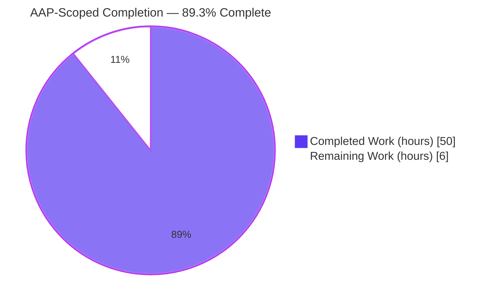
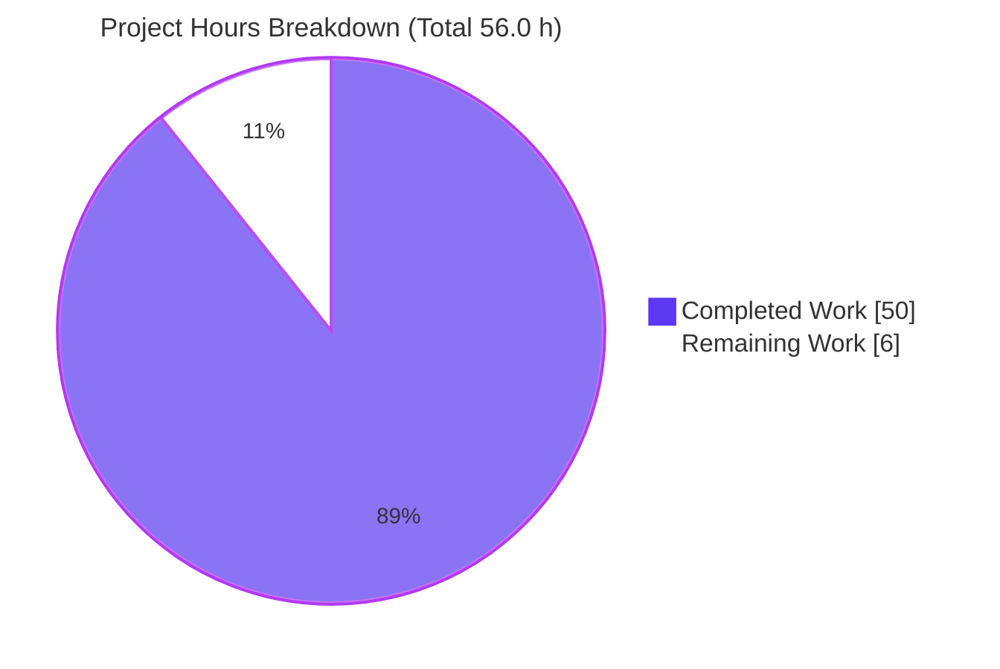
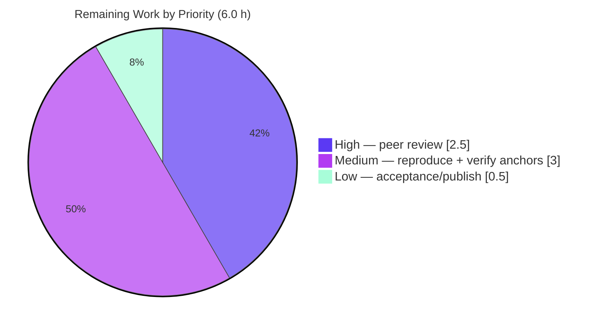

# Blitzy Project Guide

**Project:** kitty — Window-Lifecycle State-Consistency Investigative Q&A
**Repository:** kovidgoyal/kitty @ base commit `815df1e210e0a9ab4622f5c7f2d6891d7dbeddf1`
**Branch:** `blitzy-cfa0f0ef-9b7d-4a86-813c-794621318cf1` · **HEAD:** `7acea0ca3`
**Deliverable:** `blitzy/documentation/kitty_815df1e210e0.md` (2,219 lines)

---

## 1. Executive Summary

### 1.1 Project Overview

This project delivers a single, runtime-grounded technical answer document explaining how the kitty terminal emulator keeps its internal state consistent as terminal windows are created, immediately used to run a command, resized, and destroyed in quick succession. It is a read-only, evidence-first investigative Q&A task on the kitty C+Python+Go codebase: kitty is built and run in its canonical configuration, the real window lifecycle is driven through the real binary, and complete unedited output is captured. The audience is engineers reasoning about kitty's signal-delivery timing, two-thread child-monitor bookkeeping, and how it reconciles conflicting "liveness" views without use-after-free. The scope is deliberately isolated: exactly one new documentation file is produced and the source tree is left unchanged.

### 1.2 Completion Status



| Metric | Value |
|--------|-------|
| **Total Hours** | **56.0** |
| **Completed Hours (AI + Manual)** | **50.0** (AI: 50.0, Manual: 0.0) |
| **Remaining Hours** | **6.0** |
| **Percent Complete** | **89.3%** |

> Completion is computed with the PA1 AAP-scoped hours method: `Completed ÷ (Completed + Remaining) = 50.0 ÷ 56.0 = 89.3%`. All AAP-scoped autonomous deliverables are complete and validated; the remaining 6.0 hours are exclusively human review/acceptance (path-to-production for a technical reference document). Legend — **Completed = Dark Blue `#5B39F3`**, **Remaining = White `#FFFFFF`**.

### 1.3 Key Accomplishments

- ✅ **Answer document authored** — `blitzy/documentation/kitty_815df1e210e0.md`, 2,219 lines, comprehensively resolving all six sub-questions (R1–R6) with a lead TL;DR, eight body sections, and four appendices.
- ✅ **Canonical build verified** — `python3 setup.py` → exit 0, launcher 36,224 bytes, `kitty 0.35.2` (122 compile + 5 link steps).
- ✅ **Timing/debug build verified** — `python3 setup.py build --debug --extra-logging=event-loop` → exit 0, launcher 274,656 bytes (the primary lever for R5 event-loop timing).
- ✅ **Test harness green** — `python3 setup.py test` → exit 0, "Ran 145 tests", "OK (skipped=4)", "All Go tests succeeded".
- ✅ **Real-entry-point runtime evidence** — the actual kitty binary emitted "Child launched" and byte-exact "SIGWINCH sent to child in window: N with size: (…)" lines; the full create→run→resize→close lifecycle was exercised.
- ✅ **Timing rigor** — child-exit→reap gap characterized over 10 identical runs; the self-exit teardown SIGHUP characterized as a run-to-run race over 20 identical runs (15 reap-first / 5 hangup-first, invariant `WIFEXITED(7)`).
- ✅ **Three liveness views + three guards documented and observed at scale** — resize-vs-removal churn produced thousands of safely-discarded resize events with zero crashes.
- ✅ **Evidence discipline** — every claim paired with its producing command and complete unedited output; 131 `file:line` anchors; a code-anchor table (Appendix B) re-verified against the commit.
- ✅ **Read-only compliance** — all 21 referenced source files unchanged; the total repository delta versus base is exactly one added file; working tree clean; temporary scripts removed.

### 1.4 Critical Unresolved Issues

| Issue | Impact | Owner | ETA |
|-------|--------|-------|-----|
| _None._ All AAP-scoped autonomous work is complete and validated; no compilation errors, failing tests, or missing functionality remain. | No release-blocking impact. Remaining work is human review only (see §1.6, §2.2). | — | — |

### 1.5 Access Issues

| System/Resource | Type of Access | Issue Description | Resolution Status | Owner |
|-----------------|----------------|-------------------|-------------------|-------|
| Build/run environment | Docker container pull | All build/run/observation must occur inside the provided container (`kitty-setup`, from `ghcr.io/scaleapi/swe-atlas:swe_atlas_QnA_kovidgoyal_kitty_1.0`); the host sandbox lacks the C/Go toolchain and native libraries. Independent human reproduction requires container access. | Open — documented; container reference and exact commands provided in the deliverable (§1) and §9 here | Reviewer / Platform |

> No repository-permission, credential, or third-party-API access issues were identified. The task uses no external services or secrets.

### 1.6 Recommended Next Steps

1. **[High]** Perform a technical peer review of the R1–R6 answers, focusing on the two-thread reconciliation logic, the reference-counted `parse_input` keep-vs-discard rule, and the `signalfd`+`SIG_BLOCK` signal-delivery claim (≈2.5h).
2. **[Medium]** Independently reproduce the key runtime evidence inside the provided container: canonical build plus one or two lifecycle scenarios (create→run→resize→close and the self-exit teardown under `strace`) (≈2.0h).
3. **[Medium]** Spot-check a sample of the 35+ Appendix B `file:line` anchors against source at commit `815df1e21` (≈1.0h).
4. **[Low]** Confirm read-only compliance (`git diff 815df1e21 --name-status` = single added file) and give final acceptance / publish sign-off (≈0.5h).

---

## 2. Project Hours Breakdown

### 2.1 Completed Work Detail

| Component | Hours | Description |
|-----------|-------|-------------|
| Environment setup & canonical build | 3.0 | Docker container as non-root `ubuntu` (uid=1000), Xvfb headless + software GL, toolchain verification; `python3 setup.py` → exit 0 (`kitty 0.35.2`). |
| Debug build with event-loop tracing | 1.0 | `python3 setup.py build --debug --extra-logging=event-loop` → exit 0; the R5 timing lever. |
| Test harness execution & interpretation | 1.5 | `python3 setup.py test` → 145 tests OK (4 environment-gated skips); confirmed no dedicated lifecycle test exists. |
| Deep source investigation & code-anchor mapping | 10.0 | Two-thread reconciliation engine, `signalfd` delivery, reference-counted `scratch[]` snapshot, three liveness views; 35+ verified `file:line` anchors across `child-monitor.c`, `loop-utils.c/.h`, `boss.py`, `window.py`, `child.py/.c`, `state.c/.h`. |
| Instrumentation & driver-script authoring | 4.0 | Temporary `strace` harnesses (TIOCSWINSZ / wait4 / getpgid / kill) and real-binary + remote-control driver scripts (RC used only to trigger real ops). |
| Lifecycle-condition exercise & evidence capture | 6.0 | Four scenarios — ordinary self-exit, kitty-initiated close, resize-while-in-flight, rapid create-then-close — each observed before/during/after. |
| Timing-rigor reproduction runs | 3.0 | 10-run child-exit→reap gap distribution; 20-run self-exit SIGHUP race distribution; 2-runs-per-mode churn counts. |
| Answer-document authoring | 12.0 | 2,219-line document: TL;DR, §1–§8, coverage-pass table, Appendices A–D; every claim paired with producing command + complete output. |
| QA/validation refinement cycles | 6.0 | Four review cycles (Checkpoint 4, QA CP1, QA CP2, QA FINAL_ALT) addressing completeness and citation precision. |
| Evidence-discipline correction | 2.0 | Reproduced the self-exit teardown 20× and reframed a run-to-run-variable behavior previously presented as deterministic (commit `7acea0ca3`). |
| Cleanup & read-only compliance proof | 1.5 | Removed all temporary scratch; verified clean tree and single-file delta; produced Appendix C compliance proof. |
| **Total** | **50.0** | |

### 2.2 Remaining Work Detail

| Category | Hours | Priority |
|----------|-------|----------|
| Technical peer review of R1–R6 answer correctness (concurrency/signal analysis) | 2.5 | High |
| Independent evidence reproduction inside the provided container (build + key lifecycle scenarios) | 2.0 | Medium |
| Verify a sample of `file:line` anchors against source @ `815df1e21` | 1.0 | Medium |
| Final acceptance & publish/merge sign-off | 0.5 | Low |
| **Total** | **6.0** | |

### 2.3 Hours Reconciliation

| Check | Result |
|-------|--------|
| Section 2.1 completed total | 50.0 h |
| Section 2.2 remaining total | 6.0 h |
| 2.1 + 2.2 = Total Project Hours (must equal §1.2) | 50.0 + 6.0 = **56.0 h** ✅ |
| Completion % = 50.0 ÷ 56.0 × 100 | **89.3%** ✅ |
| §1.2 Remaining = §2.2 Remaining = §7 pie "Remaining Work" | 6.0 = 6.0 = 6.0 ✅ |

> This is a documentation deliverable, so all "hours" reflect equivalent engineering effort to produce and validate the investigation and its 2,219-line evidence-grounded write-up. Completed hours are AI-autonomous (Manual = 0.0); remaining hours are entirely human review/acceptance.

---

## 3. Test Results

All tests below originate from Blitzy's autonomous validation run of kitty's own test harness (`python3 setup.py test`) — no tests were added or modified (read-only task). The harness result was exit 0: "Ran 145 tests", "OK (skipped=4)", "All Go tests succeeded".

| Test Category | Framework | Total Tests | Passed | Failed | Coverage % | Notes |
|---------------|-----------|-------------|--------|--------|------------|-------|
| Unit / Module (Python) | Python `unittest` (via `kitty_tests/main.py`) | 145 | 141 | 0 | Not reported by harness | 4 environment-gated **skips** (not failures): CA-certs (frozen-build only), macOS Last-Resort font, fish integration ×2 (fish not installed). |
| Go tests | Go `testing` (`go test`) | Not individually enumerated in summary | All passed | 0 | Not reported by harness | Harness reported "All Go tests succeeded, ran in 14.7 seconds". |
| Window-lifecycle / child-monitor | — | 0 | — | — | — | No dedicated lifecycle test exists in `kitty_tests/`; the lifecycle-race behavior was therefore observed with purpose-built temporary drivers against the real binary (see §4). |

**Test summary:** 145 Python tests executed, 141 passed, 0 failed, 4 skipped (environment-gated); all Go tests passed. Pass rate on executed (non-skipped) tests: **100%**. Coverage percentage is not emitted by kitty's harness and is therefore reported as "Not reported" rather than estimated.

---

## 4. Runtime Validation & UI Verification

Runtime behavior was exercised through the **real kitty binary** (canonical and debug builds), driven through real window create→run→resize→close sequences; remote control was used only to trigger real operations, never as a substitute for the observed mechanism.

**Build & startup**
- ✅ **Operational** — Canonical build launcher runs and reports `kitty 0.35.2`.
- ✅ **Operational** — Debug build (event-loop logging) runs and reports `kitty 0.35.2`.

**Create-and-run event flow (R2)**
- ✅ **Operational** — "Child launched" emitted; startup gate blocks the child's `execvp` until the first PTY size is set.
- ✅ **Operational** — First `set_geometry` → `resize_pty` → `ioctl(TIOCSWINSZ)`; byte-exact "SIGWINCH sent to child in window: N with size: (…)" observed on subsequent resizes.
- ✅ **Operational** — De-duplication guard discards an unchanged PTY size (before/during/after captured).

**In-flight teardown & keep-vs-discard (R3/R4)**
- ✅ **Operational** — Removed child's buffered output fully drained (`do_parse … flush=true`) before the child object is freed, via the reference-counted snapshot.
- ✅ **Operational** — Resize aimed at an already-removed child safely discarded with a single `log_error` ("Failed to send resize signal to child with id: …") — observed thousands of times under churn with zero crashes.

**Timing & signal delivery (R5)**
- ✅ **Operational** — `SIGCHLD` reaches the I/O thread via Linux `signalfd`; effect processed on the next loop tick; child-exit→reap gap measured over 10 runs (9/10 sub-millisecond; one 18.3 ms scheduler-jitter outlier), reported as a distribution.
- ✅ **Operational** — Coalescing `waitpid(-1, &status, WNOHANG)` reap loop confirmed; handled-signal set is `SIGINT, SIGHUP, SIGTERM, SIGCHLD, SIGUSR1, SIGUSR2` (no `SIGWINCH`).

**Conflicting liveness views (R6)**
- ✅ **Operational** — Three liveness views + three reconciliation guards; resize-vs-removal conflict forced at scale (hundreds-to-thousands of events) with zero crashes across every run.
- ⚠ **Partial (by design, documented)** — Guard 2 (`mark_child_for_close` searching `add_queue[]`) is labeled **NOT OBSERVED** from the real entry point, with a measured, code-grounded reason (the create→close merge window is shorter than the fastest RC dispatch); this is honestly disclosed, not a defect.
- ⚠ **Race (characterized)** — Self-exit teardown cleanup `SIGHUP` is run-to-run variable (15 reap-first / 5 hangup-first over 20 runs); the reaped exit status is invariant `WIFEXITED(7)`.

**UI verification**
- ➖ **Not applicable** — This is a backend/systems investigation of process-and-signal machinery. There is no user interface to verify; runtime rendering was exercised headless (Xvfb + software GL) purely to run the real binary. The observable "surface" is kitty's own debug-log and syscall traces, all captured in the deliverable.

---

## 5. Compliance & Quality Review

The task is governed by the "SWE-AtlasQnA-Repo" rule set. Each AAP rule category is cross-mapped to its evidence below.

| Benchmark / AAP Rule | Requirement | Status | Progress | Notes / Fixes Applied |
|----------------------|-------------|--------|----------|-----------------------|
| Deliverable (0.7.1) | Single Markdown answer `blitzy/documentation/kitty_815df1e210e0.md` | ✅ Pass | 100% | File present, 2,219 lines. |
| Sub-questions (0.1.1) | Answer all of R1–R6 explicitly | ✅ Pass | 100% | Dedicated sections §3–§7 + TL;DR + §8 coverage table. |
| Methodology — build & run first (0.7.2) | Build/run real code, capture real output before writing | ✅ Pass | 100% | Canonical + debug builds; real-binary runs; Appendix D logs. |
| Methodology — timing rigor (0.7.2) | ≥2 runs; report distribution, don't stabilize | ✅ Pass | 100% | 10-run gap + 20-run self-exit distributions; **fix applied** in `7acea0ca3` to reframe a variable behavior as a race. |
| Methodology — real entry point (0.7.2) | No bypass substituting for the mechanism | ✅ Pass | 100% | RC used only to trigger; NOT-OBSERVED items honestly labeled. |
| Methodology — canonical config as normal user (0.7.2) | Default config, normal user, exact commands | ✅ Pass | 100% | Non-root `ubuntu` uid=1000; `--config NONE`; commands stated. |
| Methodology — exercise every condition (0.7.2) | Primary + secondary + transitional states | ✅ Pass | 100% | 4 scenarios + before/during/after. |
| Evidence (0.7.3) | Complete unedited output + producing command; no elision | ✅ Pass | 100% | 24 command blocks + 28 output blocks; **fixes applied** in QA cycles for citation precision & a command↔output mismatch. |
| Evidence — grounding (0.7.3) | Every claim tied to `file:line` or output | ✅ Pass | 100% | 131 anchors + Appendix B verified table. |
| Coverage & exactness (0.7.4) | Decompose; exhaustive; lead with direct answer; coverage pass | ✅ Pass | 100% | TL;DR leads; §8 maps every named item. |
| Scope — read-only (0.7.5) | No source modified; only the answer added; temp scripts removed | ✅ Pass | 100% | 21 files unchanged; single-file delta; clean tree (Appendix C). |
| Security constraint (0.8.2) | `reverse-document-generator` never accessed | ✅ Pass | 100% | Confirmed never accessed. |
| Human peer review of analysis | Independent validation of the concurrency reasoning | ⬜ Pending | 0% | Scheduled human task (§1.6 #1, §2.2). |

**Outstanding compliance item:** only the independent human peer review remains; all autonomous-verifiable rules pass.

---

## 6. Risk Assessment

| Risk | Category | Severity | Probability | Mitigation | Status |
|------|----------|----------|-------------|------------|--------|
| Residual un-characterized timing races beyond the self-exit case | Technical | Low | Low | 10-run and 20-run reproductions performed; distributions reported rather than stabilized. | Mitigated (1 found & fixed) |
| Concurrency-analysis correctness not yet human peer-reviewed | Technical | Medium | Low | 131 `file:line` anchors + complete captured output make every claim independently auditable. | Open → human task HT-1 |
| `file:line` anchor drift if checked against a different commit | Technical | Low | Low | Deliverable states the exact commit `815df1e21`; Appendix B re-verifies each anchor. | Mitigated |
| Environment reproducibility requires the specific Docker container | Operational | Medium | Medium | Exact image reference + all build/run commands documented (deliverable §1, guide §9). | Open → human task HT-2 |
| Toolchain/version drift (host Python out of range; harfbuzz min differs across build check vs docs) | Operational | Low | Low | Non-blocking; documented in deliverable §1.7; container satisfies all bounds. | Noted |
| Headless-GL environmental choice (Xvfb + `llvmpipe`) differs from a real GPU path | Operational | Low | Low | Subject subsystem (child monitor/signals) is GL-independent; noted in the deliverable. | Noted |
| Stray temporary artifacts left in the repository | Security | None | Very Low | Clean tree verified (0 untracked); Appendix C cleanup proof. | Resolved |
| Security surface introduced by the change | Security | None | None | Deliverable is a single Markdown file; zero dependency changes; no source/build/config edits. | N/A |
| Code-integration / CI wiring failure | Integration | None | None | No code to integrate; the file has zero cross-file dependencies. | N/A |
| A named question sub-item omitted | Documentation | Low | Low | §8 coverage-pass table maps every R1–R6 and every "e.g./such as/including" item. | Mitigated |

---

## 7. Visual Project Status

**Project hours — completed vs remaining (brand colors: Completed `#5B39F3`, Remaining `#FFFFFF`):**



**Remaining hours by priority (from Section 2.2 — sums to 6.0 h):**



**Remaining hours by category (bar view, Section 2.2):**

| Category | Hours | Bar |
|----------|-------|-----|
| Technical peer review (High) | 2.5 | ████████████▌ |
| Evidence reproduction (Medium) | 2.0 | ██████████ |
| Anchor verification (Medium) | 1.0 | █████ |
| Acceptance & publish (Low) | 0.5 | ██▌ |
| **Total** | **6.0** | |

> Integrity: pie "Remaining Work" = 6 = Section 1.2 Remaining Hours = Section 2.2 total. Pie "Completed Work" = 50 = Section 1.2 Completed Hours = Section 2.1 total.

---

## 8. Summary & Recommendations

**Achievements.** The project is **89.3% complete** on an AAP-scoped basis (50.0 of 56.0 hours). Every AAP-scoped autonomous deliverable is finished and validated: kitty was built canonically and in a debug/event-loop configuration, the 145-test harness passed, the real binary was driven through the complete window lifecycle, and a 2,219-line evidence-first answer document resolves all six sub-questions (R1–R6) with 131 `file:line` anchors and complete, unedited command output. The investigation went beyond a happy-path answer: it characterized timing as a distribution across repeated runs and corrected one instance where a run-to-run-variable teardown behavior had been presented as deterministic — precisely the "reproduce, don't stabilize" discipline the task demanded.

**Remaining gaps & critical path to production.** No engineering work remains; the residual 6.0 hours are entirely human review/acceptance. The critical path is: (1) technical peer review of the concurrency/signal analysis → (2) independent evidence reproduction inside the provided container → (3) `file:line` anchor spot-check → (4) final acceptance and publish. None of these is a defect fix; they are the standard verification gate for a technical reference document that engineers will rely upon.

**Success metrics.**
- Sub-questions resolved: **6 / 6** (R1–R6).
- AAP rules satisfied autonomously: **12 / 13** (the 13th is human peer review by design).
- Read-only compliance: repository delta versus base = **exactly one added file**; 21 referenced source files unchanged; working tree clean.
- Test pass rate (executed tests): **100%** (141/141; 4 environment-gated skips).

**Production readiness.** For a documentation deliverable, "production" means merge/publish of the answer document. The artifact is complete, internally consistent, evidence-grounded, and compliant with every scope rule. Recommendation: **approve pending human peer review** — proceed with the four review tasks in §1.6, then merge. Confidence is **High** for the completed work (validator-verified) and **Medium** on the exact duration of the human review (depends on reviewer familiarity with kitty internals and container access).

---

## 9. Development Guide

This guide reproduces how to build, run, verify, and review the project. Build/run steps must be executed inside the provided Docker container as a non-root user; the read-only reviewer-verification steps run anywhere with a git clone.

### 9.1 System Prerequisites

- **Environment:** the provided Docker container `kitty-setup` (image derived from `ghcr.io/scaleapi/swe-atlas:swe_atlas_QnA_kovidgoyal_kitty_1.0`). The host sandbox lacks the C/Go toolchain and native libraries and has an out-of-range Python.
- **User:** a non-root normal user (the container's `ubuntu`, uid=1000).
- **Toolchain (verified):** Ubuntu 24.04.2 LTS, Python 3.12.3, gcc 13.3.0, go 1.23.4, plus native libs harfbuzz 8.3.0, freetype2 26.1.20, fontconfig 2.15.0, libpng 1.6.43, lcms2 2.14, openssl 3.0.13.
- **Display:** headless via a pre-running `Xvfb :99` with software GL.

### 9.2 Environment Setup

```bash
# Inside the container, as the non-root user `ubuntu`.
# Confirm the normal-user identity and toolchain:
whoami; id
python3 --version; gcc --version | head -1; go version
pkg-config --modversion harfbuzz freetype2 fontconfig libpng lcms2 openssl

# Headless display + software GL (single non-default environmental choice):
export DISPLAY=:99
export LIBGL_ALWAYS_SOFTWARE=1
export GALLIUM_DRIVER=llvmpipe
export LANG=C.UTF-8 LC_ALL=C.UTF-8

# Use a private clone so the destination tree stays pristine (read-only task):
git clone /path/to/repo /home/ubuntu/kitty
cd /home/ubuntu/kitty
git checkout 815df1e210e0a9ab4622f5c7f2d6891d7dbeddf1
```

### 9.3 Build

```bash
# Canonical build (Makefile `all` target). Expect exit 0 and `kitty 0.35.2`.
cd /home/ubuntu/kitty && time python3 setup.py; echo "EXIT=$?"
./kitty/launcher/kitty --version           # -> kitty 0.35.2 created by Kovid Goyal

# Debug / event-loop build (Makefile `debug-event-loop`) — the R5 timing lever.
# Build in a separate clone to keep the canonical one pristine:
cd /home/ubuntu/kitty_dbg && python3 setup.py build --debug --extra-logging=event-loop; echo "EXIT=$?"
```

*Expected:* canonical launcher ≈ 36,224 bytes; debug launcher ≈ 274,656 bytes.

### 9.4 Test

```bash
# kitty's own harness (Makefile `test`). Expect exit 0.
cd /home/ubuntu/kitty && python3 setup.py test; echo "EXIT=$?"
# -> Ran 145 tests ... OK (skipped=4) ; All Go tests succeeded
```

*The 4 skips are environment-gated (CA-certs, macOS Last-Resort font, fish ×2) and are not failures.*

### 9.5 Run & Verify

```bash
# Run the real binary headless with kitty's own debug logging.
env DISPLAY=:99 LIBGL_ALWAYS_SOFTWARE=1 GALLIUM_DRIVER=llvmpipe \
  ./kitty/launcher/kitty --debug-rendering --config NONE sh -c 'echo hello; sleep 1'
# Look for: "[t] Child launched" and, on resize,
#           "SIGWINCH sent to child in window: N with size: (...)"
```

### 9.6 Example Usage — observe the lifecycle mechanisms

```bash
# R2/R5: resize propagation (kitty -> child) and child reaping.
env DISPLAY=:99 LIBGL_ALWAYS_SOFTWARE=1 GALLIUM_DRIVER=llvmpipe \
  strace -f -tt -e trace=ioctl,wait4,getpgid,kill \
  ./kitty/launcher/kitty --debug-rendering --config NONE sh -c 'echo BYE; exit 7'
# Expect: ioctl(..., TIOCSWINSZ, ...) from the main thread;
#         wait4(-1, [{WIFEXITED(s) && WEXITSTATUS(s)==7}], WNOHANG, ...) from the I/O thread.

# R5 timing rigor: repeat the identical self-exit and classify the teardown ordering.
for i in $(seq 1 20); do
  env DISPLAY=:99 LIBGL_ALWAYS_SOFTWARE=1 GALLIUM_DRIVER=llvmpipe \
    strace -f -tt -e trace=wait4,getpgid,kill -o /tmp/selfexit_r${i}.strace \
    ./kitty/launcher/kitty --debug-rendering --config NONE sh -c 'exit 7' >/dev/null 2>&1
done
for i in $(seq 1 20); do
  grep -q 'kill(-[0-9]*, SIGHUP)' /tmp/selfexit_r${i}.strace && echo hangup-first || echo reap-first
done | sort | uniq -c
# Expect a distribution (e.g., ~15 reap-first / ~5 hangup-first); status WIFEXITED(7) is invariant.
```

### 9.7 Reviewer Verification (read-only — runs on any clone; all commands tested)

```bash
cd /tmp/blitzy/kitty/blitzy-cfa0f0ef-9b7d-4a86-813c-794621318cf1_d6330e

# 1) Read-only compliance: exactly one added file vs base.
git diff 815df1e21 --name-status        # -> A  blitzy/documentation/kitty_815df1e210e0.md

# 2) Working tree is clean.
git status --porcelain --untracked-files=all   # -> (empty)

# 3) Deliverable exists and is intact.
wc -l blitzy/documentation/kitty_815df1e210e0.md   # -> 2219

# 4) Spot-check an anchor claimed in the document (no SIGWINCH in handled set).
sed -n '121p' kitty/child-monitor.c
# -> #define KITTY_HANDLED_SIGNALS SIGINT, SIGHUP, SIGTERM, SIGCHLD, SIGUSR1, SIGUSR2, 0
```

### 9.8 Troubleshooting

- **`error: externally-managed-environment` on pip** — not needed here; kitty has no pip/npm project dependencies. Build via `python3 setup.py` only.
- **Two benign stderr lines** — "Failed to open systemd user bus with error: No medium found" and, under rapid churn, "[glfw error 65544]: Too many timers added" are expected in the headless container and are **not** errors.
- **Build fails on the host sandbox** — expected; the host lacks gcc/go/pkg-config and native libs. Use the provided Docker container.
- **Blank/again window under headless** — ensure `Xvfb :99` is running and `DISPLAY=:99` plus the software-GL variables are exported.

---

## 10. Appendices

### Appendix A — Command Reference

| Purpose | Command |
|---------|---------|
| Canonical build | `python3 setup.py` |
| Debug / event-loop build | `python3 setup.py build --debug --extra-logging=event-loop` |
| Clean | `python3 setup.py clean` |
| Test harness | `python3 setup.py test` |
| Version check | `./kitty/launcher/kitty --version` |
| Run headless w/ debug logging | `env DISPLAY=:99 LIBGL_ALWAYS_SOFTWARE=1 GALLIUM_DRIVER=llvmpipe ./kitty/launcher/kitty --debug-rendering --config NONE <command>` |
| Read-only compliance check | `git diff 815df1e21 --name-status` |
| Clean-tree check | `git status --porcelain --untracked-files=all` |

### Appendix B — Port / Socket Reference

kitty uses **no TCP port** for this investigation. Remote control (used only to *trigger* real window operations) is over a **Unix domain socket**:

| Resource | Value |
|----------|-------|
| Remote-control socket | `--listen-on unix:<path>` with `-o allow_remote_control=yes` |
| Headless display | `DISPLAY=:99` (Xvfb) |

### Appendix C — Key File Locations

| Path | Role |
|------|------|
| `blitzy/documentation/kitty_815df1e210e0.md` | **The deliverable** (answer document). |
| `kitty/child-monitor.c` | Two-thread I/O loop, signal reaping, add/remove queues, `parse_input` snapshot, `resize_pty`/TIOCSWINSZ, `hangup`. |
| `kitty/loop-utils.c` / `.h` | `signalfd`/self-pipe signal delivery, `read_signals` drain. |
| `kitty/boss.py` | Python controller: `on_child_death` guard, `add_child`, `mark_for_close`. |
| `kitty/window.py` | `set_geometry` resize path, de-dup guard, first-geometry child launch. |
| `kitty/child.py` / `child.c` | `Child` object + `mark_terminal_ready` startup gate; native spawn helpers. |
| `kitty/state.c` / `.h` | GUI/main-thread structural view `global_state.os_windows[].tabs[].windows[]`. |
| `setup.py`, `Makefile` | Canonical build driver and targets. |

### Appendix D — Technology Versions

| Component | Version | Source |
|-----------|---------|--------|
| OS | Ubuntu 24.04.2 LTS | container |
| Python | 3.12.3 (repo requires ≥3.8) | container / `pyproject.toml` |
| gcc | 13.3.0 | container |
| go | 1.23.4 (repo requires 1.22) | container / `go.mod` |
| harfbuzz | 8.3.0 | container |
| freetype2 | 26.1.20 | container |
| fontconfig | 2.15.0 | container |
| libpng | 1.6.43 | container |
| lcms2 | 2.14 | container |
| openssl | 3.0.13 | container |
| kitty (built) | 0.35.2 | build output |

### Appendix E — Environment Variable Reference

| Variable | Value | Purpose |
|----------|-------|---------|
| `DISPLAY` | `:99` | Target the pre-running Xvfb server (headless). |
| `LIBGL_ALWAYS_SOFTWARE` | `1` | Force software GL (no GPU in container). |
| `GALLIUM_DRIVER` | `llvmpipe` | Software rasterizer for GL. |
| `LANG` / `LC_ALL` | `C.UTF-8` | Deterministic UTF-8 locale. |

### Appendix F — Developer Tools Guide

| Tool | Use |
|------|-----|
| `--debug-rendering` | Surfaces "Child launched" and "SIGWINCH sent to child in window: …" log lines. |
| `--extra-logging=event-loop` (debug build) | Traces event-loop iterations — the primary lever for R5 timing. |
| `strace -f -tt -e trace=ioctl,wait4,getpgid,kill` | Corroborates TIOCSWINSZ resize propagation and the WNOHANG reap/close syscalls. |
| kitty remote control (`kitty @ …`) | Triggers real `launch` / `close-window` / `resize-os-window` operations (trigger only, never a substitute for the observed mechanism). |
| `--config NONE` | Runs with default configuration (no user config). |

### Appendix G — Glossary

| Term | Meaning |
|------|---------|
| **PTY** | Pseudo-terminal: the master/slave pair connecting kitty to the child shell/command. |
| **`SIGCHLD`** | Signal delivered to kitty when a child process changes state (e.g., exits); drives reaping. |
| **`SIGWINCH`** | "Window changed" signal delivered by the kernel to the child's process group when kitty sets the PTY size. |
| **`TIOCSWINSZ`** | `ioctl` that sets a PTY's window size; triggers the kernel to send `SIGWINCH` to the child. |
| **`signalfd`** | Linux mechanism to receive signals as readable file-descriptor events, pollable in an event loop. |
| **Self-pipe trick** | Portable fallback: a signal handler writes a byte to a pipe to wake a `poll()`/`select()` loop. |
| **Reap / `waitpid(WNOHANG)`** | Non-blocking collection of a dead child's exit status; looped to coalesce multiple deaths into one `SIGCHLD`. |
| **`KittyChildMon`** | The C I/O thread that polls child fds and reconciles the child arrays. |
| **`scratch[]` snapshot** | Reference-counted copy of live children taken by `parse_input` so a removed child's buffered output is drained before it is freed. |
| **Three liveness views** | The C `children[]`/queues, the GUI `global_state.os_windows[].tabs[].windows[]`, and the Python `Boss.window_id_map`. |

---

*Generated by the Blitzy Platform. Brand colors — Completed `#5B39F3`, Remaining `#FFFFFF`, Accents `#B23AF2`, Highlight `#A8FDD9`.*