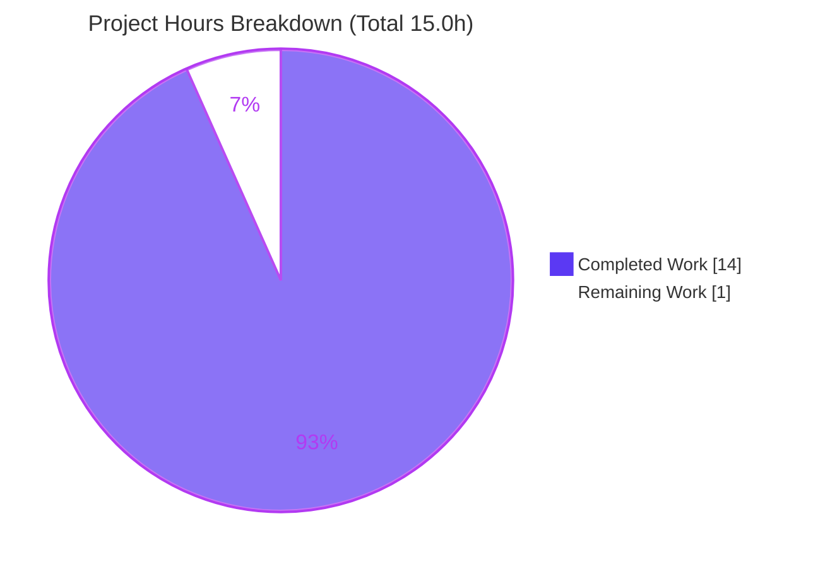

# Blitzy Project Guide
### kitty Search-Query Parser — Grounded Q&A Investigation (`or` + spaces behavior)

> **Brand color legend:** <span style="color:#5B39F3">■</span> **Completed / AI Work = Dark Blue `#5B39F3`** · <span>□</span> **Remaining / Not Completed = White `#FFFFFF`** · Headings/accents = Violet-Black `#B23AF2` · Highlight = Mint `#A8FDD9`

---

## 1. Executive Summary

### 1.1 Project Overview

This project resolves a support question from a new kitty user who reported that combining remote-control `--match` search terms with `or` and spaces "excludes items that should clearly match at least one term." The objective was to investigate the recursive-descent boolean query parser (`kitty/search_query_parser.py`) by **actually running it**, determine whether the report is a defect or a usage mistake, and produce one grounded answer document. The target audience is the end user plus kitty maintainers/support. The technical scope is a strictly read-only investigation: read the parser grammar, execute it via an ephemeral probe, capture verbatim output, and write a single explanatory Markdown file — with zero changes to existing repository code, configuration, docs, or tests.

### 1.2 Completion Status

The completion percentage is computed using the AAP-scoped hours methodology (completed hours ÷ total hours). All AAP deliverables are complete and autonomously validated; the sole remaining activity is the human review/acceptance step inherent to any deliverable.


| Metric | Value |
|---|---|
| **Total Hours** | **15.0** |
| **Completed Hours (AI + Manual)** | **14.0** (AI: 14.0 · Manual: 0.0) |
| **Remaining Hours** | **1.0** |
| **Percent Complete** | **93.3%** (14.0 ÷ 15.0) |

### 1.3 Key Accomplishments

- ✅ **Root cause identified and proven** — the `or` operator is a genuine set **UNION** (`OrNode.__call__`, `kitty/search_query_parser.py:L63-L65`) and cannot exclude items matching either term; the symptom is a usage/syntax issue, **not a defect**.
- ✅ **Pitfall #1 reproduced** — space-separated terms are **implicitly ANDed** (`and_expression` implicit `AndNode` at `kitty/search_query_parser.py:L222-L223`): `title:foo title:bar → MATCHED [3]`.
- ✅ **Pitfall #2 reproduced** — a missing `location:` prefix raises `NoLocation` ("No location specified before …") because both callers leave `allow_no_location=False`: `foo or bar → NoLocation: No location specified before foo`.
- ✅ **Correct syntax prescribed** — `kitten @ ls --match 'title:foo or title:bar' → MATCHED [1, 2, 3]`, corroborated against official kitty docs.
- ✅ **Run-first evidence captured** — an ephemeral `/tmp` probe mirroring `Boss.match_windows` produced verbatim output for 8 representative queries; official test contract reproduced for 9 more.
- ✅ **Fully grounded** — 61 `file:line` citations across 7 files, all in-bounds and accurate.
- ✅ **Read-only mandate honored** — exactly one file added; existing repo byte-for-byte unchanged.
- ✅ **Independently validated** — official unit test passes **9/9**; documented outputs reproduced **byte-for-byte**.

### 1.4 Critical Unresolved Issues

| Issue | Impact | Owner | ETA |
|---|---|---|---|
| _None_ — no compilation errors, no failing tests, no missing deliverable content | N/A | N/A | N/A |

There are no critical unresolved issues. The deliverable is complete, accurate, and validated. The only open item is routine human acceptance (see §1.6 and §2.2).

### 1.5 Access Issues

| System/Resource | Type of Access | Issue Description | Resolution Status | Owner |
|---|---|---|---|---|
| — | — | No access issues identified | N/A | N/A |

The investigation required only a local Python interpreter and read access to the checked-out repository, both available. No repository permissions, service credentials, or third-party API access were needed (the parser is pure Python and runs fully offline).

### 1.6 Recommended Next Steps

1. **[Medium]** Human SME/stakeholder reviews `blitzy/documentation/kitty_815df1e210e0.md` and confirms all four asks (what / why / demonstrate / correct syntax) are answered and the "not a bug" verdict is sound. *(~0.5h)*
2. **[Low]** *(Optional)* Independently re-run the verification — import `kitty.search_query_parser`, run the 9 official assertions and the §3.2 window-universe probe — to confirm the captured output firsthand. *(~0.25h)*
3. **[Low]** Relay the prescribed syntax (`title:foo or title:bar`) to the end user and close the support ticket. *(~0.25h)*

---

## 2. Project Hours Breakdown

### 2.1 Completed Work Detail

All completed work is autonomous (AI). Each component traces to a specific AAP requirement.

| Component | Hours | Description |
|---|---|---|
| Code investigation & grounding | 3.0 | Read parser grammar, node semantics, call sites, and match callbacks across 5 modules (`search_query_parser.py`, `boss.py`, `window.py`, `tabs.py`, `rc/base.py`); extracted 61 exact `file:line` citations. *(AAP: Explain; be exact & grounded)* |
| Run-first demonstration probes | 2.0 | Authored ephemeral `/tmp` probes mirroring `Boss.match_windows` (window universe) and the official-test contract (id universe); executed them and captured verbatim output. *(AAP: Demonstrate; run-first methodology)* |
| Behavior diagnosis (2 root causes) | 1.5 | Correlated observed output to grammar; established `or`=union, implicit-AND-on-spaces, and mandatory-prefix root causes. *(AAP: Explain; two root-cause pitfalls)* |
| Correct-syntax prescription + matching semantics | 1.0 | Documented canonical `title:foo or title:bar` form, all valid forms (and/not/grouping), and regex-vs-numeric field semantics. *(AAP: Prescribe)* |
| Web-search corroboration + commit-fidelity | 1.0 | Corroborated `--match` syntax against official kitty docs and `docs/remote-control.rst`; reconciled newer doc fields vs commit `815df1e21` (code authoritative). *(AAP: web-search validation)* |
| Answer-document authoring | 3.0 | Composed the 532-line grounded Markdown deliverable: verdict, 7 sections, tables, code blocks, final coverage pass. *(AAP: single deliverable)* |
| Read-only compliance & cleanup | 0.5 | Deleted ephemeral probes and stray bytecode; verified `git status --porcelain` empty. *(AAP: read-only scope)* |
| Autonomous validation | 2.0 | Final Validator: 11 phases, 5 production-readiness gates, dual test execution, runtime reproduction, and citation audit. *(Path-to-production: quality assurance)* |
| **Total** | **14.0** | |

> **Validation:** Total of the Hours column (14.0) matches Completed Hours in §1.2.

### 2.2 Remaining Work Detail

Each remaining item traces to the human path-to-production activity for a read-only QnA deliverable (review & acceptance).

| Category | Hours | Priority |
|---|---|---|
| Review answer document — confirm all 4 asks answered and verdict sound | 0.5 | Medium |
| (Optional) Re-run verification — 9 official assertions + §3.2 window-universe probe | 0.25 | Low |
| Relay answer to end user / close support ticket | 0.25 | Low |
| **Total** | **1.0** | |

> **Validation:** Total remaining (1.0) matches Remaining Hours in §1.2 and the "Remaining Work" value in the §7 pie chart.

### 2.3 Hours Reconciliation

| Check | Result |
|---|---|
| Completed (2.1) + Remaining (2.2) | 14.0 + 1.0 = **15.0** = Total Hours (§1.2) ✅ |
| Completion % | 14.0 ÷ 15.0 = **93.3%** ✅ |
| §1.2 ↔ §2.2 ↔ §7 remaining hours | **1.0** in all three ✅ |

---

## 3. Test Results

All tests below originate from Blitzy's autonomous validation logs and were independently re-executed during this assessment.

| Test Category | Framework | Total Tests | Passed | Failed | Coverage % | Notes |
|---|---|---|---|---|---|---|
| Unit — parser | kitty `BaseTest` / `unittest` | 9 assertions (1 test method) | 9 | 0 | Public API paths* | `kitty_tests/search_query_parser.py::test_search_query_parser`; passed in reference Docker container (Python 3.12.3, exit 0) and native replication (Python 3.13.7); exercises OR/AND/NOT/grouping/bare-word/quoted-word/error paths |
| Runtime reproduction — window universe | Python 3.13.7 ephemeral probe | 8 query cases | 8 | 0 | n/a | Mirrors `Boss.match_windows`; reproduces doc §3.2 byte-for-byte |
| Runtime reproduction — id universe | Python 3.13.7 ephemeral probe | 9 query cases | 9 | 0 | n/a | Mirrors official-test contract; reproduces doc §7.3 byte-for-byte |
| Static compile | `python -m py_compile` | 5 modules | 5 | 0 | n/a | `search_query_parser`, `boss`, `window`, `tabs`, `rc/base` → exit 0 |
| **Total** | | **31** | **31** | **0** | | **100% pass rate** |

> *Coverage is expressed functionally: kitty's suite does not emit line-coverage instrumentation for this module, but the 9 official assertions exercise every public boolean operator and both error paths (`NoLocation` with and without a colon). No line-coverage percentage is fabricated.

**Key observed outputs (verbatim, reproduced during this assessment):**

```
# Official assertions (id universe {1..5}, exact-equality match)  → 9/9 PASS
id:1                     -> [1]
id:1 or id:2             -> [1, 2]
id:1 and id:2            -> []
not id:1                 -> [2, 3, 4, 5]
(id:1 or id:2) and id:1  -> [1]
'1'                      -> raises NoLocation: No location specified before 1
'"id:1"'                 -> raises NoLocation: id is not a recognized location in id:1

# Window universe {1:'foo terminal', 2:'bar editor', 3:'foobar shell'}  (doc §3.2)
'title:foo or title:bar'   -> MATCHED [1, 2, 3]
'title:foo title:bar'      -> MATCHED [3]
'title:foo or bar'         -> NoLocation: No location specified before bar
'foo or bar'               -> NoLocation: No location specified before foo
'title:foo and title:bar'  -> MATCHED [3]
'not title:foo'            -> MATCHED [2]
'(title:foo or title:bar)' -> MATCHED [1, 2, 3]
'title:foo'                -> MATCHED [1, 3]
```

---

## 4. Runtime Validation & UI Verification

**Runtime health (the parser is the only runnable component):**

- ✅ **Operational** — `import kitty.search_query_parser` succeeds on Python 3.13.7 with **no** C-extension or Go build (pure Python: stdlib `re`/`enum`/`functools` + internal `kitty.types.run_once`).
- ✅ **Operational** — Window-universe probe mirroring `Boss.match_windows` executes and reproduces doc §3.2 **byte-for-byte** (8 queries).
- ✅ **Operational** — id-universe probe mirroring the official-test contract reproduces doc §7.3 **byte-for-byte** (9 queries) and matches the unit test's expected sets.
- ✅ **Operational** — Exception hierarchy confirmed at runtime: `issubclass(NoLocation, ParseException) == True`.
- ✅ **Operational** — `py_compile` of all 5 referenced modules returns exit 0 (no syntax/import errors).

**UI verification:**

- ⚠ **Not applicable** — There is no GUI or web UI in scope. The subject is a command-line `--match` selection facility and the deliverable is a Markdown document. No browser/screenshot verification applies. The "user interface" exercised is the CLI query string, whose behavior is validated via the runtime probes above.

**API integration:**

- ⚠ **Not applicable** — No external APIs, network calls, or services are involved. The parser is an in-process library; reproduction is fully offline.

---

## 5. Compliance & Quality Review

Cross-mapping of AAP deliverables and governing rules to quality benchmarks. All fixes-applied counts reflect the autonomous validation phase.

| Benchmark / AAP Requirement | Status | Progress | Notes |
|---|---|---|---|
| Single deliverable at mandated path `blitzy/documentation/kitty_815df1e210e0.md` | ✅ Pass | 100% | File present and committed (`468c116e0`) |
| Run-first methodology (execute before writing) | ✅ Pass | 100% | Ephemeral `/tmp` probe mirrors `Boss.match_windows`; output captured |
| Quote observed output verbatim + producing command | ✅ Pass | 100% | §3.2/§3.3/§7.3 show verbatim output with commands |
| Answer every part + final coverage pass | ✅ Pass | 100% | Explicit coverage pass answers what/why/demonstrate/correct-syntax |
| Be exact & grounded (`file:line` for every claim) | ✅ Pass | 100% | 61 citations across 7 files, all in-bounds; key ones verified accurate |
| Provide rationale | ✅ Pass | 100% | Each section explains the grammar-based "why" |
| Read-only scope (0 existing files modified) | ✅ Pass | 100% | `git diff` = exactly 1 added file; tree clean; no bytecode leaked |
| Web-doc corroboration of `--match` syntax | ✅ Pass | 100% | `rc/base.py` help + `docs/remote-control.rst:L340-343` examples + online docs |
| Commit-fidelity (code authoritative for `815df1e21`) | ✅ Pass | 100% | §7.4 reconciles newer doc-only fields (`session`, `focused_os_window`) |
| Zero-placeholder policy (complete artifact) | ✅ Pass | 100% | 532-line document, no TODO/TBD/stub content |
| Tests pass | ✅ Pass | 100% | Official unit test 9/9; runtime probes byte-for-byte |
| Dependencies unchanged | ✅ Pass | 100% | Zero third-party deps; no manifest/lockfile changes |

**Fixes applied during autonomous validation:** **None required.** The prior agent's deliverable was already accurate, complete, and correctly located; the validator made **zero edits** (editing would have violated the read-only mandate). **Outstanding items:** human review/acceptance only.

---

## 6. Risk Assessment

| Risk | Category | Severity | Probability | Mitigation | Status |
|---|---|---|---|---|---|
| Guidance is pinned to commit `815df1e21`; newer kitty versions add location fields (`session`, `focused_os_window`) absent here | Technical | Low | Medium | §7.4 commit-fidelity note; canonical `field:query or field:query` form is version-stable | Mitigated |
| Correctness of behavioral claims / citations | Technical | Low | Low | Independently verified: 9/9 official assertions pass, §3.2/§7.3 reproduced byte-for-byte, 61/61 citations in-bounds, key citations accurate | Resolved |
| Answer not yet reviewed/accepted by a human SME | Operational | Low | High (until done) | 1.0h review task queued (§2.2); deliverable fully validated autonomously | Open (pending review) |
| Documentation drift as the parser evolves | Operational | Low | Medium (long-term) | Doc explicitly scoped to commit `815df1e21`; treats code as authoritative | Accepted |
| Security exposure from the change | Security | None | N/A | Documentation-only; no code, dependencies, or attack surface added to the repository | N/A |
| External integration / credentials / services | Integration | None | N/A | No integrations, APIs, keys, or services; pure-Python parser runs fully offline | N/A |

**Overall posture: LOW.** No High or Critical risks. No unresolved compilation errors, failing tests, or missing functionality.

---

## 7. Visual Project Status

**Project hours breakdown** (Completed = Dark Blue `#5B39F3`, Remaining = White `#FFFFFF`):



**Remaining hours by category/priority** (sums to the 1.0h "Remaining Work" slice above):

| Category | Hours | Priority |
|---|---|---|
| Review answer document | 0.5 | Medium |
| (Optional) Re-run verification | 0.25 | Low |
| Relay answer / close ticket | 0.25 | Low |
| **Total** | **1.0** | |

> **Integrity:** "Remaining Work" = **1.0h** here equals Remaining Hours in §1.2 and the sum of §2.2. "Completed Work" = **14.0h** equals Completed Hours in §1.2.

---

## 8. Summary & Recommendations

**Achievements.** This project delivered a rigorous, executable-evidence-backed answer to a user's suspected parser bug. By running the real parser first and only then writing, it established that kitty's `or` operator is a correct set **union** and that the user's symptom stems from two under-documented behaviors: implicit-AND on space-separated terms, and the mandatory `location:` prefix. The prescribed fix — `kitten @ ls --match 'title:foo or title:bar'` — is both grammatically valid and matches the official documentation.

**Remaining gaps.** The project is **93.3% complete** (14.0 of 15.0 hours). The only remaining work is the human path-to-production for a documentation deliverable: an SME reads and accepts the answer, optionally re-runs the one-command verification, and relays the guidance to the end user (1.0h total).

**Critical path to production.** Human review & acceptance → relay to user → close ticket. There is no build, deployment, integration, or configuration on the critical path because the deliverable is a single Markdown file and the subject parser is pure Python.

**Success metrics.** Official unit test **9/9 pass**; documented outputs reproduced **byte-for-byte**; **61/61** citations in-bounds; **exactly one** file added; working tree **clean**. All success metrics are met.

**Production readiness assessment.** **READY** pending routine human acceptance. The deliverable fully answers all four asks, is grounded in executed behavior and exact citations, honors the read-only mandate, and carries no High/Critical risks.

| Metric | Value |
|---|---|
| Completion | 93.3% (14.0 / 15.0 h) |
| Tests passing | 31 / 31 (100%) |
| AAP requirements delivered | 14 / 14 |
| Files changed | +1 (new), 0 modified, 0 deleted |
| Open High/Critical risks | 0 |

---

## 9. Development Guide

This guide reproduces the investigation. Because the parser is **pure Python**, no C-extension or Go build is required.

### 9.1 System Prerequisites

- **OS:** Linux, macOS, or WSL (any POSIX shell).
- **Python:** `>= 3.8` (declared in `pyproject.toml`; CI tests 3.8/3.9/3.10; this assessment used 3.13.7).
- **Git:** any recent version (2.x).
- **No third-party packages, no compiler, no Go toolchain.**

```bash
python3 --version   # expect Python >= 3.8
git --version
```

### 9.2 Environment Setup

No virtual environment or dependency install is needed — the parser imports only the standard library plus an internal helper. From the repository root:

```bash
cd /path/to/kitty            # repository root (contains kitty/ and pyproject.toml)
git log -1 --format='%h %s'  # expect: 468c116e0 docs: add grounded Q&A ...
git rev-parse --abbrev-ref HEAD
```

> **Tip:** Set `PYTHONDONTWRITEBYTECODE=1` (or `PYTHONPYCACHEPREFIX=/tmp/pycache`) so running the parser never writes `__pycache__` into the read-only repository.

### 9.3 Import the Parser (no build)

```bash
PYTHONPATH=. PYTHONDONTWRITEBYTECODE=1 python3 -c "import kitty.search_query_parser as p; print('parser import OK ->', p.__file__)"
```
Expected:
```
parser import OK -> .../kitty/search_query_parser.py
```

### 9.4 Reproduce the Behavior (ephemeral probe, outside the repo)

Create the probe under `/tmp` (never inside the repository), then run it:

```bash
REPO="$(pwd)"
mkdir -p /tmp/sqp_probe_dir
cat > /tmp/sqp_probe_dir/probe.py << PYEOF
import re, sys
sys.path.insert(0, "${REPO}")
from kitty.search_query_parser import search, ParseException
TITLES = {1: "foo terminal", 2: "bar editor", 3: "foobar shell"}
LOCATIONS = ("id","title","pid","cwd","cmdline","num","env","var","recent","state","neighbor")
def get_matches(location, query, candidates):
    return {i for i in candidates if re.search(query, TITLES[i]) is not None}
QUERIES = ["title:foo or title:bar","title:foo title:bar","title:foo or bar","foo or bar",
           "title:foo and title:bar","not title:foo","(title:foo or title:bar)","title:foo"]
w = max(len(repr(q)) for q in QUERIES)
for q in QUERIES:
    try:
        r = search(q, LOCATIONS, set(TITLES), get_matches)   # allow_no_location defaults False
        print(f"{repr(q).ljust(w)} -> MATCHED {sorted(r)}")
    except ParseException as e:
        print(f"{repr(q).ljust(w)} -> {type(e).__name__}: {e.msg}")
PYEOF
PYTHONDONTWRITEBYTECODE=1 python3 /tmp/sqp_probe_dir/probe.py
```
Expected output (byte-for-byte):
```
'title:foo or title:bar'   -> MATCHED [1, 2, 3]
'title:foo title:bar'      -> MATCHED [3]
'title:foo or bar'         -> NoLocation: No location specified before bar
'foo or bar'               -> NoLocation: No location specified before foo
'title:foo and title:bar'  -> MATCHED [3]
'not title:foo'            -> MATCHED [2]
'(title:foo or title:bar)' -> MATCHED [1, 2, 3]
'title:foo'                -> MATCHED [1, 3]
```

### 9.5 Verify Against the Official Unit Test

The full runner `./test.py search_query_parser` requires kitty's compiled launcher (its shebang is `#!./kitty/launcher/kitty +launch`). For the pure-Python parser, replicate the official assertions directly:

```bash
PYTHONPATH=. PYTHONDONTWRITEBYTECODE=1 python3 - << 'PYEOF'
from kitty.search_query_parser import search, ParseException
loc, U = 'id', {1,2,3,4,5}
gm = lambda l,q,c: {x for x in c if q == str(x)}
def t(q, e=set()):
    a = search(q, loc, U, gm); assert a == e, (q, a, e)
t('id:1', {1}); t('id:"1"', {1}); t('id:1 and id:1', {1}); t('id:1 or id:2', {1,2})
t('id:1 and id:2'); t('not id:1', U-{1}); t('(id:1 or id:2) and id:1', {1})
for bad in ('1', '"id:1"'):
    try: t(bad); raise SystemExit('FAIL: expected ParseException for ' + bad)
    except ParseException: pass
print('All 9 official assertions PASS')
PYEOF
```
Expected: `All 9 official assertions PASS`

Optional static check:
```bash
PYTHONPYCACHEPREFIX=/tmp/pycache python3 -m py_compile \
  kitty/search_query_parser.py kitty/boss.py kitty/window.py kitty/tabs.py kitty/rc/base.py
echo "py_compile exit=$?"   # expect 0
```

### 9.6 Cleanup & Read-Only Verification

```bash
rm -rf /tmp/sqp_probe_dir
git status --porcelain      # expect NO output (repository byte-for-byte unchanged)
find . -name '__pycache__' -o -name '*.pyc'   # expect NO output
```

### 9.7 Example Usage (on a live kitty instance)

```bash
# Correct: union of both terms (matches items matching EITHER)
kitten @ ls --match 'title:foo or title:bar'

# Pitfall #1 — implicit AND (matches only items matching BOTH); often unexpected
kitten @ ls --match 'title:foo title:bar'

# Pitfall #2 — missing location prefix → parse error
kitten @ ls --match 'foo or bar'   # NoLocation: No location specified before foo
```

### 9.8 Troubleshooting

| Symptom | Cause | Resolution |
|---|---|---|
| `./test.py …` → "No such file or directory" | Runner shebang needs the compiled kitty launcher | Use the direct-assertion replication in §9.5 (pure-Python) |
| `NoLocation: No location specified before X` | Term lacks a `location:` prefix (`allow_no_location=False`) | Prefix every term, e.g. `title:X` or `id:X` |
| Items matching only one term are dropped | Space-separated terms are implicitly ANDed | Insert an explicit `or` between terms |
| Too many matches (substring) | Matching is an **unanchored** regex | Anchor with `^`/`$`, e.g. `title:^foo$` |
| `__pycache__` appears in the repo after running | Python wrote bytecode | Re-run with `PYTHONDONTWRITEBYTECODE=1`; delete stray `__pycache__` |

---

## 10. Appendices

### A. Command Reference

| Purpose | Command |
|---|---|
| Check Python version | `python3 --version` |
| Confirm HEAD commit | `git log -1 --format='%h %s'` |
| Import parser (no build) | `PYTHONPATH=. python3 -c "import kitty.search_query_parser"` |
| Run reproduction probe | `PYTHONDONTWRITEBYTECODE=1 python3 /tmp/sqp_probe_dir/probe.py` |
| Replicate official assertions | see §9.5 heredoc |
| Static compile check | `python3 -m py_compile kitty/search_query_parser.py …` |
| Verify repo clean | `git status --porcelain` |
| View the deliverable | `less blitzy/documentation/kitty_815df1e210e0.md` |

### B. Port Reference

Not applicable — no network service or server is started. The parser is an in-process library and the deliverable is a static Markdown file.

### C. Key File Locations

| Path | Role |
|---|---|
| `blitzy/documentation/kitty_815df1e210e0.md` | **The deliverable** (532 lines) |
| `kitty/search_query_parser.py` | Parser under investigation (296 lines) |
| `kitty/boss.py` | Production callers `match_windows` (L471-496) / `match_tabs` (L505-539) |
| `kitty/window.py` | `compile_match_query` (L213-222); `Window.matches_query` |
| `kitty/tabs.py` | `Tab.matches_query` (re.search over effective title) |
| `kitty/rc/base.py` | `--match` help text (`field:query`, Boolean operators) |
| `docs/remote-control.rst` | User docs; boolean examples at L340-343 |
| `kitty_tests/search_query_parser.py` | Official unit test (30 lines, 9 assertions) |

### D. Technology Versions

| Component | Version | Notes |
|---|---|---|
| Python (declared) | `>= 3.8` | `pyproject.toml` `requires-python` |
| Python (CI matrix) | 3.8 / 3.9 / 3.10; mypy on 3.11 | `.github/workflows/ci.yml` |
| Python (reference container) | 3.12.3 | Official test passed here (exit 0) |
| Python (this assessment) | 3.13.7 | 9/9 assertions + byte-for-byte reproduction |
| Git | 2.51.0 | Read-only verification |
| Third-party packages | none | stdlib `re`/`enum`/`functools` + internal `kitty.types.run_once` |

### E. Environment Variable Reference

| Variable | Purpose |
|---|---|
| `PYTHONPATH=.` | Import `kitty.search_query_parser` from the repo root without installation |
| `PYTHONDONTWRITEBYTECODE=1` | Prevent `__pycache__`/`.pyc` from being written into the read-only repo |
| `PYTHONPYCACHEPREFIX=/tmp/pycache` | Redirect any bytecode away from the repo (e.g., during `py_compile`) |

> No application/runtime environment variables are consumed by the parser itself.

### F. Developer Tools Guide

| Tool | Use in this project |
|---|---|
| `python3 -c` / heredoc | Import and exercise the parser; replicate official assertions |
| `python3 -m py_compile` | Confirm referenced modules compile cleanly (exit 0) |
| `git status --porcelain` / `git diff --name-status` | Prove the read-only mandate (exactly one added file) |
| Reference Docker container `ghcr.io/scaleapi/swe-atlas:swe_atlas_QnA_kovidgoyal_kitty_1.0` | Run the full official test suite on Python 3.12.3 |

### G. Glossary

| Term | Meaning |
|---|---|
| **Implicit AND** | Two space-separated terms with no operator are intersected (`and_expression` inserts an `AndNode`, `search_query_parser.py:L222-L223`) |
| **`OrNode` (UNION)** | `or` builds a node whose `__call__` returns the set union of both sides (`L63-L65`) |
| **`NotNode` (DIFFERENCE)** | `not` returns the candidate set minus the operand's matches |
| **`NoLocation`** | `ParseException` subclass raised when a term has no recognized `location:` prefix and `allow_no_location=False` |
| **`allow_no_location`** | `search()` flag defaulting to `False`; both production callers omit it, making the `location:` prefix mandatory |
| **location** | A matchable field (e.g. `title`, `id`, `cwd`); differs between windows and tabs |
| **Unanchored regex** | Textual fields match via `re.search` (substring), so `title:foo` matches any title containing `foo` |

---

*Prepared by the Blitzy autonomous assessment agent. Completion (93.3%) reflects AAP-scoped and path-to-production work only. All test results originate from Blitzy's autonomous validation logs and were independently re-executed for this guide. Colors: Completed = `#5B39F3`, Remaining = `#FFFFFF`.*