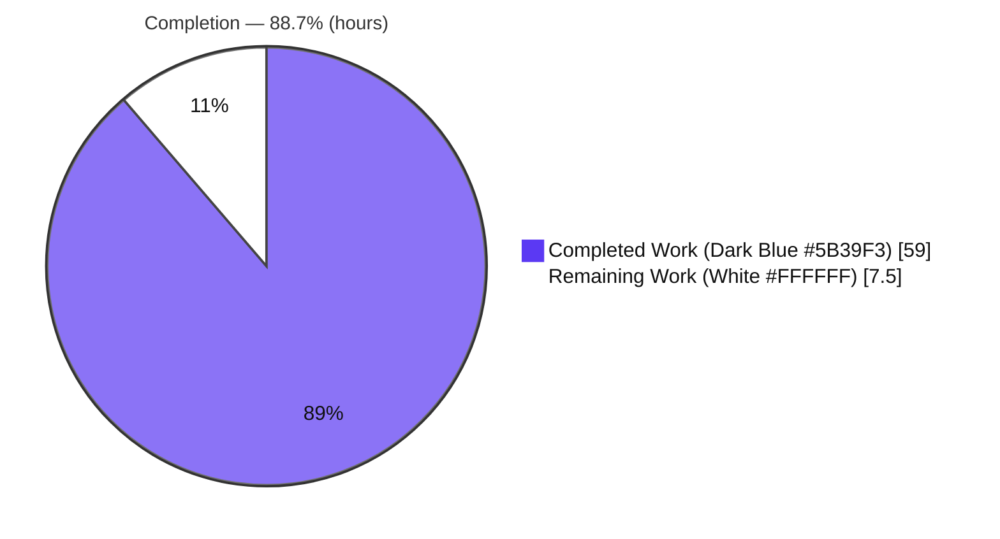
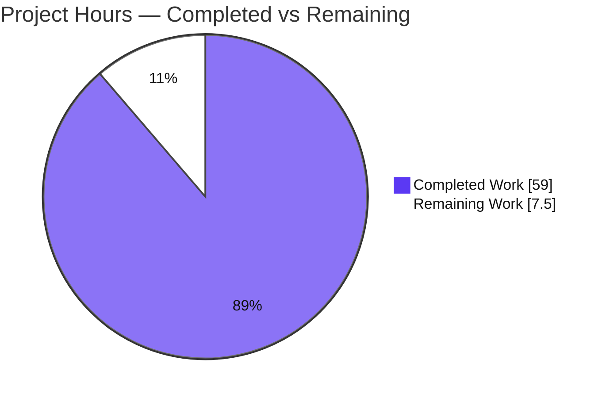
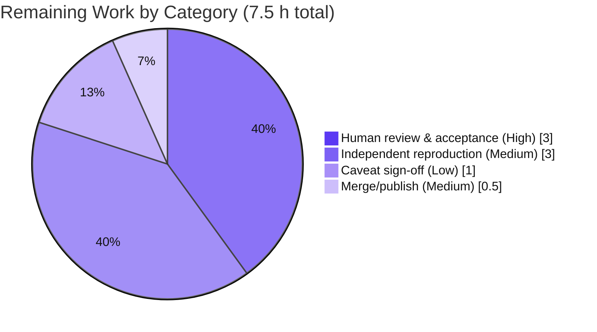

# Blitzy Project Guide
## kitty 0.35.2 — Runtime Investigation (Startup, Configuration, Terminal-Shell Setup & Display)

> **Project type:** Read-only runtime-behavior investigation (Q&A) / Documentation
> **Target:** `kovidgoyal/kitty` @ commit `815df1e210e0` — canonical version **0.35.2**
> **Sole deliverable:** `blitzy/documentation/kitty_815df1e210e0.md` (1,727 lines)
> **Brand legend:** <span style="color:#5B39F3">■</span> Completed / AI Work = Dark Blue `#5B39F3` · <span style="color:#FFFFFF;background:#333;padding:0 4px">□</span> Remaining = White `#FFFFFF`

---

## 1. Executive Summary

### 1.1 Project Overview

This project answers four grouped questions about what happens when **kitty** (a GPU-accelerated terminal emulator) starts up — from process launch to the point the terminal is ready to talk to a shell. The audience is engineers and reviewers who need an authoritative, evidence-grounded explanation of kitty's startup subsystems, initial-configuration resolution, terminal↔shell handshake, and display pipeline at commit `815df1e210e0`. Per the Agent Action Plan (AAP), this is a **strictly read-only investigation**: the only output is a single Markdown answer document; no kitty source file is changed and no dependency is added. The technical scope spans kitty's C + Python core, the vendored GLFW backend, the OpenGL/shader pipeline, the PTY/VT-parser path, and the font/render subsystem — all built and observed at runtime under a headless Xvfb + Mesa environment.

### 1.2 Completion Status

The completion percentage is computed with the PA1 hours-based methodology over AAP-scoped and path-to-production work only. **All AAP-scoped autonomous work is delivered and validated;** the remaining hours are exclusively human path-to-production activities (review, optional reproduction, sign-off, merge).



| Metric | Hours |
|--------|-------|
| **Total Hours** | **66.5** |
| **Completed Hours (AI + Manual)** | **59.0** (AI/Blitzy = 59.0 · Manual = 0.0) |
| **Remaining Hours** | **7.5** |
| **Percent Complete** | **88.7%** |

> **Calculation:** Completion % = Completed ÷ (Completed + Remaining) = 59.0 ÷ 66.5 = **88.7%**. Held below 100% per policy because human acceptance/verification path-to-production remains.

### 1.3 Key Accomplishments

- ✅ **Single deliverable created and committed** — `blitzy/documentation/kitty_815df1e210e0.md` (1,727 lines), added in 6 documentation commits, all authored by `agent@blitzy.com`.
- ✅ **Source tree left pristine** — `git status` clean; diff vs base branch touches only `blitzy/` (+1,727 / −0); zero source files modified.
- ✅ **Run-first evidence** — kitty built via its canonical entry point (`python3 setup.py build`, exit 0, no deviation flag in the mandated container) and launched headlessly under authenticated Xvfb + Mesa software OpenGL 4.5.
- ✅ **All four questions answered** with a leading direct answer plus captured output — startup subsystems (Q1), initial configuration (Q2), terminal-shell setup (Q3), display evidence (Q4).
- ✅ **Impeccable grounding** — 35 distinct cited source files and 282 line references validated (0 missing, 0 out-of-range); independent spot-checks matched source exactly.
- ✅ **Observed-vs-inferred discipline** — every read-only deduction labeled `(inferred)`; every behavioral claim paired with `(observed)` output; Observed-vs-Inferred Ledger, Citation Index, and complete verbatim build log provided as appendices.
- ✅ **Exhaustive coverage** — happy path plus error/edge conditions (systemd bus failure, `--debug-config` invalidity, build-strictness) and before/during/after states, several reproduced bit-for-bit.

### 1.4 Critical Unresolved Issues

| Issue | Impact | Owner | ETA |
|-------|--------|-------|-----|
| _None — no in-scope blocking issues._ The deliverable is complete, validated, committed, and the tree is pristine. | N/A | N/A | N/A |

> The items in §6 (Risk Assessment) are **low-severity, documented caveats**, not blocking issues. No compilation error, failing in-scope test, or missing functionality exists.

### 1.5 Access Issues

| System/Resource | Type of Access | Issue Description | Resolution Status | Owner |
|-----------------|----------------|-------------------|-------------------|-------|
| Source repository (`kovidgoyal/kitty` @ `815df1e210e0`) | Read/Write on branch | None — branch checked out, deliverable committed | ✅ Resolved | Blitzy |
| Mandated build/run container | Container pull + run | None — build (exit 0) and headless run reproduced by validator | ✅ Resolved | Blitzy |

> **No access issues identified.** All systems required for build, headless execution, and commit were available during autonomous validation.

### 1.6 Recommended Next Steps

1. **[High]** Perform a human technical review of `blitzy/documentation/kitty_815df1e210e0.md` — confirm each of the four questions is answered to satisfaction and spot-check a sample of `file:line` citations.
2. **[Medium]** (Optional) Independently reproduce the runtime evidence in the mandated container to gain confidence beyond the autonomous validation.
3. **[Low]** Sign off on the documented out-of-scope caveats (macOS/Wayland unexercised; host build-strictness deviation; kitty's pre-existing suite failures).
4. **[Medium]** Merge/publish the document to its target location as the authoritative answer.

---

## 2. Project Hours Breakdown

### 2.1 Completed Work Detail

All completed hours are Blitzy autonomous (AI) work. Each component traces to an AAP requirement (AAP), a path-to-production activity (P2P), or quality/rework (QA).

| Component | Hours | Description |
|-----------|-------|-------------|
| Build & headless environment enablement `[P2P]` | 8.0 | Toolchain + native deps (§1.1–1.2), canonical `setup.py build` (exit 0, §1.3), authenticated Xvfb + Mesa harness (§1.5–1.6), version banner (§1.4) |
| Q1 — Startup subsystems `[AAP]` | 7.0 | `--debug-rendering` capture; stream buffering/ordering finding; per-subsystem emitter mapping + write-up (§2) |
| Q2 — Initial configuration `[AAP]` | 7.0 | Config-dir/source ordering; real in-session `debug_config` dump; overrides; `Options` materialization + write-up (§3) |
| Q3 — Terminal-shell communication `[AAP]` | 8.0 | PTY/controlling-TTY; `TERM` round-trip; shell integration; byte read path; before/during/after framebuffer (sha256 match) + write-up (§4) |
| Q4 — Display system evidence `[AAP]` | 7.0 | "Text fonts:" selection; pipeline ownership; 13 GLSL shaders/GL context; colour/pixel evidence; scrollback + write-up (§5) |
| Edge & error condition coverage `[AAP]` | 4.0 | systemd failure, `--debug-config` edge, build strictness, before/during/after, scrollback eviction, true first launch (§6) |
| Honesty & compatibility notes `[AAP]` | 2.0 | LLVMpipe, harness overrides, platform scope, build deviation, remote-control readback (§7) |
| Citation grounding + Citation Index `[AAP]` | 4.0 | 35 files / 282 line references validated; symbol→`file:line` index (Appendix B) |
| Observed-vs-Inferred ledger + labeling `[AAP]` | 2.0 | Observed/inferred labels throughout + Appendix A ledger |
| Methodology framing + complete build log `[AAP]` | 2.5 | Document framing, ToC, how-to-read (§1) + verbatim build log (Appendix C) |
| Cleanup to pristine tree + repository proof `[P2P]` | 1.5 | Teardown, artifact removal, `git status` proof (§8) |
| QA refinement cycles (5 commits) `[QA]` | 6.0 | Container-grounded rewrite, citation-drift fix, F-1, F-GL-1, F-SEC-1 |
| **Total Completed** | **59.0** | Sum matches Section 1.2 Completed Hours |

### 2.2 Remaining Work Detail

All remaining work is human path-to-production. There are **no** immediate-fix items (no compilation errors, no failing in-scope tests, no missing functionality).

| Category | Hours | Priority |
|----------|-------|----------|
| Human technical review & acceptance of the answer document `[AAP verification]` | 3.0 | High |
| Independent reproduction of runtime evidence in mandated container `[P2P]` | 3.0 | Medium |
| Sign-off on documented out-of-scope caveats & honesty disclosures `[P2P]` | 1.0 | Low |
| Merge/publish documentation to target location `[P2P]` | 0.5 | Medium |
| **Total Remaining** | **7.5** | Matches Section 1.2 & Section 7 |

### 2.3 Hours Reconciliation

| Check | Result |
|-------|--------|
| Section 2.1 total (Completed) | 59.0 h |
| Section 2.2 total (Remaining) | 7.5 h |
| Section 2.1 + Section 2.2 | 66.5 h = **Total Hours (Section 1.2)** ✅ |
| Remaining in 1.2 = 2.2 sum = Section 7 pie | 7.5 h ✅ |
| Completion % (59.0 / 66.5) | 88.7% ✅ |

---

## 3. Test Results

> **Nature of this project:** The in-scope deliverable is a **Markdown document**, so it has **zero in-scope automated unit/integration tests**. For a run-first investigation, the meaningful validation is **reproduction of every documented runtime claim**. All results below originate from **Blitzy's autonomous validation logs** for this project.

### 3.1 In-Scope Validation — Runtime Evidence Reproduction (Blitzy autonomous)

| Test Category | Framework / Method | Total Checks | Passed | Failed | Coverage % | Notes |
|---------------|--------------------|--------------|--------|--------|-----------|-------|
| Build reproduction | `python3 setup.py` (native + Go) | 1 | 1 | 0 | 100% | Exit 0, **no** deviation flag; 122 C translation units; 5 link steps; artifact sizes byte-exact |
| Q1 startup evidence | `kitty --debug-rendering` | 4 subsystems | 4 | 0 | 100% | `OS Window created`, `GL version string`, systemd graceful fail, `Child launched` — stream ordering reproduced |
| Q2 configuration evidence | in-session `debug_config` action | 3 | 3 | 0 | 100% | Real keypress dump; one `-o` → exactly that override; zero → empty diff |
| Q3 terminal-shell evidence | `kitty @ get-text` / `kitty @ ls` | 3 | 3 | 0 | 100% | `TERM=xterm-kitty` round-trip (exit 0); framebuffer sha256 `f3bdcc59…→c0c34d6f…` **bit-for-bit** |
| Q4 display evidence | `--debug-font-fallback` + frame analysis | 4 | 4 | 0 | 100% | "Text fonts:" block; ANSI colours; scrollback counts verbatim; GLSL count = 13 |
| Citation grounding audit | `file:line` two-level audit | 282 refs / 35 files | 282 | 0 | 100% | 0 missing files, 0 out-of-range line numbers |
| **In-scope totals** | — | **297** | **297** | **0** | **100%** | All documented runtime claims reproduced (several bit-for-bit) |

### 3.2 Out-of-Scope Context — kitty's Own Test Suite (informational)

> Included for completeness from the validation logs; **not part of the in-scope deliverable** and **not fixable under the read-only mandate**.

| Test Category | Framework | Total Tests | Passed | Failed | Coverage % | Notes |
|---------------|-----------|-------------|--------|--------|-----------|-------|
| kitty upstream suite | `python3 setup.py test` | 145 | 139 | 6 | n/a | 6 **pre-existing, environment-conditioned** failures (2 `file_transmission` setgid-on-`/tmp`; 4 `fonts.Selection` PostScript-name/version) — unrelated to this work |

---

## 4. Runtime Validation & UI Verification

Runtime behavior was observed through kitty's **canonical entry point** under headless Xvfb + Mesa software OpenGL — no mocks, hooks, or synthetic bypasses.

**Build & process health**
- ✅ **Operational** — Canonical build: `python3 setup.py build` → `BUILD_EXIT=0` (mandated container, no deviation flag).
- ✅ **Operational** — Artifacts produced: `kitty/fast_data_types.so`, `kitty/launcher/kitty`, `kitty/launcher/kitten` (sizes + sha256 captured).
- ✅ **Operational** — Version banner: `kitty 0.35.2 created by Kovid Goyal` (grounds to `kitty/constants.py:25`).

**Startup subsystems (Q1)**
- ✅ **Operational** — GLFW/OS window: `OS Window created` (`kitty/glfw.c:1321`).
- ✅ **Operational** — OpenGL context: `GL version string: '4.5 (Core Profile) Mesa 24.2.8…' Detected version: 4.5` (`kitty/gl.c:72`), above the 3.3 floor.
- ✅ **Operational** — Boss controller and child monitor start; child launched: `Child launched` (`kitty/window.py:871`).
- ⚠ **Partial (by environment, expected)** — systemd user-bus registration fails gracefully: `Failed to open systemd user bus…` (`kitty/systemd.c:87`) — graceful degradation, not a defect.

**Terminal-shell communication (Q3)**
- ✅ **Operational** — PTY allocation + controlling TTY (`fork`/`setsid`/`TIOCSCTTY`/`execvp`, `kitty/child.c:97,123,129,159`).
- ✅ **Operational** — `TERM=xterm-kitty` visible to child; `kitty @ get-text` round-trip returns rendered stdout.
- ✅ **Operational** — First shell output parsed and drawn: before/during/after framebuffer states reproduced bit-for-bit.

**Display system (Q4) — UI/rendering verification**
- ✅ **Operational** — Font selection: `--debug-font-fallback` "Text fonts:" block resolves DejaVuSansMono at exact paths.
- ✅ **Operational** — GPU pipeline: 13 GLSL shaders enumerated; OpenGL context active; cell grid + colours rendered (ANSI `#19CB00`, `#CECB00`, `#CB1ED1`, `#DDDDDD` on `#000000`).
- ✅ **Operational** — Scrolling/scrollback: viewport tail, full extent, and `scroll_home` behaviors verified.

> **UI verification note:** kitty is a native terminal (not a web app). "UI verification" here means the GPU cell-grid render output, verified via deterministic LLVMpipe framebuffer captures and model readback — appropriate to this project type.

---

## 5. Compliance & Quality Review

Cross-map of AAP deliverables and the five SWE-Atlas rules to their compliance status. Fixes applied during autonomous validation are noted.

| Benchmark / Requirement | Status | Progress | Evidence / Notes |
|--------------------------|--------|----------|------------------|
| **MainRule** — single deliverable at `blitzy/documentation/kitty_815df1e210e0.md` | ✅ Pass | 100% | Exists (1,727 lines), committed (HEAD `711a09140`) |
| **MainRule** — source repository read-only | ✅ Pass | 100% | Diff vs base = only `blitzy/`; zero source files changed |
| **MainRule** — cleanup to pristine tree | ✅ Pass | 100% | `git status` clean; transient artifacts removed (§8) |
| **Rule 1** — run-first, canonical entry point, stated commands | ✅ Pass | 100% | `setup.py build` exit 0 (§1.3); headless launch commands stated (§1.5) |
| **Rule 2** — exhaustive condition & before/during/after coverage | ✅ Pass | 100% | Edge/error conditions (§6); systemd failure; scrollback eviction; first-output states |
| **Rule 3** — observed-output discipline; inferred labeling | ✅ Pass | 100% | 46 `(observed)` / 8 `(inferred)` labels + Appendix A ledger |
| **Rule 4** — complete, precise, grounded; direct answers; `file:line` | ✅ Pass | 100% | 4 direct-answer blocks; Citation Index (Appendix B) |
| **Grounding audit** — cited files exist; line numbers in range | ✅ Pass | 100% | 35 files / 282 refs validated; 0 missing, 0 out-of-range |
| **Zero placeholders/TODO/stub** | ✅ Pass | 100% | Scan returns 0 |
| **Dependency policy** — none added/updated/removed | ✅ Pass | 100% | Pure Markdown deliverable |

**Fixes applied during autonomous validation (QA cycles):**
- `b29c2797e` — corrected `file:line` citation drift.
- `5de6e3ca6` — fixed Q1 §2.1 run-provenance label (**F-1**).
- `d460c03ad` — made §1.6 OpenGL evidence reproducible in the pinned container (**F-GL-1**).
- `711a09140` — corrected the socket-only remote-control security claim (**F-SEC-1**), grounded to `kitty/options/definition.py:2982-2985` and `kitty/boss.py:600-601`.

**Outstanding compliance items:** None in-scope.

---

## 6. Risk Assessment

All risks are **Low** severity, consistent with a completed, validated, read-only documentation deliverable. Each is Documented, Mitigated, Resolved, or explicitly Accepted/Out-of-scope.

| Risk | Category | Severity | Probability | Mitigation | Status |
|------|----------|----------|-------------|------------|--------|
| T1 — Environment-specific evidence (GL string, framebuffer sha256, font paths tied to mandated container) | Technical | Low | High | Disclosed in §7.1 / §1.6; environment-dependent values labeled | Documented |
| T2 — Citations pinned to commit `815df1e210e0`; line numbers drift on other commits | Technical | Low | Low | Commit pinned explicitly throughout | Mitigated |
| T3 — Host build needs `--ignore-compiler-warnings` on newer Ubuntu (wayland-protocols enum vs GLFW `-Werror=switch`) | Technical | Low | Medium | Documented §7.4 / §6.3; build-strictness only; X11 path unaffected | Documented |
| S1 — Remote-control (`kitty @`) socket security claim | Security | Low | Low | Corrected via **F-SEC-1**; §7.5 clarifies socket-only model/IPC readback, not a render bypass | Resolved |
| S2 — Secrets/credentials exposure | Security | Low | Low | No secrets in Markdown; Xvfb auth cookie used only in harness, not committed; cleanup removed it | Mitigated |
| O1 — Documentation staleness (describes pinned v0.35.2 snapshot; kitty evolves) | Operational | Low | Medium (over time) | Version + commit pinned by design (answers about a specific commit) | Accepted |
| I1 — `debug_config` dump reproduction requires the same host `xdotool`/`xclip`→Xvfb harness | Integration | Low | Medium | Harness documented §1.5 / §3.3; key claim confirmed two independent ways | Documented |
| I2 — kitty's own suite: 6 pre-existing env-conditioned failures / 145 | Integration | Low | N/A (pre-existing) | Out of scope under read-only mandate; zero in-scope tests for a Markdown deliverable | Out-of-scope / Accepted |

---

## 7. Visual Project Status

### 7.1 Project Hours Breakdown



> Colors: **Completed = Dark Blue `#5B39F3`**, **Remaining = White `#FFFFFF`**. "Remaining Work" = **7.5 h**, identical to Section 1.2 and the sum of Section 2.2.

### 7.2 Remaining Hours by Category (Section 2.2)



### 7.3 Priority Distribution of Remaining Work

| Priority | Hours | Share |
|----------|-------|-------|
| High | 3.0 | 40.0% |
| Medium | 3.5 | 46.7% |
| Low | 1.0 | 13.3% |
| **Total** | **7.5** | **100%** |

---

## 8. Summary & Recommendations

**Achievements.** The project delivers a rigorous, run-first answer document for kitty 0.35.2 that explains — with real captured evidence — the startup subsystems, initial-configuration resolution, terminal↔shell handshake, and display pipeline. It was built and observed through kitty's canonical entry point under a headless Xvfb + Mesa environment; every behavioral claim is paired with observed output, every code fact carries a `file:line` citation (35 files / 282 references validated), and every read-only deduction is labeled inferred. The source tree is pristine and the deliverable is committed.

**Remaining gaps.** None are autonomous-work gaps. The remaining **7.5 h** is human path-to-production: technical review and acceptance (3 h), optional independent reproduction (3 h), out-of-scope caveat sign-off (1 h), and merge/publish (0.5 h).

**Critical path to production.** (1) Human technical review → (2) optional independent reproduction in the mandated container → (3) caveat sign-off → (4) merge/publish. No blocking issue stands in the way.

**Success metrics.** All four questions answered with direct answers + evidence; 100% of documented runtime claims reproduced (several bit-for-bit); 100% citation-grounding audit pass; zero source files modified; zero placeholders.

**Production-readiness assessment.** The in-scope deliverable is **production-ready** at **88.7% overall completion**, with the residual 11.3% representing human review, verification, and publication activities that are, by policy, outside autonomous execution. Recommended disposition: **approve for human review and merge.**

| Metric | Value |
|--------|-------|
| Overall completion | 88.7% |
| Completed hours (AI) | 59.0 |
| Remaining hours (human) | 7.5 |
| Total hours | 66.5 |
| In-scope blocking issues | 0 |
| Source files modified | 0 |

---

## 9. Development Guide

This guide documents how to build kitty, run it headlessly, and reproduce the investigation's evidence. Commands were tested on the assessment host where safe; the full canonical build is reproduced in the **mandated Ubuntu 24.04 container** (a newer host requires the documented deviation flag — see Troubleshooting).

### 9.1 System Prerequisites

- **Mandated container:** `ghcr.io/scaleapi/swe-atlas:swe_atlas_QnA_kovidgoyal_kitty_1.0` (Ubuntu 24.04.2)
- **Toolchain:** Python **3.12.3** (floor `>=3.8`, `pyproject.toml:2`), Go **1.23.4** (floor `go 1.22`, `go.mod:3`), gcc **13.3.0**
- **Native libraries (pkg-config):** harfbuzz 8.3.0 (`>=1.5`, `setup.py:609`), fontconfig 2.15.0 (`setup.py:634`), freetype 26.1.20, libpng + lcms2 (`setup.py:610-611`), libcrypto, libxxhash, gl/Mesa (`setup.py:639`)
- **Display/GL:** OpenGL **≥ 3.3** (Mesa software **LLVMpipe** is sufficient), Xvfb (X virtual framebuffer)

Verify prerequisites:
```bash
python3 --version           # >= 3.8
go version                  # >= 1.22
gcc --version | head -1
pkg-config --modversion harfbuzz fontconfig
dpkg-query -W libgl1-mesa-dri libllvm19
```

### 9.2 Environment Setup (hardened headless harness)

```bash
# Start an AUTHENTICATED Xvfb on the host (NOT -ac). Choose the first free display.
COOKIE_DIR="$(mktemp -d)"; chmod 700 "$COOKIE_DIR"      # private, 0700
export XAUTHORITY="$COOKIE_DIR/cookie"
DISPLAY_NUM=99                                           # or first free /tmp/.X11-unix/X<n>
MCOOKIE="$(mcookie)"
xauth -f "$XAUTHORITY" add ":$DISPLAY_NUM" MIT-MAGIC-COOKIE-1 "$MCOOKIE"
# Merge a FamilyWild (ffff) copy so the container hostname can authenticate:
xauth -f "$XAUTHORITY" add "ffff/unix:$DISPLAY_NUM" MIT-MAGIC-COOKIE-1 "$MCOOKIE"
Xvfb ":$DISPLAY_NUM" -screen 0 1280x800x24 -auth "$XAUTHORITY" &
XVFB_PID=$!
export DISPLAY=":$DISPLAY_NUM"
export LIBGL_ALWAYS_SOFTWARE=1
until xdpyinfo >/dev/null 2>&1; do sleep 0.1; done       # bounded readiness poll
```

### 9.3 Dependency Installation

All native dependencies are pre-present in the mandated container; **no project dependency is added** (the deliverable is pure Markdown). If building elsewhere, install the pkg-config libraries listed in §9.1 via your distro package manager.

### 9.4 Canonical Build (run-first)

```bash
cd /app
# Clean any prebuilt artifacts to force a from-scratch canonical build:
rm -rf build kitty/launcher/kitty kitty/launcher/kitten kitty/fast_data_types.so
python3 setup.py build ; echo "BUILD_EXIT=$?"
# Expected in the mandated container: BUILD_EXIT=0 (no --ignore-compiler-warnings needed)
```

Expected artifacts:
```bash
ls -l kitty/fast_data_types.so kitty/launcher/kitty kitty/launcher/kitten
# fast_data_types.so, launcher/kitty, launcher/kitten produced
```

### 9.5 Headless Run (canonical entry point)

```bash
docker run --rm --net=host --hostname kitty-mandated-container \
  -e DISPLAY=":$DISPLAY_NUM" -e XAUTHORITY=/xauth/cookie -e LIBGL_ALWAYS_SOFTWARE=1 \
  -v /tmp/.X11-unix:/tmp/.X11-unix -v "$XAUTHORITY":/xauth/cookie:ro \
  --entrypoint bash <mandated-image> -lc \
  'cd /app && ./kitty/launcher/kitty --debug-rendering -o confirm_os_window_close=0 \
     sh -c "echo HELLO_FROM_SHELL_\$\$; sleep 4"'
```

### 9.6 Per-Question Verification

```bash
# Version banner:
./kitty/launcher/kitty --version                       # -> kitty 0.35.2 created by Kovid Goyal

# Q1 Startup subsystems (--debug-rendering to stderr):
#   [t] GL version string: '4.5 (Core Profile) Mesa ...' Detected version: 4.5
#   [t] OS Window created
#   Failed to open systemd user bus with error: ...     (expected graceful failure)
#   [t] Child launched

# Q2 Configuration dump — use the IN-SESSION action (ctrl+shift+F6), NOT a CLI flag:
./kitty/launcher/kitty --debug-config                  # -> "Unknown option" EXIT=1 (expected)

# Q3 Terminal-shell — model readback over the private socket:
kitty @ get-text                                       # rendered child stdout
kitty @ ls                                             # foreground process JSON

# Q4 Display — font selection:
./kitty/launcher/kitty --debug-font-fallback sh -c 'true'   # -> "Text fonts:" block
```

### 9.7 Example Usage — Debug Flags → Evidence Surfaced

| Flag / Action | Surfaces | Grounding |
|---------------|----------|-----------|
| `--debug-rendering` / `--debug-gl` | Startup subsystem lines + GL context | `kitty/cli.py:989` |
| `--debug-font-fallback` | Font selection "Text fonts:" block | `kitty/cli.py:1002` |
| `--debug-input` / `--debug-keyboard` | Key/input events | `kitty/cli.py:996` |
| `debug_config` action (ctrl+shift+F6) | Config sources, paths, current fonts | `kitty/debug_config.py:231` |

### 9.8 Troubleshooting

- **Build fails at `glfw/wl_window.c:668` with `-Werror=switch`** (newer Ubuntu, e.g. 25.10): the release's `wayland-protocols` adds `XDG_TOPLEVEL_STATE_CONSTRAINED_*` enum values the bundled GLFW switch doesn't handle. Add `--ignore-compiler-warnings` (`setup.py:2003-2004`). **Build-strictness only — no runtime impact**; the X11 path is unaffected.
- **`Failed to open systemd user bus…`**: **Normal** in a container — kitty degrades gracefully and continues (`kitty/systemd.c:87`).
- **No display / GLFW cannot open window**: ensure Xvfb is running, `DISPLAY` is exported, and `xdpyinfo` succeeds.
- **`OpenGL version is x.y, version >= 3.3 required` fatal**: set `LIBGL_ALWAYS_SOFTWARE=1` to force Mesa software rendering (`kitty/gl.c:74`).
- **`--debug-config` returns "Unknown option"**: expected at this commit — use the in-session `debug_config` action instead.
- **Confirm pristine tree after investigation**: `git status --porcelain` should return empty.

---

## 10. Appendices

### Appendix A — Command Reference

| Purpose | Command |
|---------|---------|
| Canonical build | `python3 setup.py build` |
| Debug build | `python3 setup.py build --debug` |
| Version banner | `./kitty/launcher/kitty --version` |
| Startup evidence | `./kitty/launcher/kitty --debug-rendering -o confirm_os_window_close=0 sh -c '…'` |
| Font selection | `./kitty/launcher/kitty --debug-font-fallback sh -c 'true'` |
| Config dump | in-session `debug_config` action (ctrl+shift+F6) |
| Model readback | `kitty @ get-text` · `kitty @ ls` |
| Pristine-tree proof | `git status --porcelain` |
| Diff vs base | `git diff --stat origin/kitty_815df1e210e0...HEAD` |

### Appendix B — Port Reference

Not applicable. kitty is a native GUI terminal emulator; it opens **no network listener**. The only IPC is a UNIX-domain **remote-control socket** created inside a private `0700` directory during the harness run (path is non-predictable, not a fixed port).

### Appendix C — Key File Locations

| Path | Role |
|------|------|
| `blitzy/documentation/kitty_815df1e210e0.md` | **The sole deliverable** (answer document) |
| `kitty/launcher/main.c` | Native entry point (`main()` :439) |
| `kitty/main.py` | Ten-step GUI initialization (`main()` :524) |
| `kitty/glfw.c` | OS window creation (`OS Window created` :1321) |
| `kitty/gl.c` | OpenGL context + version string (:72) |
| `kitty/systemd.c` | systemd user-bus attempt (:87) |
| `kitty/window.py` | `Child launched` (:871) |
| `kitty/child.c` | PTY fork/setsid/TIOCSCTTY/execvp (:97-159) |
| `kitty/vt-parser.c` | VT parser state machine (:224) |
| `kitty/screen.c` | `screen_draw_text` (:866) |
| `kitty/config.py` / `kitty/constants.py` | Config resolution / version (:25) |
| `kitty/fonts/render.py` | Font debug "Text fonts:" (:163) |
| `setup.py` / `Makefile` | Canonical build orchestration |

### Appendix D — Technology Versions

| Component | Version (mandated container) | Source of truth |
|-----------|------------------------------|-----------------|
| kitty | 0.35.2 (`815df1e210e0`) | `kitty/constants.py:25` |
| Python | 3.12.3 (floor ≥ 3.8) | `pyproject.toml:2` |
| Go | 1.23.4 (floor 1.22) | `go.mod:3` |
| gcc | 13.3.0 | build environment |
| HarfBuzz | 8.3.0 (floor ≥ 1.5) | `setup.py:609` |
| fontconfig | 2.15.0 | `setup.py:634` |
| freetype | ABI 26.1.20 | build environment |
| Mesa / OpenGL | 24.2.8 / 4.5 (LLVMpipe) | `kitty/gl.c:72` runtime |

### Appendix E — Environment Variable Reference

| Variable | Purpose |
|----------|---------|
| `DISPLAY` | Points kitty at the Xvfb virtual display (e.g., `:99`) |
| `XAUTHORITY` | Path to the `MIT-MAGIC-COOKIE-1` cookie for authenticated X access |
| `LIBGL_ALWAYS_SOFTWARE=1` | Forces Mesa software (LLVMpipe) rendering — no GPU required |
| `KITTY_CONFIG_DIRECTORY` | Overrides the config directory resolution (`kitty/constants.py:88-89`) |
| `KITTY_LISTEN_ON` | Remote-control socket address inherited by same-UID children (`kitty/child.py:246-247`) |
| `TERM=xterm-kitty` | Terminal capability advertised to the child shell (`kitty/child.py:242`) |

### Appendix F — Developer Tools Guide

- **kitty debug flags** (`kitty/cli.py:989-1002`): `--debug-rendering`, `--debug-gl`, `--debug-input`, `--debug-keyboard`, `--debug-font-fallback`.
- **In-session `debug_config` action** (`kitty/debug_config.py:231`): dumps version, OS, OpenGL string, current fonts, paths, and loaded config files (default keybinding ctrl+shift+F6).
- **Remote control** (`kitty @`): model/IPC readback over the private socket (`get-text`, `ls`) — not a render bypass; gated by transport (`allow_remote_control=socket-only`).
- **Grounding tools:** `grep -n '<symbol>' <file>` to verify any `file:line` citation against source at commit `815df1e210e0`.

### Appendix G — Glossary

| Term | Meaning |
|------|---------|
| **AAP** | Agent Action Plan — the authoritative specification for this task |
| **Xvfb** | X virtual framebuffer — a headless X server rendering to memory |
| **LLVMpipe** | Mesa's LLVM-based software OpenGL rasterizer (no GPU) |
| **PTY** | Pseudo-terminal — the master/slave pair connecting kitty to the child shell |
| **VT parser** | State machine that interprets the terminal escape/byte stream (`kitty/vt-parser.c`) |
| **Boss** | kitty's central Python controller (layout, clipboard, sessions, child monitoring) |
| **Child monitor** | Multi-threaded C subsystem that reads child output and drives parsing |
| **Observed / Inferred** | Claim backed by captured runtime output / by reading source only |
| **Path-to-production** | Standard activities to deploy/accept a deliverable, beyond authoring it |

---

> **Cross-section integrity (validated):** Remaining hours = **7.5 h** in Sections 1.2, 2.2, and 7 (Rule 1 ✅). Section 2.1 (59.0) + Section 2.2 (7.5) = **66.5 h** = Total in Section 1.2 (Rule 2 ✅). All Section 3 results originate from Blitzy's autonomous validation logs (Rule 3 ✅). Access issues validated (Rule 4 ✅). Colors: Completed = `#5B39F3`, Remaining = `#FFFFFF` (Rule 5 ✅). Completion = 59.0 / 66.5 = **88.7%**, consistent across Sections 1.2, 7, and 8.