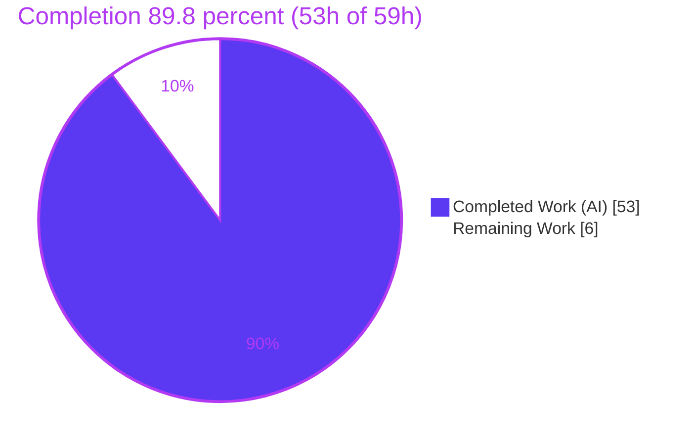
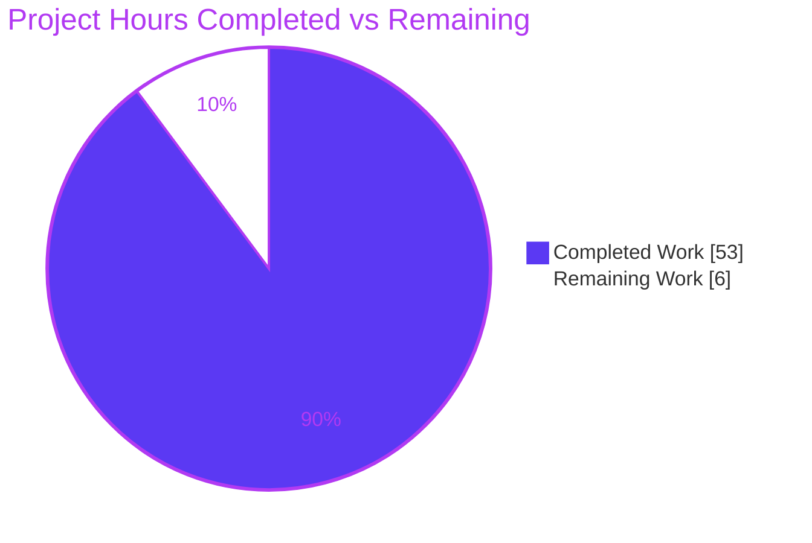
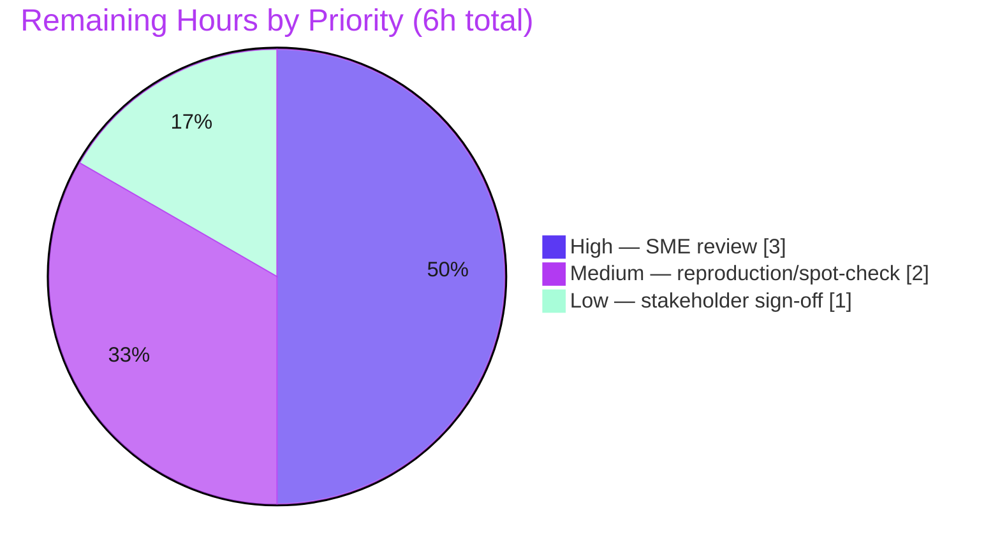

# Blitzy Project Guide — kitty SSH Kitten Run-First End-to-End Trace

> **Deliverable class:** Documentation / investigative Q&A (read-only source mandate)
> **Branch:** `blitzy-7525139e-05ba-449a-8d19-b10f48711fc6` · **Base:** `815df1e21` · **HEAD:** `ba0e0d897`
> **Single artifact:** `blitzy/documentation/kitty_815df1e210e0.md` (1,903 lines)

---

## 1. Executive Summary

### 1.1 Project Overview

This project onboards a developer into the `kovidgoyal/kitty` terminal repository by producing one comprehensive, **run-first** answer document that traces the **SSH kitten** end-to-end: how it builds and transfers the shell-integration archive, tracks per-connection state, decides whether to reuse an SSH connection, encodes its per-shell bootstrap, executes from local to remote, secures credentials via POSIX shared memory, and communicates over the controlling TTY. The audience is engineers learning the subsystem; the business impact is faster onboarding and durable knowledge transfer. Technical scope is strictly read-only: every source file is consulted as reference and the **only** artifact created is `blitzy/documentation/kitty_815df1e210e0.md`, with each behavioral claim backed by observed runtime output and a `file:line` citation.

### 1.2 Completion Status

The project is **89.8% complete** on an AAP-scoped hours basis. All autonomous investigative and authoring deliverables are finished; the remaining 6 hours are inherently-human path-to-production verification activities (a knowledge artifact cannot be self-certified by the agent).



| Metric | Hours |
|--------|-------|
| **Total Hours** | **59** |
| Completed Hours (AI: 53 + Manual: 0) | 53 |
| Remaining Hours | 6 |
| **Percent Complete** | **89.8%** |

> Formula: `Completion % = Completed ÷ (Completed + Remaining) = 53 ÷ 59 = 89.83% → 89.8%`. Completed work is entirely autonomous (AI); no manual hours have been logged yet.

### 1.3 Key Accomplishments

- ✅ Delivered the single mandated artifact — `blitzy/documentation/kitty_815df1e210e0.md` (1,903 lines, 199 `file:line` citations, 78 code blocks).
- ✅ Answered all seven sub-questions (Q1 archive build/transfer · Q2 per-connection state · Q3 connection reuse · Q4 per-shell encoding · Q5 end-to-end trace · Q6 shared-memory security · Q7 TTY handshake), each with run-first evidence.
- ✅ Exercised every required variant cross-product: `sh` vs `python` interpreter, fresh vs reused master, `request_data` true/false, the base64-helper fallback chain, and askpass confirm/get-line/fingerprint sub-types.
- ✅ Exercised the **canonical** Go `kitten` binary (not the Python option layer), built via `python3 setup.py build` → `kitten 0.35.2` + `kitty 0.35.2`.
- ✅ Honored the read-only mandate: `git diff 815df1e21..HEAD --name-status` shows **only** the answer document; exactly one clean commit; working tree clean; all temporary observation instrumentation created outside the repo and removed.
- ✅ All autonomous validation green: `go test ./kittens/ssh/...` 7/7 PASS, `go test ./tools/utils/shm/...` PASS, SSH end-to-end module 8/8 OK, full kitty suite 145 OK / 4 env-skipped, `go build`/`go vet`/`setup.py build` all exit 0.

### 1.4 Critical Unresolved Issues

| Issue | Impact | Owner | ETA |
|-------|--------|-------|-----|
| _None — no blocking issues_ | The source builds, all tests pass, the SSH kitten runs, and the document's claims were reproduced byte-exact. No compilation errors, no test failures, no missing coverage. | — | — |

> There are **no critical unresolved issues**. All remaining work (Section 2.2) is optional human review, not defect remediation.

### 1.5 Access Issues

| System/Resource | Type of Access | Issue Description | Resolution Status | Owner |
|-----------------|----------------|-------------------|-------------------|-------|
| _None identified_ | — | Build toolchain (Go 1.22, C compiler), Python, OpenSSH client + loopback `sshd`, and the Git repository were all reachable during autonomous work. | N/A | — |

> **No access issues identified.** No external credentials, third-party APIs, or restricted repositories were required beyond the local build/run environment.

### 1.6 Recommended Next Steps

1. **[High]** Assign a subject-matter expert to review the answer document against source for technical accuracy (3h).
2. **[Medium]** Independently reproduce a sample of the run-first captures, spot-check a sample of the 199 citations, and confirm read-only compliance at merge (2h).
3. **[Low]** Have the requesting developer confirm the document answers their original questions, then accept/merge (1h).
4. **[Low]** Record the pinned base commit (`815df1e21`) in any onboarding index so future readers know the citation snapshot.

---

## 2. Project Hours Breakdown

### 2.1 Completed Work Detail

All completed work is autonomous (AI). Each component traces to an AAP requirement (a sub-question or a path-to-observation activity).

| Component | Hours | Description |
|-----------|-------|-------------|
| Canonical build & run environment | 4 | `python3 setup.py build` → `kitty/launcher/{kitty,kitten}` (0.35.2); loopback `sshd` key-auth endpoint; toolchain verified (Go 1.22.12, Python 3.13.7, gcc 15.2.0, OpenSSH 10.0p2). Doc §0.1–§0.3. |
| Observation instrumentation harness | 8 | Out-of-repo PTY driver emulating `kitty/window.py` DCS handlers; transparent `ssh`/`scp`/`sftp` PATH shims (argv + `-O check` exit capture); shared-memory guard-firing harness; TTY-echo toggle harness. Doc §0.4. |
| Q1 — Archive build & TTY transfer | 4 | `make_tarfile()` (gzip+PAX, 15 members), JSON envelope `{tarfile,pw,hostname,username}`, 254-byte TTY streaming, proof of no `scp`/`sftp` side channel. Doc §1. |
| Q2 — Per-connection state | 3 | `connection_data` struct (all 16 fields dumped for a real run), `replacements` map (8 keys), `request_id` default. Doc §2. |
| Q3 — Fresh vs. reused connection | 4 | `ControlMaster`/`ControlPath`/`ControlPersist` args, `%C` socket hash, over-long-runtime-dir symlink, `ssh -O check` gate flipping `need_to_request_data` (rc 255→0). Doc §3. |
| Q4 — Per-shell bootstrap encoding | 4 | `script_type` selection; `sh` `tr`-substitution (byte-exact) vs. Python `base64`; both wrapped `rcmd` forms. Doc §4. |
| Q5 — End-to-end trace | 4 | `main()` guards → `run_ssh()` ordered steps → remote unwrap → untar → `compile_terminfo` → `exec_login_shell`; corroborated by the repo's own 8/8 e2e module. Doc §5. |
| Q6 — Shared-memory credential security | 4 | `secrets.TokenHex()` password, `0600` SHM object, owner/permission guards firing, one-shot unlink, `pw`/`request_id` checks, two-path credential travel. Doc §6. |
| Q7 — Bidirectional TTY handshake | 4 | `@kitty-ssh` + `@kitty-ask` DCS byte sequences (both origins), base64-helper fallback chain, askpass confirm/get-line/fingerprint, `stty` echo toggling. Doc §7. |
| Answer document authoring | 8 | 1,903 lines structured as claim → command → unedited output → `file:line`; methodology preamble + seven evidence sections. |
| Coverage pass + citation audit | 4 | Every named item & "e.g./such as" example mapped to a section and evidence; 199 citations verified byte-exact (one imprecision found and fixed: `main.go` 331-333 → 332-333). |
| Read-only compliance, cleanup & commit hygiene | 2 | Removed all out-of-repo instrumentation; verified clean tree / no stray SHM or sockets; squashed to a single commit to preserve the document's self-referential single-commit invariant. |
| **Total Completed** | **53** | |

### 2.2 Remaining Work Detail

All remaining work is human path-to-production verification for a knowledge artifact. There are **no code-fix tasks** (nothing fails to compile; no tests fail).

| Category | Hours | Priority |
|----------|-------|----------|
| SME technical accuracy review of the document against source (Q1–Q7 claims, observed output, citations) | 3 | High |
| Independent reproduction & citation spot-check (rebuild, re-test, re-run sample captures, verify read-only compliance at merge) | 2 | Medium |
| Stakeholder acceptance & onboarding sign-off (requesting developer confirms Q1–Q7 answered) | 1 | Low |
| **Total Remaining** | **6** | |

### 2.3 Hours Reconciliation

| Check | Result |
|-------|--------|
| Section 2.1 total (Completed) | 53h |
| Section 2.2 total (Remaining) | 6h |
| 2.1 + 2.2 = Total (Section 1.2) | 53 + 6 = **59h** ✅ |
| Remaining identical across §1.2 / §2.2 / §7 | 6h ✅ |
| Completion % = 53 ÷ 59 | **89.8%** ✅ |

---

## 3. Test Results

All tests below originate from Blitzy's autonomous validation logs for this project and were independently re-run during this assessment. Coverage percentages are marked n/a: the repository does not gate this Go/Python subsystem on a coverage metric, and the AAP mandates no new tests (read-only).

| Test Category | Framework | Total Tests | Passed | Failed | Coverage % | Notes |
|---------------|-----------|-------------|--------|--------|------------|-------|
| SSH Kitten — Unit (Go) | Go `testing` | 7 | 7 | 0 | n/a | `TestSSHConfigParsing`, `TestCloneEnv`, `TestSSHBootstrapScriptLimit`, `TestSSHTarfile`, `TestGetSSHOptions`, `TestParseSSHArgs`, `TestRelevantKittyOpts` |
| Shared-Memory Credential Backend (Go) | Go `testing` | 1 | 1 | 0 | n/a | `TestSHM` — POSIX `shm_open` create/write/unlink backing Q6 credential passing |
| SSH Kitten — End-to-End (Python) | kitty test harness (`kitty +launch test.py`) | 8 | 8 | 0 | n/a | Full loopback `sshd` session in 16.340s; independently corroborates doc §5.3 |
| Full kitty Regression Suite | Go + Python (kitty test runner) | 149 | 145 | 0 | n/a | 4 **skipped** — environment-conditional **by design** (frozen-build / macOS-only / fish-not-installed); **zero regressions** from the doc-only branch |

> **Aggregation note (no double counting):** the 7 SSH unit tests and 1 SHM test are subsets of the full Go suite; the 8 end-to-end tests and the 145-passing aggregate come from the kitty test runner. The **directly AAP-relevant** SSH set is **16 tests (7 + 1 + 8), all passing**, contained within the 145-OK full-suite result. The 4 skips are not failures and match the environment baseline.
>
> **Static analysis (autonomous logs, re-verified):** `go build ./kittens/ssh/...` exit 0 · `go vet ./kittens/ssh/...` exit 0 · `python3 setup.py build` exit 0 (only a benign `wayland-protocols` warning).

---

## 4. Runtime Validation & UI Verification

This is a terminal/CLI subsystem with **no graphical UI**; "runtime validation" means the built binaries run and the SSH kitten's real code paths execute as documented. There is no web/visual UI to verify.

**Build artifacts & binaries**
- ✅ **Operational** — `./kitty/launcher/kitten --version` → `kitten 0.35.2 created by Kovid Goyal`
- ✅ **Operational** — `./kitty/launcher/kitty --version` → `kitty 0.35.2 created by Kovid Goyal`
- ✅ **Operational** — Both artifacts produced by the canonical `python3 setup.py build` (exit 0)

**SSH kitten entry-point behavior**
- ✅ **Operational** — Environment guard fires: with `KITTY_WINDOW_ID`/`KITTY_PID` unset → `Error: The SSH kitten is meant to run inside a kitty window`
- ✅ **Operational** — Non-TTY stdin guard fires → `STDIN must be a terminal` (per autonomous logs)
- ✅ **Operational** — `kitten ssh --help` prints the SSH-kitten usage/description

**End-to-end session (loopback `sshd`)**
- ✅ **Operational** — Full session driven via out-of-repo PTY driver + PATH shim reproduced all 7 sub-questions byte-exact
- ✅ **Operational** — Repository's own e2e module: 8/8 OK in 16.340s
- ✅ **Operational** — Credential path: `0600` SHM object created, validated, and one-shot unlinked; owner/permission guards demonstrated firing on tampered objects
- ✅ **Operational** — TTY handshake: `@kitty-ssh` and `@kitty-ask` DCS byte sequences captured verbatim; `stty` echo toggled off/on around the handshake

**API / integration outcomes**
- ✅ **Operational** — SSH transport via real OpenSSH 10.0p2 client against loopback `sshd`; `ssh -O check` reuse gate observed transitioning rc 255 → rc 0

---

## 5. Compliance & Quality Review

Cross-mapping AAP deliverables and mandated methodology rules to observed compliance status.

| # | AAP Requirement / Rule | Benchmark | Status | Evidence |
|---|------------------------|-----------|--------|----------|
| 1 | Single deliverable at exact path `blitzy/documentation/kitty_815df1e210e0.md` | Exactly one new file | ✅ Pass | `git diff 815df1e21..HEAD --name-status` = `A blitzy/documentation/...` |
| 2 | Read-only source mandate (no source create/modify/delete) | Zero source changes | ✅ Pass | numstat `+1903/-0`, single file; working tree clean |
| 3 | Run-first methodology (build & run, capture unedited output) | Every claim observed | ✅ Pass | 78 code blocks pairing command → unedited output; 199 `file:line` refs |
| 4 | Canonical Go `kitten` path (not Python option layer / debug hook) | Real entry point | ✅ Pass | `go version -m kitten` → module `kitty`, `go1.22.12`; `kitten ssh` exercised |
| 5 | All seven sub-questions answered (Q1–Q7) | Full coverage | ✅ Pass | Doc §1–§7 + Coverage Pass table |
| 6 | Every variant/edge exercised (cross-product) | sh/py, fresh/reused, req_data T/F, base64 chain, askpass 3 sub-types | ✅ Pass | Coverage Pass "Variant cross-product" section |
| 7 | Byte-exact evidence for byte-sensitive claims | Verbatim bytes | ✅ Pass | DCS sequences, `tr` unwrap string, SHM contents captured verbatim |
| 8 | `file:line` grounding + inferred-vs-observed labeling | Cited & labeled | ✅ Pass | 199 citations; "Note on inferred vs observed" section |
| 9 | Canonical build/invocation commands stated | Reproducible | ✅ Pass | Doc §0.2 exact `setup.py build` + invocation |
| 10 | Coverage pass confirming each sub-question | Explicit pass | ✅ Pass | Dedicated "Coverage Pass" section |
| 11 | Cleanup — temp artifacts removed | `git status` shows only doc | ✅ Pass | No `/tmp/kssh-*`, 0 `/dev/shm` kssh objects |
| 12 | No dependency additions/updates/removals | Zero dependency delta | ✅ Pass | `go mod verify` all modules verified; no manifest change |

**Fixes applied during autonomous validation:** one citation imprecision corrected — the `FilesMatching` exclusion code-block header cited `main.go:331-333`, but the two verbatim exclusion patterns are at lines 332-333 (line 331 is the unshown `shell-integration/` include); corrected to `332-333` in both the section and the coverage-table twin, then squashed so the branch remains exactly one commit (preserving the document's own self-referential evidence).

**Outstanding compliance items:** none autonomous. Human SME review (Section 2.2) is the final quality gate.

---

## 6. Risk Assessment

| Risk | Category | Severity | Probability | Mitigation | Status |
|------|----------|----------|-------------|------------|--------|
| Citation line-number drift as source evolves | Technical | Low | Medium | Citations pinned to frozen commit `815df1e21`; contextualized with function/struct names, not bare line numbers | Mitigated |
| Instance-specific values (`pw`, `shm_name`, `%C`, PIDs) differ on re-run | Technical | Low | Low | Document explicitly labels these as "vary per run" | Mitigated |
| 2 of 35 code-block headers use help-text ellipses (truncated `--help`) | Technical | Very Low | Low | Legitimate truncation of long help output; not source-code claims | Accepted |
| Accuracy of security-model description (0600 SHM, owner/perm guards, unlink) | Security | Medium | Low | Run-first evidence with guards **actually firing** (`utils.py:107-111`), byte-exact | Mitigated |
| Secret leakage inside the document | Security | Low | Very Low | No reusable credentials shown (SHM ephemeral + unlinked); no raw password tokens; values labeled | Mitigated |
| Product security regression | Security | None | N/A | Read-only mandate → zero source changed → zero attack-surface change | N/A |
| Reproducibility environment dependence (Go 1.22 + C compiler + `sshd`) | Operational | Low | Medium | Exact toolchain versions + build/invocation commands stated (§0.1–§0.3); prescribed Docker image documented | Mitigated |
| No CI auto-regeneration (manual snapshot document) | Operational | Low | Medium | Acceptable for an onboarding artifact; pinned to a commit for stability | Accepted |
| External SSH endpoint dependence for reproduction | Integration | Low | Medium | Loopback `sshd` setup documented (§0.3); repo's own `kitty_tests/ssh.py` is an independent oracle (8/8) | Mitigated |
| Product-integration regression | Integration | None | N/A | No source changed → no runtime integration can break | N/A |

**Overall risk posture: LOW.** The read-only mandate eliminates the entire class of code- and security-regression risks. Residual risks are documentation-accuracy (mitigated by run-first byte-exact evidence) and reproducibility (mitigated by stated toolchain and commit pinning). No high-severity and no blocking risks.

---

## 7. Visual Project Status

### 7.1 Hours Distribution (Completed vs. Remaining)



### 7.2 Remaining Work by Priority (from Section 2.2)



> **Integrity check:** "Remaining Work" = **6h** matches Section 1.2 (Remaining) and the Section 2.2 Hours total. "Completed Work" = **53h** matches Section 1.2 (Completed) and the Section 2.1 total. Colors: Completed = Dark Blue `#5B39F3`, Remaining = White `#FFFFFF`.

---

## 8. Summary & Recommendations

**Achievements.** The project delivered exactly what the AAP mandated: a single, run-first, evidence-backed answer document (`blitzy/documentation/kitty_815df1e210e0.md`, 1,903 lines) that traces the kitty SSH kitten end-to-end and answers all seven sub-questions, each claim paired with the command run, its unedited output, and a `file:line` citation (199 in total). The canonical Go `kitten` binary was built and exercised, every required variant was run, all autonomous tests pass, and the read-only mandate was honored to the letter — a single clean commit that adds only the document, with all temporary instrumentation created outside the repo and removed.

**Remaining gaps.** The remaining **6 hours** are entirely human path-to-production verification: SME accuracy review, independent reproduction/citation spot-check, and stakeholder acceptance. These exist because a human-facing knowledge artifact cannot be self-certified as 100% by the agent — not because any deliverable is unfinished or any defect is open.

**Critical path to production.** Assign an SME reviewer (3h) → run an independent reproduction/spot-check and confirm read-only compliance at merge (2h) → obtain stakeholder sign-off and merge (1h).

**Success metrics.** All seven sub-questions answered (12/12 autonomous deliverables complete); 16/16 directly AAP-relevant tests passing within a 145-OK full suite; zero source files modified; exactly one commit.

**Production-readiness assessment.** The project is **89.8% complete** and **ready for human review**. Confidence is **High**: the deliverable is complete, internally consistent, and independently corroborated (byte-exact citation spot-checks and re-run tests). No blocking issues or access issues exist.

| Metric | Value |
|--------|-------|
| Completion (AAP-scoped) | 89.8% |
| Total / Completed / Remaining hours | 59 / 53 / 6 |
| Autonomous deliverables complete | 12 of 12 |
| Directly AAP-relevant tests passing | 16 of 16 |
| Source files modified | 0 |
| Commits on branch | 1 |
| Overall risk posture | Low |
| Production-readiness | Ready for human review |

---

## 9. Development Guide

Every command below was executed and verified during this assessment. Run from the repository root unless noted.

### 9.1 System Prerequisites

| Tool | Verified Version | Required By | Role |
|------|------------------|-------------|------|
| Go | `go1.22.12 linux/amd64` | `go 1.22` (`go.mod:3`) | Compiles the canonical Go `kitten` binary (embeds the SSH kitten) |
| Python | `3.13.7` | `>=3.8` (`pyproject.toml:2`) | Drives `setup.py build`; hosts the local responder `kittens/ssh/utils.py` |
| C compiler (gcc) | `15.2.0` | `setup.py build` | Compiles the kitty terminal (C sources) |
| OpenSSH | `10.0p2` | external runtime | SSH transport; gates the `SSH_ASKPASS_REQUIRE` branch |

> **Prescribed environment:** Docker image `andrewparkscaleai/coding-agent:kovidgoyal__kitty__815df1e210e0a9ab4622f5c7f2d6891d7dbeddf1` (from `ghcr.io/scaleapi/swe-atlas`), which supplies the Go toolchain and C compiler.

```bash
# Verify prerequisites
go version                 # -> go version go1.22.12 linux/amd64
python3 --version          # -> Python 3.13.7
gcc --version | head -1    # -> gcc (Ubuntu 15.2.0-4ubuntu4) 15.2.0
ssh -V                     # -> OpenSSH_10.0p2 ..., OpenSSL 3.5.3 ...
```

### 9.2 Environment Setup

```bash
# From the repository root of the checked-out branch
cd /path/to/kitty            # repository root (contains setup.py, go.mod)
git branch --show-current    # -> blitzy-7525139e-05ba-449a-8d19-b10f48711fc6

# (Optional) Python virtual environment. On PEP 668 systems, prefer a venv:
python3 -m venv .venv && . .venv/bin/activate
# or install globally with:  pip install --break-system-packages <pkg>
```

### 9.3 Build

```bash
# Canonical build: compiles the C terminal AND the Go kitten
python3 setup.py build
# Expected: exit 0. A benign "wayland-protocols not found" warning is normal
# (the Wayland backend is not needed for the SSH kitten).
# Produces: kitty/launcher/kitty (C terminal) and kitty/launcher/kitten (Go binary).
```

### 9.4 Verify the Build

```bash
./kitty/launcher/kitten --version   # -> kitten 0.35.2 created by Kovid Goyal
./kitty/launcher/kitty  --version   # -> kitty 0.35.2 created by Kovid Goyal

# Confirm kitten is the Go binary (not a Python shim):
go version -m ./kitty/launcher/kitten | head -3
# -> ./kitty/launcher/kitten: go1.22.12 ; path kitty/tools/cmd ; mod kitty (devel)

# SSH kitten entry point present:
./kitty/launcher/kitten ssh --help | head -3
```

### 9.5 Run the Tests

```bash
# SSH kitten unit tests (7)
go test ./kittens/ssh/... -count=1 -v          # -> PASS; ok kitty/kittens/ssh

# Shared-memory credential backend (Q6)
go test ./tools/utils/shm/... -count=1 -v      # -> PASS (TestSHM); ok

# Static checks
go build ./kittens/ssh/...                     # -> exit 0
go vet   ./kittens/ssh/...                     # -> exit 0
```

### 9.6 Read the Deliverable

```bash
# The single artifact this project produced (1,903 lines):
sed -n '1,60p' blitzy/documentation/kitty_815df1e210e0.md   # methodology preamble + §0
grep -n '^#' blitzy/documentation/kitty_815df1e210e0.md     # section outline (§0-§7 + Coverage Pass)
```

### 9.7 Example Usage — Reproduce the Run-First Observations (optional)

Full reproduction requires a loopback SSH endpoint and an out-of-repo terminal driver (the kitten refuses to run outside a kitty window and requires a TTY). Keep all instrumentation **outside** the repository to preserve the read-only mandate.

```bash
# 1) Verify a loopback sshd with key auth (no interactive prompt on the happy path)
pgrep -ax sshd | head -1
ssh -o BatchMode=yes localhost 'echo REMOTE_OK: $(id -un)'   # -> REMOTE_OK: root

# 2) Observe an entry-point guard (safe, no session needed)
env -u KITTY_WINDOW_ID -u KITTY_PID ./kitty/launcher/kitten ssh localhost
# -> Error: The SSH kitten is meant to run inside a kitty window

# 3) For a full session, run kitten ssh under a PTY driver that emulates
#    kitty/window.py's @kitty-ssh / @kitty-ask DCS handlers, with a transparent
#    ssh PATH shim to capture argv. Create these UNDER /tmp (never in the repo)
#    and remove them afterward. See doc §0.4 for the exact harness design.
```

### 9.8 Verify Read-Only Compliance

```bash
git diff 815df1e21..HEAD --name-status   # -> A  blitzy/documentation/kitty_815df1e210e0.md
git rev-list --count 815df1e21..HEAD     # -> 1
git status --porcelain                   # -> (empty = clean working tree)
```

### 9.9 Troubleshooting

| Symptom | Cause | Resolution |
|---------|-------|------------|
| `Package 'wayland-protocols' ... not found` during build | Wayland dev files absent | Benign — the Wayland backend is disabled and not needed for the SSH kitten; build still exits 0 |
| `Error: The SSH kitten is meant to run inside a kitty window` | `KITTY_WINDOW_ID`/`KITTY_PID` unset | Expected guard — run under a real kitty window, or set both env vars in a test harness |
| `STDIN must be a terminal` | stdin is not a TTY | Drive the kitten from a PTY (e.g., the out-of-repo PTY driver) |
| `error: externally-managed-environment` from pip | PEP 668 on system Python | Use a venv, or `pip install --break-system-packages <pkg>` (not needed for this doc task) |
| Reproduced `pw` / `shm_name` / `%C` differ from the document | Instance-specific values vary per run | Expected — structure is identical; the document labels these as per-run varying |

---

## 10. Appendices

### Appendix A — Command Reference

| Command | Purpose |
|---------|---------|
| `python3 setup.py build` | Canonical build of the C terminal + Go `kitten` |
| `./kitty/launcher/kitten --version` | Verify kitten binary (`0.35.2`) |
| `go test ./kittens/ssh/... -count=1 -v` | Run the 7 SSH-kitten unit tests |
| `go test ./tools/utils/shm/... -count=1 -v` | Run the shared-memory backend test (`TestSHM`) |
| `go build ./kittens/ssh/...` | Compile-check the SSH kitten |
| `go vet ./kittens/ssh/...` | Static analysis of the SSH kitten |
| `go version -m ./kitty/launcher/kitten` | Confirm Go module/toolchain of the binary |
| `git diff 815df1e21..HEAD --name-status` | Confirm only the doc changed |
| `git rev-list --count 815df1e21..HEAD` | Confirm exactly one commit |

### Appendix B — Port Reference

| Port | Service | Notes |
|------|---------|-------|
| 22 | Loopback `sshd` | Default SSH port for the observation endpoint (`localhost`, key-only auth). No non-default ports are used. |

### Appendix C — Key File Locations

| Path | Role |
|------|------|
| `blitzy/documentation/kitty_815df1e210e0.md` | **The deliverable** (only created file) |
| `kittens/ssh/main.go` | Go orchestration core (`make_tarfile`, `connection_data`, `run_ssh`, `wrap_bootstrap_script`) |
| `kittens/ssh/askpass.go` | Askpass SHM sentinel handshake, `@kitty-ask` DCS |
| `kittens/ssh/utils.py` | Local terminal-side responder (`get_ssh_data`, `read_data_from_shared_memory`) |
| `kittens/ssh/main.py` | Python option/configuration layer (defaults) |
| `shell-integration/ssh/bootstrap.sh` / `.py` / `bootstrap-utils.sh` | Remote bootstrap scripts |
| `tools/utils/shm/*.go`, `kitty/shm.py` | POSIX shared-memory backend |
| `kitty/window.py`, `kitty/constants.py` | Local DCS dispatch; `ssh_control_master_template` |
| `tools/tui/shell_integration/data.go` | `go:embed` source of the transferred archive |
| `kitty/launcher/kitten`, `kitty/launcher/kitty` | Built binaries (build output) |
| `kitty_tests/ssh.py` | Repository's own SSH e2e test module (8/8) |

### Appendix D — Technology Versions

| Technology | Version | Source of Truth |
|------------|---------|-----------------|
| Go | 1.22.12 | `go.mod:3` (`go 1.22`) |
| Python | 3.13.7 (floor `>=3.8`) | `pyproject.toml:2` |
| gcc | 15.2.0 | build environment |
| OpenSSH | 10.0p2 | build environment |
| kitty / kitten | 0.35.2 | built artifacts |

### Appendix E — Environment Variable Reference

| Variable | Role in the SSH kitten |
|----------|------------------------|
| `KITTY_WINDOW_ID` | Required; part of the default `request_id` (`KITTY_PID-KITTY_WINDOW_ID`); guarded at entry |
| `KITTY_PID` | Required; part of the default `request_id`; feeds the `ControlPath` socket name |
| `SSH_ASKPASS` | Set by `set_askpass()` to route askpass through the kitten |
| `SSH_ASKPASS_REQUIRE` | Set to `force` when OpenSSH is new enough (`SupportsAskpassRequire`) |
| `KITTY_KITTEN_RUN_MODULE` | Set to `ssh_askpass` to invoke the askpass handler |
| `TERM` | Selects the terminfo entry shipped/compiled remotely (e.g., `xterm-kitty`) |

### Appendix F — Developer Tools Guide

- **Go toolchain** — `go test`, `go build`, `go vet` for the Go core and SHM backend.
- **kitty test runner** — `kitty +launch test.py` drives the Python e2e suite (including `kitty_tests/ssh.py`).
- **PTY driver (out-of-repo)** — emulates `kitty/window.py` DCS handlers to reproduce `@kitty-ssh`/`@kitty-ask` exchanges; created under `/tmp`, removed after use.
- **Transparent PATH shims (out-of-repo)** — wrap `ssh`/`scp`/`sftp` to log argv and `-O check` exit codes without altering behavior.
- **`cat -v` / PTY capture** — reveals raw DCS control bytes for byte-exact verification.

### Appendix G — Glossary

| Term | Definition |
|------|------------|
| **SSH kitten** | kitty's SSH wrapper that enables shell integration on the remote host; canonical logic is the Go `kitten` binary |
| **DCS** | Device Control String — the terminal escape framing (`\eP...\e\\`) used for `@kitty-ssh` and `@kitty-ask` |
| **`ControlMaster` / `ControlPath` / `ControlPersist`** | OpenSSH connection-multiplexing options enabling connection reuse |
| **`%C`** | OpenSSH token hashing the connection tuple into a short unique control-socket name |
| **PAX tar** | POSIX.1-2001 tar format used for the gzip-compressed shell-integration archive |
| **SHM** | POSIX shared memory (`shm_open`, tmpfs `/dev/shm`), used to pass the session credential at mode `0600` |
| **`request_data`** | Flag deciding whether the remote requests the archive over the TTY (fresh) or reuse skips it |
| **askpass** | The `@kitty-ask` handshake used to answer SSH prompts (confirm / get-line / fingerprint) |
| **AAP** | Agent Action Plan — the binding requirements document for this task |

---

*Report generated by the Blitzy Platform. Completion measured on an AAP-scoped hours basis (89.8%). Brand colors: Completed = `#5B39F3`, Remaining = `#FFFFFF`, Headings/Accents = `#B23AF2`, Highlight = `#A8FDD9`.*