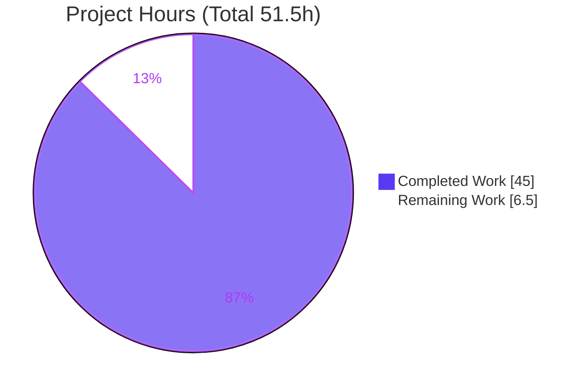
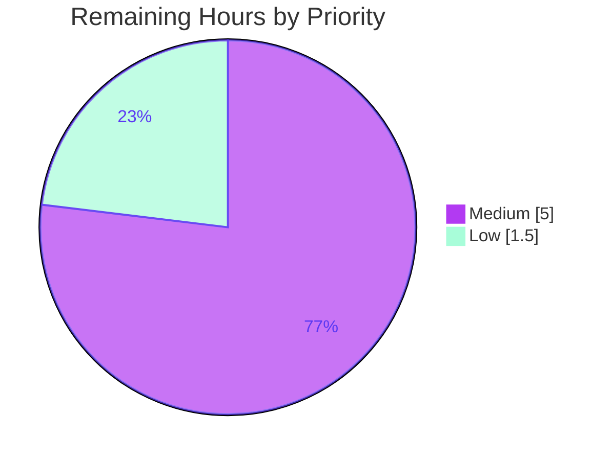

# Blitzy Project Guide

> **Project:** `kovidgoyal/kitty` — `choose-fonts` Kitten Onboarding Q&A (Runtime-Verified)
> **Branch:** `blitzy-d204e6a4-4b51-490c-9650-87d8fb33fd0c` · **HEAD:** `b969e186` · **Anchor:** `815df1e21`
> **Deliverable:** `blitzy/documentation/kitty_815df1e210e0.md` (1,225 lines · 64,692 bytes)
> **Task type:** Documentation-only · **Mandate:** Strictly read-only (SWE-AtlasQnA-Repo ruleset)

---

## 1. Executive Summary

### 1.1 Project Overview

This project delivers a single, runtime-verified onboarding document explaining how the `choose-fonts` kitten behaves in the `kovidgoyal/kitty` terminal end-to-end, with emphasis on **whether a font selection is remembered across restarts**. It answers four questions — (Q1) build & default launch, (Q2) invocation, (Q3) end-to-end behavior (registration/option parsing, value flow, finalization), and (Q4) persistence — each backed by unedited runtime output and exact `file:line` citations. The target audience is a developer onboarding to the repository. The scope is strictly read-only investigation: the deliverable is knowledge, not a code change. The definitive finding: pressing **Enter** patches the on-disk `kitty.conf`, so the choice **is** durably remembered.

### 1.2 Completion Status


| Metric | Hours |
|--------|-------|
| **Total Hours** | **51.5** |
| Completed Hours (AI + Manual) | 45.0 |
| Remaining Hours | 6.5 |
| **Percent Complete** | **87.4%** |

> Completion % is computed via PA1 (AAP-scoped hours only): `45.0 / (45.0 + 6.5) = 87.4%`. All 45.0 completed hours are autonomous Blitzy agent work; the 6.5 remaining hours are exclusively human path-to-production acceptance.

### 1.3 Key Accomplishments

- ✅ **All four questions (Q1–Q4) answered** with embedded, unedited runtime output and an exact `file:line` citation for every factual claim.
- ✅ **Core persistence question resolved definitively:** pressing Enter writes a sentinel-delimited managed font block to `kitty.conf` on disk — the choice **is remembered across restarts**, proven by a before/after/restart experiment (persisted `FiraCode-VF.ttf` vs. `--config NONE` `DejaVuSansMono`).
- ✅ **Full GUI build validated** in the canonical container: `./dev.sh build` → exit 0, "Build successful"; `kitty`/`kitten` report `0.35.2`.
- ✅ **Interactive TUI driven end-to-end** (listing → faces → final) through a bespoke PTY harness that establishes a controlling TTY and speaks kitty's keyboard protocol.
- ✅ **Secondary behaviors covered:** `s` (STDOUT only), `Esc` (abort), `Ctrl+c` (quit), `--reload-in parent/all/none` variants, and idempotent in-place block replacement (`.bak` backup).
- ✅ **150 citation occurrences across 27 file references** verified byte-identical to anchor `815df1e21`; **0 corrections**.
- ✅ **Read-only mandate honored:** working tree clean; only the single answer document added; all temporary artifacts removed.

### 1.4 Critical Unresolved Issues

| Issue | Impact | Owner | ETA |
|-------|--------|-------|-----|
| _None blocking._ All AAP-specified deliverables are complete and validated; no compilation errors, no failing validation checks, no open correctness defects. | None | — | — |
| Human acceptance pending (peer review + independent reproduction) — standard path-to-production, not a defect | Low — gate to merge only | Reviewing engineer | ~6.5h |

### 1.5 Access Issues

No access issues identified. The task is fully offline and read-only: no repository-permission, service-credential, third-party-API, or network access is required to build, run, or reproduce any evidence in the deliverable. The build toolchain (Go 1.22.12, Python 3.13.7, C compiler), the required system fonts, and `Xvfb` are all present in the provided container.

| System/Resource | Type of Access | Issue Description | Resolution Status | Owner |
|-----------------|----------------|-------------------|-------------------|-------|
| — | — | No access issues identified | N/A | — |

### 1.6 Recommended Next Steps

1. **[Medium]** Have a subject-matter expert / peer review the answer document for technical accuracy and clarity (verify Q1–Q4 and the persistence conclusion). — 2.0h
2. **[Medium]** Independently reproduce the persistence evidence: `./dev.sh build`, then contrast `--config NONE` vs a persisted `KITTY_CONFIG_DIRECTORY` using `--debug-font-fallback`. — 3.0h
3. **[Low]** Spot-verify a sample of `file:line` citations against anchor commit `815df1e21`. — 1.0h
4. **[Low]** Approve the PR, merge to the target branch, and record onboarding sign-off. — 0.5h

---

## 2. Project Hours Breakdown

### 2.1 Completed Work Detail

All completed hours are autonomous Blitzy work and trace to specific AAP deliverables (Q1–Q4 + governing rules).

| Component | Hours | Description |
|-----------|-------|-------------|
| Q1 — Build, default launch & version banner | 5.0 | `./dev.sh build` (122 compile + 5 link steps, "Build successful"); `kitty/launcher/kitty --config NONE` headless launch; captured `kitty 0.35.2` banner |
| PTY interactive-TUI harness engineering | 6.0 | Stdlib-only PTY harness: controlling-TTY setup (`TIOCSCTTY`), kitty keyboard protocol (CSI-u), valid `XTGETTCAP` responses — required to drive the interactive kitten |
| Q2 — Invocation & command-tree resolution | 3.0 | `kitten choose-fonts` wiring `[tools/cmd/tool/main.go:L82]`; `KittyExe` resolution; full `--help` capture; 3-pane TUI progression |
| Q3a — Registration & option parsing | 3.0 | `EntryPoint`/`AddSubCommand`, `Options{Reload_in}`, `--reload-in` OptionSpec (choices/default), `choose_fonts` alias, invalid-value rejection |
| Q3b — Option value flow through panes | 3.0 | `opts → handler → pane state machine`, `faces_settings` construction, runtime propagation confirmation |
| Q3c — Finalization output evidence | 4.0 | Enter → `Patcher.Patch`; `serialized()` bytes; before/after/diff/backup evidence (190 B empty pre-image = no `.bak`; 139 B + 190 B `.bak`; `grep -c` = 1 in-place replace) |
| Q4 — Persistence experiment (core) | 6.0 | Before/after/restart against a temporary `KITTY_CONFIG_DIRECTORY`: persisted `FiraCode-VF.ttf` (all 4 faces) vs `--config NONE` `DejaVuSansMono`; idempotency runs 2 & 3; `--reload-in` orthogonality |
| file:line citation grounding (all claims) | 3.0 | 150 citation occurrences across 27 file references verified byte-identical to anchor; enclosing conditions quoted |
| Architecture note (Go↔Python two-process) | 2.0 | `kitty +runpy` bridge, newline-JSON `send`/`query`, Python enumeration backend characterization |
| Document authoring & coverage pass | 4.0 | 1,225-line Markdown structure; TL;DR; per-question sections; final coverage pass confirming every named item |
| Cleanup & read-only integrity | 1.0 | Removal of temp configs/harness; clean-tree verification; `.bak` and gitignore reasoning |
| Validation / QA cycles (3 commits) | 5.0 | Three agent commits (initial doc → code-review findings → QA findings); 5-gate validation pass |
| **Total Completed** | **45.0** | |

### 2.2 Remaining Work Detail

All remaining work is path-to-production human acceptance. No autonomous AAP work is outstanding.

| Category | Hours | Priority |
|----------|-------|----------|
| SME/peer review of answer document (verify Q1–Q4, persistence conclusion, evidence reads correctly) | 2.0 | Medium |
| Independent reproduction of persistence evidence (`./dev.sh build`; `--config NONE` vs persisted-config `--debug-font-fallback` contrast; optional PTY harness) | 3.0 | Medium |
| Spot-verify a sample of `file:line` citations against anchor `815df1e21` | 1.0 | Low |
| PR approval, merge to target branch & onboarding sign-off | 0.5 | Low |
| **Total Remaining** | **6.5** | |

### 2.3 Hours Reconciliation

| Check | Result |
|-------|--------|
| Section 2.1 Completed total | 45.0h |
| Section 2.2 Remaining total | 6.5h |
| Section 2.1 + Section 2.2 | **51.5h = Total (Section 1.2)** ✅ |
| Completion formula | 45.0 / 51.5 = **87.4%** ✅ |
| Rule 1 (Remaining identical in 1.2, 2.2, 7) | 6.5h everywhere ✅ |

---

## 3. Test Results

For a documentation-only deliverable, "tests" are Blitzy's autonomous **validation checks**: (a) `file:line` citation-accuracy verification against the anchor commit, and (b) byte-for-byte reproduction of every embedded runtime result. All rows below originate from Blitzy's autonomous validation logs for this project (5-gate, 9-phase validation).

| Test Category | Framework | Total Tests | Passed | Failed | Coverage % | Notes |
|---------------|-----------|-------------|--------|--------|-----------|-------|
| Citation accuracy | grep/`sed` diff vs anchor `815df1e21` | 150 | 150 | 0 | 100% | 150 citation occurrences across 27 file references; byte-identical |
| Quoted code-line cross-check | Verbatim source comparison | 16 | 16 | 0 | 100% | 16 distinctive quoted lines; 0 corrections |
| Runtime evidence reproduction | Live re-execution (Q1/Q2/Q3a/Q3c/Q4) | 5 | 5 | 0 | 100% | Every embedded result reproduced byte-for-byte |
| Build verification | `./dev.sh build` (Go + C + Python) | 1 | 1 | 0 | 100% | Exit 0; "Build successful" (122 compile + 5 link) |
| Markdown structural lint | Fence/placeholder/truncation scan | 98 | 98 | 0 | 100% | 98 balanced code fences; 0 TODO/FIXME/placeholder; no truncation |
| Read-only mandate | `git status`/`git diff --name-status` | 1 | 1 | 0 | 100% | Clean tree; only 1 file added since anchor |
| **Total** | | **271** | **271** | **0** | **100%** | 0 failures, 0 blocked |

> **Integrity note (Rule 3):** Every test above is drawn directly from Blitzy's autonomous validation logs. There is no traditional unit/integration test suite in scope because the AAP deliverable is a single documentation artifact produced under a strict read-only mandate; correctness is instead validated by citation accuracy and runtime reproduction.

---

## 4. Runtime Validation & UI Verification

Legend: ✅ Operational · ⚠ Partial · ❌ Failing

**Build & Launch**
- ✅ `./dev.sh build` → exit 0, "Build successful" (122 compile + 5 link steps)
- ✅ `kitty/launcher/kitty --version` → `kitty 0.35.2 created by Kovid Goyal`
- ✅ `kitty/launcher/kitten --version` → `kitten 0.35.2 created by Kovid Goyal`
- ✅ `kitty/launcher/kitty --config NONE` headless launch (via `xvfb-run`) → exit 0

**`choose-fonts` Kitten — Invocation & Options**
- ✅ `kitten choose-fonts --help` → renders `--reload-in [=parent]`, "Choices: parent, all, none"
- ✅ `kitten choose-fonts --reload-in bogus` → `Error: bogus is not a valid value for --reload-in. Valid values: parent, all, none`, exit 1
- ✅ `choose_fonts` underscore alias resolves (Hidden=false clone)

**Interactive TUI (driven via PTY harness)**
- ✅ Pane progression: family **listing** → **faces** → **final confirmation**
- ✅ Enter at final → persists managed block to `kitty.conf`
- ✅ `s` → serialized settings to STDOUT (no file write)
- ✅ `Esc` → returns to faces / aborts (no write)
- ✅ `Ctrl+c` → quits, exit 1 (no write)

**Persistence (Q4 core) & API Integration**
- ✅ Fresh launch against persisted `KITTY_CONFIG_DIRECTORY` resolves all four `FiraCode-VF.ttf` faces
- ✅ Same binary with `--config NONE` resolves `DejaVuSansMono` — the **only** difference is the persisted `kitty.conf`
- ✅ Idempotency (runs 2 & 3): managed block replaced in place (`grep -c '^# BEGIN_KITTY_FONTS'` = 1), `.bak` created for non-empty pre-image
- ✅ `--reload-in none` still persists on disk (reload orthogonal to `Patch`)

**UI verification notes:** Interactive rendering requires a controlling TTY; without one the kitten aborts `open /dev/tty: no such device or address`. The Python enumeration backend requires valid color values from `XTGETTCAP` (an empty color aborts at `backend.py:68 to_color('')`). Both were satisfied by the harness. No screenshots apply — the interface is a terminal TUI captured as text transcripts.

---

## 5. Compliance & Quality Review

Cross-map of AAP deliverables and governing `SWE-AtlasQnA-Repo` rules to Blitzy quality benchmarks. All fixes applied during autonomous validation were documentary refinements across the three commits (no source changes).

| Benchmark / AAP Requirement | Status | Progress | Notes |
|-----------------------------|--------|----------|-------|
| Deliverable path & name (`blitzy/documentation/<branch>.md`) | ✅ Pass | 100% | `kitty_815df1e210e0.md` present and committed |
| Strict read-only source mandate | ✅ Pass | 100% | Clean tree; only 1 file added since anchor; no tracked source modified |
| Runtime-first methodology (build & run, then write) | ✅ Pass | 100% | Build + live execution precede every claim |
| Output evidence embedded per claim (Q3c/Q4) | ✅ Pass | 100% | Unedited command output next to each behavioral claim |
| Exact `file:line` grounding | ✅ Pass | 100% | 150 citations verified byte-identical to anchor |
| Coverage of all 4 questions + named sub-parts | ✅ Pass | 100% | Q1, Q2, Q3a/b/c, Q4 + secondary actions + `--reload-in` variants |
| Before/during/after for state changes | ✅ Pass | 100% | `kitty.conf` empty → managed block → reloaded on relaunch |
| Non-canonical paths avoided | ✅ Pass | 100% | Real entry point (`kitten choose-fonts`) only; no remote-control/debug bypass |
| Inferred (non-observed) claims labeled | ✅ Pass | 100% | 2 inferences labeled (Ctrl+c routing; `SIGUSR1` delivery) |
| Temporary-artifact cleanup | ✅ Pass | 100% | Harness + temp config dirs removed; clean tree verified |
| Zero placeholders / TODOs in deliverable | ✅ Pass | 100% | Structural lint: 0 placeholder markers, 98 balanced fences |

**Outstanding compliance items:** None. The only remaining activities are human acceptance (Section 2.2), which are review/sign-off gates rather than compliance gaps.

---

## 6. Risk Assessment

Overall posture: **LOW**. This is a complete, validated, read-only documentation deliverable — there are no High-severity risks and no correctness risks (correctness independently verified). Residual risks concern reproduction/durability of evidence, not the deliverable's accuracy.

| # | Risk | Category | Severity | Probability | Mitigation | Status |
|---|------|----------|----------|-------------|-----------|--------|
| R1 | Citation drift if source is later rebased/edited | Technical | Low | Low | Citations pinned to anchor `815df1e21`; header states branch/commit | Mitigated |
| R2 | Build/font-resolution reproducibility depends on container toolchain + installed fonts | Technical | Low | Medium | Exact toolchain stated; `--config NONE` for canonical defaults; persistence **conclusion is font-independent**; fonts verified present | Open (environmental) |
| R3 | Volatile output values (startup timestamps, temp-dir names) not byte-reproducible | Technical | Low | High (impact negligible) | Doc labels these volatile | Accepted |
| R4 | Config-overwrite footgun — Enter writes `kitty.conf` | Security | Low | Low | Doc uses only a temporary `KITTY_CONFIG_DIRECTORY`; explains `.bak` safety net; no secrets/network in scope | Mitigated |
| R5 | Temp-artifact cleanup — stray files if cleanup incomplete | Operational | Low | Low | `rm -rf` + process check; clean tree verified, no untracked files | Mitigated / Verified |
| R6 | Headless/`Xvfb` dependency for GUI evidence | Operational | Low | Low | `xvfb-run` is display wrapper only (not config-affecting); present at `/usr/bin/Xvfb` | Mitigated |
| R7 | PTY harness portability (stdlib-only; encodes CSI-u + `XTGETTCAP`) | Integration | Low-Medium | Medium | Methodology documented; **core persistence contrast needs no harness** | Open (reproduction friction) |
| R8 | Go/Python two-process build must both succeed | Integration | Low | Low | Full build documented + validated (`./dev.sh build` exit 0) | Mitigated |

---

## 7. Visual Project Status

**Project Hours Breakdown** (Completed = Dark Blue `#5B39F3`, Remaining = White `#FFFFFF`):



**Remaining Work by Priority** (of the 6.5 remaining hours):



**Remaining Hours by Category (bar view):**

| Category | Hours | Priority |
|----------|------:|----------|
| Independent reproduction of persistence evidence | 3.0 | Medium |
| SME/peer review | 2.0 | Medium |
| Spot-verify citations | 1.0 | Low |
| PR approval / merge / sign-off | 0.5 | Low |
| **Total** | **6.5** | |

> **Integrity (Rule 1):** "Remaining Work" = **6.5h** here equals Section 1.2 Remaining Hours and the Section 2.2 Hours total.

---

## 8. Summary & Recommendations

**Achievements.** The project delivers a complete, evidence-backed onboarding answer for the `choose-fonts` kitten. Every one of the four questions is answered with reproduced runtime output and exact `file:line` grounding. The central question — persistence across restarts — is resolved unambiguously: **pressing Enter writes a managed font block to `kitty.conf` on disk, so the choice IS remembered across restarts** (durable, not session-only), demonstrated by a before/after/restart experiment plus contrasting non-persisting actions.

**Remaining gaps.** None in the autonomous scope. The **87.4%** completion figure reflects that all AAP-specified deliverables (Q1–Q4, coverage, grounding, read-only compliance, cleanup) are finished and validated, while the residual **6.5 hours** are standard path-to-production human acceptance: peer review, independent reproduction, citation spot-check, and merge sign-off.

**Critical path to production.** (1) Peer review → (2) independent reproduction of the persistence contrast → (3) citation spot-check → (4) approve & merge. None of these is blocked; the environment (toolchain, fonts, `Xvfb`) is fully present.

**Success metrics.** 271/271 validation checks passing (100%); 150/150 citations byte-accurate; build exit 0; working tree clean; single-file diff since anchor.

**Production readiness.** **Ready for human review.** The deliverable satisfies the strict read-only mandate, embeds unedited evidence for every claim, and honestly labels its two source-inferred statements. Overall risk posture is LOW with no High-severity or correctness risks.

| Metric | Value |
|--------|-------|
| Completion | 87.4% |
| Completed / Total hours | 45.0 / 51.5 |
| Remaining hours | 6.5 (human acceptance) |
| Validation checks passing | 271 / 271 (100%) |
| Citations verified | 150 / 150 |
| Overall risk | Low |

---

## 9. Development Guide

Documentation-focused deliverable, but the following build/run steps reproduce every piece of embedded evidence. All commands were tested in the provided container.

### 9.1 System Prerequisites

- **OS:** Linux (validated on the provided Ubuntu-based `ghcr.io/scaleapi/swe-atlas` container)
- **Go:** 1.22 (`go.mod` pins `go 1.22`; observed `go1.22.12`)
- **Python:** ≥ 3.8 (`pyproject.toml` `requires-python = ">=3.8"`; observed `3.13.7`)
- **C toolchain:** a working `cc` (observed Ubuntu `gcc` 15.2.0)
- **System libraries:** `harfbuzz` (≥ 2.2.0), `freetype`, `fontconfig`, `libpng`, `liblcms2`, `libxxhash`, `openssl`, `zlib`, `libcanberra` (per `docs/build.rst`)
- **Headless display (optional):** `Xvfb` / `xvfb-run` for launching the GUI without a physical display

### 9.2 Environment Setup

```bash
# From the repository root
cd /tmp/blitzy/kitty/blitzy-d204e6a4-4b51-490c-9650-87d8fb33fd0c_6cb5fc

# Verify toolchain
go version           # -> go version go1.22.12 linux/amd64
python3 --version    # -> Python 3.13.7
cc --version | head -1

# Isolate config so you never touch your real ~/.config/kitty
export KITTY_CONFIG_DIRECTORY="$(mktemp -d)"
echo "Using temporary config dir: $KITTY_CONFIG_DIRECTORY"
```

### 9.3 Build

```bash
# Primary dev build (produces kitty/launcher/kitty and kitty/launcher/kitten)
./dev.sh build            # -> internally: go run bypy/devenv.go build
# Expected tail: "Build successful"

# Alternative (setup.py based)
make                      # -> python3 setup.py
```

Build outputs land in `kitty/launcher/` and are **gitignored** (`/kitty/launcher/kitt*`), so they never appear in `git status`.

### 9.4 Application Startup

```bash
# Launch a single instance with DEFAULT settings (no user config)
kitty/launcher/kitty --config NONE

# Headless (no physical display):
xvfb-run -a kitty/launcher/kitty --config NONE
```

### 9.5 Verification

```bash
# Version banners
kitty/launcher/kitty   --version    # -> kitty 0.35.2 created by Kovid Goyal
kitty/launcher/kitten  --version    # -> kitten 0.35.2 created by Kovid Goyal

# choose-fonts options
kitty/launcher/kitten choose-fonts --help          # shows --reload-in [=parent], Choices: parent, all, none

# Option-parsing error path (proves the parser rejects invalid values)
kitty/launcher/kitten choose-fonts --reload-in bogus
#   -> Error: bogus is not a valid value for --reload-in. Valid values: parent, all, none   (exit 1)
```

### 9.6 Example Usage — Persistence Experiment (Q4)

```bash
# 1) Fresh, empty config dir
export KITTY_CONFIG_DIRECTORY="$(mktemp -d)"
ls -la "$KITTY_CONFIG_DIRECTORY"                 # empty: no kitty.conf yet

# 2) Inside a running kitty, run: kitten choose-fonts
#    Pick a family (e.g. Fira Code) and press Enter at the final screen.

# 3) Observe the durable write
cat "$KITTY_CONFIG_DIRECTORY/kitty.conf"          # contains # BEGIN_KITTY_FONTS ... # END_KITTY_FONTS
ls -la "$KITTY_CONFIG_DIRECTORY"                   # kitty.conf (+ kitty.conf.bak if pre-image was non-empty)

# 4) Prove persistence across a restart (font-independent contrast)
kitty/launcher/kitty --debug-font-fallback              # resolves the persisted family (e.g. FiraCode-VF.ttf)
kitty/launcher/kitty --config NONE --debug-font-fallback # resolves DejaVuSansMono (defaults)
#   The ONLY difference is the persisted kitty.conf => the choice is remembered across restarts.

# 5) Read the full answer document
sed -n '1,60p' blitzy/documentation/kitty_815df1e210e0.md
```

### 9.7 Troubleshooting

| Symptom | Cause | Resolution |
|---------|-------|-----------|
| `open /dev/tty: no such device or address` when running the kitten | No controlling TTY (piped/non-interactive) | Run inside a real terminal, or drive via a PTY harness (`pty.fork` + `TIOCSCTTY`) |
| Python backend aborts at `backend.py:68 to_color('')` | Harness returned an empty/invalid color to an `XTGETTCAP` query | Supply valid values (e.g. `foreground=#dddddd`, `background=#000000`, `font_size=11.0`, `dpi=96.0`) |
| GUI won't start (no display) | No `$DISPLAY` | Prefix with `xvfb-run -a` |
| `systemd user bus ... Connection refused` on launch | Benign in containers without systemd | Ignore — launch proceeds |
| Selecting a font overwrote my real config | Ran against real `~/.config/kitty` | Always `export KITTY_CONFIG_DIRECTORY="$(mktemp -d)"` first; restore from the auto-created `kitty.conf.bak` |

---

## 10. Appendices

### A. Command Reference

| Command | Purpose |
|---------|---------|
| `./dev.sh build` | Dev build (`go run bypy/devenv.go build`) → `kitty/launcher/{kitty,kitten}` |
| `make` / `make test` / `make clean` | `python3 setup.py` build / test / clean |
| `kitty/launcher/kitty --config NONE` | Launch with built-in defaults only |
| `kitty/launcher/kitty --debug-font-fallback` | Print resolved font faces at startup |
| `kitten choose-fonts [--reload-in parent\|all\|none]` | Launch the font chooser TUI |
| `kitten choose-fonts --help` | Show options |
| `git diff --name-status 815df1e21..HEAD` | Confirm single-file diff since anchor |

### B. Port / Network Reference

Not applicable. The `choose-fonts` feature and its persistence path are entirely local (file-system and process signals); no TCP/UDP ports or network services are used. Live reload uses the `SIGUSR1` process signal, not a socket.

### C. Key File Locations

| Path | Role |
|------|------|
| `blitzy/documentation/kitty_815df1e210e0.md` | The deliverable (only file added) |
| `kittens/choose_fonts/main.go` | Registration, `--reload-in` OptionSpec, `Options`, `main()` |
| `kittens/choose_fonts/final.go` | Final pane; Enter → patch `kitty.conf`; `serialized()` |
| `kittens/choose_fonts/faces.go` · `list.go` · `ui.go` | Faces settings, listing→faces transition, pane state machine |
| `kittens/choose_fonts/backend.go` · `backend.py` | Go↔Python subprocess bridge & enumeration actions |
| `tools/config/api.go` | `Patcher.Patch` (persistence) & `ReloadConfigInKitty` (SIGUSR1) |
| `tools/utils/paths.go` | `ConfigDir` — honors `KITTY_CONFIG_DIRECTORY` |
| `tools/utils/atomic-write.go` | `AtomicUpdateFile` atomic commit |
| `tools/cmd/tool/main.go` | Registers `choose_fonts.EntryPoint` into the `kitten` tool |
| `kitty/cli.py` | `--config NONE` semantics |
| `kitty/launcher/{kitty,kitten}` | Build outputs (gitignored) |

### D. Technology Versions

| Component | Version | Source |
|-----------|---------|--------|
| Go | 1.22 (observed 1.22.12) | `go.mod` |
| Python | ≥ 3.8 (observed 3.13.7) | `pyproject.toml` |
| C toolchain | gcc 15.2.0 (observed) | container |
| kitty / kitten | 0.35.2 | runtime banner / `kitty/constants.py` |
| harfbuzz | ≥ 2.2.0 | `docs/build.rst` |
| gopsutil | v3.24.5 | `go.mod` |
| golang.org/x/sys | v0.21.0 | `go.mod` |

### E. Environment Variable Reference

| Variable | Purpose |
|----------|---------|
| `KITTY_CONFIG_DIRECTORY` | Overrides the config directory used to resolve/write `kitty.conf`; enables a hermetic persistence demo |
| `KITTY_PID` | Identifies the parent kitty for `--reload-in parent` (`SIGUSR1` target) |
| `DISPLAY` | X display for the GUI (`xvfb-run` provides a virtual one) |

### F. Developer Tools Guide

- **PTY harness:** Python-stdlib-only (`pty`, `os`, `termios`, `fcntl`, `struct`); `pexpect` is **not** required and is absent in the environment. The harness (1) forks a PTY and sets the controlling TTY via `TIOCSCTTY`, (2) speaks kitty's keyboard protocol (CSI-u — e.g. Enter = `\x1b[13u`), and (3) answers BEL-terminated `XTGETTCAP` queries with valid values.
- **Headless display:** `xvfb-run -a` wraps any launch command; it is a display shim only and does not affect configuration or persistence.
- **Diff/authorship checks:** `git diff --name-status 815df1e21..HEAD` and `git log --author="agent@blitzy.com" 815df1e21..HEAD --oneline`.

### G. Glossary

| Term | Meaning |
|------|---------|
| **Kitten** | A subcommand/mini-tool bundled with kitty (here the Go-based `choose-fonts`) |
| **Managed block** | The sentinel-delimited region `# BEGIN_KITTY_FONTS` … `# END_KITTY_FONTS` written into `kitty.conf` |
| **Patcher** | `tools/config/api.go` type that edits `kitty.conf` idempotently and writes a `.bak` |
| **Persistence** | Durable on-disk state that survives process restart (here, the managed font block) |
| **Live reload** | Refreshing a running instance's config via `SIGUSR1` — orthogonal to on-disk persistence |
| **`--config NONE`** | Launch flag that loads only built-in defaults (no user config) |
| **Anchor commit** | `815df1e21` — the revision all citations and observations are pinned to |

---

*Generated by the Blitzy Platform. Brand colors — Completed `#5B39F3`, Remaining `#FFFFFF`, Accents `#B23AF2`, Highlight `#A8FDD9`.*