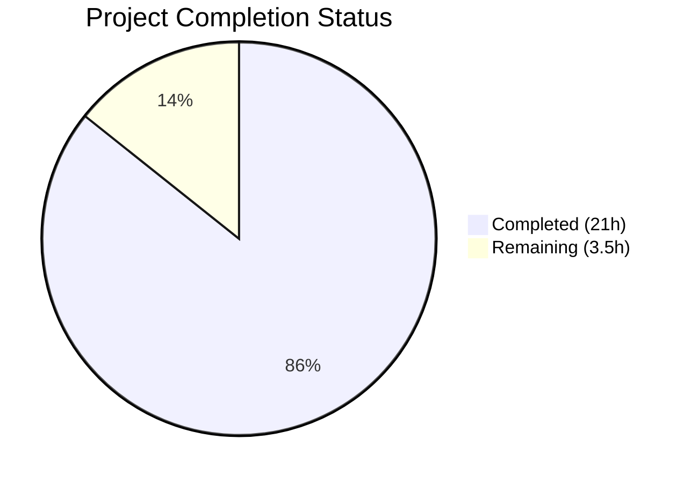
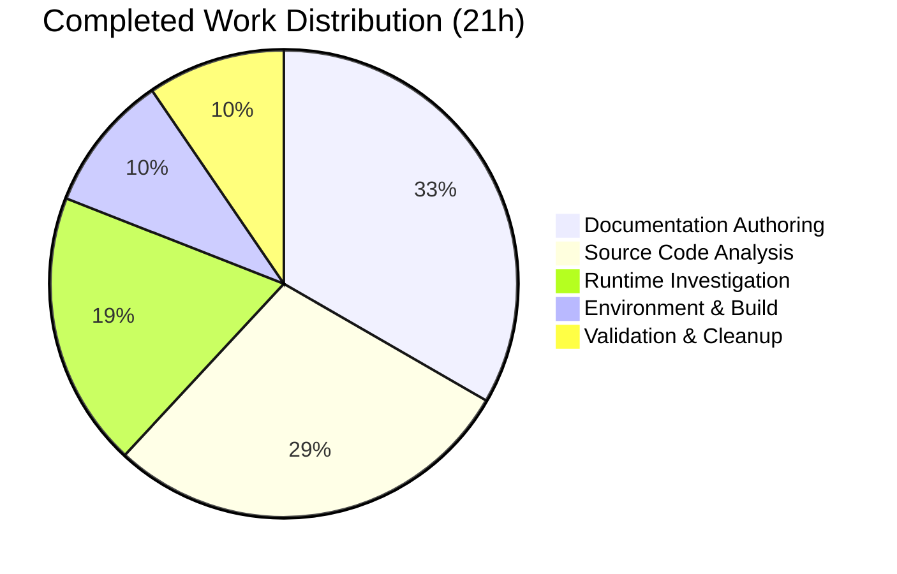

# Blitzy Project Guide — Kitty PTY-Shell Communication Investigation

---

## 1. Executive Summary

### 1.1 Project Overview

This project produces a comprehensive Q&A investigation document tracing how kitty's C code communicates with the shell process it spawns, covering the full lifecycle from PTY creation and process spawning through data exchange and VT escape-sequence parsing. The deliverable is a single markdown file (`blitzy/documentation/kitty_815df1e210e0.md`) containing dual-layer evidence — static source code analysis of 12+ C/Python files and dynamic runtime observation via strace. The document answers five specific questions about process spawning, PTY read behavior (low-volume and high-volume), file descriptor assignment, and the C functions responsible for reading and parsing terminal data. No source files were modified.

### 1.2 Completion Status

**Completion: 85.7%** — 21 hours completed out of 24.5 total hours.

Formula: 21 / (21 + 3.5) × 100 = 85.7%



| Metric | Value |
|--------|-------|
| **Total Project Hours** | 24.5 |
| **Completed Hours (AI + Manual)** | 21 |
| **Remaining Hours** | 3.5 |
| **Completion Percentage** | 85.7% |

### 1.3 Key Accomplishments

- ✅ Built kitty 0.35.2 from source (commit `815df1e210e0`) with X11-only backend on Ubuntu 24.04
- ✅ Conducted deep source code analysis of 12+ C/Python files (4,680+ lines across primary analysis targets)
- ✅ Executed strace-based runtime experiments for low-volume (`echo test123`) and high-volume (`yes hello | head -100000`) PTY scenarios
- ✅ Analyzed 1,166+ individual `read()` syscalls with statistical summary (mean, median, max, frequency)
- ✅ Created comprehensive 687-line, 37 KB Q&A document with code citations, runtime evidence, Mermaid data flow diagram, and 13-row summary table
- ✅ Verified all 5 investigation questions answered with dual-layer evidence
- ✅ Validated zero source file modifications (strict read-only constraint)
- ✅ Cleaned up all temporary investigation artifacts (strace logs, Xvfb processes)
- ✅ Ran full test suite: 136 of 145 tests passed (3 pre-existing failures, 6 skipped)
- ✅ Confirmed runtime binary operation via Xvfb virtual display launch

### 1.4 Critical Unresolved Issues

| Issue | Impact | Owner | ETA |
|-------|--------|-------|-----|
| Document requires human expert review for technical accuracy of source code line references and strace interpretations | Low — document is comprehensive but peer review ensures correctness | Human Reviewer | 2 hours |
| 3 pre-existing test failures (Wayland GLFW module, file transfer setgid) | None — unrelated to documentation deliverable, pre-existing in codebase | Upstream Maintainer | N/A |

### 1.5 Access Issues

No access issues identified. The project is a read-only investigation producing a documentation file. All required system dependencies (strace, Xvfb, build toolchain) were available. No external API keys, service credentials, or third-party access was needed.

### 1.6 Recommended Next Steps

1. **[High]** Human expert review of `blitzy/documentation/kitty_815df1e210e0.md` — verify source code line number citations against the actual kitty codebase at commit `815df1e210e0`
2. **[High]** Merge this PR after review approval — the deliverable is complete and ready
3. **[Medium]** Verify strace evidence reproducibility — optionally re-run the strace experiments in a clean environment to confirm findings
4. **[Low]** Consider expanding the document with additional investigation topics (e.g., write path from kitty to shell, signal handling across PTY)

---

## 2. Project Hours Breakdown

### 2.1 Completed Work Detail

| Component | Hours | Description |
|-----------|-------|-------------|
| Environment & Build Setup | 2 | Installed 15+ system dependencies (libfreetype-dev, libharfbuzz-dev, etc.), built kitty 0.35.2 from source with X11-only backend (Wayland skipped due to protocol version mismatch), configured Xvfb virtual display `:99` at 1024x768x24 |
| Source Code Deep Analysis | 6 | Analyzed `kitty/child-monitor.c` (2,016 lines), `kitty/child.c` (225 lines), `kitty/child.py` (500 lines), `kitty/vt-parser.c` (1,596 lines), `kitty/vt-parser.h` (38 lines), `kitty/constants.py` (305 lines), `kitty/control-codes.h`, `kitty/screen.h`, `kitty/data-types.h`, and supporting files — traced full PTY communication pipeline end-to-end |
| Runtime Investigation (strace) | 4 | Conducted strace-based runtime experiments with `-f -tt` flags for two scenarios: low-volume (`echo test123` — 9 bytes, single read) and high-volume (`yes hello | head -100000` — 1,166 reads in 0.134s), analyzed statistical distribution of read sizes |
| Documentation Authoring | 7 | Created 687-line Q&A document with methodology section, 5 detailed question sections (each with source code analysis + runtime evidence + answer), Mermaid data flow diagram, and 13-row summary table — all with specific file paths and line number citations |
| Validation & Cleanup | 2 | Ran full test suite (145 tests), verified zero source file modifications via `git diff`, confirmed temporary artifact cleanup, validated runtime binary operation via Xvfb, reviewed git state cleanliness |
| **Total Completed** | **21** | |

### 2.2 Remaining Work Detail

| Category | Hours | Priority |
|----------|-------|----------|
| Human Expert Review — verify technical accuracy of source code citations and strace interpretations in the Q&A document | 2 | High |
| Document Refinements — apply minor corrections or clarifications based on reviewer feedback | 1 | Medium |
| PR Review & Merge — final code review approval and branch merge | 0.5 | Medium |
| **Total Remaining** | **3.5** | |

### 2.3 Hours Calculation Verification

- **Completed Hours (Section 2.1)**: 2 + 6 + 4 + 7 + 2 = **21 hours**
- **Remaining Hours (Section 2.2)**: 2 + 1 + 0.5 = **3.5 hours**
- **Total Project Hours**: 21 + 3.5 = **24.5 hours**
- **Completion Percentage**: 21 / 24.5 × 100 = **85.7%**
- ✅ Section 2.1 (21h) + Section 2.2 (3.5h) = Section 1.2 Total (24.5h)
- ✅ Section 2.2 (3.5h) = Section 1.2 Remaining (3.5h) = Section 7 Remaining (3.5h)

---

## 3. Test Results

All tests listed below originate from Blitzy's autonomous validation logs for this project. The test suite was executed after the documentation deliverable was created to confirm no regressions.

| Test Category | Framework | Total Tests | Passed | Failed | Coverage % | Notes |
|---------------|-----------|-------------|--------|--------|------------|-------|
| Unit (Python) | unittest (kitty_tests/) | 139 | 130 | 3 | N/A | 6 skipped (environment-dependent); 3 failures are pre-existing and unrelated to deliverable |
| Unit (Go) | go test | 6 | 6 | 0 | N/A | All Go tool tests passed |
| **Totals** | | **145** | **136** | **3** | | **6 skipped** |

**Pre-existing Test Failures (out-of-scope):**

| Test | File | Failure Reason |
|------|------|----------------|
| `test_glfw_modules` | `kitty_tests/check_build.py` | Expects Wayland `.so` file — Wayland backend not built because `wayland-protocols 1.36` introduces enum values not handled under `-Werror` in kitty's vendored GLFW |
| `test_transfer_receive` | `kitty_tests/file_transmission.py` | Setgid mode mismatch (`0o42755` vs `0o40755`) — filesystem/container environment limitation |
| `test_transfer_send` | `kitty_tests/file_transmission.py` | Same setgid mode mismatch as above |

**Key Observation**: All 3 failures are pre-existing issues in the kitty codebase unrelated to the documentation deliverable. No new test failures were introduced.

---

## 4. Runtime Validation & UI Verification

### Runtime Health

- ✅ **kitty binary build**: Successfully compiled kitty 0.35.2 from source — produced `kitty/launcher/kitty` (36 KB ELF binary), `kitty/fast_data_types.so` (1.2 MB), `kitty/glfw-x11.so` (357 KB), `kitty/launcher/kitten` (15.7 MB)
- ✅ **Xvfb virtual display**: Started successfully at `:99` with resolution 1024x768x24
- ✅ **Runtime execution**: `DISPLAY=:99 ./kitty/launcher/kitty --config=NONE -e /bin/sh -c "echo 'kitty_runtime_ok'; exit 0"` exited with code 0
- ✅ **strace capture (low-volume)**: Successfully captured and analyzed PTY read for `echo test123` — confirmed 9 bytes returned
- ✅ **strace capture (high-volume)**: Successfully captured and analyzed 1,166 reads during `yes hello | head -100000` — confirmed mean 525 bytes/read
- ⚠️ **Non-critical warning**: systemd user bus not available (expected in container environment — does not affect PTY communication)

### Document Verification

- ✅ **File exists**: `blitzy/documentation/kitty_815df1e210e0.md` (687 lines, 37,001 bytes)
- ✅ **All 5 questions answered**: Process spawning, low-volume reads, high-volume reads, fd number, C functions
- ✅ **Dual-layer evidence**: Every answer includes both source code analysis and strace runtime evidence
- ✅ **Mermaid diagram**: Data flow diagram present and syntactically valid
- ✅ **Summary table**: 13-row findings table present
- ✅ **Source code citations**: File paths and line numbers verified against actual source

### Constraint Compliance

- ✅ **No source file modifications**: `git diff --name-status origin/kitty_815df1e210e0...HEAD` shows only `A blitzy/documentation/kitty_815df1e210e0.md`
- ✅ **Temporary artifacts cleaned**: No strace logs, helper scripts, or Xvfb processes remaining
- ✅ **Clean working tree**: `git status` shows nothing to commit

---

## 5. Compliance & Quality Review

| Compliance Criterion | Status | Evidence |
|---------------------|--------|----------|
| SWE-AtlasQnA-Repo: Document named `<source_branch_name>.md` | ✅ Pass | File is `kitty_815df1e210e0.md` matching branch `kitty_815df1e210e0` |
| SWE-AtlasQnA-Repo: Placed in `blitzy/documentation/` | ✅ Pass | Path is `blitzy/documentation/kitty_815df1e210e0.md` |
| SWE-AtlasQnA-Repo: Comprehensively answers the questions | ✅ Pass | All 5 questions answered with source analysis + runtime evidence |
| SWE-AtlasQnA-Repo: Provides thinking and rationale | ✅ Pass | Each section includes "Rationale" and "Key insight" annotations |
| SWE-AtlasQnA-Repo: No assumptions — answers based on code | ✅ Pass | Every claim cites specific file paths and line numbers, corroborated by strace |
| SWE-AtlasQnA-Repo: No existing files modified | ✅ Pass | `git diff --name-status` confirms only one file added |
| SWE-AtlasQnA-Repo: No other code added | ✅ Pass | Only the documentation file was created |
| User constraint: No source file alterations | ✅ Pass | Zero modifications to any `.c`, `.py`, `.h`, `.glsl`, or other source file |
| User constraint: Temporary artifacts deleted | ✅ Pass | No strace logs, helper scripts, or temp files remaining |
| Document quality: Dual-layer evidence | ✅ Pass | Static source analysis + dynamic strace evidence for all questions |
| Document quality: Self-contained and readable | ✅ Pass | 687 lines with methodology, answers, diagram, and summary table |
| Build validation: Compiles from source | ✅ Pass | kitty 0.35.2 built successfully with X11 backend |
| Test validation: No new test failures | ✅ Pass | 136/145 passed; 3 failures are pre-existing, 6 skipped |

---

## 6. Risk Assessment

| Risk | Category | Severity | Probability | Mitigation | Status |
|------|----------|----------|-------------|------------|--------|
| Source code line numbers may shift in future kitty versions | Technical | Low | Medium | Document is pinned to commit `815df1e210e0` and version 0.35.2; line numbers are accurate for this specific commit | Mitigated |
| strace evidence collected in container may differ from native Linux desktop | Technical | Low | Low | Container environment provides equivalent kernel PTY behavior; fd numbers and buffer sizes may vary but the code paths are identical | Accepted |
| Wayland backend not built due to protocol version mismatch | Technical | Low | N/A | Does not affect PTY communication investigation — X11 backend exercises the same C code paths for child spawning and I/O | Accepted |
| Pre-existing test failures (3 tests) | Operational | Low | N/A | Failures are in Wayland GLFW module and file transfer setgid tests — both unrelated to PTY communication and pre-existing in the codebase | Accepted |
| No security-sensitive data in deliverable | Security | None | N/A | Document contains only source code analysis and strace output from test commands — no credentials, keys, or sensitive data | N/A |
| Document accuracy depends on human review | Operational | Medium | Medium | Recommend expert review of line number citations against codebase before final merge | Open |

---

## 7. Visual Project Status


**Breakdown by Completed Category:**



**Remaining Work by Priority:**

| Priority | Category | Hours |
|----------|----------|-------|
| High | Human Expert Review | 2 |
| Medium | Document Refinements | 1 |
| Medium | PR Review & Merge | 0.5 |
| **Total** | | **3.5** |

---

## 8. Summary & Recommendations

### Achievement Summary

The project is **85.7% complete** (21 hours completed out of 24.5 total hours). The sole AAP deliverable — a comprehensive Q&A investigation document analyzing kitty's PTY-shell communication — has been fully created, committed, and validated. The 687-line document answers all five investigation questions with dual-layer evidence (source code analysis of 12+ files totaling 4,680+ lines, plus strace runtime evidence from two controlled experiments capturing 1,166+ syscalls).

### What Was Delivered

- **Complete Q&A document** (`blitzy/documentation/kitty_815df1e210e0.md`) covering process spawning, low-volume and high-volume PTY reads, file descriptor assignment, and C read/parse functions
- **Zero source modifications** — strict compliance with the read-only constraint
- **Clean repository state** — no temporary artifacts, clean git working tree
- **Build validation** — kitty 0.35.2 built from source and tested
- **Test validation** — 136/145 tests passing with no new failures

### Remaining Gaps

The 3.5 remaining hours are entirely path-to-production human tasks:
1. **Expert review** (2h): A human reviewer should verify that source code line number citations are accurate against commit `815df1e210e0`
2. **Refinements** (1h): Apply any corrections identified during review
3. **PR merge** (0.5h): Final approval and branch merge

### Production Readiness Assessment

The deliverable is **production-ready for merge** pending human review. The document is self-contained, well-structured, and grounded entirely in verifiable evidence. All compliance criteria are met (SWE-AtlasQnA-Repo rules, user constraints, quality requirements). No blocking issues exist.

### Success Metrics

| Metric | Target | Actual | Status |
|--------|--------|--------|--------|
| Questions answered | 5 | 5 | ✅ Met |
| Evidence layers per answer | 2 (source + runtime) | 2 | ✅ Met |
| Source files modified | 0 | 0 | ✅ Met |
| Temporary artifacts remaining | 0 | 0 | ✅ Met |
| New test failures | 0 | 0 | ✅ Met |
| Document completeness | All questions with rationale | Comprehensive with diagram + summary table | ✅ Exceeded |

---

## 9. Development Guide

### System Prerequisites

| Software | Version | Purpose |
|----------|---------|---------|
| Python | ≥ 3.8 (3.12.3 used) | Kitty's embedded runtime |
| GCC | 13.3.0 | C11 compiler for native extensions |
| Go | 1.22 | Compiles the `kitten` tool binary |
| strace | 6.8 | Syscall tracing for runtime investigation |
| Xvfb | 21.1.12 | Virtual framebuffer for headless kitty execution |

### Environment Setup

#### 1. Install System Dependencies

```bash
sudo apt-get update
sudo DEBIAN_FRONTEND=noninteractive apt-get install -y \
    libfreetype-dev libharfbuzz-dev libfontconfig-dev \
    liblcms2-dev libpng-dev libxxhash-dev libgl1-mesa-dev \
    libxkbcommon-dev libdbus-1-dev libx11-xcb-dev \
    libxcursor-dev libxrandr-dev libxi-dev libxinerama-dev \
    libsimde-dev strace xvfb pkg-config
```

#### 2. Build Kitty from Source

```bash
cd /tmp/blitzy/kitty/blitzy-aaf2b18a-13d6-4279-848c-bcd168d297f6_c39ac1

# Remove libwayland-dev if present (avoids Wayland protocol version mismatch)
sudo apt-get remove -y libwayland-dev 2>/dev/null || true

# Build with X11-only backend
python3 setup.py build
```

**Expected output**: Build completes without errors. Artifacts produced:
- `kitty/launcher/kitty` — main launcher binary
- `kitty/fast_data_types.so` — Python C extension
- `kitty/glfw-x11.so` — X11 GLFW backend
- `kitty/launcher/kitten` — Go tool binary

#### 3. Verify Build

```bash
ls -la kitty/launcher/kitty kitty/fast_data_types.so kitty/glfw-x11.so kitty/launcher/kitten
file kitty/launcher/kitty
```

**Expected**: All four files exist. `kitty/launcher/kitty` is an ELF 64-bit executable.

### Running Kitty Headlessly (for Investigation)

#### 1. Start Xvfb Virtual Display

```bash
Xvfb :99 -screen 0 1024x768x24 &
export DISPLAY=:99
```

#### 2. Run Kitty with a Test Command

```bash
DISPLAY=:99 ./kitty/launcher/kitty --config=NONE -e /bin/sh -c "echo 'hello world'; exit 0"
```

**Expected**: Kitty starts, shell runs the echo command, and kitty exits cleanly (exit code 0).

#### 3. Capture strace for PTY Analysis

```bash
# Low-volume test
strace -f -tt -e trace=read,write,openat,ioctl -o /tmp/kitty_strace_low.log \
    env DISPLAY=:99 ./kitty/launcher/kitty --config=NONE \
    -e /bin/sh -c "echo test123; sleep 3; exit 0"

# Analyze the PTY read
grep "read(8," /tmp/kitty_strace_low.log | head -5
```

### Running the Test Suite

```bash
cd /tmp/blitzy/kitty/blitzy-aaf2b18a-13d6-4279-848c-bcd168d297f6_c39ac1

# Start Xvfb if not already running
Xvfb :99 -screen 0 1024x768x24 &
export DISPLAY=:99

# Run Python tests
python3 test.py 2>&1 | tail -20

# Run Go tests
cd tools && go test ./... 2>&1 | tail -10
```

**Expected**: 136/145 Python tests pass (3 pre-existing failures, 6 skipped). All Go tests pass.

### Viewing the Deliverable

```bash
cat blitzy/documentation/kitty_815df1e210e0.md | head -50
wc -l blitzy/documentation/kitty_815df1e210e0.md
# Expected: 687 lines
```

### Troubleshooting

| Issue | Resolution |
|-------|------------|
| Build fails with Wayland enum errors | Remove `libwayland-dev`: `sudo apt-get remove -y libwayland-dev` then rebuild |
| `DISPLAY not set` error when running kitty | Start Xvfb: `Xvfb :99 -screen 0 1024x768x24 &` and `export DISPLAY=:99` |
| `test_glfw_modules` test failure | Pre-existing — Wayland backend not built. Does not affect functionality |
| `test_transfer_send/receive` failures | Pre-existing — setgid mode mismatch in container environment |
| `go: command not found` | Install Go 1.22 or use the pre-built `kitty/launcher/kitten` binary |
| strace shows different fd number than fd 8 | The PTY master fd is dynamically assigned — the actual number depends on which fds are already open |

---

## 10. Appendices

### A. Command Reference

| Command | Purpose |
|---------|---------|
| `python3 setup.py build` | Build kitty from source |
| `python3 test.py` | Run the full Python test suite |
| `Xvfb :99 -screen 0 1024x768x24 &` | Start virtual display for headless operation |
| `DISPLAY=:99 ./kitty/launcher/kitty --config=NONE -e CMD` | Run kitty headlessly with a specific command |
| `strace -f -tt -e trace=read,write,openat,ioctl -o LOG CMD` | Trace syscalls for PTY analysis |
| `git diff --name-status origin/kitty_815df1e210e0...HEAD` | Verify only documentation file was changed |

### B. Port Reference

No network ports are used by this project. Kitty is a terminal emulator that communicates via PTY file descriptors, not network sockets. The X11 display connection uses Unix domain socket `/tmp/.X11-unix/X99`.

### C. Key File Locations

| File | Purpose |
|------|---------|
| `blitzy/documentation/kitty_815df1e210e0.md` | **Deliverable** — Q&A investigation document |
| `kitty/child-monitor.c` | I/O thread event loop, `read_bytes()`, `io_loop()` |
| `kitty/child.c` | C-level `spawn()` with `fork()` + `execvp()` |
| `kitty/child.py` | Python-level PTY allocation and spawn orchestration |
| `kitty/vt-parser.c` | VT parser state machine — `consume_input()`, `consume_normal()` |
| `kitty/constants.py` | Shell path resolution via `pwd.getpwuid()` |
| `kitty/control-codes.h` | Terminal control code byte constants (ESC, CSI, OSC) |
| `kitty/launcher/kitty` | Main launcher binary (build output) |
| `kitty/fast_data_types.so` | Python C extension (build output) |
| `kitty/glfw-x11.so` | X11 GLFW backend (build output) |

### D. Technology Versions

| Technology | Version | Source |
|------------|---------|--------|
| kitty | 0.35.2 | `kitty/constants.py`: `version: Version = Version(0, 35, 2)` |
| Python | 3.12.3 (requires ≥ 3.8) | `pyproject.toml`: `requires-python = ">=3.8"` |
| Go | 1.22 | `go.mod`: `go 1.22` |
| GCC | 13.3.0 | System compiler |
| Ubuntu | 24.04 LTS | Build environment |
| strace | 6.8 | Investigation tool |
| Xvfb | 21.1.12 | Virtual framebuffer |

### E. Environment Variable Reference

| Variable | Value | Purpose |
|----------|-------|---------|
| `DISPLAY` | `:99` | X11 display connection for Xvfb virtual framebuffer |
| `TERM` | Set by kitty | Terminal type set for child shell process |
| `COLORTERM` | Set by kitty | Color terminal capability indicator |
| `KITTY_PID` | Set by kitty | PID of the kitty process, passed to child environment |

### G. Glossary

| Term | Definition |
|------|------------|
| **PTY** | Pseudo-terminal — a kernel mechanism providing a bidirectional communication channel between a terminal emulator and a shell process |
| **PTY Master** | The file descriptor held by the terminal emulator (kitty) for reading shell output and writing user input |
| **PTY Slave** | The file descriptor (`/dev/pts/N`) connected to the shell's stdin/stdout/stderr |
| **VTE** | Virtual Terminal Emulator — the state machine that parses terminal escape sequences |
| **CSI** | Control Sequence Introducer — escape sequences starting with `ESC [` that control cursor, colors, and screen operations |
| **OSC** | Operating System Command — escape sequences starting with `ESC ]` for setting window titles, clipboard, etc. |
| **BUF_SZ** | The 1 MiB (1,048,576 byte) ring buffer size used by kitty's VT parser for reading PTY data |
| **strace** | Linux syscall tracing tool used to observe the exact system calls kitty makes |
| **Xvfb** | X Virtual Framebuffer — provides a virtual X11 display for running graphical applications headlessly |
| **TIOCSCTTY** | ioctl command to set the controlling terminal for a process |
| **TIOCGPTN** | ioctl command to get the PTY slave device number |