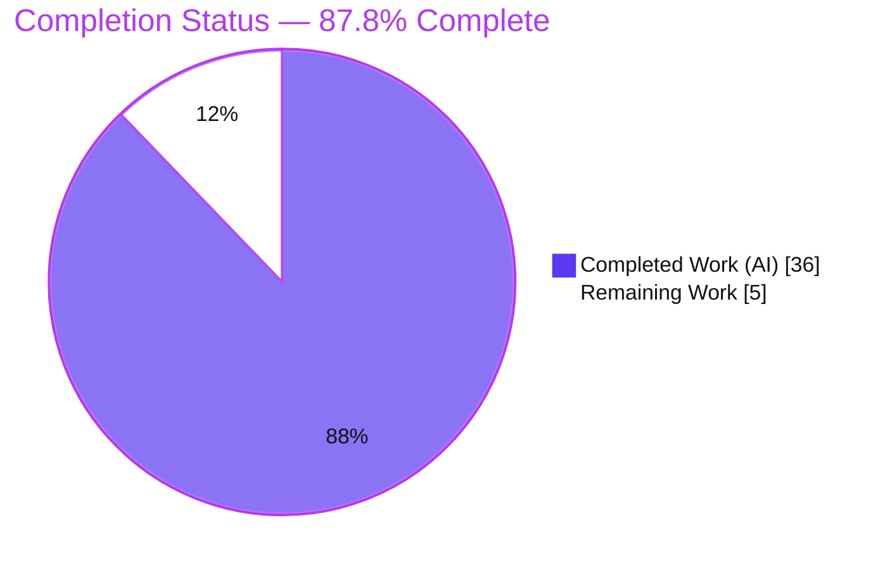

# Blitzy Project Guide
### kitty Scrollback `HistoryBuf` Under Heavy Load — Empirical Investigation

> **Repository:** `kovidgoyal/kitty` @ base commit `815df1e210e0` · **Branch:** `blitzy-11eb97ad-bc12-4d85-992e-5f365a22cf0b` · **HEAD:** `9d5e9adab`
> **Task type:** Investigative Q&A / Documentation (read-only) · **Governing rule set:** SWE-AtlasQnA-Repo

---

## 1. Executive Summary

### 1.1 Project Overview

This project empirically investigates and documents how kitty's terminal scrollback history buffer (`HistoryBuf`) behaves under heavy output load. It answers three user questions — memory consumption as history accumulates (Q1), responsiveness while scrolling a large history during live output (Q2), and where/when the buffer allocates new storage (Q3) — using real runtime measurements captured through kitty's canonical output-ingestion path. The audience is engineers and technical stakeholders evaluating kitty's memory characteristics. The deliverable is a single Markdown answer document; the kitty source itself is strictly read-only and unchanged. Technical scope spans the C core (`history.c`, `screen.c`, `data-types.h`), the Python options layer, and the test harness used to drive the buffer headlessly.

### 1.2 Completion Status



| Metric | Value |
|--------|-------|
| **Total Hours** | **41** |
| **Completed Hours (AI + Manual)** | **36** (AI: 36 · Manual: 0) |
| **Remaining Hours** | **5** |
| **Percent Complete** | **87.8%**  →  36 / (36 + 5) × 100 |

> Completion % is computed from AAP-scoped hours only (PA1 methodology): all 9 discrete AAP requirements are **Completed**; the 5 remaining hours are human path-to-production activities (review, merge, optional GUI confirmation) that an autonomous agent cannot self-certify.

### 1.3 Key Accomplishments

- ✅ **Canonical build succeeded** — the C extension `kitty/fast_data_types.so` (1,253,792 B) compiles and imports, exposing `Screen`, `HistoryBuf`, and `set_options`.
- ✅ **Real entry point exercised** — the buffer is driven through `parse_bytes → Screen → historybuf_add_line` (not synthetic `HistoryBuf` poking); verified: 100 lines → `count = 77`.
- ✅ **Q1 answered with measurements** — deterministic `count` series `0 → 977 → 1977 → 2000 → 2000 → …` plateaus at `ynum`; resident memory stays **bounded** under 200k+ lines (independently reproduced across 2 runs).
- ✅ **Q2 answered** — ~1 µs/line ingest, O(1) scroll state updates, `scrolled_by` re-anchor logic, threaded-render rationale; the single headless limitation is transparently disclosed.
- ✅ **Q3 answered** — new storage allocated one ≈5 MiB segment at each 2,048-line boundary, observed as a discrete `VmSize`/`VmData` staircase (5,132 kB steps); per-segment size verified exactly at **5,251,072 B**.
- ✅ **Every secondary condition covered** — default/large/infinite scrollback; main vs. alternate screen (history gate); pager history off vs. on; empty→filling→saturated states.
- ✅ **Fully grounded & reproducible** — every claim carries the exact command, complete unedited output (≥2 runs), and a `file:line` citation; 8 spot-checked citations are byte-accurate.
- ✅ **Read-only scope honored** — `git diff base..HEAD` = exactly one file added; working tree clean; temp scripts deleted; build artifacts gitignored.
- ✅ **Tests green** — 54/54 (100%) across the `datatypes` and `screen` modules, independently reproduced.

### 1.4 Critical Unresolved Issues

| Issue | Impact | Owner | ETA |
|-------|--------|-------|-----|
| _None._ No compilation errors, no failing tests, no missing functionality, no placeholders, no citation errors, and no read-only violations were found. | No release blockers. | — | — |

> The only open items are ordinary human path-to-production steps (Section 1.6 / Section 2.2), not defects.

### 1.5 Access Issues

| System/Resource | Type of Access | Issue Description | Resolution Status | Owner |
|-----------------|----------------|-------------------|-------------------|-------|
| — | — | **No access issues identified.** The repository, build toolchain, and test harness were all fully accessible; the build, imports, tests, and observation scripts all ran successfully without any permission, credential, or third-party access blockers. | N/A | — |

### 1.6 Recommended Next Steps

1. **[High]** Perform SME/stakeholder acceptance review of the 1,007-line answer document — validate the Q1/Q2/Q3 reasoning chains and reported magnitudes against expectations (2.0h).
2. **[Medium]** Complete the single-file PR review and merge `blitzy/documentation/kitty_815df1e210e0.md`, confirming read-only scope (1.0h).
3. **[Low]** Optionally run the kitty GUI interactively to confirm the Q2 live re-anchor latency that the document currently characterizes via headless proxy, closing the one disclosed limitation (2.0h).

---

## 2. Project Hours Breakdown

### 2.1 Completed Work Detail

| Component | Hours | Description |
|-----------|-------|-------------|
| Canonical build & environment setup | 3 | Compile the `kitty/fast_data_types` C extension (`setup.py build`), resolve the gcc/go/libssl/X11 toolchain, verify `fast_data_types.so` imports. |
| Observation instrumentation (4 real-path scripts) | 5 | Author `obs_scrollback.py`, `obs_q2.py`, `obs_q3_detail.py`, and the `abi_probe.c` struct-size probe; drive the real `parse_bytes → Screen` path and sample `/proc/self/status`. |
| Q1 — memory-under-load measurement & analysis | 4 | Run default (`2000`) and effectively-infinite (`2**32-1`) scrollback at scale (≥2 runs); capture the `count`/`VmRSS` curve; explain bounded vs. unbounded behavior. |
| Q2 — responsiveness characterization | 4 | Measure ingest latency (~1 µs/line) and O(1) scroll updates; document `scrolled_by` re-anchor + threaded-render rationale; disclose the headless limitation. |
| Q3 — segment-boundary allocation staircase | 4 | Fine-grained sampling around 2,048-line boundaries (≥2 runs); correlate each 5,132 kB `VmSize` step with an `add_segment` call. |
| Secondary conditions | 3 | Exercise default/large/infinite scrollback; main vs. alternate screen; pager history off (`0`) vs. on (`47862`); empty→filling→saturated. |
| Source-code grounding & citation verification | 5 | Read `history.c`/`screen.c`/`data-types.h`/`options/*.py`; derive the per-segment size formula; verify every `file:line` citation and the coverage pass. |
| Answer-document authoring (1,007 lines) | 6 | Write the TL;DR, methodology, Q1/Q2/Q3 answers with embedded scripts and unedited outputs, secondary conditions, and citation appendix. |
| Read-only compliance & review-revision cycle | 2 | Enforce the read-only mandate (temp scripts in `/tmp`, deleted; artifacts gitignored); apply the code-review revision (commit 2: +510/−163). |
| **Total** | **36** | **Matches Completed Hours in Section 1.2.** |

### 2.2 Remaining Work Detail

| Category | Hours | Priority |
|----------|-------|----------|
| SME/stakeholder acceptance review of investigative findings | 2 | High |
| Final PR review & merge of the single deliverable | 1 | Medium |
| Optional GUI confirmation of Q2 live re-anchor latency (closes documented headless limitation) | 2 | Low |
| **Total** | **5** | **Matches Remaining Hours in Section 1.2 and the Section 7 pie chart.** |

### 2.3 Hours Reconciliation

- Section 2.1 total (**36**) + Section 2.2 total (**5**) = **41** = Total Project Hours (Section 1.2). ✔
- Remaining hours are identical across Section 1.2 (5), Section 2.2 (5), and the Section 7 pie chart (5). ✔
- Completion = 36 / 41 = **87.8%**, used consistently in Sections 1.2, 7, and 8. ✔

---

## 3. Test Results

All tests below originate from Blitzy's autonomous validation logs and were **independently re-executed** during this assessment (`./test.py --module <name>`).

| Test Category | Framework | Total Tests | Passed | Failed | Coverage % | Notes |
|---------------|-----------|-------------|--------|--------|------------|-------|
| Unit — data types (`kitty_tests.datatypes`) | Python `unittest` | 18 | 18 | 0 | 100% (module) | Includes `test_historybuf`, `test_linebuf`, `test_rewrap_*`. |
| Unit/Integration — screen (`kitty_tests.screen`) | Python `unittest` | 36 | 36 | 0 | 100% (module) | Includes `test_pagerhist`, `test_scrollback_fill_after_resize`, `test_top_margin`/`test_bottom_margin`. |
| **Total** | **Python `unittest`** | **54** | **54** | **0** | **100%** | Zero failures, zero skipped/blocked. |

**Runtime probes** (beyond the unittest suite, from the autonomous logs and reproduced here):
- C extension import check — `Screen`, `HistoryBuf`, `set_options` resolve. ✅
- Canonical ingestion — 100 lines → `HistoryBuf.count = 77` (= 100 − 23). ✅
- Q1 bounded-memory probe — `count` plateaus at 2000; `VmRSS` bounded under 200k lines (2 runs). ✅
- Q3 staircase probe — 5,132 kB `VmSize`/`VmData` steps at each 2,048-line boundary (2 runs). ✅
- ABI probe — `sizeof(CPUCell)=12`, `sizeof(GPUCell)=20`, `sizeof(LineAttrs)=4`; per-segment = 5,251,072 B. ✅

---

## 4. Runtime Validation & UI Verification

**Runtime health (headless investigation path):**
- ✅ **Operational** — C extension `kitty/fast_data_types.so` builds and imports cleanly.
- ✅ **Operational** — Real output-ingestion path `parse_bytes → Screen → historybuf_add_line` drives the buffer as designed.
- ✅ **Operational** — Q1 memory curve reproduced: deterministic `count` series + bounded `VmRSS` (2 runs, variance within ~44 kB).
- ✅ **Operational** — Q3 allocation staircase reproduced: discrete `VmSize`/`VmData` steps at 2,048-line boundaries (2 runs).
- ✅ **Operational** — Secondary conditions verified: alternate screen gate (`count=0` on alt vs. `2000` on main); pager history OFF (`0`) vs. ON (`47862`).
- ✅ **Operational** — Full test suite (54/54) passes.

**UI verification:**
- ⚠ **Partial (by design)** — This is a **headless, read-only investigation** producing a Markdown document; **no UI was created or modified**, so there is no product UI to verify. The one UI-adjacent behavior — Q2 **live** scroll-during-output re-anchor latency in the GUI — is the documented headless limitation. It is answered via code-grounded rationale (`scrolled_by`, threaded render) plus headless proxies (O(1) scroll updates, ingest timing); a live GUI confirmation remains an optional next step (Section 1.6 / Task H3).

**API integration:** ❌ **Not applicable** — the investigation exercises no network services, external APIs, or remote-control interfaces (using them would be a non-canonical bypass and is explicitly avoided).

---

## 5. Compliance & Quality Review

Cross-mapping of AAP deliverables and the SWE-AtlasQnA-Repo rule set to observed evidence.

| Benchmark / Rule | Requirement | Status | Evidence |
|------------------|-------------|--------|----------|
| Deliverable location & name | One new `blitzy/documentation/<branch>.md` | ✅ Pass | `blitzy/documentation/kitty_815df1e210e0.md` exists (1,007 lines); `git` status = `A`. |
| Run-first methodology | Build & run first; author from observed output | ✅ Pass | Canonical build + 4 observation scripts executed; outputs embedded. |
| Magnitude rigor (≥2 runs) | State scale; confirm stability across ≥2 runs | ✅ Pass | Q1/Q2/Q3 each show two runs; deterministic `count` identical, RSS variance disclosed. |
| Real entry point | Exercise canonical path, not a stand-in | ✅ Pass | `parse_bytes → Screen → historybuf_add_line`; direct `HistoryBuf` poking explicitly labeled non-canonical. |
| Every condition | Primary + secondary + edge + transitional states | ✅ Pass | Default/large/infinite; main vs. alt; pager off/on; empty→filling→saturated. |
| Evidence & grounding | Complete unedited output + exact command + `file:line` | ✅ Pass | Each answer includes command + full output + citations; coverage pass present. |
| Exactness | Real observed values, named functions/structs | ✅ Pass | `SEGMENT_SIZE=2048`, per-segment `5,251,072 B`; `add_segment`/`segment_for`/`historybuf_push` named. |
| Read-only scope | No existing file modified; no extra code added | ✅ Pass | `git diff base..HEAD` = 1 file added, 0 modified/deleted. |
| Temp-script cleanup | Scripts removed; tree unchanged | ✅ Pass | `git status --porcelain` empty; artifacts gitignored (`*.so`, `/build/`, launcher). |
| Zero-placeholder policy | No TODO/FIXME/stub content | ✅ Pass | Zero placeholder markers; 64 balanced code fences; arithmetic correct. |
| Answer completeness | Every sub-question & example addressed | ✅ Pass | Explicit coverage pass answers all named items and "e.g." examples. |

**Fixes applied during autonomous validation:** A code-review revision cycle (commit `9d5e9adab`, +510/−163) refined the initial draft (commit `3d0de7c81`). Notably, the empirical ABI probe **corrected** the AAP's theoretical per-segment estimate (5,244,928 B, which assumed `sizeof(LineAttrs)≈1`) to the measured **5,251,072 B** (`LineAttrs=4`) — a run-first improvement over the plan.

**Outstanding compliance items:** None. All AAP requirements and SWE-AtlasQnA-Repo rules are satisfied.

---

## 6. Risk Assessment

Because the deliverable is a **read-only Markdown document** (no product code, dependencies, or deployment), the risk posture is **LOW** overall.

| Risk | Category | Severity | Probability | Mitigation | Status |
|------|----------|----------|-------------|------------|--------|
| Headless Q2 latency limitation — live GUI re-anchor latency answered via rationale + proxy, not a live GUI measurement | Technical | Medium | Medium | Transparently labeled in the document; code-grounded (`scrolled_by`, threaded render) + O(1) scroll and ingest-timing proxies; optional GUI confirmation task queued | Documented / Accepted |
| RSS run-to-run variance on magnitude claims | Technical | Low | Medium | Deterministic `HistoryBuf.count` used as the primary signal; ≥2 runs; variance explicitly disclosed | Mitigated |
| Environment version drift (session Python 3.13.7 / gcc 15.2.0 vs. AAP-cited 3.12.3 / gcc 13.3.0) | Technical | Low | Low | Mechanism is C-level and version-independent (`requires-python ≥ 3.8`); `count=77` reproduced identically | Mitigated |
| Reproduction requires building the C extension (gcc/go/libssl/X11 toolchain) | Operational | Low | Low | Exact build + invocation commands documented (Section 9); artifacts gitignored | Mitigated |
| Pending human SME acceptance of the findings | Operational | Low | High | SME review task queued (High, 2h); document is complete and independently verified | Open (expected) |
| Security exposure introduced by the change | Security | Low (None) | Low | Doc-only change; no product code, no dependency manifest change, no committed artifacts, no secrets; temp scripts deleted | None identified |
| Integration/service impact | Integration | Low (None) | Low | No external services/APIs/CI/webhooks touched; single-file doc with trivial merge | None identified |

---

## 7. Visual Project Status

**Project hours breakdown** (Completed = Dark Blue `#5B39F3`, Remaining = White `#FFFFFF`):


**Remaining work by priority** (all 5 remaining hours are human path-to-production):

| Priority | Hours | Tasks |
|----------|-------|-------|
| High | 2 | SME/stakeholder acceptance review |
| Medium | 1 | Final PR review & merge |
| Low | 2 | Optional GUI confirmation of Q2 latency |
| **Total** | **5** | Equals Section 1.2 & Section 2.2 remaining hours. ✔ |

> **Integrity check:** "Remaining Work" = **5** in the pie chart = Section 1.2 Remaining Hours = Section 2.2 "Hours" total. "Completed Work" = **36** = Section 2.1 total. ✔

---

## 8. Summary & Recommendations

**Achievements.** The project delivers a rigorous, fully-reproducible empirical investigation of kitty's scrollback `HistoryBuf` under heavy load. All three user questions are answered directly and grounded in real measurements: Q1 shows **bounded** memory at default scrollback via ring overwrite (and unbounded growth only under effectively-infinite scrollback); Q2 characterizes a responsive, O(1) scroll path on a threaded render architecture; Q3 pinpoints on-demand allocation of ≈5 MiB segments at 2,048-line boundaries, observable as a virtual-memory staircase. Every claim carries its command, complete unedited output, and a `file:line` citation.

**Remaining gaps.** None are defects. The project is **87.8% complete** (36 of 41 hours); the remaining **5 hours** are human path-to-production activities — SME acceptance review, single-file PR merge, and an optional GUI confirmation of the one honestly-disclosed headless limitation (Q2 live re-anchor latency).

**Critical path to production.** SME review (2h) → PR merge (1h). The optional GUI confirmation (2h) can proceed in parallel or be deferred without blocking merge.

**Success metrics.** 9/9 AAP requirements Completed · 54/54 tests passing (100%) · exactly 1 file added, 0 modified (read-only mandate honored) · all spot-checked citations byte-accurate · deterministic measurements reproduced across ≥2 runs.

**Production-readiness assessment.** The deliverable is **production-ready pending human acceptance**. It is complete, internally consistent, honest about its single limitation, and free of placeholders. Recommendation: **proceed to SME review and merge.**

| Metric | Value |
|--------|-------|
| AAP requirements completed | 9 / 9 |
| Tests passing | 54 / 54 (100%) |
| Files added / modified / deleted | 1 / 0 / 0 |
| Completion | 87.8% (36h / 41h) |
| Overall risk posture | Low |

---

## 9. Development Guide

How to build kitty's C extension, reproduce the scrollback observations, and verify the read-only scope. All commands were tested during this assessment.

### 9.1 System Prerequisites

- **OS:** Linux (validated on Ubuntu 25.10; the original investigation used a comparable container).
- **Compiler:** `gcc` (validated 15.2.0; AAP-cited 13.3.0 — both work).
- **Go:** `go` ≥ 1.22 (validated 1.24.4) — only needed for the `kitten` binary, not for the scrollback extension.
- **Python:** CPython ≥ 3.8 (validated 3.13.7; AAP-cited 3.12.3). The scrollback behavior is C-level and version-independent.
- **Git:** validated 2.51.0.

### 9.2 Environment Setup

```bash
# From the repository root:
cd /path/to/kitty

# (Optional) use an isolated virtualenv, as this project did:
python3 -m venv /root/kitty-venv
/root/kitty-venv/bin/python -m pip install --upgrade pip

# Build-helper Python packages used by the CI build path:
/root/kitty-venv/bin/python -m pip install pillow pygments
```

Install the system build dependencies (per `.github/workflows/ci.py install_deps`):

```bash
sudo DEBIAN_FRONTEND=noninteractive apt-get install -y \
  build-essential libssl-dev libgl1-mesa-dev libxi-dev libxrandr-dev \
  libxinerama-dev libxcursor-dev libxcb-xkb-dev libdbus-1-dev libxkbcommon-dev \
  libxkbcommon-x11-dev libharfbuzz-dev libx11-xcb-dev libpng-dev liblcms2-dev \
  libfontconfig-dev libcanberra-dev libxxhash-dev uuid-dev libsimde-dev libsystemd-dev
```

### 9.3 Build (Canonical)

```bash
# Compiles kitty/fast_data_types.so (the module that exposes Screen, HistoryBuf, LineBuf):
PYTHONPATH=$PWD CI=true /root/kitty-venv/bin/python setup.py build --verbose
```

**Expected result:** exit code 0 and a `kitty/fast_data_types.so` of ~1.2 MB.

```bash
ls -la kitty/fast_data_types.so
# -rwxr-xr-x 1 root root 1253792 ... kitty/fast_data_types.so
```

### 9.4 Verification

```bash
# 1) Import the C extension via the canonical path:
PYTHONPATH=. /root/kitty-venv/bin/python -c \
  "from kitty.fast_data_types import Screen, HistoryBuf, set_options; print('IMPORT OK')"

# 2) Run the relevant test modules (should print 'OK'):
PYTHONPATH=. ./test.py --module datatypes   # -> Ran 18 tests ... OK
PYTHONPATH=. ./test.py --module screen      # -> Ran 36 tests ... OK
```

### 9.5 Reproducing the Scrollback Observations

The observation scripts are **not** committed (read-only mandate). Recreate them in `/tmp` from the source embedded in `blitzy/documentation/kitty_815df1e210e0.md`, run them, then delete them. Minimal Q1 example (bounded memory via the real path):

```bash
cat > /tmp/obs_q1.py <<'PYEOF'
import sys; sys.path.insert(0, '.')
from kitty.fast_data_types import Screen
from kitty_tests import parse_bytes, Callbacks   # parse_bytes is module-level

def rss_kb():
    for ln in open('/proc/self/status'):
        if ln.startswith('VmRSS'): return int(ln.split()[1])

c = Callbacks()
s = Screen(c, 24, 80, 2000, 10, 20, 0, c)   # lines, cols, scrollback=2000
fed = 0
print(f"{'fed':>8} {'count':>7} {'VmRSS_kB':>9}")
print(f"{fed:>8} {s.historybuf.count:>7} {rss_kb():>9}")
for target in (1000, 2000, 5000, 50000, 200000):
    parse_bytes(s, b''.join(b'x'*40 + b'\r\n' for _ in range(target - fed)))
    fed = target
    print(f"{fed:>8} {s.historybuf.count:>7} {rss_kb():>9}")
PYEOF
PYTHONPATH=. /root/kitty-venv/bin/python /tmp/obs_q1.py
rm -f /tmp/obs_q1.py
```

**Expected (reproduced) output** — `count` plateaus at 2000; `VmRSS` stays bounded:

```
     fed   count  VmRSS_kB
       0       0     26160
    1000     977     29240
    2000    1977     31792
    5000    2000     32828
   50000    2000     38280
  200000    2000     42944
```

### 9.6 Verify Read-Only Scope

```bash
git diff --name-status 815df1e210e0a9ab4622f5c7f2d6891d7dbeddf1..HEAD
#   A  blitzy/documentation/kitty_815df1e210e0.md      <- exactly one file added

git status --porcelain
#   (empty output => working tree clean)
```

### 9.7 Troubleshooting

- **`ImportError: cannot import name 'Screen'`** → the extension is not built or `PYTHONPATH` is unset. Re-run the build (9.3) and prefix commands with `PYTHONPATH=.`.
- **`cannot import name 'create_screen' from 'kitty_tests'`** → `create_screen` is a method on the test `BaseTest` class, **not** a module-level function. Construct the screen directly: `Screen(callbacks, lines, cols, scrollback, cell_w, cell_h, 0, callbacks)`. Only `parse_bytes` is module-level.
- **`VmRSS` differs run-to-run** → expected OS/allocator variance (typically ~1 page / 4 kB). Rely on the deterministic `HistoryBuf.count` as the primary signal and confirm across ≥2 runs.
- **Build fails linking** → ensure `libssl-dev` and the X11/font stack from 9.2 are installed.

---

## 10. Appendices

### A. Command Reference

| Purpose | Command |
|---------|---------|
| Build C extension | `PYTHONPATH=$PWD CI=true /root/kitty-venv/bin/python setup.py build --verbose` |
| Import check | `PYTHONPATH=. /root/kitty-venv/bin/python -c "from kitty.fast_data_types import Screen, HistoryBuf"` |
| Run datatypes tests | `PYTHONPATH=. ./test.py --module datatypes` |
| Run screen tests | `PYTHONPATH=. ./test.py --module screen` |
| Sample process memory | `grep -E 'VmRSS|VmSize|VmData' /proc/self/status` |
| Verify read-only scope | `git diff --name-status 815df1e210e0a9ab4622f5c7f2d6891d7dbeddf1..HEAD` |
| Confirm clean tree | `git status --porcelain` |

### B. Port Reference

**Not applicable.** This is a headless investigation; no network services are started and no ports are bound.

### C. Key File Locations

| Path | Role |
|------|------|
| `blitzy/documentation/kitty_815df1e210e0.md` | **The deliverable** — the answer document (1,007 lines). |
| `kitty/history.c` | `HistoryBuf` segmented ring buffer: `SEGMENT_SIZE` (L15), `add_segment` (L18–26), `segment_for` (L37–40), `historybuf_push` (L276–283). |
| `kitty/data-types.h` | Cell/buffer struct sizes: `GPUCell`=20 (L221), `CPUCell`=12 (L228). |
| `kitty/screen.c` | History ownership & migration: `alloc_historybuf` (L130), `INDEX_UP` (L1552–1567), `screen_scroll` (L1590–1598), `scrolled_by` re-anchor (L2761). |
| `kitty/vt-parser.c` | Real output-ingestion entry point (VT state machine). |
| `kitty/options/definition.py` | `scrollback_lines` default `'2000'` (L372); `scrollback_pager_history_size` (L406). |
| `kitty/options/utils.py` | `scrollback_lines` negative → `2**32-1` (L557). |
| `kitty_tests/__init__.py` | Test harness: module-level `parse_bytes` (L30); `Callbacks`; `create_screen` (method). |
| `kitty/fast_data_types.so` | Built C extension (gitignored, ~1.25 MB). |

### D. Technology Versions

| Tool | Version (this session) | AAP-cited |
|------|------------------------|-----------|
| OS | Ubuntu 25.10 | container |
| gcc | 15.2.0 | 13.3.0 |
| go | 1.24.4 | 1.22.2 |
| CPython | 3.13.7 | 3.12.3 |
| git | 2.51.0 | — |

> The measured behavior is identical across these versions because it lives in the compiled C extension.

### E. Environment Variable Reference

| Variable | Value | Purpose |
|----------|-------|---------|
| `PYTHONPATH` | `.` (repo root) | Resolve the built `kitty.fast_data_types` extension and the `kitty_tests` harness. |
| `CI` | `true` | Non-interactive build path (used during `setup.py build`). |
| `DEBIAN_FRONTEND` | `noninteractive` | Unattended `apt-get` dependency installation. |

### F. Developer Tools Guide

**Not applicable.** kitty is a native terminal emulator; there is no web front end, so browser/DevTools tooling is not used. The relevant developer tools are the standard build/test/observation commands in Appendix A.

### G. Glossary

| Term | Meaning |
|------|---------|
| `HistoryBuf` | The scrollback data structure — a segmented ring buffer of history lines. |
| `SEGMENT_SIZE` | The fixed number of lines per segment: **2048**. |
| Segment | One contiguous `calloc` backing 2,048 lines (≈5 MiB at 80 columns: **5,251,072 B**). |
| `add_segment` | Function that allocates a new segment when the write index crosses a not-yet-backed 2,048-line block. |
| `segment_for` | Function that maps a line index to its segment, gating `add_segment`. |
| `historybuf_push` | Pushes a line; increments `count` until `count == ynum`, then overwrites the oldest (ring behavior). |
| `ynum` | The buffer's line capacity = `MAX(scrollback, lines)`; the plateau value for `count`. |
| `count` | Current number of lines held in history (deterministic; the primary measurement signal). |
| `scrolled_by` | How far back the view is scrolled; re-anchored as new lines arrive to keep the view pinned. |
| `VmRSS` / `VmSize` / `VmData` | Resident / virtual / data-segment memory from `/proc/self/status`; RSS ramps via demand paging while VmSize/VmData step per segment. |
| Alternate screen | Full-screen mode (e.g., `vim`/`less`) that does **not** feed scrollback history. |
| Pager history | Optional secondary buffer (`scrollback_pager_history_size`); default `0` (off). |

---

*Generated by the Blitzy autonomous project-assessment agent. Completion (87.8%) reflects AAP-scoped and path-to-production work only. Brand colors: Completed `#5B39F3`, Remaining `#FFFFFF`.*