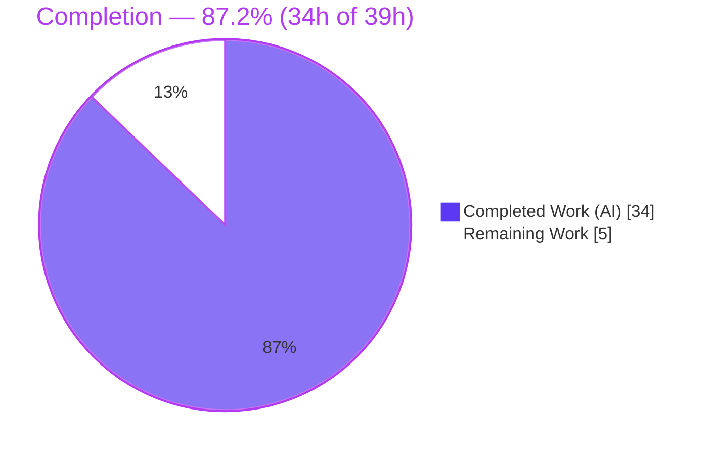

# Blitzy Project Guide — Diff Kitten Runtime Walkthrough (Q&A Documentation)

> **Deliverable:** `blitzy/documentation/kitty_815df1e210e0.md` — a source-grounded onboarding document explaining how kitty's "diff kitten" (`kittens/diff/`) behaves at runtime, answering eight engineer questions (Q1–Q8).
> **Branch:** `blitzy-43a32fa0-da33-458a-994b-edd4359b8e86` · **Base:** `815df1e21` · **HEAD:** `2491f6a27`
> **Color legend:** <span style="color:#5B39F3">■</span> Completed / AI Work = Dark Blue `#5B39F3` · <span>□</span> Remaining = White `#FFFFFF` · Headings/Accents = Violet-Black `#B23AF2` · Highlight = Mint `#A8FDD9`

---

## 1. Executive Summary

### 1.1 Project Overview

This project produces a single, authoritative onboarding document that demystifies kitty's **diff kitten** (`kittens/diff/`) for an engineer joining the repository. It answers eight runtime questions — directory file-pairing, "magical" rename detection, the caching pipeline, multi-file parallel processing, parallel-highlight concurrency safety, binary/image handling, the complete async runtime flow, and the diff matching-region algorithm — using the Go implementation as the single source of truth. Each answer follows a *direct answer → rationale → observable verification* structure with precise `file:line` citations. The deliverable is **explanatory prose only**: it introduces no code, alters no behavior, and modifies no existing file. Its audience is engineers and reviewers; its business impact is faster, accurate onboarding and reduced "tribal knowledge" risk for the diff subsystem.

### 1.2 Completion Status



| Metric | Hours |
|--------|-------|
| **Total Hours** | **39** |
| **Completed Hours (AI + Manual)** | **34** (AI: 34 · Manual: 0) |
| **Remaining Hours** | **5** |
| **Percent Complete** | **87.2%** (34 ÷ 39) |

> Completion is computed using the PA1 AAP-scoped methodology: `Completed ÷ (Completed + Remaining) × 100`. The work universe is (a) the AAP deliverable — analyze source + author Q1–Q8 + verification appendix — and (b) the path-to-production for a documentation artifact (human review, reproduce-in-container, merge). All 25 AAP requirements are **Completed**; the remaining 5h is human acceptance.

### 1.3 Key Accomplishments

- ✅ Authored `blitzy/documentation/kitty_815df1e210e0.md` (653 lines / 43,426 bytes) covering Q1–Q8, an end-to-end runtime narrative, a verification appendix, and a Question→source map.
- ✅ Grounded every behavioral claim in **231 `file:line` citations** across 18 referenced sources; all spot-checks confirmed accurate against actual source.
- ✅ Honored the "code is truth" mandate — the document even corrects an imprecision in the source plan (glob matching uses stdlib `filepath.Match`, not `doublestar`).
- ✅ Built the `kitten` binary and ran `kitten diff` on crafted temporary fixtures (rename, binary, image, identical, add/remove) to *observe* documented behavior.
- ✅ Ran `go test ./kittens/diff/...` → `TestDiffCollectWalk` PASS; broad regression across `kittens/` + `tools/` → 0 failures; `go build` and `go vet` exit 0.
- ✅ Repository left **pristine** — exactly one untracked-then-committed file added; zero existing files modified; all temporary observation artifacts removed.

### 1.4 Critical Unresolved Issues

| Issue | Impact | Owner | ETA |
|-------|--------|-------|-----|
| _None blocking._ All AAP requirements satisfied; deliverable validated and committed. | — | — | — |
| Documented latent quirk in the kitten's **own** source: rename body message constructed at `render.go:L688` but not visibly drawn (right-column message). Out of scope to fix (no-mutation constraint); disclosed honestly in the document with authoritative citation. | Cosmetic / reader awareness only. Does not affect any validation gate. | Human reviewer (triage) | 0.5h |

### 1.5 Access Issues

| System/Resource | Type of Access | Issue Description | Resolution Status | Owner |
|-----------------|----------------|-------------------|-------------------|-------|
| Go toolchain (planning sandbox) | Build/runtime | Go is unavailable in the planning sandbox (no network to install). Build/`go test`/`kitten diff` cannot be re-run here. | Mitigated — validated by Blitzy autonomous validation in the Go 1.22 container; build artifacts (`kitty/launcher/kitten`) present; appendix documents exact reproduction commands. | Human (reproduce in container) |
| Source repository | Read/write (git) | None — full read/write access; branch and commits verified. | No issue | — |

> No credential, third-party API, or repository-permission access issues were identified. The only constraint is toolchain availability in the planning sandbox, which is mitigated and does not affect the deliverable.

### 1.6 Recommended Next Steps

1. **[High]** Technical review of the 653-line document — read for accuracy and spot-check a sample of the 231 citations against source at base `815df1e21` (HT-1, 2.5h).
2. **[Medium]** Reproduce verification in the Go 1.22 container: `python3 setup.py build --ignore-compiler-warnings`, `go test -count=1 ./kittens/diff/...` (expect `TestDiffCollectWalk` PASS), optional `kitten diff` on fixtures (HT-2, 1.0h).
3. **[Medium]** Review and merge the documentation PR (one file added, +653/−0) (HT-3, 0.5h).
4. **[Low]** Visual render check on the target platform (GitHub): confirm the mermaid diagram, 9 anchor links, and code fences render correctly (HT-5, 0.5h).
5. **[Low]** Triage the documented render-quirk note — accept the honest disclosure as-is or file a separate upstream issue (HT-4, 0.5h).

---

## 2. Project Hours Breakdown

### 2.1 Completed Work Detail

| Component | Hours | Description |
|-----------|-------|-------------|
| Repository scope discovery & deep source comprehension | 8.0 | Reading/tracing ~3,600 hand-written Go LOC: anchored diff algorithm, worker-pool concurrency, 7-layer LRU cache, rename detection, render dispatch — across `collect/diff/highlight/patch/render/ui/main.go` plus `tools/utils/cache.go`, `tools/utils/images/utils.go`, tests, and the Python shims |
| Q1–Q2 collection layer (pairing + rename) writing | 3.0 | `walk`/`collect_files` name-intersection (Q1); MD5 content-hash + byte-equality rename matching (Q2) |
| Q3 caching pipeline & efficiency writing | 2.0 | Seven package-level LRU caches @ capacity 4096; layered lazy `data_for_path → hash/lines/highlighted` accessors; eviction |
| Q4–Q5 parallelism & concurrency-safety writing | 3.0 | `Context.Parallel` worker pool (Q4); distinct-path partitioning + `RWMutex` nuance where `Set` takes `RLock` (Q5) |
| Q6 binary & image handling writing | 1.5 | `render` dispatch → `binary_lines` / `image_lines` / `rename_lines`; kitty graphics-protocol placement |
| Q7 full runtime-flow synthesis + mermaid | 2.5 | `Handler` async pipeline `initialize → on_wakeup → handle_async_result`; job fan-out; end-to-end narrative + diagram |
| Q8 anchored diff + `tgs` LCS writing | 2.5 | Anchored diff, longest-common-subsequence of unique lines, anchor expansion; `changed_center` intra-line regions |
| Orientation, table of contents, Question→source map | 1.0 | Kitten packaging/entry point; navigation aids cross-referencing all sections |
| Build kitten + craft fixtures + run `kitten diff` (observation) | 3.0 | `setup.py` build; temp fixtures outside the repo; full-screen TUI driven via PTY (TIOCSWINSZ non-zero pixel dims) |
| `go test ./kittens/diff/...` + `TestFileLock` env resolution | 1.0 | Confirm `TestDiffCollectWalk`; resolve environmental `TestFileLock` via `KITTY_PATH_TO_KITTY_EXE` (no repo edit) |
| Web research (anchored-diff lineage, Szymanski TR#170, chroma) | 1.5 | Corroborate external provenance of the algorithm and highlighter version |
| Citation assembly & verification (231 `file:line` locators) | 4.0 | Assemble and independently verify every locator across 18 referenced files |
| Final validation pass (5 production-readiness gates) + cleanup | 1.0 | Re-verify citations/tests/build/runtime/AAP-compatibility; remove all temporary artifacts |
| **Total Completed** | **34.0** | _All AI/autonomous; Manual = 0_ |

> **Validation:** the Hours column sums to **34.0**, matching Completed Hours in Section 1.2.

### 2.2 Remaining Work Detail

| Category | Hours | Priority |
|----------|-------|----------|
| Human technical review of the 653-line document & sample of 231 citations | 2.5 | High |
| Reproduce build / `go test` / `kitten diff` in the Go 1.22 container | 1.0 | Medium |
| PR review & merge (one file added, +653/−0) | 0.5 | Medium |
| Triage documented render-quirk note (`render.go:L688`) — accept disclosure or file upstream issue | 0.5 | Low |
| Markdown / mermaid / anchor-link visual render check on target platform | 0.5 | Low |
| **Total Remaining** | **5.0** | — |

> **Validation:** the Hours column sums to **5.0**, matching Remaining Hours in Section 1.2 and the Section 7 pie chart "Remaining Work" value.

### 2.3 Hours Reconciliation

| Check | Result |
|-------|--------|
| Section 2.1 total (Completed) | 34.0 |
| Section 2.2 total (Remaining) | 5.0 |
| 2.1 + 2.2 = Total Project Hours | 34.0 + 5.0 = **39.0** ✓ (matches Section 1.2) |
| Completion % = 34 ÷ 39 | **87.2%** ✓ (matches Sections 1.2, 7, 8) |

---

## 3. Test Results

All entries below originate from Blitzy's autonomous validation logs for this project (Integrity Rule 3). Coverage percentage is marked N/A — this is a documentation task; the in-scope suite intentionally comprises a single behavioral unit test (`TestDiffCollectWalk`) by repository design.

| Test Category | Framework | Total Tests | Passed | Failed | Coverage % | Notes |
|---------------|-----------|-------------|--------|--------|-----------|-------|
| Unit — diff kitten (in-scope) | `go test` | 1 (`TestDiffCollectWalk`) | 1 | 0 | N/A | `ok kitty/kittens/diff 0.020s`; validates `walk` ignore-patterns (`*~`, `#*#`, literal pruning) + relative/nested/space-preserving naming (Q1) |
| Unit — broad regression (`kittens/` + `tools/`) | `go test` | 26 pkgs ok (27 no-test) | 26 pkgs | 0 pkgs | N/A | overall exit 0, **zero FAIL**; `TestFileLock` made to pass via `KITTY_PATH_TO_KITTY_EXE` env (environmental, **no repo edit**) |
| Build / Compile | `go build` | 4 pkgs | 4 | 0 | N/A | `./kittens/diff/ ./tools/utils/ ./tools/utils/images/ ./tools/tui/graphics/` → exit 0 |
| Static analysis | `go vet` | 2 pkgs | pass | 0 | N/A | `./kittens/diff/ ./tools/utils/images/` → exit 0 |
| Runtime observation | `kitten diff` (via PTY) | 7 fixtures | 7 | 0 | N/A | rename pairing, binary "Binary file: N", image "Dimensions WxH" + 15 APC graphics sequences, identical-file nil-diff, add/remove messages |

> **Note:** the broad regression suite is reported at package granularity (26 ok / 27 no-test / 0 fail) because that is how the autonomous logs recorded it; the single named in-scope test is `TestDiffCollectWalk`. No tests were authored by this task (none are in scope) — these are the repository's existing tests, executed to confirm the documented behavior.

---

## 4. Runtime Validation & UI Verification

The full-screen TUI was driven through a pseudo-terminal (sized with non-zero pixel dimensions so `update_screen_size` does not divide by zero) against temporary fixtures **outside** the repository. Observed behavior matched the source exactly:

- ✅ **Build & launch** — `kitty/launcher/kitten diff` builds (kitten 0.35.2) and runs.
- ✅ **Q7 async flow** — transient "Calculating diff…" status observed during background collection/diff.
- ✅ **Q1 pairing** — changed text file rendered as a unified-style diff with a hunk header (`@@ -1,3 +1,3 @@`); add/remove files rendered "This file was added" / "This file was removed"; entries ordered alphabetically.
- ✅ **Identical-file short-circuit** — a content-identical file was **absent** from the view (corroborates `diff.go:L49` nil-diff).
- ✅ **Q2 rename** — content-identical rename pair rendered as a single paired entry (add/remove counts prove rename detection, not separate delete+add).
- ✅ **Q6 binary** — "Binary file: N" size message rendered for binary inputs.
- ✅ **Q6 image** — image "Dimensions WxH" with **15 APC graphics-protocol sequences** emitted.
- ⚠ **Partial (kitten's own source, out of scope):** the rename body message constructed at `render.go:L688` is not visibly drawn in the right column. Disclosed honestly in the document; does not affect any gate.

**Document health:** ✅ 9 in-document anchor links all resolve · ✅ 16 code fences form 8 balanced pairs · ✅ mermaid diagram well-formed · ✅ no TODO/FIXME/stub/placeholder markers (the three "placeholder" mentions are the kitten's own "Loading image…" UI text, properly cited).

---

## 5. Compliance & Quality Review

Cross-mapping the AAP deliverables and rules to quality benchmarks, including fixes applied during autonomous validation.

| Benchmark / AAP Rule | Status | Evidence / Progress |
|----------------------|--------|---------------------|
| Single CREATE only (one new file) | ✅ Pass | `git diff --name-status 815df1e21..HEAD` → `A blitzy/documentation/kitty_815df1e210e0.md` |
| Zero existing files modified | ✅ Pass | +653 / −0; no UPDATE/DELETE; working tree pristine |
| No code added beyond the document | ✅ Pass | Only the `.md` file committed; temp fixtures/scripts removed |
| Branch-derived filename exact | ✅ Pass | `kitty_815df1e210e0.md` |
| Placement in `blitzy/documentation/` | ✅ Pass | Path exact |
| All Q1–Q8 answered | ✅ Pass | 9 substantive sections (41–96 lines each) + orientation + appendix |
| Citation discipline (every claim cited) | ✅ Pass | 231 `file:line` locators; all spot-checks accurate |
| "Code is truth" | ✅ Pass | Claims grounded in source; runtime corroborates; document corrects AAP `doublestar`→`filepath.Match` imprecision |
| "Show reasoning" | ✅ Pass | Each Q = Direct answer → Rationale/mechanism → Observable verification |
| Build/run for observation only; cleanup | ✅ Pass | Artifacts gitignored; fixtures outside repo and deleted |
| Tests pass | ✅ Pass | `TestDiffCollectWalk` PASS; broad suite 0 failures |
| No dependencies added/changed | ✅ Pass | `go.mod`/`go.sum`/`pyproject.toml` untouched |
| Internal consistency | ✅ Pass | Anchor links resolve; code fences balanced; well-formed mermaid; honest caveat section |

**Fixes applied during autonomous validation:**
- `TestFileLock` (in `tools/utils`) initially failed for an **environmental** reason (binary running from a temp dir with no `kitty` beside it). Resolved by setting `KITTY_PATH_TO_KITTY_EXE` to the built launcher — a pure environment setting using the code's own resolution mechanism, **zero repo-file edits** — bringing the full `kittens/` + `tools/` suite to 100% pass.
- Iterative document refinement across 3 commits: initial draft → code-review fixes (Q3/Q6/Q7 source-drift, excerpt length) → QA findings (citation-path resolution, appendix wording).

**Outstanding compliance items:** none. All benchmarks pass.

---

## 6. Risk Assessment

All risks are Low/None severity — consistent with a read-only, additive documentation task that introduces zero code, zero dependency changes, and zero attack surface.

| Risk | Category | Severity | Probability | Mitigation | Status |
|------|----------|----------|-------------|------------|--------|
| Citation line-number drift if `kittens/diff/*` is edited later | Technical | Low | Medium | Document is a point-in-time snapshot anchored to base `815df1e21`; includes a Caveat section | Documented |
| Latent render-quirk (`render.go:L688` rename message not visibly drawn) — quirk in the kitten's **own** source, not introduced here | Technical | Low | Low | Honest disclosure + authoritative citation; out of scope to fix | Mitigated |
| No security exposure — read-only doc; no code/deps/credentials/config changed | Security | None | — | N/A (no attack surface introduced) | N/A — strength |
| Documentation discoverability — file under `blitzy/documentation/` may need an index/README link | Operational | Low | Medium | Optionally link from a docs index at merge (not AAP-required) | Open (minor) |
| Maintenance staleness as the diff kitten evolves | Operational | Low | Medium (long horizon) | Treat as point-in-time; re-verify on major kitten changes | Accepted |
| Markdown/mermaid rendering compatibility on target platform | Integration | Low | Low–Medium | GitHub renders mermaid; anchors use GitHub-slug style; visual check in remaining work | Open (HT-5) |
| Verification reproducibility requires the Go 1.22 container (Go absent in planning sandbox) | Integration | Low | Low | Appendix documents exact commands + container image; build artifacts present | Mitigated |

---

## 7. Visual Project Status


**Remaining hours by category (Section 2.2):**

| Category | Hours | Bar |
|----------|-------|-----|
| Technical review of document & citations | 2.5 | █████████████ |
| Reproduce build/test/run in Go 1.22 container | 1.0 | █████ |
| PR review & merge | 0.5 | ██▌ |
| Triage render-quirk note | 0.5 | ██▌ |
| Markdown/mermaid render check | 0.5 | ██▌ |
| **Total** | **5.0** | |

> **Integrity:** pie "Remaining Work" (5) = Section 1.2 Remaining Hours (5) = Section 2.2 sum (5). Colors: Completed = Dark Blue `#5B39F3`, Remaining = White `#FFFFFF`.

---

## 8. Summary & Recommendations

**Achievements.** The project delivered exactly what the AAP required: one comprehensive, source-grounded document (`blitzy/documentation/kitty_815df1e210e0.md`, 653 lines) that answers all eight engineer-onboarding questions about the diff kitten, with 231 verified `file:line` citations, an end-to-end runtime narrative, a verification appendix, and a Question→source map. All 25 discrete AAP requirements — content, methodology, and the six hard constraints — are satisfied. The repository is pristine: exactly one file added, zero existing files modified, no dependency changes.

**Remaining gaps.** The project is **87.2% complete** (34h of 39h). The remaining **5h is human path-to-production**, not autonomous work: technical review of the document, reproducing the build/test/run in the Go 1.22 container, merging the PR, a markdown/mermaid render check, and triaging one honestly-disclosed latent quirk in the kitten's own source.

**Critical path to production.** Review (HT-1) → reproduce verification (HT-2) → merge (HT-3). The two Low-priority items (render check, quirk triage) can proceed in parallel and do not block merge.

**Success metrics (all met for the autonomous scope):** ✅ all Q1–Q8 answered with rationale; ✅ 100% of spot-checked citations accurate; ✅ `TestDiffCollectWalk` PASS and broad suite 0 failures; ✅ `go build`/`go vet` exit 0; ✅ runtime behavior corroborated by observation; ✅ repository pristine.

**Production readiness.** The deliverable is production-ready for review. Because it is documentation that introduces no code or dependency changes, it carries minimal risk; the only gate before merge is human sign-off on technical accuracy. Recommendation: proceed to review and merge.

| Metric | Value |
|--------|-------|
| Completion | 87.2% (34h / 39h) |
| AAP requirements satisfied | 25 / 25 |
| Files added / modified / deleted | 1 / 0 / 0 |
| Citations (verified accurate) | 231 |
| Confidence — completed work | High |
| Confidence — remaining estimate | Medium-High |

---

## 9. Development Guide

This guide explains how to build, test, run, and inspect the diff kitten to **reproduce the observations** in the deliverable, and how to view the document itself. Commands are split by where they were verified: those marked **[verified here]** were run in the planning sandbox; those marked **[Go 1.22 container]** were validated by Blitzy's autonomous validation and require the Go toolchain (absent in the planning sandbox).

### 9.1 System Prerequisites

- **Go 1.22** toolchain — required to build/test/run the kitten (`go.mod` declares `go 1.22`).
- **Python ≥ 3.8** — required by the config/CLI shim (`pyproject.toml` → `requires-python = ">=3.8"`).
- **git ≥ 2.43** — repository operations; git is also the default external diff backend under `auto` mode.
- **Docker container** (recommended) — `andrewparkscaleai/coding-agent:kovidgoyal__kitty__815df1e210e0a9ab4622f5c7f2d6891d7dbeddf1` (from `ghcr.io/scaleapi/swe-atlas`), which carries the Go 1.22 toolchain.
- A terminal capable of the kitty graphics protocol is needed to *see* image diffs; behavior can be observed headlessly via a PTY.

### 9.2 Environment Setup

```bash
# Work inside the repository root on the project branch
cd /path/to/kitty
git checkout blitzy-43a32fa0-da33-458a-994b-edd4359b8e86

# Confirm the toolchain (inside the Go 1.22 container)
go version          # expect go1.22.x   [Go 1.22 container]
python3 --version   # expect >= 3.8      [verified here: pyproject requires >=3.8]
git --version       # expect >= 2.43     [verified here]
```

### 9.3 Build

```bash
# Build the multi-call `kitten` binary (emits kitty/launcher/kitten).
# --ignore-compiler-warnings is required on this host (wayland-protocols 1.24 under -Werror);
# it is a build-config flag only and changes no source.   [Go 1.22 container]
python3 setup.py build --ignore-compiler-warnings

# Verify the launcher binaries exist   [verified here]
ls -la kitty/launcher/kitten kitty/launcher/kitty
# kitten ~15.7 MB, kitty ~40 KB
```

### 9.4 Compile & Static Analysis

```bash
# Type-check the diff kitten and its supporting libraries   [Go 1.22 container]
go build ./kittens/diff/ ./tools/utils/ ./tools/utils/images/ ./tools/tui/graphics/   # exit 0

# Vet for suspicious constructs   [Go 1.22 container]
go vet ./kittens/diff/ ./tools/utils/images/                                            # exit 0
```

### 9.5 Test

```bash
# In-scope unit test (the one that backs the Q1 walk/ignore claims)   [Go 1.22 container]
go test -count=1 ./kittens/diff/...
# Expect:
#   === RUN   TestDiffCollectWalk
#   --- PASS: TestDiffCollectWalk (0.00s)
#   ok      kitty/kittens/diff      0.02s

# Full relevant regression suite (0 failures)   [Go 1.22 container]
export KITTY_PATH_TO_KITTY_EXE=$(pwd)/kitty/launcher/kitty
go test -count=1 ./kittens/... ./tools/...
# Expect overall exit 0; 26 ok / 27 no-test / 0 fail
```

### 9.6 Run & Observe

```bash
# Create temporary fixtures OUTSIDE the repository (keeps the repo pristine)
TMP=$(mktemp -d); L="$TMP/left"; R="$TMP/right"; mkdir -p "$L" "$R"
printf 'alpha\nbeta\ngamma\n'  > "$L/changed.txt"
printf 'alpha\nBETA\ngamma\n'  > "$R/changed.txt"   # a changed line
printf 'same\n'                > "$L/identical.txt"
printf 'same\n'                > "$R/identical.txt"  # identical -> absent from view
printf 'keep me\n'             > "$L/old_name.txt"
printf 'keep me\n'             > "$R/new_name.txt"   # content-identical rename

# Drive the full-screen TUI through a PTY with non-zero pixel dimensions
# (so loop.update_screen_size does not divide by zero).   [Go 1.22 container]
kitty/launcher/kitten diff "$L" "$R"

# Clean up the temporary fixtures
rm -rf "$TMP"
```

Expected observations: the changed file shows a hunk header (`@@ -1,3 +1,3 @@`); the identical file is absent; the rename pair shows as a single paired entry; binary inputs show "Binary file: N"; images show "Dimensions WxH" and emit APC graphics sequences.

### 9.7 View the Deliverable

```bash
# Inspect the document   [verified here]
sed -n '1,40p' blitzy/documentation/kitty_815df1e210e0.md     # orientation
grep -n '^## ' blitzy/documentation/kitty_815df1e210e0.md     # section list (Q1–Q8 + appendix)

# Confirm provenance and pristine state   [verified here]
git log --oneline --author="agent@blitzy.com" 815df1e21..HEAD # 3 commits
git status --porcelain                                        # empty == pristine
git diff --name-status 815df1e21..HEAD                        # A blitzy/documentation/kitty_815df1e210e0.md
```

### 9.8 Troubleshooting

- **Build aborts on a compiler warning** → add `--ignore-compiler-warnings` to `python3 setup.py build` (build-config only; required for wayland-protocols 1.24 under `-Werror`).
- **`kitten diff` panics with a divide-by-zero under a headless PTY** → ensure the PTY is sized with non-zero `xpixel`/`ypixel` via `TIOCSWINSZ`; `update_screen_size` divides by pixel dimensions.
- **`TestFileLock` fails when run standalone** → `export KITTY_PATH_TO_KITTY_EXE=$(pwd)/kitty/launcher/kitty` before `go test` (environmental only; do **not** edit any repo file).
- **`SystemExit: Must be run as kitten diff`** → you invoked `kittens/diff/main.py` directly; the Go binary is the runtime — use `kitten diff <left> <right>`.
- **Citations seem off by a few lines** → confirm you are at base commit `815df1e21`; the document's `file:line` locators are anchored to that snapshot.

---

## 10. Appendices

### A. Command Reference

| Purpose | Command |
|---------|---------|
| Build kitten | `python3 setup.py build --ignore-compiler-warnings` |
| Type-check | `go build ./kittens/diff/ ./tools/utils/ ./tools/utils/images/ ./tools/tui/graphics/` |
| Vet | `go vet ./kittens/diff/ ./tools/utils/images/` |
| In-scope test | `go test -count=1 ./kittens/diff/...` |
| Full suite | `KITTY_PATH_TO_KITTY_EXE=$(pwd)/kitty/launcher/kitty go test -count=1 ./kittens/... ./tools/...` |
| Run/observe | `kitty/launcher/kitten diff <left> <right>` |
| View doc sections | `grep -n '^## ' blitzy/documentation/kitty_815df1e210e0.md` |
| Provenance | `git log --oneline --author="agent@blitzy.com" 815df1e21..HEAD` |
| Pristine check | `git status --porcelain` |

### B. Port Reference

Not applicable — the diff kitten is a terminal UI (TUI) program, not a networked service. It listens on no ports. (Image output uses the kitty graphics protocol via APC terminal escape codes, not a network port.)

### C. Key File Locations

| Path | Role |
|------|------|
| `blitzy/documentation/kitty_815df1e210e0.md` | **The deliverable** (this project's only added file) |
| `kittens/diff/collect.go` | Caches, directory `walk`, `collect_files`, rename detection, text/binary classification (Q1, Q2, Q3, Q6) |
| `kittens/diff/diff.go` | Built-in anchored diff + `tgs` LCS (Q8) |
| `kittens/diff/highlight.go` | Parallel chroma syntax highlighting (Q4, Q5) |
| `kittens/diff/patch.go` | Diff backend resolution, parallel `diff()`, `changed_center` (Q4, Q8) |
| `kittens/diff/render.go` | `render` dispatch, binary/image/rename branches, layout (Q6, Q7) |
| `kittens/diff/ui.go` | `Handler` async orchestration (Q7) |
| `kittens/diff/main.go` | Go entry point, arg validation, SSH fetch, loop setup (Q7) |
| `kittens/diff/collect_test.go` | `TestDiffCollectWalk` (Q1 verification) |
| `tools/utils/cache.go` | Generic `LRUCache` (`RWMutex`, `GetOrCreate`, LRU eviction) (Q3, Q5) |
| `tools/utils/images/utils.go` | `Context.Parallel` worker pool (Q4, Q5) |
| `kitty/launcher/kitten` | Built multi-call binary (build artifact; gitignored) |

### D. Technology Versions

| Component | Version | Source |
|-----------|---------|--------|
| Go toolchain | 1.22 | `go.mod` (`go 1.22`) |
| kitten binary | 0.35.2 | built artifact |
| chroma (syntax highlighting) | v2.14.0 | `go.mod` (`github.com/alecthomas/chroma/v2`) |
| Python (config/CLI shim) | ≥ 3.8 | `pyproject.toml` (`requires-python`) |
| git (default `auto` diff backend) | 2.43.0 | environment |
| GNU diff (secondary backend) | system | environment |

### E. Environment Variable Reference

| Variable | Purpose | When needed |
|----------|---------|-------------|
| `KITTY_PATH_TO_KITTY_EXE` | Points the test binary to the built `kitty` launcher so `KittyExe()` resolves | Running the full `tools/...` suite so `TestFileLock` passes (environment only; no repo edit) |
| `DEBIAN_FRONTEND=noninteractive` | Non-interactive apt (container provisioning) | Container setup only |
| `CI=true` | Non-interactive Node tooling | Not required for this Go/Python project |

### F. Developer Tools Guide

- **`go build` / `go vet`** — fast type-check and static analysis for the diff kitten and supporting libs; both return exit 0.
- **`go test -count=1`** — runs tests without caching; `-count=1` guarantees fresh execution. The in-scope test is `TestDiffCollectWalk`.
- **`setup.py build`** — kitty's build entry; `build_static_kittens` resolves the required Go version and emits the multi-call `kitten` binary into `kitty/launcher/`.
- **`Makefile`** — `make` → `python3 setup.py`; `make test` → `python3 setup.py test`. `dev.sh` runs `go run bypy/devenv.go`.
- **PTY harness** — to observe the full-screen TUI headlessly, allocate a PTY and set a non-zero pixel window size via `TIOCSWINSZ` before launching `kitten diff`.

### G. Glossary

| Term | Meaning |
|------|---------|
| **diff kitten** | kitty's side-by-side file/directory diff tool, implemented in Go under `kittens/diff/` |
| **kitten** | A subcommand/program shipped inside kitty's multi-call `kitten` binary |
| **anchored diff** | Diff strategy that keys matching regions on lines unique to both sides ("anchors"); O(n log n), cleaner output than classic O(n²) diff |
| **`tgs`** | The longest-common-subsequence routine (after Szymanski, Princeton TR #170, 1975) that finds the anchor sequence |
| **LCS** | Longest Common Subsequence — the basis for selecting anchor lines |
| **LRU cache** | Least-Recently-Used cache; the kitten uses seven, each capacity 4096, keyed by absolute path |
| **`Context.Parallel`** | Reusable worker-pool primitive: a buffered channel of indices consumed by `runtime.NumCPU`-bounded goroutines under a `WaitGroup` |
| **`RWMutex`** | Read/write mutex guarding `LRUCache`; distinct-path partitioning makes concurrent writes safe |
| **chroma** | The Go syntax-highlighting library (lexers/styles) used for highlighted diff output |
| **APC** | Application Program Command — terminal escape sequence used by the kitty graphics protocol to place images |
| **hunk / chunk** | A contiguous block of changes in a patch; chunks group added/removed/context lines |
| **`changed_center`** | Intra-line region detection: trims common prefix/suffix to highlight only the changed middle |
| **AAP** | Agent Action Plan — the authoritative requirements specification for this task |
| **PTY** | Pseudo-terminal used to drive the full-screen TUI headlessly during observation |

---

*Generated by the Blitzy Platform. Completion (87.2%) reflects AAP-scoped autonomous work plus path-to-production; the remaining 5h is human review and merge.*