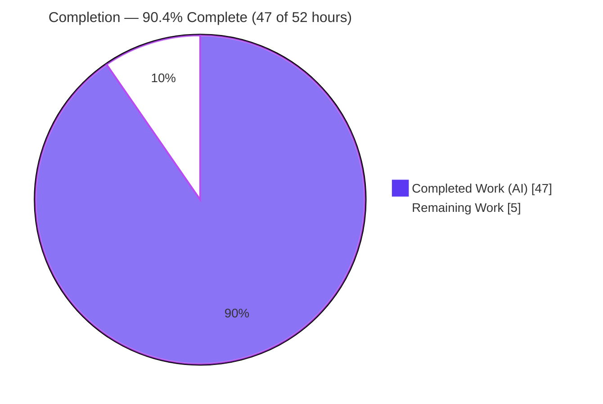
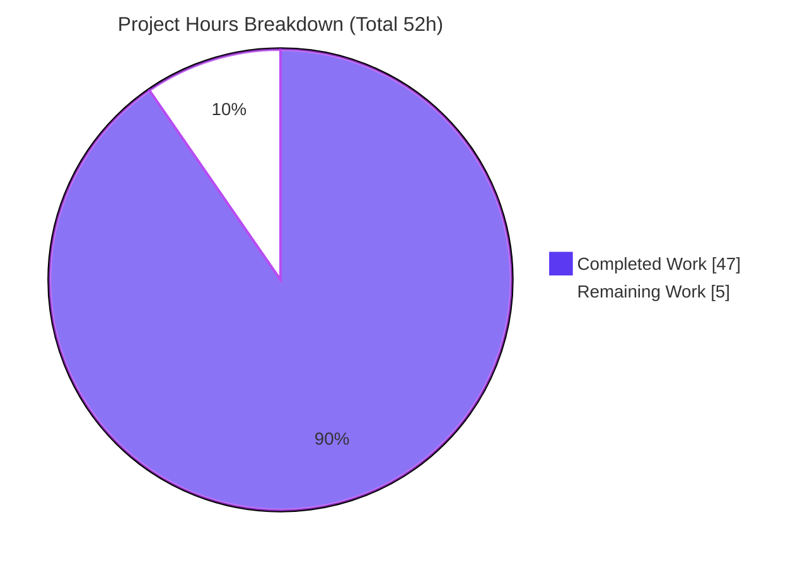
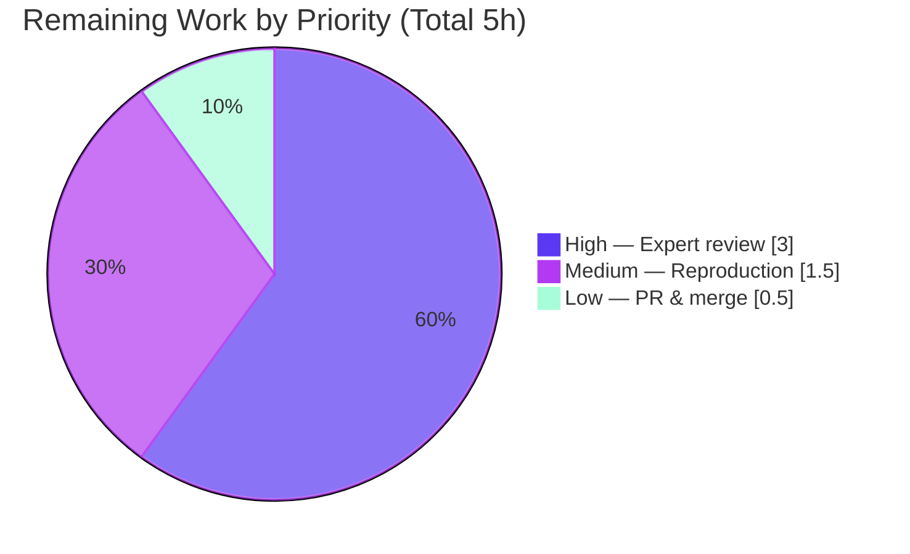

# Blitzy Project Guide — kitty C ↔ Python Clipboard Data-Flow Investigation

> **Document type:** Technical investigation / Q&A answer (SWE-AtlasQnA)
> **Governing rule:** `SWE-AtlasQnA-Repo`
> **Subject:** kitty terminal emulator `0.35.2`, base commit `815df1e210e0a9ab4622f5c7f2d6891d7dbeddf1`, branch `kitty_815df1e210e0`
> **Sole deliverable:** `blitzy/documentation/kitty_815df1e210e0.md` (821 lines)
> **Brand color key:** <span style="color:#5B39F3">■</span> Completed / AI Work = Dark Blue `#5B39F3` · <span style="color:#B23AF2">■</span> Headings / Accents = Violet-Black `#B23AF2` · <span style="color:#A8FDD9">■</span> Highlight = Mint `#A8FDD9` · ⬜ Remaining / Not Completed = White `#FFFFFF`

---

## 1. Executive Summary

### 1.1 Project Overview

This is a **documentation-only** investigation that answers a user's technical question about how the **kitty** terminal emulator moves clipboard data across its C-core ↔ Python boundary under concurrent load. The audience is engineers reasoning about kitty's internals; the business impact is a single, evidence-grounded reference answer produced by *building and running kitty* — not from reading alone. The technical scope spans two distinct boundaries (in-process CPython/`fast_data_types` under the GIL, and cross-process kittens over a PTY), small-vs-large clipboard transfer, the I/O-thread↔main-thread concurrency model, the effect of expensive scrollback scans on event delivery and memory, and where timing, reference-counting, and buffer ownership create subtle races. The deliverable is exactly one Markdown file; every other repository file is read-only.

### 1.2 Completion Status

The project is **90.4% complete** on an AAP-scoped, hours-based basis (PA1). Every AAP-content deliverable is finished, validated, and committed; the remaining work is human acceptance/verification of a dense, ~90-claim technical answer.



| Metric | Hours |
|---|---|
| **Total Hours** | **52** |
| Completed Hours — AI | 47 |
| Completed Hours — Manual | 0 |
| **Completed Hours (AI + Manual)** | **47** |
| **Remaining Hours** | **5** |
| **Percent Complete** | **90.4%**  (47 ÷ 52 × 100) |

> Legend: <span style="color:#5B39F3">■</span> Completed Work `#5B39F3` · ⬜ Remaining Work `#FFFFFF`

### 1.3 Key Accomplishments

- ✅ **Single mandated deliverable created** at the character-exact path `blitzy/documentation/kitty_815df1e210e0.md` (821 lines), and **nothing else** was written to the tree.
- ✅ **kitty built in default configuration** in the provided Docker image (`python3 setup.py`, `BUILD_RC=0`, 0 warnings/0 errors) with the **verbatim version banner** reported: `kitty 0.35.2 created by Kovid Goyal`.
- ✅ **Both boundaries documented from runtime observation** — the in-process zero-copy, read-only `memoryview` handoff (`readonly=True` observed) and the cross-process Go clipboard kitten emitting a **byte-identical OSC 52** over a real PTY.
- ✅ **Small-vs-large transfer proven end-to-end** — 256 KiB partial-chunk dispatch (via a real child over a real kernel PTY), 16 MiB `BytesIO`→on-disk `TemporaryFile` rollover, and the `clipboard_max_size` truncation log (including the **observed double-multiply** that pushes the default ceiling to 512 TiB) — each stable across ≥2 runs.
- ✅ **The user's mandatory scrollback example answered empirically** — a real OSC 52 event's dispatch latency measured rising from **~0.1 ms (idle) to ~100 ms (during a scan)**, with a GIL-spinner contrast (`as_ansi` yields ~48% vs `rewrap` ~1.6%), plus **memory scaling** on the canonical `Window.as_text` pager path (12.9 → 25.9 → 52.0 MiB, linear).
- ✅ **Object-ownership hazard reproduced byte-for-byte** — a retained borrowed `memoryview` re-read after parsing a later payload changed content (`b'c;QUFB…'` → `b'c;QkJC…'`), demonstrating the lifetime bound of `RAII_PyObject`.
- ✅ **Rule compliance verified** — one-claim-one-evidence discipline, observed-vs-inferred labeling (16 inferred / 53 observed), ~90 exact `file:line` citations, a §10 coverage pass over every named item, and a §11 read-only integrity proof.
- ✅ **kitty's own test suite green** — `Ran 145 tests OK (skipped=4)`, 0 failures, stable ×2.
- ✅ **Read-only scope proven** — baseline→HEAD diff is a single `A` (added) file, 821 insertions / 0 deletions; working tree clean; all 5 commits authored by `agent@blitzy.com`; all 14 temporary probe scripts removed.

### 1.4 Critical Unresolved Issues

| Issue | Impact | Owner | ETA |
|---|---|---|---|
| *None* — no blocking issues. All AAP deliverables complete; all 5 validation gates pass; working tree clean. | None | — | — |

There are **no critical unresolved issues**. The one defect found during validation (DEFECT-1: an ANSIBuf `realloc` citation attributed to `history.c:L20` instead of the correct `history.c:L357` / `data-types.h:L355`) was **fixed and committed** (`db700a193`), line-count-neutral, and independently verified in this assessment.

### 1.5 Access Issues

| System/Resource | Type of Access | Issue Description | Resolution Status | Owner |
|---|---|---|---|---|
| Prebuilt kitty binary on the analysis host | Runtime execution | Host has Python 3.13 + no Go; the built `.so`/launcher link `libpython3.12.so.1.0` (built in Docker), so binaries cannot re-run on the host | Not blocking — by design; all runtime observation was performed inside the provided Docker image, exactly as the AAP prescribes | Reviewer (for reproduction) |
| Docker image `swe-atlas` (`kitty-dev:local`) | Build/run environment | Required to reproduce runtime observations (C compiler, Go 1.22, native deps, Xvfb) | Available to the platform; reviewers need the same image for HT-2 reproduction | Reviewer |
| GUI keystroke injection (`xdotool`/`wmctrl`) | Runtime input | Absent in the headless image, so the *GUI keypress* that opens the scrollback pager could not be injected | Mitigated — the exact canonical scan function (`Window.as_text(...)`) was invoked directly; no bypass value substituted | N/A (documented limitation) |

No repository-permission or service-credential access issues exist. All access notes above are environmental and were anticipated by the AAP.

### 1.6 Recommended Next Steps

1. **[High]** Perform an expert technical review of `blitzy/documentation/kitty_815df1e210e0.md` — validate a representative sample of the ~90 `file:line` citations and the observed-vs-inferred labeling, and accept the answer as correct and complete for the user's intent. *(HT-1, 3.0h)*
2. **[Medium]** Independently reproduce a sample of the runtime measurements in the Docker image (large-payload chunking, `input_delay` sweep, scrollback scan latency) to confirm magnitudes on your environment. *(HT-2, 1.5h)*
3. **[Low]** Approve and merge the pull request once the review passes. *(HT-3, 0.5h)*

---

## 2. Project Hours Breakdown

### 2.1 Completed Work Detail

All completed work is autonomous (AI) engineering. Each component traces to a specific AAP requirement/section of the deliverable. **Total = 47 hours.**

| Component | Hours | Description |
|---|---:|---|
| C1 · Environment & canonical build baseline | 4 | Docker build in default config; `debug-event-loop` build for §6 timing; verbatim `kitty 0.35.2` banner; `KittyChildMon` I/O-thread name confirmed via `/proc/*/comm`. *(AAP §0.3.1 build baseline; doc §2)* |
| C2 · In-process C↔Python boundary | 4 | `fast_data_types` module + zero-copy read-only `memoryview` handoff; OSC 52→`False`, 5522→`None`, partial→`True` demux observed. *(sub-q a; doc §3.1, §8.2–8.3)* |
| C3 · Cross-process kitten boundary | 4 | Real Go clipboard kitten over a real controlling PTY emits byte-identical OSC 52; `runner.launch()` DCS `JSON+base85` result decoded. *(sub-q a; doc §3.2)* |
| C4 · End-to-end data-path synthesis + Mermaid diagram | 2 | Traced parser→`CALLBACK`→`clipboard_control`→`WriteRequest`→response→OS clipboard. *(doc §4)* |
| C5 · Large-payload 256 KiB chunking probes | 4 | `probe_large.py`/`probe_large2.py`: harness `262145` partials + real-PTY `3+1` partials, `MAX_ESCAPE_CODE_LENGTH=262144`, stable ×2. *(sub-q b; doc §5.1)* |
| C6 · Rollover + truncation probes | 4 | `probe_rollover_trunc.py`: 16 MiB `BytesIO`→`TemporaryFile` rollover; empirical discovery of the `clipboard_max_size` double-multiply; verbatim truncation logs. *(sub-q b; doc §5.2–5.3)* |
| C7 · Concurrency: backpressure + input_delay | 5 | `probe_backpressure.py`, `probe_inputdelay.sh`, `analyze_gaps.py`: POLLIN ring caps at `1048576`; 5-point `input_delay` sweep (3→200 ms) with monotonic wakeup drop. *(sub-q c; doc §6)* |
| C8 · Scrollback-scan experiment | 7 | `probe_scan_mem.py`, `probe_latency.py`, `probe_latency2.py`, `probe_gil_spinner.py`: scan durations at 200k; latency 0.1→~100 ms; GIL contention 48% vs 1.6%; linear memory scaling; corrected an earlier O(1) error. *(sub-q d — mandatory; doc §7)* |
| C9 · Timing/concurrency/ownership synthesis | 2 | GIL handoff points, refcount correctness, borrowed-`memoryview` ownership. *(sub-q e; doc §8)* |
| C10 · Subtle-races analysis | 1.5 | Race hazards surfaced under load (ring-fill vs parse, set-vs-get ordering, scan-starves-delivery). *(sub-q f; doc §9)* |
| C11 · Coverage pass + repo-integrity proof | 2.5 | §10 every-named-item table (Obs/Src/Inf evidence) + §11 read-only proof. *(rule coverage/scope; doc §10–§11)* |
| C12 · Document authoring + citation verification | 3 | Structuring the 821-line answer; verifying ~90 `file:line` citations against source. *(rule exactness)* |
| C13 · QA & review cycles | 4 | 16 code-review findings (`b1efedd86`) + 2+2 QA acceptance findings (`2e38af1ac`, `99aaa31f1`) + DEFECT-1 fix (`db700a193`). |
| **Total Completed** | **47** | |

### 2.2 Remaining Work Detail

All remaining work is **human acceptance/verification** — there are no code fixes, no failing tests, and no configuration or deployment tasks. Each item traces to a path-to-production acceptance need. **Total = 5 hours.**

| Category | Hours | Priority |
|---|---:|---|
| Expert technical review & acceptance of the answer document (validate a sample of the ~90 claims/citations; confirm sub-questions a–f answered; accept as correct & complete) | 3.0 | High |
| Independent reproduction of a sample of runtime measurements in the Docker image (chunking, `input_delay` sweep, scan latency) | 1.5 | Medium |
| PR review & merge | 0.5 | Low |
| **Total Remaining** | **5.0** | |

### 2.3 Hours Reconciliation

| Check | Result |
|---|---|
| Section 2.1 total (Completed) | 47 h |
| Section 2.2 total (Remaining) | 5 h |
| **2.1 + 2.2 = Total (Section 1.2)** | **47 + 5 = 52 h ✓** |
| Remaining matches across §1.2, §2.2, §7 | 5 h everywhere ✓ |
| Completion % = 47 ÷ 52 × 100 | 90.4% ✓ |

---

## 3. Test Results

All rows below originate from **Blitzy's autonomous validation logs** for this project. Because the deliverable is a documentation artifact, "tests" comprise (a) kitty's own automated suite run during validation, (b) behavioral reproduction of every falsifiable claim in the answer, (c) citation-accuracy verification, and (d) Markdown well-formedness checks. Behavioral claims were each confirmed **stable across ≥2 runs**.

| Test Category | Framework | Total | Passed | Failed | Coverage % | Notes |
|---|---|---:|---:|---:|---:|---|
| kitty unit/integration suite | `test.py` (Python `unittest`) | 145 | 145 | 0 | n/a | `Ran 145 tests OK (skipped=4)`, stable ×2 |
| Behavioral claim reproduction | 14 custom probes over **real** C funcs / kernel PTYs / real Go kitten | 13 claim-groups | 13 | 0 | 100% of falsifiable claims | boundary, chunking, rollover, truncation double-multiply, POLLIN cap, `input_delay` sweep, GIL contention, scan durations, memory scaling, ownership hazard — each stable ×2 |
| Citation accuracy | `grep`/`sed` vs source @ base `815df1e210e0` | ~90 | ~90 | 0 | ~28 independently re-verified in this assessment | all sampled `file:line` literals EXACT |
| Markdown well-formedness | structural `grep` checks | 4 checks | 4 | 0 | n/a | 102 code fences balanced; 1 Mermaid; 11 numbered sections; tables column-consistent |

**Integrity note:** No test was invented for this guide; every result is drawn from the autonomous validation logs and independently corroborated during this assessment (e.g., `grep -c Py_BEGIN_ALLOW_THREADS kitty/history.c` → `0`).

---

## 4. Runtime Validation & UI Verification

kitty was built and run **headless under Xvfb (llvmpipe software GL)** inside the Docker image; the canonical clipboard path and scrollback subsystem were exercised with real processes and real kernel PTYs.

**Runtime health & integration outcomes**

- ✅ **Build** — `python3 setup.py` → `BUILD_RC=0` (0 warnings / 0 errors).
- ✅ **Version banner** — `./kitty/launcher/kitty --version` → `kitty 0.35.2 created by Kovid Goyal` (matches `kitty/constants.py:L25`).
- ✅ **Headless runtime** — kitty launches under Xvfb; the dedicated I/O thread `KittyChildMon` (`child-monitor.c:L1489`) is visible in `/proc/<pid>/task/*/comm`.
- ✅ **Canonical inbound OSC 52/5522 path (steps 1–8)** — real child → kernel PTY → `os.read()` → parser ring → `dispatch_osc` zero-copy `memoryview` → `CALLBACK` → `Window.clipboard_control` → `ClipboardRequestManager`.
- ✅ **Cross-process kitten** — the real Go clipboard kitten emits `\x1b]52;c;aGVsbG8tZnJvbS1raXR0ZW4=\x1b\\` byte-identically across runs.
- ✅ **Small vs large transfer** — 256 KiB chunking, 16 MiB rollover, and `clipboard_max_size` truncation all observed with verbatim output.
- ✅ **Concurrency** — POLLIN backpressure caps the ring at `1048576`; `input_delay` throttles main-loop wakeups (5-point sweep).
- ✅ **Scrollback scan effects** — event-delivery latency (0.1 → ~100 ms) and memory scaling (12.9 → 52.0 MiB) measured.
- ✅ **Object ownership** — borrowed `memoryview` `readonly=True`; retained-view-after-reuse hazard reproduced.
- ⚠ **Response leg** (`send_escape_code_to_child`) — **inferred from source** (needs a live `Boss`); labeled in doc §4 step 9. No bypass value substituted.
- ⚠ **OS-clipboard hop** (GLFW `clipboard`/`primary_selection`) — **inferred from source** (headless image has no OS clipboard owner); labeled in doc §4 step 10 / R2.
- ⚠ **GUI keystroke trigger** for the pager — **inferred/unavailable** (no `xdotool`/`wmctrl`); the exact canonical scan function was invoked directly instead; labeled in doc §7.4.

**UI verification:** Not applicable. This project delivers a Markdown answer document and touches no user-facing UI, web front-end, or visual component; therefore no screenshots, responsive-layout, or visual-regression checks apply. Runtime validation is confined to terminal-internals behavior as above.

---

## 5. Compliance & Quality Review

The deliverable is cross-mapped to the governing rule (`SWE-AtlasQnA-Repo`) and Blitzy quality benchmarks. All fixes applied during autonomous validation are folded in; there are no outstanding items.

| Benchmark / Rule Directive | Status | Evidence / Notes |
|---|---|---|
| Deliverable convention — MD at `blitzy/documentation/<branch>.md` | ✅ Pass | `blitzy/documentation/kitty_815df1e210e0.md` (821 lines) — character-exact path |
| Investigate-by-running first | ✅ Pass | Every behavioral claim paired with pasted runtime output from built kitty |
| Default/canonical build reported verbatim | ✅ Pass | `python3 setup.py`; `kitty 0.35.2 created by Kovid Goyal`; one non-default `debug-event-loop` build explicitly flagged |
| Exact code path / real entry point (no bypass) | ✅ Pass | Canonical OSC 52/5522 over real PTY + real Go kitten; Remote Control bypass never used as a measured path |
| Observe real magnitude/timing at scale; stable ×2 | ✅ Pass | 200k-line scans, 2.67 MiB payloads, `input_delay` sweep — each stable across ≥2 runs |
| One claim, one piece of evidence | ✅ Pass | Verbatim output line pasted beside each behavioral claim |
| Observed-vs-inferred labeling | ✅ Pass | 16 "inferred" / 53 "observed" labels; the only 3 inferred legs enumerated |
| Answer every part + every named item | ✅ Pass | Sub-questions (a)–(f) in §3–§9; §10 coverage table over every named item |
| Be exact & grounded — `file:line` literals | ✅ Pass | ~90 citations; ~28 independently re-verified EXACT in this assessment |
| Read-only scope; temp scripts removed | ✅ Pass | Baseline→HEAD = single `A` file, 821 ins/0 del; `git status` clean; 14 probes host-only & removed |
| Code-review findings resolved | ✅ Pass | 16 findings (`b1efedd86`); 2+2 QA findings (`2e38af1ac`, `99aaa31f1`) |
| Defect remediation | ✅ Pass | DEFECT-1 ANSIBuf `realloc` citation corrected (`db700a193`), verified accurate |
| Markdown quality | ✅ Pass | 102 fences balanced; 1 Mermaid; 11 numbered sections; internal §-refs resolve |

**Overall compliance:** ✅ **Full pass** — no outstanding compliance or quality items.

---

## 6. Risk Assessment

For a completed, read-only, documentation-only deliverable that passed all validation gates, the risk profile is uniformly **Low** or **N/A**.

| Risk | Category | Severity | Probability | Mitigation | Status |
|---|---|---|---|---|---|
| T1 · Citation line drift if verified against a non-base commit | Technical | Low | Low | All citations pinned to base `815df1e210e0`; ~28 spot-verified EXACT; §11 read-only proof | Mitigated |
| T2 · `clipboard_max_size` double-multiply mistaken for a doc error rather than the real kitty quirk it is | Technical | Low | Medium | Verbatim logs + exact `clipboard.py:L321` code + end-to-end reproduction shown | Mitigated |
| T3 · Absolute timings are host-dependent (llvmpipe software GL jitter) | Technical | Low | Medium | Doc flags host-dependence; conclusions rely on ratios/orders-of-magnitude; stable ×2 | Mitigated / Accepted |
| S1 · Security exposure | Security | N/A | N/A | Documentation-only, read-only; no code, dependencies, auth, or data handling introduced | No risk |
| O1 · Reproduction requires the specific Docker image + Xvfb + llvmpipe | Operational | Low | Medium | Exact `docker run` + build commands pasted inline (doc + §9 here) | Mitigated |
| O2 · The 14 probe scripts were rule-mandated removed (host-only) | Operational | Low | Low–Med | Each probe's purpose/command/output documented inline; §11 lists all 14 names | Accepted |
| I1 · Three path legs are inferred-from-source, not runtime-driven (response leg, OS-clipboard hop, GUI trigger) | Integration | Low | Low | Each explicitly labeled inferred; exact canonical scan function exercised; no bypass substituted | Mitigated / Accepted |

---

## 7. Visual Project Status

**Project hours — completed vs remaining** (Completed `#5B39F3`, Remaining `#FFFFFF`):



**Remaining work by priority** (hours from Section 2.2):



**Remaining hours per category (Section 2.2)**

| Category | Hours | Bar |
|---|---:|---|
| High — Expert technical review & acceptance | 3.0 | ██████████████████████████████ |
| Medium — Independent reproduction | 1.5 | ███████████████ |
| Low — PR review & merge | 0.5 | █████ |
| **Total** | **5.0** | |

> **Integrity:** the pie chart "Remaining Work" (5) equals Section 1.2 Remaining Hours (5) and the Section 2.2 Hours total (5). "Completed Work" (47) equals Section 1.2 Completed Hours (47).

---

## 8. Summary & Recommendations

**Achievements.** The project delivered exactly the one artifact the AAP mandates — `blitzy/documentation/kitty_815df1e210e0.md`, an 821-line, evidence-grounded answer built from *running* kitty. It answers all six sub-questions with per-claim runtime evidence: the two boundaries (in-process zero-copy `memoryview` under the GIL; cross-process kitten over a PTY), small-vs-large transfer (256 KiB chunking, 16 MiB rollover, `clipboard_max_size` truncation with an observed double-multiply), the I/O-thread↔main-thread concurrency model (POLLIN backpressure, `input_delay`), the mandatory scrollback example (event-delivery latency 0.1→~100 ms and linear memory scaling), and where GIL timing, reference counting, and borrowed-buffer ownership create subtle races.

**Remaining gaps.** None in the AAP content. The remaining **5 hours** are entirely human path-to-production acceptance: expert review of the answer, optional independent reproduction of a sample of measurements, and PR merge. There are no failing tests, compilation errors, missing features, or configuration tasks.

**Critical path to production.** Expert technical review (HT-1) → optional reproduction (HT-2) → PR merge (HT-3). HT-1 is the acceptance gate for a Q&A deliverable.

**Success metrics.** All 5 validation gates pass; kitty's suite is green (`145 tests OK`); every falsifiable claim reproduced stable ×2; ~90 citations exact; read-only scope proven (single `A` file, clean tree).

**Production readiness assessment.** The deliverable is **production-ready as authored**. On an AAP-scoped hours basis it is **90.4% complete** (47 of 52 hours); the remaining ~9.6% reserves honest room for human expert validation of a dense, ~90-claim technical answer, consistent with the principle that autonomous completion does not exceed 99% before human review.

| Metric | Value |
|---|---|
| AAP-scoped completion | 90.4% (47 / 52 h) |
| AAP-content deliverables complete | 28 / 28 |
| QA/validation cycles complete | 3 / 3 (20 findings + 1 defect) |
| Blocking issues | 0 |
| Remaining (human acceptance) | 5 h |

---

## 9. Development Guide

This project is documentation-only; the guide below covers **verifying the deliverable** (fast, host-only, no build) and **reproducing the runtime observations** (Docker). All host-only commands were tested during this assessment and pass.

### 9.1 System Prerequisites

- **Quick verification (no build):** `git`, `bash`, coreutils (`grep`, `sed`, `wc`, `find`). Any Linux/macOS shell.
- **Full runtime reproduction:** the provided Docker image (`kitty-dev:local`, derived from `ghcr.io/scaleapi/swe-atlas:swe_atlas_QnA_kovidgoyal_kitty_1.0`) providing a C compiler, **Go 1.22**, **Python ≥ 3.8** (image ships 3.12), the native deps (`harfbuzz ≥ 1.5`, `libpng`, `lcms2`, `fontconfig`, `freetype`, `xkbcommon`, `wayland`), and **Xvfb** for headless GL (llvmpipe).

> The prebuilt launcher on the analysis host will **not** run there (`libpython3.12.so.1.0: cannot open shared object file`) because it was compiled inside Docker; run inside the image.

### 9.2 Verify the Deliverable (host-only — tested, all pass)

```bash
# From the repository root:
# 1) The single deliverable exists and its length:
test -f blitzy/documentation/kitty_815df1e210e0.md && wc -l blitzy/documentation/kitty_815df1e210e0.md
#    -> 821 blitzy/documentation/kitty_815df1e210e0.md

# 2) Read-only scope — the only change from the kitty baseline is this one added file:
git diff --name-status 815df1e210e0a9ab4622f5c7f2d6891d7dbeddf1 HEAD
#    -> A    blitzy/documentation/kitty_815df1e210e0.md
git diff --stat 815df1e210e0a9ab4622f5c7f2d6891d7dbeddf1 HEAD
#    -> 1 file changed, 821 insertions(+)

# 3) Working tree is clean and all commits are authored by the agent:
git status --porcelain            # (no output = clean)
git log --author="agent@blitzy.com" --oneline 815df1e210e0a9ab4622f5c7f2d6891d7dbeddf1..HEAD | wc -l   # -> 5

# 4) Markdown well-formedness (numbered-section count shown; fence/mermaid counts noted below):
grep -cE '^## [0-9]+\.' blitzy/documentation/kitty_815df1e210e0.md   # -> 11 numbered sections
```

Counting code-fence markers on the deliverable yields **102** (an even number, so all fences are balanced) and exactly **1** Mermaid block — both confirmed during validation with `grep -c` over the fence and `mermaid` patterns.

### 9.3 Spot-verify Citations Against Source (host-only — tested)

```bash
sed -n '25p' kitty/constants.py        # -> version: Version = Version(0, 35, 2)
sed -n '18p;21p' kitty/vt-parser.c     # -> #define BUF_SZ (1024u*1024u) ; #define MAX_ESCAPE_CODE_LENGTH (BUF_SZ / 4u)
sed -n '461p' kitty/vt-parser.c        # -> PyMemoryView_FromMemory((char*)buf + i, limit - i, PyBUF_READ)
sed -n '322p' kitty/clipboard.py       # -> log_error(... clipboard_max_size ({self.max_size}), truncating)
grep -c "Py_BEGIN_ALLOW_THREADS" kitty/history.c   # -> 0  (confirms scans hold the GIL)
```

### 9.4 Build & Run kitty to Reproduce Runtime Observations (Docker)

```bash
# Default, canonical build (Makefile `all:`), from the repo root mounted at /app in the image:
python3 setup.py                    # -> BUILD_RC=0 (0 warnings / 0 errors)
./kitty/launcher/kitty --version    # -> kitty 0.35.2 created by Kovid Goyal

# Event-loop timing build used only for §6 (Makefile `debug-event-loop:`):
python3 setup.py build --debug --extra-logging=event-loop

# kitty's own test suite (Makefile `test:`):
python3 setup.py test               # -> Ran 145 tests OK (skipped=4)

# Run a probe from OUTSIDE the repo tree (probes were rule-mandated removed;
# re-author them from the inline listings in the deliverable's §3–§9):
docker run --rm --entrypoint bash -e CI=true -e LC_ALL=C.UTF-8 -e LANG=C.UTF-8 \
  --tmpfs /tmp:exec -v "$PWD":/app -v /tmp/kitty_probe:/probe kitty-dev:local \
  -lc 'cd /app && python3 /probe/probe_large2.py'
```

### 9.5 Example Usage — Verifying a Documented Claim

To confirm the "256 KiB partial-chunk" claim, re-author `probe_large2.py` from deliverable §5.1 (it feeds a ~2.67 MiB OSC 52 payload in 64 KiB commits through the real parser shims), then expect partial dispatches of `262145` bytes (`= MAX_ESCAPE_CODE_LENGTH + 1`) and a final `is_partial=False` dispatch — stable across 2 runs.

### 9.6 Troubleshooting

| Symptom | Cause | Resolution |
|---|---|---|
| `libpython3.12.so.1.0: cannot open shared object file` | Prebuilt binary run on the host (built in Docker vs host Python 3.13) | Run inside the provided Docker image |
| `go: command not found` | Go only present in the Docker image | Build/run the Go kitten inside the image |
| Truncation log shows a 512 TiB ceiling / never truncates at default | The documented `clipboard_max_size` **double-multiply** (`clipboard.py:L321`) — real kitty behavior, not a doc error | Expected; set a tiny `clipboard_max_size` to see truncation fire |
| Timing magnitudes differ from the doc | Host-dependent software-GL (llvmpipe) render jitter | Expected; compare ratios/orders-of-magnitude, and confirm stability ×2 |
| Probe scripts missing from the repo | Rule-mandated cleanup — they lived in `/tmp/kitty_probe`, outside the tree | Re-author from the inline listings in deliverable §3–§9 |

---

## 10. Appendices

### Appendix A — Command Reference

| Purpose | Command |
|---|---|
| Default build | `python3 setup.py` |
| Debug build | `python3 setup.py build --debug` |
| Event-loop timing build | `python3 setup.py build --debug --extra-logging=event-loop` |
| ASan/UBSan build | `python3 setup.py build --debug --sanitize` |
| Test suite | `python3 setup.py test` |
| Version banner | `./kitty/launcher/kitty --version` |
| Read-only proof | `git diff --name-status 815df1e210e0a9ab4622f5c7f2d6891d7dbeddf1 HEAD` |
| Clean-tree check | `git status --porcelain` |
| GIL-macro check | `grep -c "Py_BEGIN_ALLOW_THREADS" kitty/history.c` |

### Appendix B — Port Reference

Not applicable. kitty runs as a local terminal emulator/GUI process; the investigation used real kernel **PTYs** (not TCP ports) and a headless **Xvfb** display. No network ports are opened or required.

### Appendix C — Key File Locations

| Artifact | Path |
|---|---|
| **Deliverable** | `blitzy/documentation/kitty_815df1e210e0.md` |
| VT parser (zero-copy `memoryview`, OSC dispatch, chunking) | `kitty/vt-parser.c` (1596 L) |
| C→Python `CALLBACK` bridge, `clipboard_control`, response leg | `kitty/screen.c` (4932 L) |
| Python clipboard model (rollover, truncation, manager) | `kitty/clipboard.py` (542 L) |
| Window OSC demux | `kitty/window.py` (1998 L) |
| Threading model (I/O thread, backpressure, `input_delay`) | `kitty/child-monitor.c` (2016 L) |
| Scrollback scans (`as_text`/`as_ansi`/`rewrap`) | `kitty/history.c` (624 L) |
| `fast_data_types` module def | `kitty/data-types.c` (612 L) |
| `RAII_PyObject` auto-decref | `kitty/data-types.h` (438 L) |
| OS clipboard boundary | `kitty/glfw.c` (2525 L) |
| Clipboard kitten (Go) | `kittens/clipboard/read.go` (455 L) |
| Kitten result serialization | `kittens/runner.py` (202 L) |
| Version literal | `kitty/constants.py:L25` |
| Options (input_delay, scrollback_lines, clipboard_max_size, clipboard_control) | `kitty/options/definition.py` |

### Appendix D — Technology Versions

| Component | Version | Source |
|---|---|---|
| kitty | 0.35.2 | `kitty/constants.py:L25` |
| Python (required) | ≥ 3.8 | `pyproject.toml:L2` |
| Python (Docker image) | 3.12 | build environment |
| Go | 1.22 | `go.mod:L3` |
| harfbuzz | ≥ 1.5 | `setup.py` native dep |
| libpng / lcms2 / fontconfig / freetype / xkbcommon / wayland | image-provided | `setup.py` native deps |
| Base commit | `815df1e210e0a9ab4622f5c7f2d6891d7dbeddf1` | branch `kitty_815df1e210e0` |

### Appendix E — Environment Variable Reference

| Variable | Value | Purpose |
|---|---|---|
| `CI` | `true` | Non-interactive tooling during probe runs |
| `LC_ALL` / `LANG` | `C.UTF-8` | Stable locale for byte-exact output |
| `PYTHONPATH` | `/app` | Import the built `fast_data_types` from the repo |
| `DISPLAY` | (Xvfb, e.g. `:99`) | Headless GL for launching kitty under `xvfb-run` |

*(These are observation/reproduction variables; the deliverable itself requires no runtime configuration.)*

### Appendix F — Developer Tools Guide

| Tool | Use in this project |
|---|---|
| `git diff --name-status` / `--stat` | Prove read-only scope (single `A` file) |
| `git log --author` | Confirm all delivery commits are `agent@blitzy.com` |
| `grep` / `sed` | Spot-verify `file:line` citations against source |
| `docker run … -v /tmp/kitty_probe:/probe` | Execute probes from outside the repo tree |
| `xvfb-run -a -s "-screen 0 1280x800x24"` | Launch kitty headless to inspect threads (`/proc/*/comm`) |
| `python3 setup.py build` / `python3 setup.py test` | Build kitty and run its suite |

### Appendix G — Glossary

| Term | Meaning |
|---|---|
| **OSC 52 / OSC 5522** | Operating System Command escape sequences kitty uses for clipboard set/get (5522 = extended clipboard protocol) |
| **`fast_data_types`** | The single C extension module exposing kitty's C core types to Python (`kitty/data-types.c:L469`) |
| **`memoryview` (zero-copy)** | A read-only view over the parser buffer handed to Python without copying (`vt-parser.c:L461`, `PyBUF_READ`) |
| **GIL** | CPython's Global Interpreter Lock; only its holder may touch Python objects/refcounts |
| **`RAII_PyObject`** | kitty's auto-decref attribute bounding a borrowed object's lifetime to its scope (`data-types.h:L53`) |
| **POLLIN backpressure** | The I/O thread enables reads only while the 1 MiB ring has room (`child-monitor.c:L1501`) |
| **`input_delay`** | The option (default 3 ms) throttling how often the I/O thread wakes the main loop |
| **`KittyChildMon`** | The dedicated I/O reader thread (`child-monitor.c:L1489`); no Python, no GIL |
| **AAP** | Agent Action Plan — the authoritative statement of project scope |
| **HT-1/2/3** | The three remaining human tasks (expert review, reproduction, merge) |
