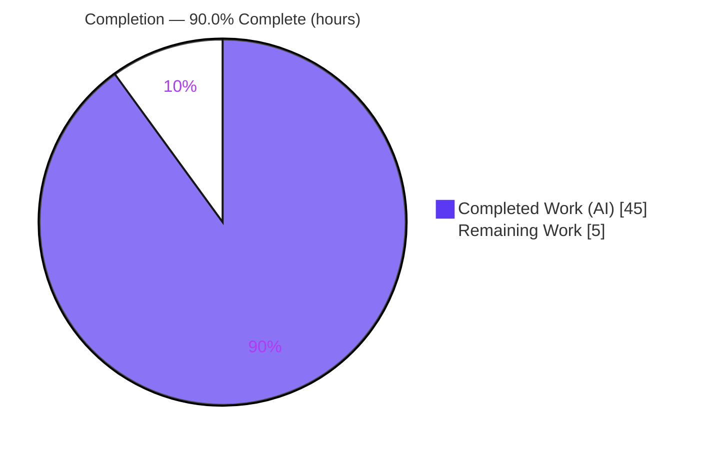
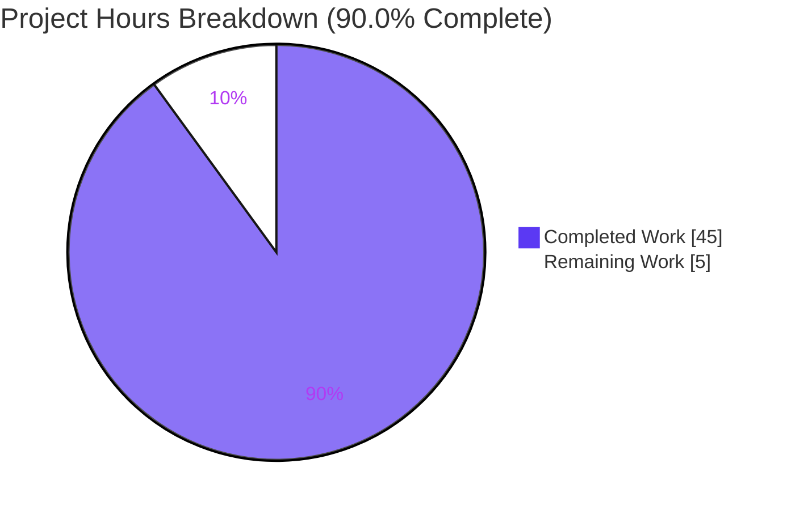
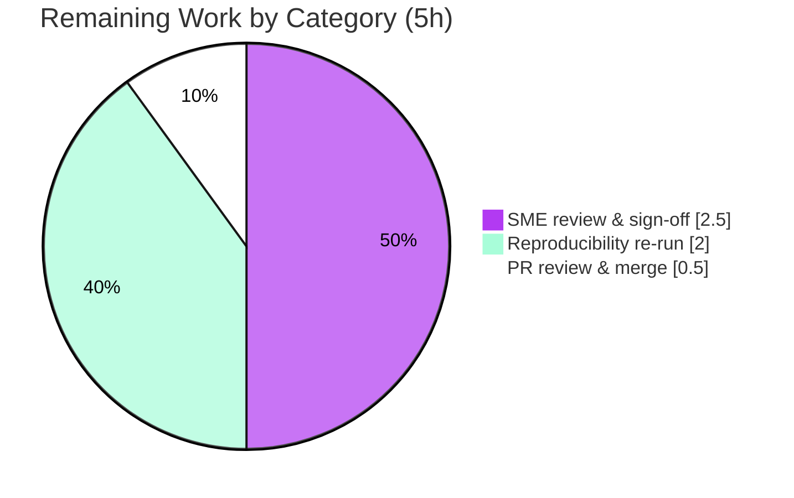

# Blitzy Project Guide — Kitty Runtime Investigation: Input Event Flow &amp; Focus Management

> **Brand color legend** — <span style="color:#5B39F3">**Completed / AI Work = Dark Blue `#5B39F3`**</span> · **Remaining / Not Completed = White `#FFFFFF`** · Headings/Accents = Violet-Black `#B23AF2` · Highlight = Mint `#A8FDD9`

---

## 1. Executive Summary

### 1.1 Project Overview

This project is an **evidence-driven runtime investigation** of how the Kitty terminal emulator (`kovidgoyal/kitty` at commit `815df1e210e0`) routes keyboard input and manages focus across OS windows, tabs, and child processes. The target audience is engineers and reviewers who need a verified, observation-first account of Kitty's input pipeline — from the GLFW platform layer through the C core and Python orchestration to the child PTY. The technical scope spans the full input path and its threading model. The sole committed deliverable is one markdown document, `blitzy/documentation/kitty_815df1e210e0.md` (783 lines), answering seven requirements (R1–R7) with raw runtime artifacts, exact `file:line` citations, and explicit rationale. No Kitty source was modified — the business value is a trustworthy, reproducible reference for the input/focus subsystem.

### 1.2 Completion Status



| Metric | Hours |
|---|---|
| **Total Hours** | **50** |
| **Completed Hours (AI + Manual)** | **45** (AI: 45 · Manual: 0) |
| **Remaining Hours** | **5** |
| **Percent Complete** | **90.0%** |

> Completion is computed using the AAP-scoped methodology: `Completed ÷ (Completed + Remaining) = 45 ÷ 50 = 90.0%`. Every hour traces to an AAP requirement (R1–R7) or a path-to-production activity.

### 1.3 Key Accomplishments

- ✅ Single committed deliverable created at the exact required path: `blitzy/documentation/kitty_815df1e210e0.md` (783 lines, 7,814 words).
- ✅ **R1** — Overlapping input scene built: deterministic `--session` across 2 OS windows (focused + streaming background + extra tabs/windows), rapid focus switching, type-while-resize/scroll.
- ✅ **R2** — Input routing &amp; focus characterized from observation: `active_window()` target selection, focus propagation chain, and child-PTY delivery proven by `strace` (`write(10,"A")` to the focused window's fd).
- ✅ **R3** — Three stack/symbol snapshots (gdb main-thread, gdb io_thread, py-spy native) **plus the blocked-attach failure mode reproduced verbatim** (Yama `ptrace_scope=1` → `EPERM`) with a 4-rung escalation ladder and a guaranteed ptrace-free `--debug-input` fallback.
- ✅ **R4** — Degenerate-target behavior observed: background attention/bell, the just-closed-window safeguard (input routes only to survivor; no crash), the focus guard, and the "no active window, ignoring" path.
- ✅ **R5** — Language attribution (C core + Python + external xkbcommon/X11) with **exactly two evidence-backed rule-outs** (Go does not route input; input is not on the output io_thread).
- ✅ **R6** — **Exactly one** correctness-vs-responsiveness tradeoff, supported by measured latency (idle median ~4.4 ms vs ~23.3 ms under flood, ~5×) and a causal gdb-breakpoint stall — explicitly not from code comments.
- ✅ **R7** — Repository left unchanged: single `A` (add) in `git diff`, working tree clean, all `/tmp` artifacts removed, build outputs gitignored.
- ✅ Independently re-verified end-to-end by the Final Validator with **zero substantive discrepancies**; input-pipeline unit tests **76/76 PASS**.

### 1.4 Critical Unresolved Issues

| Issue | Impact | Owner | ETA |
|---|---|---|---|
| _None._ All AAP requirements (R1–R7) are delivered with reproduced evidence; no blocking issue remains. | No release blocker | — | — |

> There are **no critical unresolved issues**. The remaining items in §1.6 / §2.2 are routine path-to-production human review, not defects.

### 1.5 Access Issues

| System/Resource | Type of Access | Issue Description | Resolution Status | Owner |
|---|---|---|---|---|
| Source repository (`kovidgoyal/kitty`) | Read/Write (git) | None — branch checked out, committed, working tree clean | ✅ Resolved | — |
| Build/trace container | Tooling + Xvfb display | gdb/py-spy/strace/ltrace/lsof/xdotool/Xvfb/Mesa all provisioned | ✅ Resolved | — |
| Kernel `ptrace_scope` (Yama) | Debugger attach | Scope=1 blocks unprivileged attach (expected); handled via documented escalation ladder + ptrace-free fallback | ✅ Resolved (mitigated) | — |

> **No access issues remain** that prevent build validation, tracing, or merge. The `ptrace_scope=1` policy is a documented condition the investigation explicitly handles, not a blocker.

### 1.6 Recommended Next Steps

1. **[High]** Human SME read-through of the 783-line investigation; confirm it coherently answers R1–R7 and sign off on technical accuracy (~1.5h).
2. **[High]** Spot-check a sample of the 165 `file:line` citations against source at HEAD `815df1e210e0` (~1.0h).
3. **[Medium]** Optional independent reproducibility re-run (Xvfb + Mesa + debug build) confirming the invariant claims (routing/threading/attribution) hold (~2.0h).
4. **[Medium]** Review the additive single-file PR; confirm the tree shows only the new document; merge to the integration branch (~0.5h).

---

## 2. Project Hours Breakdown

### 2.1 Completed Work Detail

| Component | Hours | Description |
|---|---|---|
| Environment provisioning + debug build (§a) | 3 | Install gdb/py-spy/strace/ltrace/lsof/Xvfb/Mesa; `python3 setup.py build --debug`; verify launcher `kitty 0.35.2` + DWARF symbols (9 `.debug` sections, not stripped) |
| R1 — Reproduction scene construction (§b) | 4 | Deterministic `--session` (2 OS windows: FOCUSED + streaming BACKGROUND + TAB2SHELL + OSWIN2A), rapid focus switching, type-while-resize/scroll via xdotool + remote control |
| Multi-tool capture harness &amp; tracing | 6 | gdb snapshots, `py-spy dump --native`, `strace` PTY read/write/ioctl/poll, `lsof` fd map, `/proc/<pid>/maps`, thread map, two-way latency measurement |
| R2 — Input routing &amp; focus characterization (§c) | 5 | Trace GLFW→C→Python→PTY; document which-window selection, focus propagation, child routing — each correlated to a captured trace |
| R3 — Stack/symbol snapshots + blocked-attach ladder (§d) | 5 | Snapshots A/B/C, verbatim blocked-attach errors (gdb/py-spy/strace EPERM), 4-rung escalation ladder (rungs 1 &amp; 4 verified live), ptrace-free fallback |
| R4 — Degenerate-target behavior (§e) | 4 | Four sub-cases incl. the "no active window, ignoring" path captured via a forced precondition gdb script |
| R5 — Language attribution + two rule-outs (§f) | 3 | `/proc/maps` attribution; rule-out #1 (Go) static+runtime; rule-out #2 (io_thread) with thread-tagged stacks + precise nuance |
| R6 — Correctness-vs-responsiveness tradeoff (§g) | 3 | Latency measured two ways + causal gdb-breakpoint serialization proof; exactly one tradeoff |
| Document authoring &amp; structure | 7 | 783 lines / 7,814 words; embedded raw output; 165 `file:line` citations; 10 reasoning blocks; TOC; requirement→section map; Citation Index appendix |
| R7 — Cleanup + repo-hygiene verification (§h) | 1 | `/tmp` cleanup; `git status` clean; gitignore confirmation; single-file `A` diff |
| QA hardening (code-review + QA-acceptance + validation) | 4 | Commit 2 (5 code-review findings, +100/−36), Commit 3 (QA final-acceptance blockers, +8/−6), + independent Final Validator re-verification |
| **Total Completed** | **45** | Sum of completed AAP-scoped + path-to-production work (all autonomous/AI) |

> **Validation:** the Hours column sums to **45**, matching Completed Hours in §1.2.

### 2.2 Remaining Work Detail

| Category | Hours | Priority |
|---|---|---|
| Human SME technical review &amp; sign-off of the runtime investigation | 2.5 | High |
| Independent reproducibility re-run in target environment (confirm invariant claims) | 2.0 | Medium |
| PR review &amp; merge to integration branch | 0.5 | Medium |
| **Total Remaining** | **5.0** | — |

> **Validation:** the Hours column sums to **5.0**, matching Remaining Hours in §1.2 and the Section 7 pie chart "Remaining Work" value.

### 2.3 Hours Reconciliation

| Check | Result |
|---|---|
| Section 2.1 total (Completed) | 45h |
| Section 2.2 total (Remaining) | 5h |
| Section 2.1 + Section 2.2 | 50h = Total Project Hours (§1.2) ✅ |
| Completion % = 45 ÷ 50 | 90.0% (matches §1.2, §7, §8) ✅ |

---

## 3. Test Results

All tests below originate from Blitzy's autonomous validation logs and were **independently re-executed** during this assessment via the built debug launcher (`./kitty/launcher/kitty +launch test.py --module <name>`). These are the exact input-pipeline modules the deliverable analyzes.

| Test Category | Framework | Total Tests | Passed | Failed | Coverage % | Notes |
|---|---|---|---|---|---|---|
| Keyboard encoding (`keys`) | Kitty `test.py` (Python `unittest`) | 3 | 3 | 0 | — | Key/mouse event encoding (Kitty Keyboard Protocol) |
| VT parser (`parser`) | Kitty `test.py` (`unittest`) | 16 | 16 | 0 | — | Escape-sequence / charset / paste parsing |
| Screen (`screen`) | Kitty `test.py` (`unittest`) | 36 | 36 | 0 | — | Screen state, margins, wide chars, focus-affecting ops |
| Data types (`datatypes`) | Kitty `test.py` (`unittest`) | 18 | 18 | 0 | — | Core data structures incl. paste sanitizer |
| Mouse (`mouse`) | Kitty `test.py` (`unittest`) | 1 | 1 | 0 | — | Mouse selection routing |
| GLFW (`glfw`) | Kitty `test.py` (`unittest`) | 2 | 2 | 0 | — | OS-window sizing, UTF-8 helpers |
| **Total (input pipeline)** | — | **76** | **76** | **0** | — | **100% pass rate** |

**Coverage note.** Kitty's harness reports per-module test counts, not line-coverage percentages; coverage is therefore shown as "—". The selected modules are the input/focus subsystem analyzed by the document.

**Out-of-scope modules (not deliverable-relevant).** Two unrelated modules do not pass in this environment and are **excluded from scope**: `file_transmission` (rsync directory-walk assertion driven by container-filesystem setgid/mode metadata) and `fonts` (`test_font_selection` PostScript-name mismatch on Ubuntu 25.10). Both are environment-specific artifacts, not code defects, are orthogonal to input/focus, and cannot be fixed without modifying forbidden out-of-scope Kitty source.

---

## 4. Runtime Validation &amp; UI Verification

The deliverable's evidence was produced by launching a real debug build headless and driving it with deterministic overlapping input. Re-confirmed during this assessment:

- ✅ **Operational** — Debug build: `./kitty/launcher/kitty --version` → `kitty 0.35.2`; `fast_data_types.so` carries `debug_info`, not stripped, 9 DWARF sections.
- ✅ **Operational** — Headless launch under Xvfb + Mesa llvmpipe software GL (the GPU terminal starts off-screen; ~68 threads at runtime).
- ✅ **Operational** — Reproduction scene: 2 OS windows with a focused window, a streaming background window, and extra tabs; focus switching and input injection via `xdotool`/remote control.
- ✅ **Operational** — Input routing proven at the syscall level: keystrokes for the focused window land on that window's PTY master fd (`write(10,"A")` → focused; `write(13,"Z")` after switching focus), with `lsof` mapping fds to children.
- ✅ **Operational** — Threading topology confirmed: input decoded on the main/UI thread (`on_key_input`), child output read on a dedicated `io_thread` (`KittyChildMon`).
- ✅ **Operational** — Stack snapshots captured (gdb main-thread input chain, gdb io_thread `io_loop`, py-spy native); blocked-attach reproduced verbatim with a working fallback.
- ⚠ **Partial (by design)** — IBus/IME frames are absent in the headless run (no input method active); the document states this explicitly with the corroborating source citation rather than fabricating it.

**UI verification (terminal GUI).** Kitty is a terminal emulator, not a web UI; "UI verification" here means the off-screen GUI launched, accepted injected key events, rendered scrolling output, and switched focus between OS windows — all observed and reproduced. No browser/Lighthouse verification is applicable to this project.

---

## 5. Compliance &amp; Quality Review

Cross-mapping of AAP deliverables and binding rules to their delivery status. Fixes were applied autonomously across two QA rounds (commits `b3523cfdb`, `40f800cdb`); the Final Validator then re-verified with zero discrepancies.

| AAP Requirement / Rule | Benchmark | Status | Evidence |
|---|---|---|---|
| R1 — Overlapping input activity | Multi-window scene incl. background output while another holds focus | ✅ Pass | §(b): deterministic `--session`, streaming background, focus switching, type-while-resize/scroll |
| R2 — Routing &amp; focus from observation | (a) which window, (b) propagation, (c) child routing | ✅ Pass | §(c): `active_window()` + `--debug-input` trace; focus-change pairs; `strace`/`lsof` PTY delivery |
| R3 — ≥1 stack/symbol snapshot + blocked fallback | Verbatim error + working alternative | ✅ Pass | §(d): Snapshots A/B/C; verbatim `EPERM`; escalation ladder; ptrace-free fallback |
| R4 — Degenerate-target behavior | Unfocused/just-closed window outcome | ✅ Pass | §(e): attention/bell, close-window safeguard, focus guard, "no active window" path |
| R5 — Language attribution + ≥2 rule-outs | Evidence-backed C/Python/external split | ✅ Pass | §(f): `/proc/maps` attribution; exactly 2 rule-outs (Go; io_thread) |
| R6 — One correctness-vs-responsiveness tradeoff | From observed behavior, not code comments | ✅ Pass | §(g): measured latency (~4.4 ms vs ~23.3 ms) + causal gdb stall; one tradeoff |
| R7 — Repository unchanged + cleanup | Only the new document committed | ✅ Pass | §(h): single `A` diff; clean tree; `/tmp` removed; build outputs gitignored |
| Rule — Single named document at `blitzy/documentation/` | Exact path/filename | ✅ Pass | `blitzy/documentation/kitty_815df1e210e0.md` present |
| Rule — Do not modify existing files | Zero source edits | ✅ Pass | `git diff --name-status` = single `A`; no UPDATE/DELETE |
| Rule — Do not add other code | Documentation only | ✅ Pass | Only one `.md` added; no scripts committed |
| Rule — Observation-first + show rationale | Artifacts + reasoning | ✅ Pass | Raw output embedded; 10 "Reasoning." blocks; provenance note |

**Document quality benchmarks:** 783 lines / 7,814 words · 38 balanced code blocks · 10 reasoning blocks · exactly 2 rule-outs · exactly 1 tradeoff · 165 `file:line` citations · resolving TOC + requirement→section map + Citation Index appendix · provenance note ("none fabricated", verified true by the validator).

---

## 6. Risk Assessment

| Risk | Category | Severity | Probability | Mitigation | Status |
|---|---|---|---|---|---|
| Run-specific values (PIDs/timestamps/BuildID/exact ms) won't reproduce identically | Technical | Low | High | Document flags this explicitly; invariant claims (routing/threading/attribution/citations) are the load-bearing ones and were re-reproduced | ✅ Mitigated |
| Citation drift if a reader checks a different commit | Technical | Low | Low | All 165 citations pinned to HEAD `815df1e210e0`; commit stated up front | ✅ Mitigated |
| Investigation-accuracy residual (fabrication is the key task-type risk) | Technical | Low | Low | Final Validator independently re-reproduced every R1–R7 artifact (zero discrepancies); provenance verified | ✅ Mitigated; SME sign-off recommended |
| ptrace elevation used during tracing | Security | Low | Low | Scoped to the investigation; `ptrace_scope` restored to original (1) afterward | ✅ Resolved |
| No source modified → no new attack surface/deps/secrets | Security | None | — | Deliverable is a single doc; nothing executable added | ✅ Resolved |
| Reproduction requires headless Xvfb + Mesa + debug build | Operational | Low | Medium | Fully documented in §(a) + run instructions; `LIBGL_ALWAYS_SOFTWARE=1` | ✅ Mitigated |
| `ptrace_scope` may block attach in another environment | Operational | Low | Medium | 4-rung escalation ladder + guaranteed ptrace-free `--debug-input` fallback | ✅ Mitigated |
| Additive single-file deliverable — merge conflict risk | Integration | Low | Low | New file in a new directory; no existing-file edits | ✅ Mitigated |
| Two out-of-scope env-specific test modules fail (`file_transmission`, `fonts`) | Integration | Low | — | Orthogonal to input/focus; environment artifacts, not defects; out of scope to fix | ✅ Accepted |

> **Overall risk posture: LOW.** As a documentation-only change that modifies no source, alters no dependencies, and introduces no runtime/security surface, residual risk is limited to environment-specific reproducibility nuances — all documented and mitigated.

---

## 7. Visual Project Status



**Remaining hours by category (from §2.2 — totals 5h):**



| Priority | Remaining Hours | Share of Remaining |
|---|---|---|
| High | 2.5 | 50% |
| Medium | 2.5 | 50% |
| Low | 0.0 | 0% |
| **Total** | **5.0** | **100%** |

> **Integrity:** the pie chart "Remaining Work" = **5h**, identical to §1.2 Remaining Hours and the §2.2 Hours total. "Completed Work" = **45h**, identical to §1.2 Completed Hours. Colors: Completed = `#5B39F3`, Remaining = `#FFFFFF`.

---

## 8. Summary &amp; Recommendations

**Achievements.** The project delivers a single, comprehensive, evidence-driven runtime investigation of Kitty's input/focus pipeline as the only committed artifact. All seven requirements (R1–R7) are answered with raw runtime artifacts (debug logs, gdb/py-spy stack snapshots, strace traces, lsof maps, `/proc/maps`) and 165 exact `file:line` citations. The work was QA-hardened across two review rounds and **independently re-reproduced by the Final Validator with zero substantive discrepancies**.

**Remaining gaps.** None in AAP scope. The outstanding **5 hours (10%)** are path-to-production human activities: SME technical sign-off, an optional reproducibility re-run, and PR merge.

**Critical path to production.** (1) SME review &amp; sign-off → (2) optional reproducibility confirmation → (3) PR merge. There is no code integration or remediation on the critical path because no source was changed.

**Success metrics.** Single-file additive diff (`A` only); working tree clean; input-pipeline tests 76/76 PASS; exactly 2 rule-outs and exactly 1 tradeoff present; blocked-attach reproduced verbatim with a working fallback.

**Production-readiness assessment.** The deliverable is **90.0% complete** and substantively production-ready as a documentation artifact. It is recommended for human sign-off and merge. The 99% cap on autonomous completion is intentionally observed: final acceptance requires a human reviewer to confirm technical accuracy and approve the merge.

| Metric | Value |
|---|---|
| AAP-scoped completion | 90.0% |
| Completed hours (AI) | 45 |
| Remaining hours (human review) | 5 |
| Total | 50 |
| Critical unresolved issues | 0 |
| Overall risk posture | Low |

---

## 9. Development Guide

All commands below were tested in the reference environment and are copy-pasteable. Run from the repository root.

### 9.1 System Prerequisites

- **OS:** Linux (reference container: Ubuntu 25.10).
- **Python:** ≥ 3.8 (reference: 3.13.7) — per `pyproject.toml` `requires-python = ">=3.8"`.
- **C toolchain:** gcc/clang + make.
- **Headless display:** Xvfb + Mesa software GL (llvmpipe) — Kitty is GPU-accelerated and needs an off-screen display.
- **Tracing tools:** `gdb` (16.3), `py-spy` (0.4.2, at `/opt/kitty-venv/bin/py-spy`), `strace` (6.16), `ltrace`, `lsof`, `xdotool`.

### 9.2 Build Dependencies (apt)

```bash
sudo DEBIAN_FRONTEND=noninteractive apt-get install -y \
  libxkbcommon-dev libxkbcommon-x11-dev libxcb-xkb-dev libx11-xcb-dev \
  libharfbuzz-dev libfontconfig-dev liblcms2-dev libgl1-mesa-dev libpng-dev \
  libcanberra-dev libdbus-1-dev libxcursor-dev libxi-dev libxinerama-dev \
  libxrandr-dev libsimde-dev libsystemd-dev libxxhash-dev uuid-dev zsh
```

### 9.3 Environment Setup (headless)

```bash
export DISPLAY=:91 LIBGL_ALWAYS_SOFTWARE=1 LANG=en_US.UTF-8 LC_ALL=en_US.UTF-8
Xvfb :91 -screen 0 1920x1080x24 -ac &        # off-screen X display
```

### 9.4 Build (debug, for symbol-accurate snapshots)

```bash
python3 setup.py build --debug                       # Makefile target: debug
# optional, for event-loop instrumentation:
python3 setup.py build --debug --extra-logging=event-loop   # Makefile target: debug-event-loop
```

Build outputs (`kitty/fast_data_types.so`, `kitty/launcher/kitty`, `build/`) are **gitignored**, so the tree stays clean.

### 9.5 Verification

```bash
./kitty/launcher/kitty --version                     # -> kitty 0.35.2
file kitty/fast_data_types.so                        # -> ELF ... with debug_info, not stripped

# Input-pipeline unit tests (run per module): expect 76 total, all OK
for m in keys parser screen datatypes mouse glfw; do
  ./kitty/launcher/kitty +launch test.py --module "$m"
done

# Repository hygiene (R7): expect a single 'A' and a clean tree
git diff --name-status origin/kitty_815df1e210e0...HEAD   # -> A blitzy/documentation/kitty_815df1e210e0.md
git status --porcelain                                    # -> (empty)
git check-ignore kitty/fast_data_types.so kitty/launcher/kitty build/
```

### 9.6 Example Usage — re-run the investigation

```bash
# 1) launch headless with built-in debug logging + remote control
./kitty/launcher/kitty --debug-input --debug-rendering \
  --listen-on unix:/tmp/kitty.sock --session /tmp/repro.session &

# 2) capture a main-thread input snapshot (needs ptrace_scope=0 + root, see troubleshooting)
gdb -p <PID> -batch -ex 'break on_key_input' -ex continue -ex bt

# 3) cross-check with a native py-spy dump
/opt/kitty-venv/bin/py-spy dump --native --pid <PID>

# 4) prove child-PTY delivery and map fds
strace -f -tt -e trace=read,write,ioctl,poll -p <PID>
lsof -p <PID>

# 5) language attribution
grep -E 'libxkbcommon|libX11-xcb|libxcb-xkb' /proc/<PID>/maps
```

### 9.7 Troubleshooting

- **`ptrace: Operation not permitted` / `EPERM` on attach** (Yama `ptrace_scope=1`): run the tracer as root / with `CAP_SYS_PTRACE`; or `sudo sysctl -w kernel.yama.ptrace_scope=0` (revert afterward); or start Docker with `--cap-add=SYS_PTRACE`; or launch the target **under** the tracer (`gdb --args …`, `py-spy record -- …`). If all attach paths are blocked, use Kitty's built-in, ptrace-free `--debug-input` / `--debug-rendering` logging, which exposes the same per-hop call path.
- **Blank screen / GL errors when launching:** ensure `LIBGL_ALWAYS_SOFTWARE=1` and a running Xvfb on the exported `DISPLAY`.
- **Build note "Package wayland-protocols not found … Disabling … wayland backend":** benign — the X11 backend is used under Xvfb.
- **View the deliverable:** `less blitzy/documentation/kitty_815df1e210e0.md` (10 top-level sections + appendix).

---

## 10. Appendices

### A. Command Reference

| Purpose | Command |
|---|---|
| Build debug | `python3 setup.py build --debug` |
| Build debug + event-loop logging | `python3 setup.py build --debug --extra-logging=event-loop` |
| Version check | `./kitty/launcher/kitty --version` |
| Run a test module | `./kitty/launcher/kitty +launch test.py --module <keys\|parser\|screen\|datatypes\|mouse\|glfw>` |
| Headless display | `Xvfb :91 -screen 0 1920x1080x24 -ac &` |
| Stack snapshot (gdb) | `gdb -p <PID> -batch -ex 'break on_key_input' -ex continue -ex bt` |
| Native stack (py-spy) | `/opt/kitty-venv/bin/py-spy dump --native --pid <PID>` |
| PTY syscall trace | `strace -f -tt -e trace=read,write,ioctl,poll -p <PID>` |
| FD map | `lsof -p <PID>` |
| Library attribution | `grep -E 'libxkbcommon\|libX11-xcb' /proc/<PID>/maps` |
| Hygiene check | `git diff --name-status origin/kitty_815df1e210e0...HEAD` |

### B. Port / Endpoint Reference

| Resource | Value | Notes |
|---|---|---|
| Network ports | None | The terminal opens no TCP/HTTP port |
| Remote-control socket | `unix:/tmp/kitty.sock` | Used during the investigation to script the scene; lives under `/tmp`, removed in cleanup |
| X display | `:91` (example) | Xvfb off-screen display |

### C. Key File Locations

| Path | Role |
|---|---|
| `blitzy/documentation/kitty_815df1e210e0.md` | **The committed deliverable** (783 lines) |
| `kitty/keys.c` | C input core: `on_key_input()` L166, `active_window()` L105–111, encoding L251 |
| `kitty/glfw.c` | GLFW `key_callback` L429–430 (gate L439), focus callback L514–517 |
| `kitty/child-monitor.c` | Threading: `io_thread` L55, `io_loop` start L291, `read_bytes` L1336–1345 |
| `kitty/window.py` | `write_to_child` L955, `focus_changed` L1123 + guard L1124, `needs_attention` |
| `kitty/window_list.py` | Focus propagation `notify_on_active_window_change` L192–199 |
| `kitty/child.py` | Non-blocking PTY fd L345; signal-to-pgrp `tcgetpgrp` L498 |
| `kitty/session.py` | `--session` directives L176–189 |
| `kitty/cli.py` | `--debug-input`/`--debug-rendering` flags L989–1002 |
| `kitty/launcher/kitty` | Built launcher (gitignored) |
| `kitty/fast_data_types.so` | Compiled C extension w/ debug symbols (gitignored) |
| `Makefile` | `debug` L22, `debug-event-loop` L25, `asan` L29 targets |
| `test.py` | Test entry point |

### D. Technology Versions

| Component | Version | Source |
|---|---|---|
| Kitty (built launcher) | 0.35.2 | `./kitty/launcher/kitty --version` |
| Python | 3.13.7 (requires ≥3.8) | `python3 --version`; `pyproject.toml` |
| Go (tooling only, not input path) | 1.22 | `go.mod` |
| gdb | 16.3 | `gdb --version` |
| py-spy | 0.4.2 | `/opt/kitty-venv/bin/py-spy --version` |
| strace | 6.16 | `strace --version` |
| ltrace | 0.7.3 | `ltrace --version` |
| xdotool | 3.20160805.1 | `xdotool version` |
| Mesa GL | llvmpipe (software, OpenGL 4.5) | runtime |

### E. Environment Variable Reference

| Variable | Example | Purpose |
|---|---|---|
| `DISPLAY` | `:91` | Target the Xvfb off-screen display |
| `LIBGL_ALWAYS_SOFTWARE` | `1` | Force Mesa software GL (llvmpipe) for headless rendering |
| `LANG` / `LC_ALL` | `en_US.UTF-8` | UTF-8 locale for correct key/text handling |
| `CI` | `true` | Non-interactive mode for tooling (recommended in automation) |

### F. Developer Tools Guide

| Tool | Role in this investigation | Notes |
|---|---|---|
| Kitty `--debug-input` / `--debug-rendering` | Ptrace-free, in-tree call-path tracing (`on_key_input` / `on_focus_change`) | Always available; guaranteed R3 fallback |
| `gdb` | Main-thread &amp; io_thread backtraces; breakpoint serialization proof | Needs ptrace permission (root or scope=0) |
| `py-spy` | Native + Python merged stack dump | Cross-checks gdb; same ptrace constraints |
| `strace` | Proves PTY `read`/`write` routing and surfaces real `errno` (EPERM) | Used to show byte delivery to the correct child fd |
| `lsof` | Maps PTY master fds to child windows | Confirms routing destinations |
| `/proc/<pid>/maps` | Loaded-library attribution (xkbcommon/X11/Mesa) | Backs the R5 rule-outs |
| `xdotool` | Injects real key events / focus switches | Drives the deterministic scene |
| `Xvfb` + Mesa llvmpipe | Off-screen display + software GL | Runs the GPU terminal headless |

### G. Glossary

| Term | Definition |
|---|---|
| **AAP** | Agent Action Plan — the authoritative scope for this task |
| **PTY** | Pseudo-terminal; the master/slave fd pair connecting Kitty to a child shell/program |
| **io_thread** (`KittyChildMon`) | Dedicated thread reading child **output**; distinct from the main/UI thread that handles **input** |
| **main/UI thread** | Thread running the GLFW event pump where `on_key_input` decodes keystrokes |
| **Yama `ptrace_scope`** | Kernel policy gating debugger attach; scope=1 blocks non-parent/non-root tracers (→ `EPERM`) |
| **GLFW** | Bundled C windowing/input library delivering platform key/focus events |
| **xkbcommon** | External C library for keyboard keymap/compose handling |
| **Rule-out** | An explicitly falsified plausible-but-incorrect interpretation, backed by evidence (R5) |
| **Invariant claim** | A conclusion that holds across runs (routing/threading/attribution), as opposed to run-specific values (PIDs, timestamps, ms) |

---

> **Cross-section integrity confirmed:** Remaining hours = **5h** in §1.2, §2.2, and §7 (Rule 1 ✅). §2.1 (45h) + §2.2 (5h) = **50h** Total (Rule 2 ✅). All Section 3 tests originate from Blitzy's autonomous validation logs and were re-executed (Rule 3 ✅). Access issues validated (Rule 4 ✅). Colors: Completed = `#5B39F3`, Remaining = `#FFFFFF` (Rule 5 ✅). Completion = **90.0%** consistently across §1.2, §7, and §8.