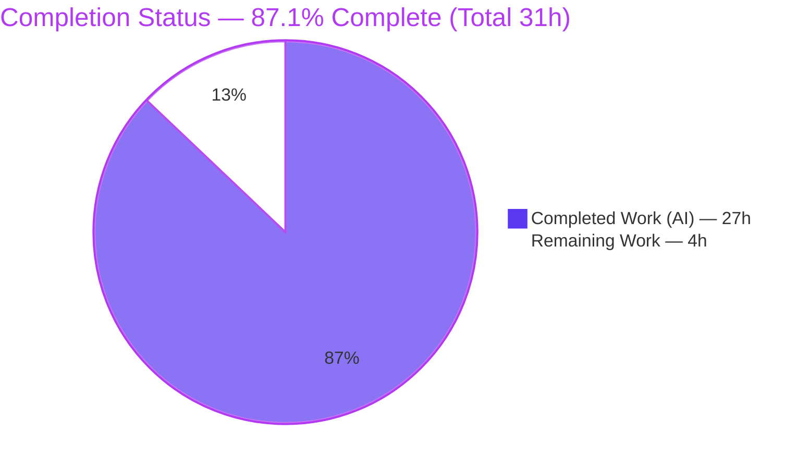
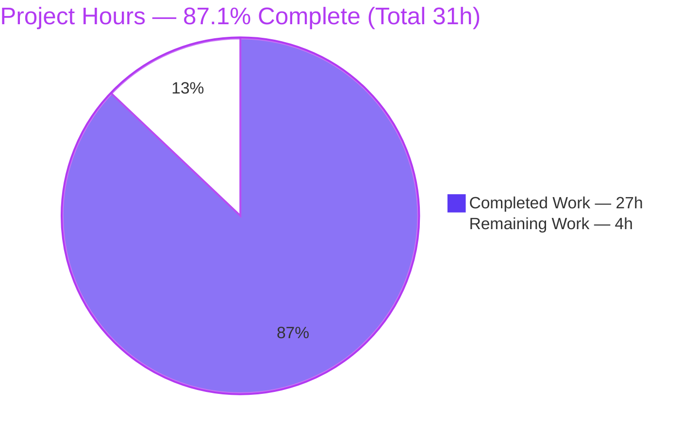
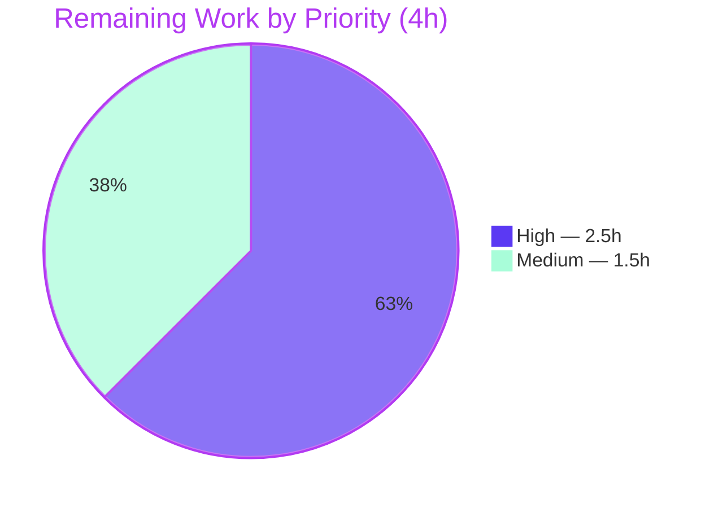
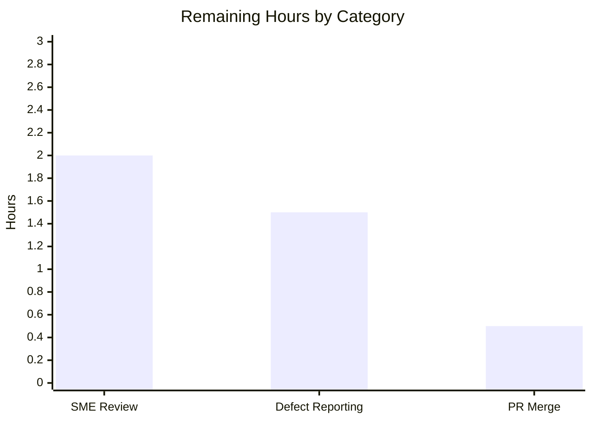

# Blitzy Project Guide

# 1. Executive Summary

## 1.1 Project Overview

This project answers a runtime-grounded question about the **kitty terminal emulator** (v0.35.2): how does its internal screen buffer handle a stream of zero-width joiners (ZWJ) forming a multi-codepoint emoji (e.g. the family emoji 👨‍👩‍👧‍👦) when the terminal is squeezed into a 1×1 cell, what does the cell ultimately hold, what does a control-sequence state query report, and how do normalization, grapheme breaking, and state reporting interact under extreme constraints. The task is a **read-only code-investigation Q&A** for terminal/Unicode engineers: the deliverable is one Markdown answer document derived from **observed runtime behavior**, with every claim grounded in captured output and a `file:line` citation. The source tree is left byte-for-byte unchanged.

## 1.2 Completion Status

The project is **87.1% complete**, measured strictly against AAP-scoped work plus path-to-production activities (PA1 methodology). All autonomous deliverables are complete and validated; the remaining 4 hours are human review/sign-off actions.



| Metric | Hours |
|--------|-------|
| **Total Hours** | 31 |
| **Completed Hours (AI + Manual)** | 27 (27 AI + 0 Manual) |
| **Remaining Hours** | 4 |
| **Percent Complete** | **87.1%** |

> Color key — **Completed = Dark Blue `#5B39F3`**, **Remaining = White `#FFFFFF`**.

## 1.3 Key Accomplishments

- ✅ Built the kitty C extension `kitty/fast_data_types.so` (1,253,792 bytes) from source and drove **all** observations through the canonical `parse_bytes → VT-parser → screen` entry point (no bypass).
- ✅ Answered **Q1 (retention)** and **Q2 (settled contents)**: on a 1×1 screen, width-2 emoji faces overwrite the single cell; only the last base (`0x1F466` 👦) survives; cell width 2; cursor x=2.
- ✅ Answered **Q3 (state query)**: captured the exact bytes for the full DSR family (DSR-5/6, private `?5`/`?6`, unknown, and DECRQCRA absence) and traced them to `report_device_status` (`kitty/screen.c:2179`).
- ✅ Answered **Q4 (interaction)**: proved **no** NFC/NFD normalization and **no** grapheme merging; classification via `is_combining_char` (Unicode 15.0.0); state reporting is purely positional.
- ✅ Surfaced and root-caused a **genuine defect** — a DECAWM-off SIGSEGV (unsigned underflow at `kitty/screen.c:826`) — reported honestly as a **labeled non-default** finding with a default-config control.
- ✅ Delivered a 382-line document with **58 file:line citations**, 30 code blocks, cause→effect traces, and an explicit coverage pass over every sub-question and named condition.
- ✅ Honored read-only scope perfectly: `git status` clean; the branch adds exactly one file (382 insertions, 0 deletions); temporary scripts removed.
- ✅ Confirmed correctness against kitty's own native test suite: **70/70 tests pass** (including `test_zwj`).

## 1.4 Critical Unresolved Issues

No issues block release or validation of the answer document. The items below are **subject-software findings** surfaced by the investigation; they are out-of-scope to fix under the read-only mandate and do **not** block the deliverable.

| Issue | Impact | Owner | ETA |
|-------|--------|-------|-----|
| DECAWM-off SIGSEGV (unsigned underflow at `kitty/screen.c:826`) — upstream kitty defect | Crash only in a **non-default** config (autowrap off + width-2 char on 1-col screen); default config unaffected | kitty upstream maintainers (file issue) | Upstream (not part of this deliverable) |
| `cc_idx[3]` overwrite-on-overflow (`kitty/line.c:466`) — combining marks beyond 3 silently overwrite the last slot | Minor data-retention edge (>3 combining marks per cell); documented as the retention boundary | kitty upstream maintainers (file issue) | Upstream (not part of this deliverable) |
| Pending human SME sign-off of the investigation | Deliverable is fully validated autonomously but not yet human-accepted | Reviewing engineer | ~2.0h |

## 1.5 Access Issues

**No access issues identified.** The repository was fully accessible, the C toolchain and build dependencies were present, the extension built successfully, the observation harness ran, and kitty's native test suite executed — all without permission, credential, or third-party-access obstacles.

| System/Resource | Type of Access | Issue Description | Resolution Status | Owner |
|-----------------|----------------|-------------------|-------------------|-------|
| Source repository | Read/Write (git) | None — clone, build, commit all succeeded | ✅ No issue | — |
| C build toolchain & dev libraries | Local (apt) | None — all build inputs present | ✅ No issue | — |
| External services / APIs | N/A | None required by this task | ✅ Not applicable | — |

## 1.6 Recommended Next Steps

1. **[High]** Perform SME technical review of the answer document — confirm the Unicode/width/grapheme reasoning for Q1–Q4 and the SIGSEGV root-cause logic. *(≈1.5h)*
2. **[High]** Spot-reproduce 2–3 key observations (Q1/Q2 headline + one DSR query) using the documented commands to independently confirm findings. *(≈0.5h)*
3. **[High]** Review the branch diff (single added file, clean tree) and approve/merge the PR. *(≈0.5h)*
4. **[Medium]** File an upstream kitty issue for the DECAWM-off SIGSEGV (`screen.c:826`) with the documented deterministic reproducer. *(≈1.0h)*
5. **[Medium]** File an upstream kitty issue (or confirm known/intended) for the `cc_idx[3]` overwrite-on-overflow behavior (`line.c:466`). *(≈0.5h)*

---

# 2. Project Hours Breakdown

## 2.1 Completed Work Detail

All completed work is autonomous (AI) and traces to specific AAP requirements. Totals to **27 hours** (matches Completed Hours in Section 1.2).

| Component | Hours | Description |
|-----------|-------|-------------|
| Build Environment & C Extension Compilation | 3.0 | Toolchain/dependency setup; `python3 setup.py build --ignore-compiler-warnings`; produced gitignored `fast_data_types.so` (1,253,792 bytes) [AAP §0.4.3] |
| Codebase Investigation & Canonical-Path Discovery | 4.0 | Located the real entry path `bytes → vt-parser.c → screen_draw_text → draw_text_loop`; identified `CPUCell`, `report_device_status`, `is_combining_char`, and the `kitty_tests` harness [AAP §0.2.1] |
| Q1/Q2 Runtime Observation & Capture | 4.0 | 1×1 headline, per-codepoint widths, transitional before/during/after, `cc_idx[3]` overflow boundary, VS15/VS16 variants, 1×5 & 2×2 contrasts [AAP Q1/Q2] |
| Q3 Runtime Observation & Capture | 2.5 | Full DSR family (5/6, `?5`/`?6`, unknown), DECRQCRA absence, trace through `report_device_status` (`screen.c:2179`) [AAP Q3] |
| Q4 Runtime Observation & Capture | 1.5 | NFC/NFD negative test, combining classification via `is_combining_char`, `wcswidth` summation proof [AAP Q4] |
| Edge-Case (SIGSEGV) Investigation & Root Cause | 2.5 | Discovered DECAWM-off crash; root-caused unsigned underflow at `screen.c:826`; confirmed determinism (8 runs) + default-config control [AAP §0.5.4] |
| Answer Document Authoring | 5.5 | 382-line Markdown: direct answers, 58 citations, 30 code blocks, cause→effect traces, coverage pass [AAP §0.6.2] |
| Autonomous Validation, Cleanup & Commit | 4.0 | Reproduced every observation, verified every citation, ran kitty native suite (70/70), removed temp scripts, committed; repo verified clean [AAP §0.3.2] |
| **Total Completed** | **27.0** | |

## 2.2 Remaining Work Detail

All remaining work is human path-to-production. Totals to **4 hours** (matches Remaining Hours in Section 1.2 and Section 7).

| Category | Hours | Priority |
|----------|-------|----------|
| Human SME Technical Review & Sign-off (read document; confirm reasoning; spot-reproduce observations) | 2.0 | High |
| Upstream Defect Reporting (file 2 kitty issues: DECAWM-off SIGSEGV `screen.c:826`; `cc_idx[3]` overflow `line.c:466`) | 1.5 | Medium |
| PR Review & Merge Approval (confirm single-file diff, clean tree; approve/merge) | 0.5 | High |
| **Total Remaining** | **4.0** | |

## 2.3 Hours Reconciliation

- Section 2.1 total (Completed) = **27.0h**
- Section 2.2 total (Remaining) = **4.0h**
- **2.1 + 2.2 = 31.0h = Total Project Hours (Section 1.2)** ✅
- Completion = 27 / 31 × 100 = **87.1%** ✅

---

# 3. Test Results

All results below originate from **Blitzy's autonomous validation logs** for this project (Final Validator gates + independent reproduction). kitty's native tests were run via the canonical launcher; runtime observations were reproduced via the `kitty_tests` `parse_bytes` harness.

| Test Category | Framework | Total Tests | Passed | Failed | Coverage % | Notes |
|---------------|-----------|-------------|--------|--------|-----------|-------|
| Datatypes (Unit) | kitty `test.py` harness | 18 | 18 | 0 | — | Exercises `CPUCell`/`cc_idx` datatypes underpinning Q1/Q2 |
| Parser (Unit) | kitty `test.py` harness | 16 | 16 | 0 | — | UTF-8 decode + CSI dispatch (the canonical input path) |
| Screen (Unit/Integration) | kitty `test.py` harness | 36 | 36 | 0 | — | **Includes `test_zwj`** — directly exercises ZWJ handling |
| Runtime Observation Reproductions | `kitty_tests` `parse_bytes` harness | 10 | 10 | 0 | — | 9 documented observations + 1 edge finding; byte-identical, stable across ≥2 runs (edge = 8 runs) |
| **Total** | — | **80** | **80** | **0** | **100% pass** | Zero failures across automated tests and reproduction checks |

**Coverage note:** kitty does not emit a single global line-coverage number in its test logs, so the Coverage % column is intentionally left as `—`. Functional coverage is complete for the investigation: every module under study — `screen.c`, `line.c`, `unicode-data.c`, `vt-parser.c`, `data-types.h` — was exercised through its real entry point, and every documented behavioral claim was reproduced with byte-identical output.

---

# 4. Runtime Validation & UI Verification

Runtime validation was performed headlessly through kitty's canonical byte-input path. There is **no GUI/UI surface** in scope (this is a terminal-core/Unicode investigation), and **no external API integration** (no network, services, or credentials). Status legend: ✅ Operational | ⚠ Partial | ❌ Failing.

**Build & Load**
- ✅ **Operational** — `kitty/fast_data_types.so` builds (1,253,792 bytes) and imports cleanly; `unicode_database_version() == (15, 0, 0)`; kitty version `(0, 35, 2)`.

**Canonical Runtime Path (`parse_bytes → vt-parser.c → screen_draw_text`)**
- ✅ **Operational** — bytes fed via the real entry point drive the screen model; observations captured via `str(screen.line(y))`, `line.width(x)`, `screen.cursor.x/.y`, and `Callbacks.wtcbuf`.

**Behavioral Reproductions**
- ✅ **Q1/Q2 headline (1×1 family emoji)** — cursor `(2,0)`, `line0='👦'`, kept `['0x1f466']`, width 2.
- ✅ **Q1/Q2 transitional / `cc_idx[3]` overflow / VS15–VS16 / 1×5 & 2×2** — all reproduced as documented.
- ✅ **Q3 DSR family** — `6→ESC[1;2R`, `5→ESC[0n`, `?6→ESC[?1;2R`, `?5→ESC[0n`, `99→(empty)`, `DECRQCRA→(empty)` with a parse-error log.
- ✅ **Q4 normalization negative** — decomposed `e`+`U+0301` stays `['0x65','0x301']` (no NFC/NFD).
- ✅ **Edge finding (labeled NON-DEFAULT)** — DECAWM-off + width-2 on 1-col screen → deterministic SIGSEGV (exit 139); DECAWM-on control survives (cursor.x=2, kept `['0x4e00']`, exit 0). Crash isolated to child subprocesses.

**UI Verification**
- ⚠ **Not applicable** — no graphical/rendered UI is part of this investigation; behavior is verified at the screen-buffer/state-report level, which is the correct surface for the question.

**API / External Integration**
- ✅ **Not applicable** — the task introduces no external integrations, ports, or credentials.

---

# 5. Compliance & Quality Review

This matrix cross-maps the AAP directives and rules (SWE-AtlasQnA-Repo) to Blitzy's quality benchmarks. **Fixes applied during autonomous validation: none required** — the Final Validator found zero discrepancies (the document was already correct) and this assessment independently reproduced the core findings.

| Requirement (AAP / Rules) | Benchmark | Status | Progress |
|---------------------------|-----------|--------|----------|
| Deliverable location & naming `blitzy/documentation/kitty_815df1e210e0.md` | Exact path exists; named after source branch | ✅ Pass | 100% |
| Run-first methodology (observe before write) | Every claim backed by actual captured output | ✅ Pass | 100% |
| Real canonical entry point (`parse_bytes` → VT parser) | No bypass/debug hook used | ✅ Pass | 100% |
| Default canonical configuration for headline | DECAWM-on headline; non-default explicitly labeled | ✅ Pass | 100% |
| Exhaustiveness (every implied condition) | Q1–Q4 + transitional + VS15/VS16 + `cc_idx[3]` overflow + full DSR + DECRQCRA absence + NFC negative + non-default crash | ✅ Pass | 100% |
| Grounding (file:line + observed output) | 58 citations; key lines independently verified accurate | ✅ Pass | 100% |
| Actual, complete, unedited output | 30 code blocks of raw captured output | ✅ Pass | 100% |
| Coverage pass (answer every part + named item) | Explicit coverage section maps each Q + ~14 named items | ✅ Pass | 100% |
| Build command stated for reproducibility | `python3 setup.py build --ignore-compiler-warnings` documented | ✅ Pass | 100% |
| Read-only scope (no source edits) | `git diff` = single added file; 0 deletions | ✅ Pass | 100% |
| Temporary artifacts removed | `/tmp/kobs` scripts removed; tree clean | ✅ Pass | 100% |
| Defects reported-not-patched | `cc_idx[3]` overflow + DECAWM-off SIGSEGV reported, not fixed | ✅ Pass | 100% |
| Correctness vs. project's own tests | kitty native suite 70/70 (incl. `test_zwj`) | ✅ Pass | 100% |
| Human SME sign-off | Independent human acceptance of the investigation | ⬜ Pending | 0% |

**Quality summary:** The deliverable meets every mandatory AAP directive and rule with no compromises, stubs, or placeholders. The only outstanding compliance item is human sign-off, which is inherently a manual gate.

---

# 6. Risk Assessment

Risk profile is distinctive for a read-only documentation deliverable: it adds **no code, no dependencies, no network/attack surface, and no secrets**. The salient risks are two **upstream kitty defects** the investigation surfaced (correctly reported-not-patched) plus documentation-durability concerns.

| Risk | Category | Severity | Probability | Mitigation | Status |
|------|----------|----------|-------------|------------|--------|
| DECAWM-off SIGSEGV — unsigned underflow (`screen.c:826`) → OOB write | Technical / Security | Medium | Low (non-default config only) | Root cause documented; default control survives; recommend upstream filing | Reported — not patched (by AAP design) |
| `cc_idx[3]` overwrite-on-overflow — silent loss of combining marks beyond 3 (`line.c:466`) | Technical | Low | Low (needs >3 marks/cell) | Documented as the retention boundary with observed replacements | Reported — not patched (by design) |
| Environment/version drift (Unicode DB 15.0.0, kitty 0.35.2, Python 3.13.7, Go presence) | Technical / Operational | Low | Medium | Versions pinned in doc; deltas (Python 3.13.7 vs 3.12.3; Go-less build exit code) explicitly documented; core observations stable across runs | Documented / Mitigated |
| Subject-software memory-safety (OOB write is more than a crash) | Security | Medium | Low (non-default) | Reported with exact root cause for upstream triage; unreachable in default config | Reported (upstream, out-of-scope) |
| Deliverable attack surface | Security | None | N/A | Read-only additive doc; no code/deps/credentials/network | No risk |
| Citation drift on future kitty upgrades (line refs pinned to 0.35.2) | Operational | Low | Medium (if kitty updated) | Version + HEAD commit pinned; all cited lines verified accurate at current HEAD | Mitigated (pinned) |
| Pending human SME sign-off | Operational | Low | Low | Final Validator 5/5 gates pass; core claims reproduced byte-for-byte; native suite 70/70 | Open (2.0h) |
| No automated regression guard for documented observations | Operational | Low | Low | kitty's own `test_zwj` exercises ZWJ handling; all observations deterministic/reproducible | Accepted (low impact) |
| Build reproducibility requires full C toolchain + dev libraries | Integration | Low | Low | Exact apt dependency list + build command documented; `.so`/`build/` gitignored | Mitigated (documented) |
| External integrations | Integration | None | N/A | No APIs, keys, services, or webhooks; in-repo harness only | No risk |

**Overall posture:** **LOW** for the deliverable itself (fully validated, zero new attack surface). The two Medium items are upstream kitty defects the task correctly reported and — per read-only scope — did not patch; the recommended action is to file them upstream.

---

# 7. Visual Project Status

**Project Hours Breakdown** — Completed = Dark Blue `#5B39F3`, Remaining = White `#FFFFFF`.



**Remaining Work by Priority** (sums to the 4h remaining) — High = Dark Blue `#5B39F3`, Medium = Mint `#A8FDD9`.



**Remaining Hours by Category** (Section 2.2 breakdown):

| Category | Hours | Priority |
|----------|-------|----------|
| Human SME Technical Review & Sign-off | 2.0 | High |
| Upstream Defect Reporting (2 issues) | 1.5 | Medium |
| PR Review & Merge Approval | 0.5 | High |
| **Total** | **4.0** | |



> **Integrity check:** the pie's "Remaining Work" value (4h) equals Section 1.2 Remaining Hours (4h) and the Section 2.2 Hours total (4h). ✅

---

# 8. Summary & Recommendations

**Achievements.** The project delivers a rigorous, runtime-grounded answer document that fully addresses the user's four sub-questions and every implied edge condition, with each claim backed by actual captured output and a verified `file:line` citation. The investigation was conducted exactly as mandated — build first, run through the canonical entry point, observe, then write — and it honored the read-only scope perfectly (the branch adds a single file with zero source edits). It also uncovered a **genuine memory-safety defect** (a DECAWM-off SIGSEGV) and reported it honestly as a labeled non-default finding rather than hiding or patching it.

**Remaining gaps.** With **87.1% complete** (27 of 31 hours), the only outstanding work is human path-to-production: a subject-matter review and sign-off, filing the two discovered defects upstream, and PR merge — **4 hours total**. There are **no** unresolved compilation errors, **no** failing tests, and **no** missing functionality in the deliverable itself.

**Critical path to production.** (1) SME reviews and spot-reproduces the findings → (2) PR is approved and merged → (3) the two upstream defects are filed. Steps (1) and (2) gate acceptance; step (3) realizes downstream value from the investigation.

**Success metrics (all met autonomously):**

| Metric | Target | Result |
|--------|--------|--------|
| Sub-questions answered (Q1–Q4) | 4/4 | ✅ 4/4 |
| Claims grounded in file:line + observed output | 100% | ✅ 58 citations, all verified |
| Canonical entry point (no bypass) | Required | ✅ `parse_bytes` path only |
| Read-only scope (no source edits) | Required | ✅ 1 file added, 0 deletions |
| kitty native tests | Pass | ✅ 70/70 (incl. `test_zwj`) |
| Observations reproduced | 100% | ✅ byte-identical, ≥2 runs |

**Production readiness assessment.** The deliverable is **production-ready pending human sign-off**. It is complete, internally consistent, independently reproduced, and compliant with every AAP directive and rule. Recommended posture: approve after a brief SME review; treat the two kitty defects as separate upstream issues.

---

# 9. Development Guide

This guide is a **reproduce-the-investigation runbook**. All commands were executed successfully in the validation environment. Run any temporary scripts **outside** the tracked tree (e.g. under `/tmp`) and delete them afterward to preserve the read-only scope.

## 9.1 System Prerequisites

- **OS:** Linux (Ubuntu; container validated on Ubuntu 25.10)
- **Python:** ≥ 3.8 (floor in `pyproject.toml:2`); validated on **3.13.7**
- **C toolchain:** `gcc` (validated 15.2.0), `pkg-config` (1.8.1)
- **git:** validated 2.51.0
- **Go:** optional — only needed for the Go `kitten` CLI, **not** for this investigation (validated 1.24.4 present)
- **Dev libraries (apt):** `build-essential pkg-config libsimde-dev libfontconfig-dev libfreetype-dev libharfbuzz-dev libpng-dev liblcms2-dev libxxhash-dev zlib1g-dev libssl-dev libcanberra-dev libdbus-1-dev libxkbcommon-dev libxkbcommon-x11-dev libwayland-dev wayland-protocols libgl1-mesa-dev libxi-dev libxrandr-dev libxinerama-dev libxcursor-dev libx11-xcb-dev`

## 9.2 Environment Setup

No environment variables are required for the investigation. For a fully non-interactive build:

```bash
export CI=true
export DEBIAN_FRONTEND=noninteractive
cd /path/to/repo   # repository root (contains setup.py)
```

## 9.3 Dependency Installation (build inputs)

```bash
sudo apt-get update
DEBIAN_FRONTEND=noninteractive sudo apt-get install -y \
  build-essential pkg-config libsimde-dev \
  libfontconfig-dev libfreetype-dev libharfbuzz-dev \
  libpng-dev liblcms2-dev libxxhash-dev zlib1g-dev libssl-dev \
  libcanberra-dev libdbus-1-dev \
  libxkbcommon-dev libxkbcommon-x11-dev libwayland-dev wayland-protocols \
  libgl1-mesa-dev libxi-dev libxrandr-dev libxinerama-dev libxcursor-dev libx11-xcb-dev
```

## 9.4 Build the C Extension

```bash
# From the repository root:
python3 setup.py build --ignore-compiler-warnings
```

- Produces `kitty/fast_data_types.so` (~1.2 MB; observed **1,253,792 bytes**), which is **gitignored** (`*.so`), so building never dirties tracked source.
- `--ignore-compiler-warnings` avoids a harmless `-Werror=switch` in the Wayland GLFW backend.
- With Go present the build exits `0`; in a Go-less environment it exits non-zero **after** `fast_data_types.so` has already linked — the `.so` (all that's needed) is produced either way.

## 9.5 Verify the Build

```bash
python3 -c "from kitty.constants import version, str_version; print(tuple(version), str_version)"   # (0, 35, 2) 0.35.2
python3 -c "import kitty.fast_data_types as f; print(f.unicode_database_version())"                  # (15, 0, 0)
python3 -c "import kitty.fast_data_types as f; print(f.wcwidth(0x1f468), f.wcwidth(0x200d))"          # 2 0
```

## 9.6 Reproduce the Core Observations (canonical path)

Save as `/tmp/repro.py` (outside the tracked tree), then run:

```python
import sys
sys.path.insert(0, '/path/to/repo')                 # repository root
from kitty.fast_data_types import Screen
from kitty_tests import Callbacks, parse_bytes       # harness: kitty_tests/__init__.py:30 / :39

cb = Callbacks()
s = Screen(cb, 1, 1, 0, 5, 10, 0, cb)                # 1 row x 1 col — the extreme constraint
family = '\U0001f468\u200d\U0001f469\u200d\U0001f467\u200d\U0001f466'
parse_bytes(s, family.encode('utf-8'))               # CANONICAL entry point
print((s.cursor.x, s.cursor.y), repr(str(s.line(0))), s.line(0).width(0))

cb.clear(); parse_bytes(s, b'\x1b[6n')               # DSR-6 (Cursor Position Report)
print(bytes(cb.wtcbuf))
```

```bash
python3 -u /tmp/repro.py
# Expected (byte-identical to the deliverable):
#   (2, 0) '👦' 2
#   b'\x1b[1;2R'
rm -f /tmp/repro.py     # cleanup — preserve read-only scope
```

## 9.7 View the Deliverable & Confirm Clean Tree

```bash
sed -n '1,60p' blitzy/documentation/kitty_815df1e210e0.md   # the answer document
git status --porcelain                                      # empty output = clean
git diff --name-status HEAD~1 HEAD                           # A  blitzy/documentation/kitty_815df1e210e0.md
```

## 9.8 (Optional) Run kitty's Native Tests

```bash
./kitty/launcher/kitty +launch test.py --module datatypes   # 18/18
./kitty/launcher/kitty +launch test.py --module parser      # 16/16
./kitty/launcher/kitty +launch test.py --module screen      # 36/36 (includes test_zwj)
```

## 9.9 Troubleshooting

- **`ImportError: cannot import name 'parse_bytes' from 'kitty.fast_data_types'`** — `parse_bytes`/`Callbacks` live in the **`kitty_tests`** package, not the `.so`. Import them from `kitty_tests`.
- **Build fails on `-Werror=switch` (Wayland GLFW)** — add `--ignore-compiler-warnings` (as shown).
- **Non-zero build exit but `.so` present** — expected in a Go-less environment; verify with `ls -la kitty/fast_data_types.so` — the `.so` is what matters.
- **`Segmentation fault` when reproducing the edge case** — expected for the labeled non-default DECAWM-off + width-2-on-1-col path; run under `python3 -u` so pre-crash stdout is not lost. The crash is isolated to the child process.
- **Working tree shows changes after building** — it should not; `.so` and `build/` are gitignored. If you created a temp script inside the repo, move it to `/tmp` and remove it.

---

# 10. Appendices

## A. Command Reference

| Purpose | Command |
|---------|---------|
| Build C extension | `python3 setup.py build --ignore-compiler-warnings` |
| kitty version | `python3 -c "from kitty.constants import version, str_version; print(tuple(version), str_version)"` |
| Unicode DB version | `python3 -c "import kitty.fast_data_types as f; print(f.unicode_database_version())"` |
| Per-codepoint width | `python3 -c "import kitty.fast_data_types as f; print(f.wcwidth(0x1f468))"` |
| Reproduce observation | `python3 -u /tmp/repro.py` (script in §9.6) |
| View deliverable | `sed -n '1,60p' blitzy/documentation/kitty_815df1e210e0.md` |
| Confirm clean tree | `git status --porcelain` |
| Branch diff | `git diff --name-status HEAD~1 HEAD` |
| Native tests | `./kitty/launcher/kitty +launch test.py --module screen` |

## B. Port Reference

**Not applicable.** This investigation runs entirely in-process (Python driving a compiled extension). No servers, sockets, or network ports are used.

## C. Key File Locations

| Path | Role |
|------|------|
| `blitzy/documentation/kitty_815df1e210e0.md` | **The deliverable** — the answer document (created) |
| `kitty/screen.c` | Screen model; `draw_text_loop:763`, `draw_combining_char:663`, `screen_draw_text:866`, `report_device_status:2179`, underflow `:826` |
| `kitty/line.c` | Per-line cell storage; `line_add_combining_char:457`, overflow overwrite `:466` |
| `kitty/data-types.h` | `CPUCell.cc_idx[3]:226`; `static_assert(sizeof(CPUCell)==12):228` |
| `kitty/unicode-data.c` | Generated Unicode tables; `is_combining_char:11`, ZWJ range `:323`, "Unicode 15.0.0" banner `:1` |
| `kitty/vt-parser.c` | VT parser (real byte entry point); DSR dispatch `:1172-1173`, error path `:1307` |
| `gen/wcwidth.py` | Generator that stamps the Unicode DB version |
| `kitty/constants.py` | `version = Version(0, 35, 2):25` |
| `pyproject.toml` | `requires-python = ">=3.8":2` |
| `setup.py` | Build entry; `check_version_info:30-47` |
| `kitty_tests/__init__.py` | Observation harness: `parse_bytes:30`, `Callbacks:39`, `wtcbuf`/`clear:95-96` |
| `kitty/fast_data_types.so` | Built extension (gitignored, ~1.2 MB) |

## D. Technology Versions

| Component | Version | Source |
|-----------|---------|--------|
| kitty | 0.35.2 | `kitty/constants.py:25` |
| Unicode database | 15.0.0 | `kitty/unicode-data.c:1` |
| Python (floor) | ≥ 3.8 | `pyproject.toml:2` |
| Python (validated) | 3.13.7 | container runtime |
| gcc | 15.2.0 | container runtime |
| pkg-config | 1.8.1 | container runtime |
| git | 2.51.0 | container runtime |
| Go (optional) | 1.24.4 | container runtime |
| Built artifact size | 1,253,792 bytes | `kitty/fast_data_types.so` |

## E. Environment Variable Reference

**None required** for the investigation. Optional build helpers:

| Variable | Value | Purpose |
|----------|-------|---------|
| `CI` | `true` | Non-interactive tooling behavior |
| `DEBIAN_FRONTEND` | `noninteractive` | Non-interactive `apt` installs |

## F. Developer Tools Guide

- **Observation harness (`kitty_tests`):** The sanctioned, non-bypassing way to drive the real parser from Python. `parse_bytes(screen, data)` pushes bytes through the VT parser; `Callbacks.wtcbuf` captures bytes the terminal writes back to the child (used to read DSR/CPR responses); `Callbacks.clear()` resets the capture buffer between queries.
- **Screen inspection API:** `str(screen.line(y))` (serialized cell text), `screen.line(y).width(x)` (cell width), `screen.line(y)[x]` (per-cell codepoints via `text_at`, `kitty/line.c:193`), `screen.cursor.x` / `screen.cursor.y` (cursor position).
- **Determinism / crash safety:** run observation scripts under `python3 -u` so captured stdout is not lost if a child process segfaults (relevant only to the labeled non-default edge case).

## G. Glossary

| Term | Meaning |
|------|---------|
| **ZWJ** | Zero-Width Joiner (`U+200D`) — a zero-width combining codepoint used to join emoji into a single visual sequence |
| **Grapheme cluster** | A user-perceived character possibly composed of multiple codepoints (e.g. the family emoji) |
| **`wcwidth` / `wcswidth`** | Per-codepoint / per-string display width in cells (kitty uses per-codepoint **summation**, not grapheme measurement) |
| **NFC / NFD** | Unicode Normalization Forms (Composed / Decomposed); kitty performs **neither** |
| **CPUCell** | The per-cell storage struct; holds a base codepoint plus up to 3 combining marks (`cc_idx[3]`) |
| **DSR** | Device Status Report — `CSI Ps n` control query |
| **CPR** | Cursor Position Report — the `CSI row;col R` response to DSR-6 |
| **DECXCPR** | Private DEC form of CPR (`CSI ? row;col R`), returned for `CSI ? 6 n` |
| **DECAWM** | DEC Autowrap Mode — when off, drawing a width-2 char on a 1-col screen triggers the SIGSEGV edge case |
| **DECRQCRA** | Request Checksum of Rectangular Area — the standard content-checksum query; **not implemented** in kitty |
| **DECOM** | DEC Origin Mode — makes CPR relative to the scroll region (off by default; inert here) |
| **SIGSEGV** | Segmentation fault (signal 11); shell exit code `139` = `128 + 11` |

---

*Prepared per the Blitzy Project Guide Template. Colors: Completed = Dark Blue `#5B39F3`, Remaining = White `#FFFFFF`, Headings/Accents = Violet-Black `#B23AF2`, Highlight = Mint `#A8FDD9`. All hours and percentages are internally consistent: Completed 27h + Remaining 4h = 31h total; 27/31 = 87.1% complete.*