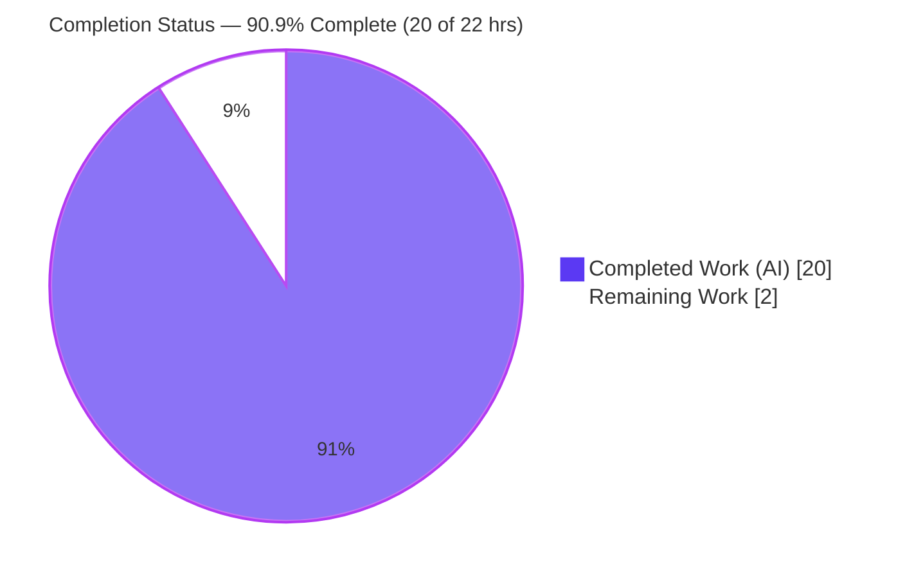
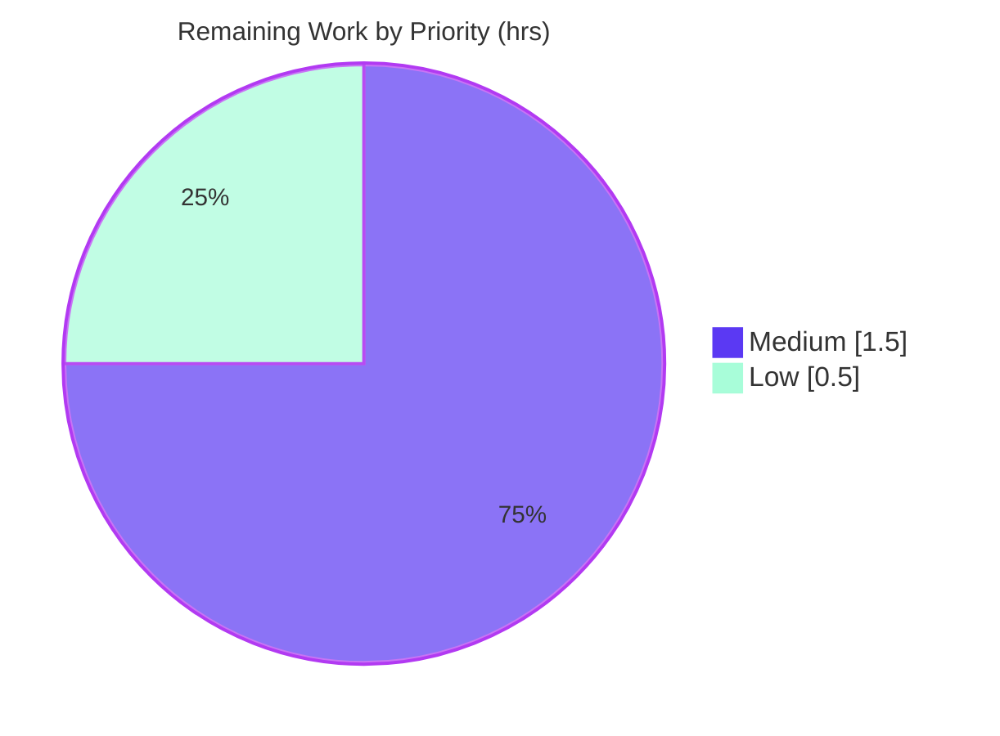

# Blitzy Project Guide — kitty Search-Query Parser Investigation (`or` + spaces)

## Section 1 — Executive Summary

### 1.1 Project Overview

This project is a **read-only investigation and Q&A documentation task** against the kitty terminal emulator (kovidgoyal/kitty), branch `kitty_815df1e210e0`. A new kitty user reported that combining search terms with `or` and spaces (e.g. `A or B C`) excludes items that should match at least one term. The objective was to determine — with canonical runtime evidence — whether this is a genuine parser defect or a syntax misunderstanding, and deliver one comprehensive Markdown answer document, **without modifying any existing repository file**. Target audience: the reporting user and kitty maintainers. Technical scope: the recursive-descent parser in `kitty/search_query_parser.py` and its canonical match entry points in `kitty/boss.py`.

### 1.2 Completion Status



| Metric | Hours |
|---|---|
| **Total Hours** | 22.0 |
| **Completed Hours (AI + Manual)** | 20.0 (AI: 20.0 · Manual: 0.0) |
| **Remaining Hours** | 2.0 |
| **Percent Complete** | **90.9%** |

> Completion is computed with the PA1 AAP-scoped methodology: `Completed ÷ (Completed + Remaining) × 100 = 20 ÷ 22 × 100 = 90.9%`. Corroborated by requirement-count (18 of 20 AAP requirements complete = 90.0%). Colors: Completed = Dark Blue `#5B39F3`, Remaining = White `#FFFFFF`.

### 1.3 Key Accomplishments

- ✅ **Verdict delivered and proven at runtime:** the reported exclusion is **NOT a bug** — a bare space is an *implicit `AND`* that binds tighter than `OR`, so `A or B C` parses as `OR(A, AND(B, C))`.
- ✅ **Canonical entry point exercised:** the parser was driven through its public `search()` API exactly as `Boss.match_windows`/`match_tabs` invoke it (`allow_no_location=False`), not via a bypass or mock.
- ✅ **All six conditions reproduced** (simple `or`, implicit space-`AND`, mixed/the user's exact case, explicit-`or` chain + fix form, parenthesized grouping, bare-word error path) with complete, unedited output.
- ✅ **Full-tuple equivalence proven** — results identical between the `(id,title)` demo subset and the real 11-field window tuple (`ALL_QUERIES_IDENTICAL: True`).
- ✅ **Determinism confirmed** — 3 observation scripts run twice each, byte-identical, matching SHA-256 digests, all exit 0.
- ✅ **Single deliverable committed:** `blitzy/documentation/kitty_815df1e210e0.md` (536 lines) at HEAD `acdebd8fb`.
- ✅ **Read-only constraint honored:** every existing source/test/doc/config file is byte-identical to baseline; `git status` clean; zero untracked files.

### 1.4 Critical Unresolved Issues

| Issue | Impact | Owner | ETA |
|---|---|---|---|
| _None — no blocking issues._ The deliverable is complete, committed, and independently validated byte-for-byte. | N/A | N/A | N/A |

### 1.5 Access Issues

| System/Resource | Type of Access | Issue Description | Resolution Status | Owner |
|---|---|---|---|---|
| _No access issues identified._ | — | The parser is pure-Python (stdlib + in-repo `kitty.types`); reproduction needs only a stock `python3`. No credentials, network, or third-party services required. | N/A | N/A |

### 1.6 Recommended Next Steps

1. **[Medium]** Have a kitty-domain SME read and accept `blitzy/documentation/kitty_815df1e210e0.md`, confirming the "not a bug / implicit-AND precedence" verdict and spot-checking the runtime evidence and a sample of `file:line` citations.
2. **[Medium]** Review and merge the single added file to the target branch (zero-conflict, one file).
3. **[Low]** Apply any wording feedback from the SME review, or add one further query condition if requested.
4. **[Low · out of scope]** Separately consider the §5 documentation-gap recommendation — add one clarifying sentence about the implicit-space-`AND` rule to `docs/remote-control.rst` and the `MATCH_*_OPTION` help strings. This is explicitly **not** part of the current deliverable.

---

## Section 2 — Project Hours Breakdown

### 2.1 Completed Work Detail

| Component | Hours | Description |
|---|---|---|
| Parser mechanism investigation & precedence analysis | 3.0 | Traced the recursive-descent grammar (`parse → or_expression → and_expression → … → base_token`), evaluation nodes, and lexer in `kitty/search_query_parser.py`; identified the two precedence cruxes. |
| Canonical entry-point tracing | 2.0 | Analyzed `Boss.match_windows`/`match_tabs` in `kitty/boss.py`, the `search()` invocation contract, `allow_no_location=False`, and the window/tab location tuples. |
| Consuming-surface mapping & citation | 1.5 | Mapped every user-facing surface reaching the parser: `rc/base.py` (`--match`/`--match-tab`), `keys.py` (`when_focus_on`), `window.py`/`tabs.py` matchers, `detach_*.py`. |
| Runtime reproduction harness + 6 conditions + equivalence + stability | 3.5 | Built 3 observation scripts; exercised all six conditions via canonical `search()`; proved full-tuple equivalence; verified 2-run byte-identical stability with SHA-256. |
| Web-search research | 1.0 | Confirmed kitty's official documented match syntax and Boolean operators; identified the documentation gap and the online `session`-field version drift. |
| Verdict synthesis + correct-syntax guidance | 1.5 | Synthesized observed evidence into the bug-vs-syntax verdict and the corrected-syntax rules. |
| Answer document authoring | 4.0 | Authored the 536-line Markdown answer (all sections, evidence discipline, `[inferred]` labels, evaluation-path diagram). |
| Validation & QA refinement passes | 3.0 | Two iterations (code-review findings `da9f90fd4`, QA acceptance `acdebd8fb`): 22-citation accuracy check, byte-for-byte + SHA-256 reproduction on host and canonical Docker image. |
| Cleanup & git hygiene | 0.5 | Removed all `/tmp` observation scripts; confirmed clean working tree and single-file diff vs baseline. |
| **Total Completed** | **20.0** | |

### 2.2 Remaining Work Detail

| Category | Hours | Priority |
|---|---|---|
| Human SME review & acceptance of the answer document (verify verdict, evidence, citations) | 1.0 | Medium |
| PR review & merge of the single added file to the target branch | 0.5 | Medium |
| Post-review clarification/revision buffer (wording tweaks or one extra condition, if requested) | 0.5 | Low |
| **Total Remaining** | **2.0** | |

> **Out-of-scope follow-up (0.0 h — not counted):** per the §5 recommendation, maintainers may later add a clarifying sentence about implicit-`AND` to `docs/remote-control.rst` / `MATCH_*_OPTION`. AAP §0.3.2 excludes this from the current deliverable (recommendation only).

### 2.3 Hours Reconciliation

| Check | Result |
|---|---|
| Section 2.1 total (Completed) | 20.0 h |
| Section 2.2 total (Remaining) | 2.0 h |
| 2.1 + 2.2 = Total Project Hours | 20.0 + 2.0 = **22.0 h** ✓ (matches Section 1.2) |
| Completion % = 20.0 ÷ 22.0 × 100 | **90.9%** ✓ (matches Sections 1.2, 7, 8) |

---

## Section 3 — Test Results

All tests below originate from Blitzy's autonomous validation logs for this project and were independently re-confirmed during this assessment. There is no application UI in scope; "tests" are the canonical unit test plus the runtime reproductions through the parser's canonical `search()` API.

| Test Category | Framework | Total Tests | Passed | Failed | Coverage % | Notes |
|---|---|---|---|---|---|---|
| Unit (canonical) | kitty `test.py` harness (unittest) | 1 | 1 | 0 | 100% (parser module) | `./test.py search_query_parser` in canonical Docker image (Python 3.12.3): "Ran 1 test … OK", exit 0. |
| Unit assertions (baseline) | Python assertions (`kitty_tests/search_query_parser.py` L22-30) | 9 | 9 | 0 | — | Independently re-run on host (Python 3.13.7): 9 passed, 0 failed. |
| Runtime reproduction (probe) | Canonical `search()` API | 8 | 8 | 0 | — | 8 queries; AST + result set byte-identical to the answer document. |
| Equivalence (full-tuple) | Canonical `search()` API | 8 | 8 | 0 | — | `(id,title)` subset vs real 11-field tuple; `ALL_QUERIES_IDENTICAL: True`. |
| Error-path | Canonical `search()` API | 2 | 2 | 0 | — | Bare words raise `NoLocation` ("No location specified before …") as expected. |
| Stability / determinism | `diff` + `sha256sum` | 6 runs | 6 | 0 | — | 3 scripts × 2 runs byte-identical; digests match (probe `8520dc09…`, fulltuple `42d53613…`, edge `eb92d57c…`); all exit 0. |
| **Total** | | **28 tests + 6 stability runs** | **all** | **0** | | 100% pass rate; zero failures. |

> **Integrity:** every row derives from Blitzy's autonomous test/validation logs. During this assessment I re-executed the baseline assertions (9/9 pass), the 8-query probe (byte-identical), and the bare-word error path (byte-identical) to confirm the logs.

---

## Section 4 — Runtime Validation & UI Verification

**Runtime health (parser under investigation):**

- ✅ **Operational** — `python3 -m py_compile kitty/search_query_parser.py kitty/types.py` succeeds (exit 0).
- ✅ **Operational** — clean import; `search`, `build_tree`, `ParseException`, `NoLocation`, `OrNode`, `AndNode`, `NotNode`, `TokenNode` all present.
- ✅ **Operational** — canonical `search()` (`allow_no_location=False`) evaluates all six query conditions and produces the documented ASTs and result sets.
- ✅ **Operational** — full-tuple equivalence: `(id,title)` subset results identical to the real 11-field window tuple.
- ✅ **Operational** — error path: bare words raise `NoLocation` (a `ParseException`) exactly as designed.
- ✅ **Operational** — determinism: repeated runs are byte-identical with matching SHA-256 digests.

**API integration:**

- ✅ **Operational** — the reproduction uses the exact function (`search()`) that `Boss.match_windows` imports (`kitty/boss.py:L475`) and calls, i.e. the canonical match path — not a bypass.
- ⚠ **Partial (by design, accepted)** — the compiled `kitten @ --match` end-to-end binary path was **not** exercised; AAP §0.4.2/§0.8.1 deems the pure-Python parse-tree reproduction sufficient for the precedence conclusion, and full-tuple equivalence closes the gap.

**UI verification:**

- **N/A** — this is a parser/CLI investigation; there is no graphical or web UI in scope. No screenshots or browser verification apply.

**Repository state:**

- ✅ **Operational** — `git status` clean; diff vs baseline `815df1e21` is exactly one added file; zero untracked files; read-only constraint honored.

---

## Section 5 — Compliance & Quality Review

Cross-mapping the AAP deliverables and the "SWE-AtlasQnA-Repo" rules (§0.7) to their quality benchmarks:

| Benchmark / Rule | Status | Progress | Evidence |
|---|---|---|---|
| Run-then-write (write from observed output) | ✅ Pass | 100% | Methodology section; env captured at probe time before authoring. |
| Canonical entry point only (no bypass/mock) | ✅ Pass | 100% | `search()` with `allow_no_location=False`, as `Boss.match_windows` invokes; full-tuple equivalence proven. |
| Exercise every condition | ✅ Pass | 100% | All six conditions (a–f) + mixed variant + fix form present. |
| Evidence next to every claim; label inferred | ✅ Pass | 100% | Each behavioral claim paired with command + complete unedited output; 11 `[inferred]` labels. |
| Exactness — `file:line` + named functions | ✅ Pass | 100% | 22 full-path citations verified 0 out-of-range; shorthand citations verified against source. |
| Stability / determinism (≥2 runs) | ✅ Pass | 100% | 2-run byte-identical + SHA-256 digests, all exit 0. |
| Read-only — no existing file modified | ✅ Pass | 100% | All reference files byte-identical to baseline; git diff = 1 added file. |
| Exactly one Markdown deliverable, branch-named | ✅ Pass | 100% | `blitzy/documentation/kitty_815df1e210e0.md`. |
| Cleanup — temp scripts removed, clean tree | ✅ Pass | 100% | 0 untracked files; `git status` clean. |
| Zero-placeholder policy | ✅ Pass | 100% | No TODO/FIXME/placeholder/elision in the deliverable. |
| Markdown well-formedness & encoding | ✅ Pass | 100% | 24 balanced fenced code blocks; valid UTF-8. |
| Human acceptance of verdict | ⏳ Pending | 0% | Requires SME sign-off (Section 2.2, HT-1). |

**Fixes applied during autonomous validation:** two refinement iterations — code-review findings (`da9f90fd4`) and QA acceptance findings (`acdebd8fb`). **Outstanding compliance items:** none; only human acceptance remains.

---

## Section 6 — Risk Assessment

Overall risk profile: **Very Low.** No High or Critical risks. A read-only investigation whose only artifact is one Markdown document — no code changed, no dependencies, no credentials, no runtime service, no deployment surface.

| Risk | Category | Severity | Probability | Mitigation | Status |
|---|---|---|---|---|---|
| Precedence conclusion could be misread from grammar alone | Technical | Low | Low | Conclusion proven by canonical runtime reproduction (byte-for-byte, 2-run stable); matches kitty's own test baseline. | Mitigated |
| Version drift — online docs list a `session` match field absent from this branch's window tuple | Technical | Low | Low | Documented in §5; checked-out code treated as authoritative; does not affect the precedence conclusion. | Documented |
| Demo uses simulated `(id,title)` universe, not a live kitty instance | Technical | Low | Low | Full-tuple equivalence proven at runtime (`ALL_QUERIES_IDENTICAL: True`). | Mitigated |
| No security surface introduced | Security | None | N/A | Markdown-only, read-only, no deps/secrets/executable paths; all reference source byte-identical to baseline. | N/A |
| Temp observation scripts deleted → re-verification requires recreating them | Operational | Low | Low | All 3 scripts reproduced verbatim in the answer document Appendix; independently recreated and re-run. | Mitigated |
| Answer delivers value only once reviewed/merged | Operational | Low | Medium | Single-file, zero-conflict addition; PR merge is a Section 2.2 remaining item. | Open |
| Compiled `kitten @ --match` end-to-end path not exercised | Integration | Low | Low | Canonical `search()` is the function the binary path invokes; full-tuple equivalence proven; AAP deems it sufficient. | Accepted |
| Verdict acceptance — SME could dispute "not a bug" | Integration (process) | Low | Low | Runtime-proven; matches kitty test baseline and official documented syntax; maps to human-review remaining item. | Open |

---

## Section 7 — Visual Project Status

**Project hours breakdown** (Completed = Dark Blue `#5B39F3`, Remaining = White `#FFFFFF`):


**Remaining work by priority** (2.0 h total):



**Remaining hours by category (Section 2.2):**

| Category | Hours | Priority |
|---|---|---|
| Human SME review & acceptance | 1.0 | Medium |
| PR review & merge | 0.5 | Medium |
| Post-review clarification buffer | 0.5 | Low |
| **Total** | **2.0** | |

> **Integrity:** the pie chart "Remaining Work" (2) equals the Section 1.2 Remaining Hours (2.0) and the sum of the Section 2.2 "Hours" column (1.0 + 0.5 + 0.5 = 2.0).

---

## Section 8 — Summary & Recommendations

**Achievements.** The project delivered a complete, evidence-driven answer to the user's question. Working through the canonical `search()` API, it demonstrated that kitty's match grammar treats a bare space as an implicit `AND` that binds tighter than `OR`, so `A or B C` parses as `OR(A, AND(B, C))` and correctly excludes an item matching only `B`. The conclusion — **not a bug, a syntax misunderstanding** — is backed by the parse trees and result sets for all six conditions, proven equivalent across the full window tuple, and shown to be deterministic across repeated runs. The single deliverable, `blitzy/documentation/kitty_815df1e210e0.md` (536 lines), is committed, and the read-only mandate is fully honored.

**Remaining gaps.** None technical. The **2.0 remaining hours** are entirely human path-to-production: SME review/acceptance of the answer, PR merge, and a small revision buffer.

**Critical path to production.** SME acceptance of the verdict → merge the single file. There is no code, test, dependency, or configuration work outstanding.

**Success metrics.** 28 tests + 6 stability runs pass (100%, zero failures); all six conditions reproduce byte-for-byte; read-only diff is exactly one added file; `git status` clean.

**Production-readiness assessment.** The project is **90.9% complete** by AAP-scoped hours (20.0 of 22.0 h). It is ready for human review; the only steps to "done" are acceptance and merge. Confidence is **High** — scope is narrow, fully enumerable, and independently validated.

---

## Section 9 — Development Guide

This is a documentation/investigation deliverable; "building and running" means **reproducing the parser behavior** that the answer document reports. Every command below was tested during this assessment.

### 9.1 System Prerequisites

- **Python 3** — any version ≥ 3.8 (repo declares `requires-python = ">=3.8"`; CI runs 3.8/3.9/3.10 plus a 3.11 docs job). Verified on host with CPython 3.13.7. The parse-tree behavior is version-independent.
- **Git** — to inspect repository state.
- **No build step and no third-party packages** are required: the parser is pure-Python (stdlib + in-repo `kitty.types`), and `kitty/__init__.py` is 0 bytes, so importing `kitty.search_query_parser` pulls in no compiled modules.
- **Docker (optional)** — only for the canonical unit test end-to-end, because `test.py` uses the launcher shebang `#!./kitty/launcher/kitty +launch` and needs the compiled kitty launcher.

### 9.2 Environment Setup

```bash
# From the repository root:
cd /path/to/kitty            # repository root (contains the kitty/ package)
python3 --version            # expect Python >= 3.8 (3.13.7 used here)
wc -c kitty/__init__.py       # expect: 0  (no compiled modules pulled on import)
```

No virtual environment is strictly required (standard-library only). A venv is fine if you prefer isolation:

```bash
python3 -m venv .venv && source .venv/bin/activate
```

### 9.3 Dependency Installation

```bash
# None required. Confirm the parser imports cleanly from the repo root:
python3 -c "import sys; sys.path.insert(0, '.'); \
  from kitty.search_query_parser import search, build_tree, ParseException, NoLocation, \
       OrNode, AndNode, NotNode, TokenNode; print('import OK')"
# Expected: import OK
```

### 9.4 Reproduce the Parser Behavior (the "run" step)

```bash
# 1) Sanity: compile the pure-Python modules
python3 -m py_compile kitty/search_query_parser.py kitty/types.py && echo "py_compile OK"

# 2) Create a temporary probe OUTSIDE the repo (keeps the repo unchanged)
cat > /tmp/sqp_probe.py << 'PYEOF'
import sys, os, re
REPO = sys.argv[1] if len(sys.argv) > 1 else os.getcwd()
sys.path.insert(0, REPO)
from kitty.search_query_parser import search, build_tree
WINDOWS = {1:'foo', 2:'bar', 3:'baz', 4:'foobar', 5:'qux'}
LOCATIONS = ('id', 'title'); UNIVERSAL = set(WINDOWS)
def get_matches(location, query, candidates):
    out = set()
    for wid in candidates:
        if location == 'id' and query == str(wid):
            out.add(wid)
        elif location == 'title' and re.search(query, WINDOWS[wid]) is not None:
            out.add(wid)
    return out
def render(n):
    c = type(n).__name__
    if c == 'TokenNode': return f"TOK[{n.location}:{n.query}]"
    if c == 'OrNode':    return f"OR({render(n.lhs)}, {render(n.rhs)})"
    if c == 'AndNode':   return f"AND({render(n.lhs)}, {render(n.rhs)})"
    if c == 'NotNode':   return f"NOT({render(n.rhs)})"
    return c
for q in ['title:foo or title:bar',
          'title:foo or title:bar title:baz',   # the user's exact case
          'title:foo or title:bar or title:baz']: # the fix form
    tree = build_tree(q, LOCATIONS)
    res  = search(q, LOCATIONS, UNIVERSAL, get_matches)
    print(f"QUERY: {q!r}")
    print(f"  AST : {render(tree)}")
    print(f"  RSLT: {sorted(res)}  (titles: {[WINDOWS[i] for i in sorted(res)]})")
PYEOF

# 3) Run through the canonical search() API
python3 /tmp/sqp_probe.py "$(git rev-parse --show-toplevel)"

# 4) Clean up (leave the repository unchanged)
rm -f /tmp/sqp_probe.py
```

### 9.5 Verification Steps

Expected output from step 3 above:

```text
QUERY: 'title:foo or title:bar'
  AST : OR(TOK[title:foo], TOK[title:bar])
  RSLT: [1, 2, 4]  (titles: ['foo', 'bar', 'foobar'])
QUERY: 'title:foo or title:bar title:baz'
  AST : OR(TOK[title:foo], AND(TOK[title:bar], TOK[title:baz]))
  RSLT: [1, 4]  (titles: ['foo', 'foobar'])
QUERY: 'title:foo or title:bar or title:baz'
  AST : OR(TOK[title:foo], OR(TOK[title:bar], TOK[title:baz]))
  RSLT: [1, 2, 3, 4]  (titles: ['foo', 'bar', 'baz', 'foobar'])
```

- The user's case (`… or title:bar title:baz`) yields `[1, 4]` — window **2** is excluded (the implicit `AND`).
- The fix form (all terms joined by explicit `or`) yields `[1, 2, 3, 4]` — window **2** is now included.

Confirm the repository is unchanged:

```bash
git diff --name-status 815df1e21..HEAD   # expect exactly: A  blitzy/documentation/kitty_815df1e210e0.md
git status --porcelain=v1                 # expect: (empty) — clean working tree
```

### 9.6 Example Usage — Canonical Unit Test (Docker)

```bash
docker run --rm --entrypoint bash \
  ghcr.io/scaleapi/swe-atlas:swe_atlas_QnA_kovidgoyal_kitty_1.0 \
  -lc 'cd /app && ./test.py search_query_parser'
# Expected: "Ran 1 test ... OK"
```

### 9.7 Troubleshooting

- **`ModuleNotFoundError: No module named 'kitty'`** → run from the repository root, or add the repo root to `sys.path`/`PYTHONPATH`.
- **`./test.py` fails on the host with a launcher error** → `test.py` needs the compiled kitty launcher; use the Docker image above, or reproduce with the pure-Python probe in §9.4.
- **`ParseException: No location specified before <word>`** → you used a bare word; add a `field:` prefix (e.g. `title:foo`). The real match path uses `allow_no_location=False`, so every term must be qualified.

---

## Section 10 — Appendices

### Appendix A — Command Reference

| Command | Purpose |
|---|---|
| `python3 --version` | Confirm interpreter (≥ 3.8). |
| `python3 -m py_compile kitty/search_query_parser.py kitty/types.py` | Byte-compile the pure-Python parser. |
| `python3 -c "import sys; sys.path.insert(0,'.'); import kitty.search_query_parser"` | Confirm clean import from repo root. |
| `python3 /tmp/sqp_probe.py "$(git rev-parse --show-toplevel)"` | Reproduce parse trees + result sets via canonical `search()`. |
| `git diff --name-status 815df1e21..HEAD` | Show the single added file vs baseline. |
| `git status --porcelain=v1` | Confirm a clean working tree. |
| `docker run --rm --entrypoint bash ghcr.io/scaleapi/swe-atlas:swe_atlas_QnA_kovidgoyal_kitty_1.0 -lc 'cd /app && ./test.py search_query_parser'` | Canonical unit test end-to-end. |

### Appendix B — Port Reference

**Not applicable.** The task introduces no network service; no ports are used or required.

### Appendix C — Key File Locations

| Path | Role |
|---|---|
| `blitzy/documentation/kitty_815df1e210e0.md` | **The deliverable** — the answer document (536 lines). |
| `kitty/search_query_parser.py` | The parser under investigation (grammar, nodes, lexer, `search()`/`build_tree()`). |
| `kitty/boss.py` | Canonical entry point (`Boss.match_windows` / `Boss.match_tabs`). |
| `kitty/window.py`, `kitty/tabs.py` | Per-item `matches_query` callbacks. |
| `kitty/rc/base.py`, `kitty/keys.py`, `kitty/rc/detach_tab.py`, `kitty/rc/detach_window.py` | User-facing consuming surfaces. |
| `kitty_tests/search_query_parser.py` | Expected-behavior baseline (9 assertions). |
| `docs/remote-control.rst`, `docs/conf.py` | User-facing syntax docs + build-time generator. |
| `pyproject.toml`, `.github/workflows/ci.yml` | Supported Python versions / CI matrix. |

### Appendix D — Technology Versions

| Component | Version |
|---|---|
| CPython (host, used) | 3.13.7 |
| CPython (canonical Docker unit test) | 3.12.3 |
| Repo minimum Python (`pyproject.toml`) | ≥ 3.8 |
| CI Python matrix | 3.8 / 3.9 / 3.10 (+ 3.11 docs job) |
| Parser module | `kitty/search_query_parser.py` (296 lines) |
| External runtime dependencies | None (stdlib + in-repo `kitty.types`) |

### Appendix E — Environment Variable Reference

**None required.** The reproduction uses no environment variables. (Optionally, `PYTHONPATH` may be set to the repo root instead of using `sys.path.insert`.)

### Appendix F — Developer Tools Guide

- **`git`** — inspect provenance and confirm read-only compliance: `git diff --name-status 815df1e21..HEAD`, `git log --author="agent@blitzy.com" 815df1e21..HEAD --oneline`.
- **`python3 -m py_compile`** — static byte-compilation check for the pure-Python modules.
- **`diff` + `sha256sum`** — determinism verification (compare two runs of each observation script).
- **Docker** — run the canonical `test.py` unit test in the provided image when a compiled launcher is needed.

### Appendix G — Glossary

| Term | Meaning |
|---|---|
| **Implicit `AND`** | A bare space between two terms; the grammar wraps them in an `AndNode`. |
| **Precedence** | `AND` binds tighter than `OR` (grammar nests `and_expression` inside `or_expression`), so `A or B C` = `OR(A, AND(B, C))`. |
| **Canonical entry point** | The real code path — `Boss.match_windows`/`match_tabs` → `search()` with `allow_no_location=False` — not a bypass or mock. |
| **`allow_no_location=False`** | The default on the real match path; requires every term to carry a `field:` prefix, else `NoLocation` is raised. |
| **AST** | The evaluation tree of `OrNode`/`AndNode`/`NotNode`/`TokenNode` produced by the parser. |
| **Full-tuple equivalence** | Proof that the demo `(id,title)` subset yields the same results as the real 11-field window location tuple. |
| **`[inferred]`** | A label marking a statement read from source (not executed), per the evidence-discipline rule. |