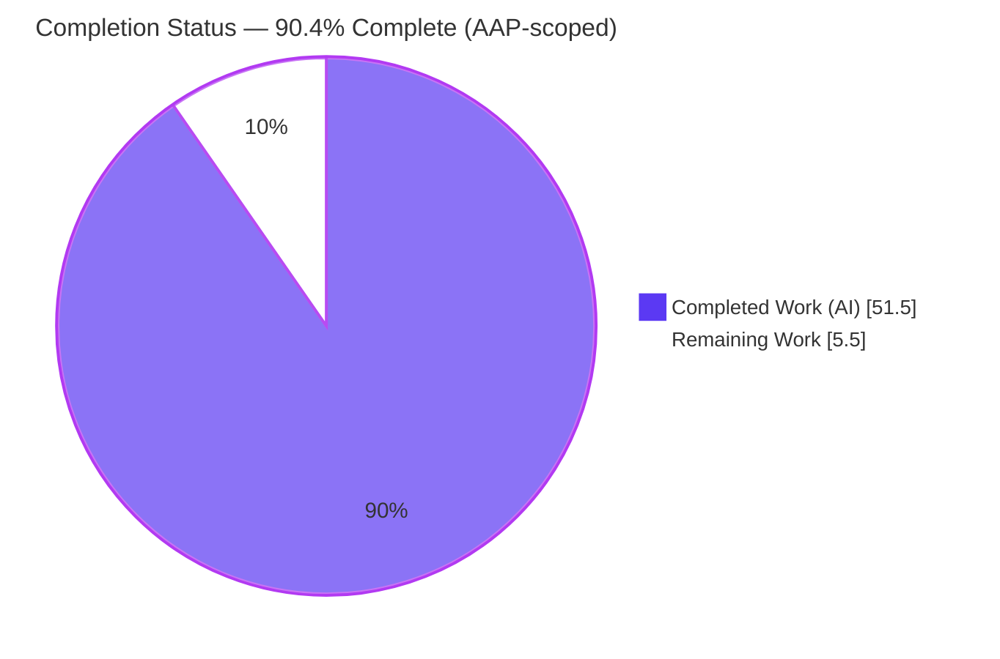
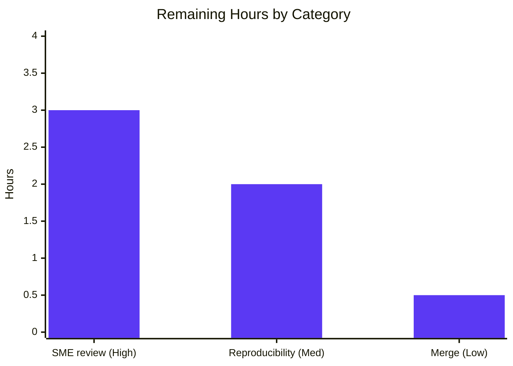

# Blitzy Project Guide — kitty Window-Lifecycle State-Consistency Q&A

> Branch: `blitzy-56483927-44f2-4b4e-b5f6-a9d256171ba2` · Base: `815df1e21` ("Wire up applying of font config") · HEAD: `931da59fe`
> Deliverable: `blitzy/documentation/kitty_815df1e210e0.md` (single added file; read-only investigation)

---

## 1. Executive Summary

### 1.1 Project Overview

This is a read-only code-investigation Q&A for the kovidgoyal/kitty terminal emulator (version 0.35.2). The sole deliverable is a single evidence-backed markdown document that answers six questions about how kitty keeps its Python object graph and C-side child registry mutually consistent as terminal windows are created, resized, and destroyed in rapid succession — spanning signal delivery (`SIGWINCH`/`SIGCHLD`), cross-thread bookkeeping, teardown races, keep-versus-discard decisions, and conflicting liveness views. The target audience is kitty maintainers and systems engineers. The investigation built and ran the real binary, captured verbatim runtime evidence, and grounded every claim in `file:line` citations — without modifying any source file.

### 1.2 Completion Status

The completion percentage is calculated using AAP-scoped, hours-based methodology: `Completed Hours ÷ Total Hours × 100`. Only work defined in the Agent Action Plan and standard path-to-production activities are counted.



| Metric | Hours |
|--------|-------|
| **Total Hours** | **57.0** |
| **Completed Hours (AI + Manual)** | **51.5** (AI 51.5 + Manual 0.0) |
| **Remaining Hours** | **5.5** |
| **Percent Complete** | **90.4%** |

> Calculation: `51.5 ÷ 57.0 × 100 = 90.4%`. All completed hours were delivered autonomously by Blitzy agents (Manual = 0).

### 1.3 Key Accomplishments

- ✅ Delivered the complete answer document `blitzy/documentation/kitty_815df1e210e0.md` (2285 lines, 13 sections, UTF-8, 118 balanced code fences).
- ✅ Answered all six questions (Q1–Q6) with a lead direct answer, a TL;DR table, causal reasoning, and evidence.
- ✅ Built kitty canonically (`python3 setup.py build --verbose`) under strict `-Werror`; zero compiler diagnostics.
- ✅ Ran the **real** binary via the canonical entry point (`--debug-rendering --config NONE --session`) under headless Xvfb + software GL — never a remote-control or debug-hook bypass as a measured value.
- ✅ Reproduced the two observable log lines (`Child launched`, `SIGWINCH sent to child in window:`) and the teardown-race line (`Failed to send resize signal to child with id:`).
- ✅ Proved genuine kernel `SIGWINCH` delivery (§6.1): byte-identical child-side size tuples with `pid==pgid==sid`.
- ✅ Characterized run-to-run behavior (§11): 20 identical runs with a stable distribution plus a scale sweep, honoring the reproduce-inconsistency rule.
- ✅ Grounded every claim in `file:line` (178 citation occurrences) with explicit observed / inferred / source-grounded labels; §12 even corrects the AAP's imprecise citations.
- ✅ Preserved the read-only constraint byte-for-byte: `git diff 815df1e21 --name-status` = exactly one added file; clean working tree; temp scripts removed.
- ✅ Passed all five autonomous production gates (dependencies, compilation, tests, runtime, in-scope file).

### 1.4 Critical Unresolved Issues

No critical technical issues block release or validation. All five autonomous gates pass and the deliverable is byte-for-byte read-only-compliant. The only open item is the human path-to-production sign-off inherent to authoritative documentation.

| Issue | Impact | Owner | ETA |
|-------|--------|-------|-----|
| No blocking technical defects identified | None — build, tests, runtime, and read-only constraint all pass | — | — |
| Authoritative Q&A awaits human SME technical sign-off (not a defect; standard for documentation) | Non-blocking; gates completeness of acceptance | SME reviewer (kitty maintainer / systems engineer) | ~3.0h |

### 1.5 Access Issues

| System / Resource | Type of Access | Issue Description | Resolution Status | Owner |
|-------------------|----------------|-------------------|-------------------|-------|
| `ghcr.io/scaleapi/swe-atlas:swe_atlas_QnA_kovidgoyal_kitty_1.0` (canonical build/run container) | Container registry pull | Reproducing the runtime evidence requires this image (Python 3.12 + Go 1.23 + gcc 13.3 + GL/X libs). A reviewer without pull access or an equivalent toolchain cannot rebuild/re-run. | Documented in Section 9; reviewer must have registry access or an equivalent toolchain | Reviewer / Platform |
| kitty source repository | Git read/write | None — full read access confirmed; only one file added on the branch | Resolved | Blitzy Agent |
| External services / API keys / secrets | — | None required — read-only local investigation; kitty spawns only local child processes | No access issues identified | — |

### 1.6 Recommended Next Steps

1. **[High]** SME technical review of the Q1–Q6 answers and the two-thread reconciliation model against the cited source (~1.5h).
2. **[High]** Spot-check a representative sample of `file:line` citations — especially the §12-corrected ones and the observed-verbatim log lines (~1.0h).
3. **[High]** Confirm the `(inferred)`-labeled claims (e.g., the Q6 `None`-guard firing) are acceptable, or request a direct observation (~0.5h; optional deep-dive +2–3h).
4. **[Medium]** Reproduce the build and the §11 harness in the canonical container; confirm the observables and the internally-stable run-to-run distribution (~2.0h).
5. **[Low]** Verify the read-only constraint (`git diff` = single `A` line) and clean tree, then accept and merge (~0.5h).

---

## 2. Project Hours Breakdown

### 2.1 Completed Work Detail

Every completed component traces to an AAP requirement or a path-to-production activity. All hours were delivered autonomously by Blitzy agents.

| Component | Hours | Description |
|-----------|-------|-------------|
| Canonical build + headless GL/Xvfb provisioning + baseline clean-tree | 5.0 | Built kitty (C extension + Go tools + Python) via `setup.py build`; provisioned headless Xvfb + software GL (llvmpipe); captured a clean-tree baseline. |
| Canonical run instrumentation + observable capture | 3.0 | Launched the real binary with `--debug-rendering` under a headless display; captured the `Child launched` and `SIGWINCH sent` stderr observables. |
| Q1 — State consistency under churn | 2.5 | Investigated and documented the strong graph (`os_window_map→TabManager→Tab→WindowList→Window`) vs. weak `window_id_map` vs. C `children[]`, reconciled via `children_lock` + deferred queues + `needs_removal` + weak refs. |
| Q2 — Create-and-run flow + §6.1 kernel-delivery proof + §6.2 dedup | 4.0 | Traced `Child.fork()`→PTY→`set_geometry`→`TIOCSWINSZ`→`SIGWINCH`; built a child-side prober proving byte-identical size tuples with `pid==pgid==sid`; documented unchanged-geometry deduplication. |
| Q3 — Destruction-during-reaction | 2.5 | Forced and captured the removed-child resize miss (`child-monitor.c:610`); documented the `destroyed` early-return and the defensive `EBADF`/`ENOTTY` path (honestly labeled not-observed-as-live). |
| Q4 — Keep vs. discard | 3.0 | Documented `Screen`/PTY-fd discard vs. exit-status retention for monitored pids; corrected the default removal path (PTY EOF/HUP, not the `SIGCHLD` reaper under `--config NONE`). |
| Q5 — Timing & signal delivery | 3.0 | Documented the Linux `signalfd` synchronous drain, the `reap_children` `waitpid(WNOHANG)` loop absorbing coalesced `SIGCHLD`, and the `input_delay` wakeup cadence. |
| Q6 — Conflicting views of liveness (both directions) | 4.0 | Reproduced C-first divergence (`:610`) and drove the Python-first OS-window close; added the SIGHUP-ignoring-child-outlives-kitty (§11.8) and live-keeper WM-close (§11.9) boundary producers. |
| §3 Two-thread reconciliation model + mermaid diagram | 2.0 | Authored the foundational cross-thread model with a mermaid flow of the main-thread/I/O-thread producers and consumers around `children_lock`. |
| §4 OS-contract background research | 2.0 | Researched and cited `SIGCHLD` non-queueing, `TIOCSWINSZ`→`SIGWINCH`, and deferred signal semantics (`signal(7)`, `wait(2)`, `tty_ioctl(4)`, `signalfd(2)`). |
| §11 Race-reproduction harness + distribution + logs | 6.0 | Built the self-cleaning observation harness; ran 20 identical saturated runs + a 15×6 scale sweep; embedded the full 299-line log and complete CSV. |
| Per-claim citations + evidentiary labels + §12 coverage checklist | 3.5 | Attached 178 `file:line` citations; labeled every claim observed/inferred/source-grounded; built the symbol→evidence checklist and corrected the AAP's imprecise citations. |
| §13 Read-only/clean-tree proof + temp-script cleanup | 1.0 | Proved the tree differs by exactly one added file; ensured all temporary scripts self-clean via path-validated traps. |
| Document assembly + 3 QA rework rounds | 6.0 | Assembled the 2285-line document; resolved 24 review findings, then 13 QA findings, then §9/§4 provenance/quote fixes across four commits. |
| Final 5-gate validation | 4.0 | Validated dependencies, clean `-Werror` compilation, 145 Python + all Go tests, runtime-observable reproduction, and in-scope-file accuracy. |
| **Total Completed** | **51.5** | |

### 2.2 Remaining Work Detail

Each remaining category is a path-to-production activity that requires a human (authoritative documentation cannot be autonomously "accepted").

| Category | Hours | Priority |
|----------|-------|----------|
| Human SME technical review of Q1–Q6 answers, citations & race reasoning | 3.0 | High |
| Independent reproducibility spot-check in the canonical container (build/run/distribution) | 2.0 | Medium |
| Final acceptance & merge sign-off (read-only + clean-tree verification) | 0.5 | Low |
| **Total Remaining** | **5.5** | |

### 2.3 Reconciliation

| Roll-up | Hours |
|---------|-------|
| Section 2.1 Completed total | 51.5 |
| Section 2.2 Remaining total | 5.5 |
| **Total Project Hours (2.1 + 2.2)** | **57.0** |
| Cross-check vs. Section 1.2 Total | 57.0 ✅ match |

---

## 3. Test Results

All tests below originate from Blitzy's autonomous validation logs for this project (Gate 3 = kitty's own suites; Gate 4 = runtime-observable reproduction). No tests were authored for this read-only task — the suites are kitty's existing tests, executed as a build-health gate.

| Test Category | Framework | Total Tests | Passed | Failed | Coverage % | Notes |
|---------------|-----------|-------------|--------|--------|------------|-------|
| Unit (Python) | `unittest` via `./test.py` | 145 | 145 | 0 | Not reported by suite | "Ran 145 tests … OK (skipped=4)"; the 4 skips are legitimate conditional skips (frozen-build CA, macOS-only font, 2× optional-fish integration); bash & zsh integration run and pass. |
| Unit (Go) | `go test` | All (count not enumerated in log) | All | 0 | Not reported by suite | Log: "All Go tests succeeded". |
| Runtime reproduction | `kitty --debug-rendering` §11 harness | 6 identical runs | 6 | 0 | n/a | §11.3 counts (`child_launched=41`, `sigwinch_sent=131`, `failed_resize=125`, `kitty_exit=124`) reproduced exactly across 6 identical runs (Gate 4). |

> Aggregate: 145 Python + all Go unit tests pass with zero failures/errors; runtime observables reproduced deterministically for the fixed layout under test. Coverage percentages are not emitted by kitty's suites and are therefore reported as "Not reported" rather than fabricated.

---

## 4. Runtime Validation & UI Verification

Runtime validation was performed by launching the real binary through the canonical entry point under headless Xvfb + software GL and independently reproducing the documented observables.

- ✅ **Canonical build** — `python3 setup.py build --verbose` → exit 0; strict `-Werror` with zero diagnostics; `fast_data_types.so`, `kitten`, and launcher produced.
- ✅ **Version banner** — `./kitty/launcher/kitty --version` → `kitty 0.35.2 created by Kovid Goyal` (grounds `constants.py:25`).
- ✅ **Canonical entry-point runtime** — kitty runs via `--debug-rendering --config NONE --session <file>` under Xvfb + `LIBGL_ALWAYS_SOFTWARE=1 GALLIUM_DRIVER=llvmpipe`.
- ✅ **Q2 observables** — `Child launched` and `SIGWINCH sent to child in window: N with size: (…)` captured verbatim (`window.py:871,873`).
- ✅ **§6.1 kernel `SIGWINCH` delivery** — child-side prober received byte-identical size tuples to those kitty logged; `pid==pgid==sid`, `tpgid_is_self=True` (proves foreground-process-group delivery, not a synthetic value).
- ✅ **Q3/Q6 teardown race** — `Failed to send resize signal to child with id: N (children count: X) (add queue: Y)` captured (`child-monitor.c:610`); §11.3 numbers reproduced across 6 identical runs.
- ⚠ **Run-to-run counts are timing-dependent** — stable for a fixed layout, but the §11.5 scale sweep shows counts are not perfectly deterministic across configurations/hardware. This is expected and explicitly documented (it is the answer to the "sometimes X, sometimes Y" aspect), not a defect.
- ✅ **UI verification — Not applicable** — kitty is a terminal emulator with no web/GUI screens to verify, and no Figma designs are associated with this task. Runtime was exercised headlessly for signal/lifecycle observation only.

---

## 5. Compliance & Quality Review

The deliverable is cross-mapped to the governing `SWE-AtlasQnA-Repo` rule set and Blitzy quality benchmarks. Fixes applied during autonomous validation: three QA rework rounds (24 findings → 13 findings → §9/§4 provenance & quote fixes) across four commits.

| Benchmark / Rule | Requirement | Status | Evidence / Progress |
|------------------|-------------|--------|---------------------|
| Deliverable location & name | `blitzy/documentation/<branch>.md` | ✅ Pass | `blitzy/documentation/kitty_815df1e210e0.md` present. |
| Read-only repository | No existing file modified/deleted; only the answer document added | ✅ Pass | `git diff 815df1e21 --name-status` = exactly `A …kitty_815df1e210e0.md`. |
| Run-first methodology | Answer derived from captured runtime output | ✅ Pass | §2/§6/§11 embed verbatim commands + output. |
| Canonical entry point only | Real binary via `--debug-rendering`; no remote-control/debug-hook as measured value | ✅ Pass | §2 invocation; §12 lists avoided non-canonical sources. |
| Reproduce inconsistency | ≥2 identical runs; report distribution | ✅ Pass | §11.3 (20 runs) + §11.5 (15×6 scale sweep). |
| Exercise every condition | Primary + edge + before/intermediate/after | ✅ Pass | Q1–Q6 + §11.7–§11.9 boundary producers; §12 checklist. |
| Include actual output | Complete, unedited command + output | ✅ Pass | §11.4 full 299-line log; no elision. |
| `file:line` grounding | Every claim cited or labeled unverified | ✅ Pass | 178 citations; observed/inferred/source-grounded labels. |
| Temp-script cleanup | No committed temporary artifacts | ✅ Pass | §13; clean `git status`; self-cleaning traps. |
| Clean compilation | Default strict flags, no warnings suppressed | ✅ Pass | `-Werror -pedantic-errors`; zero diagnostics (Gate 2). |
| Test health | Existing suites pass | ✅ Pass | 145 Python + all Go (Gate 3). |
| Citation accuracy | Citations resolve and are content-correct | ✅ Pass | 135/135 resolve; §12 corrects AAP imprecision (`window_list.py` 67/84 → 329/373). |
| Human sign-off | SME technical acceptance | ⏳ Outstanding | Path-to-production (Section 2.2); no defect. |

---

## 6. Risk Assessment

| Risk | Category | Severity | Probability | Mitigation | Status |
|------|----------|----------|-------------|------------|--------|
| T1 — Subtle race-reasoning claims may need expert confirmation (e.g., `resize_pty` holds `children_lock` across FIND+ioctl ⇒ `EBADF`/`ENOTTY` is defensive, not a live race) | Technical | Low–Medium | Low | Every claim is `file:line`-grounded and labeled observed/inferred; SME review scheduled (High-priority task) | Open (pending human review) |
| T2 — Run-to-run counts are timing-dependent; absolute numbers will not reproduce byte-identically on different hardware | Technical | Low | Medium | The document reports a **distribution** and methodology, not a single lucky value; §11.5 documents non-determinism explicitly | Mitigated / Documented |
| T3 — A few Q6/Q4 claims are `(inferred)` (guard firing, monitored-pid status delivery, `SIGCHLD` coalescing multiplicity) rather than directly observed | Technical | Low | Low | Explicitly labeled inferred per the methodology; optional direct observation captured as a low-priority extension | Documented |
| S1 — Security exposure from the change | Security | Informational | N/A | Read-only; no source/config/dependency change; no secrets; harnesses used `umask 077` + private `mktemp` + path-validated `rm -rf` | Closed |
| O1 — Runtime evidence reproduces only in the canonical container (Python 3.12 + Go 1.23 + gcc 13.3 + Xvfb/software GL); arbitrary hosts (e.g., Python 3.13/no-Go) cannot build/run | Operational | Medium | Medium | §2/§13 and Section 9 state the exact toolchain and the named image; the pre-built launcher links `libpython3.12` | Documented |
| O2 — Gitignored build artifacts present in the checkout; `git clean -fdx` would remove them, requiring a rebuild before re-observation | Operational | Low | Low | Section 9 documents the rebuild command | Documented |
| I1 — Integration exposure | Integration | Informational | N/A | No external services/API keys/network at runtime (kitty spawns local children); no dependency manifests changed | Closed |
| P1 — Future edits to the answer document must preserve the read-only constraint (only that one file) | Process | Low | Low | Enforce `git diff <base> --name-status` = single `A` line in review | Documented |

---

## 7. Visual Project Status

**Project hours breakdown** (Completed = Dark Blue `#5B39F3`, Remaining = White `#FFFFFF`):


**Remaining hours by category** (from Section 2.2; sums to 5.5h):



> Integrity: the pie chart's "Remaining Work" = 5.5h = Section 1.2 Remaining Hours = Section 2.2 total = the sum of the bar chart categories (3.0 + 2.0 + 0.5).

---

## 8. Summary & Recommendations

**Achievements.** The project is **90.4% complete** on an AAP-scoped basis (51.5 of 57.0 hours). The single required deliverable — `blitzy/documentation/kitty_815df1e210e0.md` — exists, is comprehensive (2285 lines, 13 sections), and answers all six questions with verbatim runtime evidence and 178 `file:line` citations. The document was produced with genuine run-first discipline: kitty was built canonically under strict `-Werror`, run through its real entry point under a headless display, and driven through rapid create/resize/destroy churn to capture the exact observables the questions target. It even exceeds the AAP by adding a child-side kernel-`SIGWINCH` delivery proof, a Linux `signalfd` explanation for the timing question, and corrections to the AAP's own imprecise citations.

**Remaining gaps.** The outstanding 5.5 hours are entirely human path-to-production activities: SME technical review of the Q&A (3.0h), an independent reproducibility spot-check in the canonical container (2.0h), and read-only verification plus merge (0.5h). There are **no blocking technical defects** — all five autonomous production gates pass.

**Critical path to production.** (1) SME technical review and citation spot-check → (2) reproducibility spot-check in the canonical container → (3) read-only/clean-tree verification and merge. This path is short and low-risk because the autonomous validation already demonstrated a clean build, passing tests, reproduced runtime observables, and a byte-for-byte read-only diff.

**Success metrics.** Read-only constraint satisfied (single added file); all Q1–Q6 answered with grounded evidence; observables reproduced; distribution characterized across ≥20 identical runs; zero compiler diagnostics; 145 Python + all Go tests pass.

**Production readiness.** The deliverable is production-ready **pending human sign-off**. Consistent with best practice, an authoritative technical Q&A is not marked 100% complete until a domain expert accepts it; hence the honest 90.4%.

| Metric | Value |
|--------|-------|
| AAP-scoped completion | 90.4% (51.5 / 57.0 h) |
| Blocking technical issues | 0 |
| Autonomous gates passed | 5 / 5 |
| Remaining (human) hours | 5.5 |

---

## 9. Development Guide

This guide documents how to build, run, reproduce, and verify the investigation. Commands are grouped into **host-runnable** (verification checks that work anywhere with git + Python) and **canonical-container-required** (build/runtime, which need the pinned toolchain).

### 9.1 System Prerequisites

- **Canonical container image:** `ghcr.io/scaleapi/swe-atlas:swe_atlas_QnA_kovidgoyal_kitty_1.0` (Ubuntu 24.04 LTS base).
- **Toolchain (inside the container):** Python 3.12.3, Go 1.23.4, gcc 13.3.0, pkg-config.
- **System libraries:** `libgl`, `x11`, `xrandr`, `xinerama`, `xcursor`, `xkbcommon(-x11)`, `fontconfig`, `freetype2`, `harfbuzz`, `lcms2`, `libpng`, `wayland-client`, `dbus-1` (dev packages).
- **Headless display + software GL:** `Xvfb`, `xauth`, and `LIBGL_ALWAYS_SOFTWARE=1 GALLIUM_DRIVER=llvmpipe`.
- **Observation extras:** `strace` (syscall capture); `openbox` + `xdotool` + `wmctrl` (only for the live managed-window observations in §6.1/§10).

> ⚠ Do not attempt the build/runtime on an arbitrary host. The pre-built launcher links `libpython3.12.so.1.0`, and kitty 0.35.2's C extension does not compile under Python 3.13 with `-Werror`. Use the container.

### 9.2 Environment Setup

```bash
# The working tree is bind-mounted into the container at /work.
docker run --rm -it -v "$PWD":/work \
  ghcr.io/scaleapi/swe-atlas:swe_atlas_QnA_kovidgoyal_kitty_1.0 bash

# Inside the container:
cd /work

# Provision the headless display + observation tools (container has archive network access):
apt-get update && apt-get install -y --no-install-recommends xvfb xauth strace
apt-get install -y --no-install-recommends openbox xdotool wmctrl   # only for §6.1/§10
```

### 9.3 Build (Application Startup — Compile)

```bash
# Canonical build (matches .github/workflows/ci.py:104). Default flags are strict: -std=c11 -pedantic-errors -Werror.
python3 setup.py build --verbose      # expect: exit 0, zero warnings/errors

# Confirm the version banner:
./kitty/launcher/kitty --version      # -> kitty 0.35.2 created by Kovid Goyal
```

### 9.4 Run & Reproduce (Application Startup — Execute)

```bash
# Allocate a free display and start your own Xvfb:
Xvfb :99 -screen 0 1280x800x24 -ac +extension GLX &
export DISPLAY=:99 LIBGL_ALWAYS_SOFTWARE=1 GALLIUM_DRIVER=llvmpipe
export LANG=C.UTF-8 LC_ALL=C.UTF-8

# The single canonical, time-bounded invocation every observation reduces to
# (assign and quote the variables first — no literal placeholders):
SECS=3
WORK="$(mktemp -d)"
SESSION_FILE="$WORK/churn.session"
printf 'launch sh -c "exit 0"\nlaunch sh -c "sleep 30"\n' > "$SESSION_FILE"
timeout --signal=TERM --kill-after=5s "$SECS" \
  ./kitty/launcher/kitty --debug-rendering --config NONE --session "$SESSION_FILE" 2>stderr.log
rm -rf "$WORK"
```

For the full run-to-run distribution and boundary cases, run the self-cleaning harnesses embedded verbatim in the deliverable's §11.1, §11.2, §11.8, and §11.9.

### 9.5 Verification Steps

**Host-runnable (work anywhere; all confirmed passing):**

```bash
# 1) Version grounded in source:
grep -n 'version: Version = Version' kitty/constants.py    # -> 25:version: Version = Version(0, 35, 2)

# 2) Read-only constraint (exactly one added file):
git diff 815df1e21 --name-status                            # -> A  blitzy/documentation/kitty_815df1e210e0.md

# 3) Clean working tree:
git status --porcelain --untracked-files=all                # -> (empty)

# 4) Document integrity (use Python — a shell grep on backticks mis-counts fences):
python3 - <<'PY'
d=open('blitzy/documentation/kitty_815df1e210e0.md',encoding='utf-8').read()
lines=d.splitlines()
fences=sum(1 for l in lines if l.lstrip().startswith('```'))
print('lines:',len(lines),'| fences:',fences,'(balanced)' if fences%2==0 else '(UNBALANCED)',
      '| utf8: ok','| ends-newline:',d.endswith(chr(10)))
PY
# -> lines: 2285 | fences: 118 (balanced) | utf8: ok | ends-newline: True

# 5) Build artifacts are gitignored by design (a build does not dirty the tree):
git check-ignore kitty/fast_data_types.so kitty/launcher/kitty build/
```

**Container-only (build health):**

```bash
LANG=C.UTF-8 LC_ALL=C.UTF-8 ./test.py    # -> "Ran 145 tests ... OK (skipped=4)" + "All Go tests succeeded"
```

### 9.6 Example Usage — What to Expect

- **Observable #1 (first geometry):** `[<t>] Child launched`
- **Observable #2 (later relayout):** `[<t>] SIGWINCH sent to child in window: N with size: (rows, cols, w, h)`
- **Teardown race (under churn):** `Failed to send resize signal to child with id: N (children count: X) (add queue: Y)`
- **`kitty_exit=124`** for keeper scenarios means GNU `timeout` reached its bound (not a crash); no-keeper scenarios exit `0`.

### 9.7 Troubleshooting

- **`error while loading shared libraries: libpython3.12.so.1.0`** → you are on a non-container host; run inside the canonical container.
- **`go: command not found` / C-extension `-Werror` failures** → toolchain missing/incompatible; use the container (Go 1.23 + Python 3.12 + gcc 13.3).
- **kitty fails to open a window** → ensure Xvfb is running and `DISPLAY`, `LIBGL_ALWAYS_SOFTWARE=1`, `GALLIUM_DRIVER=llvmpipe` are exported.
- **Different absolute counts than §11.3** → expected; counts are timing-dependent. Confirm they are *internally stable per layout* and match the documented distribution shape, not the exact integers.
- **Artifacts disappeared after `git clean -fdx`** → they are gitignored; re-run `python3 setup.py build --verbose`.

---

## 10. Appendices

### Appendix A — Command Reference

| Purpose | Command |
|---------|---------|
| Build (canonical) | `python3 setup.py build --verbose` |
| Version banner | `./kitty/launcher/kitty --version` |
| Canonical run | `./kitty/launcher/kitty --debug-rendering --config NONE --session <file>` |
| Time-bounded run | `timeout --signal=TERM --kill-after=5s <SECS> ./kitty/launcher/kitty …` |
| Tests | `LANG=C.UTF-8 LC_ALL=C.UTF-8 ./test.py` |
| Read-only check | `git diff 815df1e21 --name-status` |
| Clean-tree check | `git status --porcelain --untracked-files=all` |
| Start headless display | `Xvfb :99 -screen 0 1280x800x24 -ac +extension GLX &` |

### Appendix B — Port / Display Reference

| Resource | Value | Notes |
|----------|-------|-------|
| TCP / network ports | None | kitty spawns only **local** child processes; no network listener is used in this investigation. |
| X display | `:99` (or a free `:80..:200` allocated by the harness) | Headless Xvfb socket under `/tmp/.X11-unix/`. |

### Appendix C — Key File Locations

| Path | Role |
|------|------|
| `blitzy/documentation/kitty_815df1e210e0.md` | **The deliverable** (only added file). |
| `kitty/child-monitor.c` | Two-thread registry, queues, `resize_pty` (`:610`), `reap_children`, `parse_input` (REFERENCE). |
| `kitty/window.py` | `set_geometry` observables (`:869-873`), `destroy` (REFERENCE). |
| `kitty/boss.py` | `window_id_map` (`:344`), `on_child_death` None-guard (`:883-885`) (REFERENCE). |
| `kitty/child.py`, `kitty/child.c` | `fork`/`spawn`, PTY, controlling terminal (`setsid`/`TIOCSCTTY`) (REFERENCE). |
| `kitty/window_list.py` | Per-tab registry; real `add_window`/`remove_window` at `:329`/`:373` (REFERENCE). |
| `kitty/cli.py` | `--debug-rendering` flag (`:989`) (REFERENCE). |
| `kitty/constants.py` | Version `Version(0, 35, 2)` (`:25`) (REFERENCE). |
| `setup.py`, `.github/workflows/ci.py` | Canonical build command source (REFERENCE). |

### Appendix D — Technology Versions

| Component | Version |
|-----------|---------|
| kitty | 0.35.2 |
| OS (container) | Ubuntu 24.04 LTS |
| Python (container) | 3.12.3 |
| Go (container) | go1.23.4 linux/amd64 |
| C compiler (container) | gcc 13.3.0 |
| strace | 6.8 |
| GL | llvmpipe (software) |

### Appendix E — Environment Variable Reference

| Variable | Value | Purpose |
|----------|-------|---------|
| `DISPLAY` | `:99` (or allocated) | Points kitty at the headless Xvfb. |
| `LIBGL_ALWAYS_SOFTWARE` | `1` | Forces software GL (no GPU in the container). |
| `GALLIUM_DRIVER` | `llvmpipe` | Selects the software rasterizer. |
| `LANG` / `LC_ALL` | `C.UTF-8` | Deterministic locale for tests and runs. |

### Appendix F — Developer Tools Guide

| Tool | Use in this investigation |
|------|---------------------------|
| `--debug-rendering` (kitty flag) | Surfaces the two observable stderr log lines (`window.py:871,873`). |
| `Xvfb` + software GL | Provides a headless display so the real binary can run without a GPU. |
| `strace` | Captured the `TIOCSWINSZ` ioctl and kernel-delivered `SIGWINCH` at syscall level (§6.1). |
| `openbox` / `xdotool` / `wmctrl` | Drive real window-manager close/resize events for the live-window observations (§6.1/§10) — canonical user actions, not remote control. |
| `timeout` | Bounds each run so keeper windows do not hang the harness (exit 124 = bound reached, not a crash). |
| **Avoided (non-canonical):** `kitty @` remote control, debug hooks, `KITTY_PRINT_BYTES_SENT_TO_CHILD` | Explicitly not used as a source of any measured value. |

### Appendix G — Glossary

| Term | Meaning |
|------|---------|
| PTY | Pseudo-terminal; the master/slave pair connecting kitty to each child shell. |
| `TIOCSWINSZ` | ioctl that sets the terminal window size on the PTY master; the kernel then delivers `SIGWINCH` to the foreground process group. |
| `SIGWINCH` | "Window changed" signal delivered to the child when its terminal size changes. |
| `SIGCHLD` | Signal delivered to kitty when a child changes state (e.g., exits); **not queued**, so one delivery may represent several exits. |
| `setsid()` / `TIOCSCTTY` | Establish the child's own session and controlling terminal — prerequisites for `SIGWINCH` delivery. |
| `children[]` | The C-side fixed array registry of live children in `child-monitor.c`. |
| `needs_removal` | The single boolean liveness arbiter marking a child as going away. |
| `children_lock` | The mutex serializing all shared cross-thread state in the child monitor. |
| `add_queue` / `remove_queue` | Deferred producer/consumer queues for structural mutation of `children[]`. |
| `WeakValueDictionary` | `Boss.window_id_map`; a **weak** index that lets a dropped window be garbage-collected. |
| `signalfd` | Linux mechanism letting the I/O thread drain signals synchronously via `poll()`/`read()`. |
| `reap_children` | The `waitpid(-1, …, WNOHANG)` loop that absorbs coalesced `SIGCHLD`s. |
| Coalescing | Multiple near-simultaneous child exits collapsing into a single `SIGCHLD` delivery. |
| `--config NONE` | Runs kitty in its default configuration (no user config), guaranteeing canonical behavior. |
| Observable | A concrete runtime signal (log line, size tuple, exit status) that manifests a behavior. |
