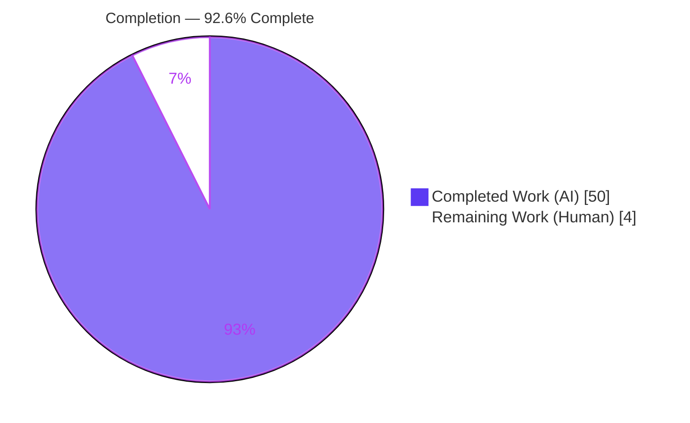
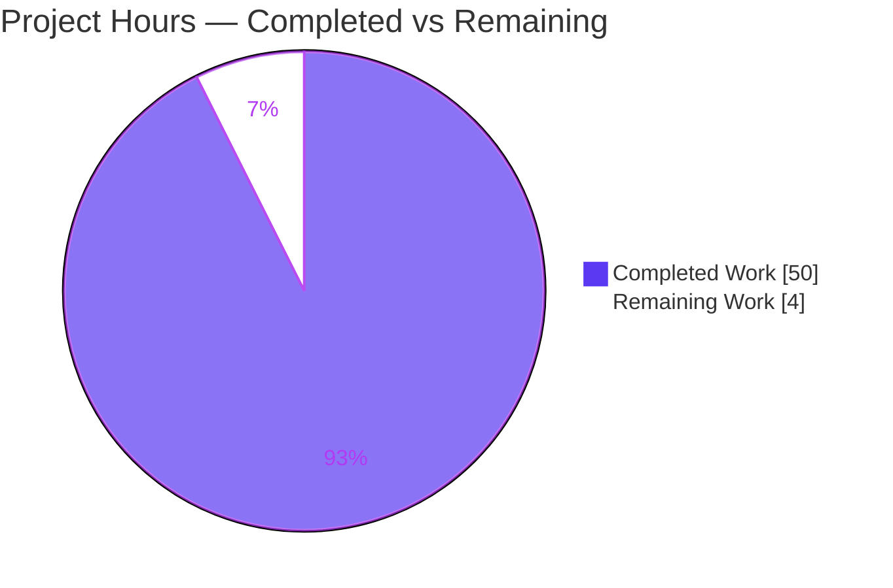
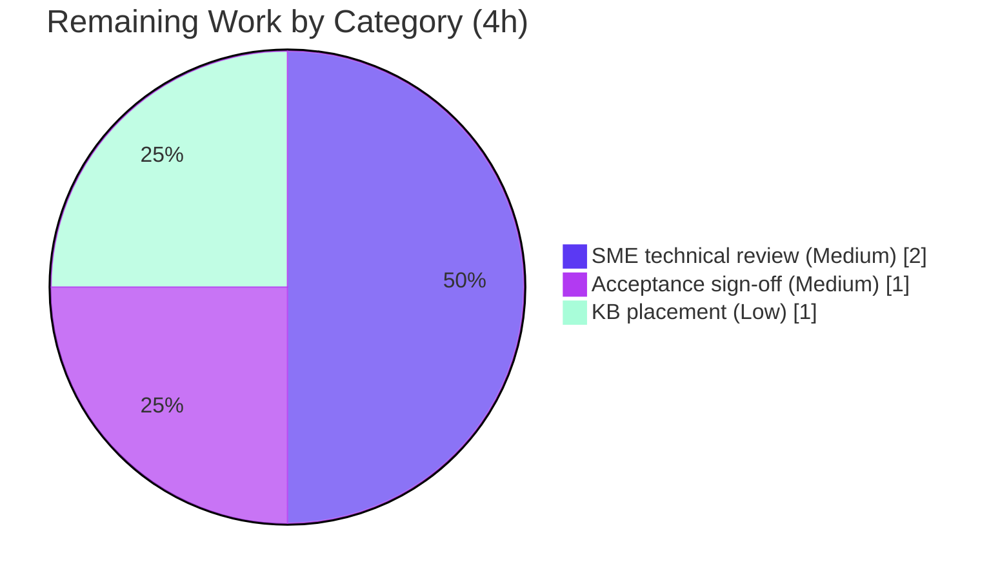
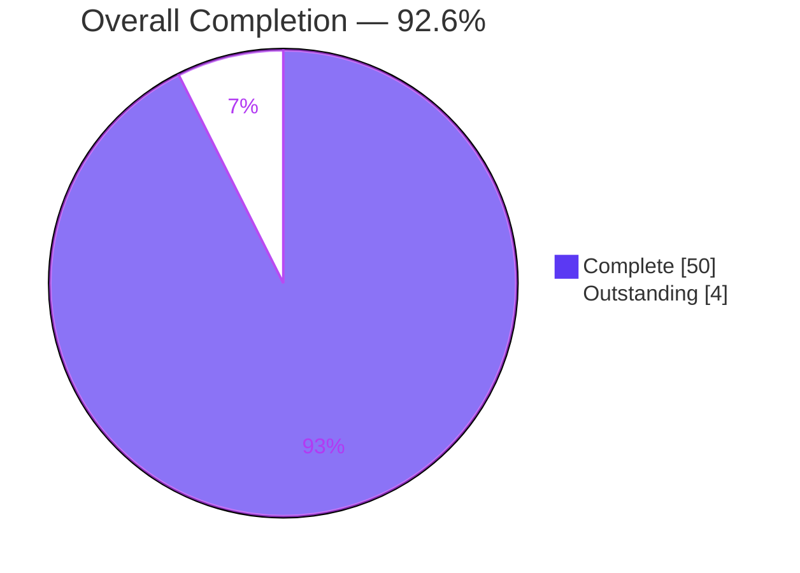

# Blitzy Project Guide — kitty Remote-Control End-to-End Trace (`kitten @ ls`)

> **Brand color legend.** <span style="color:#5B39F3">■</span> **Completed / AI Work — Dark Blue `#5B39F3`</span> · □ **Remaining / Not Completed — White `#FFFFFF`** · <span style="color:#B23AF2">■</span> Headings/Accents `#B23AF2` · <span style="color:#A8FDD9">■</span> Highlight `#A8FDD9`

---

## 1. Executive Summary

### 1.1 Project Overview

This project answers a kitty user who understood the code in isolation but was "getting lost in how all the pieces connect," by producing a single, **runtime-grounded** technical document that traces kitty's remote-control (RC) round trip end-to-end using their exact example, `kitten @ ls`. The target audience is developers who need to understand — and later extend — kitty's RC subsystem. The technical scope spans the Go `kitten` client, the Python server (parse/route/handler), the C-level DCS parser, socket/environment wiring, and shell integration. It is a **read-only investigation**: the sole output is one Markdown deliverable; no source code was modified. Business impact: it de-risks future RC work by grounding every claim in observed evidence and `file:line` references.

### 1.2 Completion Status

The completion percentage is computed with the PA1 AAP-scoped, hours-based methodology: **Completed Hours ÷ (Completed + Remaining) Hours**. All AAP deliverables are complete and validated; the only remaining work is human acceptance review.



| Metric | Hours |
|--------|-------|
| **Total Hours** | **54** |
| Completed Hours (AI: 50 + Manual: 0) | 50 |
| Remaining Hours | 4 |
| **Percent Complete** | **92.6%** |

> Calculation: `50 / (50 + 4) × 100 = 92.6%`. Completed work is 100% AI/autonomous (Blitzy agents); no manual hours have been logged yet. Remaining 4h is human acceptance review.

### 1.3 Key Accomplishments

- ✅ **OBJ-1 Transport discovery** — proved socket-vs-DCS-over-PTY selection (never a pipe) at `tools/cmd/at/main.go:280`, with the "target present ⇒ socket, no TTY fallback" nuance.
- ✅ **OBJ-2 Socket-path mystery** — reproduced all three reasons a `/tmp` search fails: config-file `-<PID>` suffix, `{kitty_pid}` token substitution, abstract `@`-sockets (no filesystem entry), and default-off gating — each with live `lsof`/`ss` captures and the full socket lifecycle (absent → present → absent).
- ✅ **OBJ-3 Shell integration / RC-over-TTY** — traced `KITTY_LISTEN_ON`/`KITTY_PID`/`KITTY_PUBLIC_KEY` from producer (`kitty/child.py:244-249`) to consumer (`main.go:371-372`), proved the shell scripts do not set the socket var, and disambiguated with `shell_integration=disabled`.
- ✅ **OBJ-4 End-to-end trace** — captured the real `ls` JSON, the raw on-the-wire DCS bytes (58 B external / 78 B in-window), the Python parse/route chain observed via an outside-repo `sitecustomize` shim, and error-only logging on both transports.
- ✅ **Canonical build & run** — `python3 setup.py` (exit 0, `kitty 0.35.2`) headless under Xvfb + Mesa `llvmpipe`; real `kitten @ ls` exercised over **both** transports.
- ✅ **Read-only constraint honored** — source tree byte-identical to base; all instrumentation ran in outside-repo `mktemp -d` dirs and was cleaned up; `git status` clean.
- ✅ **Grounding discipline** — 166 `file:line` citations, 25 files, and a 27-claim OBSERVED / SOURCE-VERIFIED / INFERRED ledger; 3 citation defects found and corrected in final QA.

### 1.4 Critical Unresolved Issues

| Issue | Impact | Owner | ETA |
|-------|--------|-------|-----|
| _None — no blocking issues._ All AAP deliverables complete and validated; repository clean. | — | — | — |

> There are no compilation errors, no failing validations, and no missing deliverables. The remaining work (Section 2.2) is human acceptance review, not defect resolution.

### 1.5 Access Issues

| System/Resource | Type of Access | Issue Description | Resolution Status | Owner |
|-----------------|----------------|-------------------|-------------------|-------|
| — | — | No access issues identified. Repository is present and writable; build toolchain (Python/Go/gcc) and runtime tooling (Xvfb, Mesa llvmpipe, socat, jq, lsof, ss, strace) were all available in the validation container. | N/A | N/A |

> **No access issues identified.** All required build/runtime resources were available; no external service credentials or third-party API access are required for a read-only documentation task.

### 1.6 Recommended Next Steps

1. **[Medium]** Assign a kitty-familiar engineer to perform an SME technical-accuracy review of the trace and spot-check a sample of the 166 `file:line` citations (2h).
2. **[Medium]** Obtain acceptance sign-off that the document resolves the user's original confusion — that a reader can follow the transport decision, locate the real socket, and find the Python `ls` handler (1h).
3. **[Low]** Decide whether to surface the standalone `blitzy/documentation/` doc in the team knowledge base or Sphinx `docs/` tree (1h).
4. **[Low]** When the future new RC command is scheduled, use §8 of the deliverable (the `RemoteCommand` pattern + Go generator wiring) as the implementation blueprint. _(Out of scope for this task.)_

---

## 2. Project Hours Breakdown

### 2.1 Completed Work Detail

Every completed component traces to an AAP requirement (OBJ-1..OBJ-4, methodology rules, or AAP-aligned value-add). Hours reflect the autonomous engineering effort delivered by Blitzy agents.

| Component | Hours | Description |
|-----------|-------|-------------|
| Canonical environment & build (§2) | 5 | Headless Xvfb + Mesa `llvmpipe` software GL; `python3 setup.py` building the `fast_data_types` C extension, launcher, and Go `kitten`; version banners; `--verbose` build with VCS-stamp provenance analysis; toolchain verification. |
| OBJ-1 — Transport discovery (§3) | 3 | Trace of Go + Python transport selection (`main.go:280`), target resolution via `KITTY_LISTEN_ON`, and the "present target ⇒ socket, no TTY fallback" nuance. |
| OBJ-2 — Socket-path mystery (§4) | 7 | Five live experiments — CLI verbatim, `{kitty_pid}` token substitution, config-file `-<PID>` suffix, abstract `@`-socket (via `ss`/`lsof`), default-off gating — plus the full socket lifecycle (absent → present → absent). |
| OBJ-3 — Shell-integration / RC-over-TTY (§6) | 6 | Env producer/consumer tracing + `grep` proof the scripts don't set the socket var; six cases including socketless PTY (`strace /dev/tty`) and the `shell_integration=disabled` disambiguation. |
| OBJ-4 — End-to-end trace (§5) | 9 | Wire-byte capture via `socat`+`strace` (58 B and 78 B frames with `od` hex); outside-repo `sitecustomize` shim to observe `parse_cmd → handle_cmd → command_for_name → LS.response_from_kitty`; real `ls` JSON; error-only logging on both transports; Go return leg. |
| Security model + add-command pattern (§7, §8) | 4 | Source-verified `allow_remote_control` modes and authorization gating; encryption scheme from spec; the exact `RemoteCommand` pattern + Go generator wiring for a future command. |
| Document authoring (all sections) | 7 | 1,038-line / ~98 KB document: TL;DR, 11 sections, 27-claim observed/inferred ledger, coverage pass, cleanup narrative. |
| Citation verification & accuracy (R10) | 3 | ~77 `file:line` ranges / 166 references across 25 files verified; OBSERVED/SOURCE-VERIFIED/INFERRED tagging. |
| Read-only hygiene & cleanup (R1, §11) | 2 | `mktemp -d` harnesses outside the repo, `EXIT` traps, explicit PID capture/kill, git-clean verification. |
| QA / validation iteration | 4 | Six review rounds (code-review, source-locator, QA findings F1–F7, VCS-stamp volatility, final F1/F2/F3 citation corrections). |
| **Total Completed** | **50** | **Matches Completed Hours in Section 1.2.** |

### 2.2 Remaining Work Detail

Every remaining item is a path-to-production human-acceptance activity (all AAP deliverables are complete). No item is a defect fix.

| Category | Hours | Priority |
|----------|-------|----------|
| SME technical-accuracy review + citation spot-check (validates claims and labeling; addresses risk T4/S1) | 2 | Medium |
| Acceptance sign-off / usability confirmation (doc resolves the user's stated confusion) | 1 | Medium |
| Optional knowledge-base placement / indexing decision (addresses risk O1) | 1 | Low |
| **Total Remaining** | **4** | **Matches Remaining Hours in Section 1.2 and Section 7 pie chart.** |

### 2.3 Hours Reconciliation

| Check | Value | Status |
|-------|-------|--------|
| Section 2.1 total (Completed) | 50 | ✅ |
| Section 2.2 total (Remaining) | 4 | ✅ |
| Section 2.1 + Section 2.2 | 54 | ✅ = Section 1.2 Total |
| Completion % = 50 / 54 × 100 | 92.6% | ✅ = Section 1.2 & Section 7 |

---

## 3. Test Results

> **Applicability note.** This is a read-only documentation/investigation task; the kitty project's own unit-test suite (`test.py`) is **explicitly out of scope** (AAP §0.5.2 — "test-suite changes: none"). A Markdown deliverable has no unit tests. The applicable validation equivalent is **Blitzy's autonomous runtime reproduction and citation-accuracy verification**, whose results are aggregated below. **All entries originate from Blitzy's autonomous validation logs for this project** (integrity rule 3).

| Validation Category | Framework / Method | Total Checks | Passed | Failed | Coverage % | Notes |
|---------------------|--------------------|--------------|--------|--------|------------|-------|
| Build / Compilation | `python3 setup.py` (+ forced recompile via `touch`) | 2 | 2 | 0 | 100% | Exit 0; artifacts `fast_data_types.so`, `launcher/kitty`, `launcher/kitten`; banner `kitty 0.35.2`. Repo byte-identical after build. |
| Runtime reproduction — Socket transport | Real `kitten @ ls` under Xvfb/llvmpipe | 6 | 6 | 0 | 100% | Socket lifecycle (absent→present→absent); naming asymmetry (CLI verbatim / `{kitty_pid}` token / config `-<PID>` / abstract `@`); real JSON; DCS wire bytes; parse/route chain; error-only logging. |
| Runtime reproduction — TTY / shell-integration transport | Real in-window `kitten @ ls` + `strace` | 5 | 5 | 0 | 100% | Env producer/consumer; in-window over socket; socketless DCS-over-PTY (`/dev/tty`); `shell_integration=disabled` still works; 78-byte frame byte-identical across carriers. |
| Citation accuracy | `sed`/`grep` static verification | ~77 ranges (166 refs, 25 files) | ~77 | 0 (after fix) | 100% | 3 defects found (F1 `is_cmd_allowed` attribution, F2 `ls.py:45`→`:45-46`, F3 verbatim `long_text` quotes) — all corrected and re-verified. |
| Deliverable integrity | Structural checks | 5 | 5 | 0 | 100% | 11 sections intact; 86 code fences balanced; no placeholders/conflict markers; `git status` clean; net change = 1 file added. |
| **Aggregate** | — | **~95** | **~95** | **0** | **100%** | No failing or blocked validation. |

> Independent corroboration during this assessment: key citations (`main.go:280`, `main.go:371-372`, `remote_control.py:56`, `rc/base.py:449`, `rc/ls.py:48/76`, `child.py:244-249`, `definition.py:2969`) and all three fixes (F1/F2/F3) were re-checked against the source tree and confirmed accurate.

---

## 4. Runtime Validation & UI Verification

Runtime health of the build and the RC round trip over both transports:

- ✅ **Build** — `python3 setup.py` exits 0; produces `fast_data_types.so` (1,213,072 B), `launcher/kitten` (15,962,372 B), `launcher/kitty` (36,224 B). **Operational.**
- ✅ **Version banner** — `kitty 0.35.2` / `kitten 0.35.2 created by Kovid Goyal`. **Operational.**
- ✅ **Headless GUI runtime** — kitty launches under `Xvfb :99` with Mesa `llvmpipe` (OpenGL 4.5, exceeds the 3.3 requirement). **Operational.**
- ✅ **Socket transport** — `kitten @ --to unix:… ls` returns valid JSON; socket confirmed live via `lsof`/`ss` under a PID-suffixed / abstract name. **Operational.**
- ✅ **Shell-integration / RC-over-TTY transport** — in-window `kitten @ ls` (no `--to`) works over the socket when listening, and over `/dev/tty` (DCS) when not; `shell_integration=disabled` still works. **Operational.**
- ✅ **Parse/route observation** — the `parse_cmd → handle_cmd → command_for_name → LS.response_from_kitty` chain observed firing (both ingresses) via an outside-repo `sitecustomize` shim. **Operational.**
- ✅ **Logging** — empty on success (both transports); exactly one `log_error` line on a malformed frame. **Operational (as designed).**

**UI verification (Figma / design-spec):** Not applicable. kitty is a GPU-rendered terminal, but this task does not implement or alter any UI; the GUI window was brought up under Xvfb only to exercise the in-window RC path. No design frames or UI acceptance criteria were supplied (AAP §0.9). No visual-regression verification is in scope.

---

## 5. Compliance & Quality Review

Cross-mapping AAP deliverables and task rules to their fulfillment status.

| AAP Requirement / Rule | Benchmark | Status | Evidence / Progress |
|------------------------|-----------|--------|---------------------|
| OBJ-1 Transport discovery | Socket vs TTY identified & observed | ✅ Pass | §3, §1 Q1; `main.go:280`; both transports OBSERVED |
| OBJ-2 Socket-path mystery | All causes reproduced live | ✅ Pass | §4.1–4.4; real paths + `lsof`/`ss` |
| OBJ-3 Shell integration | Producer→consumer traced; either/or resolved | ✅ Pass | §6.1–6.5; `child.py:244-249` → `main.go:371-372` |
| OBJ-4 End-to-end (wire/parse/JSON/log) | All artifacts captured | ✅ Pass | §5.1–5.5; wire hex, shim, full JSON, logging |
| R1 Read-only repository | Zero source edits; scripts cleaned | ✅ Pass | Source byte-identical to base; `git status` clean; §11 |
| R2 Deliverable location/name | `blitzy/documentation/kitty_815df1e210e0.md` | ✅ Pass | File present at exact path |
| R3/R4/R5 Run-first, canonical entry point/config | Real `kitten @ ls`; build/invocation reported | ✅ Pass | §2 build+banner; all OBSERVED sections |
| R6 Every implied condition | Both transports; before/during/after; success+error | ✅ Pass | §4 (socket) + §6 (TTY); §4.4 lifecycle; §5.5 logging |
| R7 Complete, unedited output | No elision/paraphrase | ✅ Pass | §5.1 full JSON; §5.2 full hex; §4 full paths |
| R9 Answer every part; coverage pass | Explicit coverage of all questions | ✅ Pass | §10 coverage pass |
| R10 Exact & grounded; label inferred | `file:line` + OBSERVED/INFERRED labels | ✅ Pass | 166 citations; 27-claim ledger (§9) |
| Security awareness (secondary) | Auth modes / encryption documented for context | ✅ Pass | §7 (SOURCE-VERIFIED + INFERRED-labeled) |
| Future new-command | Explicitly deferred, pattern documented | ✅ Pass (deferred) | §8; not implemented (AAP §0.5.2) |

**Fixes applied during autonomous validation:** F1 — corrected `PasswordAuthorizer`/`is_cmd_allowed` citation attribution (§7.2); F2 — widened `kitty/rc/ls.py:45` to `:45-46` (§8); F3 — restored byte-for-byte verbatim `long_text` quotes in the §7.1 table. All committed (`ff77e98d5`) and re-verified.

**Outstanding compliance items:** None. All in-scope rules pass; the only open activity is human acceptance review (Section 2.2).

---

## 6. Risk Assessment

Overall risk profile is **Low** — a read-only document with zero code footprint (no imports, APIs, or build coupling). No High-severity risks.

| Risk | Category | Severity | Probability | Mitigation | Status |
|------|----------|----------|-------------|------------|--------|
| Volatile values (PIDs, socket inodes, VCS stamp, ephemeral pubkey, timestamps) differ per run | Technical | Low | High | Every volatile value explicitly labeled volatile (§2 note, §9 ledger, footer) | Mitigated |
| Environment/toolchain drift (captures from container Python 3.12.3/gcc 13.3.0 vs other toolchains) | Technical | Low | Medium | Exact container image + toolchain versions stated (§2) | Mitigated |
| Citation line-drift over time (166 refs pinned to base `815df1e2`; future refactors shift lines) | Technical | Low | Medium (long-term) | Point-in-time trace pinned to exact base VCS | Accepted |
| SOURCE-VERIFIED/INFERRED claims not runtime-reproduced (encryption path, some ingress fns) | Technical | Low | Low | Each explicitly labeled; all primary happy paths OBSERVED | Mitigated |
| `allow_remote_control=yes` (unauthenticated) used in captures; unsafe if copied to a non-disposable env | Security | Medium (if misapplied) | Low | §7.1 warns "disposable, isolated instances only"; gives least-privilege guidance (`socket-only`/`password`, avoid `tcp:`) | Mitigated |
| Encryption (X25519/AES-256-GCM) is inferred-from-spec, not exercised | Security | Low | Low | Clearly labeled INFERRED; altering encryption out of scope (AAP §0.5.2) | Accepted |
| Discoverability — standalone doc not wired into Sphinx `docs/` tree | Operational | Low | Medium | Intentional per AAP; optional placement is remaining task (Section 2.2) | Open (low) |
| Reproducibility without a display (full GUI run needs Xvfb + software GL) | Operational | Low | Medium | Exact Xvfb/llvmpipe invocation + container image documented (§2) | Mitigated |
| Code-integration surface | Integration | None | — | Deliverable adds no imports/API/build coupling; only new dir is `blitzy/documentation/` | N/A |

---

## 7. Visual Project Status

### 7.1 Project Hours Breakdown



> Integrity: "Remaining Work" = **4** matches Section 1.2 (Remaining Hours) and Section 2.2 (Hours total). "Completed Work" = **50** matches Section 1.2 and Section 2.1.

### 7.2 Remaining Hours by Category (Section 2.2)



### 7.3 Completion Gauge



---

## 8. Summary & Recommendations

**Achievements.** The project delivers a rigorous, runtime-grounded answer to the user's four questions about kitty's remote-control system, using their exact example `kitten @ ls`. All four objectives (OBJ-1 transport discovery, OBJ-2 socket-path mystery, OBJ-3 shell-integration/TTY, OBJ-4 end-to-end wire/parse/JSON/logging) are answered with observed evidence, `file:line` grounding, and an explicit OBSERVED/SOURCE-VERIFIED/INFERRED ledger. kitty was built and run canonically; both transports were exercised; the read-only constraint was honored (source byte-identical to base).

**Remaining gaps.** None are defects. The outstanding **4 hours** are human acceptance activities: an SME technical-accuracy review, an acceptance/usability sign-off, and an optional knowledge-base placement decision.

**Critical path to production.** SME review (2h) → acceptance sign-off (1h) → optional placement (1h). There is no code to merge into a running system beyond the single documentation file, which is already committed on a clean branch.

**Success metrics.** All autonomous validation checks pass (Section 3, ~95/~95); all 12 compliance rows pass (Section 5); risk profile is Low with no High-severity items (Section 6).

**Production-readiness assessment.** At **92.6% complete**, the deliverable is functionally finished and validated. It is ready for human review; upon acceptance sign-off it is production-ready as a standalone knowledge artifact. The future new RC command remains explicitly out of scope, with §8 of the document providing the implementation blueprint.

| Metric | Value |
|--------|-------|
| Completion | 92.6% |
| Completed / Total hours | 50 / 54 |
| Remaining hours | 4 (human acceptance only) |
| Blocking issues | 0 |
| High-severity risks | 0 |
| Source files modified | 0 (read-only honored) |

---

## 9. Development Guide

This is a read-only documentation task, so the guide covers both **(A) reviewing the deliverable** and **(B) reproducing the runtime investigation**. All commands below were tested during assessment (run from the repository root).

### 9.1 System Prerequisites

- **OS:** Linux (validated on Ubuntu; container base Ubuntu 24.04-class).
- **Python:** ≥ 3.8 (`pyproject.toml`); validation container used 3.12.3.
- **Go:** 1.22 (`go.mod`); validation container used 1.23.4.
- **C compiler:** gcc (container 13.3.0).
- **Graphics:** OpenGL ≥ 3.3. Headless runs use `Xvfb` + Mesa `llvmpipe` software GL.
- **Runtime tooling for reproduction:** `socat`, `strace`, `lsof`, `ss`, `jq`, `glxinfo`.

### 9.2 Environment Setup (headless GUI)

```bash
# Start a headless X server with GLX
Xvfb :99 -screen 0 1280x800x24 -ac +extension GLX +render -noreset &
export DISPLAY=:99
export LIBGL_ALWAYS_SOFTWARE=1
export GALLIUM_DRIVER=llvmpipe

# Verify software GL (expect OpenGL >= 3.3; llvmpipe reports 4.5)
glxinfo -B | grep -iE "OpenGL (version|renderer)"
```

### 9.3 Build

```bash
# From the repository root — canonical build (C extension + launcher + Go kitten client)
python3 setup.py            # exit 0; incremental (rebuilds only stale artifacts)

# Verify build artifacts
ls -l kitty/launcher/kitty kitty/launcher/kitten kitty/fast_data_types.so

# Verify version banners
./kitty/launcher/kitty   --version    # -> kitty 0.35.2 created by Kovid Goyal
./kitty/launcher/kitten  --version    # -> kitten 0.35.2 created by Kovid Goyal
```

### 9.4 Run `kitten @ ls` over both transports

```bash
# --- Transport A: configured UNIX socket ---
KITTY=./kitty/launcher/kitty
KITTEN=./kitty/launcher/kitten
"$KITTY" -o allow_remote_control=yes --listen-on unix:/tmp/mykitty bash -c 'sleep 600' &
KPID=$!
# wait for the socket to appear, then confirm it is live
until [ -S /tmp/mykitty ]; do sleep 0.1; done
ls -l /tmp/mykitty ; ss -xlp | grep mykitty
# real ls round trip over the socket
"$KITTEN" @ --to unix:/tmp/mykitty ls | jq -c '[.[].tabs[].windows[]|{id,cmdline}]'
kill "$KPID"    # stop exactly the instance we started

# --- Transport B: shell-integration / RC-over-TTY (run INSIDE a kitty window) ---
#   With a socket configured: `kitten @ ls` resolves KITTY_LISTEN_ON and uses the SAME socket.
#   With NO socket:           `kitten @ ls` writes a DCS @kitty-cmd escape over /dev/tty.
kitten @ ls
```

### 9.5 Verification Steps

```bash
# Deliverable present and structured
ls -l blitzy/documentation/kitty_815df1e210e0.md          # ~98 KB
grep -nE '^## ' blitzy/documentation/kitty_815df1e210e0.md # 11 sections

# Read-only constraint: source unchanged vs base (expect EMPTY output)
git diff --stat 815df1e21 HEAD -- kitty/ tools/ shell-integration/ docs/
git status --porcelain                                     # expect EMPTY (clean)

# Reviewer citation spot-check workflow — resolve any cited file:line
sed -n '280p' tools/cmd/at/main.go                         # transport selection
sed -n '48p;76p' kitty/rc/ls.py                            # ls handler + JSON return
sed -n '244,249p' kitty/child.py                           # env var producer
```

### 9.6 Example Usage (expected `ls` output shape)

```console
$ kitten @ --to unix:/tmp/mykitty ls | jq -c '[.[].tabs[].windows[]|{id,cmdline}]'
[{"id":1,"cmdline":["sleep","600"]}]
```

The full `ls` response is the complete OS-window → tab → window JSON tree (`json.dumps(..., indent=2, sort_keys=True)` at `kitty/rc/ls.py:76`), wrapped by the server as `{"ok": true, "data": <json-string>}`.

### 9.7 Troubleshooting

- **kitty won't start / OpenGL error** → ensure `Xvfb` is running and `LIBGL_ALWAYS_SOFTWARE=1 GALLIUM_DRIVER=llvmpipe` are exported (Section 9.2). kitty requires OpenGL ≥ 3.3.
- **Socket not found in `/tmp`** → expected. A config-file `listen_on` gets an automatic `-<PID>` suffix; `unix:@name` is an abstract socket (no filesystem entry); and by default (`allow_remote_control=no`, `listen_on=none`) no socket is created at all. See deliverable §4.
- **`kitten @ ls` fails with "no controlling terminal" / no target** → run it inside a kitty window (so `KITTY_LISTEN_ON`/PTY exist), or pass `--to unix:…` explicitly.
- **Empty log after a successful command** → expected. RC logging is error-only; success logs nothing. A malformed frame emits exactly one `log_error` line (deliverable §5.5).
- **Different PIDs / socket inodes / VCS stamp than the document** → expected. These are volatile per-run values, labeled as such throughout the deliverable.

---

## 10. Appendices

### A. Command Reference

| Purpose | Command |
|---------|---------|
| Canonical build | `python3 setup.py` |
| Dev environment | `./dev.sh` |
| kitty / kitten version | `./kitty/launcher/kitty --version` · `./kitty/launcher/kitten --version` |
| Start headless X | `Xvfb :99 -screen 0 1280x800x24 -ac +extension GLX +render -noreset &` |
| Launch RC-enabled kitty | `kitty -o allow_remote_control=yes --listen-on unix:/tmp/mykitty …` |
| Remote `ls` over socket | `kitten @ --to unix:/tmp/mykitty ls` |
| Remote `ls` in-window | `kitten @ ls` |
| Inspect live socket | `lsof -U \| grep mykitty` · `ss -xlp \| grep mykitty` |
| Capture wire bytes | `socat -x …` / `strace -e trace=write,connect …` |
| Decode JSON | `… \| jq …` |
| Citation spot-check | `sed -n '<line>p' <file>` |
| Read-only proof | `git diff --stat 815df1e21 HEAD -- kitty/ tools/ shell-integration/ docs/` |

### B. Port / Endpoint Reference

| Endpoint | Value | Notes |
|----------|-------|-------|
| RC transport (default) | UNIX socket (`unix:…`) | No fixed TCP port; path is user-specified via `--listen-on`/`listen_on`. |
| RC transport (optional) | `tcp:host:port` | Only if explicitly configured; discouraged unless firewalled (§7.1). |
| TTY transport | Controlling PTY (`/dev/tty`) | DCS `@kitty-cmd` escape; no network port. |
| Display (headless) | `DISPLAY=:99` | Xvfb virtual display for GUI runs. |

### C. Key File Locations

| Item | Path |
|------|------|
| **Deliverable** | `blitzy/documentation/kitty_815df1e210e0.md` |
| Go client entry / transport select | `tools/cmd/at/main.go` (`:280`, `:371-372`) |
| Go socket / TTY framing | `tools/cmd/at/socket_io.go`, `tools/cmd/at/tty_io.go` |
| Python client + parse/route | `kitty/remote_control.py` (`:56`, `:213`, `:258-260`) |
| Command routing | `kitty/rc/base.py` (`:449`) |
| `ls` handler | `kitty/rc/ls.py` (`:45-46`, `:48`, `:76`) |
| Socket path templating | `kitty/main.py` (`:325-343`) |
| Env var producer | `kitty/child.py` (`:244-249`) |
| DCS parser (C) | `kitty/vt-parser.c` (`:603`) |
| Options defaults | `kitty/options/definition.py` (`:2969`, `:3000`) |
| Build entry point | `setup.py` |
| Build outputs | `kitty/launcher/kitty`, `kitty/launcher/kitten`, `kitty/fast_data_types.so` |

### D. Technology Versions

| Technology | Version (validation container) | Source of floor |
|------------|-------------------------------|-----------------|
| kitty / kitten | 0.35.2 | build banner |
| Python | 3.12.3 (floor ≥ 3.8) | `pyproject.toml` |
| Go | 1.23.4 (floor 1.22) | `go.mod` |
| gcc | 13.3.0 | container |
| Mesa (llvmpipe) | 25.2.8 (OpenGL 4.5) | `glxinfo` |

### E. Environment Variable Reference

| Variable | Producer | Consumer | Role |
|----------|----------|----------|------|
| `KITTY_LISTEN_ON` | `kitty/child.py:246-249` (only when listening) | `tools/cmd/at/main.go:371-372` | Default RC target address for `kitten @` |
| `KITTY_PID` | `kitty/child.py:244` (unconditional) | shell-integration scripts (local/SSH detection) | Owning kitty PID |
| `KITTY_PUBLIC_KEY` | `kitty/child.py:245` (unconditional) | `remote_control.py` (encryption path only) | X25519 public key for encrypted RC |
| `KITTY_SHELL_INTEGRATION` | `kitty/shell_integration.py` | shell-integration scripts | Enables shell integration features |
| `DISPLAY` | operator | kitty (GUI) | X display for headless runs (`:99`) |
| `LIBGL_ALWAYS_SOFTWARE` / `GALLIUM_DRIVER` | operator | Mesa | Force software GL (`llvmpipe`) |

### F. Developer Tools Guide

| Tool | Use in this project |
|------|---------------------|
| `Xvfb` | Headless X server so the GPU terminal can run without a physical display |
| `glxinfo` | Confirm software OpenGL ≥ 3.3 (llvmpipe) |
| `lsof` / `ss` | Confirm the live RC socket, owning PID, and abstract-vs-path naming |
| `socat` | Capture on-the-wire DCS bytes (per the in-repo recipe, `docs/rc_protocol.rst`) |
| `strace` | Observe `connect()` (socket) vs `write()` to `/dev/tty` (PTY); reconstruct frames |
| `jq` | Decode/slice the `ls` JSON response |
| `sed`/`grep` | Reviewer citation spot-checks and structural audits |

### G. Glossary

| Term | Meaning |
|------|---------|
| **RC** | Remote Control — kitty's mechanism for controlling a running instance (`kitten @ …`). |
| **DCS** | Device Control String — the terminal escape envelope `<ESC>P … <ESC>\` carrying `@kitty-cmd<JSON>`. |
| **PTY / TTY** | Pseudo-terminal / controlling terminal; the socketless RC path writes DCS escapes here. |
| **Abstract socket** | Linux `@`-prefixed (`\0`) UNIX socket with no filesystem entry — invisible to `ls /tmp`. |
| **`{kitty_pid}` token** | Placeholder in a `listen_on` spec, substituted with the real PID (unconditional). |
| **`-<PID>` suffix** | Automatic suffix appended to a **config-file** `unix:` `listen_on` value. |
| **`allow_remote_control`** | Option gating RC; default `no`. Modes: `no`/`yes`/`password`/`socket-only`/`socket`. |
| **OBSERVED / SOURCE-VERIFIED / INFERRED** | The deliverable's evidence labels: reproduced at runtime / read from code / derived from spec (not run). |

---

*Blitzy Project Guide — generated from the Agent Action Plan, agent action logs, git history, and independent verification of the deliverable. Completion (92.6%) reflects AAP-scoped autonomous work plus path-to-production; the only outstanding effort is human acceptance review.*