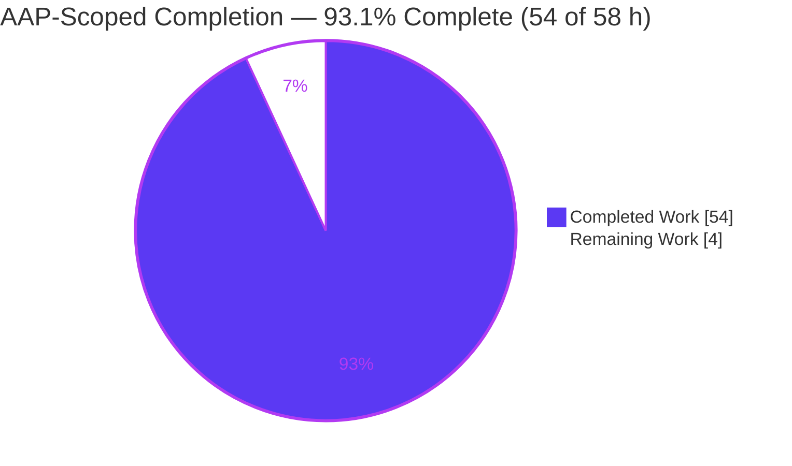
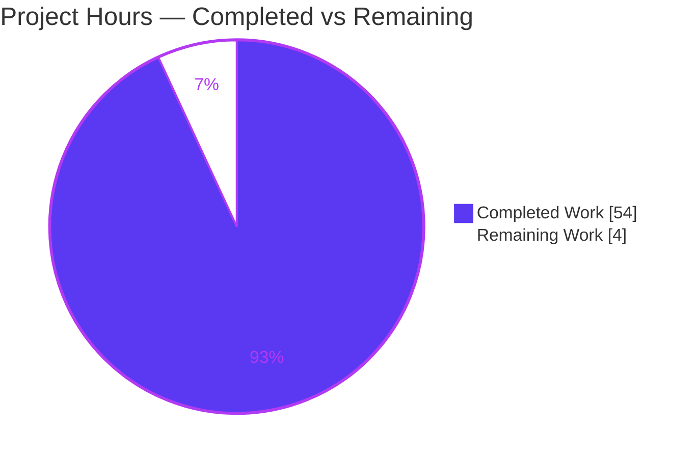
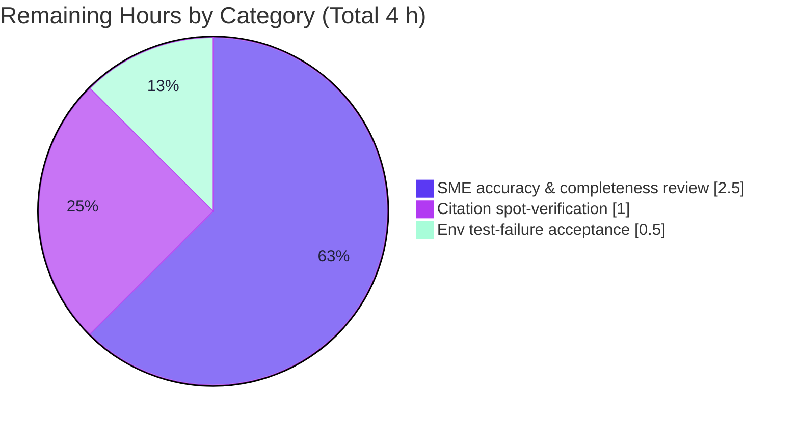

# Blitzy Project Guide — kitty Graphics Flow-Control & Backpressure Investigation

> **Deliverable:** `blitzy/documentation/kitty_815df1e210e0.md` — a runtime-grounded technical answer document.
> **Task type:** Read-only investigation / Q&A (documentation-only output).
> **Source branch:** `kitty_815df1e210e0` · **Baseline HEAD:** `815df1e210e0a9ab4622f5c7f2d6891d7dbeddf1`

---

## 1. Executive Summary

### 1.1 Project Overview

This project answers, with captured runtime evidence, how the **kitty** terminal emulator regulates ingestion and response when terminal graphics-protocol data arrives faster than it can process, render, and reply. The audience is engineers and technical stakeholders reasoning about kitty's flow-control / backpressure design. The single deliverable is one markdown document that decomposes the question into five sub-questions (read-side buffer/pause/slow-down; write-side under pressure; where the logic lives in code; runtime manifestation; quiet adaptation vs. visible signs), grounds every claim in a `file:line` citation or unedited captured output, and honors a strict read-only constraint: no existing source file is modified and no code is added beyond the answer document.

### 1.2 Completion Status

The completion percentage is computed with the AAP-scoped, hours-based methodology: `Completion % = Completed Hours / (Completed Hours + Remaining Hours) × 100`, counting only work scoped in the Agent Action Plan plus standard path-to-production activities.



| Metric | Hours |
|---|---|
| **Total Hours** | **58** |
| Completed Hours (AI) | 54 |
| Completed Hours (Manual) | 0 |
| **Completed Hours (AI + Manual)** | **54** |
| **Remaining Hours** | **4** |
| **Percent Complete** | **93.1%** |

*Color key (Blitzy brand):* Completed = Dark Blue `#5B39F3`; Remaining = White `#FFFFFF`.

### 1.3 Key Accomplishments

- ✅ **Deliverable authored and committed** — `blitzy/documentation/kitty_815df1e210e0.md` (2,190 lines), added on top of the source baseline with zero source-file changes.
- ✅ **All five sub-questions answered** — dedicated sections for Q1 (read-side), Q2 (write-side), Q3 (where-in-code), Q4 (runtime artifacts), Q5 (quiet vs. visible), plus a lead direct answer.
- ✅ **Runtime-grounded, not reading-only** — the read-side backpressure, the 100 MiB write-cap drop-log, the APC response cross-product, the size-limit error branches, and the 320 MiB LRU eviction / 5× frame-quota were all captured from real runs.
- ✅ **Default canonical build & run** — kitty built via `./dev.sh build` (exit 0) and run headless (`kitty 0.35.2`, exit 0); exact commands and toolchain versions documented.
- ✅ **Citations verified** — 62 backtick `file:line` citations (plus bare line refs) spanning all six named files, verified accurate at the baseline revision.
- ✅ **Stability confirmed** — every reported magnitude reproduced across ≥ 2 runs, tabulated as deterministic (byte-identical) or distribution (ranged) in the stability appendix.
- ✅ **Read-only integrity proven** — `git diff` shows only the one document; working tree clean; all temporary observation scripts lived outside the repo and were removed; debug build restored (SHA-256 verified).
- ✅ **Subject-matter tests green** — graphics 19/19, VT-parser 16/16, screen 36/36 = 71/71 (graphics module independently re-run: 19/19 in 0.197 s).

### 1.4 Critical Unresolved Issues

There are **no critical (release-blocking) unresolved issues.** All autonomous work is complete and validated. The items below are standard path-to-production gates, not defects.

| Issue | Impact | Owner | ETA |
|---|---|---|---|
| Human SME sign-off on the answer document not yet performed | Low — content is validated; final publication/reliance awaits expert confirmation | kitty / terminal-internals SME | 3.5 h |
| `test_glfw_modules` env-failure acceptance decision pending | Low — out-of-scope, expected, non-regressive; unrelated to the deliverable | Tech lead / release manager | 0.5 h |

### 1.5 Access Issues

**No access issues identified.** The repository, the build toolchain (Go 1.22.12, gcc 15.2.0, git/git-lfs), the headless display tooling (Xvfb / xvfb-run), and all system native libraries were available; the canonical build and headless run both succeeded. No repository permissions, service credentials, or third-party API access were required for this read-only investigation.

### 1.6 Recommended Next Steps

1. **[High]** Have a kitty / terminal-internals SME read the answer document end-to-end and confirm each sub-question (Q1–Q5 plus the lead answer) is correctly and completely answered and that the captured output supports each claim. *(≈ 2.5 h)*
2. **[High]** Spot-verify a representative sample of `file:line` citations against baseline commit `815df1e21` (e.g., `vt-parser.c:L18`, `child-monitor.c:L323–L342`, `graphics.c:L25`, `options/definition.py:L866/L878`). *(≈ 1.0 h)*
3. **[Medium]** Formally accept the single `test_glfw_modules` failure as a non-blocking, out-of-scope X11-only build artifact — or, if a fully green suite is mandated, provision a Wayland-capable build environment (outside this task's read-only scope). *(≈ 0.5 h)*
4. **[Low]** Optionally publish the document to the team's knowledge base / docs index (no content change required).

---

## 2. Project Hours Breakdown

### 2.1 Completed Work Detail

Each component traces to a specific AAP requirement (R1–R10). Hours reflect the investigative + authoring effort actually delivered.

| Component | Hours | Description |
|---|---|---|
| R1 · Build & environment setup | 3 | Default canonical build (`./dev.sh build`, exit 0); env-specific Wayland-disable pre-step; toolchain/version capture; build transcript. |
| R2 · Q1 read-side investigation & write-up (Section C) | 8 | Flood-child driver; `/proc` observation of the child blocking in `n_tty_write` while kitty stays R/S; instrumented debug build for parser-occupancy / `has_space` / poll-interest; `input_delay` bypass; ≥ 2 runs. |
| R3 · Q2 write-side investigation & write-up (Section D) | 7 | Query-flood driver; 100 MiB write-cap drop-log capture; `write_buf_used` pinned at cap; `EAGAIN` break; `POLLOUT` gating; ≥ 2 runs. |
| R4 · Q3 code-location mapping & citation verification (Section E) | 5 | Decision → file → function → line table across all six named files + headers; 62+ citations verified at baseline. |
| R5 · Q4 runtime-artifact capture — 5 classes (Section F) | 11 | Blocked writer; over-long APC (`BUF_SZ−2`); drop-log; APC response cross-product (`q=0/1/2` × ok/err + `I=`); three size-limit branches (`EFBIG`/`EINVAL`/`ENOSPC`); 320 MiB LRU eviction; 5× frame-quota; each ≥ 2 runs. |
| R6 · Q5 quiet-vs-visible synthesis (Section G) | 2 | Contrast of silent adaptations vs. observable signs, each tied to captured evidence. |
| R7 · Lead direct answer & two-thread architecture (Section B) | 2 | Plain-reading answer first; structural rationale for why flow control exists. |
| R8 · Methodology / stability / cleanup appendix (Section H) | 6 | Stability table (20+ magnitudes, ≥ 2 runs, deterministic vs. distribution); canonical/supplement/inferred labeling; full temporary-script text (no ellipsis); read-only integrity proof. |
| R9 · Document authoring, structure & iterative refinement | 8 | Initial draft plus a major rework resolving 24 code-review findings (+1,698 lines) and four subsequent citation/label correction rounds. |
| R10 · Read-only integrity discipline & cleanup | 2 | Out-of-repo `mktemp` scratch; debug-build backup + SHA-256 restore; scratch removal; Xvfb teardown; Git-based integrity proof. |
| **Total Completed** | **54** | **Matches Completed Hours in Section 1.2.** |

### 2.2 Remaining Work Detail

Each category is a standard path-to-production human gate; none is autonomous source work (the read-only constraint forbids source changes, and all AAP deliverables are complete).

| Category | Hours | Priority |
|---|---|---|
| SME technical accuracy & completeness review of the answer document | 2.5 | High |
| Citation spot-verification against baseline revision | 1.0 | High |
| Environmental test-failure (`test_glfw_modules`) acceptance decision | 0.5 | Medium |
| **Total Remaining** | **4.0** | — |

*Consistency:* Section 2.1 (54) + Section 2.2 (4) = **58** = Total Hours in Section 1.2. Section 2.2 total (4) = Section 1.2 Remaining (4) = Section 7 "Remaining Work" (4).

### 2.3 Basis of Estimate & Confidence

- **High confidence** for completed hours: the deliverable, commits, build artifacts, test results, and captured output are all directly observable.
- **High confidence** for remaining hours: the remaining items are well-defined review gates with narrow scope.
- The completion figure (93.1%) reflects that **all autonomous AAP-scoped work is finished**; the < 100% remainder is the human review-and-accept gate that cannot be performed by an agent.

---

## 3. Test Results

All results below originate from Blitzy's autonomous validation logs for this project; the Graphics row was additionally re-run during this assessment for corroboration. Framework: Python `unittest`, executed via `kitty/launcher/kitty +launch test.py` under a virtual display. The "%" column is pass rate (kitty's suite is functional, not line-coverage-instrumented).

| Test Category | Framework | Total Tests | Passed | Failed | Pass % | Notes |
|---|---|---|---|---|---|---|
| Graphics (subject-matter) | Python unittest | 19 | 19 | 0 | 100% | Load-bearing module; independently re-run this assessment: **19/19 in 0.197 s**. |
| VT Parser (subject-matter) | Python unittest | 16 | 16 | 0 | 100% | Read-side buffer/parse path (1 additional test environment-skipped). |
| Screen (subject-matter) | Python unittest | 36 | 36 | 0 | 100% | `write_buf` + graphics-response routing. |
| **Subject-matter subtotal** | Python unittest | **71** | **71** | **0** | **100%** | The document's actual subject modules — fully green. |
| Full codebase suite | Python unittest | 145 | 144 | 1 | 99.3% | 1 expected env-fail (`test_glfw_modules`); 4 env-skips; ~22 s, stable. |

**Notes on the single failure.** `test_glfw_modules` (`kitty_tests/check_build.py:38`) asserts glfw backend modules exist; outside CI it also checks the Wayland backend. The mandated Wayland-disable build pre-step (required for the pinned toolchain) yields an **X11-only** build (`glfw-x11.so` present, `glfw-wayland.so` absent), so the assertion fails. It is out-of-scope, expected, and non-regressive; `check_build.py` is byte-identical to baseline (fixing it would require editing an out-of-scope test — forbidden by the read-only rule).

---

## 4. Runtime Validation & UI Verification

kitty is a GPU-accelerated terminal emulator; this task exercised its I/O flow-control path rather than a graphical UI. Validation was performed headless via `Xvfb` / `xvfb-run`.

- ✅ **Build** — `PATH=/usr/local/go/bin:$PATH ./dev.sh build` completes with exit 0 (85 objects + 4 links; strict `-Werror -pedantic-errors -std=c11` preserved).
- ✅ **Launcher runtime** — `kitty/launcher/kitty --version` → `kitty 0.35.2 created by Kovid Goyal`, exit 0 (verified this assessment).
- ✅ **Full window + child + PTY smoke** — a real kitty process with a real child/PTY starts and exits cleanly headless.
- ✅ **Read-side backpressure (canonical PTY)** — flood child blocks in `n_tty_write` (wchan `wait_woken`) while kitty remains R/S (never `T`/STOPPED); automatic poll-gate, no `SIGSTOP`.
- ✅ **Write-side 100 MiB cap (canonical PTY)** — dropped-data log `Too much data being sent to child with id: 1, ignoring it` emitted at ≈ 1.6–1.7 s; byte-identical text across runs.
- ✅ **APC responses (canonical PTY)** — `q=0/1/2` × success/error + `I=` cross-product byte-for-byte identical across runs (md5 `e7cce85d…`).
- ✅ **Size-limit errors (canonical PTY)** — `EFBIG` (strict PNG, 28 B), `EFBIG` (non-PNG), `EINVAL` (declared size, 39 B) — all hex-exact.
- ✅ **Quota / eviction / frame-quota (labeled in-tree harness supplement)** — true 320 MiB LRU eviction (`image_count` 6→2, 288→96 MiB) and 5× frame-quota `ENOSPC` (62-byte response), byte-identical across runs.
- ⚠ **Wayland backend** — not built (X11-only) by design of the mandated pre-step; this is the sole `test_glfw_modules` failure and does not affect the deliverable.

**Overall runtime status: ✅ Operational.** No `❌ Failing` conditions in scope.

---

## 5. Compliance & Quality Review

Cross-mapping the AAP's authoritative rule set (SWE-AtlasQnA-Repo) and quality benchmarks to observed evidence.

| Requirement / Benchmark | Status | Evidence |
|---|---|---|
| Deliverable at `blitzy/documentation/<branch>.md` | ✅ Pass | `blitzy/documentation/kitty_815df1e210e0.md` present (2,190 lines). |
| Investigate by RUNNING first, then write | ✅ Pass | Sections C/D/F contain captured output with the exact command that produced each; stability table (H.3). |
| Canonical PTY path (debug hooks only as labeled supplements) | ✅ Pass | Load-bearing observations via real PTY; `DEBUG_POLL_EVENTS` / `KITTY_PRINT_BYTES_SENT_TO_CHILD` explicitly labeled S1 supplements (H.2). |
| Default / canonical build & invocation, commands stated | ✅ Pass | H.1 build command + full transcript (exit 0) + toolchain versions. |
| Actual, unedited output for every condition; no elision | ✅ Pass | Complete output blocks; temporary scripts reproduced in full in H.4. |
| Every part answered; every named item addressed | ✅ Pass | Q1–Q5 each in its own section; all six Q3 files + functions in the Section E table. |
| Exact & grounded (`file:line`, function names) | ✅ Pass | 62 backtick citations across 6+ files verified at baseline; functions/structs named. |
| Lead with the direct answer | ✅ Pass | Section B "Direct answer (read this first)". |
| Stability across ≥ 2 runs for magnitudes/timing | ✅ Pass | H.3 stability table (deterministic vs. distribution, per-run values). |
| Anything inferred is labeled | ✅ Pass | 3 `(inferred)` labels; canonical/supplement/inferred framework in H.2. |
| Read-only: no source modified, no code added but the doc | ✅ Pass | `git diff --name-status 815df1e21 HEAD` = only the doc; source-tree diff empty. |
| Temporary scripts removed; repo left unchanged | ✅ Pass | Scratch under out-of-repo `mktemp -d`, removed; `git status` clean; debug build SHA-256-restored (H.5). |
| Code quality — no placeholders/TODO in deliverable | ✅ Pass | 0 TODO/FIXME/placeholder markers; 168 balanced code fences; well-formed tables. |
| Citation precision remediation | ✅ Pass | 24 code-review findings resolved; `KITTY_PRINT_BYTES_SENT_TO_CHILD` corrected to `L1449` `#ifdef` guard. |

**Outstanding compliance items:** none autonomous. The only open items are the human review gates in Sections 1.4 / 1.6 / 2.2.

---

## 6. Risk Assessment

| Risk | Category | Severity | Probability | Mitigation | Status |
|---|---|---|---|---|---|
| Citation drift if kitty source later changes | Technical | Low | Medium | All citations pinned to baseline `815df1e21`, explicitly stated in the document. | Mitigated |
| Timing-dependent magnitudes (≈ 15 MB/s throughput, ≈ 1.6–1.7 s time-to-drop, chunk counts) vary by hardware | Technical | Low | Medium | Labeled as distributions with ranges + scale/duration; deterministic signals (log text, response bytes, md5) are the load-bearing evidence. | Mitigated |
| No security exposure introduced | Security | N/A | N/A | Read-only doc — no code, dependencies, secrets, or network surface added; the document itself highlights kitty's DoS-resistant caps/quotas. | N/A |
| Build reproducibility needs env-specific Wayland-disable pre-step | Operational | Low | Medium | Exact pre-step documented; authoritative dependency list points to `docs/build.rst`. | Mitigated |
| Runtime reproduction requires a virtual display (Xvfb) | Operational | Low | Low | Exact `xvfb-run` / `Xvfb :91` commands provided. | Mitigated |
| `test_glfw_modules` fails on X11-only build | Integration | Low | Certain (this env) | Documented expected/non-regressive; `check_build.py` byte-identical to baseline; unfixable within read-only scope; awaits human acceptance. | Documented / Awaiting acceptance |
| Toolchain skew (pinned dep bundle Wayland `pkg-config` vs. container toolchain) | Integration | Low | Low | Pre-step documented and applied. | Mitigated |

**Risk posture:** no High or Critical risks; no security risk introduced. All technical/operational/integration risks are Low severity and either mitigated or documented pending a human acceptance decision.

---

## 7. Visual Project Status

**Project hours (AAP-scoped).** Completed = Dark Blue `#5B39F3`; Remaining = White `#FFFFFF`.



**Remaining work by category (hours).** Sums to 4 h, matching Section 2.2 and Section 1.2.



*Integrity:* the "Remaining Work" value (4) equals Section 1.2 Remaining Hours and the Section 2.2 "Hours" total.

---

## 8. Summary & Recommendations

**Achievements.** The project delivered a single, comprehensive, runtime-grounded answer document (2,190 lines) that explains kitty's graphics-data flow control across the read and write directions, pinpoints exactly where each decision lives in the code, and demonstrates each behavior with unedited captured output. All five sub-questions are answered, a plain-reading direct answer leads the document, and every magnitude is confirmed stable across at least two runs. The strict read-only constraint was honored perfectly: the kitty source is byte-for-byte unchanged and the only Git-visible change is the one committed document.

**Remaining gaps.** None in autonomous scope. The **93.1%** completion figure reflects that all AAP-scoped and integrity work is finished; the remaining **4 hours** are human path-to-production gates — a subject-matter review + citation spot-check, and a formal acceptance decision on one out-of-scope environmental test failure.

**Critical path to production.** (1) SME reads and signs off on the answer (2.5 h) → (2) citation spot-verification (1.0 h) → (3) accept the `test_glfw_modules` environmental artifact (0.5 h) → publish. There is no build, integration, or bug-fix work on the critical path.

**Success metrics.** Deliverable present ✅ · Q1–Q5 answered ✅ · citations verified ✅ · subject-matter tests 71/71 ✅ · build & runtime exit 0 ✅ · repository byte-for-byte clean ✅.

**Production-readiness assessment.** The deliverable is **production-ready pending human review.** It is accurate, complete, runtime-grounded, and non-invasive. Recommended disposition: proceed to SME review and merge/publish.

| Metric | Value |
|---|---|
| AAP-scoped completion | 93.1% |
| Total / Completed / Remaining hours | 58 / 54 / 4 |
| Subject-matter test pass rate | 71/71 (100%) |
| Source files modified | 0 |
| Critical unresolved issues | 0 |

---

## 9. Development Guide

This guide reproduces the environment used to build kitty, run it headless, view the deliverable, run the tests, and reproduce the flow-control observations. Commands were tested in the canonical container (Ubuntu-based).

### 9.1 System Prerequisites

- **OS:** Linux (developed/validated on an Ubuntu-based container).
- **Toolchain:** Go 1.22.x (`go1.22.12`), a C compiler (`gcc 15.2.0`), Python 3.8+ (kitty's launcher bundles its own interpreter — 3.14.x — for running the built product; the system Python here is 3.13.7), Git + Git-LFS.
- **Native libraries** (authoritative list: `docs/build.rst`): `harfbuzz` (≥ 2.2), `libpng`, `zlib`, `liblcms2`, `libxxhash`, `openssl`, `freetype`, `fontconfig`, `simde`, `pkg-config`, plus X11/GL development headers for the X11 build.
- **Headless display:** `Xvfb` and/or `xvfb-run` (both available in the validated environment).

### 9.2 Environment Setup

```bash
# 1) From the repository root. Ensure Go is on PATH for the build driver:
export PATH=/usr/local/go/bin:$PATH

# 2) Environment-specific pre-step (this container's pinned toolchain):
#    Disable the incompatible Wayland pkg-config so the supported X11-only build proceeds.
#    (Re-apply only if dependencies/ is re-downloaded; in this checkout it is already .disabled.)
mv dependencies/linux-amd64/lib/pkgconfig/wayland-protocols.pc \
   dependencies/linux-amd64/lib/pkgconfig/wayland-protocols.pc.disabled 2>/dev/null || true
```

### 9.3 Build

```bash
# Canonical, default build. Downloads the prebuilt dependency bundle and compiles
# the fast_data_types C extension (parser, screen, graphics, child-monitor) + launcher.
PATH=/usr/local/go/bin:$PATH ./dev.sh build
```

Expected tail:

```
[1/4] Linking kitty/fast_data_types ...
[2/4] Linking [x11] kitty/glfw-x11 ...
[3/4] Linking kittens/transfer/rsync ...
[4/4] Linking launcher ...
 done
Build successful. Run kitty as: kitty/launcher/kitty
```

Produces `kitty/launcher/kitty` and `kitty/fast_data_types.so`. (Alternative: `./setup.py`.)

### 9.4 Run & Verify

```bash
# Version check (headless, no display needed):
kitty/launcher/kitty --version          # -> kitty 0.35.2 created by Kovid Goyal   (exit 0)

# Headless full run (real window + child + PTY) under a virtual display:
xvfb-run -a env LIBGL_ALWAYS_SOFTWARE=1 GALLIUM_DRIVER=llvmpipe \
    ./kitty/launcher/kitty --version
```

### 9.5 View the Deliverable

```bash
# The answer document:
less   blitzy/documentation/kitty_815df1e210e0.md
wc -l  blitzy/documentation/kitty_815df1e210e0.md   # -> 2190
```

### 9.6 Run the Tests

```bash
# Full codebase suite (needs UTF-8 locale + a virtual display):
env LANG=C.UTF-8 LC_ALL=C.UTF-8 xvfb-run -a ./kitty/launcher/kitty +launch test.py

# Targeted subject-matter modules (fast):
env LANG=C.UTF-8 LC_ALL=C.UTF-8 xvfb-run -a ./kitty/launcher/kitty +launch test.py --module graphics
env LANG=C.UTF-8 LC_ALL=C.UTF-8 xvfb-run -a ./kitty/launcher/kitty +launch test.py --module parser
env LANG=C.UTF-8 LC_ALL=C.UTF-8 xvfb-run -a ./kitty/launcher/kitty +launch test.py --module screen
```

Expected (graphics, verified this assessment): `Ran 19 tests in 0.197s` / `OK`.

### 9.7 Reproduce the Flow-Control Observations

Follow Section H.4 of the deliverable. Scripts live **outside** the repository under an owner-only `mktemp -d` scratch dir; drivers run real PTY floods via `xvfb-run`, and the quota/frame supplement runs via `+runpy`. Always remove the scratch dir afterward:

```bash
# One-time: create the out-of-repo scratch dir and publish its path (see H.1), then run drivers.
# After capturing output, remove it (repository must be left unchanged):
rm -rf "$OBS"     # $OBS = the exact owned mktemp path
```

### 9.8 Verify Read-Only Integrity

```bash
git diff --name-status 815df1e210e0a9ab4622f5c7f2d6891d7dbeddf1 HEAD
#   A   blitzy/documentation/kitty_815df1e210e0.md      (only this)
git diff --stat 815df1e210e0a9ab4622f5c7f2d6891d7dbeddf1 HEAD -- kitty/ 3rdparty/ kitty_tests/ docs/
#   (no output — source unchanged)
git status --porcelain
#   (clean)
```

### 9.9 Troubleshooting

- **Build fails referencing Wayland / `wayland-protocols`** → apply the pre-step in 9.2 (disable the incompatible `.pc`), then rebuild.
- **`go: command not found`** → prefix commands with `PATH=/usr/local/go/bin:$PATH`.
- **`cannot connect to display` / GL errors** → run under `xvfb-run -a` and set `LIBGL_ALWAYS_SOFTWARE=1 GALLIUM_DRIVER=llvmpipe`.
- **Test failures about locale / UTF-8** → set `LANG=C.UTF-8 LC_ALL=C.UTF-8`.
- **`test_glfw_modules` fails** → expected on the X11-only build; not a regression (see Section 3).

---

## 10. Appendices

### Appendix A — Command Reference

| Purpose | Command |
|---|---|
| Build (canonical) | `PATH=/usr/local/go/bin:$PATH ./dev.sh build` |
| Version check | `kitty/launcher/kitty --version` |
| Headless run | `xvfb-run -a env LIBGL_ALWAYS_SOFTWARE=1 GALLIUM_DRIVER=llvmpipe ./kitty/launcher/kitty --version` |
| Full test suite | `env LANG=C.UTF-8 LC_ALL=C.UTF-8 xvfb-run -a ./kitty/launcher/kitty +launch test.py` |
| Targeted tests | `... +launch test.py --module graphics\|parser\|screen` |
| View deliverable | `less blitzy/documentation/kitty_815df1e210e0.md` |
| Integrity (name-status) | `git diff --name-status 815df1e21 HEAD` |
| Integrity (source only) | `git diff --stat 815df1e21 HEAD -- kitty/ 3rdparty/ kitty_tests/ docs/` |
| Working-tree status | `git status --porcelain` |

### Appendix B — Port Reference

**Not applicable.** kitty is a local GUI terminal emulator; it opens no network listening ports. Its I/O is over the child process **PTY** (pseudo-terminal), not TCP/UDP sockets.

### Appendix C — Key File Locations

| Path | Role |
|---|---|
| `blitzy/documentation/kitty_815df1e210e0.md` | **The deliverable** (answer document). |
| `kitty/vt-parser.c` | Read-side 1 MiB buffer + backpressure gate. |
| `kitty/child-monitor.c` | `io_loop` poll gating, `read_bytes`, `write_to_child`, 100 MiB write cap. |
| `kitty/graphics.c` | Graphics responses, 320 MiB quota + LRU eviction, per-transfer caps, 5× frame quota. |
| `kitty/screen.c` | `write_buf` + graphics-response routing. |
| `kitty/disk-cache.c` | On-disk image/frame spillover under quota. |
| `kitty/options/definition.py` | `input_delay` (3 ms) / `repaint_delay` (10 ms) defaults. |
| `kitty/launcher/kitty`, `kitty/fast_data_types.so` | Build products (Git-ignored). |
| `kitty_tests/{graphics,parser,screen}.py` | Subject-matter test modules. |

### Appendix D — Technology Versions

| Component | Version |
|---|---|
| kitty | 0.35.2 |
| gcc | 15.2.0 |
| Go | go1.22.12 linux/amd64 |
| Python (kitty bundled runtime) | 3.14.x |
| Python (system) | 3.13.7 |
| Git | 2.51.0 |
| Compiler flags | `-Werror -pedantic-errors -std=c11` (default, preserved) |

### Appendix E — Environment Variable Reference

| Variable | Purpose |
|---|---|
| `PATH=/usr/local/go/bin:$PATH` | Make the Go toolchain visible to `./dev.sh build`. |
| `LANG` / `LC_ALL=C.UTF-8` | Required by the **full** test suite (not by the flow-control observations). |
| `LIBGL_ALWAYS_SOFTWARE=1`, `GALLIUM_DRIVER=llvmpipe` | Software GL for headless runs under Xvfb. |
| `DEBUG_POLL_EVENTS` (build-time) | Debug hook surfacing poll interest / events (labeled supplement only). |
| `KITTY_PRINT_BYTES_SENT_TO_CHILD` (build-time) | Debug hook printing bytes written to the child (labeled supplement only). |

### Appendix F — Developer Tools Guide

- **Xvfb / xvfb-run** — virtual X display for headless kitty runs and tests.
- **gdb / strace** — used only in the labeled S1 debug-build supplement to snapshot internal branch points that emit no bytes (e.g., `write_buf_used`, the `EWOULDBLOCK` break, the `input_delay` bypass clause). Not required for the canonical observations.
- **git / git-lfs** — read-only integrity verification (Git-LFS satisfies the repo's pre-push hook).
- **`+runpy`** — `kitty/launcher/kitty +runpy '<python>'` runs Python inside the kitty runtime; used for the in-tree graphics/disk-cache harness supplement (S2).

### Appendix G — Glossary

| Term | Meaning |
|---|---|
| **APC** | Application Program Command escape sequence (`ESC _ G … ESC \`) — the transport for kitty's graphics protocol and its responses. |
| **PTY** | Pseudo-terminal; the kernel channel between kitty and its child process. |
| **Backpressure** | Propagating "slow down" upstream by not reading, so the kernel PTY buffer fills and the writer blocks. |
| **`POLLIN` / `POLLOUT`** | `poll()` interest flags for readability / writability; kitty gates these to enforce flow control. |
| **`EWOULDBLOCK` / `EAGAIN`** | Non-blocking-I/O errno meaning "would block"; kitty breaks the write loop and retries on the next `POLLOUT`. |
| **`BUF_SZ`** | The fixed 1 MiB per-parser read buffer (`kitty/vt-parser.c:L18`). |
| **`write_buf`** | Per-screen outbound queue for bytes headed to the child (responses included). |
| **`io_loop`** | The dedicated I/O thread in `child-monitor.c` that owns the child PTY and enforces poll-gated flow control. |
| **LRU eviction** | Least-recently-used image eviction under the 320 MiB storage quota (`apply_storage_quota`). |
| **`EFBIG` / `ENOSPC` / `EINVAL`** | Graphics-protocol error codes for oversize transfer / cache-full / invalid size, returned as APC responses. |

---

*This Project Guide reports AAP-scoped completion only. Completed = Dark Blue `#5B39F3`; Remaining = White `#FFFFFF`. All hour figures are consistent across Sections 1.2, 2.1, 2.2, and 7 (Total 58 h = Completed 54 h + Remaining 4 h; 93.1% complete).*