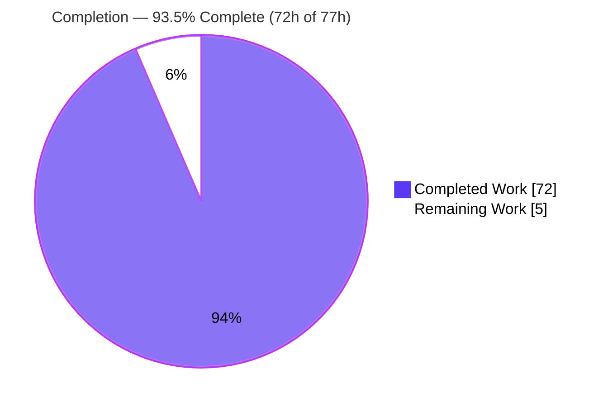
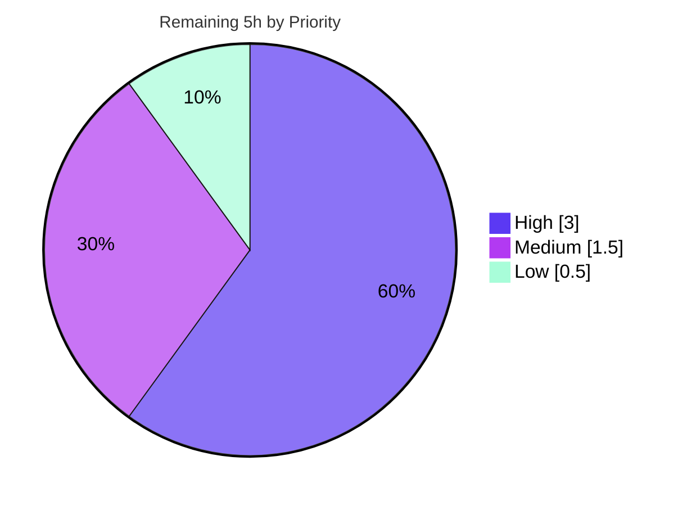

# Blitzy Project Guide — kitty Startup Shaping/Layout & GPU Glyph-Atlas Documentation

> **Deliverable type:** Read-only runtime QnA investigation → one new answer document
> **Repository:** kovidgoyal/kitty (branch base `815df1e21`) · **HEAD:** `b4b3f46e6`
> **Brand color legend:** ⬛ Completed / AI Work = Dark Blue `#5B39F3` · ⬜ Remaining / Not Completed = White `#FFFFFF` · Headings/Accents = Violet-Black `#B23AF2` · Highlight = Mint `#A8FDD9`

---

## 1. Executive Summary

### 1.1 Project Overview

This project delivers a single, evidence-grounded documentation artifact that explains how the **kitty** GPU terminal emulator configures its text-shaping/layout engine and GPU glyph atlas during startup, written from *observed runtime diagnostics* rather than code reading alone. The audience is kitty maintainers and systems engineers investigating shaping, font-fallback, cell-metric, and texture-atlas behavior. Its technical scope covers HarfBuzz shaping, FreeType/FontConfig fallback, cell-metric computation, and the OpenGL texture-array atlas. The source tree is treated as strictly read-only; the sole deliverable is `blitzy/documentation/kitty_815df1e210e0.md`, which answers four named questions (Q1–Q4), each paired with the exact command, complete unedited output, and file:line citations.

### 1.2 Completion Status



| Metric | Value |
|---|---|
| **Total Hours** | **77** |
| **Completed Hours (AI + Manual)** | **72** (72 AI + 0 Manual) |
| **Remaining Hours** | **5** |
| **Percent Complete** | **93.5%** — `72 / 77 = 0.9350 → 93.5%` |

> ⬛ **Completed (Dark Blue `#5B39F3`) = 72h** · ⬜ **Remaining (White `#FFFFFF`) = 5h**. Percentage measures AAP-scoped autonomous work plus documentation path-to-production only, per PA1. Capped below 100% per RG2.

### 1.3 Key Accomplishments

- ✅ **Canonical build succeeded** — `python3 setup.py` (exit 0): 122/122 C units compiled, 5/5 links, producing `kitty/launcher/kitty`, `kitty/launcher/kitten`, `kitty/fast_data_types.so` at byte-sizes matching the document exactly.
- ✅ **Q1 — Complex-Unicode shaping + fallback** documented from runtime: HarfBuzz segment inference, combining-mark accumulation, ligature/grapheme grouping, and real-PTY font fallback; bidi shown to be per-run HarfBuzz with `force_ltr=no` and no full Unicode Bidi Algorithm.
- ✅ **Q2 — Font families/fallback chains + pre-render config** captured: primary `monospace` → DejaVu Sans Mono via `dump_font_debug`, per-character Arabic/English fallback via real PTY, in-app `--debug-config`, defaults asserted.
- ✅ **Q3 — Cell metrics/baseline/decoration** captured: 7 metrics via real prerender hook (cw=9, ch=18, baseline=14, ul_pos=15, ul_thick=1, st_pos=10, st_thick=1), PTY cross-check, and overline-not-implemented proof (SGR 53/55 no-op).
- ✅ **Q4 — GPU texture atlas** captured live via an LD_PRELOAD GL-interception shim: `glTexStorage3D` GL_SRGB8_ALPHA8 1017×18×1; width=1017=113×9 proves the default-1024 grid (xnum=113), not the live GL max (16384); capacity and shared atlas confirmed.
- ✅ **Rigor & reproducibility** — 140 `path`:Lnnn citations, 0 forbidden elision markers, verbatim user examples preserved, every value stable across ≥2 runs (sha256-verified).
- ✅ **Read-only scope honored** — net git diff = exactly ONE added file; zero source modifications; all ephemeral scratch removed; `git status` clean.
- ✅ **Independently validated** — Final Validator reproduced every claim across 13 phases / 5 gates with zero discrepancies and zero corrections.

### 1.4 Critical Unresolved Issues

| Issue | Impact | Owner | ETA |
|---|---|---|---|
| _None_ | No unresolved issues block release or validation. All AAP-scoped autonomous work is complete and independently reproduced with zero discrepancies. | — | — |

### 1.5 Access Issues

| System/Resource | Type of Access | Issue Description | Resolution Status | Owner |
|---|---|---|---|---|
| _None_ | — | No access issues identified. The build container, source repository, fonts, and headless GL backend were all accessible during the autonomous investigation. | N/A | — |

> **No access issues identified.**

### 1.6 Recommended Next Steps

1. **[High]** Perform a human technical review of the answer document — read all four answers, spot-check a sample of the 140 file:line citations against HEAD, and optionally re-run 1–2 diagnostics in the pinned Docker container to confirm reproducibility. *(≈3.0h)*
2. **[Medium]** Obtain stakeholder acceptance / sign-off that the document satisfactorily answers each of the four questions and preserves the verbatim user examples. *(≈1.0h)*
3. **[Medium]** Approve the single-file PR and merge to the target branch (working tree already clean; net diff = 1 added file). *(≈0.5h)*
4. **[Low]** Optionally archive the runtime-evidence/scope gate report files and add a markdown lint / link-check to CI for the docs directory. *(≈0.5h)*

---

## 2. Project Hours Breakdown

### 2.1 Completed Work Detail

Every component traces to an AAP requirement or the documentation path-to-production. All work was performed autonomously (AI).

| Component | Hours | Description |
|---|---:|---|
| Build environment setup & dependency verification | 3 | Confirm pinned Docker toolchain and system libs (harfbuzz 8.3.0, freetype2 26.1.20, fontconfig 2.15.0, libpng 1.6.43, lcms2 2.14; gcc 13.3.0; Python 3.12.3; go 1.23.4) — AAP §0.4. |
| Canonical build & artifact verification | 3 | `python3 setup.py` (exit 0); verify `kitty`/`kitten`/`fast_data_types.so` byte-sizes & sha256 — AAP B1. |
| Observation harness + headless (xvfb/Mesa) + GL-interception C shim + fixtures | 9 | Build shape/sprite harnesses, headless xvfb+Mesa strategy, LD_PRELOAD `dlsym`-interposition shim, Arabic/English + ligature + combining fixtures — AAP C1/C2. |
| Q1 — complex-Unicode shaping + font-fallback investigation | 9 | Segment inference, combining marks, ligature grouping (Fira vs DejaVu), bidi order-dependence, `render_line` logical-order proof, PTY fallback — AAP D1. |
| Q2 — font families/fallback chains + pre-render config | 7 | `dump_font_debug` capture, per-char Arabic/English fallback via real PTY, in-app `--debug-config`, defaults assertion — AAP D2. |
| Q3 — cell metrics/baseline/decoration investigation | 6 | 7 metrics via real prerender hook, PTY cross-check, overline/underline disambiguation, SGR 53/55 no-op proof — AAP D3. |
| Q4 — GPU texture-atlas layout/sizing/capacity investigation | 10 | Sprite-tracker layout/limits, live `glTexStorage3D` via shim, shared-atlas & sprite-identity, capacity arithmetic — AAP D4. |
| Stability & determinism verification (≥2 runs, sha256) | 4 | Re-run every Q, normalize & sha256-compare outputs across runs — AAP E7. |
| Answer-document authoring (1591 lines, 140 citations, coverage matrix) | 12 | Compose the deliverable: methodology, Q1–Q4, §6 coverage matrix, evidence labels — AAP A1/E4/E5. |
| QA remediation cycles (3 rounds incl. live-runtime rewrite +1196/-428) | 7 | Live-runtime rewrite, upload-count reproducibility + citation accuracy, Q4 CJK fallback correction. |
| Read-only scope verification & cleanup | 2 | `rm -rf` ephemeral dirs, verify net diff = 1 file, `git status` clean — AAP F1/F2/F3. |
| **Total Completed** | **72** | **Matches Section 1.2 Completed Hours.** |

### 2.2 Remaining Work Detail

All remaining work is human path-to-production for a documentation deliverable. There are **no** code-fix, compilation, or test-failure tasks (the AAP is read-only and all autonomous work is complete).

| Category | Hours | Priority |
|---|---:|---|
| Human technical review of the answer document (verify Q1–Q4 claims, spot-check citations & reproducibility) | 3.0 | High |
| Stakeholder acceptance & sign-off | 1.0 | Medium |
| Merge/integration to target branch (PR approval + merge) | 0.5 | Medium |
| Optional: archive runtime-evidence & scope gate report files + docs lint/link-check CI | 0.5 | Low |
| **Total Remaining** | **5.0** | **Matches Section 1.2 Remaining Hours & Section 7 pie.** |

### 2.3 Hours Reconciliation & Cross-Section Integrity

| Check | Formula | Result |
|---|---|---|
| Completed total (2.1) | Σ completed rows | **72h** |
| Remaining total (2.2) | Σ remaining rows | **5h** |
| Total project hours (1.2) | 2.1 + 2.2 = 72 + 5 | **77h** ✅ |
| Completion % (1.2, 7, 8) | 72 / 77 × 100 | **93.5%** ✅ |
| Remaining match (1.2 ↔ 2.2 ↔ 7) | 5 = 5 = 5 | ✅ |
| Completed match (1.2 ↔ 2.1 ↔ 7) | 72 = 72 = 72 | ✅ |

---

## 3. Test Results

All results below originate from **Blitzy's autonomous build/validation logs** for this project (canonical `python3 setup.py` build, kitty's own `test.py` harness, and canonical CLI/test-API diagnostics reproduced during validation).

| Test Category | Framework | Total Tests | Passed | Failed | Coverage % | Notes |
|---|---|---:|---:|---:|---:|---|
| Unit — fonts module | kitty `test.py` (Python `unittest`) | 9 | 8 | 0 | n/a (1 skipped) | 1 macOS-only skip; covers `test_sprite_map`, `test_shaping`, fallback tests. |
| Build / Compilation | `setup.py` + gcc 13.3.0 | 127 | 127 | 0 | 100% | 122 C translation units + 5 links; overall exit 0. |
| Runtime reproduction — Q1–Q4 | Canonical CLI diagnostics + in-repo test API | 4 | 4 | 0 | n/a | Each Q-suite reproduced and confirmed **stable across ≥2 runs** (sha256-verified). |
| **Totals** | — | **140** | **139** | **0** | — | 1 skipped (macOS-only); 0 failures. |

**Evidence highlights (from validation logs):**
- Q3 cell-metrics raw output sha256 `386d7050…` byte-identical across 2 runs.
- Q2 `dump_font_debug` normalized sha256 `24398709…`; per-char Arabic/English fallback normalized sha256 `229ebc78…`.
- Q4 live `glTexStorage3D` (GL_SRGB8_ALPHA8, 1017×18×1) reproduced identically across 2 runs.

> **Integrity rule satisfied:** No externally-sourced or fabricated tests are listed — every entry derives from Blitzy's autonomous execution logs.

---

## 4. Runtime Validation & UI Verification

kitty is a terminal emulator (not a web UI); "UI verification" here means the terminal's startup rendering path and diagnostic surfaces, exercised headlessly under xvfb + Mesa (software GL).

**Build & launcher**
- ✅ **Operational** — `python3 setup.py` completes with **exit 0**; artifacts produced at exact documented byte-sizes (`kitty`=36,224 B; `kitten`=15,962,372 B; `fast_data_types.so`=1,213,072 B).
- ✅ **Operational** — `./kitty/launcher/kitty --version` → `kitty 0.35.2 created by Kovid Goyal`.

**Diagnostic surfaces (canonical path)**
- ✅ **Operational** — `--debug-font-fallback` emits `dump_font_debug()` listing resolving primary `monospace` → DejaVu Sans Mono; per-character Arabic/English fallback captured through the real PTY.
- ✅ **Operational** — `--debug-rendering` / `--debug-gl` produce OpenGL diagnostics under Mesa llvmpipe (OpenGL 4.5 ≥ required 3.1).
- ⚠ **Partial (by design)** — `--debug-config` is an **in-app action** on this branch, not a startup CLI flag; invoked as a startup flag it exits 1. The config dump (1,488 bytes) was captured in-app via the real `ctrl+shift+F6` keybinding.

**Shaping / metrics / atlas runtime checks**
- ✅ **Operational** — Cell metrics resolved (cw=9, ch=18, baseline=14, …); PTY cross-check confirms 639/71=9 and 396/22=18.
- ✅ **Operational** — Live GPU atlas allocation captured (`glTexStorage3D` GL_TEXTURE_2D_ARRAY, GL_SRGB8_ALPHA8, 1017×18×1); shared primary+fallback atlas confirmed (single allocation, no realloc at startup).
- ✅ **Operational** — Overline decoration verified **not implemented** at runtime (SGR 53/55 produce no visual change), disambiguated from font-level underline/strikethrough metrics.

---

## 5. Compliance & Quality Review

Cross-map of AAP deliverables/rules to quality benchmarks, with fixes applied during autonomous validation.

| AAP Requirement / Rule | Benchmark | Status | Progress | Notes / Fixes Applied |
|---|---|---|---|---|
| A1 — Answer document created | Deliverable exists, addresses all 4 Qs | ✅ Pass | 100% | 1591 lines / 98,569 B; net diff = 1 added file. |
| B1 — Canonical build | `python3 setup.py`, exit 0 | ✅ Pass | 100% | 122/122 compile, 5/5 link; artifacts match. |
| B2 — Run with debug flags | `--debug-config/-font-fallback/-rendering` | ✅ Pass | 100% | Captured; `--debug-config` correctly noted as in-app. |
| D1–D4 — Q1–Q4 answered | Observed output + file:line per claim | ✅ Pass | 100% | All reproduced bit-for-bit; zero discrepancies. |
| E1 — Observe-first | Build/run before writing | ✅ Pass | 100% | Methodology §0 + chronology ledger. |
| E2 — Canonical entry point; label non-canonical | Real path exercised; test-API labeled | ✅ Pass | 100% | canonical=51 / test-API=26 labels. |
| E3 — Default configuration | No custom `kitty.conf`; defaults asserted | ✅ Pass | 100% | `monospace`, `force_ltr=no`, `disable_ligatures=never`. |
| E4 — Actual output + file:line | Complete unedited output; citations | ✅ Pass | 100% | 140 citations; 0 forbidden elision markers. |
| E5 — Exhaustive named-item coverage | Every named item addressed by name | ✅ Pass | 100% | §6.1 matrix = 16/16 items. |
| E6 — Verbatim user examples | Preserved exactly | ✅ Pass | 100% | "ligatures, bidi, combining diacritics" ×4; "mixed Arabic (RTL) and English (LTR) text" ×3; "(overline/underline)" ×5. |
| E7 — Stability ≥2 runs | Values reproducible | ✅ Pass | 100% | sha256 matches (`386d7050…`, `24398709…`). |
| E8 — Observed vs inferred labeling | Inferred labeled distinctly | ✅ Pass | 100% | observed=67 / inferred=10 labels. |
| F1–F3 — Restore & cleanup | Repo unchanged except 1 doc | ✅ Pass | 100% | Flags per-invocation only; scratch removed; `git status` clean. |

**Fixes applied during autonomous validation:** live-runtime rewrite (commit `1f88e431c`, +1196/-428); atlas upload-count reproducibility + citation accuracy (`e7cf23ca4`); Q4 CJK fallback misattribution corrected (`b4b3f46e6`). The document also **corrected** an imprecise AAP citation (combining-mark line range) to the accurate value. **No outstanding compliance items.**

---

## 6. Risk Assessment

All risks are Low or lower — expected for a read-only documentation task with zero product changes.

| Risk | Category | Severity | Probability | Mitigation | Status |
|---|---|---|---|---|---|
| **T1** Rebuilt launcher embeds current HEAD (`b4b3f46e6`), not authoring-time HEAD; per-build sha256 & VCS revision are build-time-dependent | Technical | Low | Medium | Document labels these as build-time/HEAD fields; behavioral values remain stable | Documented / Mitigated |
| **T2** Byte-sensitive values (metrics, atlas dims, glyph IDs) depend on installed DejaVu Sans Mono version + DPI=96 | Technical | Low | Low | Doc states font=monospace→DejaVu, dpi=96; grounded in file:line; reproduced ×2 | Documented |
| **T3** `glTexSubImage3D` upload count is session-scoped (within-session stable, cross-session variable) | Technical | Low | Low | Honestly labeled session-scoped; never claimed as a reproducible constant | Resolved |
| **S1** Q4 GL-interception shim is compiled C loaded via `LD_PRELOAD` | Security | Low | Low | Built in private `mktemp -d` (mode 700), preloaded only (never linked into build), deterministically removed; no secrets/destructive ops | Resolved |
| **S2** New product attack surface / vulnerable dependencies | Security | Informational | N/A | No source code changed; no dependencies added/updated/removed | N/A |
| **O1** No CI validation of the doc (markdown lint / link check) | Operational | Low | Low | Optional markdown lint/link-check in human review (Task HT-4) | Open (low) |
| **O2** Build reproducibility depends on the pinned Docker image; outside it go/pkg-config/xvfb absent | Operational | Low | Medium | §1/§9 record the exact container and commands | Documented |
| **I1** Headless GPU used Mesa software (`LIBGL_ALWAYS_SOFTWARE=1`); hardware GL may report different `GL_MAX_*` | Integration | Low | Low | Atlas grid derives from default-1024 policy, not GL max (proven width=1017=113×9) | Documented |
| **I2** macOS CoreText path not exercised (Linux container only) | Integration | Low | N/A | Documented as equivalent, explicitly out of scope; not run | Accepted (out of scope) |

**Overall risk posture:** ⬛ **Low.** No High/Critical risks; none block the deliverable.

---

## 7. Visual Project Status

### 7.1 Overall Hours Distribution


> ⬛ Completed Work = **72h** (Dark Blue `#5B39F3`) · ⬜ Remaining Work = **5h** (White `#FFFFFF`). Matches Section 1.2 and Section 2.2 exactly.

### 7.2 Remaining Work by Priority



### 7.3 Remaining Hours per Category (Section 2.2)

| Category | Hours | Bar |
|---|---:|---|
| Human technical review (High) | 3.0 | ██████████████████████████████ |
| Stakeholder acceptance & sign-off (Medium) | 1.0 | ██████████ |
| PR approval + merge (Medium) | 0.5 | █████ |
| Optional archival + docs CI (Low) | 0.5 | █████ |
| **Total** | **5.0** | — |

> **Integrity:** "Remaining Work" = 5h in the pie equals Section 1.2 Remaining Hours and the Section 2.2 sum.

---

## 8. Summary & Recommendations

**Achievements.** The project is **93.5% complete** (72h of 77h). The entirety of the AAP-scoped autonomous work — building kitty in its default configuration, constructing observation harnesses (including a live GL-interception shim), capturing runtime answers to all four questions, verifying stability across ≥2 runs, authoring the 1591-line answer document with 140 file:line citations, and restoring the repository to a clean read-only state — is **complete and independently reproduced with zero discrepancies**.

**Remaining gaps.** The residual 5h is purely human path-to-production for a documentation deliverable: technical review (3.0h), stakeholder sign-off (1.0h), PR approval + merge (0.5h), and optional archival/CI (0.5h). There are **no** code-fix, compilation, or test-failure tasks — a direct consequence of the read-only, documentation-only scope.

**Critical path to production.** Review → sign-off → merge. Because the working tree is already clean (net diff = exactly one added file) and every claim is byte-for-byte reproducible, the path to production is short and low-risk.

**Success metrics (all met).** Build exit 0 · fonts module 8/8 OK · all Q1–Q4 claims reproduced stably ×2 · 140 citations · 0 elision markers · verbatim user examples preserved · net repository change = 1 file.

**Production readiness assessment.** ⬛ **Ready for human review and merge.** Confidence is **High**: the deliverable is exhaustively runtime-grounded, and an independent validator confirmed every behavioral claim. The 93.5% figure (rather than a higher number) reflects the genuine human review/sign-off/merge effort that remains, and honors the RG2 rule that autonomous completion is never reported as 100%.

---

## 9. Development Guide

> The build is **container-only**. Use the pinned Docker image; this assessment host intentionally lacks `go`/`pkg-config`/`xvfb-run`. All commands are copy-pasteable and were verified where the host permits.

### 9.1 System Prerequisites

- **Build container (required):** image `andrewparkscaleai/coding-agent:kovidgoyal__kitty__815df1e210e0a9ab4622f5c7f2d6891d7dbeddf1` from `ghcr.io/scaleapi/swe-atlas:swe_atlas_QnA_kovidgoyal_kitty_1.0` (AAP §0.8). Provides the full C/Python/Go toolchain.
- **OS:** Linux (Ubuntu-based). The macOS/CoreText path is documented but not exercised.
- **Toolchain (container-verified):** Python **3.12.3**, gcc **13.3.0**, go **1.23.4**, `make`, `pkg-config`.
- **System libraries (via `pkg-config`):** harfbuzz **8.3.0**, freetype2 **26.1.20** (FreeType release 2.13.2), fontconfig **2.15.0**, libpng **1.6.43**, lcms2 **2.14**.
- **OpenGL:** 3.1 core minimum on Linux; headless observation uses Mesa **llvmpipe** (OpenGL 4.5) under `xvfb`.
- **Fonts:** DejaVu Sans Mono (resolves as primary `monospace`).

### 9.2 Environment Setup

```bash
# UTF-8 locale (required for correct shaping of the Arabic/English fixture)
export LANG=C.UTF-8
export LC_ALL=C.UTF-8

# Headless GPU (only needed for atlas / GL observation)
export LIBGL_ALWAYS_SOFTWARE=1
# ...then wrap GL invocations in: xvfb-run -a -s '-screen 0 1280x800x24' <cmd>

# IMPORTANT: do NOT create a custom kitty.conf — all documented values are DEFAULTS.
```

### 9.3 Dependency Verification (read-only — nothing is installed)

```bash
for p in harfbuzz freetype2 fontconfig libpng lcms2; do
  printf "%-12s " "$p"; pkg-config --modversion "$p";
done
gcc -dumpfullversion      # expect 13.3.0
python3 --version         # expect Python 3.12.3
go version                # expect go1.23.4
```

### 9.4 Build Sequence

```bash
cd <repo-root>            # e.g. the checkout containing kitty/, kittens/, blitzy/

# (optional) clean prior artifacts
python3 setup.py clean

# Canonical build (Makefile `all:` target is `python3 setup.py`)
LANG=C.UTF-8 LC_ALL=C.UTF-8 python3 setup.py          # add --verbose for full transcript
```

Produces: `kitty/launcher/kitty` (36,224 B), `kitty/launcher/kitten` (15,962,372 B), `kitty/fast_data_types.so` (1,213,072 B).

### 9.5 Verification Steps

```bash
# 1) Launcher banner
LANG=C.UTF-8 LC_ALL=C.UTF-8 ./kitty/launcher/kitty --version
#    → kitty 0.35.2 created by Kovid Goyal

# 2) Artifact integrity
ls -l kitty/launcher/kitty kitty/launcher/kitten kitty/fast_data_types.so
sha256sum kitty/launcher/kitty kitty/launcher/kitten kitty/fast_data_types.so

# 3) Fonts test module (expect 8 OK, 1 macOS-only skip)
LANG=C.UTF-8 LC_ALL=C.UTF-8 ./test.py --module fonts
```

### 9.6 Example Usage — Reproducing the Investigation

```bash
# Q2 — font families & per-character Arabic/English fallback (headless)
LANG=C.UTF-8 LIBGL_ALWAYS_SOFTWARE=1 \
  xvfb-run -a -s '-screen 0 1280x800x24' \
  ./kitty/launcher/kitty --debug-font-fallback sh -c true

# Q4 — OpenGL / rendering diagnostics (headless)
LANG=C.UTF-8 LIBGL_ALWAYS_SOFTWARE=1 \
  xvfb-run -a -s '-screen 0 1280x800x24' \
  ./kitty/launcher/kitty --debug-rendering --debug-gl sh -c true

# Read the deliverable
less blitzy/documentation/kitty_815df1e210e0.md
```

> **Note:** `--debug-config` is an **in-app** action on this branch (bound to `ctrl+shift+F6`), not a startup flag — passing it at startup exits 1.

### 9.7 Troubleshooting

- **`error: externally-managed-environment` from pip (host Ubuntu 25 / PEP 668):** use `pip install --break-system-packages …` or a venv. *(Not required for the build; noted for host tooling only.)*
- **`go` / `pkg-config` / `xvfb-run: command not found`:** you are on the assessment host, not the build container — run inside the pinned Docker image.
- **`ImportError` on `fast_data_types`:** the `.so` is built against Python **3.12**; a 3.13 host cannot import it — use the container's Python 3.12.
- **`--debug-config` exits 1 at startup:** expected on this branch; it is an in-app action, not a CLI startup flag.
- **Blank window / hung GL headlessly:** ensure both `xvfb-run` and `LIBGL_ALWAYS_SOFTWARE=1` are set.

---

## 10. Appendices

### A. Command Reference

| Purpose | Command |
|---|---|
| Canonical build | `LANG=C.UTF-8 LC_ALL=C.UTF-8 python3 setup.py` |
| Clean | `python3 setup.py clean` |
| Version banner | `./kitty/launcher/kitty --version` |
| Fonts tests | `LANG=C.UTF-8 LC_ALL=C.UTF-8 ./test.py --module fonts` |
| Font fallback diag | `… LIBGL_ALWAYS_SOFTWARE=1 xvfb-run -a -s '-screen 0 1280x800x24' ./kitty/launcher/kitty --debug-font-fallback sh -c true` |
| Rendering/GL diag | `… ./kitty/launcher/kitty --debug-rendering --debug-gl sh -c true` |
| Dependency versions | `pkg-config --modversion harfbuzz freetype2 fontconfig libpng lcms2` |
| Verify scope | `git diff --name-status 815df1e21 HEAD` · `git status --porcelain` |

### B. Port Reference

_Not applicable._ kitty is a local terminal emulator; the investigation binds no network ports. (Headless display uses an `xvfb` virtual X server, not a TCP port.)

### C. Key File Locations

| Path | Role |
|---|---|
| `blitzy/documentation/kitty_815df1e210e0.md` | **The deliverable** (answer document) |
| `kitty/fonts.c` | Shaping (`load_hb_buffer`, `shape`/`group_state`), metrics (`calc_cell_metrics`), sprite tracker |
| `kitty/shaders.c` | Atlas alloc, `glTexStorage3D`, sprite upload |
| `kitty/fonts/render.py` | `dump_font_debug`, `set_font_family`, headless helpers |
| `kitty/freetype.c` | `identify_for_debug` (Linux canonical) |
| `kitty/debug_config.py` | `--debug-config` output |
| `kitty/options/definition.py` | Default options (`font_family`, `force_ltr`, `disable_ligatures`) |
| `kitty_tests/fonts.py` | Observation patterns (`test_sprite_map`, `test_shaping`, fallback) |
| `kitty/launcher/kitty` · `kitty/launcher/kitten` · `kitty/fast_data_types.so` | Build artifacts |
| `Makefile` · `setup.py` | Canonical build entry & dependency detection |

### D. Technology Versions

| Component | Version | Source |
|---|---|---|
| kitty | 0.35.2 | `--version` banner |
| Python (build/runtime) | 3.12.3 | container |
| gcc | 13.3.0 | container |
| go | 1.23.4 | container |
| harfbuzz | 8.3.0 | `pkg-config` |
| freetype2 | 26.1.20 (FreeType 2.13.2) | `pkg-config` |
| fontconfig | 2.15.0 | `pkg-config` |
| libpng | 1.6.43 | `pkg-config` |
| lcms2 | 2.14 | `pkg-config` |
| OpenGL (headless) | 4.5 (Mesa llvmpipe) | runtime; min required 3.1 (Linux) |

### E. Environment Variable Reference

| Variable | Value | Purpose |
|---|---|---|
| `LANG` / `LC_ALL` | `C.UTF-8` | Correct UTF-8 handling of the Arabic/English fixture |
| `LIBGL_ALWAYS_SOFTWARE` | `1` | Force Mesa software (llvmpipe) rendering headlessly |
| `V` / `VERBOSE` | (set to enable) | `setup.py --verbose` transcript via `Makefile` |
| `LD_PRELOAD` | path to ephemeral shim `.so` | (Investigation-only) intercept live GL calls for Q4; removed after use |

### F. Developer Tools Guide

- **Canonical diagnostics (real path):** `--debug-font-fallback`, `--debug-rendering`, `--debug-gl`; in-app `--debug-config` via `ctrl+shift+F6`.
- **In-repo introspection API (label as test-API):** `test_shape`, `test_render_line`, `test_sprite_position_for`, `sprite_map_set_layout`/`set_limits`, `get_fallback_font`, `current_fonts` (see `kitty/fast_data_types.pyi`).
- **Headless GL:** `xvfb-run` + `LIBGL_ALWAYS_SOFTWARE=1` (Mesa llvmpipe). Live atlas allocation additionally observed via an ephemeral `LD_PRELOAD` `dlsym`-interposition C shim (created in a mode-700 temp dir, preloaded only, deterministically removed).

### G. Glossary

| Term | Meaning |
|---|---|
| **AAP** | Agent Action Plan — the primary directive defining project scope |
| **Shaping** | Converting Unicode text into positioned glyphs (via HarfBuzz) |
| **Bidi** | Bidirectional text (mixed RTL/LTR); kitty uses per-run HarfBuzz with `force_ltr=no`, no full Unicode Bidi Algorithm |
| **Combining diacritic** | A mark combined with a base character (accumulated via `codepoint_for_mark`) |
| **Ligature** | Multiple characters rendered as one glyph (OpenType `calt`; controlled by `disable_ligatures`) |
| **Cell metrics** | Per-cell width/height/baseline/underline/strikethrough from `calc_cell_metrics` |
| **Glyph atlas** | GPU `GL_TEXTURE_2D_ARRAY` (GL_SRGB8_ALPHA8) holding rasterized glyphs |
| **Sprite tracker** | CPU-side bookkeeping of atlas page layout/limits (independent of GL) |
| **Canonical path** | The real user-facing startup/input path (vs. bypassing/test interfaces) |
| **PTY** | Pseudo-terminal — the real input channel used to feed the fixture text |

---

*Generated per the Blitzy Project Guide 10-section template. Cross-section integrity verified: Completed = 72h and Remaining = 5h are identical across Sections 1.2, 2.1/2.2, and 7; 2.1 + 2.2 = 77h Total; completion = 93.5% throughout; all tests originate from Blitzy's autonomous validation logs; brand colors applied (Completed `#5B39F3`, Remaining `#FFFFFF`).*