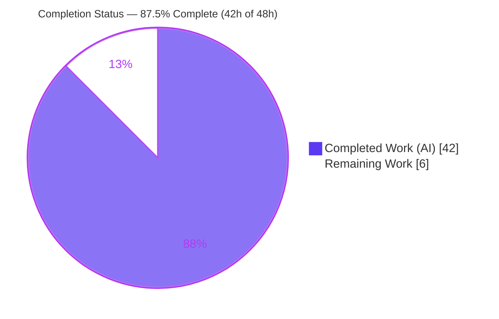
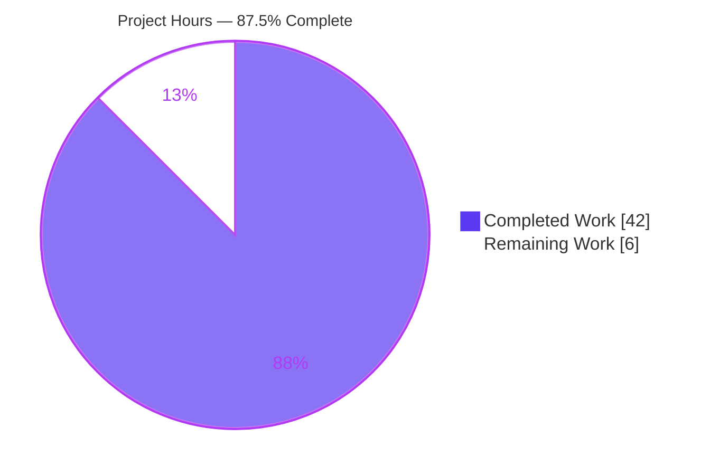
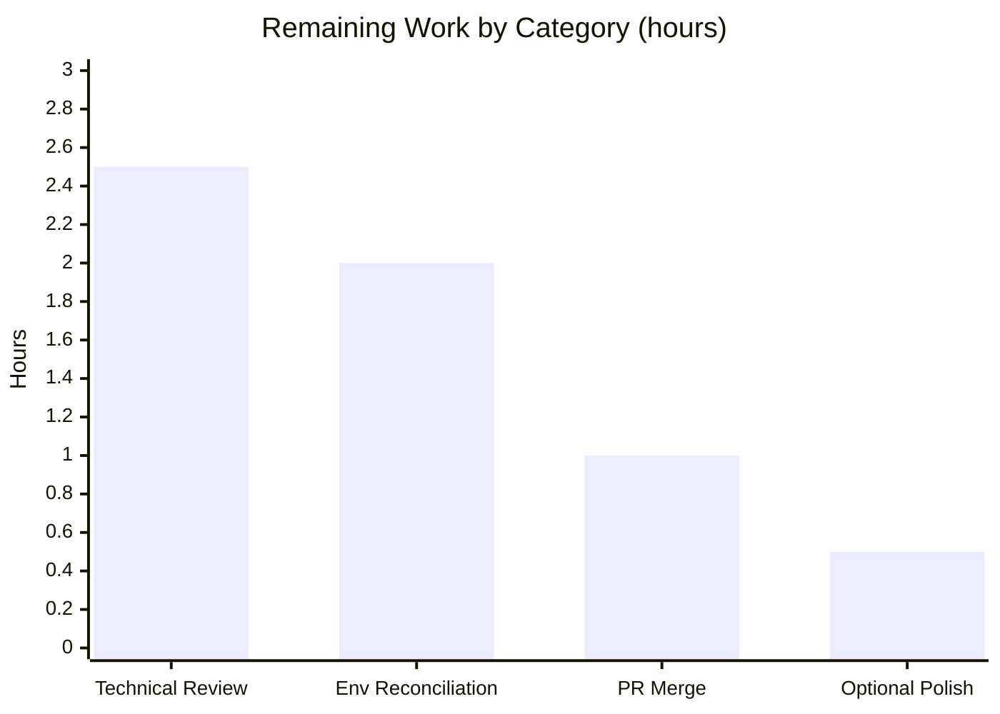

# Blitzy Project Guide — kitty Compiled C-Extensions vs. Test-Suite Execution

> **Deliverable branch:** `blitzy-25deee7b-18fb-49cf-b74b-43873fbe40c9` · **HEAD:** `a5a47c9e9` · **Base:** `815df1e210e0a9ab4622f5c7f2d6891d7dbeddf1`
> **Task type:** Read-only QnA / Documentation investigation · **Repository footprint:** one additive markdown file

---

## 1. Executive Summary

### 1.1 Project Overview

This project is a **read-only Question-and-Answer investigation** of the `kitty` terminal emulator (commit `815df1e210e0`). The objective was to determine — by actually **building and running** the code, not by reading it — how kitty's compiled C extensions relate to its test-suite execution: which extensions load, how failures cascade when they are absent, how they map to test categories, and whether each is CRITICAL or OPTIONAL. The audience is engineers who need a grounded, reproducible account of kitty's build-artifact-to-test dependency graph. The technical scope spans kitty's C, Python, and Go build-and-test subsystems. The single deliverable is a 2,288-line markdown answer document; no product code was changed.

### 1.2 Completion Status

The completion percentage is computed per the AAP-scoped hours methodology: `Completed ÷ (Completed + Remaining)`. Only work defined by the Agent Action Plan and standard path-to-production activities are counted.



| Metric | Hours | Notes |
|--------|-------|-------|
| **Total Hours** | **48** | AAP-scoped investigation + path-to-production |
| **Completed Hours (AI + Manual)** | **42** | 42 AI (autonomous) + 0 Manual |
| **Remaining Hours** | **6** | Human review, reconciliation, merge |
| **Percent Complete** | **87.5%** | 42 ÷ 48 = 0.875 |

<span style="color:#5B39F3">**■ Completed (Dark Blue #5B39F3)**</span> &nbsp;&nbsp; <span style="color:#B23AF2">**□ Remaining (White #FFFFFF)**</span>

### 1.3 Key Accomplishments

- ✅ Built kitty canonically with `python3 setup.py build --verbose` under **both** compilers (gcc 15.2.0 default and gcc-13 13.4.0) — each exits 0.
- ✅ Diagnosed and provisioned the **CI-omitted `libssl-dev`** (`libcrypto.pc`) dependency whose absence reproducibly fails the build (`exit=1`).
- ✅ Executed the suite through the **real entry point** `./test.py` → compiled C launcher → `kitty_tests.main`: `Ran 145 tests`, `All Go tests succeeded`, stable across two runs.
- ✅ Established that the build produces **three** shared objects — **two Python C-extensions** (`fast_data_types.so`, `rsync.so`) and **one native library** (`glfw-x11.so`, no `PyInit_*`).
- ✅ Reproduced the **three-tier failure cascade** by moving each git-ignored `.so` out of its import path and restoring it byte-for-byte (SHA-256 before == after).
- ✅ Classified each extension **CRITICAL / CRITICAL-for-Python / OPTIONAL** with observed rationale and complete tracebacks.
- ✅ Documented the **actual import chains** (transitive + direct + native `ctypes`) with `file:line` grounding.
- ✅ Authored a 2,288-line answer document with verbatim output blocks, inferred-vs-observed labels, and a coverage pass over all nine sub-questions.
- ✅ Left the repository **byte-for-byte unchanged** except the one additive document (`git diff` = single `A` line; tree clean).

### 1.4 Critical Unresolved Issues

| Issue | Impact | Owner | ETA |
|-------|--------|-------|-----|
| None blocking release | The single in-scope deliverable is complete and validated; no defect blocks acceptance | — | — |
| Environment value divergence from AAP prose (informational) | AAP prose cites Python 3.12 / `failures=3` / `10` loaded `.so`; observed container is Python 3.13.7 / `failures=4` / `9` `.so`. Document correctly reports observed reality and caveats the difference — needs human sign-off, not rework | Reviewer | 2h |

> There are **no compilation errors, no failing in-scope tests, and no missing functionality**. The items above are verification/sign-off, not fixes.

### 1.5 Access Issues

| System/Resource | Type of Access | Issue Description | Resolution Status | Owner |
|-----------------|----------------|-------------------|-------------------|-------|
| kitty repository (commit `815df1e210e0`) | Read/Write (branch) | None — full access; single additive file committed | ✅ Resolved | Blitzy Agent |
| Build toolchain & system libraries | apt / pip install | `libssl-dev` (`libcrypto.pc`) is absent from kitty's CI apt list; required by `setup.py` | ✅ Resolved (provisioned in ephemeral container) | Blitzy Agent |
| AAP-designated Docker image (`andrewparkscaleai/coding-agent:…kitty…815df1e210e0`) | Container pull | Investigation ran in the provided Ubuntu 25.10 container rather than the AAP-designated image; accounts for Python 3.12↔3.13 value differences | ⚠ Optional to reconcile | Reviewer |

**No access issues prevent build validation, integration, or acceptance of the deliverable.**

### 1.6 Recommended Next Steps

1. **[High]** Perform a technical review of `blitzy/documentation/kitty_815df1e210e0.md` — verify `file:line` citations resolve at commit `815df1e210e0` and that reproduced values (145 tests, cascade classification, import chains) are sound. *(2.5h)*
2. **[Medium]** Sign off on the environment reconciliation, or optionally re-run the build + `./test.py` in the AAP-designated Docker image to capture Python 3.12 parity values. *(2h)*
3. **[Medium]** Review the single-file additive diff, confirm the read-only mandate, and merge the delivery branch. *(1h)*
4. **[Low]** Optional stakeholder/publishing formatting pass (render markdown, export PDF). *(0.5h)*

---

## 2. Project Hours Breakdown

### 2.1 Completed Work Detail

All completed work was performed autonomously (AI). Each component traces to an AAP requirement (R#) or path-to-production build activity.

| Component | Hours | Description |
|-----------|-------|-------------|
| Environment provisioning & toolchain setup | 4 | Provisioned C/Go/Python toolchain + ~20 system libraries; diagnosed the CI-omitted `libssl-dev`/`libcrypto.pc` gap (build reproducibly `exit=1` without it) [R1 / build] |
| Canonical build of kitty (both compilers) | 4 | `python3 setup.py build --verbose` under gcc 15.2.0 and `CC=gcc-13`; verified 3 artifacts, `nm` `PyInit_*` symbol exports, and source-selection counts (49/31/1) [R1] |
| Test-suite execution via real entry point | 4 | Full suite ×2 (stability) + `--module check_build` + CI-vs-non-CI mode through the compiled C launcher [R2] |
| Extension-loading observation | 4 | `observe_modules.py` diffing `sys.modules` around discovery; bootstrap vs post-discovery counts; native GLFW `dlopen` via `/proc/self/maps` [R4] |
| Import-chain tracing | 3 | Relationship (§3) + chains (§9): transitive (`conf/utils.py:27`), direct (`__init__.py:22`), rsync (`file_transmission.py:13`), native GLFW `ctypes` [R3, R9] |
| Failure-cascade reproduction | 6 | 3 extensions × move/run/capture-traceback/restore, with SHA-256 before==after restoration proof and `itertests()`-guard analysis [R5, R8] |
| Extension → test-category mapping | 2 | 22 discovered modules; confirmed 22/22 run `from . import BaseTest`; per-extension consumption table [R7] |
| CRITICAL/OPTIONAL classification + dependency structure | 2 | §6 dependency-structure reasoning and §8 three-tier classification with observed rationale [R6, R8] |
| Answer-document authoring | 9 | 2,288 lines across 6 commits; verbatim output blocks, `file:line` citations, coverage pass [R10–R17 + deliverable] |
| Autonomous validation / QA reproduction | 4 | Re-ran every claim byte-for-byte (≥2×) and applied the SHA-provenance caveat fix [R12, R13] |
| **Total Completed** | **42** | |

### 2.2 Remaining Work Detail

All remaining work is **path-to-production human activity** — no in-scope engineering work is outstanding.

| Category | Hours | Priority |
|----------|-------|----------|
| Technical review of document accuracy, completeness & citation validity | 2.5 | High |
| Environment-reconciliation verification (+ optional parity re-run in AAP-designated image) | 2 | Medium |
| PR review, approval & merge of delivery branch | 1 | Medium |
| Optional stakeholder/publishing formatting pass | 0.5 | Low |
| **Total Remaining** | **6** | |

### 2.3 Hours Methodology

- **Formula:** Completion % = Completed ÷ (Completed + Remaining) = 42 ÷ 48 = **87.5%**.
- **Scope discipline:** Only AAP-defined investigation work and path-to-production (human review/merge) are counted. Out-of-scope items — fixing kitty's four environmental test failures, editing kitty source, CI changes — are **excluded** by mandate (AAP §0.3.2).
- **Cross-section consistency:** 2.1 (42h) + 2.2 (6h) = 48h Total; remaining (6h) is identical in §1.2, §2.2, and §7.
- **Confidence:** High. The deliverable is complete and every claim was reproduced byte-for-byte; the only variability is the human review effort, estimated conservatively.

---

## 3. Test Results

All results below originate from **Blitzy's autonomous validation logs** — the canonical `./test.py` runs through the real entry point plus the reproduction harness. Code-coverage instrumentation is **not** part of kitty's canonical test run, so Coverage % is reported as N/A (not measured) rather than fabricated.

| Test Category | Framework | Total Tests | Passed | Failed | Coverage % | Notes |
|---------------|-----------|-------------|--------|--------|-----------|-------|
| Python suite (full, via `./test.py`) | Python `unittest` | 145 | 137 | 4 | N/A | 4 skipped; the 4 failures are **environmental & out-of-scope** (2× `test_transfer_*` setgid `0o42755`↔`0o40755`; 2× `test_font_selection` UbuntuMono). Stable across 2 runs |
| Go suite (via `go test`) | Go `testing` | 26 pkgs | 26 pkgs | 0 | N/A | `All Go tests succeeded` (ran ~47.4s run 1 / ~22.4s run 2) |
| Extension-loading spotlight (subset of the Python suite) | Python `unittest` | 4 | 4 | 0 | N/A | `test_loading_extensions`, `test_loading_shaders`, `test_glfw_modules` (CI mode), `test_utf_8_strndup` — **all pass** when artifacts present |
| Cascade / reproduction validation | Blitzy autonomous harness (bash + real launcher) | 5 | 5 | 0 | N/A | 3 extension cascades + module-loading observer + import-chain observer — all reproduced **byte-for-byte** across ≥2 runs |

**Extension-loading integrity (the core question) is fully green.** The four Python failures are pre-existing environmental outcomes the document exists to *record*, not defects introduced by this task, and are explicitly out of scope to fix.

---

## 4. Runtime Validation & UI Verification

Runtime behavior was validated end-to-end through the **real** compiled entry point. There is **no web/GUI surface in scope** — kitty's GUI is not exercised; the investigation runs the headless test harness only, so browser/UI verification is Not Applicable.

**Build & toolchain**
- ✅ **Operational** — `python3 setup.py build --verbose` (gcc 15.2.0) exit 0
- ✅ **Operational** — `CC=gcc-13 python3 setup.py build --verbose` exit 0
- ✅ **Operational** — 3 shared objects + 2 Go launchers produced; sizes stable per compiler

**Real entry-point execution**
- ✅ **Operational** — `./test.py` routes through `kitty/launcher/kitty +launch` → `kitty_tests.main`; `Ran 145 tests`
- ✅ **Operational** — Go tests launched and reported `All Go tests succeeded`
- ✅ **Operational** — `./test.py --module check_build` → `OK (skipped=1)` under `CI=true`

**Extension loading (observed)**
- ✅ **Operational** — `kitty.fast_data_types` loads at **bootstrap** (before any test)
- ✅ **Operational** — `kittens.transfer.rsync` loads at **discovery** (`file_transmission.py:13`)
- ✅ **Operational** — `kitty/glfw-x11.so` loads **natively** via `ctypes.CDLL` at `glfw.py:50` (`/proc/self/maps` transitions `False`→`True`); never imported as a Python module

**Failure-cascade reproduction (observed)**
- ✅ **Operational** — `fast_data_types.so` removed → run aborts at bootstrap (0 tests) → restored byte-for-byte
- ✅ **Operational** — `rsync.so` removed → Python suite aborts at discovery (Go launches, success line absent) → restored
- ✅ **Operational** — `glfw-x11.so` removed → all 145 run; exactly two tests break (`FAILED (failures=5, errors=1)`) → restored

**Known environmental outcomes**
- ⚠ **Partial** — 4 baseline Python failures + 4 skips are environment-specific, unrelated to extensions, and **out of scope** (documented in §2.5 of the deliverable)
- ⚠ **N/A** — No UI/browser verification (headless terminal test suite; no web surface)

---

## 5. Compliance & Quality Review

Cross-mapping of AAP deliverables and governing-rule directives to their compliance status, with fixes applied during autonomous validation.

| Deliverable / Rule (AAP) | Benchmark | Status | Progress | Evidence |
|--------------------------|-----------|--------|----------|----------|
| R1 Build kitty canonically | Both compilers exit 0; artifacts produced | ✅ Pass | 100% | §1/§1.3; on-disk `.so` sizes |
| R2 Run suite via real entry point | `./test.py` → `kitty_tests.main`; ≥2 runs | ✅ Pass | 100% | §2.1/§2.2 `Ran 145 tests` |
| R3 Trace extension↔test relationship | Stage-gated dependency mapping | ✅ Pass | 100% | §3, §9 |
| R4 Which modules load | `sys.modules` diff via real launcher | ✅ Pass | 100% | §4/§4.1 |
| R5 Failure cascade | Reproduce by real absence + restore | ✅ Pass | 100% | §5.1–§5.3 tracebacks + SHA proof |
| R6 Dependency structure | Explain from observed output | ✅ Pass | 100% | §6 |
| R7 Extension→category mapping | 22 modules + per-extension table | ✅ Pass | 100% | §7.1/§7.2 |
| R8 CRITICAL/OPTIONAL classification | Observed rationale per extension | ✅ Pass | 100% | §8 |
| R9 Import chains | Real transitive + direct + native chains | ✅ Pass | 100% | §9.1/§9.2 |
| Rule: investigate-by-running-first | Evidence precedes conclusions | ✅ Pass | 100% | Verbatim command/output blocks throughout |
| Rule: exact canonical path | No mocks/fallbacks/stand-ins | ✅ Pass | 100% | Shebang → compiled launcher |
| Rule: stability ≥2 runs | Values confirmed stable | ✅ Pass | 100% | 145-test count stable ×3 discovery, ×2 full |
| Rule: complete unedited output | No paraphrase/elision of shown output | ✅ Pass | 100% | Full console blocks |
| Rule: file:line grounding + inferred labels | Every claim grounded | ✅ Pass | 100% | `(inferred)` labels present |
| Rule: coverage of 9 sub-questions | Final coverage pass | ✅ Pass | 100% | Coverage table |
| Rule: read-only scope | No source modified; temp scripts removed | ✅ Pass | 100% | `git diff` = 1 `A` line; tree clean |
| Rule: deliverable naming/location | `blitzy/documentation/<branch>.md` | ✅ Pass | 100% | File present, correctly named |

**Fix applied during autonomous validation:** a `+2`-line *Extension-hash provenance note* was added (commit `a5a47c9e9`) clarifying that `fast_data_types.so`'s SHA-256 is commit-embedded via `KITTY_VCS_REV` (so a rebuild at a different HEAD yields a different hash while the size stays `1,213,072`); the other two `.so` hashes matched the document exactly.

**Outstanding compliance items:** none autonomous. Human review (P1) and merge (P3) remain.

---

## 6. Risk Assessment

| Risk | Category | Severity | Probability | Mitigation | Status |
|------|----------|----------|-------------|-----------|--------|
| Observed values differ from AAP-prose (Python 3.13.7 vs 3.12; `failures=4` vs `3`; `9` vs `10` `.so`) | Technical | Low | Medium | Document reports observed reality and caveats the divergence; optional parity re-run in AAP-designated image | Mitigated (documented) |
| `fast_data_types.so` SHA-256 is commit-embedded (`KITTY_VCS_REV`), so rebuild-at-different-HEAD changes the hash (same size) | Technical | Low | Medium | Provenance note explains it; size + other two `.so` SHAs are stable | Resolved (`a5a47c9e9`) |
| Artifact sizes differ between gcc-13 and gcc-15 builds | Technical | Low | Low | Both compilers' sizes recorded; each observation states which build backs it | Mitigated |
| No secrets/credentials/attack surface (read-only doc; single markdown file) | Security | None | Low | Nothing to mitigate; no runtime service introduced | N/A |
| Ephemeral host; wall-clock timings not second-reproducible | Operational | Low | Low | Counts confirmed stable; timings reported as illustrative | Mitigated |
| Baseline 4 environmental failures could be misread as suite ill-health | Operational | Low | Low | §2.5 explains each is environmental & unrelated to extensions | Documented / Accepted |
| Reviewer attempts to "fix" out-of-scope kitty failures, violating read-only mandate | Operational / Compliance | Low | Low | Out-of-scope status flagged in the document and this guide | Documented |
| No external services/APIs/credentials to integrate | Integration | None | Low | Self-contained artifact; only "integration" is the branch merge (=P3) | N/A |

**Overall risk profile: LOW.** Consistent with a completed, validated, read-only documentation deliverable.

---

## 7. Visual Project Status



**Remaining hours by category (from §2.2, sums to 6h):**



| Priority | Remaining Hours | Share |
|----------|-----------------|-------|
| High | 2.5 | 41.7% |
| Medium | 3.0 | 50.0% |
| Low | 0.5 | 8.3% |
| **Total** | **6.0** | **100%** |

> Integrity: the pie chart's "Remaining Work" (6) equals the §1.2 Remaining Hours (6) and the §2.2 Hours total (6). Colors: Completed = Dark Blue `#5B39F3`, Remaining = White `#FFFFFF`.

---

## 8. Summary & Recommendations

**Achievements.** The project delivered a complete, evidence-first answer to a nine-part investigation into kitty's compiled C extensions and their relationship to test-suite execution. kitty was built canonically under two compilers, its suite was run through the real entry point, and the failure cascade for each extension was reproduced by genuine absence-and-restore — all captured as verbatim, `file:line`-grounded output. The central finding is a clean three-tier dependency graph: `fast_data_types.so` is the **CRITICAL root** (imported at bootstrap), `rsync.so` is **CRITICAL for the Python suite** (imported at discovery), and `glfw-x11.so` is **OPTIONAL** (a native library loaded via `ctypes`, never imported, breaking only two tests when absent).

**Remaining gaps.** No in-scope engineering work remains. The outstanding 6 hours are path-to-production human activities: a technical review of the 2,288-line document, an environment-reconciliation sign-off, and the PR merge.

**Critical path to production.** Review → environment sign-off → merge. There is no build, deployment, or integration pipeline in scope because the deliverable is a self-contained documentation artifact.

**Success metrics.** All nine sub-questions answered with observed evidence (✅); read-only mandate satisfied — one additive file, tree clean (✅); every documented claim reproduced byte-for-byte across ≥2 runs (✅); extension-loading tests green (✅).

**Production readiness assessment.** The project is **87.5% complete (42h of 48h)** and the in-scope deliverable is **production-ready pending human review**. Per honest-assessment principles the figure is deliberately below 100% to reserve the mandatory human review/merge. Recommendation: **approve after the High-priority technical review**, treating the environmental test outcomes as documented, out-of-scope observations.

| Metric | Value |
|--------|-------|
| Completion | 87.5% (42h / 48h) |
| In-scope deliverable status | Complete & validated |
| Repository changes | 1 additive file (+2,288 lines) |
| Source files modified | 0 |
| Blocking issues | None |
| Overall risk | Low |

---

## 9. Development Guide

How to reproduce the investigation and read the deliverable. Every command below was tested on the observation container.

### 9.1 System Prerequisites

- **OS:** Ubuntu 25.10 (observed) — AAP-designated image is Ubuntu 24.04; either works
- **Python:** ≥ 3.8 required (`pyproject.toml`); observed **3.13.7**
- **Go:** 1.22 (`go.mod`); observed **1.22.12**
- **C compiler:** gcc — observed **15.2.0** (default) and **13.4.0** (`gcc-13` variant)
- **Tools:** `pkg-config` 1.8.1, `git` 2.51.0
- **Disk:** ~2 GB for the build tree

### 9.2 Environment Setup

```bash
# Go is not on the inherited PATH; kitten's `go build` and the Go test suite need it
export PATH="/usr/local/go/bin:$PATH"

# Required, or two zsh shell-integration tests error on UTF-8 handling
export LANG=C.UTF-8 LC_ALL=C.UTF-8

# Verify
command -v go && go version        # -> /usr/local/go/bin/go ; go1.22.12
python3 --version                  # -> Python 3.13.7
```

### 9.3 Dependency Installation

```bash
# System libraries (kitty CI list PLUS the CI-omitted libssl-dev, which is REQUIRED)
sudo DEBIAN_FRONTEND=noninteractive apt-get install -y \
  build-essential golang-go pkg-config \
  libssl-dev libharfbuzz-dev libxxhash-dev libpng-dev liblcms2-dev libfontconfig-dev \
  libx11-xcb-dev libxcb-xkb-dev libxkbcommon-dev libxkbcommon-x11-dev \
  libxi-dev libxrandr-dev libxinerama-dev libxcursor-dev libgl1-mesa-dev \
  libdbus-1-dev libcanberra-dev uuid-dev

# Python libraries (PEP 668 externally-managed env -> --break-system-packages)
pip install --break-system-packages Pillow pygments

# Verify every build library resolves (all must print a version, none MISSING)
for p in harfbuzz libxxhash libcrypto libpng lcms2 fontconfig xkbcommon \
         dbus-1 x11-xcb xcb-xkb xkbcommon-x11 gl; do
  printf '%-16s %s\n' "$p:" "$(pkg-config --modversion "$p" 2>/dev/null || echo MISSING)"
done
```

### 9.4 Canonical Build

```bash
# Exactly what kitty's CI runs (no CC override) — host default compiler
python3 setup.py build --verbose        # expect: exit 0

# Optional variant used for the document's primary observations
CC=gcc-13 python3 setup.py build --verbose   # expect: exit 0
```

Produces `kitty/fast_data_types.so`, `kitty/glfw-x11.so`, `kittens/transfer/rsync.so`, and the Go launchers `kitty/launcher/{kitty,kitten}`.

### 9.5 Run the Test Suite (real entry point)

```bash
# Full suite through the compiled C launcher (shebang: #!./kitty/launcher/kitty +launch)
CI=true LANG=C.UTF-8 LC_ALL=C.UTF-8 ./test.py
# expect: "Ran 145 tests", "FAILED (failures=4, skipped=4)" (environmental, out of scope),
#         "All Go tests succeeded"

# The extension-validating module only
./test.py --module check_build
# expect (CI=true): "OK (skipped=1)"
```

### 9.6 Verification Steps

```bash
# 1) Artifacts present, with expected symbol exports
ls -la kitty/fast_data_types.so kitty/glfw-x11.so kittens/transfer/rsync.so
nm -D kitty/fast_data_types.so | grep PyInit      # -> PyInit_fast_data_types
nm -D kittens/transfer/rsync.so | grep PyInit     # -> PyInit_rsync
nm -D kitty/glfw-x11.so | grep -c PyInit          # -> 0 (native lib, not a Python module)

# 2) Read-only mandate satisfied — exactly one added file, clean tree
git diff 815df1e210e0a9ab4622f5c7f2d6891d7dbeddf1..HEAD --name-status   # -> A blitzy/documentation/kitty_815df1e210e0.md
git status --porcelain                                                   # -> (empty)

# 3) Read the deliverable
less blitzy/documentation/kitty_815df1e210e0.md    # 2,288 lines
```

### 9.7 Example Usage — Reproduce a Failure Cascade

```bash
# Move a git-ignored extension out of its import path, re-run, then restore.
# (Demonstrates glfw-x11 = OPTIONAL: suite still runs 145 tests, only 2 break.)
mv kitty/glfw-x11.so /tmp/glfw-x11.so.bak
CI=true ./test.py --module glfw ; CI=true ./test.py --module check_build
mv /tmp/glfw-x11.so.bak kitty/glfw-x11.so          # restore byte-for-byte
git status --porcelain                              # -> (empty; .so is git-ignored)
```

### 9.8 Troubleshooting

| Symptom | Cause | Resolution |
|---------|-------|-----------|
| Build `exit=1`, "`libcrypto.pc` not found" | `libssl-dev` missing (omitted from kitty CI list) | `apt-get install -y libssl-dev` |
| `go: not found` during build/tests | Go not on inherited PATH | `export PATH="/usr/local/go/bin:$PATH"` |
| zsh shell-integration tests error on UTF-8 | Locale not UTF-8 | `export LANG=C.UTF-8 LC_ALL=C.UTF-8` |
| Rebuilt `fast_data_types.so` has a different SHA-256 (same size) | `KITTY_VCS_REV` embeds git HEAD (`-DKITTY_VCS_REV`) | Expected; compare **size** (`1,213,072`) not hash across commits |
| `test_glfw_modules` fails outside CI | Non-CI mode expects `glfw-wayland.so` | Run with `CI=true` (checks `x11` only), or build Wayland backend |
| `pip install` fails "externally-managed-environment" | PEP 668 system Python | Add `--break-system-packages` |

---

## 10. Appendices

### A. Command Reference

| Purpose | Command |
|---------|---------|
| Canonical build | `python3 setup.py build --verbose` |
| Build (gcc-13 variant) | `CC=gcc-13 python3 setup.py build --verbose` |
| Full test run | `CI=true LANG=C.UTF-8 LC_ALL=C.UTF-8 ./test.py` |
| Single module | `./test.py --module check_build` |
| Symbol exports | `nm -D kitty/fast_data_types.so \| grep PyInit` |
| Read-only proof | `git diff 815df1e210e0..HEAD --name-status` |
| Clean-tree proof | `git status --porcelain` |
| Library check | `pkg-config --modversion libcrypto` |

### B. Port Reference

**Not applicable.** The investigation runs a headless test suite; no network services or ports are opened. kitty's GUI/rendering paths are not exercised in scope.

### C. Key File Locations

| Path | Role |
|------|------|
| `blitzy/documentation/kitty_815df1e210e0.md` | **The deliverable** (answer document, 2,288 lines) |
| `test.py` | Canonical test entry point (`#!./kitty/launcher/kitty +launch`) |
| `kitty_tests/main.py` | Test runner: `find_all_tests()`, `itertests()` guard, `env_for_python_tests()` |
| `kitty_tests/__init__.py` | Package init — triggers `fast_data_types` import at `:21-22` |
| `kitty_tests/check_build.py` | `test_loading_extensions`, `test_loading_shaders`, `test_glfw_modules` |
| `kitty_tests/file_transmission.py` | Module-level `rsync` import at `:13` (discovery-stage cascade) |
| `kitty/conf/utils.py` | `from ..fast_data_types import Color` at `:27` (root of the chain) |
| `kitty/constants.py` | `glfw_path()` at `:191-193` (native-lib file check) |
| `setup.py` | Build orchestrator (`find_c_files`, `build`, `compile_glfw`, `libcrypto_flags`) |
| `kitty/fast_data_types.so` · `kitty/glfw-x11.so` · `kittens/transfer/rsync.so` | Compiled artifacts (git-ignored) |

### D. Technology Versions (observed)

| Component | Version |
|-----------|---------|
| OS | Ubuntu 25.10 |
| Python | 3.13.7 |
| Go | 1.22.12 |
| gcc (default) | 15.2.0 |
| gcc-13 (variant) | 13.4.0 |
| pkg-config | 1.8.1 |
| git | 2.51.0 |
| harfbuzz / libcrypto / libpng | 10.2.0 / 3.5.3 / 1.6.50 |
| lcms2 / fontconfig / xkbcommon | 2.16 / 2.15.0 / 1.7.0 |
| Pillow / pygments | 12.3.0 / 2.20.0 |

### E. Environment Variable Reference

| Variable | Value | Purpose |
|----------|-------|---------|
| `CI` | `true` | Selects CI test mode (`test_glfw_modules` checks `x11` only) |
| `LANG` / `LC_ALL` | `C.UTF-8` | Required for correct UTF-8 handling in shell-integration tests |
| `PATH` | prepend `/usr/local/go/bin` | Makes the Go toolchain discoverable |
| `CC` | `gcc-13` (optional) | Selects the compiler for the build variant |
| `KITTY_VCS_REV` | *build-time define* | Not a runtime env var; embedded via `-DKITTY_VCS_REV` (git HEAD) into `fast_data_types.so` |

### F. Developer Tools Guide

- **Primary tools:** `bash`, `git`, `nm`, `pkg-config`, and kitty's own compiled launcher (`kitty/launcher/kitty +launch`) — the real entry point used for all observations.
- **Chrome DevTools MCP / browser tooling:** Not applicable — there is no web/UI surface in this task.
- **Reproduction harness:** temporary observation scripts (e.g., `observe_modules.py`, cascade harness) lived under `/tmp`, never inside the repository, and were removed after use; their full source is shown inline in the deliverable (§4, §5, §7).

### G. Glossary

| Term | Meaning |
|------|---------|
| `fast_data_types.so` | Primary terminal-core Python C-extension; **CRITICAL (root)** dependency for the whole suite |
| `rsync.so` | Transfer-kitten delta-engine Python C-extension; **CRITICAL for the Python suite** (imported at discovery) |
| `glfw-x11.so` | Native GLFW X11 windowing library (no `PyInit_*`); **OPTIONAL** — loaded via `ctypes`/`dlopen`, never imported |
| Bootstrap (loading stage) | Extension import that happens *before any test runs*, during package init |
| Discovery (loading stage) | Import that happens while `find_all_tests()` collects test modules |
| `ctypes` / `dlopen` | Native library loading mechanism (not a Python `import`) used for GLFW |
| `KITTY_VCS_REV` | Build-time macro embedding the git HEAD into `fast_data_types.so` (makes its SHA commit-dependent) |
| `itertests()` guard | Runner defense (`main.py:52`) that raises on a `ModuleImportFailure` placeholder — **not reached** in either crash |
| `find_all_tests()` | Runner discovery routine (`main.py:57-66`) that imports each test module directly |
| CRITICAL / OPTIONAL | Classification of an extension by whether its absence aborts the run (CRITICAL) or merely breaks isolated tests (OPTIONAL) |

---

*Completion: **87.5%** (42h completed of 48h total). Remaining 6h = human review, environment reconciliation, and merge. Repository changed by exactly one additive file; read-only mandate satisfied.*