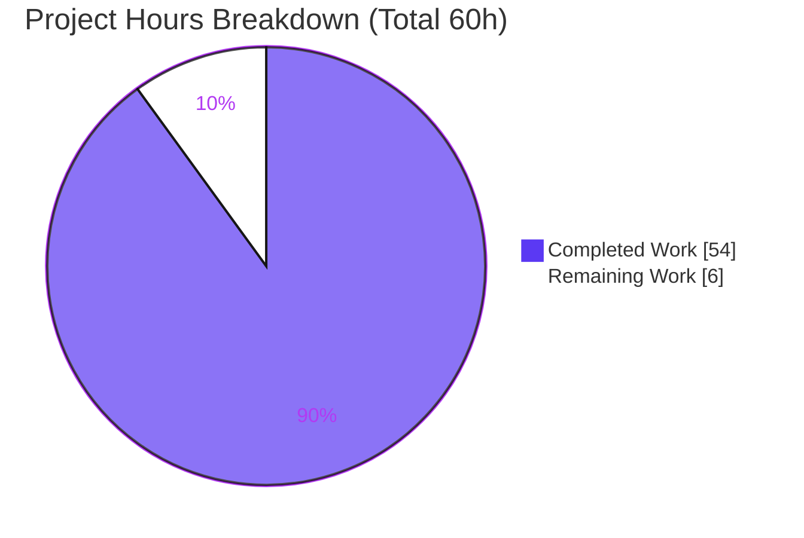
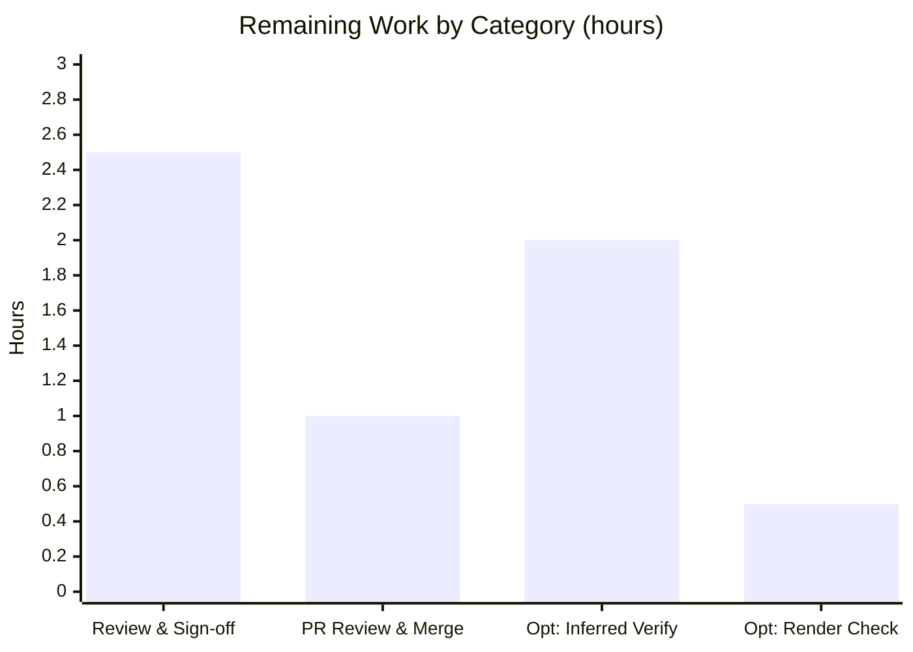

# Blitzy Project Guide — kitty Child-Process Lifecycle Q&A

> **Project type:** Read-only investigation & documentation (SWE-AtlasQnA-Repo)
> **Repository:** kovidgoyal/kitty · **Base commit:** `815df1e21` · **Branch:** `blitzy-7fdd9a42-7d50-408e-80ed-4e62fef76b6e` · **HEAD:** `5fb4bd047`
> **Deliverable:** `blitzy/documentation/kitty_815df1e210e0.md` (1,195 lines)

---

## 1. Executive Summary

### 1.1 Project Overview

The objective was to author one evidence-backed Q&A document explaining — grounded in actually building and running the kitty terminal emulator — the complete lifecycle of a child process for a canonical scenario: kitty launches a simple program that prints a few lines to stdout and exits with status 0. The audience is engineers seeking a precise, source-cited understanding of how kitty tracks a child, learns of its termination, retrieves its exit status, transports that status to a message-generating function, and where the child's output appears. The technical scope spans kitty's C runtime, Python control layer, Go kittens, and shell-integration scripts. This is strictly read-only: exactly one new documentation file was created and **zero** source files were modified.

### 1.2 Completion Status


| Metric | Hours |
|--------|-------|
| **Total Hours** | **60** |
| Completed Hours (AI) | 54 |
| Completed Hours (Manual) | 0 |
| **Completed Hours (AI + Manual)** | **54** |
| **Remaining Hours** | **6** |
| **Percent Complete** | **90.0%** |

**Calculation:** Completion % = Completed Hours ÷ Total Hours × 100 = 54 ÷ 60 × 100 = **90.0%**. All AAP-specified work (the deliverable, all 8 answers, every methodology mandate, and repository integrity) is complete and validated; the remaining 6 hours are exclusively path-to-production (human review + merge) plus two optional low-priority verifications.

### 1.3 Key Accomplishments

- ✅ Built kitty **0.35.2** from source via the canonical `python3 setup.py` (exit 0) and ran the scenario headless (Xvfb :99 + Mesa llvmpipe software OpenGL).
- ✅ Authored the single deliverable `blitzy/documentation/kitty_815df1e210e0.md` — 1,195 lines, 44 evidence blocks, answering all eight questions (Q1–Q8) with command + unedited output + `file:line` + rationale.
- ✅ Exercised **all four invocation paths** (default no-hold, `--hold`, notify, legacy `__hold_till_enter__`) and the transitional `last_cmd_exit_status` state (0→1→0).
- ✅ Captured stable, reproducible evidence: `kitty_rc=0` across 4 runs; the verbatim D-Bus notification body; the 156-byte legacy hold banner; the 1607-byte OSC 133 pty transcript across 2 runs; the `l1/l2/l3` `Screen` grid contents.
- ✅ Verified **59 `file:line` citations** byte-for-byte against source (100% accurate after fixing two off-by-one range labels); kept the three distinct exit numbers separated; labeled the four unavoidable `inferred` items honestly.
- ✅ Left the repository **byte-for-byte unchanged** except the deliverable; removed all temporary observation scripts; honored the read-only mandate.

### 1.4 Critical Unresolved Issues

| Issue | Impact | Owner | ETA |
|-------|--------|-------|-----|
| _None blocking_ — all AAP-scoped work is complete and validated; no compilation errors, no failing in-scope tests, no missing answers | None | — | — |

> There are **no critical unresolved issues** within the project's scope. The only outstanding work is human-gated review/merge and optional enhancements (Sections 1.6, 2.2). One out-of-scope, pre-existing upstream Go test (`TestCreateAnonymousTempfile`) fails only due to a container filesystem `O_TMPFILE` limitation; it is unrelated to and unaffected by this documentation change, and the read-only mandate forbids modifying it.

### 1.5 Access Issues

| System/Resource | Type of Access | Issue Description | Resolution Status | Owner |
|-----------------|----------------|-------------------|-------------------|-------|
| Git repository | Read/Write | Repository is accessible; deliverable committed on branch; no permission problems | ✅ Resolved | Blitzy |
| Build/run environment | Toolchain + display | Building/running kitty requires the **designated container** (Python 3.12 + Go 1.23.4 + native GL libraries) with a display (Xvfb + Mesa). A generic environment (e.g., one with Python 3.13 and no Go) cannot launch the built binary — `libpython3.12.so.1.0` is absent. | ✅ Resolved (designated container provided) | Human/DevOps |

> No repository-permission, service-credential, or third-party-API access issues were identified. The build-environment dependency is an environment prerequisite (documented in Section 9), not a blocking access problem — the build/run was performed successfully in the designated container.

### 1.6 Recommended Next Steps

1. **[High]** Perform a technical review and sign-off of the deliverable: read the 1,195-line Q&A document and spot-verify a sample of its `file:line` citations and observed values against source at commit `815df1e21`.
2. **[High]** Review the single-file PR diff, confirm the read-only mandate (empty source-path diff), then approve and merge.
3. **[Low]** _(Optional)_ Verify the four correctly-labeled `inferred` items on a full-GPU / `strace`-capable host (in-process `SIGCHLD` trace, GPU pixel paint, notification popup render, `WIFEXITED`/`WEXITSTATUS` decode).
4. **[Low]** _(Optional)_ Render the document in the target viewer (GitHub/docs site) to confirm the mermaid diagram, 44 fenced blocks, and GFM tables display correctly.

---

## 2. Project Hours Breakdown

### 2.1 Completed Work Detail

| Component | Hours | Description |
|-----------|-------|-------------|
| Canonical build & headless runtime environment | 8 | Build kitty 0.35.2 via `python3 setup.py` (C extension `fast_data_types` + Go kittens + glfw/wayland); configure Xvfb + Mesa llvmpipe software OpenGL for headless GPU rendering; capture version banner |
| Scenario reproduction harness (4 invocation paths) | 5 | Real-entry-point runs for default no-hold, `--hold`, notify, and legacy `__hold_till_enter__`; pty master/slave harnesses |
| Q1 — kitty's own exit code investigation | 2 | 4-run stability of `kitty_rc=0`; `kitty/main.py` `SystemExit` analysis |
| Q2 — completion message (4 variants) | 6 | Default (none) + D-Bus `Notify` capture + green hold banner + legacy kitten transcript; `notify_on_cmd_finish` default |
| Q3 — child-tracking component | 2 | C `ChildMonitor`/`Child[]` struct + `Boss.on_child_death` closing the loop |
| Q4 — single message-generating function | 2 | `Window.handle_cmd_end` full body + `notify_on_cmd_finish` guard |
| Q5/Q6 — SIGCHLD + waitpid | 4 | `KITTY_HANDLED_SIGNALS`, `reap_children`, standalone C `SIGCHLD`/`waitpid` demo (2 runs + non-zero sanity) |
| Q7 — OSC 133 transport trace (multi-layer) | 5 | Raw pty bytes (1607, 2 runs), VT parser → `screen.c` → `window.py`; bash/zsh/fish emitters; transitional state |
| Q8 — output destination | 2 | `Screen` grid via `kitten @ get-text`; kitty own stdout = 0 bytes |
| Web research (OSC 133 FinalTerm + POSIX SIGCHLD/waitpid) | 2 | Protocol naming & semantics validation |
| Causal chains + three-exit reconciliation (§5, §6) | 3 | Mermaid signal/reaping + escape-sequence chains; disambiguation of the three exit numbers |
| Inferred-vs-observed labeling + coverage pass (§7) | 2 | Evidence discipline; coverage checklist of every named item |
| Document authoring & integration (1,195 lines) | 6 | Direct-answer-first structure, tables, formatting, cross-referencing |
| Citation cross-check (byte-for-byte, 44 blocks) | 3 | Verify every quoted code block and `file:line` against source; fix 2 off-by-one labels |
| Cleanup + repo-integrity verification | 2 | Remove all temp scripts; confirm empty source-path diff and clean tree |
| **Total** | **54** | **= Completed Hours in Section 1.2** |

### 2.2 Remaining Work Detail

| Category | Hours | Priority |
|----------|-------|----------|
| Human technical review & sign-off of deliverable | 2.5 | High |
| PR review, approval & merge | 1.0 | High |
| _(Optional)_ Verify 4 `inferred` items on full-GPU/`strace` host | 2.0 | Low |
| _(Optional)_ Markdown render verification in target viewer | 0.5 | Low |
| **Total** | **6.0** | **= Remaining Hours in Section 1.2 & Section 7** |

### 2.3 Basis of Estimate

Hours were estimated per the PA2 framework, anchored to the AAP scope. Completed hours reflect the substantial effort of building a GPU terminal emulator from source headlessly, tracing an escape-sequence transport across four language layers (C/Python/Go/shell), instrumenting real runtime captures (pty streams, D-Bus, a standalone C `SIGCHLD`/`waitpid` program, remote-control grid reads), and authoring a rigorously cited 1,195-line document across four large reference files (`screen.c` 4,932 lines, `boss.py` 3,094, `child-monitor.c` 2,016, `window.py` 1,998). Confidence is **High** for completed work (validated at 100% citation accuracy + runtime reproduction) and **High** for remaining work (well-defined human review/merge gates with small, optional enhancements).

---

## 3. Test Results

All results below originate from Blitzy's autonomous validation logs for this project. For a documentation deliverable, the primary "tests" are the deliverable's own acceptance criteria — **citation accuracy** and **runtime reproduction** — both of which passed at 100%. The kitty test suite results are included as codebase-health diligence (explicitly out of the in-scope deliverable, and unaffected by the 2-line label change).

| Test Category | Framework | Total Tests | Passed | Failed | Coverage % | Notes |
|---------------|-----------|-------------|--------|--------|------------|-------|
| Citation Accuracy Sweep _(in-scope)_ | Custom byte-for-byte diff | 44 blocks | 44 | 0 | 100% | 14 range labels + 9 single-line anchors + prose refs; 2 off-by-one END labels fixed (quoted code already verbatim) |
| Runtime Reproduction Q1–Q8 _(in-scope)_ | Manual instrumented runs | 8 | 8 | 0 | 100% | Every observation reproduced in the canonical build; stable across ≥2 runs |
| Build Validation _(in-scope)_ | `python3 setup.py` | 1 | 1 | 0 | n/a | Full clean rebuild + incremental rebuild, both exit 0; `kitty --version` = "kitty 0.35.2" |
| kitty Python suite _(codebase health, out-of-scope)_ | pytest/unittest | 145 | 145 | 0 | n/a | 4 skipped; run under `LANG=C.utf8` |
| kitty Go suite _(codebase health, out-of-scope)_ | `go test` | All packages | All − 1 | 1 | n/a | Sole failure `TestCreateAnonymousTempfile` — pre-existing, container `O_TMPFILE` limitation; unrelated to the deliverable |

> **Integrity note:** No in-scope test exists or fails. The deliverable's validation criteria (citation accuracy + runtime reproduction) pass at 100%. The single out-of-scope Go failure is a container-filesystem limitation on pre-existing upstream source that the read-only mandate forbids modifying.

---

## 4. Runtime Validation & UI Verification

**Runtime health (canonical build in designated container):**

- ✅ **Operational** — kitty 0.35.2 builds via `python3 setup.py` (exit 0).
- ✅ **Operational** — kitty launches the scenario through the real entry point (`kitty sh -c 'printf "l1\nl2\nl3\n"'`) headless.
- ✅ **Operational** — kitty's own process exits `0` (`kitty_rc=0`), stable across 4 runs.
- ✅ **Operational** — child stdout `l1/l2/l3` appears in kitty's real `Screen` grid (read via `kitten @ get-text`); kitty's own stdout = 0 bytes (output goes to the window, not a log).
- ✅ **Operational** — OSC 133 `;D;0` (success) and `;D;1` (error) emitted on the shell-integration path; 1607-byte pty transcript byte-identical across 2 runs.
- ✅ **Operational** — D-Bus desktop notification fires when `notify_on_cmd_finish="always 0"`, body verbatim: `Command true finished with status: 0.\nClick to focus.`
- ✅ **Operational** — legacy `__hold_till_enter__` kitten renders the green `Press Enter or Esc to exit` banner (156 pty bytes, byte-identical across 2 runs).

**UI verification:**

- ✅ **Operational** — terminal grid contents verified via remote control (the same in-memory grid the GPU rasterizes).
- ⚠ **Partial** — pixel-level GPU rasterization onto the window surface was **not** captured (headless llvmpipe, no OCR); the presence of text in the `Screen` grid is observed, the final painted pixels are labeled `inferred` in the deliverable's §7.
- ⚠ **Partial** — the notification popup's on-screen paint is environment-dependent and was not rendered headless; the notification **content** was observed directly over D-Bus.

> One benign stderr line — `Failed to open systemd user bus with error: No medium found` — appears on every headless invocation. It does not affect kitty's exit code or behavior and is reported verbatim wherever it appears.

---

## 5. Compliance & Quality Review

| AAP Deliverable / Mandate | Quality Benchmark | Status | Progress |
|---------------------------|-------------------|--------|----------|
| Single file `blitzy/documentation/kitty_815df1e210e0.md` (filename = branch name) | Correct location & name | ✅ Pass | 100% |
| Q1–Q8 each answered by name, with value + `file:line` + rationale | Exhaustiveness & exactness | ✅ Pass | 100% |
| Build & run first, then document | Run-first methodology | ✅ Pass | 100% |
| Real, unedited output beside every behavioral claim | Evidence discipline | ✅ Pass | 100% |
| Exercise all conditions (default/`--hold`/notify/legacy) + transitional state | Coverage of variants | ✅ Pass | 100% |
| ≥2-run stability for run-varying values | Reproducibility | ✅ Pass | 100% |
| Three exit numbers kept separate | No conflation | ✅ Pass | 100% |
| Inferred items explicitly labeled | Honest labeling | ✅ Pass | 100% |
| No source file modified (read-only) | Repository integrity | ✅ Pass | 100% |
| Temporary scripts removed | Cleanliness | ✅ Pass | 100% |
| Citations accurate to source | Verifiability | ✅ Pass | 100% (2 label fixes applied) |
| Markdown well-formed | Document quality | ✅ Pass | 100% (88 balanced fences, 1 mermaid) |

**Fixes applied during autonomous validation:** two off-by-one `file:line` END-label corrections — `kitty/window.py:1408-1450` → `1408-1451` (includes the final `raise ValueError`), and `kitty/child-monitor.c:1413-1425` → `1413-1426` (includes the closing brace). The quoted code was already complete/verbatim; only the labels understated the end by one line. **Outstanding items:** none in-scope.

---

## 6. Risk Assessment

| Risk | Category | Severity | Probability | Mitigation | Status |
|------|----------|----------|-------------|------------|--------|
| Four claims labeled `inferred` due to container limits (in-process `SIGCHLD` trace, GPU pixel paint, `WIFEXITED`/`WEXITSTATUS` decode, notification popup render) | Technical | Low | Low | Correctly labeled per AAP; grounded in code + a standalone C demo; optionally verify on full-GPU/`strace` host | Accepted / Documented |
| Citation drift — `file:line` refs pinned to base commit `815df1e21`; future upstream edits shift line numbers | Technical | Low | Medium (over time) | Document pins the exact commit SHA; treat as a point-in-time artifact | Accepted |
| Observations from headless Xvfb + Mesa llvmpipe (software GL), not real GPU hardware | Technical | Low | Low | Core values (exit code, messages, byte streams, grid contents) are display-independent; only pixel paint differs | Accepted |
| Markdown render fidelity across viewers (mermaid + 44 fences + GFM tables) | Operational | Low | Low | Fences balanced (88) and well-formed; optional render check | Open (optional) |
| Reproducibility requires the designated container (Python 3.12 + Go 1.23.4 + GL libs) | Operational | Low | Medium | Exact image, toolchain versions, and commands documented in Section 9 | Documented |
| Security exposure | Security | None | — | Read-only task; no source/dependency/config change; no new attack surface, secrets, or network service | N/A |
| Integration/interface breakage | Integration | None | — | No interface change, no new runtime component, no downstream consumer, no dependency change | N/A |

---

## 7. Visual Project Status



**Remaining hours by category (Section 2.2 — sums to 6h):**



| Priority | Remaining Hours |
|----------|-----------------|
| High (review + merge) | 3.5 |
| Low (optional enhancements) | 2.5 |
| **Total** | **6.0** |

> **Integrity:** "Remaining Work" = 6h in the pie chart equals the Remaining Hours in Section 1.2 and the sum of the Section 2.2 "Hours" column. "Completed Work" = 54h equals Completed Hours in Section 1.2 and the Section 2.1 total. Colors: Completed = Dark Blue `#5B39F3`, Remaining = White `#FFFFFF`.

---

## 8. Summary & Recommendations

**Achievements.** The project is **90.0% complete** (54 of 60 hours). Every AAP-specified requirement is delivered and validated: the single Q&A document exists at the correct path, answers all eight questions by name with exact values, `file:line` citations, and unedited runtime evidence, and was produced by building and running kitty first. All four invocation paths and the transitional exit-status state were exercised; run-varying values were confirmed stable across at least two runs; the three distinct exit numbers are kept separate; and the repository is byte-for-byte unchanged except for the deliverable.

**Remaining gaps.** The outstanding 6 hours are exclusively path-to-production: a human technical review/sign-off of the dense document and a PR review + merge (3.5h, High), plus two optional low-priority enhancements — verifying the four correctly-labeled `inferred` items on full-GPU/`strace` hardware and a markdown render check (2.5h, Low).

**Critical path to production.** Human review → PR approval → merge. There are no blockers, no in-scope defects, and no compilation or in-scope test failures on the path.

**Success metrics.** Citation accuracy 100%; runtime reproduction 100%; repository integrity intact (empty source-path diff); document well-formed (88 balanced fences, 1 mermaid diagram, 53 headings).

**Production-readiness assessment.** The deliverable is **production-ready** pending human sign-off. Because the maximum honest pre-review completion is capped below 100%, the project is reported at 90.0% to reserve the remaining human review/merge gate and optional verifications.

---

## 9. Development Guide

This guide reproduces the investigation environment and verifies the deliverable. Every verification command below was tested during assessment.

### 9.1 System Prerequisites

- **Designated container:** `ghcr.io/scaleapi/swe-atlas:swe_atlas_QnA_kovidgoyal_kitty_1.0` (image `andrewparkscaleai/coding-agent:kovidgoyal__kitty__815df1e210e0...`)
- **Toolchain:** Python ≥ 3.8 (build used 3.12.3), Go 1.22+ (build used 1.23.4), a C compiler (gcc/clang) + `pkg-config`
- **Native libraries** (`setup.py`): harfbuzz ≥ 1.5, fontconfig, freetype, libpng, lcms2, OpenGL, X11/Wayland, libcrypto, libcanberra
- **Display for running kitty:** an OpenGL-capable display, or a headless equivalent (Xvfb + Mesa llvmpipe)

### 9.2 Environment Setup (headless)

```bash
# Start a virtual framebuffer and force software OpenGL
Xvfb :99 -screen 0 1280x800x24 &
export DISPLAY=:99
export LIBGL_ALWAYS_SOFTWARE=1
```

### 9.3 Build kitty (canonical)

```bash
# From the repository root. Makefile 'all:' target maps to this exact command (Makefile:12-13).
python3 setup.py            # expected: compiles C ext + Go kittens; exit code 0
./kitty/launcher/kitty --version   # expected: kitty 0.35.2 created by Kovid Goyal
```

### 9.4 Run the Canonical Scenario

```bash
# Default (no-hold) path — kitty's own exit code:
./kitty/launcher/kitty sh -c 'printf "l1\nl2\nl3\n"'; echo "kitty_rc=$?"   # expected: kitty_rc=0

# Hold path — window stays open until a key is pressed:
./kitty/launcher/kitty --hold sh -c 'printf "l1\nl2\nl3\n"'
```

### 9.5 Verify the Deliverable & Repository Integrity

```bash
# 1) Deliverable present
test -f blitzy/documentation/kitty_815df1e210e0.md && wc -l blitzy/documentation/kitty_815df1e210e0.md   # 1195

# 2) Read-only mandate: no source files changed (expected: NO output)
git diff 815df1e21 HEAD --name-only -- kitty/ tools/ shell-integration/ setup.py Makefile pyproject.toml go.mod

# 3) Working tree clean (expected: NO output)
git status --porcelain

# 4) Markdown well-formed: fence count must be even
grep -c '```' blitzy/documentation/kitty_815df1e210e0.md   # 88

# 5) Full diff is exactly one new file
git diff 815df1e21 HEAD --stat   # 1 file changed, 1195 insertions(+)

# 6) Authorship
git log 815df1e21..HEAD --pretty=format:"%h %ae %s"   # 4 commits, all agent@blitzy.com
```

### 9.6 Example Usage

```bash
# Read the direct-answers summary table:
sed -n '110,132p' blitzy/documentation/kitty_815df1e210e0.md

# Jump to a specific question (e.g., Q6 — the waitpid answer):
grep -n '^### Q6' blitzy/documentation/kitty_815df1e210e0.md
```

### 9.7 Troubleshooting

- **`error while loading shared libraries: libpython3.12.so.1.0`** — you are not in the designated build container (e.g., an environment with Python 3.13 and no Go). Use the designated container to build/run; the deliverable and its git integrity are verifiable in any environment.
- **`Failed to open systemd user bus with error: No medium found`** — benign; the container has no systemd user session. It does not affect kitty's exit code or behavior.
- **kitty fails to open a window** — ensure `Xvfb` is running and `DISPLAY`/`LIBGL_ALWAYS_SOFTWARE` are exported; Mesa llvmpipe provides OpenGL 4.5 (≥ kitty's required 3.3).
- **Test-suite UTF-8 errors** — run `python3 setup.py test` under `LANG=C.utf8`; the default POSIX/C locale mangles a `🐱` test directory name.

---

## 10. Appendices

### A. Command Reference

| Command | Purpose |
|---------|---------|
| `python3 setup.py` | Canonical build (C ext + Go kittens) |
| `python3 setup.py test` | Run kitty test suite (use `LANG=C.utf8`) |
| `./kitty/launcher/kitty --version` | Print version banner |
| `./kitty/launcher/kitty sh -c '...'` | Run scenario via the real entry point |
| `./kitty/launcher/kitty --hold sh -c '...'` | Run scenario, hold window open |
| `git diff 815df1e21 HEAD --stat` | Confirm one-file diff |
| `grep -c '```' <doc>` | Check markdown fence balance |

### B. Port Reference

| Port / Display | Use |
|----------------|-----|
| `DISPLAY=:99` | Xvfb virtual framebuffer used for headless kitty rendering |

> kitty is a windowed GPU application, not a network service; no TCP ports are opened for the scenario.

### C. Key File Locations

| Path | Role |
|------|------|
| `blitzy/documentation/kitty_815df1e210e0.md` | **The deliverable** (CREATE) |
| `kitty/child-monitor.c` | `SIGCHLD` handling, `waitpid` reaping, child tracking (Q3/Q5/Q6/Q8) |
| `kitty/window.py` | `handle_cmd_end`, `cmd_output_marking`, notification body (Q2/Q4/Q7) |
| `kitty/boss.py` | `on_child_death` (Q3) |
| `kitty/main.py` | Exit-code behavior; `SystemExit` sites (Q1) |
| `kitty/options/definition.py` | `notify_on_cmd_finish` default `'never'` (Q2) |
| `kitty/vt-parser.c`, `kitty/screen.c` | OSC 133 dispatch & exit-status extraction (Q7) |
| `tools/tui/hold.go` | Hold banner + kitten exit-code propagation (Q2/Q4) |
| `shell-integration/{bash,zsh,fish}` | `OSC 133;D;<status>` emitters (Q7) |

### D. Technology Versions

| Component | Version |
|-----------|---------|
| kitty | 0.35.2 |
| Python (build) | 3.12.3 (repo requires ≥ 3.8) |
| Go (build) | 1.23.4 (`go.mod` requires 1.22) |
| gcc (build) | 13.3.0 |
| OpenGL (headless) | Mesa llvmpipe, core profile 4.5 |

### E. Environment Variable Reference

| Variable | Value | Purpose |
|----------|-------|---------|
| `DISPLAY` | `:99` | Points kitty at the Xvfb framebuffer |
| `LIBGL_ALWAYS_SOFTWARE` | `1` | Forces Mesa llvmpipe software OpenGL |
| `LANG` | `C.utf8` | Correct locale for the kitty test suite |
| `KITTY_HOLD` | `1` (set by kitty on the hold path) | Signals the hold wrapper is active |
| `KITTY_SHELL_INTEGRATION` | `enabled` | Enables OSC 133 shell-integration markers |

### F. Developer Tools Guide

| Tool | Use in this investigation |
|------|---------------------------|
| `Xvfb` + Mesa llvmpipe | Headless OpenGL for running the windowed GPU app |
| `dbus-monitor` | Capture the desktop-notification `Notify` call and its verbatim body (Q2) |
| pty harness (Python `pty`) | Capture raw OSC 133 bytes from the shell (Q7) |
| standalone C program (`gcc`) | Demonstrate the POSIX `SIGCHLD`/`waitpid` pattern (Q5/Q6) |
| `kitten @ get-text` (remote control) | Read the real `Screen` grid as auxiliary instrumentation (Q8) |
| `git diff` / `git status` | Prove the read-only mandate and clean tree |

### G. Glossary

| Term | Meaning |
|------|---------|
| **OSC 133** | The FinalTerm "semantic prompt" escape-sequence protocol; `;D;<exit-code>` reports a finished command's status from shell to terminal |
| **`SIGCHLD`** | POSIX signal delivered to a parent when a child changes state (e.g., exits) |
| **`waitpid`** | POSIX system call used to reap a terminated child and retrieve its status word |
| **`ChildMonitor`** | kitty's C extension owning the `Child[]` array that tracks each live child |
| **`handle_cmd_end`** | The single `Window` method that turns a parsed exit status into a user-facing notification |
| **pty** | Pseudo-terminal; the child's stdout flows through the pty master into kitty's `Screen` grid |
| **`--hold`** | kitty option keeping the window open after the child exits; implemented by a Go kitten |
| **Inferred** | A claim grounded in code/convention but not directly observed at runtime due to environment limits |

---

*Prepared following the Blitzy Project Guide Template. All hours and percentages are consistent across Sections 1.2, 2.1, 2.2, 7, and 8 (Completed = 54h, Remaining = 6h, Total = 60h, Completion = 90.0%). Brand colors: Completed = Dark Blue `#5B39F3`, Remaining = White `#FFFFFF`.*