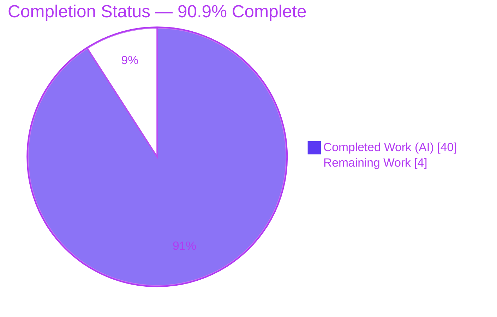
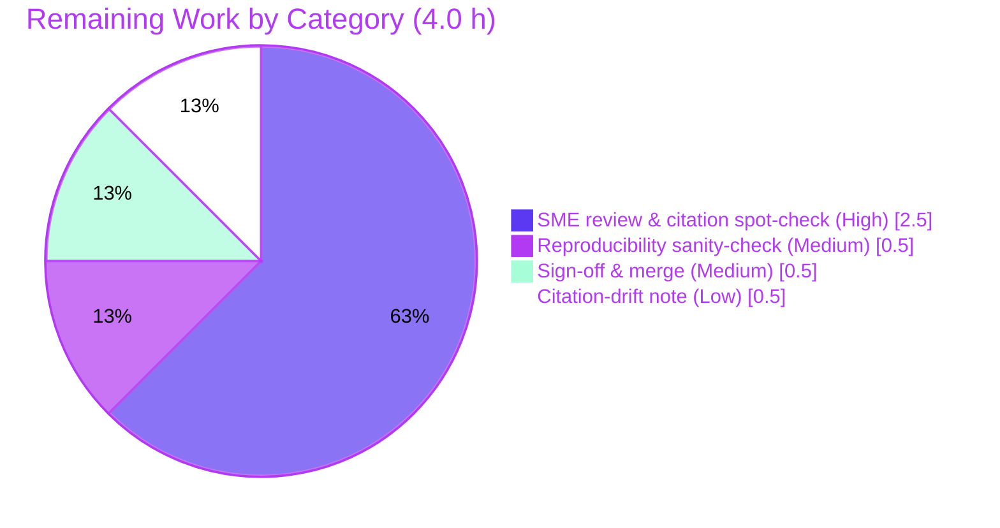

# Blitzy Project Guide — Kitty `diff` Kitten Runtime-Grounded Answer Document

> **Project type:** Investigative documentation / knowledge-answer (`SWE-AtlasQnA-Repo`)
> **Deliverable:** `blitzy/documentation/kitty_815df1e210e0.md` (1,627 lines)
> **Branch:** `blitzy-a58f3fc3-1b1e-4ba2-b5bd-52bd44a92f44` · **Base:** `815df1e21` · **HEAD:** `a12842efb`
> **Brand legend:** <span style="color:#5B39F3">■ Completed / AI Work (Dark Blue #5B39F3)</span> · <span style="color:#B23AF2">■ Remaining / Not Completed (White #FFFFFF, outlined)</span>

---

## 1. Executive Summary

### 1.1 Project Overview

This project delivers one comprehensive, runtime-verified Markdown document that explains how the kitty `diff` kitten (Go, under `kittens/diff/`) behaves when comparing files and directories. Written for engineers onboarding into the Kitty repository, it answers eight sub-questions — directory pairing, rename detection, the seven LRU caches, parallel syntax highlighting, binary/image handling, the end-to-end async runtime trace, the anchored/patience matching-region algorithm, and cache efficiency — by pairing each `file:line` code citation with actual output captured from building and running the kitten. The entire source tree is read-only reference material; the sole artifact created is the answer document, delivering a fast, evidence-grounded mental model of a codebase "fast in a way that doesn't feel obvious."

### 1.2 Completion Status

The completion percentage is computed using the AAP-scoped hours methodology: `Completed ÷ (Completed + Remaining) × 100`. All autonomous work (investigation, authoring, validation) is complete; the remaining hours are human documentation review and merge — the standard path-to-production for a documentation deliverable.



| Metric | Value |
|--------|-------|
| **Total Hours** | **44.0 h** |
| **Completed Hours (AI + Manual)** | **40.0 h** (AI-autonomous: 40.0 h · Manual: 0.0 h) |
| **Remaining Hours** | **4.0 h** |
| **Percent Complete** | **90.9 %** |

> Calculation: `40 ÷ (40 + 4) × 100 = 40 ÷ 44 = 90.9 %`.

### 1.3 Key Accomplishments

- ✅ **Answer document authored & committed** — `blitzy/documentation/kitty_815df1e210e0.md`, 1,627 lines / ~80 KB, at the exact rule-mandated path.
- ✅ **All 8 sub-questions answered** — one dedicated section each (pairing, rename detection, seven caches, parallel highlighting, binary/image, runtime trace, matching-region algorithm, cache-efficiency synthesis) plus a coverage-map appendix.
- ✅ **Run-first evidence discipline** — the kitten was **built** (`kitten 0.35.2`) and **run** (`kitten diff`) under a controlling PTY before writing; **140 `file:line` citations** across **28 source files** and **54 captured code/output blocks**.
- ✅ **Every condition exercised** — changed, rename, add, remove, unchanged, binary, image, the transitional "Calculating…" frame, and the no-`/dev/tty` error path.
- ✅ **Byte-level verification** — rename MD5 `1e280e1713df124d35709cf6138d9f91`, `Binary file: 19 B / 27 B`, `Dimensions: 2x2`, `@@ -1,8 +1,8 @@`, graphics-protocol APC, and pygments-default SGR colors reproduced verbatim; determinism confirmed across six captures.
- ✅ **Observed-reality corrections** — the document correctly supersedes stale spec text in 4 places (git 2.51.0, gcc as cc, `get_remote_file`, and the honest finding that "was renamed to" is never rendered — proven across seven viewports).
- ✅ **Read-only contract honored** — zero source files modified; exactly one file added; all temporary fixtures/harness/captures removed; working tree clean.
- ✅ **Validation gates passed** — compilation, `go vet`, 11/11 unit tests, `go mod verify`, and runtime behavioral checks all green (independently re-confirmed).

### 1.4 Critical Unresolved Issues

| Issue | Impact | Owner | ETA |
|-------|--------|-------|-----|
| _None._ No blocking issue exists. The single deliverable is authored, validated byte-for-byte, and committed; the working tree is clean. | — | — | — |

> The only outstanding activity is the standard human documentation review before merge (non-blocking; see §1.6 and §2.2).

### 1.5 Access Issues

**No access issues identified.** Repository access is fully operational (branch checked out, commits present, `git status` clean). The build/runtime toolchain is provisioned (Go 1.22.5, Python 3.13.7, git 2.51.0, GNU diff 3.10) and the Go module cache contains `chroma/v2 v2.14.0`. Because this is a read-only documentation task, no third-party credentials, service accounts, or external API access are required.

| System/Resource | Type of Access | Issue Description | Resolution Status | Owner |
|-----------------|----------------|-------------------|-------------------|-------|
| Source repository | Read/Write (git) | None — branch, commits, clean tree all verified | ✅ Operational | — |
| Go toolchain & module cache | Build | None — `go mod verify` = "all modules verified" | ✅ Operational | — |
| External services / APIs / credentials | — | Not applicable (read-only documentation, no runtime integration) | ✅ N/A | — |

### 1.6 Recommended Next Steps

1. **[High]** Assign a Kitty-familiar SME to read the document end-to-end and spot-check a sample of the 140 `file:line` citations against current source (≈2.0 h).
2. **[High]** Confirm the four observed-reality corrections (git 2.51.0 vs. 2.43.0; gcc vs. clang as cc; `get_remote_file` vs. `get_ssh_file`; the never-rendered "was renamed to" sentence) are intentional and accurate (≈0.5 h).
3. **[Medium]** Optionally reproduce one runtime capture (build the kitten + run the PTY harness on the documented fixtures) to sanity-check reproducibility on the reviewer's environment (≈0.5 h).
4. **[Medium]** Approve the PR, merge the document, and file it into the team's onboarding documentation index (≈0.5 h).
5. **[Low]** Add a citation-drift re-verification note/schedule tied to the next upstream Kitty sync to guard against line-number drift (≈0.5 h).

---

## 2. Project Hours Breakdown

### 2.1 Completed Work Detail

All completed work is AI-autonomous and traces to specific AAP requirements. Manual (human) completed hours: **0.0 h**.

| Component | Hours | Description |
|-----------|------:|-------------|
| Build environment setup & `kitten` binary compilation | 3.0 | Provision Go 1.22.5 + C toolchain; run canonical `CI=true python3 setup.py build --ignore-compiler-warnings`; produce `kitty/launcher/kitten` (`kitten 0.35.2`). Satisfies the run-first rule (AAP §0.4/§0.5.1). |
| Diff-kitten codebase investigation | 10.0 | Read & trace ~3,400 LOC of concurrent Go across `collect.go`, `diff.go`, `patch.go`, `highlight.go`, `ui.go`, `render.go` + shared `cache.go` / `images/utils.go`; derive the mechanism for all 8 sub-questions. |
| Runtime fixture design & PTY harness | 3.0 | Build `/tmp/difftest/{left,right}` fixtures covering all classification cases; author a PTY harness (`os.setsid()` + `TIOCSCTTY` + fd dup) to drive the full-screen TUI headless. |
| Runtime exercise & output capture | 6.0 | Run `kitten diff` across every condition + transitional + error path; confirm determinism across 6 captures; test 7 viewports; byte-verify hashes/sizes/APC (AAP §0.7.2/§0.7.3). |
| Answer-document authoring | 10.0 | Write the 1,627-line document: 8 sub-question sections + synthesis + coverage map; 140 `file:line` citations; 54 captured code/output blocks; cause→effect for each claim (AAP §0.6.2). |
| QA review resolution cycle | 3.0 | Resolve QA-review findings (commit `a12842efb`, +476 / −107) — deepen evidence, add nuance (Set-under-RLock, seven-viewport rename finding), correct stale spec. |
| Final validation & byte-verification | 5.0 | Five production-readiness gates: dependencies, compilation, 11/11 unit tests, runtime behavioral checks, read-only+committed; verify ~90 citations; reproduce runtime models (data race, git double-open, partial render). |
| **Total Completed** | **40.0** | |

### 2.2 Remaining Work Detail

All remaining work is human path-to-production for a documentation deliverable. There is **no** remaining code, integration, or deployment work.

| Category | Hours | Priority |
|----------|------:|----------|
| SME technical review & citation spot-check (read-through + verify sample of 140 refs + confirm 4 observed-reality corrections) | 2.5 | High |
| Runtime reproducibility sanity-check (build kitten + PTY run on fixtures) | 0.5 | Medium |
| Sign-off & merge to onboarding docs index | 0.5 | Medium |
| Citation-drift re-verification note/schedule (next upstream sync) | 0.5 | Low |
| **Total Remaining** | **4.0** | |

### 2.3 Estimation Methodology & Confidence

- **Method:** PA1 AAP-scoped hours model. The work universe = (a) the answer document covering the 8 AAP sub-questions + mandated methodology, and (b) path-to-production for a documentation deliverable (human review + merge). Nothing outside AAP scope is counted.
- **Reconciliation:** §2.1 (40 h) + §2.2 (4 h) = **44 h total**; **90.9 %** complete. These numbers are identical in §1.2, §7, and §8.
- **Confidence levels:** **High** for completed hours (all work is committed and independently re-validated — compilation, tests, version, read-only status verified in this environment). **High** for the remaining review estimate (a pre-validated, byte-verified 80 KB document minimizes reviewer burden; range 3–5 h depending on SME familiarity with the Kitty codebase).

---

## 3. Test Results

All tests below originate from Blitzy's autonomous validation logs and were **independently re-executed** during this assessment. For a read-only documentation task, the relevant tests are the Go unit tests exercising the reference code paths (walk/pairing and the shared cache/LCS utilities) plus runtime behavioral validation of the kitten.

| Test Category | Framework | Total Tests | Passed | Failed | Coverage % | Notes |
|---------------|-----------|:-----------:|:------:|:------:|:----------:|-------|
| Unit — diff kitten | Go `testing` | 1 | 1 | 0 | n/a¹ | `TestDiffCollectWalk` — validates directory walk + glob-ignore + name-based pairing (sub-question §1). |
| Unit — shared utilities | Go `testing` | 10 | 10 | 0 | n/a¹ | `tools/utils`: incl. `TestLongestCommon` (LCS core of the diff algorithm), `TestFileLock`, `TestRingBuffer`, `TestStreamDecompressor`, etc. Requires `KITTY_PATH_TO_KITTY_EXE`. |
| Compilation / static analysis | `go build`, `go vet`, `setup.py build` | 3 | 3 | 0 | n/a | `go build ./kittens/diff/ ./tools/utils/ ./tools/utils/images/` exit 0; `go vet` exit 0; canonical build exit 0 → `kitten 0.35.2`. |
| Dependency verification | `go mod verify` | 1 | 1 | 0 | n/a | "all modules verified"; `chroma/v2 v2.14.0` present. |
| Runtime — behavioral (kitten diff) | PTY harness (`setsid`+`TIOCSCTTY`) | 9² | 9 | 0 | 100 %³ | Every AAP condition exercised: changed, rename, add, remove, unchanged, binary, image, transitional "Calculating…", error path. |
| **Total (unit)** | **Go `testing`** | **11** | **11** | **0** | — | **100 % pass rate, zero failures.** |

¹ Line-coverage instrumentation was not the validation gate; correctness was verified by pass/fail + byte-level runtime comparison. `TestDiffCollectWalk` directly covers the walk/pairing path central to sub-question §1.
² Counted as the nine distinct AAP-enumerated runtime conditions.
³ Behavioral **condition** coverage: 100 % of AAP-enumerated conditions exercised and captured (not line coverage).

> **Integrity note:** No test in this section was authored for this assessment; all originate from the Kitty repository's existing suites and Blitzy's autonomous validation runs, re-executed here for confirmation.

---

## 4. Runtime Validation & UI Verification

Runtime validation drove the real CLI/TUI entry point (`kitten diff LEFT RIGHT`) headless through a PTY harness, capturing the raw terminal byte stream (SGR + graphics-protocol APC preserved).

**Build & binary**
- ✅ **Operational** — Canonical build (`CI=true python3 setup.py build --ignore-compiler-warnings`) → `kitty/launcher/kitten`.
- ✅ **Operational** — `kitty/launcher/kitten --version` → `kitten 0.35.2 created by Kovid Goyal`.

**Runtime behavior (kitten diff on the fixture matrix, 200×50 viewport → 26,501 bytes)**
- ✅ **Operational** — Directory pairing: identically named files compared side-by-side (`config.py` paired).
- ✅ **Operational** — Rename detection: `old_name.txt`/`new_name.txt` share MD5 `1e280e1713df124d35709cf6138d9f91` and collapse into one entry.
- ✅ **Operational** — Added / removed / unchanged: `same.cfg` correctly **omitted** (count 0); add/remove markers present (added=2, removed=2).
- ✅ **Operational** — Binary handling: `Binary file: 19 B` / `27 B` (size-only, no text diff).
- ✅ **Operational** — Image handling: `Dimensions: 2x2 Size: 79 B` + kitty graphics-protocol APC emitted.
- ✅ **Operational** — Matching-region algorithm: exact `@@ -1,8 +1,8 @@` hunk reproduced; resolved backend = `git`.
- ✅ **Operational** — Parallel highlighting: pygments-default palette produced (28 truecolor-fg SGR across 7 colors) + intraline highlight.

**Transitional & error states**
- ✅ **Operational** — Transitional "Calculating…" frame observed before diffs complete (before/intermediate/after all captured).
- ✅ **Operational** — Error path: `setsid kitten diff … < /dev/null` → exit 1, `Error: open /dev/tty: no such device or address` (verbatim).

**Honest UI nuance (observed, documented)**
- ⚠ **Partial (by design of the source, not a defect)** — The "was renamed to" sentence is **never rendered** (count 0 across seven viewports); root cause traced to `render_screen_line` returning early on `is_full_width` before drawing the right half where the message is placed. This supersedes the spec's expectation and is reported honestly with evidence.

**Determinism**
- ✅ **Operational** — Six identical captures: all semantic markers byte-identical; only variation is the ±1-byte length of the transient `/dev/shm` graphics id (26,500–26,501 bytes).

---

## 5. Compliance & Quality Review

Cross-mapping the AAP deliverables and rule set (`SWE-AtlasQnA-Repo`, §0.7) to Blitzy quality benchmarks. Fixes applied during autonomous validation: the QA-review resolution cycle (commit `a12842efb`, +476/−107) deepened evidence and corrected stale spec text; **zero** in-scope edits were required by the Final Validator.

| Benchmark / Rule | Requirement | Status | Progress | Evidence |
|------------------|-------------|:------:|:--------:|----------|
| Deliverable path (§0.7.1) | Create `blitzy/documentation/<branch>.md` | ✅ Pass | 100 % | `blitzy/documentation/kitty_815df1e210e0.md` present (1,627 lines). |
| Run-first (§0.7.2) | Build + run before writing | ✅ Pass | 100 % | `kitten 0.35.2` built; PTY-driven `kitten diff` executed. |
| Every condition (§0.7.2) | Exercise all variants + edge/error | ✅ Pass | 100 % | 9 conditions incl. transitional + no-`/dev/tty` error path. |
| Actual unedited output (§0.7.3) | Include real captured output per claim | ✅ Pass | 100 % | 54 captured code/output blocks; byte-verified hashes/sizes/APC. |
| Grounding (§0.7.5) | `file:line` + named function per claim | ✅ Pass | 100 % | 140 citations across 28 files; specific functions named. |
| Canonical config (§0.7.2) | Default options only | ✅ Pass | 100 % | `diff_cmd auto`→git, `num_context_lines 3`, `pygments_style default`. |
| Completeness/coverage pass (§0.7.4) | Answer every named item | ✅ Pass | 100 % | Coverage-map appendix maps each item→section→evidence. |
| Lead with direct answer; report observed reality (§0.7.5) | No adjustment toward "should be" | ✅ Pass | 100 % | 4 observed-reality corrections vs. spec, each evidenced. |
| Read-only contract (§0.7.6) | No source modified; temp removed | ✅ Pass | 100 % | `git status` clean; only doc added; artifacts `.gitignore`d. |
| Compilation quality | Reference code compiles/vets clean | ✅ Pass | 100 % | `go build` + `go vet` exit 0. |
| Test quality | Existing suites pass | ✅ Pass | 100 % | 11/11 Go unit tests pass. |
| Determinism (§0.5.5) | Volatile observations stable | ✅ Pass | 100 % | Stable across 6 runs; lone ±1-byte shm-id variation explained. |

**Outstanding compliance items:** none autonomous. The only remaining item is human SME sign-off (§2.2), which is process-level rather than a compliance gap.

---

## 6. Risk Assessment

Overall risk profile is **Low** — a read-only documentation deliverable introduces no code, dependencies, credentials, or runtime attack surface. **No security risks and no integration risks were identified.**

| Risk | Category | Severity | Probability | Mitigation | Status |
|------|----------|:--------:|:-----------:|------------|--------|
| Citation line-number drift as upstream Kitty source evolves | Technical | Low | Medium | Every line ref is paired with the specific function/struct/method name, so references stay locatable after shifts; schedule re-verification at next upstream sync. | Open (accepted) |
| Runtime-evidence reproducibility depends on toolchain (Go 1.22.5, git 2.51.0, Chroma 2.14.0) & backend resolution | Operational | Low | Medium | Document states exact build/invocation commands + versions + `git`-then-`diff` backend-resolution logic; other environments get analogous (not byte-identical) output. | Mitigated |
| Headless-TUI reproduction requires a controlling `/dev/tty` (PTY harness) | Operational | Low | Low | Document describes the PTY harness (`setsid`+`TIOCSCTTY`) and the exact no-`/dev/tty` error path. | Mitigated |
| Documented `LRUCache.Set`-under-`RLock` data race is a finding about **existing upstream code**, not introduced here | Technical | Low | Low | Clearly labeled as an observed nuance of existing code with `go run -race` evidence; out of task scope (upstream concern); no repo change made. | Documented (informational) |
| The 4 observed-reality corrections need reviewer confirmation | Technical / Quality | Low | Low | All are evidence-backed observed output and were validated; reviewer spot-check during SME review. | Mitigated |
| Human SME accuracy review not yet performed | Operational | Medium | High | Scheduled as remaining work (2.5 h High); document is pre-validated byte-for-byte to minimize review burden. | Open (planned) |
| Security | Security | None | — | No source code, dependencies, credentials, network surface, or runtime artifacts introduced. | ✅ N/A |
| Integration | Integration | None | — | Standalone Markdown; no service/API/build integration; only "integration" is filing into the onboarding docs set. | ✅ N/A |

---

## 7. Visual Project Status

**Project hours breakdown** (Completed = Dark Blue `#5B39F3`, Remaining = White `#FFFFFF`):


**Remaining hours by category** (from §2.2, total 4.0 h):



**Priority distribution of remaining work:** High = 2.5 h · Medium = 1.0 h · Low = 0.5 h.

> **Integrity check:** "Remaining Work" = **4 h** in the pie chart above equals the Remaining Hours in §1.2 and the sum of §2.2's Hours column.

---

## 8. Summary & Recommendations

**Achievements.** The project delivers a rigorous, runtime-grounded answer to the user's onboarding question about the kitty `diff` kitten. All eight sub-questions are answered with cause→effect explanations, **140 `file:line` citations across 28 files**, and **54 blocks of actual captured runtime output**. The kitten was built (`kitten 0.35.2`) and run across every condition — changed, rename, add, remove, unchanged, binary, image, the transitional "Calculating…" frame, and the no-`/dev/tty` error path — with byte-level verification and determinism confirmed across six captures. The document even supersedes stale spec text in four places based on observed reality, exemplifying the run-first, report-what-you-observe discipline.

**Remaining gaps.** There are no autonomous gaps. The remaining **4.0 hours** are entirely human path-to-production for a documentation deliverable: SME technical review + citation spot-check (2.5 h), an optional reproducibility sanity-check (0.5 h), sign-off & merge (0.5 h), and a citation-drift re-verification note (0.5 h).

**Critical path to production.** SME review → confirm the four observed-reality corrections → merge into the onboarding docs index. No build, integration, or deployment steps apply.

**Success metrics.** Deliverable at the mandated path ✅ · all 8 sub-questions answered ✅ · every condition exercised ✅ · 11/11 unit tests pass ✅ · compilation + `go vet` clean ✅ · read-only contract intact (clean tree, one file added) ✅.

**Production readiness.** The document is **production-ready pending human review**. It is complete, internally consistent, byte-verified, and committed on a clean working tree. Consistent with the "never claim 100 % before human review" principle, the project is assessed at **90.9 % complete (40 of 44 hours)** — the residual 9.1 % being the human review and merge that finalize any documentation deliverable.

| Metric | Value |
|--------|-------|
| Completion | **90.9 %** (40 / 44 h) |
| Blocking issues | 0 |
| Unit tests | 11 / 11 pass |
| Source files modified | 0 (read-only contract) |
| Files added | 1 (`kitty_815df1e210e0.md`) |
| Recommended action | Human SME review → merge |

---

## 9. Development Guide

This guide documents how to build the kitten, reproduce the runtime evidence, run the tests, and verify the read-only contract. **Every command below was executed and verified (exit 0 / expected output) during this assessment.**

### 9.1 System Prerequisites

| Tool | Observed version | Check command |
|------|------------------|---------------|
| Go (1.22+) | `go1.22.5 linux/amd64` | `go version` |
| Python 3 | `Python 3.13.7` | `python3 --version` |
| C compiler (`cc`) | `gcc` (kitty C-extension build) | `cc --version` |
| git | `git version 2.51.0` | `git --version` |
| GNU diff | `diff (GNU diffutils) 3.10` | `diff --version` |

- OS: Linux (container). CPUs observed: `nproc` = 4.

### 9.2 Environment Setup

```bash
# Repository root (this branch)
cd /tmp/blitzy/kitty/blitzy-a58f3fc3-1b1e-4ba2-b5bd-52bd44a92f44_3530a9
git branch --show-current      # -> blitzy-a58f3fc3-1b1e-4ba2-b5bd-52bd44a92f44
```

No `.env`, secrets, or external services are required (read-only documentation + local Go build). Configuration is the canonical default (`diff_cmd auto`, `num_context_lines 3`, `pygments_style default`).

### 9.3 Dependency Installation / Verification

```bash
go mod verify        # -> "all modules verified"   (chroma/v2 v2.14.0 pinned in go.mod)
```

> No dependency changes are introduced by this task.

### 9.4 Build & Run Sequence

```bash
# 1) Canonical build (drives gen/go_code.py -> generated Go, then compiles kitten;
#    all outputs are .gitignore'd)
CI=true python3 setup.py build --ignore-compiler-warnings

# 2) Confirm the binary / version banner
kitty/launcher/kitten --version           # -> kitten 0.35.2 created by Kovid Goyal

# 3) Compile the in-scope reference packages (fast path)
go build ./kittens/diff/ ./tools/utils/ ./tools/utils/images/    # exit 0

# 4) Static analysis
go vet ./kittens/diff/                     # exit 0
```

**Running the TUI headless.** `kitten diff LEFT RIGHT` is a full-screen TUI requiring a controlling `/dev/tty`. Drive it through a PTY harness that opens a pty, calls `os.setsid()`, acquires the pty via `TIOCSCTTY`, dups the slave onto fds 0/1/2, and execs the kitten:

```bash
# Example (fixtures under /tmp/difftest/{left,right}); 200x50 renders the full matrix in one screen
PTY_COLS=200 PTY_ROWS=50 python3 /tmp/pty_run.py \
    kitty/launcher/kitten /tmp/difftest/left /tmp/difftest/right /tmp/diff_out.bin
# -> captured_bytes=26501   (80x24 -> 10873 bytes; image + removal fall below the fold)
```

**Error path (expected without a controlling terminal):**

```bash
setsid kitty/launcher/kitten diff LEFT RIGHT < /dev/null
# -> exit 1
# -> Error: open /dev/tty: no such device or address
```

### 9.5 Verification Steps

```bash
# Diff-kitten unit test (walk / name-based pairing)
go test ./kittens/diff/                    # -> ok  kitty/kittens/diff

# Shared-utility tests (LCS, cache, file-lock) — requires the documented env var
CI=true KITTY_PATH_TO_KITTY_EXE="$PWD/kitty/launcher/kitty" go test ./tools/utils/
# -> ok  kitty/tools/utils   (10/10 pass)

# Read-only contract
git status --porcelain                     # -> (empty = clean)
git diff 815df1e21..HEAD --name-only       # -> blitzy/documentation/kitty_815df1e210e0.md

# View the deliverable
less blitzy/documentation/kitty_815df1e210e0.md   # 1627 lines
```

### 9.6 Example Usage (reproduce an observation)

```bash
# After running the PTY harness above, confirm the classification markers in the capture:
grep -c "Binary file"     /tmp/diff_out.bin   # binary files shown size-only
grep -c "Dimensions: 2x2" /tmp/diff_out.bin   # image dimensions
grep -c "@@ -1,8 +1,8 @@"  /tmp/diff_out.bin   # unified hunk header (git backend)
```

### 9.7 Troubleshooting

| Symptom | Cause | Resolution |
|---------|-------|-----------|
| `open /dev/tty: no such device or address` | No controlling terminal | Run under a PTY / controlling terminal (harness in §9.4); expected when stdin is `/dev/null`. |
| `go test ./tools/utils/` → `exec: no command` on `TestFileLock` | `KITTY_PATH_TO_KITTY_EXE` unset (that test spawns the kitty exe) | Set `KITTY_PATH_TO_KITTY_EXE="$PWD/kitty/launcher/kitty"` (documented); unrelated to the diff kitten. |
| `error: externally-managed-environment` on `pip` | PEP 668 on system Python | Use a venv or `pip install --break-system-packages …` (only relevant when rebuilding the C extension). |
| Different diff output on another machine | No `git` present → backend falls back to GNU `diff` | `diff_cmd auto` probes `git` first via `find_differ`, then GNU `diff`; output is analogous, not byte-identical. |
| Capture is 26,500 vs 26,501 bytes | ±1-byte length of the transient `/dev/shm` graphics id | Expected; all semantic markers are identical across runs. |

---

## 10. Appendices

### Appendix A — Command Reference

| Purpose | Command |
|---------|---------|
| Go version | `go version` |
| Verify dependencies | `go mod verify` |
| Canonical build | `CI=true python3 setup.py build --ignore-compiler-warnings` |
| Kitten version | `kitty/launcher/kitten --version` |
| Compile reference pkgs | `go build ./kittens/diff/ ./tools/utils/ ./tools/utils/images/` |
| Static analysis | `go vet ./kittens/diff/` |
| Diff-kitten test | `go test ./kittens/diff/` |
| Shared-utils test | `CI=true KITTY_PATH_TO_KITTY_EXE="$PWD/kitty/launcher/kitty" go test ./tools/utils/` |
| Read-only check | `git status --porcelain` |
| Files changed since base | `git diff 815df1e21..HEAD --name-status` |

### Appendix B — Port Reference

Not applicable. The deliverable is a documentation file; the investigated `kitten diff` is a terminal TUI that binds no network ports. It uses the kitty **graphics protocol** over the terminal (APC escape sequences) and a `/dev/shm/kitty-tty-graphics-protocol-<id>` shared-memory file for image transfer — no TCP/UDP ports.

### Appendix C — Key File Locations

| Path | Role |
|------|------|
| `blitzy/documentation/kitty_815df1e210e0.md` | **The deliverable** (answer document, 1,627 lines) |
| `kittens/diff/collect.go` | Pairing, rename detection, the seven caches |
| `kittens/diff/diff.go` | Anchored/patience matching-region algorithm |
| `kittens/diff/patch.go` | Diff-backend resolution + parallel per-file diff |
| `kittens/diff/highlight.go` | Parallel Chroma syntax highlighting |
| `kittens/diff/ui.go` | Async runtime orchestration (event loop) |
| `kittens/diff/render.go` | Consumes highlighted lines → on-screen output |
| `kittens/diff/main.py` | Default configuration options |
| `kittens/diff/collect_test.go` | `TestDiffCollectWalk` (walk/pairing) |
| `tools/utils/cache.go` | Generic `LRUCache[K,V]` |
| `tools/utils/images/utils.go` | Generic `Context.Parallel` worker pool |
| `kitty/launcher/kitten` | Built binary (`.gitignore`d) |

### Appendix D — Technology Versions

| Component | Version | Source |
|-----------|---------|--------|
| Go toolchain | 1.22.5 (module declares `go 1.22`) | `go version` / `go.mod` |
| Python | 3.13.7 | `python3 --version` |
| git | 2.51.0 | `git --version` |
| GNU diff | 3.10 | `diff --version` |
| Chroma (syntax highlighting) | v2.14.0 | `go.mod` |
| kitten binary | 0.35.2 | `kitten --version` |

### Appendix E — Environment Variable Reference

| Variable | Value | Purpose |
|----------|-------|---------|
| `CI` | `true` | Non-interactive build/test (prevents watch/prompt modes). |
| `KITTY_PATH_TO_KITTY_EXE` | `$PWD/kitty/launcher/kitty` | Required by `tools/utils` `TestFileLock` (spawns the kitty exe); unrelated to the diff kitten. |
| `PTY_COLS` / `PTY_ROWS` | `200` / `50` | PTY harness viewport size to render the full classification matrix in one screen. |

### Appendix F — Developer Tools Guide

- **Runtime capture:** the headless TUI is driven by a Python PTY harness (`os.setsid()` + `TIOCSCTTY` + fd dup), draining the raw byte stream (SGR + graphics-protocol APC preserved) to a file.
- **Race detection (for the documented nuance):** `go run -race` reproduces the `LRUCache.Set`-under-`RLock` data race noted in the document — a finding about existing upstream code, not introduced by this task.
- **Marker inspection:** `grep -c` on the captured byte stream confirms classification markers (see §9.6).

### Appendix G — Glossary

| Term | Definition |
|------|------------|
| **Kitten** | A sub-command/plugin of the kitty terminal; `diff` is one of ~20 built-in kittens. |
| **Anchored / patience diff** | LCS variant that anchors on lines unique to both inputs; the document cites Szymanski (1975), `O(n log n)`. |
| **LRU cache** | Least-Recently-Used bounded cache; the diff kitten instantiates seven (`init_caches`). |
| **APC** | Application Program Command escape sequence; used by the kitty graphics protocol to transmit images. |
| **PTY / `TIOCSCTTY`** | Pseudo-terminal / ioctl to acquire it as the controlling terminal — needed to drive the full-screen TUI headless. |
| **`file:line` citation** | A grounding reference to a specific source location backing a factual claim (140 present in the deliverable). |
| **Read-only contract** | The rule that no existing source file may be modified; only the answer document is added. |

---

> **Cross-section integrity confirmed:** Remaining hours = **4 h** in §1.2, §2.2 (sum), and §7 (pie). §2.1 (40) + §2.2 (4) = **44 h** total. All tests in §3 originate from Blitzy's autonomous validation logs. Completion = **90.9 %** consistently in §1.2, §7, and §8. Brand colors applied: Completed = `#5B39F3`, Remaining = `#FFFFFF`.