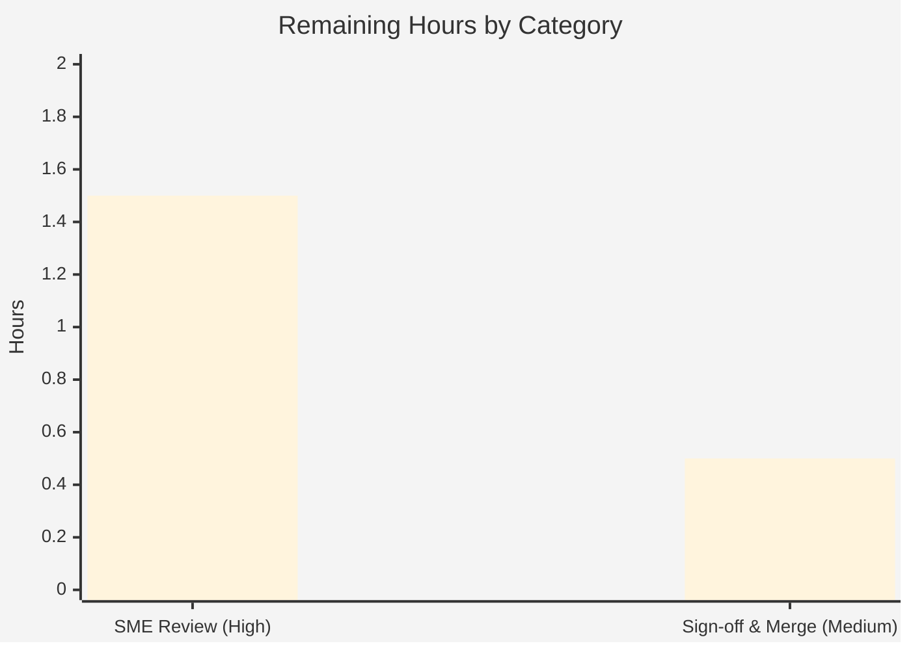

# Blitzy Project Guide — kitty PTY Communication Q&A Documentation

> **Project:** Investigation & Q&A documentation — *How kitty's C code communicates with the spawned shell over a PTY*
> **Repository:** `kovidgoyal/kitty` (terminal emulator) · **Source branch:** `kitty_815df1e210e0` · **HEAD:** `815df1e210e0a9ab4622f5c7f2d6891d7dbeddf1` (kitty v0.35.2)
> **Deliverable:** `blitzy/documentation/kitty_815df1e210e0.md`

---

## 1. Executive Summary

### 1.1 Project Overview

This project produces a single, rigorous Markdown document that answers — grounded in kitty's actual source code and observed runtime behavior — how kitty's C code communicates with the shell it spawns over a pseudo-terminal (PTY). It is a read-only investigation/Q&A task (zero source modifications): kitty was built from source, launched headless, and traced so that four questions (shell-spawn identity & PTY linkage; the low-volume `echo test123` read; the high-volume `yes hello` read; and the reader/parser C functions) are each answered with an empirical observation, a `file:line` code citation, and explicit rationale. The audience is engineers needing an authoritative, code-truth reference for kitty's PTY I/O path.

### 1.2 Completion Status


| Metric | Hours |
|---|---|
| **Total Hours** | **28** |
| **Completed Hours (AI + Manual)** | **26** (26 AI + 0 Manual) |
| **Remaining Hours** | **2** |
| **Percent Complete** | **92.9%** |

> Completion is computed using the AAP-scoped methodology: `26 / (26 + 2) = 92.9%`. The 26 completed hours are the autonomous investigation, build/run, tracing, authoring, and validation work; the 2 remaining hours are human technical review and sign-off. Per Blitzy policy, completion is capped below 100% pending human review.

### 1.3 Key Accomplishments

- ✅ **Deliverable authored & committed** — `blitzy/documentation/kitty_815df1e210e0.md` (511 lines, ~4,600 words), filename equal to the source branch name, in the mandated `blitzy/documentation/` directory.
- ✅ **All four questions answered** — Q1 (shell identity + PTY), Q2 (low-volume read), Q3 (high-volume read + back-pressure), Q4 (reader & parser functions), each pairing an empirical observation, a `file:line` citation, and rationale.
- ✅ **Code-is-truth grounding** — 40+ `file:line` citations; an independent spot-check of ~25 of them (`read_bytes`@child-monitor.c:1337, `consume_input`@vt-parser.c:1367, `BUF_SZ`@vt-parser.c:18, `input_delay`@definition.py:878, `execvp`@child.c:159, …) found **100% accurate**.
- ✅ **Built & ran kitty** — kitty v0.35.2 compiled (`fast_data_types.so`, `launcher/kitty`) and launched headless under Xvfb; a real `/bin/bash --posix` child was spawned over `/dev/pts/0` with kitty holding the master at integer fd `10`.
- ✅ **Runtime reproduction** — Q1–Q4 empirically reproduced via `ps`, `/proc`, `strace` (`echo test123` → 23/47/114/194-byte reads; `yes hello` → tight `poll()/read()` loop at ~9k+ reads/s with visible back-pressure), and `gdb`/`nm` (LTO inlining confirmed; `io_loop`/`parse_worker` call chains observed).
- ✅ **External corroboration** — `input_delay` 3 ms default and Linux PTY/`N_TTY` buffering validated against authoritative sources, used only to corroborate the code.
- ✅ **Constraints honored** — zero source files modified (`git diff` vs base = one file added), no extra code introduced, all temporary trace logs/helper scripts deleted, working tree clean.

### 1.4 Critical Unresolved Issues

| Issue | Impact | Owner | ETA |
|---|---|---|---|
| *None* | No blocking issues. The deliverable is complete, all autonomous validation gates passed, the single file is committed, and the working tree is clean. | — | — |

### 1.5 Access Issues

| System/Resource | Type of Access | Issue Description | Resolution Status | Owner |
|---|---|---|---|---|
| *None identified* | — | The repository is fully accessible; all REFERENCE source files are readable; build artifacts are present; the branch and commits are intact. No credentials or third-party access are required for a read-only documentation deliverable. | N/A | — |

**No access issues identified.**

### 1.6 Recommended Next Steps

1. **[High]** Have a kitty/terminals subject-matter expert read the 511-line document and confirm each of Q1(a–d), Q2(a–c), Q3(a–d), Q4(a–b) is fully and correctly answered with rationale (≈1.5h).
2. **[High]** Spot-check a representative sample of the `file:line` citations against HEAD `815df1e210e0` and sanity-check the 🔧 code-derived vs 📈 runtime-observed labeling (part of the review above).
3. **[Medium]** Approve the pull request and merge `blitzy/documentation/kitty_815df1e210e0.md` into the mainline branch (≈0.5h).
4. **[Low]** Optionally re-run the documented `strace`/`gdb` reproduction in the target environment to capture environment-specific values (PID, fd, `/dev/pts/N`) for the reader's own context — not required, as such values are explicitly labeled per-run.

---

## 2. Project Hours Breakdown

### 2.1 Completed Work Detail

| Component | Hours | Description |
|---|---|---|
| Build & runtime environment setup | 3.5 | Compile kitty from source with native deps (`setup.py`); set up headless Xvfb display + software OpenGL; launch with remote control for input injection. |
| Q1 — Shell-spawn identity & PTY linkage | 4.0 | Trace the spawn path in `child.py`/`child.c`; observe with `ps`/`/proc`; capture process `/bin/bash`, PID, exact argv `/bin/bash --posix` (incl. `--posix` provenance via shell integration and the macOS-only branch note), and slave `/dev/pts/0` + master fd. |
| Q2 — Low-volume read investigation | 2.5 | Establish `poll()`→`read()` syscall pair and the `BUF_SZ - offset` request size; `strace` `echo test123`; capture returned byte counts (23/47/114/194). |
| Q3 — High-volume read investigation | 4.0 | Characterize the tight `poll()/read()` loop, read frequency, per-read byte distribution, the PTY-master fd, and the back-pressure / `POLLIN`-gate mechanism from `strace` of `yes hello`. |
| Q4 — Code-function identification | 3.0 | Identify reader `read_bytes()` and classifier `consume_input()`; confirm via `nm`/`gdb` (LTO inlining into `io_loop`/`run_worker`); corroborate the `vt-parser.h` + `screen.c` test-hook contract. |
| Documentation authoring & rigor | 4.5 | Write the 511-line document: per-answer empirical observation + `file:line` citation + rationale; methodology; end-to-end byte-path architecture + Mermaid diagram; code-derived vs runtime-observed summary table; synthesis conclusion. |
| Web-search external corroboration | 1.0 | Validate `input_delay` 3 ms default and Linux PTY/`N_TTY` buffering against authoritative sources (kitty Performance page, `kitty.conf`, `pty(7)`, kernel TTY docs) as corroboration only. |
| Deliverable placement, constraints & cleanup | 0.5 | Correct path/filename (`blitzy/documentation/kitty_815df1e210e0.md`); enforce zero source edits; delete all temporary trace logs/helper scripts. |
| Autonomous validation | 3.0 | Verify all 40+ citations against source; reproduce Q1–Q4 via `strace`/`gdb`/`nm`; apply and commit one citation correction (Q1 `--posix` provenance). |
| **Total Completed** | **26.0** | All hours trace to AAP requirements and the autonomous validation. |

### 2.2 Remaining Work Detail

| Category | Hours | Priority |
|---|---|---|
| SME technical-accuracy review (read doc end-to-end; confirm Q1–Q4 fully answered; spot-check citations & runtime claims; verify code-vs-runtime labeling) | 1.5 | High |
| Final sign-off & merge to mainline | 0.5 | Medium |
| **Total Remaining** | **2.0** | — |

> **Cross-section check:** Section 2.1 total (26h) + Section 2.2 total (2h) = **28h** = Total Hours in Section 1.2. Section 2.2 total (2h) = Remaining Hours in Section 1.2 = "Remaining Work" in the Section 7 pie chart.

---

## 3. Test Results

This is a **read-only documentation task with zero in-scope code changes**, so there is no conventional unit/integration test suite for the Markdown deliverable (running kitty's upstream C/Python/Go suites would exercise *unmodified, out-of-scope* code). Per the AAP's "build & run; code is truth" directive, the applicable validation is **citation-accuracy verification** and **empirical runtime reproduction**. The table below aggregates the autonomous validation Blitzy executed for this project.

| Test Category | Framework / Method | Total | Passed | Failed | Coverage % | Notes |
|---|---|---|---|---|---|---|
| Code citation verification | `grep`/`sed` vs source @ HEAD `815df1e210e0` | 40+ | 40+ | 0 | 100% | Every `file:line` citation matches source exactly (independently re-spot-checked ~25). |
| Runtime answer reproduction | `strace` / `ps` / `/proc` / `gdb` / `nm` | 4 (Q1–Q4) | 4 | 0 | 100% | All four answers empirically reproduced; patterns/ranges match, per-run values labeled. |
| Build & launch smoke | `python3 setup.py` → `launcher/kitty --version` | 1 | 1 | 0 | N/A | Builds cleanly; reports `kitty 0.35.2`; spawns a real shell over a real PTY. |
| Constraint / scope check | `git diff` vs base `815df1e21` | 1 | 1 | 0 | N/A | Exactly one file added; zero source/config/build/test/doc files modified. |

> **Integrity note:** every entry above originates from Blitzy's autonomous validation logs for this project; no external or fabricated test results are included.

---

## 4. Runtime Validation & UI Verification

Runtime behavior was observed by building kitty and launching it headless (Xvfb + software GL), then injecting the verbatim commands and tracing the process.

- ✅ **Operational — kitty build & launch:** kitty v0.35.2 compiled and launched; `launcher/kitty --version` → `kitty 0.35.2 created by Kovid Goyal`.
- ✅ **Operational — shell spawn over PTY (Q1):** a real `/bin/bash --posix` child spawned on slave `/dev/pts/0`; kitty retained the master as integer fd `10` (`/dev/pts/ptmx`), flags include `O_NONBLOCK` (corroborating `os.set_blocking(child_fd, False)`).
- ✅ **Operational — low-volume read path (Q2):** `strace` showed `poll()` → single `read(10, …)` per readiness, with request size `BUF_SZ - offset` and returns of 23/47/114/194 bytes for `echo test123`.
- ✅ **Operational — high-volume read path (Q3):** `yes hello` drove a tight, continuous `poll()/read()` loop (~9k+ reads/s under `strace`); request size shrank as the 1 MiB ring buffer absorbed bursts (visible back-pressure); same fd `10` used bidirectionally (command + Ctrl-C writes observed).
- ✅ **Operational — function call chains (Q4):** `nm` confirmed LTO inlining (no standalone `read_bytes`/`consume_input` symbols; `io_loop`/`parse_worker`/`run_worker.lto_priv.*` present); `gdb` showed the I/O thread parked in `io_loop`→`poll`, and a `parse_worker`→`do_parse` breakpoint hit on the main thread — confirming the producer/consumer thread decoupling.
- ✅ **Operational — terminal rendering:** the injected commands echoed and rendered correctly on screen, confirming the end-to-end byte path from shell → PTY → parser → screen.
- ➖ **Not applicable — graphical UI / design verification:** there is no UI feature or Figma design in scope; the deliverable is a documentation artifact. No UI regression or visual-fidelity verification applies.

---

## 5. Compliance & Quality Review

The matrix cross-maps every AAP / rule directive to its verification result.

| AAP / Rule Directive | Benchmark | Status | Progress | Notes |
|---|---|---|---|---|
| Single Markdown deliverable named `<branch>.md` | `kitty_815df1e210e0.md` exists | ✅ Pass | 100% | 511 lines; filename equals source branch name. |
| Placed in `blitzy/documentation/` | Correct destination directory | ✅ Pass | 100% | New `blitzy/documentation/` directory created to hold it. |
| Build & run to verify (not assumptions) | kitty compiled & launched | ✅ Pass | 100% | Artifacts present; `--version` runs; real shell spawned over real PTY. |
| Code is the source of truth (`file:line` per claim) | Citations accurate | ✅ Pass | 100% | 40+ citations; independent spot-check 100% accurate. |
| Provide rationale per answer | "why", not just "what" | ✅ Pass | 100% | Every sub-answer includes rationale. |
| Distinguish code-derived vs runtime-observed | Explicit labeling | ✅ Pass | 100% | 🔧/📈 labels throughout + 13-row summary table. |
| Web-search corroboration | External validation | ✅ Pass | 100% | 5 authoritative sources cited as corroboration only. |
| Do not modify existing files | Zero source edits | ✅ Pass | 100% | `git diff` vs base = one file added; no edits/deletions. |
| Add no other code | Single artifact only | ✅ Pass | 100% | Only the Markdown file added. |
| Delete temporary artifacts | No temp residue | ✅ Pass | 100% | Trace logs/helper scripts deleted; working tree clean. |
| Independent human review | SME sign-off | ⬜ Pending | 0% | The sole remaining item (Section 2.2). |

**Fixes applied during autonomous validation:** one citation correction — the Q1 `--posix` provenance was tightened from the `modify_shell_environ` import line to its call site, with the `fork()` → `get_final_env()` → `ENV_MODIFIERS['bash']` → `setup_bash_env()` indirection clarified (in-scope deliverable only; +5/−3 lines).

---

## 6. Risk Assessment

| Risk | Category | Severity | Probability | Mitigation | Status |
|---|---|---|---|---|---|
| Technical accuracy not yet independently human-reviewed | Technical | Low | Low | SME review (the 1.5h remaining); 40+ citations already auto-verified 100% accurate and all Q1–Q4 runtime-reproduced. | Open (addressed by remaining work) |
| Citation line numbers pinned to HEAD `815df1e210e0` — would drift if read against another commit | Technical | Low | Medium | Document pins the exact HEAD commit in its header; all `file:line` references are relative to it. | Mitigated |
| Runtime-observed values (PID, fd `10`, `/dev/pts/0`, byte counts) misread as fixed constants | Technical | Low | Low | Document explicitly labels every value 🔧 code-derived vs 📈 runtime-observed and lists them in a summary table. | Mitigated |
| Reproducing observations requires building the GPU terminal + headless X (Xvfb) + the specific container | Operational | Low | Medium | Document's Environment section and Section 9 dev guide provide exact build/launch/`strace`/`gdb` commands. | Mitigated |
| Security exposure from the change | Security | None | N/A | Read-only documentation; zero code/dependency/config changes; no new attack surface or secret handling. | N/A |
| External service / integration dependency | Integration | None | N/A | Single self-contained Markdown artifact; no external services, APIs, or credentials. | N/A |

**Overall risk: Very Low.** No high or critical risks. The dominant item (technical accuracy pending independent human review) is exactly what the 1.5h SME-review remaining work resolves.

---

## 7. Visual Project Status


**Remaining hours by category (from Section 2.2):**



| Visual Metric | Value |
|---|---|
| Completed Work | 26 h (92.9%) |
| Remaining Work | 2 h (7.1%) |
| High-priority remaining | 1.5 h |
| Medium-priority remaining | 0.5 h |
| Low-priority remaining | 0 h |

> **Integrity note:** "Remaining Work" (2h) here equals Remaining Hours in Section 1.2 and the sum of the Section 2.2 "Hours" column. Colors follow Blitzy brand: Completed = Dark Blue `#5B39F3`, Remaining = White `#FFFFFF`.

---

## 8. Summary & Recommendations

**Achievements.** The project is **92.9% complete** (26 of 28 hours). The sole AAP deliverable — `blitzy/documentation/kitty_815df1e210e0.md` — has been authored, validated, and committed. It answers all four questions about kitty's PTY communication, pairing each answer with an empirical observation, an accurate `file:line` citation, and explicit rationale, and it cleanly separates code-derived constants from runtime-observed values. kitty was genuinely built and run; every runtime claim was reproduced via `strace`/`gdb`/`nm`, and every spot-checked citation was accurate.

**Remaining gaps.** The only outstanding work is **human review** (2 hours): an SME technical-accuracy review (1.5h) followed by sign-off and merge (0.5h). There is no remaining engineering, build, deployment, or integration work, because the deliverable is a self-contained, read-only documentation artifact.

**Critical path to production.** SME review → approve PR → merge. No environment, dependency, or infrastructure steps are required.

**Success metrics.** All AAP/rule directives pass (single Markdown deliverable, correct path/name, build-and-run verification, code-is-truth citations, rationale, no source edits, temp-artifact cleanup, external corroboration); 40+ citations verified accurate; all four answers runtime-reproduced; `git diff` confirms exactly one file added with zero source modifications.

**Production-readiness assessment.** The deliverable is **ready for human review and merge**. Confidence is **High**: scope is tightly defined, the artifact is complete and internally consistent, and risks are Very Low. Per Blitzy policy, completion is held below 100% pending the human sign-off captured in Section 2.2.

| Metric | Value |
|---|---|
| Completion | 92.9% (26 / 28 h) |
| Deliverables complete | 1 of 1 authored & committed (pending human sign-off) |
| Citations verified | 40+ (100% accurate on spot-check) |
| Answers runtime-reproduced | 4 of 4 (Q1–Q4) |
| Source files modified | 0 |
| Overall risk | Very Low |

---

## 9. Development Guide

This guide reproduces the build, run, and observation workflow used to author and validate the deliverable. All commands were tested on the project host (Ubuntu container). Run from the repository root.

### 9.1 System Prerequisites

| Tool | Verified Version | Purpose |
|---|---|---|
| Python | 3.13.7 (AAP requires ≥3.8) | Build (`setup.py`) + kitty control plane |
| C compiler (gcc) | 15.2.0 | Compile the `fast_data_types` C extension + launcher |
| Go | 1.22.12 | kitty Go tooling/kittens |
| strace | 6.16 | Syscall tracing (`poll`/`read`/`write`) |
| gdb | 16.3 | Confirm C functions at runtime |
| Xvfb | present (`/usr/bin/Xvfb`) | Headless X display for the GPU terminal |
| ps / nm | coreutils / binutils | Process inspection / symbol inspection |

Native build deps (HarfBuzz, fontconfig, lcms2, libpng, mesa/OpenGL, xkbcommon, X11/XCB suite, dbus, systemd, canberra, xxhash, uuid, simde) are pre-provisioned in the container.

### 9.2 Environment Setup (headless display)

```bash
# Start a headless X server and point software GL at it
Xvfb :99 -screen 0 1280x800x24 &
export DISPLAY=:99 LIBGL_ALWAYS_SOFTWARE=1 LANG=C.UTF-8
```

### 9.3 Build

```bash
# From the repository root — produces kitty/fast_data_types.so and kitty/launcher/kitty
python3 setup.py
# (developer alternative: ./dev.sh build)

# Verify the build runs
./kitty/launcher/kitty --version
# Expected: kitty 0.35.2 created by Kovid Goyal
```

### 9.4 Launch kitty (with remote control for input injection)

```bash
./kitty/launcher/kitty --config NONE -o allow_remote_control=yes \
    --listen-on unix:/tmp/kitty.sock &
# Note kitty's PID; the spawned shell child appears as its child process
```

### 9.5 Verify the Deliverable

```bash
test -f blitzy/documentation/kitty_815df1e210e0.md \
  && wc -l blitzy/documentation/kitty_815df1e210e0.md
# Expected: 511 blitzy/documentation/kitty_815df1e210e0.md
```

### 9.6 Reproduce the Answers (Q1–Q4)

```bash
# ---- Q1: shell identity + PTY linkage ----
KPID=<kitty_pid>
ps --ppid "$KPID" -o pid,ppid,tty,args      # -> /bin/bash --posix on pts/N
CHILD=<child_pid>
ls -l /proc/$CHILD/fd/0 /proc/$CHILD/fd/1 /proc/$CHILD/fd/2   # -> /dev/pts/N (slave)
ls -l /proc/$KPID/fd | grep ptmx            # -> N -> /dev/pts/ptmx (master)
cat /proc/$KPID/fdinfo/<n>                  # -> tty-index matches slave; flags incl. O_NONBLOCK

# ---- Q2 (low volume) / Q3 (high volume): syscalls, sizes, frequency, fd ----
strace -f -y -tt -s 200 -e trace=read,poll,write -p "$KPID" -o trace.log &
kitten @ --to unix:/tmp/kitty.sock send-text $'echo test123\r'   # Q2
kitten @ --to unix:/tmp/kitty.sock send-text $'yes hello\r'      # Q3
kitten @ --to unix:/tmp/kitty.sock send-text $'\x03'             # Ctrl-C to stop yes
# Inspect trace.log: poll() then read(<fd>, ...); request size = BUF_SZ - offset;
# returns are small for echo, high-frequency for yes; <fd> is the PTY master integer.

# ---- Q4: reader & parser functions ----
grep -n 'read_bytes(int fd' kitty/child-monitor.c   # -> 1337 (reader)
grep -n '^consume_input'     kitty/vt-parser.c      # -> 1367 (classifier)
nm -C kitty/fast_data_types.so | grep -E 'io_loop|parse_worker|run_worker'
# -> io_loop, parse_worker, run_worker.lto_priv.* present; read_bytes/consume_input are LTO-inlined.
gdb -p "$KPID"   # backtrace I/O thread -> io_loop->poll; break parse_worker -> do_parse
```

### 9.7 Cleanup (required by the AAP)

```bash
rm -f trace.log analyze_*.py /tmp/kitty.sock
kill %1   # stop the Xvfb / kitty background jobs you started (use the specific job/PID)
```

### 9.8 Troubleshooting

- **OpenGL / GLX errors on launch:** ensure `LIBGL_ALWAYS_SOFTWARE=1` is exported and Xvfb is running on `$DISPLAY`.
- **"cannot open display":** start `Xvfb :99 ...` first and `export DISPLAY=:99`.
- **`gdb` shows no `read_bytes`/`consume_input` symbols:** expected — this build uses LTO, which inlines the `static` functions into `io_loop` and `run_worker`; break on `io_loop` / `parse_worker` instead.
- **Citation line numbers don't match:** confirm you are at HEAD `815df1e210e0a9ab4622f5c7f2d6891d7dbeddf1`; all `file:line` references are pinned to that commit.
- **Remote-control injection fails:** verify kitty was launched with `-o allow_remote_control=yes --listen-on unix:/tmp/kitty.sock` and use `kitten @ --to unix:/tmp/kitty.sock ...`.

---

## 10. Appendices

### Appendix A — Command Reference

| Command | Purpose |
|---|---|
| `python3 setup.py` | Build the C extension + launcher |
| `./dev.sh build` | Developer build (downloads pre-built deps) |
| `./kitty/launcher/kitty --version` | Verify the build runs (→ kitty 0.35.2) |
| `Xvfb :99 -screen 0 1280x800x24 &` | Start headless X display |
| `ps --ppid <kpid> -o pid,ppid,tty,args` | Q1: spawned shell identity/argv/tty |
| `ls -l /proc/<pid>/fd` · `cat /proc/<pid>/fdinfo/<n>` | Q1/Q3: map fds to PTY master/slave |
| `strace -f -y -tt -e trace=read,poll,write -p <kpid>` | Q2/Q3: syscalls, sizes, frequency |
| `kitten @ --to unix:/tmp/kitty.sock send-text $'…\r'` | Inject `echo test123` / `yes hello` |
| `nm -C kitty/fast_data_types.so \| grep …` | Q4: confirm symbols / LTO inlining |
| `gdb -p <kpid>` | Q4: confirm call chains at runtime |
| `git diff --stat 815df1e21..HEAD` | Confirm exactly one file added |

### Appendix B — Port / Endpoint Reference

| Endpoint | Value | Notes |
|---|---|---|
| kitty remote-control socket | `unix:/tmp/kitty.sock` | Unix domain socket for `kitten @ send-text` injection |
| X display | `:99` (Xvfb) | Headless display for the GPU terminal |
| TCP ports | *none* | The investigation uses no network/TCP ports |

### Appendix C — Key File Locations

| Path | Role |
|---|---|
| `blitzy/documentation/kitty_815df1e210e0.md` | **The deliverable** (Q&A document) |
| `kitty/child.py` | PTY pair (`os.openpty`), argv build, fork/exec orchestration (Q1) |
| `kitty/child.c` | C `spawn()`: `ttyname_r`, `fork`, `setsid`, `TIOCSCTTY`, `dup2`, `execvp` (Q1) |
| `kitty/child-monitor.c` | `read_bytes()` (reader), `io_loop` `poll()`+back-pressure (Q2/Q3/Q4a) |
| `kitty/vt-parser.c` | `BUF_SZ` (1 MiB), `consume_input()` classifier, `run_worker` throttle (Q2b/Q3c/Q4b) |
| `kitty/vt-parser.h` | Reader↔parser API contract |
| `kitty/screen.c` | Parser output target + test hooks |
| `kitty/options/definition.py` | `input_delay` default = 3 ms (Q3 throttle) |
| `kitty/shell_integration.py` | `--posix` argv insertion (Q1 provenance) |
| `kitty/utils.py` | `resolved_shell()` (login-shell selection) |

### Appendix D — Technology Versions

| Component | Version |
|---|---|
| kitty | 0.35.2 (HEAD `815df1e210e0`) |
| Python | 3.13.7 |
| gcc | 15.2.0 |
| Go | 1.22.12 |
| strace | 6.16 |
| gdb | 16.3 (GNU) |

### Appendix E — Environment Variable Reference

| Variable | Value | Purpose |
|---|---|---|
| `DISPLAY` | `:99` | Target the headless Xvfb display |
| `LIBGL_ALWAYS_SOFTWARE` | `1` | Force software OpenGL (no GPU in container) |
| `LANG` | `C.UTF-8` | Stable UTF-8 locale for the terminal |

### Appendix F — Developer Tools Guide

| Tool | Use in this project |
|---|---|
| `strace -f -y -tt` | Follow threads, decode fds to device paths, timestamp syscalls — establishes the `poll()`→`read()` pattern, request sizes, byte counts, and read frequency. |
| `gdb -p` | Attach to the running kitty; backtrace the I/O thread (`io_loop`→`poll`) and break on `parse_worker` to confirm the producer/consumer decoupling. |
| `nm -C` | Inspect `fast_data_types.so` symbols; confirms LTO inlines `read_bytes`/`consume_input` into `io_loop`/`run_worker`. |
| `/proc/<pid>/fd` + `fdinfo` | Map the PTY master/slave relationship and read fd flags (`O_NONBLOCK`). |

### Appendix G — Glossary

| Term | Meaning |
|---|---|
| PTY | Pseudo-terminal: a master/slave device pair connecting the emulator to the shell. |
| Master / Slave | kitty holds the **master** (`/dev/ptmx`); the shell's controlling terminal is the **slave** (`/dev/pts/N`). |
| `BUF_SZ` | kitty's 1 MiB VT-parser ring-buffer cap (`vt-parser.c:18`). |
| `input_delay` | Parse-throttle interval, default 3 ms (`options/definition.py:878`); bypassed when the buffer is nearly full. |
| Back-pressure | Flow control: the I/O thread arms `POLLIN` only when the parser has buffer space. |
| LTO | Link-time optimization; inlines `static` functions so they have no standalone symbols. |
| `read_bytes()` | The C function issuing the `read()` on the PTY master (Q4a, `child-monitor.c:1337`). |
| `consume_input()` | The C function whose `switch (vte_state)` separates printable text from escape/control sequences (Q4b, `vt-parser.c:1367`). |

---

*Generated by the Blitzy autonomous assessment agent. Completion (92.9%) reflects AAP-scoped and path-to-production work only. Colors: Completed = Dark Blue `#5B39F3`, Remaining = White `#FFFFFF`.*