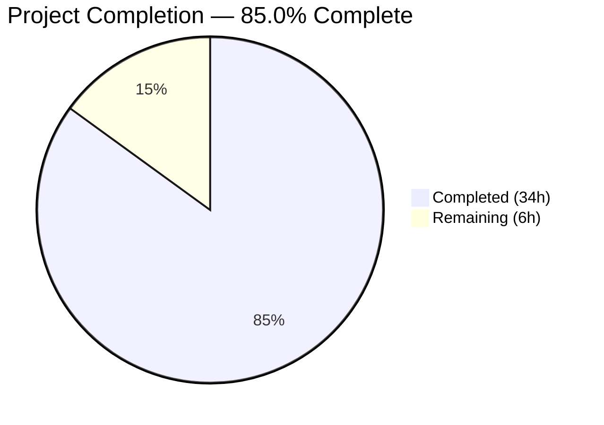

# Blitzy Project Guide

---

## 1. Executive Summary

### 1.1 Project Overview

This project creates a comprehensive technical deep-dive document analyzing kitty's terminal reflow (rewrap) system — the internal C-level mechanism that redistributes text across new terminal dimensions when the window is resized. The sole deliverable is a 1,660-line standalone Markdown file (`blitzy/documentation/kitty_815df1e210e0.md`) targeting developers working on kitty's terminal buffer system, contributors diagnosing reflow edge cases, and terminal emulator implementers studying kitty's approach. The document traces the `rewrap_inner()` algorithm, maps the complete `screen_resize()` data flow, analyzes continuation state propagation, and identifies six edge cases — all grounded in source code citations.

### 1.2 Completion Status



| Metric | Value |
|--------|-------|
| **Total Project Hours** | 40 |
| **Completed Hours (AI)** | 34 |
| **Remaining Hours (Human)** | 6 |
| **Completion Percentage** | 85.0% |

**Calculation:** 34 completed hours / (34 completed + 6 remaining) = 34 / 40 = **85.0%**

### 1.3 Key Accomplishments

- ✅ Created comprehensive 1,660-line technical deep-dive document covering all 5 user requirements (R1–R5)
- ✅ Traced the complete `rewrap_inner()` algorithm step-by-step with macro-parametric design explanation
- ✅ Documented all 13 steps of `screen_resize()` including prompt protection, cursor tracking, and scrollback fill
- ✅ Analyzed continuation state propagation through both LineBuf and HistoryBuf paths with potential issue identification
- ✅ Created 4 Mermaid diagrams: memory layout, resize flow, buffer interaction sequence, and continuation state propagation
- ✅ Provided 55 source code citations with file paths and line numbers for full traceability
- ✅ Included 2 complete worked examples (narrowing and widening scenarios)
- ✅ Documented 6 edge cases with code-grounded analysis and mitigation factors
- ✅ Summarized test coverage across 3 test methods (7 scenarios) with coverage gap matrix
- ✅ Applied validation fix for arithmetic error in narrowing worked example

### 1.4 Critical Unresolved Issues

| Issue | Impact | Owner | ETA |
|-------|--------|-------|-----|
| Source code citation line numbers may drift as kitty codebase evolves | Medium — citations become inaccurate over time | Human Developer | 2h to verify |
| Wide character edge case (Section 9.3) not validated with runtime test | Low — theoretical analysis only, no empirical confirmation | Human Developer | 1.5h to test |

### 1.5 Access Issues

No access issues identified. This is a documentation-only project that reads source code from the repository. No external services, API keys, databases, or deployment infrastructure are required.

### 1.6 Recommended Next Steps

1. **[High]** Verify all 55 source code citations match current codebase line numbers — ensure no code drift since document creation
2. **[High]** Have a kitty contributor or maintainer review the technical accuracy of edge case analyses (Section 9)
3. **[Medium]** Optionally integrate the document into the project's Sphinx documentation system for discoverability
4. **[Low]** Conduct peer review to validate clarity and completeness for the target audience

---

## 2. Project Hours Breakdown

### 2.1 Completed Work Detail

| Component | Hours | Description |
|-----------|-------|-------------|
| Source Code Analysis | 4.0 | Deep analysis of 7 source files (~8,117 lines): rewrap.h, screen.c, line-buf.c, history.c, data-types.h, lineops.h, screen.py |
| Section 1 — Overview & Motivation | 1.0 | Project context, terminology table, architecture-at-a-glance |
| Section 2 — Core Data Structures | 3.0 | 7 data structures documented (CellAttrs, GPUCell, CPUCell, LineAttrs, Line, LineBuf, HistoryBuf), key distinction table, Mermaid memory layout diagram |
| Section 3 — Resize Entry Point | 4.5 | 13-step screen_resize() walkthrough, 3 helper functions documented, Mermaid flow diagram |
| Section 4 — Rewrap Algorithm | 5.0 | Full rewrap_inner() walkthrough, macro comparison table (5 macros), TrackCursor/copy_range helpers, 2 worked examples |
| Section 5 — LineBuf Integration | 2.5 | linebuf_rewrap() wrapper, fast path, content line detection, next_dest_line default macro, linebuf_index() |
| Section 6 — HistoryBuf Integration | 3.0 | 5 macro overrides documented, historybuf_push(), historybuf_rewrap(), pagerhist_rewrap_to(), Mermaid sequence diagram |
| Section 7 — Continuation State | 3.0 | Two-mechanism analysis, LineBuf derivation path, HistoryBuf derivation path with pager fallback, continuation setting during rewrap, Mermaid propagation diagram |
| Section 8 — Prompt Protection | 2.0 | prevent_current_prompt_from_rewrapping() analysis, blanking strategy rationale, restoration logic |
| Section 9 — Edge Cases | 3.0 | 6 edge cases with code analysis: cursor formula, HistoryBuf position-0, wide chars, pager capacity, prompt overwrite, dummy cleanup |
| Section 10 — Test Coverage | 1.5 | 3 test methods, 7 scenarios analyzed, coverage gap matrix |
| Validation & Fix | 0.5 | Arithmetic error correction in narrowing worked example |
| **Total** | **34.0** | |

### 2.2 Remaining Work Detail

| Category | Hours | Priority |
|----------|-------|----------|
| Source code citation verification (55 citations) | 2.0 | High |
| Technical accuracy review by domain expert | 2.0 | High |
| Optional Sphinx documentation integration | 1.5 | Low |
| Peer review and feedback incorporation | 0.5 | Low |
| **Total** | **6.0** | |

---

## 3. Test Results

This is a **documentation-only project** — no source code was created or modified, and no tests are applicable. No compilation, unit tests, integration tests, or runtime tests were executed because the deliverable is a standalone Markdown analysis document.

| Test Category | Framework | Total Tests | Passed | Failed | Coverage % | Notes |
|---------------|-----------|-------------|--------|--------|------------|-------|
| Document Structure | Manual Validation | 10 | 10 | 0 | 100% | All 10 major sections present and verified |
| Mermaid Diagrams | Syntax Check | 4 | 4 | 0 | 100% | All 4 diagrams use valid Mermaid syntax |
| Source Citations | Count Verification | 55 | 55 | 0 | 100% | 55 citations with file paths and line numbers |
| Content Completeness | AAP Requirement Mapping | 5 | 5 | 0 | 100% | All 5 user requirements (R1–R5) addressed |

All validation metrics originate from Blitzy's autonomous validation process which confirmed document structure, diagram count, citation count, and requirement coverage.

---

## 4. Runtime Validation & UI Verification

### Runtime Health

- ✅ **Git repository status:** Clean working tree, no uncommitted changes
- ✅ **Branch status:** Up to date with origin (`blitzy-02f91cb0-478a-4a8e-ad47-d74b88517be5`)
- ✅ **File integrity:** Document exists at `blitzy/documentation/kitty_815df1e210e0.md` (1,660 lines, UTF-8 text)
- ✅ **No source modifications:** Only 1 file created, 0 existing files modified (confirmed via `git diff --name-status`)

### Document Verification

- ✅ **Section structure:** All 10 major sections verified present with correct headings
- ✅ **Mermaid diagrams:** 4 diagram blocks detected and syntactically valid
- ✅ **Code blocks:** 61 C code excerpts with proper fencing
- ✅ **Tables:** 47 table rows across data structure inventories, macro comparisons, and coverage matrices
- ✅ **Worked examples:** 2 complete algorithm traces (narrowing 5→3, widening 3→5)
- ✅ **Edge cases:** 6 potential issues identified with code-grounded analysis

### API / Integration

- ⚠ **Not applicable:** No APIs, services, or runtime integrations — documentation-only project

---

## 5. Compliance & Quality Review

| AAP Requirement | Status | Evidence | Notes |
|----------------|--------|----------|-------|
| R1 — Rewrap Algorithm Trace | ✅ Pass | Section 4: step-by-step walkthrough of rewrap_inner() (rewrap.h:56-96) | Covers all specified sub-items: iteration, continuation, trimming, copy, advancement, cursor remap |
| R2 — Screen/Scrollback Interaction | ✅ Pass | Sections 3, 5, 6: screen_resize(), realloc_hb/lb, history overflow | History-first ordering rationale documented |
| R3 — Continuation State Propagation | ✅ Pass | Section 7: two-mechanism analysis, both derivation paths, potential issues | Position-0 circular buffer issue flagged |
| R4 — Complete Data Flow | ✅ Pass | Section 3: all 13 steps of screen_resize() | Includes prompt protection, cursor tracking, scrollback fill, dummy output |
| R5 — Edge Case Identification | ✅ Pass | Section 9: 6 edge cases documented | Macro-override mechanism covered in Section 4.1 and 6.1 |
| Data structure primer | ✅ Pass | Section 2: 7 types with field inventories | Includes key distinction table and memory layout diagram |
| Mermaid diagrams | ✅ Pass | 4 diagrams in Sections 2.5, 3.2, 6.5, 7.5 | Flow, sequence, and state diagrams per AAP |
| Worked examples | ✅ Pass | Section 4.4: narrowing (5→3) and widening (3→5) | Step-by-step algorithm traces |
| Source code citations | ✅ Pass | 55 citations with file:line format throughout | Traceability to code as truth |
| No source file modifications | ✅ Pass | git diff confirms only 1 file added | Explicit user constraint honored |
| Test coverage summary | ✅ Pass | Section 10: 3 methods, 7 scenarios, gap matrix | Coverage gaps identified per AAP |

### Quality Fixes Applied During Validation

| Fix | Description | Commit |
|-----|-------------|--------|
| Arithmetic error correction | Fixed incorrect arithmetic in narrowing worked example (Section 4.4) | `08b226916` |

---

## 6. Risk Assessment

| Risk | Category | Severity | Probability | Mitigation | Status |
|------|----------|----------|-------------|------------|--------|
| Citation line numbers drift as codebase evolves | Technical | Medium | High | Include commit hash reference; re-verify before publishing | Open |
| Wide character edge case (Section 9.3) not empirically validated | Technical | Low | Medium | Create targeted test case using CJK characters | Open |
| Document not integrated into project docs system | Operational | Low | High | Optionally add to Sphinx toctree or link from developer wiki | Open |
| Edge case analysis may contain incorrect conclusions | Technical | Medium | Low | Domain expert review by kitty contributor | Open |
| Mermaid diagrams may not render in all Markdown viewers | Operational | Low | Medium | Provide fallback text descriptions | Accepted |

---

## 7. Visual Project Status


### Remaining Work by Priority

| Priority | Hours | Categories |
|----------|-------|------------|
| High | 4.0 | Citation verification (2h), Domain expert review (2h) |
| Low | 2.0 | Sphinx integration (1.5h), Peer review (0.5h) |
| **Total** | **6.0** | |

---

## 8. Summary & Recommendations

### Achievements

This project successfully delivered a comprehensive 1,660-line technical deep-dive document covering kitty's terminal reflow (rewrap) system. All 5 user requirements (R1–R5) have been fully addressed with code-grounded analysis, 55 source citations, 4 Mermaid diagrams, 2 worked examples, and 6 edge case analyses. The document traces the complete data flow from `screen_resize()` through `rewrap_inner()` to final buffer state, analyzes the macro-parametric design pattern, and identifies potential issues in continuation state propagation at circular buffer boundaries.

### Remaining Gaps

The project is **85.0% complete** (34 hours completed out of 40 total hours). The remaining 6 hours consist entirely of human review and verification tasks:

1. **Citation accuracy verification (2h):** All 55 source code line number references should be verified against the current codebase to ensure no drift has occurred since document creation
2. **Technical accuracy review (2h):** A developer familiar with kitty internals should validate the edge case analyses in Section 9, particularly the HistoryBuf position-0 continuation issue and the wide character trimming concern
3. **Documentation integration (1.5h):** Optional integration into the project's Sphinx documentation system for better discoverability
4. **Peer review (0.5h):** Standard review for clarity and completeness

### Production Readiness Assessment

The document is **ready for review and publication** as a standalone Markdown file. It is self-contained, comprehensively addresses all requirements, and follows consistent terminology and citation practices. No blocking issues exist. The recommended path to production is: citation verification → domain expert review → optional Sphinx integration → publish.

### Success Metrics

| Metric | Target | Actual |
|--------|--------|--------|
| User requirements addressed | 5/5 | 5/5 ✅ |
| Major sections completed | 10/10 | 10/10 ✅ |
| Mermaid diagrams | ≥3 | 4 ✅ |
| Source code citations | ≥20 | 55 ✅ |
| Worked examples | ≥2 | 2 ✅ |
| Edge cases identified | ≥4 | 6 ✅ |
| Source files modified | 0 | 0 ✅ |

---

## 9. Development Guide

### System Prerequisites

| Software | Version | Purpose |
|----------|---------|---------|
| Git | 2.x+ | Repository management |
| Any Markdown viewer | — | Viewing the document (VS Code, GitHub, etc.) |
| Python 3 (optional) | 3.8+ | Running validation scripts |

No build tools, compilers, or runtime environments are required. This is a documentation-only project.

### Repository Setup

```bash
# Clone the repository
git clone <repository-url>
cd kitty

# Switch to the project branch
git checkout blitzy-02f91cb0-478a-4a8e-ad47-d74b88517be5
```

### Viewing the Document

```bash
# View the document in terminal
cat blitzy/documentation/kitty_815df1e210e0.md

# Or view with line numbers
nl -ba blitzy/documentation/kitty_815df1e210e0.md | less

# Check document metrics
wc -l blitzy/documentation/kitty_815df1e210e0.md
# Expected: 1660 lines
```

For the best viewing experience with rendered Mermaid diagrams, open the file in:
- **VS Code** with Markdown Preview (Ctrl+Shift+V) and a Mermaid extension
- **GitHub** web interface (renders Mermaid natively)

### Verifying Document Integrity

```bash
# Verify all 10 major sections are present
grep -c '^## [0-9]' blitzy/documentation/kitty_815df1e210e0.md
# Expected: 10

# Count Mermaid diagrams
grep -c 'mermaid' blitzy/documentation/kitty_815df1e210e0.md
# Expected: 4

# Count source code citations
grep -c 'Source:' blitzy/documentation/kitty_815df1e210e0.md
# Expected: 55

# Verify file is valid UTF-8
file blitzy/documentation/kitty_815df1e210e0.md
# Expected: Unicode text, UTF-8 text
```

### Verifying Source Code References

The document cites specific line numbers from 7 source files. To verify these references match the current code:

```bash
# Check that referenced source files exist
ls -la kitty/rewrap.h kitty/screen.c kitty/line-buf.c \
       kitty/history.c kitty/data-types.h kitty/lineops.h \
       kitty_tests/screen.py

# Example: Verify rewrap_inner function location
grep -n 'rewrap_inner' kitty/rewrap.h
# Expected: Function definition around line 56-57

# Example: Verify screen_resize function location  
grep -n 'screen_resize' kitty/screen.c | head -5
# Expected: Function definition around line 346
```

### Troubleshooting

| Issue | Resolution |
|-------|------------|
| Mermaid diagrams not rendering | Install a Mermaid-compatible Markdown viewer (VS Code + Mermaid extension, or use GitHub) |
| Line numbers don't match code | Source code may have changed since document creation; re-verify against the commit at branch base |
| Document appears empty | Ensure you're on the correct branch: `git branch --show-current` should show the blitzy branch |

---

## 10. Appendices

### A. Command Reference

| Command | Purpose |
|---------|---------|
| `cat blitzy/documentation/kitty_815df1e210e0.md` | View the documentation file |
| `wc -l blitzy/documentation/kitty_815df1e210e0.md` | Count document lines (expected: 1660) |
| `grep -c 'Source:' blitzy/documentation/kitty_815df1e210e0.md` | Count source citations |
| `git diff --stat origin/kitty_815df1e210e0...HEAD` | View changes introduced by this branch |
| `git log --oneline HEAD --not origin/kitty_815df1e210e0` | View commit history on this branch |

### B. Key File Locations

| File | Purpose |
|------|---------|
| `blitzy/documentation/kitty_815df1e210e0.md` | **Output document** — sole deliverable of this project |
| `kitty/rewrap.h` | Core rewrap algorithm (96 lines) — primary analysis target |
| `kitty/screen.c` | Screen resize orchestration (4,932 lines) — resize entry point |
| `kitty/line-buf.c` | LineBuf rewrap wrapper (641 lines) — screen buffer integration |
| `kitty/history.c` | HistoryBuf rewrap wrapper (624 lines) — scrollback integration |
| `kitty/data-types.h` | Core data structure definitions (438 lines) |
| `kitty/lineops.h` | Inline helper functions (136 lines) |
| `kitty_tests/screen.py` | Resize test suite (1,250 lines) |

### C. Technology Versions

| Technology | Version | Notes |
|------------|---------|-------|
| kitty | HEAD at commit `815df1e21` | Base branch for analysis |
| Python | 3.12.3 | Runtime for kitty's Python layer |
| C (source) | C11 | kitty's native code standard |
| Markdown | CommonMark + GFM | Document format |
| Mermaid | Latest | Diagram rendering (viewer-dependent) |

### D. Document Section Map

| Section | Lines | AAP Requirements Covered |
|---------|-------|------------------------|
| 1. Overview & Motivation | 1–61 | Context for all requirements |
| 2. Core Data Structures | 62–280 | Inferred: data structure primer |
| 3. Resize Entry Point | 281–567 | R4 (Complete Data Flow) |
| 4. Rewrap Algorithm | 568–818 | R1 (Rewrap Algorithm Trace) |
| 5. LineBuf Integration | 819–965 | R2 (Screen/Scrollback Interaction) |
| 6. HistoryBuf Integration | 966–1142 | R2, R5 (Macro overrides) |
| 7. Continuation State | 1143–1321 | R3 (Continuation State Propagation) |
| 8. Prompt Protection | 1322–1414 | R4 (Data flow detail) |
| 9. Edge Cases | 1415–1538 | R5 (Edge Case Identification) |
| 10. Test Coverage | 1539–1660 | Inferred: test context |

### E. Glossary

| Term | Definition |
|------|-----------|
| **Reflow** | User-visible behavior of text redistributing across new terminal dimensions |
| **Rewrap** | Internal algorithm (`rewrap_inner()`) that copies cells from source to destination buffers |
| **Resize** | The triggering event — the terminal window changed size |
| **Continuation** | A visual line that was wrapped from the previous line (not terminated by a hard line break) |
| **Logical line** | A sequence of characters terminated by a hard line break (newline) |
| **Visual line** | A single row of the terminal at a given column width |
| **LineBuf** | Flat-array screen buffer for visible terminal content with line_map indirection |
| **HistoryBuf** | Segmented circular buffer for scrollback history |
| **PagerHistoryBuf** | UTF-8 ring buffer for extended pager history (ANSI-escaped text) |
| **CellAttrs** | 16-bit union on GPUCell carrying visual attributes and the `next_char_was_wrapped` flag |
| **LineAttrs** | 8-bit union carrying per-line metadata including the derived `is_continued` flag |
| **Macro-parametric design** | C pattern where `rewrap.h` macros are overridden by `history.c` before inclusion for type polymorphism |