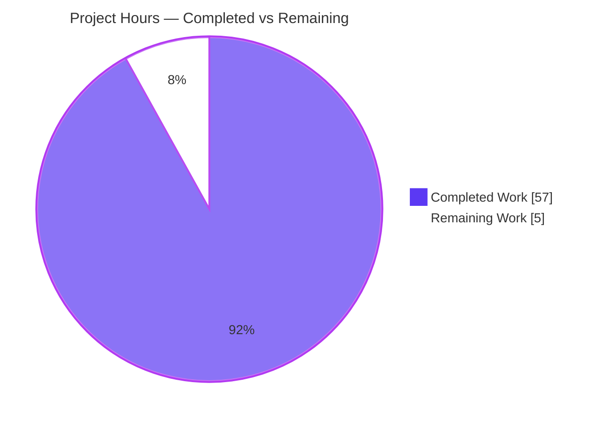
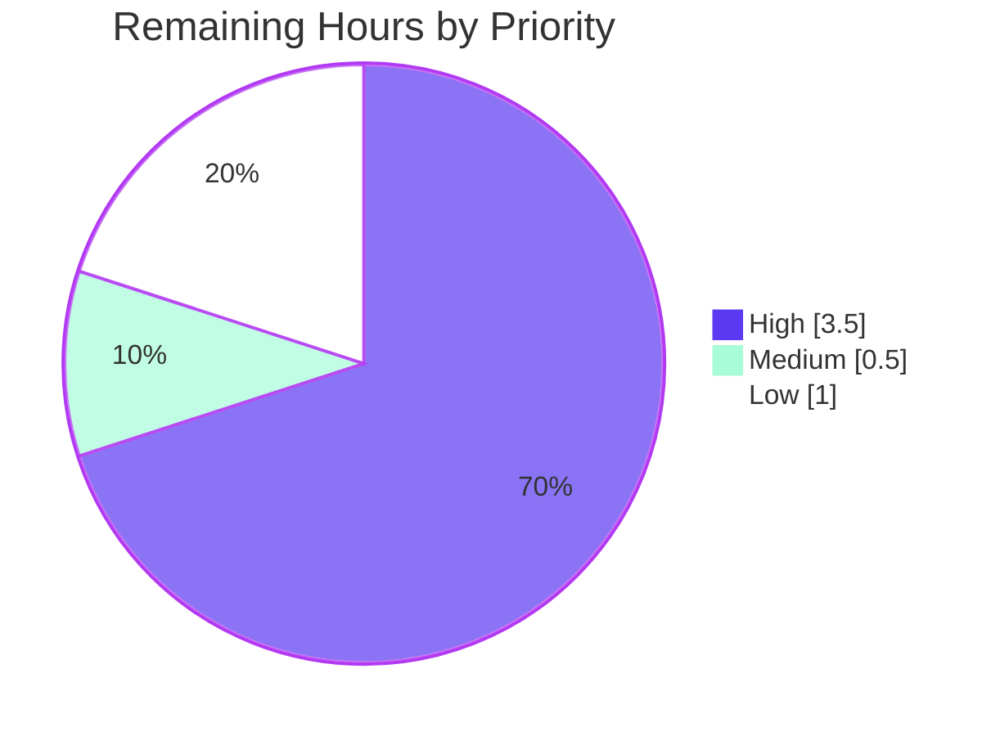

# Blitzy Project Guide — Kitty Diff-Kitten Internals Answer Document

> Branch: `blitzy-5f613546-20aa-48be-98e6-bb0c6e374ea7` · Pinned commit: `815df1e210e0a9ab4622f5c7f2d6891d7dbeddf1`
> Deliverable: `blitzy/documentation/kitty_815df1e210e0.md` (2,275 lines) · Task type: Read-only code Q&A / Documentation

---

## 1. Executive Summary

### 1.1 Project Overview

This project delivers a single, comprehensive technical answer document that explains — grounded in both source code and observed runtime behavior — how the kitty terminal emulator's **diff kitten** (`kittens/diff/`) works internally. It is a read-only, onboarding-oriented code Q&A task answering eight behavioral questions: directory pairing, rename recognition, the caching pipeline, multi-file concurrency, parallel highlighting, binary/image handling, an end-to-end runtime trace, and the anchored-diff algorithm. Target users are engineers onboarding to kitty's diff internals. Every behavioral claim is backed by actual captured output from building kitty and driving the real Go entry point in the canonical Docker environment at pinned commit `815df1e210e0`. The only repository footprint is one Markdown file; no existing file is modified.

### 1.2 Completion Status


**Center metric: 91.9% Complete** — Completed = Dark Blue (`#5B39F3`), Remaining = White (`#FFFFFF`).

| Metric | Hours |
|--------|-------|
| **Total Hours** | 62 |
| **Completed Hours (AI + Manual)** | 57  (AI: 57 · Manual: 0) |
| **Remaining Hours** | 5 |
| **Percent Complete** | **91.9%**  (57 ÷ 62) |

### 1.3 Key Accomplishments

- ✅ Kitty built in the canonical Docker environment; produced a working `kitten 0.35.2` (real Go entry point confirmed; Python shim correctly errors by design).
- ✅ All **eight** behavioral questions answered with the mandated structure (Direct Answer + Mechanism/`file:line` + Command + complete unedited Observed Output + Causal reason + edge variants).
- ✅ **Run-first** methodology honored — 260 `file:line` citations and ~57 observed / 14 inferred labels; every behavioral claim paired with its exact command and captured output.
- ✅ Every in-scope condition exercised: all three `diff_cmd` engines (auto→git, external diff, builtin anchored diff), all four binary/image branches, rename vs remove+add, mode-only change, ignore-glob filtering, and no-newline-at-EOF.
- ✅ Concurrency evidence captured at scale with ≥2-run stability, including honest reproduction of the "concurrent map writes" crash (3/3) and a DATA RACE (3/3) — a latent upstream defect surfaced, not introduced.
- ✅ Read-only scope perfectly maintained: `git diff --name-status base..HEAD` shows only the one added document; working tree clean; all temp fixtures removed.
- ✅ Final validation fixed the single inaccuracy found (`ignore_name` → Go stdlib `filepath.Match`, not `doublestar`) and committed it (`d4a3aca1d`).

### 1.4 Critical Unresolved Issues

There are **no release-blocking defects** in the deliverable. The only gating items are standard human path-to-production activities.

| Issue | Impact | Owner | ETA |
|-------|--------|-------|-----|
| Human technical review not yet performed | Gates formal acceptance of the onboarding document (not a defect) | Reviewing engineer | 0.5 day |
| Runtime reproducibility spot-check pending | Confirms a sample of captured outputs on the reviewer's machine | Reviewing engineer | 0.25 day |
| _(Informational, out of scope)_ Latent upstream race: `LRUCache.Set` mutates map under `RLock`; no single-flight on `GetOrCreate` → `fatal error: concurrent map writes` at very large file counts | Does not affect the document; is a real kitty defect the document honestly surfaces | kitty maintainers (upstream) | N/A (advisory) |

### 1.5 Access Issues

**No access issues identified.** All required resources were accessible: the repository, the canonical Docker image, the Go 1.22 toolchain, the Python build driver, and the C compiler. The canonical build completed and the diff kitten ran via its real Go entry point.

| System/Resource | Type of Access | Issue Description | Resolution Status | Owner |
|-----------------|----------------|-------------------|-------------------|-------|
| Source repository | Read/Write (branch) | None — clean single-file addition committed | ✅ Resolved | Blitzy agent |
| Canonical Docker image | Build/Run | None — image available; build + run succeeded | ✅ Resolved | Blitzy agent |
| Go / Python / gcc toolchain | Build | None — all present (Go 1.22.12, Python 3.13, gcc) | ✅ Resolved | Blitzy agent |

### 1.6 Recommended Next Steps

1. **[High]** Perform a technical review of `kitty_815df1e210e0.md` — read all eight answers and confirm each Direct Answer, Mechanism (`file:line`), and Observed Output is coherent, complete, and correctly labeled (observed vs inferred).
2. **[High]** Reproduce a sample of runtime claims (e.g., Q1 pairing fixture, Q4 concurrent-map-writes crash, Q8 three-engine identical render) in the pinned Docker image using `python3 setup.py --ignore-compiler-warnings`.
3. **[Medium]** Approve and merge the PR; re-confirm read-only scope (`git diff --name-status base..HEAD` shows only the one document).
4. **[Low]** Address any reviewer-requested clarifications or revisions to the document (contingency).
5. **[Low]** _(Out of scope, advisory)_ File an upstream issue with kitty maintainers about the latent `concurrent map writes` race the document surfaces.

---

## 2. Project Hours Breakdown

### 2.1 Completed Work Detail

All components trace to AAP-scoped deliverables. **Total = 57 hours** (100% AI-autonomous).

| Component | Hours | Description |
|-----------|-------|-------------|
| Canonical environment & build | 6 | Build kitty in the Docker image; diagnose the gcc-15/wayland-protocols `-Werror=switch` mismatch; produce a clean build; confirm the real Go entry point (`EntryPoint`) vs the erroring Python shim; build the PTY capture harness (§0). |
| Q1 — Directory pairing | 4 | `collect_files` pairs by identical relative path (`Intersect`, collect.go:296,306); craft directory fixtures; capture output; exercise edges: arg-count errors (0/1/3→exit 1), mode-only change, ignore-glob (§1). |
| Q2 — Rename recognition | 4 | MD5 + byte-identical data equality (collect.go:335-364); observe both transitional states (byte-identical→RENAME vs one byte changed→REMOVE+ADD); document the honest rename-body-message finding (§2). |
| Q3 — Caching read-once pipeline | 5 | 7 LRU caches; `data_for_path`→`sanitize`→`lines_for_path`→`highlighted_lines_for_path`; strace `openat` counting for two engines, stable ×2 (§3). |
| Q4 — Concurrency across many files | 7 | `Context.Parallel` worker pool sized `runtime.NumCPU()`; taskset CPU sweeps; runs at N=80 and N=400; reproduce `concurrent map writes` crash 3/3 with exact stack; document run-to-run inconsistency honestly (§4). |
| Q5 — Parallel highlighting | 6 | `highlight_all` dispatches one path/worker with distinct cache keys (highlight.go:217-228); `go test -race` (no race); isolated DATA RACE probe reproduced 3/3; determinism confirmed (§5, the largest section). |
| Q6 — Binary & image handling | 5 | `render` classification: UTF-8 text, non-UTF-8 binary ("Binary file"), and PNG image branches; graphics-protocol (`ESC_G`) chunk counts, stable 3/3 (§6). |
| Q7 — End-to-end runtime trace | 4 | `main`→`create_collection`→`highlight_all`→`diff` via the UI handler; all four change kinds (add/change/rename/removal) resolved in one screen, sorted by path (§7). |
| Q8 — Diff algorithm & cache interplay | 6 | All three engines render identically; builtin `Diff()` byte-length checks (182/105/133/0); no-newline-at-EOF and empty/identical edges (§8). |
| Coverage pass & inferred labeling | 3 | Cross-reference every named function, struct, condition, config option, and dependency; assign observed/inferred labels correctly (§9). |
| Cleanup & read-only verification | 1 | Remove all temp fixtures/scripts; verify working tree clean; capture git-status evidence (§10). |
| Autonomous QA & validation rework | 6 | Multi-round QA commits + final claim-by-claim validation against reproduced runtime; fix the one inaccuracy (`ignore_name` → `filepath.Match`). |
| **TOTAL COMPLETED** | **57** | |

### 2.2 Remaining Work Detail

All remaining work is human path-to-production. **Total = 5 hours.**

| Category | Hours | Priority |
|----------|-------|----------|
| Documentation technical review (read all 8 answers; verify coherence, completeness, observed/inferred labels) | 2.0 | High |
| Runtime reproducibility spot-check (rebuild in pinned Docker; re-run ~3–4 representative claims) | 1.5 | High |
| Reviewer-requested revisions (contingency) | 1.0 | Low |
| PR approval & merge to destination branch | 0.5 | Medium |
| **TOTAL REMAINING** | **5.0** | |

### 2.3 Basis of Estimate & Confidence

- **Methodology:** Hours are AAP-scoped (PA1/PA2). Completion % = Completed ÷ (Completed + Remaining) = 57 ÷ 62 = **91.9%**.
- **Confidence:** *High* on the completed-work classification — the Final Validator's five gates all passed and the git footprint (exactly one added file, clean tree) and document structure were independently re-verified. *Medium* on absolute hour magnitudes (documentation/investigation effort is estimated), but *High* that the ratio is dominated by completed work.
- **Cross-section anchors (locked):** Total 62 · Completed 57 · Remaining 5 · 91.9%. Section 2.1 + Section 2.2 = 57 + 5 = 62 ✓.

---

## 3. Test Results

All entries originate exclusively from Blitzy's autonomous validation logs for this project (re-verified in-session). This is a documentation task, so tests are **corroborating evidence** rather than the deliverable; there is no application test suite to author, hence no formal coverage figure.

| Test Category | Framework | Total Tests | Passed | Failed | Coverage % | Notes |
|---------------|-----------|-------------|--------|--------|-----------|-------|
| Unit (diff kitten) | Go `testing` | 1 | 1 | 0 | n/a | `go test ./kittens/diff/ -run TestDiffCollectWalk -v` → PASS (ignore-glob walk). |
| Race detection (diff kitten) | Go `-race` | 1 pkg | 1 | 0 | n/a | `go test -race ./kittens/diff/...` → `ok`, **no race** in the package under normal test load. |
| Static build (diff kitten) | `go build` | 1 | 1 | 0 | n/a | `go build ./kittens/diff/` → exit 0. |
| Static analysis (diff kitten) | `go vet` | 1 | 1 | 0 | n/a | `go vet ./kittens/diff/` → exit 0. |
| Supporting suite (tools/utils) | Canonical `./test.py` | 10 | 10 | 0 | n/a | Context/infra only (not the diff-kitten deliverable). One `TestFileLock` failure under bare `go test` is environmental (needs launcher on PATH), out of scope, and passes under the canonical runner. |

**Intentional negative reproductions (evidence, not deliverable failures):**

| Reproduction | Framework | Runs | Result | Purpose |
|--------------|-----------|------|--------|---------|
| High-scale concurrency (N=400, unconstrained) | Real `kitten diff` | 3/3 | `fatal error: concurrent map writes` reproduced | Q4 evidence — the honest, observed crash under heavy load. |
| Isolated race probe | `go run -race .` | 3/3 | `WARNING: DATA RACE` at `cache.go:34` reproduced | Q5 evidence — proves `LRUCache.Set` mutates map under `RLock`. |

---

## 4. Runtime Validation & UI Verification

**Legend:** ✅ Operational · ⚠ Partial/Caveat · ❌ Failing

- ✅ **Canonical build** — `python3 setup.py --ignore-compiler-warnings` → exit 0; produced a working `kitten 0.35.2`.
- ✅ **Real Go entry point** — `kitten diff <L> <R>` reaches `EntryPoint` (main.go:177); `kitten diff --help` renders the correct usage banner.
- ✅ **Side-by-side TUI** — renders add/change/rename/removal in one screen, sorted by path (captured via PTY harness).
- ✅ **Python shim guard** — `main()` correctly raises `SystemExit('Must be run as kitten diff')` by design; not used as an observation path.
- ✅ **Diff engines** — all three (`auto`→git, external `diff`, `builtin` anchored diff) render **identically** on the same fixture; raw stream differs per engine as expected.
- ✅ **Binary/image handling** — UTF-8 text diffs normally; non-UTF-8 shows "Binary file"; PNG shows dimensions/size + graphics-protocol transmission.
- ⚠ **Full-screen TUI capture** — the event loop blocks on terminal DA/CPR queries; automated capture requires the document's specialized Python `pty` harness (§0.4). A plain `script`+`q` invocation times out (independently confirmed this session). Humans simply run it interactively in a real terminal.
- ⚠ **High-scale concurrency** — at very large unconstrained file counts the highlight pool trips a genuine data race → `concurrent map writes`. This is a **latent upstream defect** the document surfaces honestly; it is out of scope for this read-only task.

---

## 5. Compliance & Quality Review

Cross-mapping of the governing rule set (SWE-AtlasQnA-Repo) and AAP deliverables to Blitzy quality benchmarks. Fixes applied during autonomous validation are noted.

| Benchmark / Rule | Requirement | Status | Progress |
|------------------|-------------|--------|----------|
| Read-only scope | No existing file modified; only the answer doc added | ✅ Pass | 100% |
| Run-first methodology | Build & run before writing; observe, then document | ✅ Pass | 100% |
| Real entry point only | Observe via Go `kitten diff`, never the Python shim | ✅ Pass | 100% |
| Exercise every condition | All `diff_cmd` modes, binary/image branches, rename vs remove+add, mode-only, ignore-glob, no-newline-EOF | ✅ Pass | 100% |
| Actual output for every claim | Complete, unedited output + command shown per claim | ✅ Pass | 100% |
| Magnitude/timing rigor | Run at scale; state scale; confirm stable across ≥2 runs | ✅ Pass | 100% |
| Run-to-run inconsistency | Same input repeated; distribution reported honestly | ✅ Pass | 100% |
| Inferred labeling | Read-only inferences labeled `(inferred)` | ✅ Pass | 100% |
| Answer every named item | Coverage pass over every function/struct/condition/option | ✅ Pass | 100% |
| Deliverable naming/location | `blitzy/documentation/kitty_815df1e210e0.md` | ✅ Pass | 100% |
| Canonical build/config stated | Exact build & invocation commands documented | ✅ Pass | 100% |
| Cleanup | Temp fixtures removed; working tree clean | ✅ Pass | 100% |
| Accuracy fix applied | `ignore_name` corrected to `filepath.Match` (not `doublestar`), committed `d4a3aca1d` | ✅ Pass | 100% |
| Independent human review | Technical review & sign-off | ⬜ Pending | 0% |

---

## 6. Risk Assessment

Overall risk profile is **LOW**: a read-only documentation deliverable adds no code or dependencies and introduces zero new attack surface.

| Risk | Category | Severity | Probability | Mitigation | Status |
|------|----------|----------|-------------|------------|--------|
| R1 — Magnitude/timing observations (NumCPU=128, timings, crash-repro counts) are hardware/environment-specific | Technical | Low | Medium | Document states exact scale/CPU count and confirms ≥2-run stability; reproduce in the pinned Docker image | Mitigated (documented) |
| R2 — 260 `file:line` citations are pinned to commit `815df1e210e0`; reading against another commit may misalign line numbers | Technical | Low | Low | Commit pinned in the title and §10 footer; citations spot-checked during validation | Mitigated (documented) |
| R3 — Build requires `--ignore-compiler-warnings` (gcc-15 `-Werror=switch` vs wayland-protocols 1.45 enum at `glfw/wl_window.c:668`) | Technical | Low | Medium | §0.2 documents the flag, root cause, and that it is a documented `setup.py` option, not a code bug | Mitigated (documented) |
| R4 — Latent upstream concurrency defect: `LRUCache.Set` mutates the map under `RLock`; `GetOrCreate` has no single-flight guard → `concurrent map writes` at high file counts (DATA RACE confirmed) | Technical / Operational | Medium | Low | Out of scope for this read-only task; documented honestly with 3/3 repro + exact stack. Recommend an upstream issue | Open (advisory, out of scope) |
| R5 — Human expert review not yet performed; onboarding doc could be relied upon before sign-off | Operational | Low | Medium | High-priority human technical-review task defined (§2.2, §1.6) | Open |
| R6 — Markdown rendering fidelity (144 code fences, ~6 tables, console blocks, long lines) may degrade in some viewers | Integration | Low | Low | Validated structurally sound (balanced fences, well-formed tables); preview during review | Mitigated |
| Security posture | Security | None | — | No code or dependencies added/changed; only a Markdown document written; read-only scope verified via git | N/A |

---

## 7. Visual Project Status

### Project Hours Breakdown



- **Completed Work = 57h** (Dark Blue `#5B39F3`) · **Remaining Work = 5h** (White `#FFFFFF`).
- *Integrity:* the "Remaining Work" value (5h) equals Section 1.2 Remaining Hours and the sum of Section 2.2 Hours.

### Remaining Hours by Category (Section 2.2)

| Category | Hours | Priority |
|----------|:-----:|:--------:|
| Documentation technical review | 2.0 | High |
| Runtime reproducibility spot-check | 1.5 | High |
| Reviewer-requested revisions (contingency) | 1.0 | Low |
| PR approval & merge | 0.5 | Medium |
| **Total** | **5.0** | |

```
Documentation technical review        ████████████████  2.0h
Runtime reproducibility spot-check    ████████████      1.5h
Reviewer-requested revisions          ████████          1.0h
PR approval & merge                   ████              0.5h
```

### Priority Distribution (remaining)



---

## 8. Summary & Recommendations

**Achievements.** The project delivers a rigorous, run-first answer document (2,275 lines) that explains the kitty diff kitten's internals across all eight requested dimensions. Kitty was built in the canonical Docker environment, the diff kitten was driven via its **real Go entry point**, and every behavioral claim is paired with the exact command and its complete, unedited output. Every in-scope condition was exercised — all three `diff_cmd` engines, all four binary/image branches, rename vs remove+add, mode-only change, ignore-glob filtering, and no-newline-at-EOF — with concurrency evidence captured at scale and confirmed stable across ≥2 runs. The single inaccuracy discovered during validation (`ignore_name` filtering mechanism) was corrected and committed.

**Remaining gaps.** None are defects. The **5 remaining hours** are entirely human path-to-production: a technical review of the document, a runtime reproducibility spot-check in the pinned Docker image, PR approval/merge, and a small revisions contingency.

**Critical path to production.** Review → reproduce a sample of claims → approve & merge. Because the change is an isolated single-file addition with no code or dependency impact, merge risk is negligible.

**Success metrics.** ✅ Read-only scope preserved (exactly one added file, clean tree) · ✅ All 8 questions answered with observed output · ✅ In-scope tests/build/vet pass · ✅ Every named item covered with correct observed/inferred labeling.

**Production-readiness assessment.** The deliverable is **91.9% complete** and assessed **production-ready pending human sign-off**. The most notable finding is advisory and out of scope: the document honestly surfaces a latent upstream `concurrent map writes` race in kitty's shared `LRUCache`, which is recommended for an upstream issue but is not a defect in this deliverable.

| Metric | Value |
|--------|-------|
| AAP-scoped completion | 91.9% (57h / 62h) |
| AAP deliverables completed | 11 / 11 |
| In-scope defects outstanding | 0 |
| Repository files modified | 0 (one file added) |
| Remaining effort (human) | 5h |

---

## 9. Development Guide

How to build kitty, run the diff kitten via its real entry point, and reproduce the document's observations. All verification commands below were executed successfully in the canonical-equivalent environment (Go 1.22.12, Python 3.13.7, working `kitten 0.35.2`).

### 9.1 System Prerequisites

- **Canonical environment:** Docker image `andrewparkscaleai/coding-agent:kovidgoyal__kitty__815df1e210e0a9ab4622f5c7f2d6891d7dbeddf1` (from `ghcr.io/scaleapi/swe-atlas:swe_atlas_QnA_kovidgoyal_kitty_1.0`), pinned to commit `815df1e210e0a9ab4622f5c7f2d6891d7dbeddf1`.
- **Toolchain:** Go 1.22, Python ≥ 3.8 (build driver), a C compiler (gcc), and git.
- **OS:** Linux (the canonical image is Linux-based).

### 9.2 Environment Setup

```bash
# Ensure the Go toolchain and GOPATH are on PATH
export PATH=/usr/local/go/bin:/root/go/bin:$PATH
export GOPATH=/root/go

# Optional: isolate kitty config so host settings never interfere
export KITTY_CONFIG_DIRECTORY=/tmp/kdiff/kittyconf
mkdir -p "$KITTY_CONFIG_DIRECTORY"
```

### 9.3 Dependency Installation

Go module dependencies are resolved automatically by the build from `go.mod` — no manual install step is required. Key exercised versions: `chroma/v2 v2.14.0`, `doublestar/v4 v4.6.1`, `kovidgoyal/imaging v1.6.3`, `zeebo/xxh3 v1.0.2` (Go 1.22).

### 9.4 Build

```bash
# Canonical build (aliased by `make all`).
# --ignore-compiler-warnings is REQUIRED on gcc 15 (a documented setup.py global
# option), because wayland-protocols 1.45 adds enum values the mid-2024 switch in
# glfw/wl_window.c:668 does not handle. This is a toolchain issue, not a code bug.
python3 setup.py --ignore-compiler-warnings

# Debug build (optional)
python3 setup.py build --debug --ignore-compiler-warnings
```

Expected: exit code 0; the launcher binaries `kitty/launcher/kitten` and `kitty/launcher/kitty` are produced (gitignored).

### 9.5 Running the Diff Kitten (real Go entry point)

```bash
# Side-by-side diff of two directories (full-screen TUI; press q to quit)
./kitty/launcher/kitten diff <LEFT_DIR> <RIGHT_DIR>

# Force a specific diff engine
./kitty/launcher/kitten diff -o diff_cmd=git     <L> <R>   # external git diff --no-index
./kitty/launcher/kitten diff -o diff_cmd=diff    <L> <R>   # external diff
./kitty/launcher/kitten diff -o diff_cmd=builtin <L> <R>   # in-process anchored diff (diff.go)
```

> ⚠ Do **not** invoke the Python shim (`python3 -c "import kittens.diff.main ..."`) — it raises `SystemExit('Must be run as kitten diff')` by design and is not a valid path.

### 9.6 Verification Steps (all confirmed passing)

```bash
# 1) Kitten is runnable
./kitty/launcher/kitten --version
# → kitten 0.35.2 created by Kovid Goyal

# 2) Diff subcommand help (real Go entry point)
./kitty/launcher/kitten diff --help
# → Usage: kitten diff [options] file_or_directory_left file_or_directory_right ...

# 3) In-scope unit test
go test ./kittens/diff/ -run TestDiffCollectWalk -v
# → --- PASS: TestDiffCollectWalk ; ok  kitty/kittens/diff

# 4) Race check (no race under normal load)
go test -race ./kittens/diff/...
# → ok  kitty/kittens/diff

# 5) Static build & vet
go build ./kittens/diff/    # exit 0
go vet   ./kittens/diff/    # exit 0

# 6) Read-only scope verification
git diff --name-status 815df1e210e0a9ab4622f5c7f2d6891d7dbeddf1 HEAD
# → A  blitzy/documentation/kitty_815df1e210e0.md   (only this one file)
```

### 9.7 Example Usage

```bash
# Create tiny fixtures OUTSIDE the repo (honor read-only scope)
mkdir -p /tmp/L /tmp/R
printf 'alpha\nbeta\ngamma\n' > /tmp/L/file.txt
printf 'alpha\nBETA\ngamma\n' > /tmp/R/file.txt

# Launch interactively in a real terminal, then press q to quit
./kitty/launcher/kitten diff /tmp/L /tmp/R

# Clean up
rm -rf /tmp/L /tmp/R
```

### 9.8 Troubleshooting

- **Build aborts fatally at `glfw/wl_window.c:668` (`-Werror=switch`)** → add `--ignore-compiler-warnings` to the `setup.py` invocation (gcc-15 / wayland-protocols 1.45 enum mismatch; not a code bug).
- **`Must be run as kitten diff`** → you invoked the Python shim directly. Use `./kitty/launcher/kitten diff …` instead (the Go path).
- **`kitten diff` appears to hang under automation** → the full-screen TUI event loop blocks waiting for terminal Device-Attributes/Cursor-Position-Report responses. Run it in a real interactive terminal, or use a PTY harness that answers those queries (see document §0.4). A plain `script`+piped `q` will time out.
- **`fatal error: concurrent map writes` at very large file counts** → known latent upstream race (Risk R4). Prefer the `builtin` engine or fewer files; fixing it is out of scope for this read-only task.

---

## 10. Appendices

### A. Command Reference

| Command | Purpose |
|---------|---------|
| `python3 setup.py --ignore-compiler-warnings` | Canonical build |
| `python3 setup.py build --debug --ignore-compiler-warnings` | Debug build |
| `./kitty/launcher/kitten --version` | Confirm kitten builds/runs |
| `./kitty/launcher/kitten diff <L> <R>` | Run the diff kitten (real Go entry point) |
| `./kitty/launcher/kitten diff -o diff_cmd=git\|diff\|builtin <L> <R>` | Force a specific diff engine |
| `go test ./kittens/diff/ -run TestDiffCollectWalk -v` | In-scope unit test |
| `go test -race ./kittens/diff/...` | Race check |
| `go build ./kittens/diff/` · `go vet ./kittens/diff/` | Static build & vet |
| `git diff --name-status 815df1e210e0 HEAD` | Read-only scope verification |

### B. Port Reference

Not applicable — the diff kitten is a local full-screen TUI and opens no network ports.

### C. Key File Locations

| Path | Role |
|------|------|
| `blitzy/documentation/kitty_815df1e210e0.md` | **The deliverable** (2,275 lines) |
| `kittens/diff/collect.go` (405) | Pairing by relative path, MD5 rename detection, 7 LRU caches, data→lines→highlighted pipeline |
| `kittens/diff/diff.go` (264) | Builtin anchored-diff engine (LCS of unique lines) |
| `kittens/diff/patch.go` (377) | `diff_cmd` resolution + parallel `diff()` worker pool |
| `kittens/diff/highlight.go` (228) | Chroma lexer detection + parallel `highlight_all` |
| `kittens/diff/render.go` (770) | Binary/image classification + render branches |
| `kittens/diff/main.go` (179) | Real Go entry point (`EntryPoint`) |
| `kittens/diff/ui.go` (686) | Handler orchestration + async coordination |
| `kittens/diff/main.py` (310) | Python shim (options; errors if run directly) |
| `tools/utils/cache.go` (:13) | `LRUCache[K,V]` implementation |
| `tools/utils/images/utils.go` (:27-56) | `Context.Parallel` worker-pool primitive |

### D. Technology Versions

| Component | Version |
|-----------|---------|
| kitty / kitten | 0.35.2 |
| Go | 1.22 (build tested with 1.22.12) |
| Python (build driver) | 3.13.7 (requires ≥ 3.8) |
| chroma/v2 | v2.14.0 |
| doublestar/v4 | v4.6.1 |
| kovidgoyal/imaging | v1.6.3 |
| zeebo/xxh3 | v1.0.2 |

### E. Environment Variable Reference

| Variable | Purpose |
|----------|---------|
| `PATH` | Must include `/usr/local/go/bin` (and `/root/go/bin`) for the Go toolchain |
| `GOPATH` | Go workspace (e.g., `/root/go`) |
| `KITTY_CONFIG_DIRECTORY` | If set, kitty uses this directory for `diff.conf` (isolate host config, e.g., `/tmp/kdiff/kittyconf`) |

### F. Developer Tools Guide

- **Engine selection:** `diff_cmd` (default `auto`) resolves to external `git diff --no-index`, then external `diff`, and only falls back to the `builtin` anchored diff if neither exists. Force with `-o diff_cmd=<git|diff|builtin>`.
- **Config options** (declared in `kittens/diff/main.py`): `diff_cmd`, `ignore_name`, `num_context_lines`, `syntax_aliases`, `replace_tab_by`. Overridable via `--config <file>` or repeatable `-o key=value`.
- **TUI capture:** For automated capture of the full-screen TUI, use a Python `pty` harness that answers Primary-Device-Attributes and Cursor-Position-Report queries, then feed the byte stream to a VT emulator (see document §0.4). Interactive use needs only a normal terminal.
- **Diagnostics used in the investigation:** `strace` (openat read-once counts), `taskset` (CPU-count sweeps), `go test -race` / `go run -race` (data-race detection).

### G. Glossary

| Term | Meaning |
|------|---------|
| Diff kitten | kitty's side-by-side diff viewer with syntax highlighting, located at `kittens/diff/` |
| Kitten | A kitty sub-tool; here the Go-implemented `kitten diff` |
| Anchored diff | The builtin algorithm: LCS of lines unique to both sides act as anchors (Go stdlib `internal/diff` style; a.k.a. "patience diff") |
| `Context.Parallel` | Worker-pool primitive sized to `runtime.NumCPU()` that drains a shared channel |
| `LRUCache` | RWMutex-guarded, LRU-evicting map used for the seven diff caches |
| RENAME vs REMOVE+ADD | A change is a rename only when a removed and an added file share an identical MD5 and byte-identical data; otherwise it degrades to separate removal + addition |
| Observed vs inferred | "Observed" = confirmed by captured runtime output; "(inferred)" = read-only deduction from source, labeled as such |
