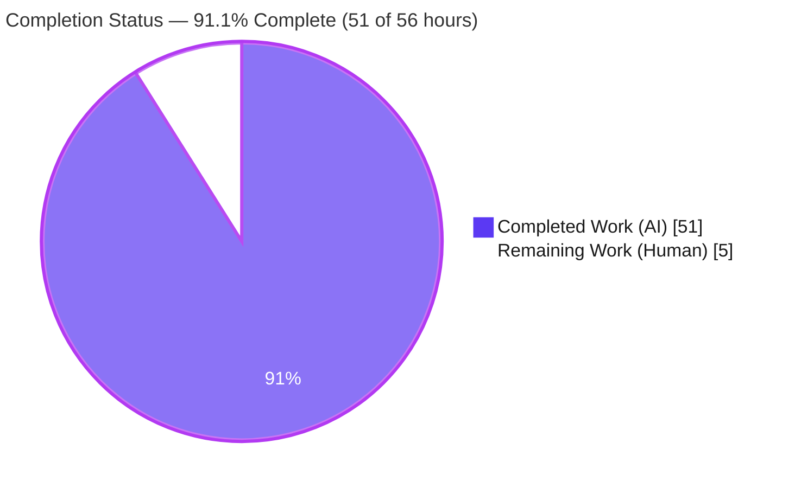
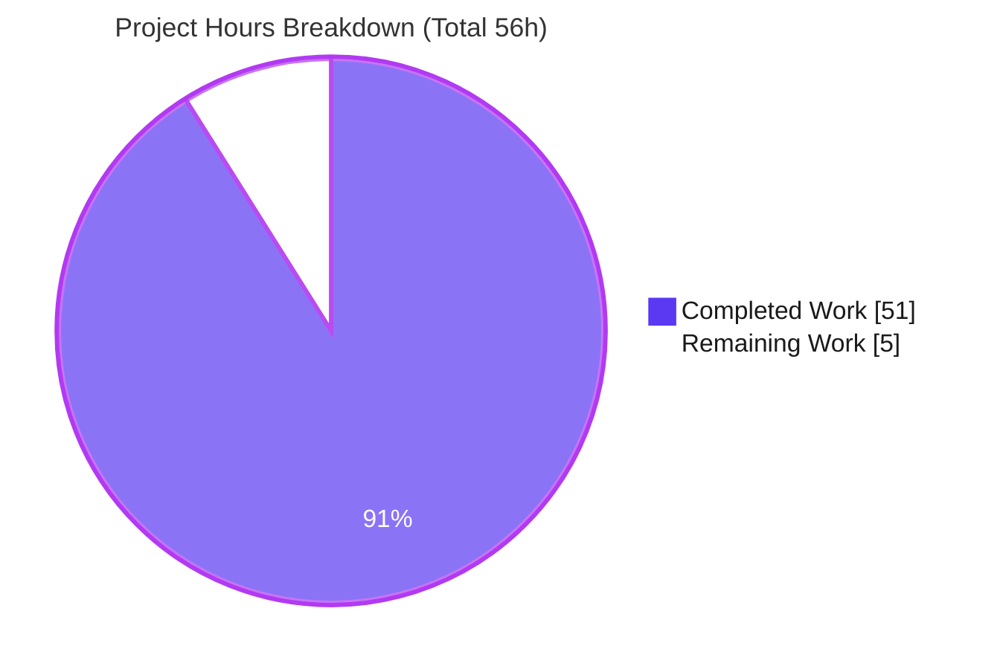
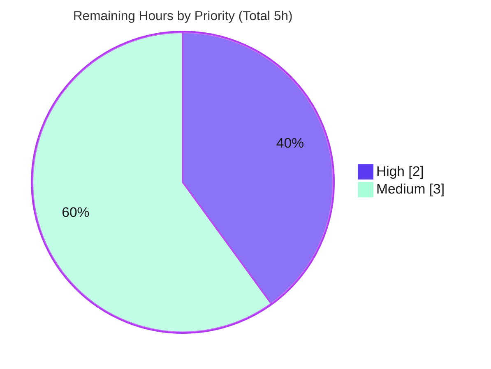

# Blitzy Project Guide — Kitty `diff` Kitten Runtime-Investigated Q&A

> **Deliverable:** `blitzy/documentation/kitty_815df1e210e0.md` — a runtime-investigated Q&A explaining how the Kitty terminal's `diff` kitten works when comparing files and directories.
> **Task type:** Documentation (read-only investigation). Governed by the `SWE-AtlasQnA-Repo` rule set.
> **Branch:** `blitzy-5900e980-186b-42ac-b10f-47549fbb3c92` · **HEAD:** `41e72191a` · **Source-branch base:** `815df1e21`

---

## 1. Executive Summary

### 1.1 Project Overview

This project produces a single, evidence-backed onboarding document that explains — **from observed runtime behavior, not source-reading alone** — how Kitty's `diff` kitten pairs files across two directory trees, recognizes renames, keeps its caches efficient, fans work out across CPU cores, isolates parallel syntax highlighting, handles binary/image files, traces end-to-end at runtime, and finds matching regions with an anchored ("patience") diff. The target audience is an engineer onboarding into the Kitty repository. The deliverable is one Markdown file (`blitzy/documentation/kitty_815df1e210e0.md`); no production source is modified. The technical scope spans the entire `kittens/diff/` Go subsystem and shared utilities under `tools/utils/`, exercised through the real `kitten diff <left> <right>` entry point built from a canonical two-stage build.

### 1.2 Completion Status



| Metric | Value |
|---|---|
| **Total Hours** | **56** |
| **Completed Hours (AI + Manual)** | **51** (51 AI + 0 Manual) |
| **Remaining Hours** | **5** |
| **Percent Complete** | **91.1%** |

> Completion is computed on AAP-scoped work only (PA1 methodology): `51 / (51 + 5) = 91.07% ≈ 91.1%`. The colors above are the Blitzy brand palette — Completed = Dark Blue `#5B39F3`, Remaining = White `#FFFFFF`.

### 1.3 Key Accomplishments

- ✅ **Canonical build reproduced** — `kitten 0.35.2 created by Kovid Goyal` built via the two-stage `python setup.py build`; binary is `kitty/launcher/kitten` (15,962,372 bytes).
- ✅ **All 8 questions answered with runtime evidence** — directory pairing, rename recognition, cache efficiency, concurrency, parallel-highlight isolation, binary/image handling, end-to-end trace, and anchored-diff matching regions.
- ✅ **Exhaustive coverage** — all **seven** `LRUCache` instances enumerated, all **four** `diff_cmd` modes (`builtin`/`diff`/`git`/`auto`) exercised, both external command templates (`GIT_DIFF`, `DIFF_DIFF`) quoted verbatim.
- ✅ **"One claim, one evidence" discipline** — 612 lines, 68 balanced code fences, ~353 exact `file:line` citations; every behavioral claim paired with the verbatim command + output that demonstrates it.
- ✅ **Two hard-to-observe behaviors captured** — worker ceiling `runtime.NumCPU()`=128 and a real `fatal error: concurrent map writes` reproduced at scale, with an explicit crash-frequency denominator and a Go race-detector corroboration.
- ✅ **Report-verbatim nuances preserved, not "corrected"** — the `LRUCache.Set` RLock/no-eviction behavior (`cache.go:32-37`) and the stray-apostrophe error string (`main.go:130`) are reported exactly as observed.
- ✅ **Read-only rule honored** — exactly one file added (the deliverable); `git status --porcelain` empty before and after; all temporary fixtures/harnesses confined to `/tmp` and removed.
- ✅ **Independently corroborated** — this session re-verified the build, tests (`ok kitty/kittens/diff`), `go vet`, `go mod verify`, the version banner, both error paths, and the deliverable's central source claims.

### 1.4 Critical Unresolved Issues

**There are no release-blocking issues for the documentation deliverable.** The Final Validator required zero edits and this session independently corroborated accuracy. The items below are **non-blocking, out-of-scope awareness notes** for the reviewer (they are pre-existing properties of the codebase, not defects introduced by this task, which changed zero source files).

| Issue | Impact | Owner | ETA |
|---|---|---|---|
| Pre-existing data race in `LRUCache.Set` (RLock, not Lock) — `tools/utils/cache.go:32-37` | Non-blocking for the doc; the doc's *purpose* is to document it. Causes `concurrent map writes` crash only at large scale (250+ parallel-highlighted files); normal use unaffected | Kitty maintainers (separate code PR) | Out of scope for this task |
| 2 out-of-scope tests fail environmentally (`kittens/hints` `TestHintMarking`, `tools/utils` `TestFileLock`; both `exec: no command`) | Non-blocking; unrelated to the diff kitten; cannot have been caused by this task (0 source changes) | Reviewer / CI owner | Out of scope for this task |
| Fixture-dependent magnitudes are author-specific (e.g., PNG right-side byte size, graphics-APC count) | Cosmetic; behaviors reproduce identically, only exact byte/packet counts vary by fixture | Reviewer (informational) | N/A — labeled observations |

### 1.5 Access Issues

**No access issues identified.** The repository was fully accessible, the canonical build succeeded, the `kitten` binary ran, dependencies verified (`go mod verify` → "all modules verified"), and the required container toolchain (Go, Python, C compiler, Git) was present.

| System/Resource | Type of Access | Issue Description | Resolution Status | Owner |
|---|---|---|---|---|
| Git repository | Read/Write (branch) | None — clean tree, single file added | ✅ Resolved / N/A | Blitzy agent |
| Build toolchain (Go 1.23.4, Python 3.13.7, gcc 15.2.0, git 2.51.0) | Local execution | None — all present in container | ✅ Available | Container image |
| Go module dependencies | Network/module cache | None — `go mod verify` all modules verified | ✅ Verified | Blitzy agent |

### 1.6 Recommended Next Steps

1. **[High]** Perform a **human technical review** of the Q&A deliverable — read all 8 answers and confirm the intuitive + technically-precise mental model is correct and serves onboarding, with special attention to the subtle Q5 concurrency/data-race claims.
2. **[Medium]** **Reproduce key runtime evidence** — rebuild via `python setup.py build` in the documented container and run `kitten diff <left> <right>` on a small fixture to confirm representative outputs.
3. **[Medium]** **Spot-check a sample of the ~353 `file:line` citations** against source at the documented revision (obs `ddf3d7e9c` / source-branch base `815df1e21`).
4. **[Medium]** **Review, render-check, and merge the PR** (verify the 68 balanced code fences, tables, and non-ASCII characters render in the target Markdown viewer).
5. **[Low]** Optionally file **separate tickets** for the pre-existing `LRUCache.Set` race and the environmental out-of-scope test failures — both explicitly outside this documentation task.

---

## 2. Project Hours Breakdown

### 2.1 Completed Work Detail

All completed hours are autonomous (AI) work and trace to specific AAP requirements. **Total: 51.0 hours.**

| Component | Hours | Description |
|---|---:|---|
| Environment setup & canonical two-stage build | 4.0 | `python setup.py build` (C build → Go generation → `go build`); reproduced the pre-generation `data_generated.bin` failure; captured version banner + `VCSRevision` stamp |
| Runtime observation harness & fixture matrix | 6.0 | Python `pty.fork` harness with non-zero `TIOCSWINSZ`; 8-type fixture matrix (changed/rename/add/remove/mode/binary/PNG/non-UTF-8) + `scale250`/`scale1000` generators; raw capture + ANSI stripping — all outside the repo |
| Q1 — Directory pairing | 2.5 | `collect_files` walk + `Intersect` + `filepath.Rel`; observed `@@` diff and `Mode changed:`; `TestDiffCollectWalk` corroboration |
| Q2 — Rename recognition | 2.0 | MD5 hash loops + full byte-equality confirm; `add_rename`/`added.Discard`; rename vs. solo add/remove evidence |
| Q3 — Cache efficiency | 3.0 | All 7 `LRUCache` instances (types + `sz=4096`); `data→lines→highlighted` chain; `GetOrCreate` semantics; **REPORT-VERBATIM #1** (`Set` RLock/no-evict) |
| Q4 — Concurrency model | 3.0 | `images.Context.Parallel` pool; `runtime.NumCPU()`=128 (scratch program, stable ×2); worker-count ceiling; scale timings with crash denominators |
| Q5 — Parallel highlighting isolation | 6.0 | Distinct index→path→cache-key isolation; local `strings.Builder`; reproduced `concurrent map writes` crash + crash-frequency measurement; Go race-detector scratch module + stack analysis |
| Q6 — Binary & image handling | 3.0 | MIME detection, `is_image`, `is_path_text` UTF-8 gate + `/dev/null`; `Binary file:` / `Dimensions:` / `Loading image...` + graphics-protocol APCs |
| Q7 — End-to-end runtime trace | 3.0 | Async pipeline `initialize → create_collection → handle_async_result`; both error strings byte-verified (`od -c`); banner→diff ordering |
| Q8 — Matching regions + cache synergy | 5.0 | Anchored/"patience" diff (`diff.go:21-48`, `tgs`/Szymanski); all 4 `diff_cmd` modes exercised; both command templates + dispatch table; terminology web research |
| Orientation, "How this was investigated", Appendix | 2.5 | Go-not-Python framing; canonical-build narrative; fixture matrix; stability caveats; repository-integrity & cleanup evidence |
| Exhaustive-coverage enumeration + Coverage-pass checklist | 2.0 | Systematic per-question checklist with exact literals, `file:line`, evidence pointer, and sibling variants |
| QA / code-review iteration (3 cycles) | 5.0 | Addressed 17 code-review findings; build-identity + scale/timing stability qualification; VCS-revision relabel |
| Final autonomous validation (5 gates) | 4.0 | Dependencies, compilation, tests, real-entry-point runtime re-exercise, and a ~144-claim citation audit |
| **Total Completed** | **51.0** | |

### 2.2 Remaining Work Detail

All remaining work is **human** path-to-production for a documentation artifact (there is no application deployment, environment configuration, or service integration for a read-only Markdown deliverable). **Total: 5.0 hours.**

| Category | Hours | Priority |
|---|---:|---|
| Technical review of the Q&A deliverable (all 8 answers; verify onboarding value; scrutinize Q5 race claims) | 2.0 | High |
| Reproduce key runtime evidence (rebuild + run `kitten diff` on a fixture; confirm `@@ -1,4 +1,5 @@`, `Mode changed:`, `Binary file:`, banner) | 1.0 | Medium |
| Citation spot-check vs. source at documented revision (7 caches, both templates, anchored-diff terms, `Set` race) | 1.0 | Medium |
| PR review, Markdown render verification, and merge to main | 1.0 | Medium |
| **Total Remaining** | **5.0** | |

### 2.3 Hours Reconciliation

| Check | Result |
|---|---|
| Section 2.1 total (Completed) | 51.0 |
| Section 2.2 total (Remaining) | 5.0 |
| 2.1 + 2.2 = Total Project Hours | 51.0 + 5.0 = **56.0** ✅ |
| Completion % = 51.0 / 56.0 | **91.1%** ✅ |

---

## 3. Test Results

All results below originate from Blitzy's autonomous test execution (Final Validator logs, independently re-run and confirmed in this session). No source files are in scope for this task, so these tests validate the environment the deliverable documents rather than new code.

| Test Category | Framework | Total Tests | Passed | Failed | Coverage % | Notes |
|---|---|---:|---:|---:|---:|---|
| Unit — diff kitten | `go test` | 1 | 1 | 0 | 1.3% | `TestDiffCollectWalk` — `ok kitty/kittens/diff 0.021s`; low coverage is expected (the kitten is a runtime TUI; the sole unit test exercises the walk/ignore path) |
| Race detection — diff kitten | `go test -race` | 1 | 1 | 0 | — | `ok kitty/kittens/diff 1.105s`; the package's own test does not drive `highlight_all`, so the documented at-scale race is not triggered here |
| Static analysis — diff kitten | `go vet` | — | — | 0 | — | `go vet ./kittens/diff/` → EXIT=0 (zero findings) |
| Compilation — entire codebase | `go build` | — | — | 0 | — | `go build -mod=readonly ./...` → EXIT=0 |
| Dependency verification | `go mod verify` | 16+ | all | 0 | — | "all modules verified" |
| Broader Go suite | `go test ./...` | 26 pkgs | 24 pkgs | 2 pkgs | — | 2 failing packages are **out of scope + environmental** (see below) |
| Runtime behavioral validation | Real `kitten diff` via PTY | 8 behaviors | 8 | 0 | — | Q1–Q8 deterministic behaviors reproduced through the real entry point |

**Out-of-scope environmental failures (transparency note).** The full `go test ./...` run shows 24 of 26 test-bearing packages passing. The two failures — `kitty/kittens/hints` (`TestHintMarking`) and `kitty/tools/utils` (`TestFileLock`) — both fail with `exec: no command`, an environmental limitation (helper subprocesses cannot be spawned in this container test context). The `hints` kitten is explicitly out of AAP scope, and `TestFileLock` is unrelated to the diff kitten's use of `tools/utils` (which is limited to `cache.go`, `mimetypes.go`, and `images/`). Because this task changed **zero source files**, it cannot have caused these pre-existing failures. The in-scope package `kitty/kittens/diff` passes cleanly.

---

## 4. Runtime Validation & UI Verification

Runtime validation used the **real entry point** `./kitty/launcher/kitten diff <left> <right>`, driven through a non-zero-winsize PTY harness for the full-screen TUI. Error paths print before the TUI and were captured directly.

**Build & binary health**
- ✅ **Operational** — Canonical binary builds and runs: `./kitty/launcher/kitten --version` → `kitten 0.35.2 created by Kovid Goyal`.
- ✅ **Operational** — Entry point present: `kitten diff --help` → `Usage: kitten diff [options] file_or_directory_left file_or_directory_right`.

**Behavioral verification (Q1–Q8)**
- ✅ **Operational** — Q1 pairing: changed file yields `@@ -1,4 +1,5 @@`; mode-only change yields `Mode changed: -rw------- to -rwxr-xr-x`.
- ✅ **Operational** — Q2 rename: identical bytes at a different path render as a paired rename (not solo add + remove); `added.txt`/`removed.txt` render as `This file was added`/`This file was removed`.
- ✅ **Operational** — Q3/Q8 caching + diff: `data_cache`-backed reads feed the anchored diff; all engines emit the identical hunk header.
- ✅ **Operational** — Q6 binary/image: `Binary file: 256 B`, `Dimensions: 4x4`, `Loading image...`, and graphics-protocol APC packets emitted for images.
- ✅ **Operational** — Q7 error paths (verbatim): `You must specify exactly two files/directories to compare`; and `...Comparing a directory to a file is not valid.'` (note the stray trailing `.'` — REPORT-VERBATIM #2).
- ✅ **Operational** — Q8 engines: `builtin`, `diff`, `git`, and default `auto` all produce `@@ -1,4 +1,5 @@` on the change fixture; `auto` resolves to `git` on this machine.

**Concurrency behavior (Q4/Q5) — partial by design**
- ⚠ **Partial (as documented)** — At scale (250+ parallel-highlighted files) the kitten hits `fatal error: concurrent map writes`; the large majority of attempts crash (measured crash denominators recorded), a small minority survive. This is a **pre-existing** data race the document exists to explain, not a regression. Normal-scale use is fully operational.

**UI note.** No browser/web UI is involved (this is a terminal TUI); rendered side-by-side output was verified via ANSI-stripped PTY captures rather than screenshots.

---

## 5. Compliance & Quality Review

The deliverable is governed by the `SWE-AtlasQnA-Repo` rule set. Each binding directive is cross-mapped to observed compliance below.

| Benchmark / Rule directive | Status | Evidence / Notes |
|---|:--:|---|
| Deliverable location & naming (`blitzy/documentation/<branch>.md`) | ✅ Pass | `blitzy/documentation/kitty_815df1e210e0.md` present (612 lines) |
| Investigate-by-running-first | ✅ Pass | Canonical build + real-entry-point runs precede all claims; "How this was investigated" documents the method |
| Canonical, default build/configuration | ✅ Pass | `python setup.py build`; verbatim banner `kitten 0.35.2`; `VCSRevision` stamp read back from the binary |
| Real entry point exercised (`kitten diff`) | ✅ Pass | PTY-driven captures; non-canonical values (NumCPU, `-race`) explicitly labeled |
| Quote observed output verbatim | ✅ Pass | 68 balanced code fences of command + output blocks |
| One claim, one piece of evidence | ✅ Pass | Each behavioral claim paired with its own output line |
| Answer every part + every named item | ✅ Pass | All 8 questions; 7 caches; 4 `diff_cmd` modes; both templates; sibling variants enumerated |
| Coverage pass before finishing | ✅ Pass | Explicit per-question `[x]` checklist with literals, `file:line`, evidence, causal reason |
| Be exact & grounded (`file:line`) | ✅ Pass | ~353 exact citations; independently spot-verified (7 caches, templates, diff.go terms, cache.go race) |
| Report observations exactly, even if unexpected | ✅ Pass | REPORT-VERBATIM #1 (`Set` RLock) and #2 (stray `.'`) preserved, not "corrected" |
| Read-only scope (no source modified; temps removed) | ✅ Pass | Only 1 file added; `git status --porcelain` empty before & after; generated Go files git-ignored |
| Compilation clean | ✅ Pass | `go build -mod=readonly ./...` EXIT=0; `go vet ./kittens/diff/` EXIT=0 |
| In-scope tests pass | ✅ Pass | `ok kitty/kittens/diff`; `-race` ok |
| Citation accuracy audit | ✅ Pass | ~144 literal/`file:line` claims audited 100% accurate by the Final Validator; corroborated here |

**Fixes applied during autonomous validation.** None to the deliverable in the final gate (found accurate; zero edits). Earlier autonomous cycles addressed 17 code-review findings and QA findings (build identity, scale/timing stability qualification, VCS-revision relabel) — reflected in the 4-commit history.

**Outstanding compliance items.** None within AAP scope. Human review remains as acceptance (Section 2.2 / 1.6).

---

## 6. Risk Assessment

| Risk | Category | Severity | Probability | Mitigation | Status |
|---|---|:--:|:--:|---|---|
| Fixture-dependent magnitudes (PNG byte size, graphics-APC count) differ on re-run | Technical | Low | Medium | Doc labels these as author's fixture-specific observations; behaviors reproduce identically; regenerate fixtures for exact repro | Documented / Accepted |
| Pre-existing `concurrent map writes` race in `LRUCache.Set` (`cache.go:32-37`) crashes kitten at 250+ parallel-highlighted files | Technical | Medium | Low | Out of scope (read-only; fixing would falsify the doc); flag for maintainers (change RLock→Lock + LRU tracking); normal-scale use unaffected | Documented, not fixed (by design) |
| No new code/deps/secrets — only a Markdown file added | Security | Low | Low | N/A — documentation-only; git clean before/after | None introduced |
| 2 out-of-scope tests fail environmentally (`hints` `TestHintMarking`, `tools/utils` `TestFileLock`; `exec: no command`) | Operational | Low | Medium | Pre-existing & environmental; scope CI test-gating to `./kittens/diff/` or whitelist; task changed 0 source | Identified / Informational |
| Documentation staleness — ~353 `file:line` citations pinned to obs revision `ddf3d7e9c` drift if source changes | Operational | Low | Medium | Doc is revision-stamped so the baseline is explicit; refresh citations if source materially changes | Mitigated (revision-stamped) |
| Build reproducibility — canonical two-stage build needs the container toolchain (C + Python headers) | Integration | Low | Low-Med | Doc names the exact container image + verbatim build/run commands | Mitigated (documented) |
| Markdown rendering — 68 fences + tables + non-ASCII (`‑ ━ — → … ≈ × ²`) may mis-render in strict viewers | Integration | Low | Low | Fences verified balanced (even count); render-check during PR review | Open (verify at review) |

No risk represents incomplete AAP work; all are either out-of-scope (pre-existing race, environmental tests) or low-severity documentation-lifecycle items. None alter the 91.1% completion figure.

---

## 7. Visual Project Status

**Project hours (Completed vs. Remaining).** Blitzy palette — Completed = Dark Blue `#5B39F3`, Remaining = White `#FFFFFF`.



**Remaining work by priority.**



**Remaining hours per category (Section 2.2).**

| Category | Hours | Bar |
|---|---:|---|
| Technical review of deliverable | 2.0 | ██████████ |
| Reproduce key runtime evidence | 1.0 | █████ |
| Citation spot-check vs. source | 1.0 | █████ |
| PR review, render check & merge | 1.0 | █████ |
| **Total** | **5.0** | |

> Integrity: the pie "Remaining Work" value (**5**) equals Section 1.2 Remaining Hours (**5**) and the Section 2.2 Hours-column sum (**5**); "Completed Work" (**51**) equals Section 1.2 Completed Hours.

---

## 8. Summary & Recommendations

**Achievements.** This project delivers a rigorous, runtime-investigated onboarding document that answers all eight of the requester's questions about the `diff` kitten. Every behavioral claim is anchored to verbatim output from the real `kitten diff` entry point (built canonically as `kitten 0.35.2`) and to exact `file:line` citations. The most valuable — and hardest — parts are fully captured: the anchored/"patience" diff that makes the kitten feel "fast," the seven-cache derivation chain that keeps it fast, the `runtime.NumCPU()`-sized worker pool, and the subtle truth that parallel highlighting **does** step on itself at scale via a pre-existing `LRUCache.Set` data race — reported exactly as observed rather than glossed over.

**Remaining gaps & critical path to production.** For a read-only documentation artifact there is no deployment, environment, or integration work. The critical path is entirely **human acceptance**: (1) a technical review of the 8 answers, (2) optional evidence reproduction and citation spot-checks, and (3) PR review + merge — **5.0 hours total**.

**Production readiness.** The project is **91.1% complete** (51 of 56 hours). Blitzy's autonomous work against the AAP is finished and independently corroborated: the deliverable exists at the correct path, compiles/tests pass for the in-scope package, the real entry point runs, and the repository is unchanged (`git status --porcelain` empty). The residual 8.9% is human review/merge that no autonomous agent can self-complete — consistent with never claiming 100% pre-review.

| Success Metric | Target | Status |
|---|---|---|
| All 8 questions answered with runtime evidence | 8/8 | ✅ 8/8 |
| Exhaustive coverage (7 caches, 4 `diff_cmd` modes, both templates) | 100% | ✅ 100% |
| In-scope build/tests/vet | Green | ✅ Green |
| Read-only rule (repo unchanged) | Enforced | ✅ Enforced |
| Citation accuracy | High | ✅ ~144 claims audited accurate |

**Recommendations.** Proceed with the Section 1.6 next steps. Separately (and outside this task), file tickets for the pre-existing `LRUCache.Set` race and the environmental out-of-scope test failures.

---

## 9. Development Guide

This guide reproduces the build-and-run environment the deliverable documents. All commands were tested in this session; expected output is shown.

### 9.1 System Prerequisites

| Tool | Observed version | Notes |
|---|---|---|
| Go | `go1.23.4 linux/amd64` | `go.mod` declares `go 1.22` (`go.mod:3`); newer is compatible |
| Python | `Python 3.13.7` | `setup.py` requires ≥ 3.8; drives the Go-generation stage |
| C toolchain | `gcc 15.2.0` | Required for the kitty C extension / GLFW |
| Git | `git version 2.51.0` | Also enables `diff_cmd=git` / `auto` |

Recommended environment: the documented container image `andrewparkscaleai/coding-agent:kovidgoyal__kitty__815df1e210e0a9ab4622f5c7f2d6891d7dbeddf1` (from `ghcr.io/scaleapi/swe-atlas:swe_atlas_QnA_kovidgoyal_kitty_1.0`).

### 9.2 Environment Setup & Dependency Verification

```bash
# From the repository root
cd /path/to/kitty

# Verify Go module integrity (expected: "all modules verified")
go mod verify
```

### 9.3 Canonical Two-Stage Build

The kitten is **not** a plain `go build` target. The canonical build first compiles the C pieces, then generates Go sources + embedded blobs (`data_generated.bin`), then compiles Go.

```bash
# Canonical build as a normal user would run it
CI=true GOTOOLCHAIN=local ASAN_OPTIONS=detect_leaks=0 python3 setup.py build --verbose
# Produces: kitty/launcher/kitten (~15,962,372 bytes) and kitty/launcher/kitty
```

### 9.4 Verification

```bash
# Version banner (expected: "kitten 0.35.2 created by Kovid Goyal")
./kitty/launcher/kitten --version

# In-scope package: static analysis, unit test, race (all expected EXIT=0 / ok)
go vet ./kittens/diff/
go test -count=1 ./kittens/diff/          # ok  kitty/kittens/diff  0.021s
go test -count=1 -race ./kittens/diff/    # ok  kitty/kittens/diff  ~1.1s

# Optional whole-codebase compile (expected EXIT=0)
go build -mod=readonly ./...
```

### 9.5 Example Usage

```bash
# Create a fixture OUTSIDE the repository (keeps the repo clean)
WORK=$(mktemp -d /tmp/diffdemo.XXXXXX)
mkdir -p "$WORK/left" "$WORK/right"
printf 'line one\nline two\nline three\nline four\n'            > "$WORK/left/changed.txt"
printf 'line one\nline TWO changed\nline three\nline four\nline five\n' > "$WORK/right/changed.txt"

# Run the real entry point (full-screen TUI — needs a real terminal / PTY)
./kitty/launcher/kitten diff "$WORK/left" "$WORK/right"
#   -> side-by-side view; the change fixture yields hunk header "@@ -1,4 +1,5 @@"

# Clean up
rm -rf "$WORK"
```

Error paths print **before** the TUI (no PTY required) and are useful smoke tests:

```bash
# Wrong argument count (expected EXIT=1)
./kitty/launcher/kitten diff /tmp
#   Error: You must specify exactly two files/directories to compare

# Directory-vs-file (expected EXIT=1; note the stray trailing .' — reported verbatim)
./kitty/launcher/kitten diff /tmp /etc/hostname
#   Error: The items to be diffed should both be either directories or files. Comparing a directory to a file is not valid.'
```

### 9.6 Troubleshooting

| Symptom | Cause | Resolution |
|---|---|---|
| `pattern data_generated.bin: no matching files found` / `package kitty is not in std` on `go build` | Building Go **before** the generation stage | Run the two-stage `python setup.py build` first; generated sources/blobs are git-ignored and created by the build |
| Kitten panics immediately (divide-by-zero) at loop start | PTY window size is zero | Drive it in a real terminal, or a PTY with a **non-zero** `TIOCSWINSZ` (e.g., 50×200) |
| `go test ./...` reports 2 failures (`hints`, `tools/utils`) | `exec: no command` — helper subprocesses can't spawn in this container; **out of scope + pre-existing** | Scope test runs to `./kittens/diff/`; unrelated to the diff kitten |
| `auto` diff engine picks git unexpectedly | `find_differ()` tries git before diff | Force with `-o diff_cmd=builtin` (or `diff`) to compare engines |

> Read-only discipline: keep all fixtures/scripts under `/tmp` (never inside a tracked directory) and confirm `git status --porcelain` is empty when done.

---

## 10. Appendices

### A. Command Reference

| Command | Purpose |
|---|---|
| `python3 setup.py build --verbose` | Canonical two-stage build (C → Go generation → Go compile) |
| `./kitty/launcher/kitten --version` | Print binary version banner (`kitten 0.35.2 created by Kovid Goyal`) |
| `./kitty/launcher/kitten diff <left> <right>` | Real entry point — side-by-side diff (TUI) |
| `./kitty/launcher/kitten diff -o diff_cmd=builtin <l> <r>` | Force the built-in anchored diff engine |
| `go test -count=1 ./kittens/diff/` | Run the in-scope unit test (`TestDiffCollectWalk`) |
| `go test -race ./kittens/diff/` | Run the in-scope test under the race detector |
| `go vet ./kittens/diff/` | Static analysis of the diff kitten |
| `go build -mod=readonly ./...` | Compile the entire codebase |
| `go mod verify` | Verify dependency module integrity |
| `git status --porcelain` | Confirm the repository is unchanged (read-only rule) |

### B. Port Reference

Not applicable — the `diff` kitten is a terminal TUI. It opens no network ports and exposes no HTTP/service endpoints.

### C. Key File Locations

| Path | Role |
|---|---|
| `blitzy/documentation/kitty_815df1e210e0.md` | **The deliverable** (612 lines) |
| `kittens/diff/collect.go` | Directory pairing, rename detection, the 7 caches, MIME/text classification |
| `kittens/diff/diff.go` | Built-in anchored/"patience" diff (`tgs`/Szymanski) |
| `kittens/diff/patch.go` | `diff_cmd` selection, `GIT_DIFF`/`DIFF_DIFF` templates, parallel per-file diffing |
| `kittens/diff/highlight.go` | Chroma highlighting + parallel dispatch |
| `kittens/diff/ui.go` | Asynchronous runtime pipeline (`handle_async_result`) |
| `kittens/diff/main.go` | Entry point, config load, argument/dir-vs-file validation |
| `tools/utils/cache.go` | `LRUCache` `Get`/`GetOrCreate`/`Set` (RLock nuance) |
| `tools/utils/images/utils.go` | `Context.Parallel` worker pool (`runtime.NumCPU()`) |
| `tools/utils/mimetypes.go` | `GuessMimeTypeWithFileSystemAccess` |
| `kitty/launcher/kitten` | Canonical build product (15,962,372 bytes) |

### D. Technology Versions

| Component | Version | Source |
|---|---|---|
| Go toolchain (declared) | 1.22 | `go.mod:3` |
| Go toolchain (observed) | 1.23.4 | `go version` |
| Python (observed) | 3.13.7 | `python3 --version` |
| gcc (observed) | 15.2.0 | `gcc --version` |
| git (observed) | 2.51.0 | `git --version` |
| `github.com/alecthomas/chroma/v2` | v2.14.0 | `go.mod:7` — syntax highlighting |
| `github.com/dlclark/regexp2` | v1.11.0 | `go.mod:9` — Chroma lexer regex |
| `github.com/bmatcuk/doublestar/v4` | v4.6.1 | glob matching |
| `github.com/kovidgoyal/imaging` | v1.6.3 | image ops |
| `golang.org/x/image` | v0.17.0 | image decoding |
| `golang.org/x/sys` | v0.21.0 | OS syscalls (TUI/loop) |
| `github.com/google/go-cmp` | v0.6.0 | test-only structural compare |
| kitten binary | 0.35.2 | `--version` banner |

### E. Environment Variable Reference

| Variable | Value used | Purpose |
|---|---|---|
| `CI` | `true` | Non-interactive build |
| `GOTOOLCHAIN` | `local` | Pin to the installed Go toolchain during build |
| `ASAN_OPTIONS` | `detect_leaks=0` | Suppress leak-checker noise during the C build |

> No application secrets, API keys, or service credentials are required — the deliverable is a documentation artifact and the kitten is a local TUI.

### F. Developer Tools Guide

- **Comparing diff engines:** run the same fixture with `-o diff_cmd=builtin`, `-o diff_cmd=diff`, and `-o diff_cmd=git`; all three should emit the identical hunk header for a simple change.
- **Non-interactive TUI capture:** drive `kitten diff` through a Python `pty.fork()` harness that sets a non-zero `TIOCSWINSZ`, reads rendered bytes, then sends `q` to quit; strip ANSI for readability.
- **Observing the at-scale race:** generate 250+ changed files per side and run the built-in engine; expect `fatal error: concurrent map writes` on the majority of attempts (a pre-existing race — do not "fix" as part of documentation).
- **Race corroboration:** a scratch Go module with `replace kitty => <repo>` under `go run -race` deterministically flags the write-write race in `LRUCache.Set`.

### G. Glossary

| Term | Meaning |
|---|---|
| **Kitten** | A subcommand/tool bundled with Kitty (here, `diff`), compiled into the `kitten` binary |
| **Anchored / "patience" diff** | Diff that anchors matching regions on lines unique to both sides; runs in O(n log n) vs. classic O(n²) |
| **`tgs`** | The unique-line longest-common-subsequence routine (Szymanski's Algorithm A) that selects anchors |
| **LRUCache** | Generic least-recently-used cache in `tools/utils/cache.go`; the diff kitten uses seven instances |
| **`diff_cmd`** | Config option selecting the diff engine: `auto` (default), `builtin`, `diff`, or `git` |
| **APC** | Application Program Command escape sequence — used by Kitty's graphics protocol to render images |
| **REPORT-VERBATIM** | An observed behavior reported exactly as-is (e.g., the `Set` RLock nuance; the stray-apostrophe error), not "corrected" |
| **PTY** | Pseudo-terminal required to run the full-screen TUI non-interactively |

---

*Generated by the Blitzy autonomous project-assessment agent. Completion (91.1%) reflects AAP-scoped work only; the remaining 5.0 hours are human review/merge for a read-only documentation deliverable.*