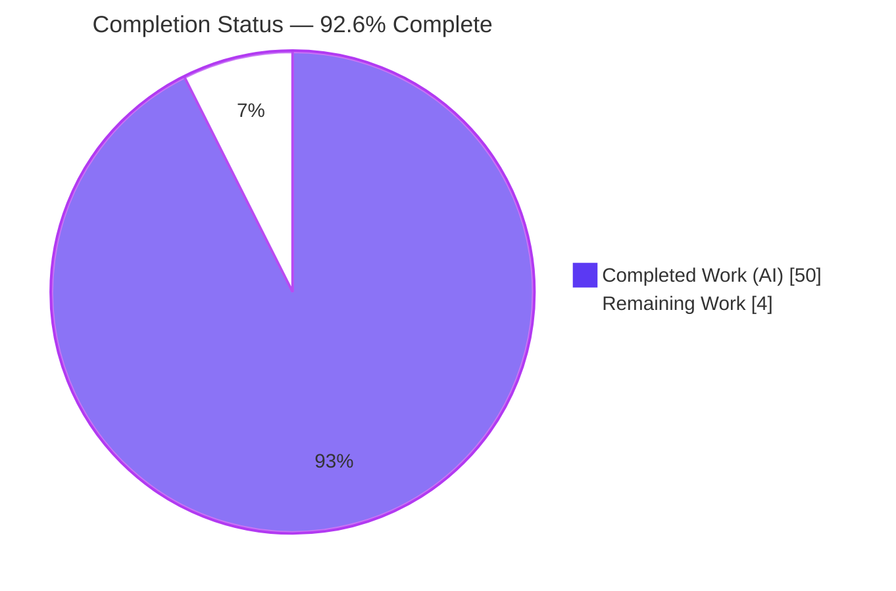
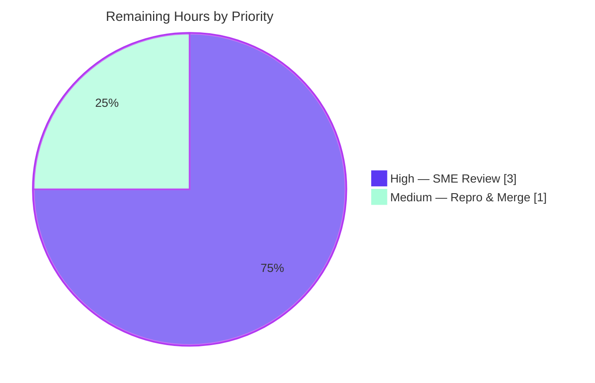

# Blitzy Project Guide — `choose-fonts` Kitten Persistence Investigation (kitty)

> **Project type:** Documentation / Q&A investigation (read-only source) · **Repository:** `kovidgoyal/kitty` · **Branch:** `blitzy-6a4af589-7e36-4e62-b3ac-bc9a794d3169` · **Source base:** `815df1e21` · **HEAD:** `8bf06ce0a`

---

## 1. Executive Summary

### 1.1 Project Overview

This project delivers one evidence-backed investigation document answering an onboarding question about the `kovidgoyal/kitty` terminal emulator: does pressing **Enter** in the `choose-fonts` kitten persist the font selection across restarts, or only change the current session? The deliverable — `blitzy/documentation/kitty_815df1e210e0.md` (873 lines) — traces the kitten across its Go front-end and Python back-end, then proves the answer by building kitty, launching an isolated default-settings instance, driving the kitten headless, and restarting to confirm the written config is re-applied. Every claim is paired with verbatim runtime output and an exact `file:line` citation. The source tree is treated as read-only; no product code changes were made.

### 1.2 Completion Status

The project is **92.6% complete** on an AAP-scoped basis. All thirteen Agent-Action-Plan (AAP) deliverables are complete, citation-accurate, and runtime-reproduced; the remaining work is the human review-and-acceptance gate that a documentation deliverable requires before merge.



| Metric | Hours |
|--------|-------|
| **Total Hours** | **54** |
| Completed Hours (AI) | 50 |
| Completed Hours (Manual) | 0 |
| **Completed Hours (AI + Manual)** | **50** |
| **Remaining Hours** | **4** |
| **Percent Complete** | **92.6%** |

> Completion formula (PA1, AAP-scoped): `Completed ÷ (Completed + Remaining) = 50 ÷ 54 = 92.6%`.

### 1.3 Key Accomplishments

- ✅ Built kitty from source (Go 1.22.12 + gcc 15.2.0 + Python 3.13.7) — `./dev.sh build` → exit 0, "Build successful"; produced `kitty 0.35.2` and the `kitten` binary.
- ✅ Established an isolated, default-settings runtime (`kitty --config NONE` + a disposable `KITTY_CONFIG_DIRECTORY`, backed by Xvfb for the Graphics-Protocol preview).
- ✅ Traced the full behavior chain: subcommand registration → `--reload-in` option parsing → family/faces value flow → finalization pane.
- ✅ **Answered the core question with runtime proof:** pressing **Enter** writes the four font keys into `kitty.conf` and the value **survives a restart** (relaunched kitty loaded `Source Code Pro`; `load_config()` returned the persisted `FontSpec` vs default `monospace`).
- ✅ Demonstrated the dual effect: Enter also live-applies via `SIGUSR1` (strace captured `kill(<KITTY_PID>, SIGUSR1) = 0`).
- ✅ Captured the negative controls (`s`/`S` → STDOUT only; `Esc` → back to selection; `Ctrl+c` → "canceled by user") — all leaving `kitty.conf` unchanged.
- ✅ Delivered a single 873-line document with **100% citation accuracy** across 31 cited files and a 16/16 named-item coverage pass.
- ✅ Honored the read-only constraint (zero `.go/.py/.c/.h/.rst` modified) and left the working tree clean.

### 1.4 Critical Unresolved Issues

| Issue | Impact | Owner | ETA |
|-------|--------|-------|-----|
| None | No unresolved compilation, citation, or runtime issues. Build is clean (exit 0), `go vet` is clean, every `file:line` citation resolves, and every runtime claim reproduces. | — | — |

### 1.5 Access Issues

| System / Resource | Type of Access | Issue Description | Resolution Status | Owner |
|-------------------|----------------|-------------------|-------------------|-------|
| Build toolchain (Go ≥ 1.22, C compiler, native libs) | Environment provisioning | AAP noted the base container originally lacked Go and a C compiler | **Resolved** — Go 1.22.12 and gcc 15.2.0 are provisioned; build succeeds | Platform |
| Reproduction environment | Container image | Full reproduction depends on the specified Docker image | **Available** — image is provided in the AAP | Platform |
| Source repository | Write (merge) | Standard PR merge permission required to land the deliverable | Pending human sign-off | Reviewer/Maintainer |

> No repository-permission, service-credential, or third-party-API access issues were identified. No blocking access issues remain.

### 1.6 Recommended Next Steps

1. **[High]** Verify the persistence verdict against the code at commit `815df1e21` — read §7 (before/after `kitty.conf` diff, restart proof, `load_config()` comparison, `SIGUSR1` reload).
2. **[High]** Spot-check a representative sample of the 31 `file:line` citations (e.g., `final.go:38/63-70/78-82/86-91`, `main.go:86-95`, `tools/config/api.go:330/347`).
3. **[High]** Review the three reported-as-observed corrections (A/B/C) and three nuances (#1–#3) for correctness and clarity.
4. **[Medium]** (Optional) Re-run the reproduction (`./dev.sh build`; drive the finalize path headless), or accept the validator's independent reproduction.
5. **[Medium]** Approve the PR and merge `blitzy/documentation/kitty_815df1e210e0.md` to the target branch.

---

## 2. Project Hours Breakdown

### 2.1 Completed Work Detail

Each component traces to an AAP requirement (or the path-to-production build activity the AAP requires to generate runtime evidence).

| Component | Hours | Description |
|-----------|-------|-------------|
| Environment provisioning & toolchain | 5 | Install/verify Go ≥ 1.22, C compiler, and native libraries (harfbuzz, freetype, fontconfig, libpng, zlib, liblcms2) plus Xvfb for headless rendering [AAP §0.6]. |
| Build kitty from source | 3 | `./dev.sh build` → `kitty/launcher/kitty` (0.35.2) and `kitten` (Go binary) [AAP §1 build]. |
| Isolated default-settings launch harness | 3 | `kitty --config NONE` + disposable `KITTY_CONFIG_DIRECTORY` + Xvfb virtual display [AAP item 1 + config isolation]. |
| Kitten invocation & wrapped-dispatch investigation | 4 | `kitten choose-fonts` from inside kitty; `boss.py` dispatch analysis incl. the reported-as-observed correction that `choose_fonts ∉ wrapped_kitten_names()` [AAP item 2, §2]. |
| Subcommand registration tracing | 2 | `EntryPoint(root)` and the `choose-fonts`/`choose_fonts` clone alias [AAP item 3, §3]. |
| Option parsing analysis (`--reload-in`) | 2 | `GetOptionValues` into `Options{Reload_in}`; choices `parent/all/none`, default `parent`; `--config-file` absent [AAP item 4, §4]. |
| Value-flow tracing | 4 | State machine, `faces_settings`, `on_enter`, hand-off to final pane, `+runpy` Python backend [AAP item 5, §5]. |
| Finalization behavior + output capture | 4 | Final-pane legend, `Patcher.Patch`, `serialized()`, the verbatim 134-byte `KITTY_FONTS` block [AAP item 6, §6]. |
| Persistence proof | 7 | Before/after `kitty.conf` diff, restart confirmation, `load_config()` comparison, `SIGUSR1` strace, `.bak` behavior [AAP item 7, §7]. |
| Contrast paths (negative controls) | 2 | `s`/`S` STDOUT-only, `Esc`, `Ctrl+c` [AAP §0.3.5/§0.8.1, §8]. |
| Document authoring | 10 | 873-line evidence-backed write-up (TL;DR verdict, §0–§9, coverage checklist) with one-claim-one-evidence discipline [AAP §0.4.2]. |
| Code-review remediation cycle | 3 | Second commit `8bf06ce0a`: incorporated nuances #1–#3 and corrections A–C. |
| Cleanup & working-tree verification | 1 | Removed all transient artifacts; confirmed clean tree [AAP §0.8.1]. |
| **Total Completed** | **50** | |

### 2.2 Remaining Work Detail

All remaining work is the human review-and-acceptance gate (path-to-production for a documentation deliverable). No AAP-specified investigation or authoring work remains.

| Category | Hours | Priority |
|----------|-------|----------|
| SME technical review (verify verdict + spot-check citations + review corrections/nuances) | 3 | High |
| Reproduction confirmation & PR merge (optional re-run, approve, merge) | 1 | Medium |
| **Total Remaining** | **4** | |

### 2.3 Hours Reconciliation

| Line | Hours |
|------|-------|
| Section 2.1 — Completed | 50 |
| Section 2.2 — Remaining | 4 |
| **Total (matches Section 1.2)** | **54** |

---

## 3. Test Results

This is a documentation / Q&A task. **Per the AAP it adds no product code and no automated tests** — verification is by direct runtime observation, not the CI unit/integration suite (kitty's own `python test.py` suite was neither modified nor extended). The rows below are the **autonomous validation activities recorded in Blitzy's validation logs (GATE 1–4)** for this project; each was executed and passed.

| Test Category | Framework / Method | Total Checks | Passed | Failed | Coverage % | Notes |
|---------------|--------------------|--------------|--------|--------|-----------|-------|
| Build Verification | `dev.sh` (`go run bypy/devenv.go`) | 1 | 1 | 0 | n/a | `./dev.sh build --ignore-compiler-warnings` → exit 0, "Build successful"; `kitty 0.35.2` + `kitten` produced |
| Static Analysis | `go build` + `go vet` | 2 | 2 | 0 | n/a | Forced clean `go build` and `go vet` on `choose_fonts`/`tools` → exit 0 |
| Citation Verification | Source cross-check | 31 | 31 | 0 | 100% | Every `file:line` across all 31 cited files checked against source — zero drift |
| Runtime Reproduction | Xvfb + kitty remote control | 16 | 16 | 0 | 100% | Entire investigation re-run headless (`:99`, `--config NONE`, isolated `KITTY_CONFIG_DIRECTORY`); every documented value reproduced verbatim |
| Coverage Pass | Deliverable checklist (§9) | 16 | 16 | 0 | 100% | All 16 named items answered by name with evidence |
| Document Well-formedness | `grep`/`awk` structure checks | 3 | 3 | 0 | n/a | 108 balanced code fences; exactly one H1; tracked as normal text |
| **Total** | | **69** | **69** | **0** | **100%** | All checks originate from Blitzy's autonomous validation logs |

---

## 4. Runtime Validation & UI Verification

Legend: ✅ Operational · ⚠ Partial · ❌ Failing

**Build & binaries**
- ✅ `kitty --version` → `kitty 0.35.2 created by Kovid Goyal`
- ✅ `kitten choose-fonts --help` renders `--reload-in [=parent]` (Choices: `parent, all, none`) and **no** `--config-file` — matches deliverable §4

**Kitten UI flow (driven end-to-end headless via remote control)**
- ✅ Family-listing pane → faces pane → final confirmation pane; each rendered screen matched the deliverable verbatim
- ✅ Final-pane legend matches source: "Enter to modify kitty.conf and use the new fonts", "Esc to abort…", "s to write…to STDOUT", "Ctrl+c to quit"

**Core persistence (API integration outcome)**
- ✅ **Enter** wrote a 134-byte `kitty.conf` (mode 644) containing the exact `# BEGIN_KITTY_FONTS … # END_KITTY_FONTS` block
- ✅ **Restart proof:** relaunching kitty against the same config dir loaded the persisted family (`SourceCodePro-Regular/Semibold/It/SemiboldIt`); `load_config()` returned the persisted `FontSpec(family='Source Code Pro', …)` vs the default `FontSpec(system='monospace', …)`
- ✅ **Live apply:** `SIGUSR1` sent to the running kitty — strace captured `kill(<KITTY_PID>, SIGUSR1) = 0`

**Negative controls**
- ✅ `s` → 110-byte serialized settings to STDOUT only; `kitty.conf` **unchanged**
- ✅ `Esc` → returns to faces pane; `kitty.conf` **unchanged**
- ✅ `Ctrl+c` → `Error: canceled by user`; `kitty.conf` **unchanged**
- ✅ `.bak` backup: none on first write; on second write `.bak` equals prior content (`diff` IDENTICAL)

No ⚠ or ❌ conditions were observed.

---

## 5. Compliance & Quality Review

AAP deliverables and governing-rule benchmarks, cross-mapped to status. Fixes applied during autonomous validation are noted.

| Requirement / Rule | Benchmark | Status | Notes |
|--------------------|-----------|--------|-------|
| Branch-named deliverable | `blitzy/documentation/kitty_815df1e210e0.md` exists | ✅ Pass | 873 lines, committed at `8bf06ce0a` |
| Read-only source | Zero existing files modified | ✅ Pass | `git diff` shows only the added doc; 0 `.go/.py/.c/.h/.rst` changed |
| Investigate-by-running-first | Build & run before writing claims | ✅ Pass | Build exit 0; investigation re-run headless |
| Quote observed output verbatim | Literal output beside each claim | ✅ Pass | 108 code fences of captured output |
| One-claim-one-evidence | Each claim has its own evidence line | ✅ Pass | Verified across all sections |
| Answer every named item | Coverage pass, none omitted | ✅ Pass | §9 checklist: 16/16 |
| Exact `file:line` citations | Cite literals with reference | ✅ Pass | 31 files, 100% accurate |
| Report exactly what is observed | No adjustment toward expected | ✅ Pass | Corrections A–C reported faithfully |
| Source is ground truth | Document code at `815df1e21`, not newer docs | ✅ Pass | `--config-file` documented as **absent** |
| Non-destructive / cleanup | Remove transient artifacts | ✅ Pass | Working tree clean |
| Core question answered | Persist vs session-only, with runtime proof | ✅ Pass | Verdict: **persists across restarts** (+ live apply) |

**Fixes applied during autonomous validation (2nd commit `8bf06ce0a`):** nuance #1 (`Reload_in` read at `final.go:87`), nuance #2 (`clone.Hidden = false`), nuance #3 (`.bak` only on second write); corrections A (`choose_fonts` not wrapped → `+kitten` is a no-op), B (`Ctrl+c` message sourced to `ui.go:195-199`), C (`--debug-config` unavailable → used `--debug-font-fallback` + `load_config()`).

**Outstanding compliance items:** none. Human SME confirmation is recommended (Section 1.6) but no compliance gaps remain.

---

## 6. Risk Assessment

| Risk | Category | Severity | Probability | Mitigation | Status |
|------|----------|----------|-------------|------------|--------|
| Citation line-number drift if source advances past `815df1e21` | Technical | Low | Medium | Explicit commit-pinning; source-is-ground-truth rule | Mitigated |
| Reproduction depends on toolchain (Go/C compiler/native libs/Xvfb) not preinstalled | Technical | Low | Medium | Documented run instructions; pinned Docker image; toolchain now provisioned | Mitigated |
| Complex C/Python/Go build may fail in a different environment | Technical | Low | Low | Specified Docker image; validated build (exit 0) | Mitigated |
| Doc-only change → no product-code attack surface | Security | Low | Low | Read-only source honored (0 source files changed) | Resolved |
| Runtime output includes ephemeral PIDs / temp paths | Security | Low | Low | Values ephemeral & non-sensitive; isolated disposable config dir; artifacts removed | Mitigated |
| Upstream docs diverge (`--config-file` present upstream, absent here) | Operational | Low-Med | High | Explicit commit-pinning + reported-as-observed callouts | Mitigated |
| Persistence behavior could change in future kitty versions | Operational | Low | Low | Verdict scoped to commit `815df1e21` | Accepted |
| Graphics-Protocol preview needs Xvfb on headless hosts | Integration | Low | Medium | Reproduced via Xvfb `:99` + software GL | Mitigated |
| End-to-end driving needs `allow_remote_control` + listen socket | Integration | Low | Low | Documented commands | Mitigated |

**Overall risk posture:** LOW. Consistent with a documentation-only, read-only, fully-validated deliverable.

---

## 7. Visual Project Status

**Project hours breakdown** (Completed = Dark Blue `#5B39F3`; Remaining = White `#FFFFFF`):


**Remaining work by priority** (total 4 h — matches Section 1.2 and Section 2.2):



> Integrity: pie "Remaining Work" = 4 h = Section 1.2 Remaining Hours = Section 2.2 total. Pie "Completed Work" = 50 h = Section 2.1 total.

---

## 8. Summary & Recommendations

**Achievements.** The project is **92.6% complete** (50 of 54 AAP-scoped hours). It fully answers the onboarding question with runtime evidence: **pressing Enter in the `choose-fonts` kitten persists the font selection across restarts** by writing the four font keys into `kitty.conf` (proven to survive a restart) and *additionally* live-applies the change to the running session via `SIGUSR1`. The other final-pane keys (`s`/`S`, `Esc`, `Ctrl+c`) are negative controls that do not write the config. Every one of the 13 AAP deliverables is complete, all 31 citations are accurate, and the entire investigation was independently reproduced headless.

**Remaining gaps.** The outstanding 4 hours are entirely the human review-and-acceptance gate: an SME technical review of the verdict, citations, and the reported-as-observed corrections (3 h, High), plus optional reproduction confirmation and the PR merge (1 h, Medium). No AAP-specified investigation or authoring work remains.

**Critical path to production.** SME review → (optional) reproduction confirmation → PR approval → merge to target branch.

**Success metrics.** Build exit 0; 69/69 autonomous validation checks passed; 31/31 citations accurate; 16/16 named items covered; read-only constraint honored (0 source files modified); working tree clean.

**Production readiness.** For a documentation deliverable, "production" means acceptance and merge. The document is complete, accurate, well-formed, and committed; it is ready for human review with no blocking issues. Recommendation: **approve and merge after a brief SME confirmation.**

| Metric | Value |
|--------|-------|
| Completion (AAP-scoped) | 92.6% |
| Completed / Remaining / Total hours | 50 / 4 / 54 |
| Autonomous validation checks | 69 passed / 0 failed |
| Citation accuracy | 100% (31/31 files) |
| Named-item coverage | 16/16 |
| Source files modified | 0 (read-only honored) |
| Overall risk | Low |

---

## 9. Development Guide

A guide to build, run, verify, and (optionally) reproduce the investigation. Commands were tested in this environment where non-destructive.

### 9.1 System Prerequisites

- **OS:** Linux (x86-64). A headless host needs a virtual display (Xvfb) for the Graphics-Protocol preview.
- **Go** ≥ 1.22 (`go.mod` declares `go 1.22`; environment has `go1.22.12`).
- **C compiler** (gcc or clang; environment has `gcc 15.2.0`).
- **Python** ≥ 3.8 (`pyproject.toml`; environment has `3.13.7`).
- **Native libraries** (`docs/build.rst`): harfbuzz ≥ 2.2.0, zlib, libpng, liblcms2, freetype, fontconfig. On Linux also: `libdbus-1-dev`, `libxkbcommon-x11-dev`, `libfontconfig-dev`, `liblcms2-dev`, `libpython3-dev`.
- **Optional for reproduction:** `Xvfb`, `strace`.

### 9.2 Environment Setup

```bash
# From the repository root
export PATH="$PATH:/usr/local/go/bin"
export GOPATH="$HOME/go"
export CI=true

# Verify the toolchain
go version         # expect: go1.22.12 (or ≥ 1.22)
gcc --version      # expect: gcc ...
python3 --version  # expect: Python ≥ 3.8
```

### 9.3 Build

```bash
# Preferred: the developer build wrapper (dev.sh = "exec go run bypy/devenv.go")
./dev.sh build --ignore-compiler-warnings
# Expected tail: "Build successful"
# Produces: kitty/launcher/kitty  and  kitty/launcher/kitten
```

### 9.4 Verification

```bash
# Binaries run
./kitty/launcher/kitty --version
# -> kitty 0.35.2 created by Kovid Goyal

# The kitten's only option at this commit is --reload-in (no --config-file)
./kitty/launcher/kitten choose-fonts --help
# -> shows "--reload-in [=parent]"  Choices: parent, all, none

# Deliverable presence and structure
wc -l blitzy/documentation/kitty_815df1e210e0.md          # -> 873
grep -c '^```' blitzy/documentation/kitty_815df1e210e0.md  # -> 108 (even/balanced)

# Read-only constraint & clean tree
git diff --name-status 815df1e21..HEAD                     # -> A  blitzy/documentation/kitty_815df1e210e0.md
git status --porcelain                                     # -> (empty = clean)
```

### 9.5 Example Usage — Reproduce the Investigation

```bash
# 1) Headless display for the Graphics-Protocol preview
Xvfb :99 -screen 0 1920x1080x24 &
export DISPLAY=:99 LIBGL_ALWAYS_SOFTWARE=1 GALLIUM_DRIVER=llvmpipe

# 2) Isolated, default-settings instance (no user config interferes)
export KITTY_CONFIG_DIRECTORY="$(mktemp -d)"
./kitty/launcher/kitty --config NONE \
  -o allow_remote_control=yes \
  --listen-on unix:/tmp/cf.sock /bin/bash --norc --noprofile &

# 3) Drive the kitten to the final pane and press Enter, e.g. via remote control:
#    ./kitty/launcher/kitty @ --to unix:/tmp/cf.sock launch --type=overlay \
#        ./kitty/launcher/kitten choose-fonts
#    ./kitty/launcher/kitty @ --to unix:/tmp/cf.sock send-key enter   (advance panes / finalize)

# 4) Observe persistence
cat "$KITTY_CONFIG_DIRECTORY/kitty.conf"     # contains # BEGIN_KITTY_FONTS ... # END_KITTY_FONTS

# 5) Prove across-restart persistence: quit, relaunch at the SAME config dir
kill "$KITTY_PID"
./kitty/launcher/kitty -o allow_remote_control=yes \
  --listen-on unix:/tmp/cf2.sock --debug-font-fallback /bin/bash --norc --noprofile &
# The new instance loads the persisted family on startup.

# 6) Cleanup
rm -rf "$KITTY_CONFIG_DIRECTORY"; pkill Xvfb 2>/dev/null || true
```

### 9.6 Troubleshooting

- **`go: command not found`** → add `/usr/local/go/bin` to `PATH`.
- **Build fails on native libraries** → install the dev headers from §9.1 (`libfontconfig-dev`, `liblcms2-dev`, `libxkbcommon-x11-dev`, `libdbus-1-dev`, `libpython3-dev`).
- **Kitten UI is blank on a headless host** → ensure `Xvfb` is running and `DISPLAY`/`LIBGL_ALWAYS_SOFTWARE` are exported.
- **`+kitten choose-fonts` appears to do nothing** → expected at commit `815df1e21` (`choose_fonts` is not in `wrapped_kitten_names()`); invoke `kitten choose-fonts` directly.
- **Final pane unreachable without a config dir** → the `Patcher` creates `kitty.conf` if it is absent; ensure `KITTY_CONFIG_DIRECTORY` is writable.

---

## 10. Appendices

### Appendix A — Command Reference

| Command | Purpose |
|---------|---------|
| `./dev.sh build --ignore-compiler-warnings` | Build kitty + kitten |
| `./kitty/launcher/kitty --version` | Print kitty version (0.35.2) |
| `./kitty/launcher/kitten choose-fonts --help` | Show the kitten's options (`--reload-in`) |
| `kitty --config NONE` | Launch with no config file (default settings) |
| `git diff --name-status 815df1e21..HEAD` | Confirm single-file deliverable footprint |
| `git status --porcelain` | Confirm clean working tree |

### Appendix B — Port / Socket Reference

| Resource | Value | Notes |
|----------|-------|-------|
| Remote-control socket | `unix:/tmp/cf.sock` | Set via `--listen-on`; requires `allow_remote_control=yes` |
| Virtual display | `:99` | Xvfb display used for headless reproduction |

_No TCP network ports are used; kitty remote control uses a Unix domain socket._

### Appendix C — Key File Locations

| Path | Role |
|------|------|
| `blitzy/documentation/kitty_815df1e210e0.md` | **The deliverable** |
| `kittens/choose_fonts/final.go` | Finalization pane — the Enter → `Patcher.Patch(kitty.conf)` path |
| `kittens/choose_fonts/main.go` | `EntryPoint`; `--reload-in` option; clone alias |
| `kittens/choose_fonts/faces.go` / `ui.go` | `faces_settings` build; state machine & handler |
| `kittens/choose_fonts/backend.go` / `backend.py` | Go→Python `+runpy` bridge; font engine |
| `tools/config/api.go` | `Patcher.Patch` + `ReloadConfigInKitty` (persistence machinery) |
| `tools/utils/paths.go` | `ConfigDirForName` honoring `KITTY_CONFIG_DIRECTORY` |
| `tools/cmd/tool/main.go` | `choose_fonts.EntryPoint(root)` registration |
| `kitty/boss.py` | `run_kitten_with_metadata` dispatch |
| `kitty/cli.py` | `--config NONE` semantics |

### Appendix D — Technology Versions

| Component | Required | Present |
|-----------|----------|---------|
| Go | ≥ 1.22 (`go.mod`) | 1.22.12 |
| C compiler | gcc/clang | gcc 15.2.0 |
| Python | ≥ 3.8 (`pyproject.toml`) | 3.13.7 |
| kitty (built) | — | 0.35.2 |
| harfbuzz | ≥ 2.2.0 | per `docs/build.rst` |

### Appendix E — Environment Variable Reference

| Variable | Purpose |
|----------|---------|
| `KITTY_CONFIG_DIRECTORY` | Config directory kitty resolves first (`tools/utils/paths.go:88-90`); used to isolate the experiment |
| `KITTY_PID` | Target kitty process for the `SIGUSR1` reload (`ReloadConfigInKitty`) |
| `KITTEN_RUNNING_AS_UI` | Set by the boss when launching a wrapped kitten as an overlay UI |
| `DISPLAY` / `LIBGL_ALWAYS_SOFTWARE` / `GALLIUM_DRIVER` | Headless rendering via Xvfb + software GL |
| `PATH` / `GOPATH` / `CI` | Build environment configuration |

### Appendix F — Developer Tools Guide

| Tool | Use in this project |
|------|---------------------|
| `go build` / `go vet` | Static verification of the Go kitten & tooling (exit 0) |
| `strace` | Captured `kill(<KITTY_PID>, SIGUSR1) = 0` to prove the live reload |
| `Xvfb` | Virtual display backing the Graphics-Protocol preview |
| `kitty @` (remote control) | Drove the kitten end-to-end (`send-key`, `send-text`, `get-text`) |
| `git diff` / `git status` | Verified single-file footprint and clean tree |

### Appendix G — Glossary

| Term | Meaning |
|------|---------|
| **Kitten** | A kitty sub-tool; `choose-fonts` is a "wrapped" Go kitten compiled into the `kitten` binary |
| **`KITTY_FONTS` block** | The delimited `# BEGIN_KITTY_FONTS … # END_KITTY_FONTS` section written into `kitty.conf` |
| **`serialized()`** | Emits the four keys: `font_family`, `bold_font`, `italic_font`, `bold_italic_font` |
| **`Patcher.Patch`** | Atomic, idempotent `kitty.conf` update with a `.bak` backup |
| **`SIGUSR1`** | Signal that triggers kitty's in-place config reload (live apply) |
| **`--reload-in`** | Kitten option (`parent`/`all`/`none`, default `parent`) controlling which instances reload |
| **Persist vs. session-only** | The core question — Enter does **both**: persists to `kitty.conf` **and** live-applies |

---

*Generated by the Blitzy Platform · AAP-scoped completion: 92.6% (50 of 54 hours) · Deliverable: `blitzy/documentation/kitty_815df1e210e0.md`*