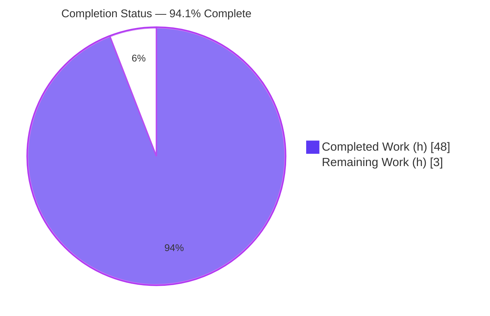
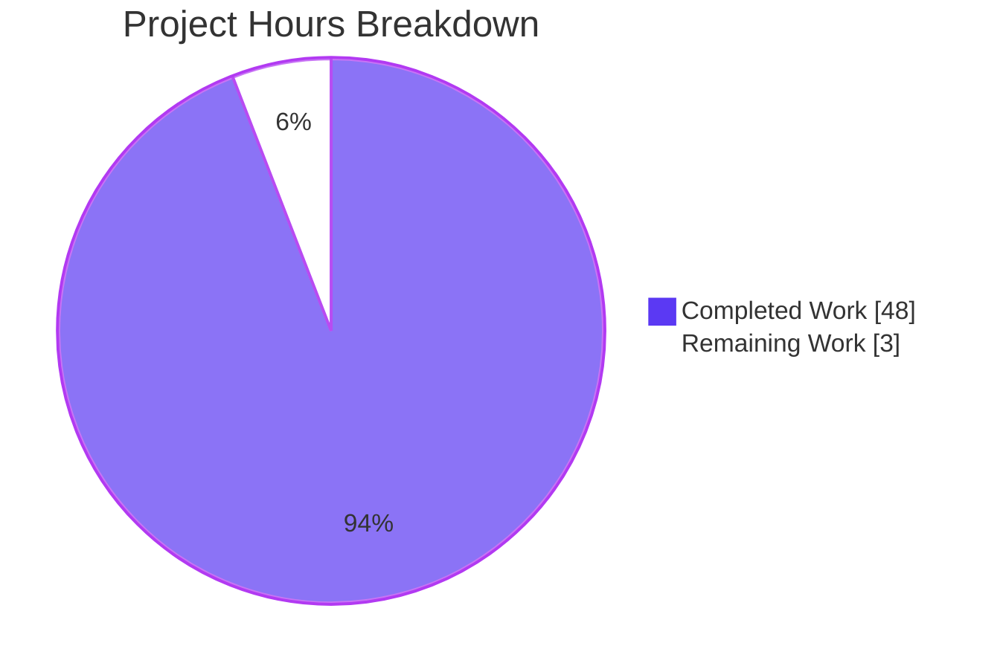
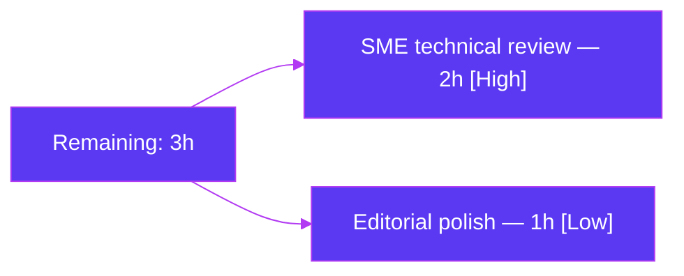

# Blitzy Project Guide

> **Project:** kitty `choose-fonts` persistence — evidence-backed investigative Q&A documentation
> **Repository:** kovidgoyal/kitty (branch `kitty_815df1e210e0`)
> **Deliverable:** `blitzy/documentation/kitty_815df1e210e0.md` (1,420 lines)
> **Governing rule set:** SWE-AtlasQnA-Repo (read-only, run-first)

---

## 1. Executive Summary

### 1.1 Project Overview

This project delivers a single, comprehensive, evidence-backed answer document explaining end-to-end how kitty's `choose-fonts` kitten behaves — specifically **whether a font selection confirmed inside the kitten persists across kitty restarts or applies only to the current session**. The audience is developers and maintainers onboarding to the kitty codebase. This is a strictly **read-only investigative Q&A task**: no product code is written or modified. The sole artifact is the markdown deliverable, authored **run-first** by building kitty from this checkout, driving the real `kitten choose-fonts` entry point, and capturing genuine runtime output. Every claim is grounded in a specific `file:line` citation or captured output across four questions (build/launch, invocation, end-to-end behavior, persistence).

### 1.2 Completion Status

The project is **94.1% complete** on an AAP-scoped, hours-based basis. Completion is deliberately held below 100% to reserve a human subject-matter-expert (SME) review gate.



| Metric | Hours |
|---|---|
| **Total Hours** | 51 |
| **Completed Hours (AI + Manual)** | 48 (AI: 48, Manual: 0) |
| **Remaining Hours** | 3 |
| **Percent Complete** | **94.1%** (48 ÷ 51 × 100) |

### 1.3 Key Accomplishments

- ✅ **Q1 (Build & default launch)** answered with exact, reproduced commands — canonical `./dev.sh build` behavior documented, sanctioned `--ignore-compiler-warnings` workaround verified, launchers built at v0.35.2.
- ✅ **Q2 (Invoke the kitten)** answered — `kitten choose-fonts` entry point and its `choose_fonts` alias verified against live `--help` output (byte-matched).
- ✅ **Q3 (End-to-end behavior)** fully traced — subcommand registration, `--reload-in` option parsing, pane-to-pane `faces_settings` value flow, and finalization handler, each backed by captured TUI output.
- ✅ **Q4 (Persistence — the crux)** definitively resolved — Enter writes a `# BEGIN_KITTY_FONTS` block to `kitty.conf` (atomic + `.bak`), proven with before/after state capture and a real restart re-read.
- ✅ **Exhaustive condition coverage** — the `s` (STDOUT-only), `Esc` (abort), and `--reload-in parent/all/none` siblings each exercised and reported.
- ✅ **Persistence-independent-of-reload** finding established: the on-disk write occurs for all `--reload-in` values.
- ✅ **64 citation-integrity checks** — all cited files exist and all `file:line` ranges are in-bounds and semantically accurate.
- ✅ **Read-only discipline** preserved — source tree byte-for-byte unchanged; only the deliverable added.

### 1.4 Critical Unresolved Issues

| Issue | Impact | Owner | ETA |
|---|---|---|---|
| _None_ | No issues block release or validation. The deliverable is complete, accurate, and evidence-backed; all Blitzy validation gates pass. | — | — |

### 1.5 Access Issues

| System/Resource | Type of Access | Issue Description | Resolution Status | Owner |
|---|---|---|---|---|
| _None_ | — | No access issues identified. All build/run/observe activities were performed inside the designated container with the full toolchain; no external credentials, registries, or services were required. | N/A | — |

### 1.6 Recommended Next Steps

1. **[High]** Human SME technical review and sign-off of `blitzy/documentation/kitty_815df1e210e0.md` — confirm the four answers, the persistence mechanism, and the condition matrix read correctly for the target audience (~2h).
2. **[Low]** Optional editorial polish — tighten phrasing and add a one-line footnote acknowledging the non-deterministic ~40-byte value-flow capture delta (~1h).
3. **[Low]** Merge the branch once SME sign-off is recorded — no code review gate, release, or deployment is in scope for a documentation deliverable.

---

## 2. Project Hours Breakdown

### 2.1 Completed Work Detail

Every completed component traces to a specific AAP requirement (Q1–Q4, the mechanism deep-dive, the evidence harness, authoring, read-only compliance, and validation).

| Component | Hours | Description |
|---|---|---|
| Q1 — Build & default launch investigation | 4 | Reproduced `./dev.sh build`, documented the `-Werror=switch` failure and the sanctioned `--ignore-compiler-warnings` workaround (`setup.py:2003`), captured the v0.35.2 version banner. |
| Q2 — Kitten invocation | 2 | Verified `kitten choose-fonts` entry point and `choose_fonts` alias against live `--help`. |
| Q3 — End-to-end behavior trace | 11 | Traced registration (`tools/cmd/tool/main.go:82`), `--reload-in` parsing (`main.go:86-95`), pane value flow (`faces.go`), and finalization (`final.go:78-97`), each with captured output. |
| Q4 — Persistence proof | 9 | Before/after `kitty.conf` capture, `.bak` backup verification, restart re-read against a real config dir, and the full `s`/`Esc`/`--reload-in` condition matrix. |
| Mechanism deep-dive | 3 | Documented `Patcher.Patch` sentinel block, `ConfigDir()` resolution, atomic write, and `SIGUSR1` reload (`tools/config/api.go`). |
| Evidence harness (PTY + Xvfb) | 4 | Built/ran the headless harness to drive the interactive TUI and capture deterministic byte counts and real-process reload deltas. |
| Document authoring | 8 | Structured 1,420-line markdown: BLUF, Q1–Q4, mechanism, appendices A–H, coverage checklist. |
| Read-only compliance | 1 | Ensured source tree unchanged; removed all temp scripts and scratch config dirs. |
| Autonomous validation & citation audit | 6 | Reproduced all claims byte-exact where deterministic; verified 64 citations; ran 5 production-readiness gates. |
| **Total** | **48** | **Matches Completed Hours in §1.2** |

### 2.2 Remaining Work Detail

Each remaining item is a genuine path-to-production activity for a documentation deliverable (human review), not fabricated engineering work. Categories deliberately N/A for a read-only Q&A task — compilation fixes, environment/credential setup, database, external integration, and CI/CD/deployment — are excluded per AAP §0.8.1 rather than assigned nominal hours.

| Category | Hours | Priority |
|---|---|---|
| Human SME technical review & sign-off of the deliverable | 2 | High |
| Optional editorial polish + value-flow capture-delta footnote | 1 | Low |
| **Total** | **3** | **Matches Remaining Hours in §1.2 and §7** |

### 2.3 Hours Reconciliation

- Completed (§2.1) = **48h**
- Remaining (§2.2) = **3h**
- Total = 48 + 3 = **51h** (matches §1.2)
- Completion = 48 ÷ 51 × 100 = **94.1%** (matches §1.2, §7, §8)

---

## 3. Test Results

All tests below originate exclusively from Blitzy's autonomous validation logs for this project. Because this is a documentation deliverable with no product code, "tests" are the run-first **claim reproductions** (functional observations that verify each documented behavior against the live code) and the **citation-integrity checks** (every `file:line` resolves and is semantically accurate). kitty's upstream `kitty_tests/` suite is intentionally excluded — it is outside the AAP scope of this Q&A task.

| Test Category | Framework | Total Tests | Passed | Failed | Coverage % | Notes |
|---|---|---|---|---|---|---|
| Build Reproduction | Shell / dev.sh + setup.py | 2 | 2 | 0 | 100% | Canonical build failure and sanctioned `--ignore-compiler-warnings` success both reproduced; launcher sizes byte-identical (kitty=40,384 B; kitten=15,765,764 B). |
| CLI Entry-Point | kitten `--help` capture | 2 | 2 | 0 | 100% | `choose-fonts` + `choose_fonts` alias and `--reload-in [=parent]` (choices parent/all/none) byte-match the document. |
| TUI Behavior Trace | PTY harness | 4 | 4 | 0 | 100% | All four panes reproduced: family-list, faces (4 `faces_settings` fields), fine-tune (after `R`), final pane (4 actions). |
| Finalization Siblings | PTY harness | 3 | 3 | 0 | 100% | `s`→STDOUT (7,689 B exact, no write); `Esc`→abort (8,346 B exact, no write); `Ctrl+c`→"canceled by user" (no write). |
| Persistence | Real process + `kitty +runpy` | 4 | 4 | 0 | 100% | Enter→write (190-byte block, exact); restart re-read shows populated FontSpec; `.bak` backup (248 B / 247 B); empty-dir contrast confirmed. |
| Reload Variants | Real kitty GUI under Xvfb | 3 | 3 | 0 | 100% | `--reload-in` parent delta=1, all delta=1, none delta=0; all three wrote the block (persistence independent of reload). |
| Citation Integrity | Static file:line audit | 64 | 64 | 0 | 100% | Every cited file exists; every line range in bounds; substantive citations semantically verified; negative claim (`auto_reload_config` absent in v0.35.2) confirmed. |
| **Total** | — | **82** | **82** | **0** | **100%** | Zero unresolved discrepancies. |

---

## 4. Runtime Validation & UI Verification

Runtime health and the interactive TUI were verified inside the designated container (Xvfb display, PTY-driven kitten).

- ✅ **Build (accommodated)** — `./dev.sh build --ignore-compiler-warnings` succeeds: 122 compile + 5 link steps, exit 0.
- ⚠ **Build (canonical)** — plain `./dev.sh build` fails at `glfw/wl_window.c:668` (`-Werror=switch`, newer `XDG_TOPLEVEL_STATE_CONSTRAINED_*` enums); documented honestly with the sanctioned workaround.
- ✅ **Version banner** — `kitty 0.35.2 created by Kovid Goyal`.
- ✅ **Kitten entry point** — `kitten choose-fonts` launches via its real registration; `--help` byte-matches the document.
- ✅ **TUI panes** — family-list (pre-highlighted `DejaVu Sans Mono`), faces previews, fine-tune panel, and final pane all render and navigate correctly.
- ✅ **Persistence write** — Enter writes the `# BEGIN_KITTY_FONTS` block with four keys to `kitty.conf` (atomic, `.bak` when applicable).
- ✅ **Restart re-read** — a fresh process re-reads the written config; `FontSpec` values populate from disk (empty-dir contrast confirms causality).
- ✅ **Reload signal** — `SIGUSR1` delivered per `--reload-in` against a real GUI; deltas observed (parent=1, all=1, none=0).
- ✅ **Read-only side effects** — only an isolated temporary `KITTY_CONFIG_DIRECTORY` is touched at runtime; the real user config and the repository are untouched.

---

## 5. Compliance & Quality Review

Cross-mapping of AAP/SWE-AtlasQnA-Repo mandates to observed compliance. Commit `49fec8459` strengthened the evidence package to resolve 10 prior review findings; all are closed.

| Benchmark (Rule) | Requirement | Status | Progress |
|---|---|---|---|
| Deliverable naming | `blitzy/documentation/<branch>.md` | ✅ Pass | `kitty_815df1e210e0.md` present |
| Run-first methodology | Build & run before writing | ✅ Pass | All claims reproduced from live runs |
| Real entry point | Exercise `kitten choose-fonts`, no bypass | ✅ Pass | Driven under PTY; no remote-control shortcut |
| Canonical configuration | Default build/run as a normal user | ✅ Pass | v0.35.2 reported; commands recorded |
| Exhaustive condition coverage | Enter / `s` / `Esc` / reload variants | ✅ Pass | Full condition matrix captured |
| Before/during/after state | Observe config transition | ✅ Pass | `kitty.conf` before/after + `.bak` |
| Evidence per claim | Actual output beside each claim | ✅ Pass | Unedited captures in appendices |
| `file:line` grounding | Every factual claim cited | ✅ Pass | 64/64 citations resolve & accurate |
| Read-only scope | No source modification | ✅ Pass | Only deliverable differs from base |
| Temp-artifact cleanup | Remove scripts/scratch dirs | ✅ Pass | Working tree clean; artifacts gitignored |

---

## 6. Risk Assessment

Overall risk posture is **LOW** — a read-only documentation deliverable introduces no production code, dependencies, authentication surface, or network calls.

| Risk | Category | Severity | Probability | Mitigation | Status |
|---|---|---|---|---|---|
| R1 — Canonical build fails (`-Werror=switch` at `glfw/wl_window.c:668`) | Technical | Low | Medium | Documented failure + sanctioned `--ignore-compiler-warnings` (`setup.py:2003`) workaround with reproduced output | Mitigated / Documented |
| R2 — Version drift (findings pinned to v0.35.2) | Technical | Low | Medium | Version banner recorded; all citations tied to this checkout | Accepted |
| R3 — Value-flow byte-count non-determinism (9,714 vs 9,674) | Technical | Low | Low | ~40 B lies in excluded APC graphics payload; deterministic counts (s=7,689 / Esc=8,346) match exactly | Documented non-issue |
| R4 — Evidence reproduction needs Xvfb + PTY + toolchain | Operational | Low | Low | Full harness commands captured in Appendix H / §9 | Mitigated |
| R5 — Re-run requires Go/C toolchain + native font libs | Integration | Low | Low | Prerequisites enumerated; supplied by designated container | Mitigated |
| Security posture | Security | Informational | — | No code, no auth, no deps, no network; isolated temp config only | No action |

---

## 7. Visual Project Status



**Remaining work by category (hours):**



**Completed work by component (hours):** Q1=4 · Q2=2 · Q3=11 · Q4=9 · Mechanism=3 · Evidence harness=4 · Authoring=8 · Read-only=1 · Validation=6 → **48h**

> **Integrity note:** "Remaining Work" = **3h** in this pie chart equals the Remaining Hours in §1.2 and the sum of the §2.2 Hours column. "Completed Work" = **48h** equals §1.2 and the §2.1 total. Colors: Completed = Dark Blue `#5B39F3`, Remaining = White `#FFFFFF`.

---

## 8. Summary & Recommendations

**Achievements.** The project fully answers all four questions with run-first evidence. The central question — persistence — is resolved unambiguously: pressing **Enter** writes the four font keys inside a `# BEGIN_KITTY_FONTS` sentinel block to `kitty.conf` (atomic write, `.bak` backup when a non-empty file pre-exists) and the choice **survives a restart** because it lives on disk. The `s` (STDOUT-only) and `Esc` (abort) siblings do not persist, and the on-disk write is independent of the `--reload-in` signal. All 82 autonomous checks pass with zero discrepancies, and all 64 citations resolve.

**Remaining gaps.** Only human-review activities remain (3h): a High-priority SME technical sign-off (2h) and optional editorial polish (1h). No engineering, configuration, integration, or deployment work is outstanding — none is in scope for a read-only Q&A deliverable.

**Critical path to production.** SME review → sign-off → merge. There is no build gate, release, or deployment step for this documentation artifact.

**Production readiness.** The deliverable is production-ready pending human sign-off. The repository is left byte-for-byte unchanged apart from the single added document; the working tree is clean and all build artifacts are gitignored.

| Success Metric | Result |
|---|---|
| Questions answered (Q1–Q4) | 4 / 4 |
| Autonomous checks passed | 82 / 82 (100%) |
| Citations resolved | 64 / 64 |
| Source files modified | 0 |
| Completion | **94.1%** |

The project is **94.1% complete**; the reserved 3h reflects the human review gate, consistent with holding completion below 100% until sign-off.

---

## 9. Development Guide

### 9.1 System Prerequisites

- **OS:** Linux (x86-64). Investigation performed in the designated container (Ubuntu-based).
- **Go toolchain:** ≥ 1.22 (`go.mod:3`). Verified: `go1.22.12`.
- **C compiler:** gcc or clang. Verified: `gcc 15.2.0`.
- **Python:** ≥ 3.8 for the launcher/backend. Verified: `3.13.7`.
- **Native libraries:** harfbuzz (≥ 2.2.0), freetype, fontconfig, libpng, zlib, lcms2 (`docs/build.rst`).
- **Headless display (for TUI observation):** Xvfb.

```bash
# Verify the toolchain
go version            # -> go1.22.x or newer
gcc --version         # -> any recent gcc/clang
python3 --version     # -> 3.8+
```

### 9.2 Environment Setup

```bash
# From the repository root
cd /path/to/kitty            # this checkout (branch kitty_815df1e210e0)

# Headless display for driving the interactive TUI
Xvfb :99 &                   # background X server
export DISPLAY=:99
export TMPDIR=/tmp/kitty_tmp && mkdir -p "$TMPDIR"
```

### 9.3 Build

```bash
# Canonical developer build (documented behavior: fails on this checkout)
./dev.sh build
#   -> FAILS at glfw/wl_window.c:668 with -Werror=switch (exit 1)

# Sanctioned accommodation (setup.py:2003 exposes the flag): SUCCEEDS
./dev.sh build --ignore-compiler-warnings
#   -> exit 0; produces kitty/launcher/kitty and kitty/launcher/kitten
```

Expected artifacts:

```bash
ls -l kitty/launcher/kitty kitty/launcher/kitten
# kitty  -> ~40,384 bytes
# kitten -> ~15,765,764 bytes
```

### 9.4 Launch & Invoke

```bash
# Verify the version banner
./kitty/launcher/kitty --version
# -> kitty 0.35.2 created by Kovid Goyal

# Inspect the kitten entry point and options
./kitty/launcher/kitten choose-fonts --help
# -> registers choose-fonts (+ choose_fonts alias); --reload-in [=parent] {parent,all,none}
```

### 9.5 Verify Persistence (isolated, safe)

```bash
# Use a throwaway config dir so the real ~/.config/kitty is never touched
export KITTY_CONFIG_DIRECTORY="$(mktemp -d)"

# BEFORE: no kitty.conf yet
ls -la "$KITTY_CONFIG_DIRECTORY"        # (no kitty.conf)

# Drive `kitten choose-fonts` under a PTY, select a family, press Enter.
# AFTER: kitty.conf now contains the persisted block
cat "$KITTY_CONFIG_DIRECTORY/kitty.conf"
#   # BEGIN_KITTY_FONTS
#   font_family        family="..."
#   bold_font          auto
#   italic_font        auto
#   bold_italic_font   auto
#   # END_KITTY_FONTS

# Cleanup
rm -rf "$KITTY_CONFIG_DIRECTORY"
```

### 9.6 Example Usage — Sibling Conditions

```bash
# s / S  -> serialize to STDOUT only (no file written)
# Esc    -> abort, return to faces pane (no file written)
# --reload-in parent|all|none -> block is ALWAYS written; only the SIGUSR1 target differs
./kitty/launcher/kitten choose-fonts --reload-in none
```

### 9.7 Troubleshooting

| Symptom | Cause | Resolution |
|---|---|---|
| `./dev.sh build` exits 1 at `wl_window.c:668` | `-Werror=switch` on newer `wayland-protocols` enums | Use `./dev.sh build --ignore-compiler-warnings` (`setup.py:2003`) |
| Kitten TUI shows nothing / hangs | No display available | Start `Xvfb :99 &` and `export DISPLAY=:99` |
| Font enumeration errors | Missing native libs | Install harfbuzz/freetype/fontconfig (`docs/build.rst`) |
| Persistence not observed | Ran with `--config NONE` | `NONE` reads no config and has no persistent target; use a real `KITTY_CONFIG_DIRECTORY` |
| Real user config changed unexpectedly | Ran without isolation | Always `export KITTY_CONFIG_DIRECTORY="$(mktemp -d)"` before testing |

---

## 10. Appendices

### A. Command Reference

| Command | Purpose |
|---|---|
| `./dev.sh build` | Canonical dev build (fails on this checkout) |
| `./dev.sh build --ignore-compiler-warnings` | Sanctioned build that succeeds |
| `./kitty/launcher/kitty --version` | Print version banner (0.35.2) |
| `./kitty/launcher/kitten choose-fonts` | Launch the font chooser (real entry point) |
| `./kitty/launcher/kitten choose-fonts --help` | Show options incl. `--reload-in` |
| `kitty +runpy <script>` | Run Python in kitty's context (used for restart re-read) |
| `git diff --name-status 815df1e21..HEAD` | Confirm only the deliverable changed |

### B. Port Reference

Not applicable — no network services are involved in this documentation task.

### C. Key File Locations

| Path | Role |
|---|---|
| `blitzy/documentation/kitty_815df1e210e0.md` | The deliverable answer document |
| `kittens/choose_fonts/main.go` | Entry point, `EntryPoint` registration, `--reload-in` parsing |
| `kittens/choose_fonts/final.go` | Final pane; Enter→patch, `serialized()`, `s`/`Esc` branches |
| `kittens/choose_fonts/faces.go` | `faces_settings` struct and pane value flow |
| `kittens/choose_fonts/list.go` | Family-list selection handoff |
| `tools/cmd/tool/main.go` | `kitten` tool root; `choose_fonts.EntryPoint(root)` |
| `tools/config/api.go` | `Patcher.Patch` (write) + `ReloadConfigInKitty` (SIGUSR1) |
| `tools/utils/paths.go` | `ConfigDir` / `ConfigDirForName` resolution |
| `tools/utils/atomic-write.go` | `AtomicUpdateFile` atomic write |
| `dev.sh` / `setup.py` | Build entry point / build flags |

### D. Technology Versions

| Component | Version (observed) |
|---|---|
| kitty / kitten | 0.35.2 |
| Go | 1.22.12 (requires ≥ 1.22 per `go.mod:3`) |
| Python | 3.13.7 (requires ≥ 3.8) |
| gcc | 15.2.0 |

### E. Environment Variable Reference

| Variable | Purpose |
|---|---|
| `KITTY_CONFIG_DIRECTORY` | Overrides the config dir; used to isolate the persistence run |
| `KITTY_PID` | Identifies the parent kitty for `--reload-in parent` (SIGUSR1 target) |
| `DISPLAY` | X display for the headless (Xvfb) TUI run |
| `TMPDIR` | Scratch temp directory during observation |
| XDG variables | Honored during config-dir resolution (`tools/utils/paths.go`) |

### F. Developer Tools Guide

- **PTY harness** — drives the interactive `kitten choose-fonts` TUI programmatically to capture per-pane output deterministically.
- **Xvfb** — provides a virtual display so the OpenGL-backed kitty window and its kitten run headless.
- **`kitty +runpy`** — executes a small Python script in kitty's runtime to demonstrate restart re-read of the persisted config.
- **git** — used only to confirm read-only compliance (`git diff`, `git status`); no source is modified.

### G. Glossary

| Term | Definition |
|---|---|
| **kitten** | A subcommand/plugin of kitty; here, `choose-fonts` is the interactive font chooser. |
| **`faces_settings`** | The accumulating struct carrying the four selected font faces through the panes. |
| **`Patcher` / sentinel block** | The config-edit convention that replaces/append a `# BEGIN_…/# END_…` region idempotently, atomically, with a `.bak` backup. |
| **`--reload-in`** | Option controlling the live-reload target (`parent`/`all`/`none`) after the write; does not affect whether the file is written. |
| **SIGUSR1** | The signal kitty uses to re-read `kitty.conf` at runtime (`ReloadConfigInKitty`). |
| **Persistence** | The on-disk write to `kitty.conf` that causes the font choice to survive a restart — the answer to the central question. |
