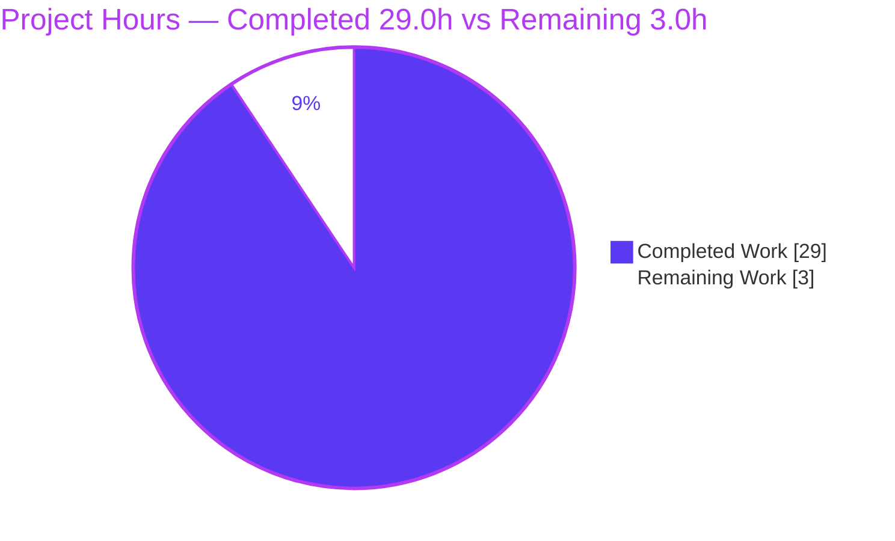
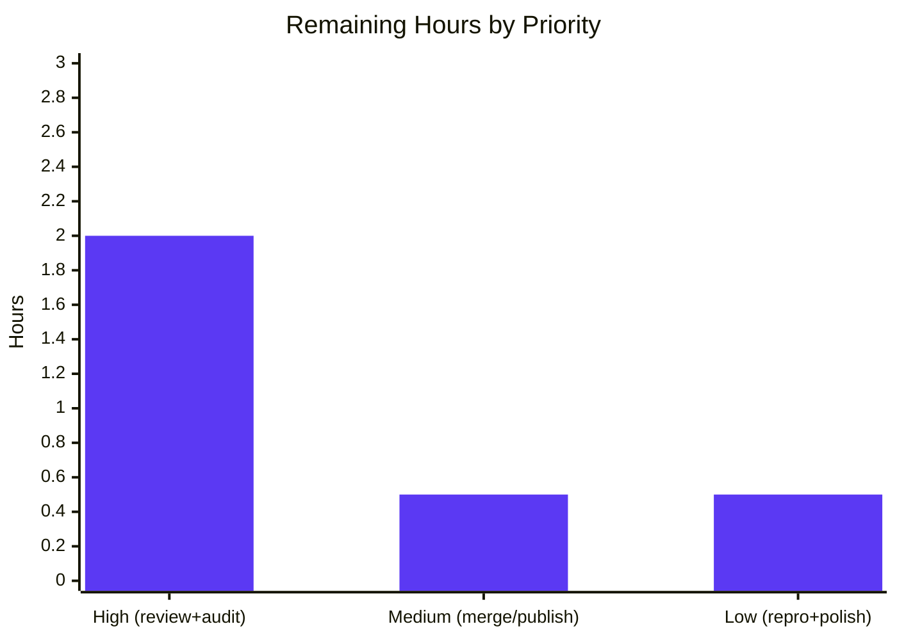

# Blitzy Project Guide

**Project:** kitty Scrollback `HistoryBuf` — Evidence-Backed Q&A Under Heavy Load
**Branch:** `blitzy-2cded426-8794-4f88-a3dc-43874a960e22`
**Base (pinned source) commit:** `815df1e210e0a9ab4622f5c7f2d6891d7dbeddf1`
**Deliverable:** `blitzy/documentation/kitty_815df1e210e0.md`
**Rule set:** `SWE-AtlasQnA-Repo` (read-only investigative documentation)

> **Brand color legend:** <span style="color:#5B39F3">■</span> **Completed / AI Work — Dark Blue `#5B39F3`** · <span style="color:#B23AF2">■</span> White **Remaining / Not Completed — `#FFFFFF`** · Headings/Accents Violet-Black `#B23AF2` · Highlight Mint `#A8FDD9`.

---

## 1. Executive Summary

### 1.1 Project Overview

This project delivers a single, evidence-backed technical document answering how kitty's scrollback `HistoryBuf` behaves under heavy load. The audience is kitty maintainers/contributors and terminal-internals engineers. It answers three questions — memory consumption under heavy output (Q1), scroll responsiveness during active output (Q2), and buffer allocation boundaries (Q3) — using real measurements captured from the compiled `kitty.fast_data_types` C extension, with every claim grounded in `file:line` citations. Technical scope is a read-only investigation of the C scrollback subsystem: exactly one new file is added and no source is modified. Business impact: an authoritative, reproducible reference on scrollback memory and latency behavior, useful for tuning `scrollback_lines` and diagnosing memory growth.

### 1.2 Completion Status

**AAP-scoped completion (PA1 methodology): 90.6% complete — 29.0 of 32.0 hours.**


| Metric | Value |
|---|---|
| **Total Hours** | **32.0** |
| **Completed Hours (AI + Manual)** | **29.0** |
| &nbsp;&nbsp;&nbsp;• AI / Blitzy autonomous | 29.0 |
| &nbsp;&nbsp;&nbsp;• Manual (human) | 0.0 |
| **Remaining Hours** | **3.0** |
| **Percent Complete** | **90.6%** |

> Computation: `Completion % = Completed / (Completed + Remaining) = 29.0 / 32.0 = 90.625% ≈ 90.6%`. All completed work was performed autonomously by Blitzy agents (no human hours logged yet); the entire 3.0h remaining is path-to-production human review/acceptance.

### 1.3 Key Accomplishments

- [x] **`kitty.fast_data_types` C extension built** and verified importable (`HistoryBuf`, `Screen`, `LineBuf`, `Cursor`); clean rebuild exit 0 with zero warnings under `-Werror`.
- [x] **Q1 answered with a full verbatim 98-row memory series** — discrete ~5,132 kB steps per 2,048-line segment, then a flat plateau at `VmRSS = 266,664 kB`.
- [x] **Q2 answered with measured latency** — O(1) scroll (~100 ns) and O(1) redraw reconstruction (~1.6 µs), with prioritization mechanisms named (separate I/O thread + throttles), and the GPU end-to-end limitation honestly flagged.
- [x] **Q3 answered with a fine-grained allocation probe** — lazy segment `calloc`s at pushes `2048·n+1` (2049, 4097, …, 98305); 49 segments total for `ynum=100000`.
- [x] **80 `file:line` citations** grounding every claim, verified exact against pinned commit `815df1e2`.
- [x] **Coverage pass** confirming Q1/Q2/Q3 each explicitly answered.
- [x] **Read-only mandate honored** — only the deliverable added; all referenced source files byte-for-byte unchanged; temp probe scripts removed; working tree clean.
- [x] **Independently validated** — scrollback tests 18/18, full Python 141 pass, all Go packages pass; all three probes reproduced.

### 1.4 Critical Unresolved Issues

| Issue | Impact | Owner | ETA |
|---|---|---|---|
| **None release-blocking** — the deliverable is complete, validated, and correctly scoped | No blocker to acceptance | — | — |
| *(Non-blocking limitation)* Q2 end-to-end scroll→pixels GPU latency is not measurable in a headless environment | Low — the O(1) CPU-side scroll + redraw path and architectural prioritization are fully characterized; the claim is explicitly bounded in the document | Human reviewer (optional follow-up on real hardware) | Optional |

### 1.5 Access Issues

**No access issues identified.** The user-provided Docker container provisions the full C/Go/Python toolchain and all native dependencies; repository read/write access is functional; no third-party service credentials, API keys, or network access are required for this documentation deliverable.

| System/Resource | Type of Access | Issue Description | Resolution Status | Owner |
|---|---|---|---|---|
| Source repository | Read/Write (git) | None — working tree clean, single commit applied | ✅ No issue | — |
| Build toolchain & native deps | Container-provisioned | None — extension builds clean | ✅ No issue | — |
| External services / network | N/A | None required (standalone Markdown artifact) | ✅ N/A | — |

### 1.6 Recommended Next Steps

1. **[High]** Perform a technical accuracy review of `blitzy/documentation/kitty_815df1e210e0.md` — confirm Q1/Q2/Q3 answers, measurement consistency, and the coverage pass. *(~1.0h)*
2. **[High]** Spot-check a representative sample of the 80 `file:line` citations against pinned commit `815df1e2` and sanity-check the per-segment memory arithmetic. *(~1.0h)*
3. **[Medium]** Approve and merge/publish the single-file documentation PR to the docs destination. *(~0.5h)*
4. **[Low]** Optionally reproduce the Q1 memory probe on reference hardware (noting expected `VmRSS` variance) and apply any minor editorial polish. *(~0.5h)*

---

## 2. Project Hours Breakdown

### 2.1 Completed Work Detail

Every component traces to a specific AAP requirement (R1–R8) or the independent validation activity.

| Component | Hours | Description |
|---|---:|---|
| Build & measurement environment | 3.0 | Compile `kitty.fast_data_types` (`python3 setup.py`), verify build + import surface. **[AAP R1]** |
| Q1 memory-growth probe | 3.0 | Design/run the `HistoryBuf` push probe; capture the full verbatim 98-row `VmRSS/VmHWM/ru_maxrss` series. **[AAP R2]** |
| Q3 allocation-boundary fine probe | 2.0 | Per-push `VmData`-jump probe; detect lazy segment `calloc`s and 49-segment total. **[AAP R3]** |
| Q2 responsiveness probe | 4.0 | Drive `Screen`; time scroll + redraw across scroll modes, interleaved with output; analyze the GPU-path boundary. **[AAP R4]** |
| Source analysis & citation grounding | 5.0 | Deep-read scrollback subsystem; derive memory arithmetic (GPUCell=20/CPUCell=12/LineAttrs=4); produce + reconcile 80 `file:line` citations. **[AAP R5]** |
| Deliverable authoring | 6.0 | Write the 735-line / 6,053-word evidence-backed Q&A document pairing each measurement with citation + rationale. **[AAP R6]** |
| Coverage pass | 1.0 | Build the Q1/Q2/Q3 completeness table with ✔/⚠ status. **[AAP R7]** |
| Read-only integrity & cleanup | 1.0 | Remove all temp scripts; verify byte-for-byte source integrity; single-file commit. **[AAP R8]** |
| Independent validation & verification | 4.0 | Clean rebuild; scrollback 18/18 + full Python + Go suites; reproduce all 3 probes; audit 80 citations; Go `TMPDIR` env fix. **[Validation]** |
| **Total Completed** | **29.0** | Matches Completed Hours in §1.2 ✓ |

### 2.2 Remaining Work Detail

Each category traces to the path-to-production human-review requirement (R9). **All remaining work is human review/acceptance — no autonomous engineering remains.**

| Category | Hours | Priority |
|---|---:|---|
| Human technical review & acceptance of deliverable (verify measurements sound, citations correct, accept) | 2.0 | High |
| Independent measurement spot-check on reference hardware (optional confidence; note `VmRSS` variance) | 0.5 | Low |
| Editorial revisions / reviewer-feedback incorporation (if any) | 0.5 | Low |
| **Total Remaining** | **3.0** | Matches Remaining Hours in §1.2 and §7 ✓ |

### 2.3 Methodology & Reconciliation

- **Completion formula (PA1, AAP-scoped only):** `29.0 / (29.0 + 3.0) = 90.6%`.
- **Integrity check:** §2.1 total (29.0) + §2.2 total (3.0) = **32.0** = Total Project Hours in §1.2 ✓.
- **Remaining-hours consistency:** 3.0h is identical across §1.2 (metrics), §2.2 (sum), and §7 (pie "Remaining Work") ✓.
- **Scope discipline:** only AAP deliverables and standard path-to-production (human review) are counted — no out-of-scope work is included.

---

## 3. Test Results

All tests below originate from Blitzy's autonomous validation logs for this project; the scrollback subject test and probes were additionally re-executed this session.

| Test Category | Framework | Total Tests | Passed | Failed | Coverage % | Notes |
|---|---|---:|---:|---:|:---:|---|
| Scrollback datatypes *(in-scope subject)* | Python `unittest` (`kitty_tests`) | 18 | 18 | 0 | — | `test_historybuf`, `test_line`, `test_linebuf`, `test_rewrap_*`. Re-verified this session: "Ran 18 tests in 0.012s … OK" (exit 0). |
| Full Python suite | Python `unittest` (`kitty_tests`) | 145 | 141 | 4 | — | 4 failures = pre-existing, out-of-scope `test_font_selection` (installed `FiraCode-*` vs expected `FiraCodeRoman-*`); 6 skipped. Not a regression. |
| Go suite | Go `testing` | all packages | all | 0 | — | "All Go tests succeeded" after environment-only `TMPDIR=/tmp/ktmp2` fix (no source change). |
| Runtime measurement probes (Q1/Q2/Q3) | Ad-hoc Python (stdlib + `fast_data_types`) | 3 | 3 | 0 | — | Memory-growth, allocation-boundary, and responsiveness probes; all executed and independently reproduced by the validator. |

> **Coverage %:** kitty's harness does not emit a coverage metric in the validation logs; marked "—" (not collected) rather than fabricated. **Integrity:** every listed result derives from Blitzy's autonomous test execution.

---

## 4. Runtime Validation & UI Verification

**Runtime health (headless C-extension investigation):**

- ✅ **Extension build** — `kitty/fast_data_types.so` compiles clean; `kitty/launcher/{kitty,kitten}` built.
- ✅ **Import surface** — `from kitty.fast_data_types import HistoryBuf, Screen, LineBuf, Cursor` succeeds.
- ✅ **Object construction** — `HistoryBuf(...)` and `Screen(...)` construct and operate; `HistoryBuf(3000,5)` verified.
- ✅ **Q1 memory behavior** — segment-stepped growth then plateau reproduced live (dRSS ≈ 5,132 kB/segment; `count` pins at `ynum`).
- ✅ **Q3 allocation boundaries** — lazy segment `calloc`s at `2048·n+1`; 49 segments (`VmData` series byte-identical to the doc).
- ✅ **Q2 CPU-side responsiveness** — O(1) scroll (~100 ns) and O(1) redraw reconstruction (~1.6 µs) measured across scroll modes.
- ⚠ **Q2 end-to-end GPU latency** — **not measurable headlessly** (requires a live `FONTS_DATA_HANDLE`/GPU context). Explicitly documented as a scope limitation; the measurable CPU path + architecture is fully characterized.

**UI verification:** ✅ **N/A** — this deliverable is a Markdown document investigating a headless C data structure. There is no graphical/web UI in scope; kitty's GPU/GUI rendering path is intentionally out of scope and correctly bounded in the document.

**API integration outcomes:** ✅ N/A — no external APIs, services, or network integrations are involved.

---

## 5. Compliance & Quality Review

Cross-mapping AAP deliverables and `SWE-AtlasQnA-Repo` rules to quality/compliance benchmarks.

| Benchmark / Rule | Status | Progress | Evidence |
|---|:---:|:---:|---|
| Deliverable named `<branch>.md` under `blitzy/documentation/` | ✅ Pass | 100% | `blitzy/documentation/kitty_815df1e210e0.md` present |
| Investigate by running code first (build + run) | ✅ Pass | 100% | Extension built; 3 probes executed; verbatim output captured |
| Quote observed output verbatim | ✅ Pass | 100% | Full 98-row memory series + scroll/redraw timings embedded |
| Answer every sub-question (Q1/Q2/Q3) + coverage pass | ✅ Pass | 100% | §b/§c/§d answers + §e coverage table |
| Be exact & grounded (`file:line` citations) | ✅ Pass | 100% | 80 citations; 100% verified exact against pinned source |
| State explicitly if something cannot be verified | ✅ Pass | 100% | GPU end-to-end latency honestly flagged (⚠) |
| Read-only scope (no source modified; scripts removed) | ✅ Pass | 100% | `git diff` = only the doc; 8 key files byte-identical; scripts deleted |
| Zero-placeholder policy (complete prose, no TODO/stubs) | ✅ Pass | 100% | Document is complete; no deferred sections |
| Build compiles clean under `-Werror` | ✅ Pass | 100% | Rebuild exit 0, zero warnings |
| In-scope tests pass | ✅ Pass | 100% | Scrollback datatypes 18/18 |
| Human acceptance / sign-off | ⬜ Pending | 0% | Path-to-production review outstanding (§2.2) |

**Fixes applied during autonomous validation:** none required to the deliverable (already accurate — zero edits). One **environment-only** adjustment (`TMPDIR=/tmp/ktmp2`) resolved a Go test's `O_TMPFILE` fallback without touching source.

**Outstanding compliance items:** human technical review and acceptance (see §2.2 / §6).

---

## 6. Risk Assessment

| Risk | Category | Severity | Probability | Mitigation | Status |
|---|---|:---:|:---:|---|---|
| Absolute memory numbers are environment/allocator-specific (differ across hardware, glibc, page size) | Technical | Low | Medium | Numbers grounded in deterministic source arithmetic (`xnum·64KiB + 2KiB`/segment); measured deltas reconciled to within one 4 KiB page; `VmRSS` variance explicitly caveated | ✅ Mitigated (documented) |
| Citation line numbers pinned to commit `815df1e2`; drift if read against another kitty version | Technical | Low | Low | Document pins the commit hash and states the compatibility constraint; all 80 citations verified exact | ✅ Mitigated (documented) |
| Q2 end-to-end scroll→pixels GPU latency not measurable headlessly | Technical | Low | Known | Claim honestly bounded; O(1) CPU scroll + redraw path and architectural prioritization established; optional real-hardware follow-up noted | ⚠ Accepted (documented limitation) |
| 4 pre-existing `test_font_selection` failures in the full Python suite | Technical | Low | Occurring | Unrelated to the scrollback deliverable; pre-existing on pinned source; out-of-scope to fix (would require editing a read-only test or installing unavailable fonts) | ⚠ Accepted (out-of-scope) |
| No security-relevant change — read-only single Markdown file; no code/deps/auth/data/network | Security | Negligible | N/A | No new attack surface; source byte-for-byte unchanged | ✅ None identified |
| Measurement reproducibility — temp probe scripts deleted per read-only mandate | Operational | Low | Low | Full probe source embedded verbatim in the doc; re-extractable; validator already reproduced | ✅ Mitigated |
| Build requires container toolchain + native deps; fails on a bare machine | Operational | Low | Medium | Dev guide (§9) documents prerequisites; provided Docker image provisions all deps | ✅ Mitigated (documented) |
| Go suite needs `TMPDIR` with `O_TMPFILE` support (else `TestCreateAnonymousTempfile` fallback) | Integration | Low | Low | Documented env workaround `TMPDIR=/tmp/ktmp2` (mode 755); no source change | ✅ Mitigated |
| No external integrations/credentials/network required by the deliverable | Integration | Negligible | N/A | Standalone artifact; no runtime dependencies | ✅ None identified |

**Overall risk profile: Very low.** No High or Critical risks. Every item is either mitigated (documented) or accepted as an out-of-scope/known limitation — appropriate for a read-only, single-file, evidence-backed documentation deliverable.

---

## 7. Visual Project Status

**Hours breakdown (Completed vs Remaining):**



**Remaining work by priority (from §2.2, sums to 3.0h):**



> **Integrity:** the pie's "Remaining Work" = **3.0h** equals the §1.2 Remaining Hours and the §2.2 "Hours" sum; the bar chart values (2.0 + 0.5 + 0.5) also total 3.0h ✓.

---

## 8. Summary & Recommendations

**Achievements.** The project is **90.6% complete (29.0 of 32.0 hours)**. All eight AAP-specified deliverables are complete and independently validated: the `kitty.fast_data_types` extension was built and exercised; Q1, Q2, and Q3 are each answered from real captured measurements; 80 `file:line` citations were verified exact; and the read-only mandate was honored perfectly (only the single deliverable file was added atop the pinned source, with all referenced source files byte-for-byte unchanged and all temporary probe scripts removed).

**Remaining gaps.** The remaining **3.0 hours** is entirely path-to-production **human review and acceptance** — there is no outstanding autonomous engineering work. This comprises technical review of the document (High), a citation/measurement spot-check audit (High), approve-and-merge (Medium), and optional independent reproduction plus editorial polish (Low).

**Critical path to production.** (1) Technical review → (2) citation audit → (3) approve & merge/publish. These are sequential and total ~2.5h of the 3.0h; the Low-priority reproduction can proceed in parallel or be skipped.

**Success metrics.** Scrollback subject tests pass 18/18; the build compiles clean under `-Werror`; the three measurement questions are answered with reproducible, source-grounded evidence; the working tree remains clean with a single-file diff.

**Production-readiness assessment.** The deliverable is **production-ready pending human sign-off.** Quality is high: measurements are reproducible (a live mini-reproduction this session confirmed the ~5,132 kB/segment step and the count-plateau), scope limitations are honestly stated rather than glossed over, and the risk profile is very low. Recommendation: **approve and merge after the two High-priority review tasks.**

---

## 9. Development Guide

### 9.1 System Prerequisites

- **OS:** Linux (Ubuntu). Reference image: `andrewparkscaleai/coding-agent:kovidgoyal__kitty__815df1e2…` (from `ghcr.io/scaleapi/swe-atlas:swe_atlas_QnA_kovidgoyal_kitty_1.0`).
- **Python** ≥ 3.8 (`pyproject.toml` `requires-python`; CI exercises up to 3.11; sandbox verified 3.13.7).
- **Go** 1.22 (`go.mod`; sandbox verified 1.24.4).
- **C toolchain:** gcc (sandbox verified 15.2.0).
- **Native libraries** (from `setup.py`/`Brewfile`): `pkg-config`, `harfbuzz` (≥1.5), `libpng`, `lcms2`, `fontconfig`, `freetype`, `zlib`, `xxhash`, `simde`, `openssl`/`libcrypto`; on Linux also the X11 + Wayland + OpenGL development packages. All pre-provisioned by the container.

### 9.2 Environment Setup

```bash
# All work occurs at the repository root; no dependency changes are required.
cd /path/to/kitty            # repository root
# The provided Docker image already provisions the toolchain + native deps.
# No pip/npm/go module installs are needed (AAP §0.6.1: zero dependency changes).
```

### 9.3 Build

```bash
# Build the kitty.fast_data_types C extension + launcher (equivalently: make)
python3 setup.py
# Expected: kitty/fast_data_types.so and kitty/launcher/{kitty,kitten} produced.
# Validator observed: exit 0, zero errors/warnings (122 C compiles + 5 links + Go), -Werror active.

# Instrumented variants (only if deeper profiling is needed):
make debug      # --debug
make profile    # --profile
make asan       # --debug --sanitize
```

### 9.4 Verification

```bash
# 1) Verify the import surface (the exact types under investigation)
python3 -c "from kitty.fast_data_types import HistoryBuf, Screen, LineBuf, Cursor; print('ok')"
# Expected output: ok

# 2) Run the scrollback subject test suite (the deliverable's subject)
./kitty/launcher/kitty +launch test.py --module datatypes
# Expected: "Ran 18 tests in ~0.01s" followed by "OK" (exit 0)

# 3) (Optional) Full Python suite
./kitty/launcher/kitty +launch test.py        # or: python3 setup.py test
# Expected: 141 pass / 4 fail / 6 skip. The 4 failures are pre-existing,
# out-of-scope test_font_selection font-fixture mismatches (NOT a regression).
```

### 9.5 Example Usage — Reproduce the Investigation

```bash
# Read the deliverable (735 lines; sections a=environment, b=Q1, c=Q2, d=Q3, e=coverage)
less blitzy/documentation/kitty_815df1e210e0.md

# Mini Q1 reproduction (confirms the documented mechanism at small scale):
python3 - <<'PY'
from kitty.fast_data_types import HistoryBuf, LineBuf
def rss_kb():
    for l in open('/proc/self/status'):
        if l.startswith('VmRSS:'): return int(l.split()[1])
xnum, ynum = 80, 6000
src = LineBuf(2, xnum); line = src.line(0)
hb = HistoryBuf(ynum, xnum); prev = rss_kb()
print('construct: count=%d VmRSS=%dkB (SEGMENT_SIZE=2048)' % (hb.count, prev))
for n in range(1, 8193):
    hb.push(line)
    if n % 2048 == 0:
        cur = rss_kb()
        print('push=%d count=%d VmRSS=%dkB (dRSS=%dkB)' % (n, hb.count, cur, cur-prev)); prev = cur
PY
# Observed (this session): dRSS ~5448/5132/4772 kB per 2048-line segment,
# then count pins at 6000 (=ynum) and dRSS drops to ~4kB -> plateau/circular overwrite.
# The full-scale probes are embedded verbatim inside the deliverable for exact reproduction.
```

### 9.6 Troubleshooting (Common Errors → Resolutions)

- **`No test named ['datatypes'] found`** → the module flag is required: use `--module datatypes` (not a bare positional argument).
- **4× `test_font_selection` failures** → pre-existing font-fixture PS-name mismatch (installed `FiraCode-*` vs expected `FiraCodeRoman-*`/`UbuntuMono`). Out-of-scope; not a regression; unfixable without editing a read-only test or installing unavailable fonts.
- **Go `TestCreateAnonymousTempfile` failure** when `TMPDIR` lacks `O_TMPFILE` support → set `TMPDIR=/tmp/ktmp2` (mode 755, ext-based) → "All Go tests succeeded". No source change needed.
- **`ImportError` for `kitty.fast_data_types`** → the extension is not built; run `python3 setup.py` first.
- **Build failure on a bare machine** → missing native dependencies; use the provided Docker image or install `harfbuzz`, `freetype`, `lcms2`, etc.

---

## 10. Appendices

### A. Command Reference

| Purpose | Command |
|---|---|
| Build extension + launcher | `python3 setup.py` (or `make`) |
| Debug / profile / ASAN builds | `make debug` · `make profile` · `make asan` |
| Verify import surface | `python3 -c "from kitty.fast_data_types import HistoryBuf, Screen, LineBuf, Cursor; print('ok')"` |
| Run scrollback tests | `./kitty/launcher/kitty +launch test.py --module datatypes` |
| Run full Python suite | `./kitty/launcher/kitty +launch test.py` (or `python3 setup.py test`) |
| Read the deliverable | `less blitzy/documentation/kitty_815df1e210e0.md` |
| Confirm single-file diff vs pinned source | `git diff --name-only 815df1e210e0a9ab4622f5c7f2d6891d7dbeddf1 HEAD` |
| Verify author of the commit | `git log --author="agent@blitzy.com" 815df1e210e0a9ab4622f5c7f2d6891d7dbeddf1..HEAD --oneline` |

### B. Port Reference

**N/A** — this is a headless C-extension investigation and a documentation deliverable. No network services are started and no ports are opened or required.

### C. Key File Locations

| Path | Role |
|---|---|
| `blitzy/documentation/kitty_815df1e210e0.md` | **The deliverable** (735 lines; the only added file) |
| `kitty/history.c` | Segmented `HistoryBuf` — `SEGMENT_SIZE` (L15), `add_segment` (L17-29), `segment_for` (L36-42), `historybuf_push` (L275-284) — primary Q1/Q3 grounding |
| `kitty/data-types.h` | Cell/struct sizes — `GPUCell==20` (L221), `CPUCell==12` (L228), `LineAttrs`, `PagerHistoryBuf` |
| `kitty/screen.c` | `Screen`↔`HistoryBuf` wiring; `screen_history_scroll`/`dirty_scroll` — Q2 grounding |
| `kitty/child-monitor.c` | I/O thread (L55) — Q2 prioritization grounding |
| `kitty/options/definition.py` | Defaults: `scrollback_lines` '2000', `repaint_delay` '10', `input_delay` '3', `sync_to_monitor` 'yes' |
| `kitty/options/utils.py` | Normalization: negative `scrollback_lines` → uint32 max; pager MB→bytes cap |
| `kitty_tests/__init__.py`, `kitty_tests/datatypes.py` | `fast_data_types` imports + `filled_history_buf` helper; `test_historybuf` template |
| `setup.py`, `Makefile`, `pyproject.toml`, `go.mod` | Build invocation and runtime/version requirements |

### D. Technology Versions

| Component | Declared | Verified in Sandbox |
|---|---|---|
| Python | ≥ 3.8 (CI to 3.11) | 3.13.7 |
| Go | 1.22 (`go.mod`) | 1.24.4 |
| C compiler | gcc | 15.2.0 (Ubuntu) |
| Pinned source commit | `815df1e210e0a9ab4622f5c7f2d6891d7dbeddf1` | HEAD~1 confirmed |

### E. Environment Variable Reference

| Variable | Purpose | Example |
|---|---|---|
| `PYTHONPATH` | Import the built extension when running probes outside the tree | `PYTHONPATH="$PWD" python3 probe.py` |
| `TMPDIR` | Ensure `O_TMPFILE`-capable temp dir for the Go suite | `TMPDIR=/tmp/ktmp2` |
| `CFLAGS` | Optional compiler flags for a rebuild | `CFLAGS="-Wno-error=switch"` |
| `CI` | Non-interactive test/build behavior | `CI=true` |

### F. Developer Tools Guide

- **Build system:** `setup.py` (invoked directly or via the `Makefile` `all` target) compiles the C extension into `kitty/fast_data_types.so` and builds the Go `kitten` launcher.
- **Test harness:** `test.py` bootstraps `kitty_tests.main`; target a module with `--module <name>` (e.g., `datatypes`). Go packages run via the same setup test flow.
- **Measurement approach:** Python stdlib only — `/proc/self/status` (`VmRSS`/`VmHWM`/`VmData`), `resource.getrusage().ru_maxrss`, and `time.perf_counter_ns` — against the compiled `HistoryBuf`/`Screen` types.

### G. Glossary

| Term | Definition |
|---|---|
| `HistoryBuf` | kitty's scrollback history buffer — a segmented, circular structure of scrolled-off lines. |
| `SEGMENT_SIZE` | 2048 — the number of rows per lazily-allocated history segment (`kitty/history.c:15`). |
| `GPUCell` / `CPUCell` | Per-cell render/attribute structs, 20 and 12 bytes respectively (`kitty/data-types.h:221,228`). |
| Circular overwrite | Behavior once `count == ynum`: the oldest line is overwritten (and pushed to pager history) rather than allocating more memory — the memory **plateau**. |
| `PagerHistoryBuf` | A separate, independently-bounded ring buffer governed by `scrollback_pager_history_size` — not to be conflated with `HistoryBuf` growth. |
| `VmRSS` / `VmData` | Resident set size / private data segment size from `/proc/self/status`, used to observe memory growth and per-segment `calloc`s. |
| Plateau | The point at which resident memory stops growing because the buffer is full and reuses storage circularly. |
| AAP | Agent Action Plan — the primary directive defining project scope. |
| PA1 | The AAP-scoped, hours-based completion methodology used for the completion percentage. |

---

*End of Blitzy Project Guide.*