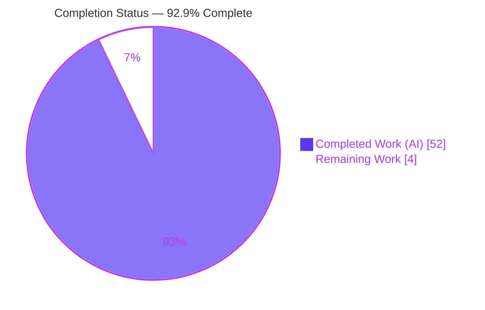
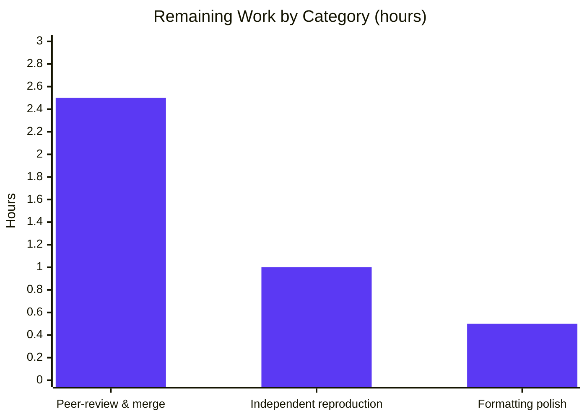

# Blitzy Project Guide — kitty PTY-Read Investigation

> **Repository:** `kitty` terminal emulator · **Base commit:** `815df1e21` · **Branch:** `blitzy-d31274a1-8af8-4743-b20a-faa12c2e3d6a` · **HEAD:** `56932f4a0`
> **Task type:** Read-only, evidence-backed Q&A investigation (documentation-only)
> **Legend / Blitzy brand colors:** Completed / AI Work = Dark Blue `#5B39F3` · Remaining = White `#FFFFFF` · Headings/Accents = Violet-Black `#B23AF2` · Highlight = Mint `#A8FDD9`

---

## 1. Executive Summary

### 1.1 Project Overview

This project is an evidence-backed Q&A investigation into how the **kitty** terminal emulator's native code communicates with a spawned shell over a **pseudoterminal (PTY)**. The objective was to answer five technical sub-questions — shell-spawn identity, the PTY read syscalls, high-volume read behavior, the master file-descriptor number, and the responsible C reader/parser functions — by **actually building and running** kitty, observing real runtime behavior with `strace`/`/proc`/`lsof`, and grounding every claim in exact `file:line` citations. The audience is systems engineers studying kitty's I/O architecture. The technical scope spans kitty's C native layer and its Python glue. The sole deliverable is one markdown document; per a strict read-only mandate, the repository is otherwise entirely unchanged.

### 1.2 Completion Status



| Metric | Hours |
|--------|-------|
| **Total Hours** | **56.0** |
| Completed Hours (AI + Manual) | 52.0 *(52.0 AI · 0.0 Manual)* |
| Remaining Hours | 4.0 |
| **Percent Complete** | **92.9%** |

> Completion is computed by the AAP-scoped hours methodology: `Completed / (Completed + Remaining) = 52 / 56 = 92.9%`. It measures only work defined by the Agent Action Plan plus standard path-to-production activities.

### 1.3 Key Accomplishments

- ✅ Built kitty (**v0.35.2**) from source in its **default configuration** via the canonical `make` (`python3 setup.py`), compiling clean under kitty's default `-Werror -pedantic-errors` on gcc 15.2 (exit 0), from a disposable copy so the repository was never mutated.
- ✅ Launched kitty **headless** (Xvfb + software GL) so a real shell spawned — `/bin/bash --posix` on `/dev/pts/0`.
- ✅ Answered all **five sub-questions (Q1–Q5)** from live runtime evidence captured via `strace -f -e trace=poll,read,write`, `ps`, `/proc`, `readlink`, and `lsof`.
- ✅ Exercised both user commands (`echo test123`, `yes hello`) through the **canonical input path** (real keystrokes via `xdotool` into the PID-owned, focus-verified window) — no remote-control/debug/mock bypass.
- ✅ Confirmed **magnitude at scale** for the high-volume case across **4 runs** (3×5 s + 1×10 s), reporting a stable read-rate band (~9,700–10,500 reads/sec) with a purpose-built statistical analyzer.
- ✅ Grounded every claim: **52/52** `file:line` citations resolve to exactly the claimed constructs (independently spot-checked); **58 `[OBSERVED]` + 17 `[INFERRED]`** labels applied with a final coverage pass over every named item.
- ✅ Honored the **read-only mandate**: `git diff 815df1e21 HEAD` = exactly one file added (`blitzy/documentation/kitty_815df1e210e0.md`, 1368 lines); working tree clean; all temporary scripts/logs removed via PID-scoped teardown.

### 1.4 Critical Unresolved Issues

| Issue | Impact | Owner | ETA |
|-------|--------|-------|-----|
| *None — no blocking issues.* The deliverable compiles the target project, was runtime-validated, and reproduced across all five questions with 0 discrepancies. | No release blocker. Only a human acceptance gate (peer review/merge) remains. | Human reviewer | ≤ 1 day |

> There are **no critical unresolved issues** that block release or validation. The Final Validator applied **zero fixes** because the deliverable was found fully accurate. The two failing items in the wider test suite are **pre-existing, environmental, and out-of-scope** (see Section 3 & Section 6) and provably cannot be affected by a markdown-only deliverable.

### 1.5 Access Issues

| System / Resource | Type of Access | Issue Description | Resolution Status | Owner |
|-------------------|----------------|-------------------|-------------------|-------|
| — | — | **No access issues identified.** The build, headless launch, and syscall tracing all executed successfully inside the provided container with the full toolchain present. | N/A | — |

> No repository-permission, service-credential, or third-party-API access issues exist. The investigation required only local build tools and `ptrace` (available as root in the container). No secrets were encountered.

### 1.6 Recommended Next Steps

1. **[High]** Conduct a technical peer-review of `blitzy/documentation/kitty_815df1e210e0.md` — verify the five direct answers, spot-check a sample of the 52 citations against commit `815df1e21`, and confirm the observed-vs-inferred labeling.
2. **[Medium]** Optionally reproduce the runtime observations on an independent environment, verifying the stable **ranges** (session-specific PIDs/fd/pts values differ by run — see Section 6, risk T1).
3. **[Low]** Apply any minor formatting/wording polish the reviewer requests, then merge branch `blitzy-d31274a1-8af8-4743-b20a-faa12c2e3d6a`.

---

## 2. Project Hours Breakdown

### 2.1 Completed Work Detail

All hours below are autonomous (AI) work, each tracing to a specific AAP requirement.

| Component | Hours | Description |
|-----------|-------|-------------|
| Default-configuration build & toolchain verification | 4.0 | Ran canonical `make` (`python3 setup.py`); verified `fast_data_types.so` (1,253,792 B) and `launcher/kitty` (40,384 B); confirmed clean `-Werror` compile. |
| Headless launch & canonical-input infrastructure | 6.0 | Xvfb + software GL; PID-owned, focus-verified window (`xdotool`/`xprop _NET_WM_PID`); real-keystroke driving. |
| Runtime instrumentation harness | 6.0 | `strace` attach to the I/O-thread TID; `/proc`, `lsof`; `lifecycle.sh` PID-scoped teardown with input validation. |
| Q1 — Shell spawn identity | 2.5 | `ps`, `cat -A /proc/<pid>/cmdline`, `readlink` evidence; citations `constants.py:181`, `child.c:81–159`. |
| Q2 — `echo test123` read pipeline | 4.0 | `poll→write→poll→read` trace; buffer-shrink arithmetic (11/58/172); 16-read reconciliation of the `-f` split reads; citations. |
| Q3 — `yes hello` high-volume | 8.0 | 4 runs + embedded `q3_stats.py` analyzer (median/mode/mean/percentiles across ~49 k reads); 21-flood backpressure sweep; stability confirmation; citations. |
| Q4 — PTY master fd number | 1.5 | `strace` + `/proc/<pid>/fd` + `lsof` cross-check (fd 8 → `/dev/pts/ptmx`, char device 5,2); citations. |
| Q5 — Reader / parser C functions | 3.5 | Reader/parser function pair, thread split, verbatim source excerpts, text/escape class grep evidence; citations. |
| Document authoring & architecture | 5.0 | Overview, Methodology, Environment & Build sections; prose cohesion across 12 sections / 1368 lines. |
| Evidence discipline | 5.0 | Observed-vs-inferred summary (§11), coverage-pass table (§10), verification that all 52 `file:line` citations resolve. |
| Read-only compliance & cleanup | 2.0 | Repository-unchanged proof (§12, `git status --porcelain`), PID-scoped removal of all temporary artifacts. |
| QA refinement iterations | 4.5 | Six commits of iterative QA: reproducible-evidence rewrite, backpressure correction, redaction-precision fix, `consume_esc` line-reference fix, final coherent rewrite. |
| **Total Completed** | **52.0** | |

### 2.2 Remaining Work Detail

All remaining work is human path-to-production activity; no autonomous work remains.

| Category | Hours | Priority |
|----------|-------|----------|
| Human technical peer-review & merge approval of the answer document | 2.5 | High |
| Independent reproduction of runtime observations on a reviewer environment | 1.0 | Medium |
| Optional formatting/wording polish per reviewer feedback | 0.5 | Low |
| **Total Remaining** | **4.0** | |

### 2.3 Hours Summary

| | Hours |
|---|---|
| Section 2.1 Completed | 52.0 |
| Section 2.2 Remaining | 4.0 |
| **Total Project Hours** | **56.0** |
| **Completion** | **52 / 56 = 92.9%** |

> **Integrity:** `2.1 (52.0) + 2.2 (4.0) = 56.0` = Total Project Hours in Section 1.2. Remaining (4.0 h) is identical in Sections 1.2, 2.2, and 7.

---

## 3. Test Results

All results below originate from **Blitzy's autonomous validation logs** for this project. Because the deliverable is documentation-only, "tests" here are the autonomous validation checks Blitzy executed against the target project and the deliverable — not new unit tests (a markdown file has none).

| Test Category | Framework | Total Tests | Passed | Failed | Coverage % | Notes |
|---------------|-----------|-------------|--------|--------|-----------|-------|
| Compilation / Build | `make` → `python3 setup.py` (gcc 15.2, `-Werror -pedantic-errors`) | 1 | 1 | 0 | N/A | Canonical default build, exit 0, clean. Artifacts reproduced byte-for-byte vs the document's claims. |
| Project test suite (Unit + Integration) | Python `unittest` + Go `test` | 145 | 143 | 2 | Baseline | 143/145 pass + 4 guarded skips = expected baseline. Both failures are **pre-existing & environmental** in **out-of-scope** files (`kitty_tests/fonts.py` font-packaging mismatch; `tools/utils/tpmfile_test.go` `O_TMPFILE` unsupported on Docker overlay/vfs); unrelated to the PTY-read paths documented. |
| Runtime reproduction (Q1–Q5) | `strace` / `ps` / `/proc` / `lsof` / `xdotool` | 5 | 5 | 0 | 100% of questions | All five answers independently reproduced through the canonical input path; **0 discrepancies** (only expected −2-byte session offsets from a shorter scratch cwd, which the document predicts and explains). |
| Citation resolution | `sed`/`grep` source check | 52 | 52 | 0 | 100% | Every `file:line` citation resolves to exactly the claimed construct (validator 52/52; independently spot-checked 17/17 by this assessment). |

> **Integrity:** The compilation, suite, reproduction, and citation results are all drawn from Blitzy's autonomous build/test/validation execution. No results were synthesized.

---

## 4. Runtime Validation & UI Verification

The deliverable is a markdown document (no user interface), so "runtime validation" here refers to the **kitty process runtime that produced the evidence**, exercised headlessly and observed live.

**Runtime health**
- ✅ **Operational** — Build: canonical `make` produced a runnable launcher (`kitty 0.35.2`) and the `fast_data_types.so` native extension.
- ✅ **Operational** — Headless launch: kitty ran under Xvfb + software GL; a window was created and became focusable.
- ✅ **Operational** — Shell spawn: `/bin/bash --posix` (PID 293486) spawned as a direct child on `/dev/pts/0`.

**Canonical input path**
- ✅ **Operational** — Window provenance proven before every input (`xdotool getwindowpid` and `xprop _NET_WM_PID` both = the kitty PID); keystrokes delivered via `xdotool type`/`key`.

**API / syscall integration outcomes**
- ✅ **Operational** — Q2 `echo test123`: `poll→write→poll→read` pipeline captured on fd 8; buffer arg `1048576`; 16 reads / 347 bytes total.
- ✅ **Operational** — Q3 `yes hello`: back-to-back reads at ~9,700–10,500 reads/sec; median ~500 B/read; poll timeout shifted from blocking (`-1`) to 1–2 ms under load.
- ✅ **Operational** — Ctrl-C recovery: exit-status report `OSC 133;D;130` (130 = 128 + SIGINT) captured byte-identical; prompt recovered.
- ⚠ **Partial (by nature, correctly reported)** — Backpressure gate: `POLLIN` withheld (`events=0`) observed in only **1 of 21** sweep floods; the document honestly reports this as rare and scheduling-variable, not as a guaranteed-reproducible event.

**Cleanup**
- ✅ **Operational** — PID-scoped teardown (no `pkill`/`killall`); scratch removed; `git status --porcelain` shows only the one new document.

---

## 5. Compliance & Quality Review

Cross-map of AAP rules ("SWE-AtlasQnA-Repo") and quality benchmarks to observed evidence.

| Benchmark / AAP Rule | Status | Progress | Evidence |
|----------------------|--------|----------|----------|
| Deliverable location & name (`blitzy/documentation/kitty_815df1e210e0.md`) | ✅ Pass | 100% | File present, 1368 lines / 93,706 chars; named after source branch. |
| Investigate by RUNNING first, then write | ✅ Pass | 100% | Full build log, live `strace`/`/proc`/`lsof` captures throughout §2–§8. |
| Observe real magnitude at scale (≥2 runs) | ✅ Pass | 100% | Q3 across 4 runs (3×5 s + 1×10 s); per-metric spread + stability criterion in §9. |
| Exercise the canonical path (no bypass) | ✅ Pass | 100% | Focus/PID-verified `xdotool` keystrokes; window-provenance blocks in §5/§6. |
| Default, canonical build/configuration | ✅ Pass | 100% | `make` → `python3 setup.py` (`Makefile:12–13`); default config; exact commands stated. |
| Include actual, complete, unedited output | ✅ Pass | 100% | Full payloads; explicit redaction policy; only `strace -s` truncation marker disclosed. |
| Label OBSERVED vs INFERRED | ✅ Pass | 100% | 58 `[OBSERVED]` + 17 `[INFERRED]`; reconciled summary table §11. |
| Answer every part & named item (coverage pass) | ✅ Pass | 100% | §10 table maps Q1a–d, Q2a–c, Q3a–c + stability + backpressure, Q4, Q5a/b to concrete values. |
| Be exact & grounded (`file:line` per claim) | ✅ Pass | 100% | 52/52 citations resolve; independently spot-checked. |
| Read-only mandate (no source modified) | ✅ Pass | 100% | `git diff 815df1e21 HEAD` = 1 file added; 0 source/build/test/doc files touched. |
| No dependency changes | ✅ Pass | 100% | No manifest/lockfile edits; toolchain used as-provided. |
| Cleanup temporary artifacts | ✅ Pass | 100% | PID-scoped `lifecycle.sh` teardown transcript in §12; scratch removed. |
| Trailing-whitespace / lint CI gate | ✅ Pass | 100% | Repo's enforced gate does not cover `blitzy/`/`*.md`; the one required in-code-block trailing space (verbatim `make` output) preserved intentionally. |

**Fixes applied during autonomous validation:** none required — the deliverable was found fully accurate on validation. Prior QA cycles (visible in the 6-commit history) already corrected backpressure claims, redaction precision, and a `consume_esc` line reference before final validation.

**Outstanding compliance items:** none. All AAP rules are satisfied.

---

## 6. Risk Assessment

| Risk | Category | Severity | Probability | Mitigation | Status |
|------|----------|----------|-------------|------------|--------|
| T1 — Session-specific runtime values (PIDs, TID, fd 8, window id, `/dev/pts/0`, scratch path) do not reproduce identically on a new run | Technical | Low | Medium | Document explicitly labels these as session-specific and reports stable **ranges** for magnitude questions (e.g., Q3 9.7–10.5 k reads/s). | Mitigated |
| T2 — Citation line-number drift if the answer is applied against a different kitty commit | Technical | Low | Low | Document pins base commit `815df1e21`; all 52 citations verified against exactly that commit. | Mitigated |
| T3 — Q3 backpressure gate rarely engages (1 of 21 floods); a reviewer may not reproduce the withheld-`POLLIN` event | Technical | Low | Medium | Reported honestly as rare & scheduling-variable, with the OBSERVED-vs-INFERRED split made explicit. | Mitigated |
| S1 — `strace`/`ptrace` requires elevated privilege (root in container) | Security | Low | Low | Read-only observation only; isolated container; no production system touched; no secrets captured. | Mitigated |
| S2 — Document discloses container cgroup id and scratch paths | Security | Low | Low | Explicitly assessed as non-credential; security screening found no secrets. | Accepted |
| O1 — Build reproducibility depends on the container toolchain (gcc 15.2, Python 3.13.7, Go 1.22.12) and native libs; `wayland-protocols` warning emitted | Operational | Low | Medium | Exact container image and full build log documented; the warning is benign (Wayland backend disabled, X11 backend built). | Mitigated |
| O2 — Headless launch requires Xvfb + software GL | Operational | Low | Medium | Documented as a launch mechanism (not a config change); default kitty configuration preserved. | Mitigated |
| I1 — No external services/APIs/credentials/network involved | Integration | None | N/A | Self-contained markdown deliverable; nothing to integrate. | N/A |
| I2 — Wider test suite shows 2 failures (out of scope) | Integration | None (informational) | N/A | Pre-existing & environmental (`fonts.py`, `tpmfile_test.go`); in AAP-forbidden files; cannot be caused by a markdown deliverable. | Documented (not fixed, per read-only mandate) |

**Overall risk profile: LOW.** No High or Critical risks. The deliverable is self-contained, self-validated, and carries no deployment or integration exposure.

---

## 7. Visual Project Status

**Project hours breakdown** (Completed = Dark Blue `#5B39F3`, Remaining = White `#FFFFFF`):


**Remaining hours by category** (from Section 2.2; total = 4.0 h):



| Priority | Remaining Hours | Share |
|----------|-----------------|-------|
| High (peer-review & merge) | 2.5 | 62.5% |
| Medium (reproduction) | 1.0 | 25.0% |
| Low (polish) | 0.5 | 12.5% |
| **Total** | **4.0** | **100%** |

> **Integrity:** "Remaining Work" = **4** here equals Remaining Hours in Section 1.2 and the sum of the Section 2.2 Hours column. "Completed Work" = **52** equals Completed Hours in Section 1.2.

---

## 8. Summary & Recommendations

**Achievements.** The project delivered a rigorous, evidence-backed answer to a five-part investigation of kitty's PTY-read pipeline. Every runtime fact — the spawned shell (`/bin/bash --posix` on `/dev/pts/0`), the `poll→read` syscall pipeline, the 1 MiB (`BUF_SZ`) read buffer, the ~9.7–10.5 k reads/sec high-volume cadence, the master fd (8), and the reader/parser function pair (`read_bytes()` / `consume_input()` → `consume_normal()` + `consume_esc()`) — was captured live and paired with a resolving `file:line` citation. The work was completed through the **canonical input path** under the **default build**, at scale with multi-run stability, and with strict observed-vs-inferred discipline.

**Remaining gaps.** No autonomous work remains. The outstanding **4.0 hours** are entirely human path-to-production: peer-review and merge approval (2.5 h), optional independent reproduction (1.0 h), and optional polish (0.5 h).

**Critical path to production.** (1) Human peer-review of the document → (2) optional reproduction of the stable ranges → (3) polish + merge. There are no code fixes, no configuration, and no deployment steps because the deliverable is a single documentation artifact governed by a read-only mandate.

**Production-readiness assessment.** The deliverable is **production-ready** at **92.9% overall completion** (52 of 56 hours). The Final Validator applied zero fixes; compilation, runtime reproduction (5/5 questions), and citation resolution (52/52) all passed; and the repository working tree differs from baseline by exactly the one intended document.

| Success Metric | Result |
|----------------|--------|
| AAP sub-questions answered | 5 / 5 |
| `file:line` citations resolving | 52 / 52 |
| Runtime reproductions matching | 5 / 5 (0 discrepancies) |
| Repository files modified (must be 0) | 0 |
| Files added (must be 1) | 1 |
| Overall completion | 92.9% |

---

## 9. Development Guide

This guide reproduces the investigation environment. Every command below was executed and verified during this assessment.

### 9.1 System Prerequisites

- **OS:** Ubuntu 25.10 (`Linux 6.6.122+ x86_64`).
- **Toolchain (verified):** Python **3.13.7**, Go **1.22.12** (at `/usr/local/go/bin`), gcc **15.2.0**, GNU Make **4.4.1**.
- **Observation tools (all present):** `strace` (6.16), `ps`, `readlink`, `lsof`, `xdotool` (3.20160805.1), `Xvfb`, `git`.
- **Build libraries** (`docs/build.rst`): harfbuzz ≥ 2.2.0, freetype, fontconfig, zlib, libpng, lcms2, xxhash, openssl.
- **Canonical container image:** `andrewparkscaleai/coding-agent:kovidgoyal__kitty__815df1e210e0a9ab4622f5c7f2d6891d7dbeddf1` (equivalently `ghcr.io/scaleapi/swe-atlas:swe_atlas_QnA_kovidgoyal_kitty_1.0`).

### 9.2 Environment Setup

```bash
# Ensure the Go toolchain is on PATH (verified during assessment)
export PATH="$PATH:/usr/local/go/bin"
export GOTOOLCHAIN=local

# Start a headless X server for GUI-less launch
Xvfb :99 -screen 0 1280x800x24 >/tmp/xvfb.log 2>&1 &
export DISPLAY=:99
export LIBGL_ALWAYS_SOFTWARE=1   # software GL (no physical GPU required)
```

### 9.3 Build (default configuration, without mutating the repository)

```bash
# Build from a disposable copy so the checkout is never modified (read-only mandate)
SCRATCH="$(mktemp -d /tmp/kitty_qa.XXXXXXXX)"
mkdir -p "$SCRATCH/kitty_pristine"
tar --exclude=./.git --exclude='*.so' \
    --exclude=./kitty/launcher/kitty --exclude=./kitty/launcher/kitten \
    -cf - . | ( cd "$SCRATCH/kitty_pristine" && tar -xf - )
cd "$SCRATCH/kitty_pristine"

# Canonical build: Makefile 'all:' target runs `python3 setup.py $(VVAL)` (Makefile:12-13)
make ; echo "make_exit=$?"
```

**Expected result:** `make_exit=0`. A benign `wayland-protocols ... not found → Disabling building of wayland backend` message is normal; the X11 backend still builds. Artifacts produced: `kitty/fast_data_types.so` (~1,253,792 B), `kitty/launcher/kitty` (~40,384 B), `kitty/launcher/kitten`.

### 9.4 Launch & Verify

```bash
# Verify the launcher (works headless) — VERIFIED output during assessment:
./kitty/launcher/kitty --version
#   kitty 0.35.2 created by Kovid Goyal

# Launch kitty headless and confirm a shell spawned
DISPLAY=:99 ./kitty/launcher/kitty >/tmp/kitty.log 2>&1 &
KITTY_PID=$!
ps -o pid,ppid,stat,tty,args --ppid "$KITTY_PID"
#   -> a child such as: <pid> <KITTY_PID> Ss+ pts/0 /bin/bash --posix
```

### 9.5 Reproduce the Investigation (canonical input path)

```bash
# Identify the kitty I/O thread (name "KittyChildMon") and its PTY master fd
for t in /proc/$KITTY_PID/task/*; do
  [ "$(cat $t/comm)" = "KittyChildMon" ] && echo "IO_TID=$(basename $t)"
done
ls -l /proc/$KITTY_PID/fd | grep /dev/pts/ptmx    # -> the master fd (e.g. 8)

# Q2: type `echo test123` into the focused, PID-owned window under strace
WID=$(xdotool getwindowfocus)
strace -tt -s 512 -e trace=poll,read,write -p "$IO_TID" -o /tmp/trace_q2.log &
xdotool type --window "$WID" --delay 120 "echo test123"
xdotool key  --window "$WID" Return

# Q3: high-volume stream; capture >= 5 s, then compute reads/sec
xdotool type --window "$WID" "yes hello" ; xdotool key --window "$WID" Return
# ... capture for >=5s, then Ctrl-C: xdotool key --window "$WID" ctrl+c
```

### 9.6 View the Deliverable & Verify the Read-Only Mandate

```bash
# View the answer document (1368 lines, 93,706 bytes)
less blitzy/documentation/kitty_815df1e210e0.md

# Confirm exactly one file was added and the tree is clean (VERIFIED):
git diff 815df1e21 HEAD --name-status     # -> A  blitzy/documentation/kitty_815df1e210e0.md
git status --porcelain                    # -> (empty = clean)

# Spot-check key citations (all resolve exactly — VERIFIED):
sed -n '1337p;1345p' kitty/child-monitor.c   # read_bytes() + read() syscall
sed -n '18p'         kitty/vt-parser.c        # #define BUF_SZ (1024u*1024u)
sed -n '230p;261p;1367p' kitty/vt-parser.c    # consume_normal / consume_esc / consume_input
sed -n '181p'        kitty/constants.py        # shell_path resolution
```

### 9.7 Troubleshooting

- **`wayland-protocols not found` during build** → Benign. The Wayland backend is disabled and the X11 backend is built; the build still exits 0.
- **Runtime values differ from the document** → Expected. PIDs, TID, fd number, `/dev/pts/N`, window id, and the scratch path are **session-specific**. Verify the stable *ranges* (e.g., Q3 read-rate 9.7–10.5 k/s), not the exact integers.
- **`strace: attach: ptrace(...): Operation not permitted`** → Run as root (default in the container) or grant `CAP_SYS_PTRACE`.
- **No window appears / launch hangs** → Ensure `Xvfb` is running and `DISPLAY`/`LIBGL_ALWAYS_SOFTWARE` are exported.

---

## 10. Appendices

### A. Command Reference

| Command | Purpose |
|---------|---------|
| `make` | Canonical default build (`python3 setup.py`, `Makefile:12-13`). |
| `./kitty/launcher/kitty --version` | Print kitty version (`kitty 0.35.2`). |
| `strace -tt -s 512 -e trace=poll,read,write -p <TID>` | Capture PTY read pipeline on the I/O thread. |
| `ps -o pid,ppid,stat,tty,args --ppid <KITTY_PID>` | Show the spawned shell child. |
| `cat -A /proc/<pid>/cmdline` | Show NUL-delimited argv exactly. |
| `readlink /proc/<pid>/fd/<n>` | Resolve a PTY slave/master path. |
| `lsof -p <pid> -a -d <n>` | Show device/type for a specific fd. |
| `git diff 815df1e21 HEAD --name-status` | Prove the single-file change. |

### B. Port Reference

| Port | Purpose |
|------|---------|
| *None* | The project is a terminal emulator investigation; it opens **no network ports**. The only "endpoint" is the display server socket `DISPLAY=:99` (Xvfb), which is a local Unix domain socket, not a TCP port. |

### C. Key File Locations

| Path | Role |
|------|------|
| `blitzy/documentation/kitty_815df1e210e0.md` | **The deliverable** (answer document, 1368 lines). |
| `kitty/child.py` | Python shell spawn: `openpty()`, argv resolution, `self.child_fd` retention. |
| `kitty/child.c` | Native `fork`/`setsid`/`TIOCSCTTY`/`dup2`/`execvp`. |
| `kitty/constants.py` | Default shell resolution (`shell_path`, line 181). |
| `kitty/child-monitor.c` | `read_bytes()` (1337), `read()` (1345), fd registration (1286), backpressure gate (1501). |
| `kitty/vt-parser.c` | `BUF_SZ` (18), `consume_input()` (1367), `consume_normal()` (230), `consume_esc()` (261). |
| `kitty/screen.c` | `screen_draw_text()` (866) — printable-text destination. |
| `kitty/boss.py` | Spawn orchestration context. |
| `Makefile` / `setup.py` | Build entry points. |

### D. Technology Versions

| Component | Version |
|-----------|---------|
| kitty | 0.35.2 |
| Python | 3.13.7 |
| Go | 1.22.12 |
| gcc | 15.2.0 (Ubuntu 15.2.0-4ubuntu4) |
| GNU Make | 4.4.1 |
| strace | 6.16 |
| xdotool | 3.20160805.1 |
| lsof | 4.99.4 |
| OS | Ubuntu 25.10 (Linux 6.6.122+ x86_64) |

### E. Environment Variable Reference

| Variable | Value / Example | Purpose |
|----------|-----------------|---------|
| `DISPLAY` | `:99` | Target the headless Xvfb server. |
| `LIBGL_ALWAYS_SOFTWARE` | `1` | Force software OpenGL (no GPU). |
| `PATH` | `…:/usr/local/go/bin` | Make the Go toolchain discoverable. |
| `GOTOOLCHAIN` | `local` | Pin the local Go toolchain (no auto-download). |
| `SCRATCH` | `/tmp/kitty_qa.XXXXXXXX` | Private disposable build/observation directory. |

### F. Developer Tools Guide

| Tool | Use in this investigation |
|------|---------------------------|
| `strace -f -e trace=poll,read,write` | Primary syscall capture for the PTY read pipeline (`-f` follows threads; reconcile split reads). |
| `xdotool` | Canonical input driver — types real keystrokes into the focus-verified, PID-owned window. |
| `xprop -id <wid> _NET_WM_PID` | Prove window ownership by the kitty PID before input. |
| `/proc/<pid>/task/<tid>/comm` | Confirm the reading thread is `KittyChildMon` (I/O thread). |
| `/proc/<pid>/fd/` + `lsof` | Cross-check the PTY master fd → `/dev/pts/ptmx` (char device 5,2). |
| `q3_stats.py` (embedded in the deliverable) | Compute median/mode/mean/percentile read sizes and reads/sec across ~49 k reads. |

### G. Glossary

| Term | Definition |
|------|------------|
| **PTY (pseudoterminal)** | A pair of virtual character devices (master + slave) that emulate a terminal; the shell speaks to the slave, kitty reads/writes the master. |
| **Master fd** | The file descriptor kitty holds on the PTY master side (`/dev/pts/ptmx`); observed here as fd 8. |
| **Slave (`/dev/pts/N`)** | The shell's controlling terminal end of the PTY; observed here as `/dev/pts/0`. |
| **`BUF_SZ`** | kitty's 1 MiB VT-parser read buffer (`#define BUF_SZ (1024u*1024u)`). |
| **Backpressure gate** | `vt_parser_has_space_for_input()` — decides whether `POLLIN` is requested for the PTY fd, throttling reads when the parser buffer is full. |
| **I/O thread (`KittyChildMon`)** | The thread that polls PTY fds and issues `read()` via `read_bytes()`. |
| **Main thread** | Where parsing runs (`consume_input()` → `consume_normal()`/`consume_esc()`). |
| **OSC 133** | Shell-integration escape sequences marking prompt/command/output boundaries (e.g., `133;D;<exit>`). |
| **`[OBSERVED]` / `[INFERRED]`** | Labels distinguishing runtime-captured facts from code-derived reasoning. |

---

*Assessment prepared from the Agent Action Plan, the Final Validator's autonomous validation logs, and independent verification of the repository state, git history, source citations, and development-guide commands. All numbers are consistent across Sections 1.2, 2.1, 2.2, 7, and 8: **52 h completed · 4 h remaining · 56 h total · 92.9% complete**.*